[Back to Main](index.md)

    
        
            
        
        
        Portrait
        
    
    
        
            
        
        
        Model
        
    

# Kalix

Kalix is likely a CNE original.

# Basic Information

Kalix will be a new champion in the Grand Revel event on 5 February 2025.

    
        
            **Seat**:
        
        
            Unknown
        
    
    
        
            **Species**:
        
        
            Thri-Kreen (Guess)
        
    
    
        
            **Class**:
        
        
            Unknown
        
    
    
        
            **Roles**:
        
        
            Support / Hunter (Guess)
        
    
    
        
            **Age**:
        
        
            Unknown
        
    
    
        
            **Gender**:
        
        
            Male (Guess)
        
    
    
        
            **Alignment**:
        
        
            Unknown
        
    
    
        
            **Affiliation**:
        
        
            Unknown
        
    

# Formation

Unknown.


    



# Attacks

**Base Attack: Chatkcha** (Ranged)
> Kalix throws a Chatkcha at the closest enemy, dealing 1 hit.  
> Cooldown: 3.5s (Cap 0.875s)

<em>Raw Data</em>

<pre>
{
    "id": 831,
    "name": "Chatkcha",
    "description": "Kalix throws a Chatkcha at the Closest enemy, dealing 1 hit.",
    "long_description": "Kalix throws a Chatkcha at the closest enemy, dealing 1 hit.",
    "graphic_id": 0,
    "target": "front",
    "num_targets": 1,
    "aoe_radius": 0,
    "damage_modifier": 1,
    "cooldown": 3.5,
    "animations": [
        {
            "type": "ranged_attack",
            "projectile": "pd_generic_projectile",
            "shoot_offset_y": -45,
            "shoot_offset_x": 100,
            "shoot_frame": 8,
            "shoot_sound": 149,
            "hit_sound": 133,
            "projectile_details": {
                "hash": "171600443412dfa0d0e59b6f63ebcc01",
                "target_offset_y": 0,
                "projectile_speed": 2000,
                "projectile_graphic_id": 25433,
                "trail": {
                    "particle_graphic_ids": [
                        "25433"
                    ],
                    "lifespan": 0.2,
                    "spawn_rate": 25,
                    "spawn_shape_scale": {
                        "x": 0,
                        "y": 0
                    },
                    "initial_velocity": {
                        "x": 0,
                        "y": 0
                    },
                    "velocity_jitter": {
                        "x": 0,
                        "y": 0
                    },
                    "rotation_jitter": 0,
                    "alpha_lerp": {
                        "0": 0,
                        "0.1": 0.75,
                        "1": 0
                    },
                    "scale_lerp": [
                        {
                            "x": 1,
                            "y": 1
                        },
                        {
                            "x": 0,
                            "y": 0
                        }
                    ],
                    "tint": "#FFFFFF33"
                }
            }
        }
    ],
    "tags": [
        "ranged"
    ],
    "damage_types": [
        "ranged"
    ]
}
</pre>

**Ultimate Attack: Gythka Strike**
> Kalix makes 5 attacks against random enemies, dealing ultimate damage and stunning them for 5 seconds due to his paralyzing poison.  
> Cooldown: 3s (Cap 0.75s)

ⓘ *Note: Very short ultimate cooldowns are almost always for testing purposes and are likely to be increased later.*

<em>Raw Data</em>

<pre>
{
    "id": 832,
    "name": "Gythka Strike",
    "description": "Kalix makes 5 attacks against random enemies, dealing ultimate damage and stunning them.",
    "long_description": "Kalix makes 5 attacks against random enemies, dealing ultimate damage and stunning them for 5 seconds due to his paralyzing poison.",
    "graphic_id": 25414,
    "target": "front",
    "num_targets": 5,
    "aoe_radius": 0,
    "damage_modifier": 0.03,
    "cooldown": 3,
    "animations": [
        {
            "type": "melee_attack",
            "animation": "split_sequence_multi_target",
            "shake_on_hit": 0.1,
            "stun_on_hit": 5,
            "sequences": [
                {
                    "start_frame": 0,
                    "damage_frame": 5,
                    "end_frame": 14,
                    "sound_frames": {
                        "2": 174
                    },
                    "target_offset_x": -70
                }
            ]
        }
    ],
    "tags": [
        "melee",
        "ultimate"
    ],
    "damage_types": [
        "ranged"
    ]
}
</pre>

# Abilities

**Thri-Kreen Telepathy** (Guess)
> While Kalix is in the front column of any party, your active party's damage is increased by 100%. This means this ability affects your active party even if Kalix is not in your active party (as long as they're in the front-most column of their party).

<em>Raw Data</em>

<pre>
{
    "id": 2195,
    "flavour_text": "",
    "description": {
        "desc": "While Kalix is in the front column of any party, your active party's damage is increased by $(amount)%. This means this ability affects your active party even if Kalix is not in your active party (as long as they're in the front-most column of their party)."
    },
    "effect_keys": [
        {
            "effect_string": "kalix_thri_kreen_telepathy,100"
        }
    ],
    "requirements": "",
    "graphic_id": 0,
    "large_graphic_id": 0,
    "properties": {
        "is_formation_ability": true,
        "formation_circle_icon": false,
        "owner_use_outgoing_description": true,
        "indexed_effect_properties": true,
        "per_effect_index_bonuses": true,
        "default_bonus_index": 0
    }
}
</pre>

**Mind Link** (Guess)
> Kalix telepathically increases the damage of all Champions not adjacent to him by 100%.

<em>Raw Data</em>

<pre>
{
    "id": 2196,
    "flavour_text": "",
    "description": {
        "desc": "Kalix telepathically increases the damage of all Champions not adjacent to him by $(amount)%."
    },
    "effect_keys": [
        {
            "effect_string": "hero_dps_multiplier_mult,100",
            "targets": [
                "non_adj"
            ],
            "slot_change_updates_targets": true
        }
    ],
    "requirements": "",
    "graphic_id": 0,
    "large_graphic_id": 0,
    "properties": {
        "is_formation_ability": true,
        "formation_circle_icon": false,
        "owner_use_outgoing_description": true,
        "indexed_effect_properties": true,
        "per_effect_index_bonuses": true,
        "default_bonus_index": 0
    }
}
</pre>

**Unorthodox Alliance** (Guess)
> Kalix gains an Ally stack for each Champion in the formation that is not a Standard species. He increases the effect of Mindlink by 100% for each Ally stack, stacking multiplicatively. Standard species are Aasimar, Dragonborn, Dwarf, Elf, Gnome, Goliath, Halfling, Human, Orc, Tiefling, Half-Orc, and Half-Elf.

ⓘ *Note: This ability is prestack.*

<em>Raw Data</em>

<pre>
{
    "id": 2197,
    "flavour_text": "",
    "description": {
        "desc": "Kalix gains an Ally stack for each Champion in the formation that is not a Standard species. He increases the effect of Mindlink by $(amount)% for each Ally stack, stacking multiplicatively. Standard species are Aasimar, Dragonborn, Dwarf, Elf, Gnome, Goliath, Halfling, Human, Orc, Tiefling, Half-Orc, and Half-Elf."
    },
    "effect_keys": [
        {
            "effect_string": "pre_stack,100",
            "off_when_benched": true
        },
        {
            "effect_string": "buff_upgrade,100,16517",
            "amount_expr": "upgrade_amount(16518,0)",
            "amount_func": "mult",
            "stack_func": "per_hero_attribute",
            "per_hero_expr": "has_non_standard_race + (as_int(GetUpgradeUnlocked(16521)) * is_most_common_race)",
            "show_bonus": true,
            "off_when_benched": true
        }
    ],
    "requirements": "",
    "graphic_id": 0,
    "large_graphic_id": 0,
    "properties": {
        "is_formation_ability": true,
        "formation_circle_icon": false,
        "owner_use_outgoing_description": true,
        "indexed_effect_properties": true,
        "per_effect_index_bonuses": true,
        "default_bonus_index": 0
    }
}
</pre>

**Chameleon Carapace** (Guess)
> Enemies that attempt to choose Kalix as a target do not, and instead choose to attack another Champion, assuming another valid target exists. The effect of Mindlink is increased by 100% each time this triggers, stacking multiplicatively up to 25 times and resetting when changing areas.

<em>Raw Data</em>

<pre>
{
    "id": 2198,
    "flavour_text": "",
    "description": {
        "desc": "Enemies that attempt to choose Kalix as a target do not, and instead choose to attack another Champion, assuming another valid target exists. The effect of Mindlink is increased by $(not_buffed amount)% each time this triggers, stacking multiplicatively up to $max_stacks times and resetting when changing areas."
    },
    "effect_keys": [
        {
            "effect_string": "buff_upgrade,100,16517",
            "stacks_on_trigger": "will_stack_manually",
            "max_stacks": 25,
            "stacks_multiply": true,
            "show_bonus": true
        },
        {
            "effect_string": "kalix_chameleon_carapace",
            "stack_percentage_lost_on_area_change": 100,
            "buff_effect_key_index": 0
        },
        {
            "effect_string": "reverse_taunt",
            "buff_effect_key_index": 0
        }
    ],
    "requirements": "",
    "graphic_id": 0,
    "large_graphic_id": 0,
    "properties": {
        "is_formation_ability": true,
        "formation_circle_icon": false,
        "owner_use_outgoing_description": true,
        "indexed_effect_properties": true,
        "per_effect_index_bonuses": true,
        "default_bonus_index": 0,
        "retain_on_slot_changed": true
    }
}
</pre>

**The Deadliest Prey** (Guess)
> Humanoids are Kalix's favorite foe. All Champions deal 400% additional damage against Kalix's favored foes.

<em>Raw Data</em>

<pre>
{
    "id": 2199,
    "flavour_text": "",
    "description": {
        "desc": "Humanoids are Kalix's favorite foe. All Champions deal $(amount___2)% additional damage against Kalix's favored foes."
    },
    "effect_keys": [
        {
            "effect_string": "favored_foe,humanoid",
            "off_when_benched": true
        },
        {
            "effect_string": "increase_damage_against_monster,400",
            "monster_is_favored_foe_of_effect_owner": true,
            "targets": [
                "all"
            ],
            "off_when_benched": true,
            "override_key_desc": "$target does $amount% more damage against Kalix's Favored Foes"
        }
    ],
    "requirements": "",
    "graphic_id": 0,
    "large_graphic_id": 0,
    "properties": {
        "is_formation_ability": true,
        "formation_circle_icon": false,
        "owner_use_outgoing_description": true,
        "indexed_effect_properties": true,
        "per_effect_index_bonuses": true,
        "default_bonus_index": 0
    }
}
</pre>

# Specialisations

**Strength in Numbers** (Guess)
> The most represented species in your formation grant additional Ally stacks for Unorthodox Alliance (even if it is not a Standard species). In the case of a tie, Champions from all tied species grant an additional Ally stack.

<em>Raw Data</em>

<pre>
{
    "id": 2200,
    "flavour_text": "",
    "description": {
        "desc": "The most represented species in your formation grant additional Ally stacks for Unorthodox Alliance (even if it is not a Standard species). In the case of a tie, Champions from all tied species grant an additional Ally stack.",
        "post": {
            "conditions": [
                {
                    "condition": "not static_desc",
                    "desc": "^^Most Represented Species: $(most_common_race)"
                }
            ]
        }
    },
    "effect_keys": [
        {
            "effect_string": "do_nothing,1",
            "amount_func": "add",
            "stack_func": "per_hero_attribute",
            "per_hero_expr": "is_most_common_race",
            "stack_title": "Bonus Stacks",
            "show_bonus": true,
            "hide_stack_description": true,
            "total_title": "Bonus Stacks",
            "show_stack_type": false,
            "percent_values": false,
            "off_when_benched": true
        }
    ],
    "requirements": "",
    "graphic_id": 0,
    "large_graphic_id": 0,
    "properties": {
        "is_formation_ability": true,
        "formation_circle_icon": false,
        "owner_use_outgoing_description": true,
        "indexed_effect_properties": true,
        "per_effect_index_bonuses": true,
        "default_bonus_index": 0
    }
}
</pre>

**Creative Camouflage** (Guess)
> The maximum stacks of Chameleon Carapace are doubled, and 50% of the current stacks are not reset when you change areas.

<em>Raw Data</em>

<pre>
{
    "id": 2201,
    "flavour_text": "",
    "description": {
        "desc": "The maximum stacks of Chameleon Carapace are doubled, and 50% of the current stacks are not reset when you change areas."
    },
    "effect_keys": [
        {
            "effect_string": "change_upgrade_data,16519,0",
            "data": {
                "max_stacks": 50
            },
            "description": "The maximum stacks of Chameleon Carapace are doubled, and 50% of the current stacks are not reset when you change areas."
        },
        {
            "effect_string": "change_upgrade_data,16519,1",
            "data": {
                "stack_percentage_lost_on_area_change": 0.5
            },
            "description": ""
        }
    ],
    "requirements": "",
    "graphic_id": 0,
    "large_graphic_id": 0,
    "properties": {
        "is_formation_ability": true,
        "formation_circle_icon": false,
        "owner_use_outgoing_description": true,
        "indexed_effect_properties": true,
        "per_effect_index_bonuses": true,
        "default_bonus_index": 0
    }
}
</pre>

**One For You One For Me** (Guess)
> Kalix gains the Speed role and each time a monster spawns that is not his favored foe, one or more favored foes simultaneously spawn. The effect of The Deadliest Prey is also increased by 400%.

<em>Raw Data</em>

<pre>
{
    "id": 2202,
    "flavour_text": "",
    "description": {
        "desc": "Kalix gains the Speed role and each time a monster spawns that is not his favored foe, one or more favored foes simultaneously spawn. The effect of The Deadliest Prey is also increased by 400%."
    },
    "effect_keys": [
        {
            "effect_string": "add_hero_tags,0,speed"
        },
        {
            "effect_string": "buff_upgrade,400,16520,1",
            "show_bonus": true
        },
        {
            "effect_string": "kalix_one_for_you_one_for_me",
            "favored_monsters": {
                "humanoid": [
                    1229,
                    1230,
                    1231
                ],
                "celestial": [
                    1846,
                    1847,
                    1848
                ],
                "construct": [
                    636,
                    637,
                    638
                ],
                "ooze": [
                    1993,
                    1994,
                    1995
                ]
            }
        }
    ],
    "requirements": "",
    "graphic_id": 0,
    "large_graphic_id": 0,
    "properties": {
        "is_formation_ability": true,
        "formation_circle_icon": false,
        "owner_use_outgoing_description": true,
        "indexed_effect_properties": true,
        "per_effect_index_bonuses": true,
        "default_bonus_index": 0
    }
}
</pre>

# Items

    
        
            **Icons**
        
        
            **Name**
        
    
    
        
            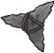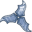
        
        
            Chatkcha
        
    
    
        
            
        
        
            Crystals
        
    
    
        
            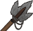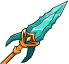
        
        
            Gythka
        
    
    
        
            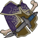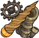
        
        
            Hunting Trophies
        
    
    
        
            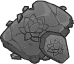
        
        
            Lotus Element
        
    
    
        
            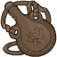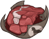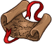
        
        
            Shaar Culture
        
    

# Feats

Unknown.

# Legendaries

Unknown.

# Adventures and Variants

**Unlock Adventure: The Missing Merchants (???)** (Complete Area 50)
> Discover the fate of some merchants in the jungles of Chult.

**Variant 1: TBD** (Complete Area 75)
> 

**Variant 2: TBD** (Complete Area 125)
> 

**Variant 3: TBD** (Complete Area 175)
> 

# Other Champion Images

    
        
            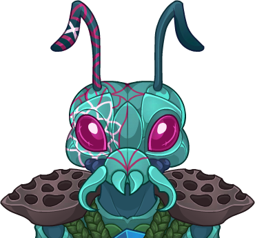Console Portrait
        
    
    
        
            Gold Chest Icon
        
        
            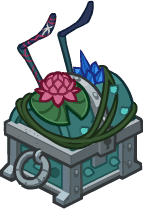Silver Chest Icon
        
    

[Back to Top](#top)

*Last Modified: {{ site.time }}*