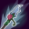
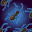
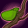
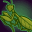
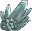
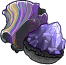
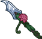
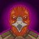

[Back to Main](index.md)

    
        
            
        
        
        Portrait
        
    
    
        
            
        
        
        Model
        
    

# Kalix

By wood, river, cavern, and vale, nomads of the Shaar spread the tale of Kalix the Exile. Gifted in combat from a young age, this thri-kreen warrior amassed a collection of trophies, garnering acclaim from the others of his tribe--the Krakk't. However, the hunter was never satisfied. He dreamed of quarry none would dare. At the Hill of Memories, during the yearly gathering, Kalix attacked the emissaries of the other tribes. None could deny his prowess. For this act, he was banished and forced to wander the world, searching for purpose. Now Kalix offers his services to all who promise a worthy hunt, and woe unto any foe he marks as his prey.

# Basic Information

Kalix will be a new champion in the Grand Revel event on 5 February 2025.

    
        
            **Seat**:
        
        
            5
        
        
            **Stat**
        
        
            **Value**
        
        
            **Day 1 Trials**
        
        
            **Patrons**
        
    
    
        
            **Species**:
        
        
            Thri-kreen
        
        
            **Strength**:
        
        
            12
        
        
            Yes
        
        
            Mirt
        
    
    
        
            **Class**:
        
        
            Ranger
        
        
            **Dexterity**:
        
        
            18
        
        
            Yes
        
        
            Vajra
        
    
    
        
            **Roles**:
        
        
            Support / Hunter
        
        
            **Constitution**:
        
        
            14
        
        
            Yes
        
        
            Strahd
        
    
    
        
            **Age**:
        
        
            16
        
        
            **Intelligence**:
        
        
            13
        
        
            Yes
        
        
            Zariel (with Feat)
        
    
    
        
            **Gender**:
        
        
            Male
        
        
            **Wisdom**:
        
        
            11
        
        
            Yes
        
        
            Elminster
        
    
    
        
            **Alignment**:
        
        
            Lawful Evil
        
        
            **Charisma**:
        
        
            11
        
        
            Yes
        
        
            &nbsp;
        
    
    
        
            **Affiliation**:
        
        
            -
        
        
            **Total**:
        
        
            79
        
        
            Champion ID:
        
        
            158
        
    

# Formation

    <svg xmlns="http://www.w3.org/2000/svg" id="Kalix" fill="#aaa" data-formationName="Kalix" data-campaignName="Grand Revel" width="340" height="160"><circle cx="215" cy="85" r="15"/><circle cx="215" cy="125" r="15"/><circle cx="175" cy="65" r="15"/><circle cx="135" cy="85" r="15"/><circle cx="135" cy="125" r="15"/><circle cx="95" cy="25" r="15"/><circle cx="95" cy="65" r="15"/><circle cx="95" cy="145" r="15"/><circle cx="55" cy="125" r="15"/><circle cx="15" cy="105" r="15"/><text x="245" y="25" fill="#dcdcdc" font-size="25" font-family="Arial" font-weight="bold">Kalix</text><text x="245" y="65" fill="#dcdcdc" font-size="15" font-family="Arial" font-weight="bold">Grand Revel</text></svg>

# Attacks

 **Base Attack: Chatkcha** (Ranged)
> Kalix throws a Chatkcha at the closest enemy, dealing 1 hit.  
> Cooldown: 3.5s (Cap 0.875s)

<em>Raw Data</em>

<pre>
{
    "id": 831,
    "name": "Chatkcha",
    "description": "Kalix throws a Chatkcha at the closest enemy, dealing 1 hit.",
    "long_description": "Kalix throws a Chatkcha at the closest enemy, dealing 1 hit.",
    "graphic_id": 0,
    "target": "front",
    "num_targets": 1,
    "aoe_radius": 0,
    "damage_modifier": 1,
    "cooldown": 3.5,
    "animations": [
        {
            "type": "ranged_attack",
            "projectile": "pd_generic_projectile",
            "shoot_offset_y": -45,
            "shoot_offset_x": 100,
            "shoot_frame": 8,
            "shoot_sound": 149,
            "hit_sound": 133,
            "projectile_details": {
                "hash": "171600443412dfa0d0e59b6f63ebcc01",
                "target_offset_y": 0,
                "projectile_speed": 2000,
                "projectile_graphic_id": 25433,
                "trail": {
                    "particle_graphic_ids": [
                        "25433"
                    ],
                    "lifespan": 0.2,
                    "spawn_rate": 25,
                    "spawn_shape_scale": {
                        "x": 0,
                        "y": 0
                    },
                    "initial_velocity": {
                        "x": 0,
                        "y": 0
                    },
                    "velocity_jitter": {
                        "x": 0,
                        "y": 0
                    },
                    "rotation_jitter": 0,
                    "alpha_lerp": {
                        "0": 0,
                        "0.1": 0.75,
                        "1": 0
                    },
                    "scale_lerp": [
                        {
                            "x": 1,
                            "y": 1
                        },
                        {
                            "x": 0,
                            "y": 0
                        }
                    ],
                    "tint": "#FFFFFF33"
                }
            }
        }
    ],
    "tags": [
        "ranged"
    ],
    "damage_types": [
        "ranged"
    ]
}
</pre>

 **Ultimate Attack: Gythka Strike** (Level: 100)
> Kalix makes 5 attacks against random enemies, dealing ultimate damage and stunning them for 5 seconds due to his paralyzing poison.  
> Cooldown: 120s (Cap 30s)

<em>Raw Data</em>

<pre>
{
    "id": 832,
    "name": "Gythka Strike",
    "description": "Kalix makes 5 attacks against random enemies, dealing ultimate damage and stunning them.",
    "long_description": "Kalix makes 5 attacks against random enemies, dealing ultimate damage and stunning them for 5 seconds due to his paralyzing poison.",
    "graphic_id": 25414,
    "target": "random",
    "num_targets": 5,
    "aoe_radius": 0,
    "damage_modifier": 0.03,
    "cooldown": 120,
    "animations": [
        {
            "type": "melee_attack",
            "animation": "split_sequence_multi_target",
            "shake_on_hit": 0.1,
            "stun_on_hit": 5,
            "can_reapply_effects_to_monsters": true,
            "sequences": [
                {
                    "start_frame": 0,
                    "damage_frame": 5,
                    "end_frame": 14,
                    "sound_frames": {
                        "2": 174
                    },
                    "target_offset_x": -70
                }
            ]
        }
    ],
    "tags": [
        "melee",
        "ultimate"
    ],
    "damage_types": [
        "ranged"
    ]
}
</pre>

# Abilities

**Thri-kreen Telepathy** (Level: 0)
> While Kalix is in the front column of any party, your active party's damage is increased by 100%. This means this ability affects your active party even if Kalix is not in your active party (as long as they're in the front-most column of their party).

<em>Raw Data</em>

<pre>
{
    "id": 16516,
    "hero_id": 158,
    "required_level": 0,
    "required_upgrade_id": 0,
    "upgrade_type": "unlock_ability",
    "effect": "effect_def,2195",
    "static_dps_mult": null,
    "default_enabled": 1,
    "name": "Thri-kreen Telepathy",
    "tip_text": "While Kalix is in the front column of any party, your active party's damage is increased, even if Kalix is in a background party!"
}
{
    "id": 2195,
    "flavour_text": "",
    "description": {
        "desc": "While Kalix is in the front column of any party, your active party's damage is increased by $(amount)%. This means this ability affects your active party even if Kalix is not in your active party (as long as they're in the front-most column of their party)."
    },
    "effect_keys": [
        {
            "effect_string": "kalix_thri_kreen_telepathy,100"
        }
    ],
    "requirements": "",
    "graphic_id": 0,
    "large_graphic_id": 0,
    "properties": {
        "is_formation_ability": true,
        "formation_circle_icon": false,
        "owner_use_outgoing_description": true,
        "indexed_effect_properties": true,
        "per_effect_index_bonuses": true,
        "default_bonus_index": 0
    }
}
</pre>

 **Mindlink** (Level: 20)
> Kalix telepathically increases the damage of all Champions not adjacent to him by 100%.

<em>Upgrade Data</em>

<pre>
Upgrades:
       90: 100%
      190: 100%
      340: 100%
      450: 100%
      560: 100%
      680: 100%
      820: 100%
      960: 100%
    1,090: 100%
    1,230: 100%
    1,370: 100%
    1,500: 100%
    1,640: 100%
    1,780: 100%
    1,910: 100%
    2,050: 100%
    2,190: 100%
    2,320: 100%
    2,450: 100%
    2,600: 100%

    Total Upgrade Bonus: 1.05e08%
</pre>

<em>Raw Data</em>

<pre>
{
    "id": 16517,
    "hero_id": 158,
    "required_level": 20,
    "required_upgrade_id": 0,
    "upgrade_type": "unlock_ability",
    "effect": "effect_def,2196",
    "static_dps_mult": null,
    "default_enabled": 1,
    "name": "Mindlink"
}
{
    "id": 2196,
    "flavour_text": "",
    "description": {
        "desc": "Kalix telepathically increases the damage of all Champions not adjacent to him by $(amount)%."
    },
    "effect_keys": [
        {
            "effect_string": "hero_dps_multiplier_mult,100",
            "targets": [
                "non_adj"
            ],
            "slot_change_updates_targets": true,
            "amount_updated_listeners": [
                "slot_changed",
                "upgrade_unlocked"
            ]
        }
    ],
    "requirements": "",
    "graphic_id": 25407,
    "large_graphic_id": 25401,
    "properties": {
        "is_formation_ability": true,
        "formation_circle_icon": true,
        "owner_use_outgoing_description": true,
        "indexed_effect_properties": true,
        "per_effect_index_bonuses": true,
        "default_bonus_index": 0
    }
}
{
    "id": 16525,
    "hero_id": 158,
    "required_level": 90,
    "required_upgrade_id": 0,
    "upgrade_type": "upgrade_ability",
    "effect": "buff_upgrade,100,16517",
    "static_dps_mult": null,
    "default_enabled": 1,
    "name": ""
}
{
    "id": 16560,
    "hero_id": 158,
    "required_level": 190,
    "required_upgrade_id": 0,
    "upgrade_type": "upgrade_ability",
    "effect": "buff_upgrade,100,16517",
    "static_dps_mult": null,
    "default_enabled": 1,
    "name": ""
}
{
    "id": 16562,
    "hero_id": 158,
    "required_level": 340,
    "required_upgrade_id": 0,
    "upgrade_type": "upgrade_ability",
    "effect": "buff_upgrade,100,16517",
    "static_dps_mult": null,
    "default_enabled": 1,
    "name": ""
}
{
    "id": 16564,
    "hero_id": 158,
    "required_level": 450,
    "required_upgrade_id": 0,
    "upgrade_type": "upgrade_ability",
    "effect": "buff_upgrade,100,16517",
    "static_dps_mult": null,
    "default_enabled": 1,
    "name": ""
}
{
    "id": 16565,
    "hero_id": 158,
    "required_level": 560,
    "required_upgrade_id": 0,
    "upgrade_type": "upgrade_ability",
    "effect": "buff_upgrade,100,16517",
    "static_dps_mult": null,
    "default_enabled": 1,
    "name": ""
}
{
    "id": 16566,
    "hero_id": 158,
    "required_level": 680,
    "required_upgrade_id": 0,
    "upgrade_type": "upgrade_ability",
    "effect": "buff_upgrade,100,16517",
    "static_dps_mult": null,
    "default_enabled": 1,
    "name": ""
}
{
    "id": 16568,
    "hero_id": 158,
    "required_level": 820,
    "required_upgrade_id": 0,
    "upgrade_type": "upgrade_ability",
    "effect": "buff_upgrade,100,16517",
    "static_dps_mult": null,
    "default_enabled": 1,
    "name": ""
}
{
    "id": 16569,
    "hero_id": 158,
    "required_level": 960,
    "required_upgrade_id": 0,
    "upgrade_type": "upgrade_ability",
    "effect": "buff_upgrade,100,16517",
    "static_dps_mult": null,
    "default_enabled": 1,
    "name": ""
}
{
    "id": 16571,
    "hero_id": 158,
    "required_level": 1090,
    "required_upgrade_id": 0,
    "upgrade_type": "upgrade_ability",
    "effect": "buff_upgrade,100,16517",
    "static_dps_mult": null,
    "default_enabled": 1,
    "name": ""
}
{
    "id": 16573,
    "hero_id": 158,
    "required_level": 1230,
    "required_upgrade_id": 0,
    "upgrade_type": "upgrade_ability",
    "effect": "buff_upgrade,100,16517",
    "static_dps_mult": null,
    "default_enabled": 1,
    "name": ""
}
{
    "id": 16574,
    "hero_id": 158,
    "required_level": 1370,
    "required_upgrade_id": 0,
    "upgrade_type": "upgrade_ability",
    "effect": "buff_upgrade,100,16517",
    "static_dps_mult": null,
    "default_enabled": 1,
    "name": ""
}
{
    "id": 16576,
    "hero_id": 158,
    "required_level": 1500,
    "required_upgrade_id": 0,
    "upgrade_type": "upgrade_ability",
    "effect": "buff_upgrade,100,16517",
    "static_dps_mult": null,
    "default_enabled": 1,
    "name": ""
}
{
    "id": 16577,
    "hero_id": 158,
    "required_level": 1640,
    "required_upgrade_id": 0,
    "upgrade_type": "upgrade_ability",
    "effect": "buff_upgrade,100,16517",
    "static_dps_mult": null,
    "default_enabled": 1,
    "name": ""
}
{
    "id": 16579,
    "hero_id": 158,
    "required_level": 1780,
    "required_upgrade_id": 0,
    "upgrade_type": "upgrade_ability",
    "effect": "buff_upgrade,100,16517",
    "static_dps_mult": null,
    "default_enabled": 1,
    "name": ""
}
{
    "id": 16580,
    "hero_id": 158,
    "required_level": 1910,
    "required_upgrade_id": 0,
    "upgrade_type": "upgrade_ability",
    "effect": "buff_upgrade,100,16517",
    "static_dps_mult": null,
    "default_enabled": 1,
    "name": ""
}
{
    "id": 16582,
    "hero_id": 158,
    "required_level": 2050,
    "required_upgrade_id": 0,
    "upgrade_type": "upgrade_ability",
    "effect": "buff_upgrade,100,16517",
    "static_dps_mult": null,
    "default_enabled": 1,
    "name": ""
}
{
    "id": 16584,
    "hero_id": 158,
    "required_level": 2190,
    "required_upgrade_id": 0,
    "upgrade_type": "upgrade_ability",
    "effect": "buff_upgrade,100,16517",
    "static_dps_mult": null,
    "default_enabled": 1,
    "name": ""
}
{
    "id": 16586,
    "hero_id": 158,
    "required_level": 2320,
    "required_upgrade_id": 0,
    "upgrade_type": "upgrade_ability",
    "effect": "buff_upgrade,100,16517",
    "static_dps_mult": null,
    "default_enabled": 1,
    "name": ""
}
{
    "id": 16587,
    "hero_id": 158,
    "required_level": 2450,
    "required_upgrade_id": 0,
    "upgrade_type": "upgrade_ability",
    "effect": "buff_upgrade,100,16517",
    "static_dps_mult": null,
    "default_enabled": 1,
    "name": ""
}
{
    "id": 16589,
    "hero_id": 158,
    "required_level": 2600,
    "required_upgrade_id": 0,
    "upgrade_type": "upgrade_ability",
    "effect": "buff_upgrade,100,16517",
    "static_dps_mult": null,
    "default_enabled": 1,
    "name": ""
}
</pre>

 **Unorthodox Alliance** (Level: 70)
> Kalix gains an Ally stack for each Champion in the formation that is not a Standard species. He increases the effect of Mindlink by 100% for each Ally stack, stacking multiplicatively. Standard species are Aasimar, Dragonborn, Dwarf, Elf, Gnome, Goliath, Halfling, Human, Orc, Tiefling, Half-Orc, and Half-Elf.

ⓘ *Note: This ability is prestack.*

<em>Raw Data</em>

<pre>
{
    "id": 16518,
    "hero_id": 158,
    "required_level": 70,
    "required_upgrade_id": 0,
    "upgrade_type": "unlock_ability",
    "effect": "effect_def,2197",
    "static_dps_mult": null,
    "default_enabled": 1,
    "name": "Unorthodox Alliance",
    "tip_text": "Kalix buffs Champions not next to him, and these buffs increase based on the number of Champions that are not a Standard species."
}
{
    "id": 2197,
    "flavour_text": "",
    "description": {
        "desc": "Kalix gains an Ally stack for each Champion in the formation that is not a Standard species. He increases the effect of Mindlink by $(amount)% for each Ally stack, stacking multiplicatively. Standard species are Aasimar, Dragonborn, Dwarf, Elf, Gnome, Goliath, Halfling, Human, Orc, Tiefling, Half-Orc, and Half-Elf."
    },
    "effect_keys": [
        {
            "effect_string": "pre_stack,100",
            "off_when_benched": true
        },
        {
            "effect_string": "buff_upgrade,100,16517",
            "amount_expr": "upgrade_amount(16518,0)",
            "amount_func": "mult",
            "stack_func": "per_hero_attribute",
            "per_hero_expr": "has_non_standard_race + (as_int(GetUpgradeUnlocked(16521)) * is_most_common_race)",
            "amount_updated_listeners": [
                "slot_changed",
                "hero_tags_changed",
                "upgrade_unlocked"
            ],
            "show_bonus": true,
            "off_when_benched": true
        },
        {
            "effect_string": "expression_on_trigger,area_complete",
            "per_trigger_expr": "AppendToSaveStat(`kalix_unorthodox_areas_completed`, false, trigger_count * as_int(GetUpgradeStacks(16518, 1) >= 10))"
        }
    ],
    "requirements": "",
    "graphic_id": 25409,
    "large_graphic_id": 25403,
    "properties": {
        "is_formation_ability": true,
        "formation_circle_icon": false,
        "owner_use_outgoing_description": true,
        "indexed_effect_properties": true,
        "per_effect_index_bonuses": true,
        "default_bonus_index": 0
    }
}
</pre>

 **Chameleon Carapace** (Level: 120)
> Enemies that attempt to choose Kalix as a target do not, and instead choose to attack another Champion, assuming another valid target exists. The effect of Mindlink is increased by 100% each time this triggers, stacking multiplicatively up to 25 times and resetting when changing areas.

<em>Raw Data</em>

<pre>
{
    "id": 16519,
    "hero_id": 158,
    "required_level": 120,
    "required_upgrade_id": 0,
    "upgrade_type": "unlock_ability",
    "effect": "effect_def,2198",
    "static_dps_mult": null,
    "default_enabled": 1,
    "name": "Chameleon Carapace"
}
{
    "id": 2198,
    "flavour_text": "",
    "description": {
        "conditions": [
            {
                "condition": "upgrade_purchased 16522",
                "desc": "Enemies that attempt to choose Kalix as a target do not, and instead choose to attack another Champion, assuming another valid target exists. The effect of Mindlink is increased by $(not_buffed amount)% each time this triggers, stacking multiplicatively up to $max_stacks times and losing $(stack_percentage_lost_on_area_change___2)% of stacks when changing areas."
            },
            {
                "desc": "Enemies that attempt to choose Kalix as a target do not, and instead choose to attack another Champion, assuming another valid target exists. The effect of Mindlink is increased by $(not_buffed amount)% each time this triggers, stacking multiplicatively up to $max_stacks times and resetting when changing areas."
            }
        ]
    },
    "effect_keys": [
        {
            "effect_string": "buff_upgrade,100,16517",
            "stacks_on_trigger": "will_stack_manually",
            "max_stacks": 25,
            "stacks_multiply": true,
            "show_bonus": true
        },
        {
            "effect_string": "kalix_chameleon_carapace",
            "stack_percentage_lost_on_area_change": 100,
            "buff_effect_key_index": 0
        },
        {
            "effect_string": "reverse_taunt",
            "buff_effect_key_index": 0
        }
    ],
    "requirements": "",
    "graphic_id": 25406,
    "large_graphic_id": 25400,
    "properties": {
        "is_formation_ability": true,
        "formation_circle_icon": false,
        "owner_use_outgoing_description": true,
        "indexed_effect_properties": true,
        "per_effect_index_bonuses": true,
        "default_bonus_index": 0,
        "retain_on_slot_changed": true
    }
}
</pre>

 **The Deadliest Prey** (Level: 160)
> Humanoids are Kalix's favorite foe. All Champions deal 400% additional damage against Kalix's favored foes.

<em>Raw Data</em>

<pre>
{
    "id": 16520,
    "hero_id": 158,
    "required_level": 160,
    "required_upgrade_id": 0,
    "upgrade_type": "unlock_ability",
    "effect": "effect_def,2199",
    "static_dps_mult": null,
    "default_enabled": 1,
    "name": "The Deadliest Prey"
}
{
    "id": 2199,
    "flavour_text": "",
    "description": {
        "desc": "Humanoids are Kalix's favorite foe. All Champions deal $(amount___2)% additional damage against Kalix's favored foes."
    },
    "effect_keys": [
        {
            "effect_string": "favored_foe,humanoid",
            "off_when_benched": true
        },
        {
            "effect_string": "increase_damage_against_monster,400",
            "monster_is_favored_foe_of_effect_owner": true,
            "targets": [
                "all"
            ],
            "off_when_benched": true,
            "override_key_desc": "$target does $amount% more damage against Kalix's Favored Foes"
        }
    ],
    "requirements": "",
    "graphic_id": 25408,
    "large_graphic_id": 25402,
    "properties": {
        "is_formation_ability": true,
        "formation_circle_icon": true,
        "owner_use_outgoing_description": true,
        "indexed_effect_properties": true,
        "per_effect_index_bonuses": true,
        "default_bonus_index": 0
    }
}
</pre>

# Specialisations

 **Strength in Numbers** (Level: 240)
> The most represented species in your formation grant additional Ally stacks for Unorthodox Alliance (even if it is not a Standard species). In the case of a tie, Champions from all tied species grant an additional Ally stack.

<em>Raw Data</em>

<pre>
{
    "id": 16521,
    "hero_id": 158,
    "required_level": 240,
    "required_upgrade_id": 0,
    "upgrade_type": "unlock_ability",
    "effect": "effect_def,2200",
    "static_dps_mult": null,
    "default_enabled": 1,
    "name": "Strength in Numbers",
    "specialization_name": "Strength in Numbers",
    "specialization_description": "Kalix aligns himself with one well represented species, making his telepathic bond with his allies even stronger.",
    "specialization_graphic_id": 25413
}
{
    "id": 2200,
    "flavour_text": "",
    "description": {
        "desc": "The most represented species in your formation grant additional Ally stacks for Unorthodox Alliance (even if it is not a Standard species). In the case of a tie, Champions from all tied species grant an additional Ally stack.",
        "post": {
            "conditions": [
                {
                    "condition": "not static_desc",
                    "desc": "^^Most Represented Species: $(most_common_race)"
                }
            ]
        }
    },
    "effect_keys": [
        {
            "effect_string": "do_nothing,1",
            "amount_func": "add",
            "stack_func": "per_hero_attribute",
            "per_hero_expr": "is_most_common_race",
            "stack_title": "Bonus Stacks",
            "amount_updated_listeners": [
                "slot_changed",
                "hero_tags_changed"
            ],
            "show_bonus": true,
            "hide_stack_description": true,
            "total_title": "Bonus Stacks",
            "show_stack_type": false,
            "percent_values": false,
            "off_when_benched": true
        }
    ],
    "requirements": "",
    "graphic_id": 0,
    "large_graphic_id": 0,
    "properties": {
        "is_formation_ability": true,
        "formation_circle_icon": false,
        "owner_use_outgoing_description": true,
        "indexed_effect_properties": true,
        "per_effect_index_bonuses": true,
        "default_bonus_index": 0
    }
}
</pre>

 **Creative Camouflage** (Level: 240)
> The maximum stacks of Chameleon Carapace are doubled, and 50% of the current stacks are not reset when you change areas.

<em>Raw Data</em>

<pre>
{
    "id": 16522,
    "hero_id": 158,
    "required_level": 240,
    "required_upgrade_id": 0,
    "upgrade_type": "unlock_ability",
    "effect": "effect_def,2201",
    "static_dps_mult": null,
    "default_enabled": 1,
    "name": "Creative Camouflage",
    "specialization_name": "Creative Camouflage",
    "specialization_description": "Kalix improves his camouflage skills, making him a more dangerous threat when he is frequently attacked.",
    "specialization_graphic_id": 25411
}
{
    "id": 2201,
    "flavour_text": "",
    "description": {
        "desc": "The maximum stacks of Chameleon Carapace are doubled, and 50% of the current stacks are not reset when you change areas."
    },
    "effect_keys": [
        {
            "effect_string": "change_upgrade_data,16519,0",
            "data": {
                "max_stacks": 50
            },
            "description": "The maximum stacks of Chameleon Carapace are doubled, and 50% of the current stacks are not reset when you change areas."
        },
        {
            "effect_string": "change_upgrade_data,16519,1",
            "data": {
                "stack_percentage_lost_on_area_change": 50
            },
            "description": ""
        }
    ],
    "requirements": "",
    "graphic_id": 0,
    "large_graphic_id": 0,
    "properties": {
        "is_formation_ability": true,
        "formation_circle_icon": false,
        "owner_use_outgoing_description": true,
        "indexed_effect_properties": true,
        "per_effect_index_bonuses": true,
        "default_bonus_index": 0
    }
}
</pre>

 **One For You, One For Me** (Level: 240)
> Kalix gains the Speed role and each time a monster spawns that is not his favored foe, one or more favored foes simultaneously spawn. The effect of The Deadliest Prey is also increased by 400%.

<em>Raw Data</em>

<pre>
{
    "id": 16523,
    "hero_id": 158,
    "required_level": 240,
    "required_upgrade_id": 0,
    "upgrade_type": "unlock_ability",
    "effect": "effect_def,2202",
    "static_dps_mult": null,
    "default_enabled": 1,
    "name": "One For You, One For Me",
    "specialization_name": "One For You, One For Me",
    "specialization_description": "Kalix concentrates on his hunting abilities, quickly tracking down his favored foes and making them more vulnerable to damage.",
    "specialization_graphic_id": 25412
}
{
    "id": 2202,
    "flavour_text": "",
    "description": {
        "desc": "Kalix gains the Speed role and each time a monster spawns that is not his favored foe, one or more favored foes simultaneously spawn. The effect of The Deadliest Prey is also increased by 400%."
    },
    "effect_keys": [
        {
            "effect_string": "add_hero_tags,0,speed"
        },
        {
            "effect_string": "buff_upgrade,400,16520,1",
            "show_bonus": true
        },
        {
            "effect_string": "kalix_one_for_you_one_for_me",
            "favored_monsters": {
                "humanoid": [
                    1229,
                    1230,
                    1231
                ],
                "celestial": [
                    2237,
                    2238,
                    2239
                ],
                "construct": [
                    636,
                    637,
                    638
                ],
                "ooze": [
                    1993,
                    1994,
                    1995
                ]
            }
        }
    ],
    "requirements": "",
    "graphic_id": 0,
    "large_graphic_id": 0,
    "properties": {
        "is_formation_ability": true,
        "formation_circle_icon": false,
        "owner_use_outgoing_description": true,
        "indexed_effect_properties": true,
        "per_effect_index_bonuses": true,
        "default_bonus_index": 0
    }
}
</pre>

# Items

    
        
            **Icons**
        
        
            **Slot**
        
        
            **Epic Name**
        
        
            **Effect**
        
    
    
        
            ID: 3746**Rough Hewn Chatkcha**Suitable for practice, not for a true challenge.<code>global_dps_multiplier_mult,10 allow_ge:true</code>ID: 3747**Pitchstone Chatkcha**Obsidian of low quality is acceptable for a hunt of the same.<code>global_dps_multiplier_mult,65 allow_ge:true</code>ID: 3748**Hamaad Chatkcha**A Calishite fool once hunted me for revenge. I made this from her steel.<code>global_dps_multiplier_mult,120 allow_ge:true</code>ID: 3749**Ka'eth'rek**This word means Blade Eye. It is a reminder to always look sharp.<code>global_dps_multiplier_mult,230 allow_ge:true</code>&nbsp;
        
        
            1
        
        
            Ka'eth'rek
        
        
            All Champion Damage
        
    
    
        
            ID: 3750**Paper Flower**Childish ephemera, but this shape is pleasing to me.<code>buff_upgrade,25,16516 allow_ge:false</code>ID: 3751**Alluring Bloom**I found this on the first day of my exile. It sings so sweetly in my mind.<code>buff_upgrade,87.5,16516 allow_ge:false</code>ID: 3752**Ancient Symbol**The mark of the Celestial Lotus. I will know its words. I will sing its song.<code>buff_upgrade,150,16516 allow_ge:false</code>ID: 3753**Lyric of the Eternal Lotus**I am its keeper. I am worthy. It will find another when I am gone.<code>buff_upgrade,275,16516 allow_ge:false</code>
        
        
            2
        
        
            Lyric of the Eternal Lotus
        
        
            Thri-kreen Telepathy
        
    
    
        
            ID: 3754**Drab Mineral**There is no power here, but that too is worth knowing.<code>buff_upgrade,25,16517,0 allow_ge:false</code>ID: 3755**Worked Quartz**Simple crystal stimulates curiosity. This is useful for new journeys.<code>buff_upgrade,87.5,16517,0 allow_ge:false</code>ID: 3756**Precious Gemstones**Ruby for skill, fortune, vengeance. Sapphire for the mind, magic, and mourning.<code>buff_upgrade,150,16517,0 allow_ge:false</code>ID: 3757**Psionic Foci**Amethyst for logic. Rainbow obsidian for power. For intention. For the kill.<code>buff_upgrade,275,16517,0 allow_ge:false</code>
        
        
            3
        
        
            Psionic Foci
        
        
            Mindlink
        
    
    
        
            ID: 3758**Empty Flask**It is an insult to be given this. It means leave and never return.<code>buff_upgrade,10,16518,0 allow_ge:false</code>ID: 3759**Filled Canteen**Water is life. All who wander the Shaar know this.<code>buff_upgrade,30,16518,0 allow_ge:false</code>ID: 3760**Gourmet Rations**The flesh of the dire horse is a delicacy among my kind. You must try it. Now.<code>buff_upgrade,50,16518,0 allow_ge:false</code>ID: 3761**Nomad's Pride**I made this. I charted the Shaar. Every shadow, every step. I know this land.<code>buff_upgrade,100,16518,0 allow_ge:false</code>
        
        
            4
        
        
            Nomad's Pride
        
        
            Unorthodox Alliance (Prestack)
        
    
    
        
            ID: 3762**Old Prey**I do not remember this kill. Perhaps another will refresh my memory.<code>buff_upgrade,25,16519,0 allow_ge:false</code>ID: 3763**Fresh Quarry**Do not mindlink with me until I've had my morning hunt.<code>buff_upgrade,87.5,16519,0 allow_ge:false</code>ID: 3764**Grim Trophies**They thought they were safe. There is no such thing.<code>buff_upgrade,150,16519,0 allow_ge:false</code>ID: 3765**Exotic Remnants**They were beautiful to behold. Magnificent. I brought them a suitable end.<code>buff_upgrade,275,16519,0 allow_ge:false</code>
        
        
            5
        
        
            Exotic Remnants
        
        
            Chameleon Carapace
        
    
    
        
            ID: 3766**Crude Stone Gythka**The young train with these. My first weapon, for my first hunt.<code>reduce_ultimate_cooldown,3 allow_ge:false</code>ID: 3767**Pitchstone Gythka**To hold the gythka is an honor. To learn it, a promise. To master it, a life.<code>reduce_ultimate_cooldown,6 allow_ge:false</code>ID: 3768**Solbar Gythka**To hunt a sultan of Calimshan, this was my payment, and his demise.<code>reduce_ultimate_cooldown,12 allow_ge:false</code>ID: 3769**Drak'en'raa**This word means Pathless. It hurt me once. Now it is mine to wield.<code>reduce_ultimate_cooldown,30 allow_ge:false</code>
        
        
            6
        
        
            Drak'en'raa
        
        
            Ultimate Cooldown Reduction Cap: 501 dull / 251 shiny / 126 golden.
        
    

<em>Item Names and Descriptions</em>

<pre>
Slot 1:
       Rough Hewn Chatkcha: Suitable for practice, not for a true challenge.
       Pitchstone Chatkcha: Obsidian of low quality is acceptable for a hunt of the same.
           Hamaad Chatkcha: A Calishite fool once hunted me for revenge. I made this from her
                            steel.
                Ka'eth'rek: This word means Blade Eye. It is a reminder to always look sharp.

Slot 2:
              Paper Flower: Childish ephemera, but this shape is pleasing to me.
            Alluring Bloom: I found this on the first day of my exile. It sings so sweetly in
                            my mind.
            Ancient Symbol: The mark of the Celestial Lotus. I will know its words. I will sing
                            its song.
Lyric of the Eternal Lotus: I am its keeper. I am worthy. It will find another when I am gone.

Slot 3:
              Drab Mineral: There is no power here, but that too is worth knowing.
             Worked Quartz: Simple crystal stimulates curiosity. This is useful for new
                            journeys.
        Precious Gemstones: Ruby for skill, fortune, vengeance. Sapphire for the mind, magic,
                            and mourning.
              Psionic Foci: Amethyst for logic. Rainbow obsidian for power. For intention. For
                            the kill.

Slot 4:
               Empty Flask: It is an insult to be given this. It means leave and never return.
            Filled Canteen: Water is life. All who wander the Shaar know this.
           Gourmet Rations: The flesh of the dire horse is a delicacy among my kind. You must
                            try it. Now.
             Nomad's Pride: I made this. I charted the Shaar. Every shadow, every step. I know
                            this land.

Slot 5:
                  Old Prey: I do not remember this kill. Perhaps another will refresh my
                            memory.
              Fresh Quarry: Do not mindlink with me until I've had my morning hunt.
             Grim Trophies: They thought they were safe. There is no such thing.
           Exotic Remnants: They were beautiful to behold. Magnificent. I brought them a
                            suitable end.

Slot 6:
        Crude Stone Gythka: The young train with these. My first weapon, for my first hunt.
         Pitchstone Gythka: To hold the gythka is an honor. To learn it, a promise. To master
                            it, a life.
             Solbar Gythka: To hunt a sultan of Calimshan, this was my payment, and his demise.
               Drak'en'raa: This word means Pathless. It hurt me once. Now it is mine to wield.
</pre>

 

# Feats

This list will only show feats that are going to be available on the release of this champion. The separate [Feats](feats.md) page may show others that could be available later if they exist.

    
        
            **Feat**
        
        
            **Effect**
        
        
            **Source**
        
    
    
        
            ID: 2063**Selflessness (Kalix)**The clutch is all. My first lesson. I have not forgotten.<code>global_dps_multiplier_mult,10</code>Selflessness
        
        
            10% All Champion Damage
        
        
            Free
        
    
    
        
            ID: 2064**Inspiring Leader (Kalix)**Are you predator, or prey? Join me. Learn. The hunt welcomes all.<code>global_dps_multiplier_mult,25</code>Inspiring Leader
        
        
            25% All Champion Damage
        
        
            Gold Chest
        
    
    
        
            ID: 2065**Psionic Talent (Kalix)**I see into your mind. I sense your weakness. I know your strength.<code>buff_upgrade,80,16516,0</code>Psionic Talent
        
        
            80% Thri-kreen Telepathy
        
        
            3,830 Platinum
        
    
    
        
            ID: 2066**Expanded Awareness (Kalix)**I need not speak your tongue to know your ways.<code>buff_upgrade,20,16517,0</code>Expanded Awareness
        
        
            20% Mindlink
        
        
            Free
        
    
    
        
            ID: 2067**Mental Discipline (Kalix)**Thoughts are like blades. They can be sharpened.<code>buff_upgrade,40,16517,0</code>Mental Discipline
        
        
            40% Mindlink
        
        
            12,500 Gems
        
    
    
        
            ID: 2068**Eclectic Collective (Kalix)**Prove to me your prowess, and I shall call you kin.<code>buff_upgrade,40,16518,0</code>Eclectic Collective
        
        
            40% Unorthodox Alliance (Prestack)
        
        
            12,500 Gems
        
    
    
        
            ID: 2069**Hidden Danger (Kalix)**To become unseen is to become their undoing.<code>buff_upgrade,20,16519,0</code>Hidden Danger
        
        
            20% Chameleon Carapace
        
        
            Free
        
    
    
        
            ID: 2070**Last Surprise (Kalix)**They never see it coming.<code>buff_upgrade,40,16519,0</code>Last Surprise
        
        
            40% Chameleon Carapace
        
        
            Gold Chest
        
    
    
        
            ID: 2071**Common Quarry (Kalix)**They are all prey. I permit them to prove me wrong.<code>buff_upgrade,20,16520,1</code>Common Quarry
        
        
            20% The Deadliest Prey
        
        
            Free
        
    
    
        
            ID: 2072**Hunt the Civilized (Kalix)**I have tested them many times. All have failed.<code>buff_upgrade,40,16520,1</code>Hunt the Civilized
        
        
            40% The Deadliest Prey
        
        
            12,500 Gems
        
    
    
        
            ID: 2073**Hunt the Divine (Kalix)**They think themselves above us all. I will bring them low.<code>favored_foe,celestial</code>Hunt the Divine
        
        
            +Celestial as Favoured Foe
        
        
            Gold Chest
        
    
    
        
            ID: 2074**Hunt the Bound (Kalix)**I will break them into pieces. I will scatter their remains.<code>favored_foe,construct</code>Hunt the Bound
        
        
            +Construct as Favoured Foe
        
        
            Event Bonus
        
    
    
        
            ID: 2075**Hunt the Amorphous (Kalix)**A lack of anatomy is a false shield. I will destroy them, utterly.<code>favored_foe,ooze</code>Hunt the Amorphous
        
        
            +Ooze as Favoured Foe
        
        
            12,500 Gems
        
    
    
        
            ID: 2076**Entertainer (Kalix)**Hunting is an art. Death, a spectacle. Are you not entertained?<code>increase_ability_score,cha,2</code>Entertainer
        
        
            Stat: +2 Charisma
        
        
            Event Bonus
        
    

# Legendaries

* Increases the damage of all Champions by 100%.
* Increases the damage of all Female Champions by 125%.
* Increases the damage of all Champions by 40% for each Champion in the formation with a EVIL alignment.
* Increases the damage of all Champions with a DEX score of 11 or higher by 100%.
* Increases the damage of all Champions by 20% for each Champion with a CHA score of 11 or higher in the formation.
* Increases the damage of all Ranged Champions by 150%.

<em>DPS Applicable</em>

<pre>
        Arkhan: 4 / 6
       Artemis: 4 / 6
       Asharra: 5 / 6
         Azaka: 5 / 6
Beadle & Grimm: 4 / 6
        Binwin: 3 / 6
      Birdsong: 5 / 6
   Black Viper: 5 / 6
         Bobby: 4 / 6
    Catti-brie: 6 / 6
        D'hani: 5 / 6
     Dark Urge: 4 / 6
        Delina: 5 / 6
        Drizzt: 4 / 6
       Farideh: 5 / 6
           Fen: 5 / 6
        Gromma: 4 / 6
          Ishi: 5 / 6
       Jaheira: 5 / 6
       Jamilah: 5 / 6
      Jarlaxle: 4 / 6
           Jim: 4 / 6
       Karlach: 5 / 6
           Kas: 4 / 6
          Kent: 4 / 6
         Krond: 4 / 6
          Krux: 5 / 6
       Lae'zel: 5 / 6
        Lucius: 4 / 6
         Makos: 3 / 6
         Minsc: 4 / 6
         NERDS: 4 / 6
        Nahara: 5 / 6
         Nixie: 5 / 6
        Orisha: 5 / 6
         Rosie: 5 / 6
         Strix: 5 / 6
       Torogar: 4 / 6
        Warden: 4 / 6
       Warduke: 4 / 6
          Wren: 5 / 6
        Yorven: 4 / 6
         Zorbu: 5 / 6
</pre>

<em>Non-DPS Applicable</em>

<pre>
          Aeon: 5 / 6
          Aila: 5 / 6
       Alyndra: 5 / 6
       Antrius: 4 / 6
      Astarion: 5 / 6
         Avren: 4 / 6
          BBEG: 4 / 6
       Baeloth: 4 / 6
      Barrowin: 5 / 6
        Beadle: 4 / 6
       Blooshi: 5 / 6
          Brig: 4 / 6
       Bruenor: 3 / 6
       Celeste: 4 / 6
       Corazón: 4 / 6
        Deekin: 5 / 6
       Desmond: 4 / 6
         Diana: 5 / 6
           Dob: 4 / 6
        Donaar: 3 / 6
    Dragonbait: 4 / 6
Dungeon Master: 4 / 6
      Dynaheir: 6 / 6
        Egbert: 5 / 6
      Ellywick: 5 / 6
          Eric: 4 / 6
        Evelyn: 5 / 6
     Ezmerelda: 5 / 6
        Freely: 4 / 6
          Gale: 4 / 6
       Gazrick: 3 / 6
        Halsin: 4 / 6
       Havilar: 5 / 6
      Hew Maan: 6 / 6
         Hitch: 4 / 6
         Imoen: 6 / 6
      Jang Sao: 6 / 6
      K'thriss: 4 / 6
         Kalix: 5 / 6
         Korth: 4 / 6
         Krull: 4 / 6
        Krydle: 4 / 6
       Lazaapz: 5 / 6
         Mehen: 3 / 6
          Melf: 4 / 6
      Merilwen: 5 / 6
      Minthara: 5 / 6
         Miria: 5 / 6
        Môrgæn: 6 / 6
        Nayeli: 5 / 6
         Nerys: 5 / 6
        Nordom: 5 / 6
          Nova: 5 / 6
         Nrakk: 4 / 6
          Omin: 3 / 6
        Orkira: 5 / 6
       Paultin: 5 / 6
      Penelope: 5 / 6
        Presto: 3 / 6
     Ravengard: 4 / 6
         Regis: 4 / 6
          Reya: 5 / 6
          Rust: 4 / 6
        Selise: 5 / 6
        Sentry: 4 / 6
     Sgt. Knox: 4 / 6
   Shadowheart: 5 / 6
         Shaka: 4 / 6
       Shandie: 6 / 6
      Sisaspia: 5 / 6
        Solaak: 5 / 6
         Spurt: 5 / 6
         Stoki: 5 / 6
   Strongheart: 4 / 6
         Talin: 4 / 6
       Tatyana: 5 / 6
      Thellora: 5 / 6
        Turiel: 4 / 6
         Tyril: 4 / 6
       Ulkoria: 5 / 6
       Umberto: 3 / 6
         Uriah: 3 / 6
            Vi: 6 / 6
      Vin Ursa: 6 / 6
        Virgil: 4 / 6
       Vlahnya: 5 / 6
      Voronika: 5 / 6
        Walnut: 5 / 6
        Widdle: 5 / 6
       Wulfgar: 4 / 6
          Wyll: 4 / 6
      Xerophon: 4 / 6
</pre>

 

# Adventures and Variants

**Unlock Adventure: The Missing Merchants (Kalix)** (Complete Area 50)
> Discover the fate of some merchants in the jungles of Chult.

 **Variant 1: The Hunter from Shaar** (Complete Area 75)
> Kalix starts in the formation. He can be moved, but not removed.  
> Only Kalix and Champions not adjacent to him can deal damage.  
> 1-2 Drow Rangers spawn with each wave. They don't drop gold nor count towards quest progress.  
> Getting to Know Kalix: This Thri-kreen Ranger uses his natural telepathic abilities to buff Champions that are NOT next to him. Build your formation to take the best advantage of this!

 **Variant 2: Secondary Sources** (Complete Area 125)
> Kalix starts in the formation. He can be moved, but not removed.  
> You may only use Core Champions and/or Champions that are not a Standard Species. Standard species are Aasimar, Dragonborn, Dwarf, Elf, Gnome, Goliath, Halfling, Human, Orc, Tiefling, Half-Orc, and Half-Elf.  
> Getting to Know Kalix: Kalix thrives alongside Champions of exceptional origin. Which unorthodox team of heroes will you use?

 **Variant 3: Front and Center** (Complete Area 175)
> Kalix starts in the formation. He can't be moved or removed.  
> Only Kalix and Champions from the most represented species in the formation may deal damage.  
> 1-2 ranged Astral Elf Warriors spawn with each wave and attack twice as fast as normal enemies. They don't drop gold nor count towards quest progress.   
> Getting to Know Kalix: Kalix buffs your active adventuring party whenever he's in the front column, even when he's hanging out in a background party. His chameleon carapace will protect him as long as he is sharing the front column with a tanking Champion!

# Other Champion Images

    
        
            Console Portrait
        
    
    
        
            Gold Chest Icon
        
        
            Silver Chest Icon
        
    

[Back to Top](#top)

*Last Modified: {{ site.time }}*