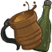
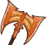
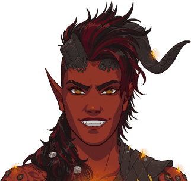

[Back to Main](index.md)

    
        Portait
    
    
        Base Model
    
    
        Rage Model
    

# Karlach

Freshly escaped from Hell, Karlach is finally free of the Archdevil Zariel - but not from the infernal engine Zariel planted in her chest. With her first taste of freedom in ten years, Karlach is eager to find a fix for the engine that's burning hotter and hotter before it burns her out completely. But even more premiere in her mind? Exploring, finding like-minded travelers, falling in love (or lust)... and taking revenge on the man who sold her to Zariel all those years ago.

# Basic Information

Karlach will be the new champion in the Midwinter event on 10 January 2024.

    
        
            **Seat**:
        
        
            4
        
        
            **Stat**
        
        
            **Value**
        
        
            **Day 1 Trials**
        
        
            **Patrons**
        
    
    
        
            **Race**:
        
        
            Tiefling
        
        
            **Strength**:
        
        
            15
        
        
            Yes
        
        
            Mirt
        
    
    
        
            **Class**:
        
        
            Barbarian
        
        
            **Dexterity**:
        
        
            13
        
        
            Yes
        
        
            Vajra
        
    
    
        
            **Roles**:
        
        
            DPS / Support / Tanking
        
        
            **Constitution**:
        
        
            14
        
        
            Yes
        
        
            -
        
    
    
        
            **Age**:
        
        
            30
        
        
            **Intelligence**:
        
        
            9
        
        
            -
        
        
            Zariel
        
    
    
        
            **Gender**:
        
        
            Female
        
        
            **Wisdom**:
        
        
            12
        
        
            Yes
        
        
            &nbsp;
        
    
    
        
            **Alignment**:
        
        
            Chaotic Good
        
        
            **Charisma**:
        
        
            12
        
        
            Yes
        
        
            &nbsp;
        
    
    
        
            **Affiliation**:
        
        
            Absolute Adversaries
        
        
            **Total**:
        
        
            75
        
        
            Champion ID:
        
        
            143
        
    

# Formation

    

# Abilities

 **Base Attack: Greataxe Cleave** (Melee)
> Karlach attacks the closest enemies with a swing of her greataxe.  
> Cooldown: 6s (Cap 1.5s)

<em>Raw Data</em>

<pre>
{
    "id": 713,
    "name": "Greataxe Cleave",
    "description": "Karlach attacks the closest enemies with a swing of her greataxe.",
    "long_description": "",
    "graphic_id": 0,
    "target": "front",
    "num_targets": 1,
    "aoe_radius": 150,
    "damage_modifier": 1,
    "cooldown": 6,
    "animations": [
        {
            "type": "melee_attack",
            "target_offset_x": -34,
            "damage_frame": 2,
            "jump_sound": 30,
            "sound_frames": {
                "2": 194
            }
        }
    ],
    "tags": [
        "melee",
        "aoe"
    ],
    "damage_types": [
        "melee"
    ]
}
</pre>

 **Ultimate Attack: Soul Coin** (Level: 35)
> Karlach absorbs the energy of a soul coin, increasing her rage cap to 100 stacks and her Infernal Engine's BUD-based damage by 100%.  
> Cooldown: 700s (Cap 175s)

<em>Raw Data</em>

<pre>
{
    "id": 714,
    "name": "Soul Coin",
    "description": "Karlach increases her rage cap to 100 stacks and her Infernal Engine's damage by 100%.",
    "long_description": "Karlach absorbs the energy of a soul coin, increasing her rage cap to 100 stacks and her Infernal Engine's BUD-based damage by 100%.",
    "graphic_id": 21828,
    "target": "none",
    "num_targets": 1,
    "aoe_radius": 0,
    "damage_modifier": 0.03,
    "cooldown": 700,
    "animations": [
        {
            "type": "ultimate_attack",
            "ultimate": "karlach",
            "no_damage_display": true
        }
    ],
    "tags": [
        "melee",
        "ultimate"
    ],
    "damage_types": [
        "melee"
    ]
}
</pre>

**Champion of Zariel** (Level: 0)
> As a Champion of Zariel, Karlach can be used in any Zariel Patron adventure or variant, even if she would not normally be available to be used due to variant or patron restrictions.

<em>Raw Data</em>

<pre>
{
    "id": 13720,
    "hero_id": 143,
    "required_level": 0,
    "required_upgrade_id": 0,
    "upgrade_type": "unlock_ability",
    "effect": "effect_def,1810",
    "static_dps_mult": null,
    "default_enabled": 1,
    "name": "Champion of Zariel"
}
{
    "id": 1810,
    "flavour_text": "",
    "description": {
        "desc": "As a Champion of Zariel, Karlach can be used in any Zariel Patron adventure or variant, even if she would not normally be available to be used due to variant or patron restrictions."
    },
    "effect_keys": [
        {
            "effect_string": "do_nothing"
        }
    ],
    "requirements": "",
    "graphic_id": 0,
    "properties": {
        "is_formation_ability": true,
        "use_outgoing_description": true,
        "formation_circle_icon": false
    }
}
</pre>

 **The Fury of Avernus** (Level: 5)
> Karlach increases the damage of all Champions (including herself) in her column and the column behind her by 100%.

<em>Upgrade Data</em>

<pre>
Upgrades:
       40: 100%

    Total Upgrade Bonus: 100%
</pre>

<em>Raw Data</em>

<pre>
{
    "id": 13721,
    "hero_id": 143,
    "required_level": 5,
    "required_upgrade_id": 0,
    "upgrade_type": "unlock_ability",
    "effect": "effect_def,1811",
    "static_dps_mult": null,
    "default_enabled": 1,
    "name": "The Fury of Avernus",
    "tip_text": "Karlach increases the damage of all Champions in her column and the column behind her."
}
{
    "id": 1811,
    "flavour_text": "",
    "description": {
        "desc": "Karlach increases the damage of all Champions (including herself) in her column and the column behind her by $(amount)%."
    },
    "effect_keys": [
        {
            "effect_string": "hero_dps_multiplier_mult,100",
            "targets": [
                "col_and_prev_col"
            ]
        }
    ],
    "requirements": "",
    "graphic_id": 21822,
    "properties": {
        "is_formation_ability": true
    }
}
</pre>

 **Ceremorphosis** (Level: 10)
> Your formation gains one Ceremorphosis stack due to the mind flayer tadpole in Karlach's brain. Karlach increases the health of all other Champions by 20% of her max health, plus 2% for each Ceremorphosis stack the formation has, stacking additively.

<em>Raw Data</em>

<pre>
{
    "id": 13722,
    "hero_id": 143,
    "required_level": 10,
    "required_upgrade_id": 0,
    "upgrade_type": "unlock_ability",
    "effect": "effect_def,1812",
    "static_dps_mult": null,
    "default_enabled": 1,
    "name": "Ceremorphosis"
}
{
    "id": 1812,
    "flavour_text": "",
    "description": {
        "desc": "Your formation gains one Ceremorphosis stack due to the mind flayer tadpole in Karlach's brain. Karlach increases the health of all other Champions by $(not_buffed amount___3)% of her max health, plus $(not_buffed amount)% for each Ceremorphosis stack the formation has, stacking additively."
    },
    "effect_keys": [
        {
            "off_when_benched": true,
            "effect_string": "do_nothing,2",
            "stack_func": "per_ceremorphosis_stacks",
            "amount_func": "add",
            "show_bonus": true,
            "stack_title": "Total Ceremorphosis Stacks",
            "total_title": "Ceremorphosis Stack Bonus",
            "desc_forced_order": 2,
            "listen_for_computed_changes": true,
            "amount_updated_listeners": [
                "upgrade_unlocked",
                "slot_changed",
                "feat_changed"
            ]
        },
        {
            "off_when_benched": true,
            "outgoing_buffs": false,
            "effect_string": "karlach_ceremorphosis_stacks,1",
            "manual_stacking": true,
            "stacks_multiply": false,
            "show_stacks": true,
            "stack_title": "Karlach Ceremorphosis Stacks",
            "desc_forced_order": 1,
            "skip_effect_key_desc": true
        },
        {
            "off_when_benched": true,
            "effect_string": "do_nothing,20",
            "skip_effect_key_desc": true
        },
        {
            "off_when_benched": true,
            "effect_string": "increase_health_by_source_percent,0",
            "amount_expr": "upgrade_amount(13722,2)+max_upgrade_amount(13722,0)",
            "percent_values": false,
            "round_bonus_value": true,
            "show_current_value_bonus_desc": false,
            "use_computed_amount_for_description": true,
            "override_key_desc": "Increases the Health of $target by $amount",
            "targets": [
                "other"
            ],
            "desc_forced_order": 3
        }
    ],
    "requirements": "",
    "graphic_id": 21820,
    "properties": {
        "is_formation_ability": true,
        "owner_use_outgoing_description": true,
        "indexed_effect_properties": true,
        "per_effect_index_bonuses": true,
        "default_bonus_index": 0,
        "retain_on_slot_changed": true
    }
}
</pre>

 **Rage** (Level: 15)
> When Karlach attacks or is attacked, she gains a Rage stack, capped at 50 stacks. Karlach increases the effect of The Fury of Avernus by 25% for each Rage stack, stacking multiplicatively. Stacks are reduced by 60% when changing areas.

<em>Upgrade Data</em>

<pre>
Upgrades:
       45: 100%

    Total Upgrade Bonus: 100%
</pre>

<em>Raw Data</em>

<pre>
{
    "id": 13723,
    "hero_id": 143,
    "required_level": 15,
    "required_upgrade_id": 0,
    "upgrade_type": "unlock_ability",
    "effect": "effect_def,1813",
    "static_dps_mult": null,
    "default_enabled": 1,
    "name": "Rage",
    "tip_text": "Karlach further increases the effect of The Fury of Avernus each time she attacks or is attacked in an area."
}
{
    "id": 1813,
    "flavour_text": "",
    "description": {
        "desc": "When Karlach attacks or is attacked, she gains a Rage stack, capped at $(karlach_rage_max_stacks) stacks. Karlach increases the effect of The Fury of Avernus by $(not_buffed amount)% for each Rage stack, stacking multiplicatively. Stacks are reduced by $(karlach_rage_reduce_percent)% when changing areas."
    },
    "effect_keys": [
        {
            "effect_string": "buff_upgrade,25,13721",
            "show_bonus": true,
            "stacks_multiply": true,
            "stack_title": "Rage stacks",
            "manual_stacking": true
        },
        {
            "effect_string": "karlach_rage",
            "default_reduce_percent": 60,
            "default_max_stacks": 50,
            "underlay_min_rage": 20,
            "underlay_index": 2
        },
        {
            "apply_manually": true,
            "effect_string": "karlach_infernal_engine_underlay",
            "active_graphic_id": 22013,
            "overlay_location": "slot",
            "bottom": true,
            "overlay_play_mode": "always"
        }
    ],
    "requirements": "",
    "graphic_id": 21824,
    "properties": {
        "is_formation_ability": true,
        "owner_use_outgoing_description": true,
        "indexed_effect_properties": true,
        "per_effect_index_bonuses": true,
        "default_bonus_index": 0,
        "retain_on_slot_changed": true
    }
}
</pre>

 **Infernal Engine** (Level: 20)
> While Karlach has 20 or more Rage stacks, she ignites on fire dealing 0.1 second of BUD-based damage for each Rage stack to any enemy that attacks her. (Stacking additively).

<em>Upgrade Data</em>

<pre>
Upgrades:
       50: 100%

    Total Upgrade Bonus: 100%
</pre>

ⓘ *Note: This ability might be prestack.*

<em>Raw Data</em>

<pre>
{
    "id": 13724,
    "hero_id": 143,
    "required_level": 20,
    "required_upgrade_id": 0,
    "upgrade_type": "unlock_ability",
    "effect": "effect_def,1814",
    "static_dps_mult": null,
    "default_enabled": 1,
    "name": "Infernal Engine"
}
{
    "id": 1814,
    "flavour_text": "",
    "description": {
        "desc": "While Karlach has $(min_rage_stacks___2) or more Rage stacks, she ignites on fire dealing $(not_buffed amount) second of BUD-based damage for each Rage stack to any enemy that attacks her. (Stacking additively)"
    },
    "effect_keys": [
        {
            "effect_string": "pre_stack_amount,0.1"
        },
        {
            "effect_string": "deal_bud_damage_when_hit,0",
            "amount_expr": "upgrade_amount(13724,0)",
            "returned_damage_hit_graphic_id": 849,
            "amount_func": "add",
            "stacks_multiply": false,
            "stack_func": "per_other_stack_count",
            "other_stack_count_expr": "clamp(floor(upgrade_stacks(13723,0)/min_rage_stacks),0,1)*upgrade_stacks(13723,0)",
            "min_rage_stacks": 20,
            "amount_updated_listeners": [
                "stacks_changed"
            ],
            "changing_stack_upgade_ids": [
                13723
            ],
            "stack_title": "Effective Rage stacks",
            "total_title": "Seconds of BUD",
            "show_bonus": true,
            "percent_values": false
        },
        {
            "effect_string": "karlach_infernal_engine",
            "amount_func": "add",
            "stacks_multiply": false,
            "stack_func": "per_other_stack_count",
            "listen_for_computed_changes": true,
            "other_stack_count_expr": "clamp(floor(upgrade_stacks(13723,0)/min_rage_stacks),0,1)",
            "min_rage_stacks": 20,
            "amount_updated_listeners": [
                "stacks_changed"
            ]
        }
    ],
    "requirements": "",
    "graphic_id": 21823,
    "properties": {
        "is_formation_ability": true,
        "owner_use_outgoing_description": true,
        "indexed_effect_properties": true,
        "per_effect_index_bonuses": true,
        "default_bonus_index": 0,
        "retain_on_slot_changed": true
    }
}
</pre>

 **An Experienced Gladiator** (Level: 25)
> Karlach increases the effect of The Fury of Avernus by 10% for each Zariel Patron variant you have completed, stacking multiplicatively.

<em>Upgrade Data</em>

<pre>
Upgrades:
       55: 100%

    Total Upgrade Bonus: 100%
</pre>

<em>Raw Data</em>

<pre>
{
    "id": 13725,
    "hero_id": 143,
    "required_level": 25,
    "required_upgrade_id": 0,
    "upgrade_type": "unlock_ability",
    "effect": "effect_def,1815",
    "static_dps_mult": null,
    "default_enabled": 1,
    "name": "An Experienced Gladiator"
}
{
    "id": 1815,
    "flavour_text": "",
    "description": {
        "desc": "Karlach increases the effect of The Fury of Avernus by $(not_buffed amount)% for each Zariel Patron variant you have completed, stacking multiplicatively."
    },
    "effect_keys": [
        {
            "effect_string": "buff_upgrade,10,13721",
            "show_bonus": true,
            "amount_func": "mult",
            "stack_func": "per_patron_variant_complete",
            "patron_id": 4,
            "stack_title": "Zariel Patron Variants Complete"
        }
    ],
    "requirements": "",
    "graphic_id": 21821,
    "properties": {
        "is_formation_ability": true,
        "use_outgoing_description": true
    }
}
</pre>

# Specialisations

 **Berserker** (Level: 30)
> While Karlach has 20 or more Rage stacks, she increases her damage by 25% for each Rage stack she has, stacking multiplicatively.

<em>Raw Data</em>

<pre>
{
    "id": 13726,
    "hero_id": 143,
    "required_level": 30,
    "required_upgrade_id": 0,
    "upgrade_type": "unlock_ability",
    "effect": "effect_def,1816",
    "static_dps_mult": null,
    "default_enabled": 1,
    "name": "Berserker",
    "specialization_name": "Berserker",
    "specialization_description": "Karlach's rage is filled with unmatched fury, increasing her damage.",
    "specialization_graphic_id": 21825
}
{
    "id": 1816,
    "flavour_text": "",
    "description": {
        "desc": "While Karlach has $(min_rage_stacks) or more Rage stacks, she increases her damage by $(not_buffed amount)% for each Rage stack she has, stacking multiplicatively."
    },
    "effect_keys": [
        {
            "effect_string": "hero_dps_multiplier_mult,25",
            "amount_func": "mult",
            "stacks_multiply": true,
            "stack_func": "per_other_stack_count",
            "other_stack_count_expr": "clamp(floor(upgrade_stacks(13723,0)/min_rage_stacks),0,1)*upgrade_stacks(13723,0)",
            "min_rage_stacks": 20,
            "amount_updated_listeners": [
                "stacks_changed"
            ],
            "changing_stack_upgade_ids": [
                13723
            ],
            "stack_title": "Effective Rage stacks",
            "total_title": "Bonus Damage",
            "show_bonus": true
        }
    ],
    "requirements": "",
    "graphic_id": 0,
    "properties": {
        "is_formation_ability": true,
        "owner_use_outgoing_description": true,
        "formation_circle_icon": false
    }
}
</pre>

 **Wild Magic** (Level: 30)
> While Karlach has 20 or more Rage stacks, she increases the effect of The Fury of Avernus by 100% for each stack of Ceremorphosis, stacking multiplicatively.

<em>Raw Data</em>

<pre>
{
    "id": 13728,
    "hero_id": 143,
    "required_level": 30,
    "required_upgrade_id": 0,
    "upgrade_type": "unlock_ability",
    "effect": "effect_def,1818",
    "static_dps_mult": null,
    "default_enabled": 1,
    "name": "Wild Magic",
    "specialization_name": "Wild Magic",
    "specialization_description": "Karlach embraces the mental connection she has with other Champions undergoing Ceremorphosis, increasing her support capabilities.",
    "specialization_graphic_id": 21827
}
{
    "id": 1818,
    "flavour_text": "",
    "description": {
        "desc": "While Karlach has $(min_rage_stacks) or more Rage stacks, she increases the effect of The Fury of Avernus by $(not_buffed amount)% for each stack of Ceremorphosis, stacking multiplicatively."
    },
    "effect_keys": [
        {
            "effect_string": "buff_upgrade,100,13721",
            "amount_func": "mult",
            "stacks_multiply": true,
            "stack_func": "per_other_stack_count",
            "other_stack_count_expr": "clamp(floor(upgrade_stacks(13723,0)/min_rage_stacks),0,1)*upgrade_stacks(13722,0)",
            "min_rage_stacks": 20,
            "amount_updated_listeners": [
                "stacks_changed"
            ],
            "changing_stack_upgade_ids": [
                13723,
                13722
            ],
            "stack_title": "Effective Ceremorphosis Stacks",
            "total_title": "Bonus Damage",
            "show_bonus": true
        }
    ],
    "requirements": "",
    "graphic_id": 0,
    "properties": {
        "is_formation_ability": true,
        "formation_circle_icon": false
    }
}
</pre>

 **Wildheart** (Level: 30)
> While Karlach has 20 or more Rage stacks, she heals 10% of her max health every second.

<em>Raw Data</em>

<pre>
{
    "id": 13727,
    "hero_id": 143,
    "required_level": 30,
    "required_upgrade_id": 0,
    "upgrade_type": "unlock_ability",
    "effect": "effect_def,1817",
    "static_dps_mult": null,
    "default_enabled": 1,
    "name": "Wildheart",
    "specialization_name": "Wildheart",
    "specialization_description": "Karlach's unrelenting ferocity while raging sustains her, healing some of the damage she's taken each second.",
    "specialization_graphic_id": 21826
}
{
    "id": 1817,
    "flavour_text": "",
    "description": {
        "desc": "While Karlach has $(min_rage_stacks) or more Rage stacks, she heals $(amount)% of her max health every second."
    },
    "effect_keys": [
        {
            "effect_string": "heal,10",
            "targets": [
                "self_slot"
            ],
            "slot_change_updates_targets": true,
            "use_percent": true,
            "use_computed_heal_value": true,
            "amount_func": "add",
            "stacks_multiply": false,
            "stack_func": "per_other_stack_count",
            "other_stack_count_expr": "clamp(floor(upgrade_stacks(13723,0)/min_rage_stacks),0,1)",
            "min_rage_stacks": 20,
            "amount_updated_listeners": [
                "stacks_changed"
            ],
            "changing_stack_upgade_ids": [
                13723
            ]
        }
    ],
    "requirements": "",
    "graphic_id": 0,
    "properties": {
        "is_formation_ability": true,
        "owner_use_outgoing_description": true,
        "formation_circle_icon": false
    }
}
</pre>

# Items

    
        
            **Icons**
        
        
            **Slot**
        
        
            **Epic Name**
        
        
            **Effect**
        
    
    
        
            &nbsp;
        
        
            1
        
        
            Clive, the Teddy Bear
        
        
            All Champion Damage
        
    
    
        
            
        
        
            2
        
        
            Helldusk Armour
        
        
            Health
        
    
    
        
            
        
        
            3
        
        
            Hellfire Greataxe
        
        
            The Fury of Avernus
        
    
    
        
            
        
        
            4
        
        
            Heart of Iron
        
        
            Rage
        
    
    
        
            
        
        
            5
        
        
            'Demonsbane'
        
        
            An Experienced Gladiator
        
    
    
        
            
        
        
            6
        
        
            Stockpile
        
        
            Ultimate Cooldown Reduction Cap: 501 dull / 251 shiny / 126 golden.
        
    

<em>Item Names and Descriptions</em>

<pre>
Slot 1:
       After Battle Plans: Gods, it'll be good to have a cold drink again.
           Party Supplies: You're having fun, aren't you?
             Silver Spoon: Killed a Barlgura with one of these. Good for eye-scooping.
    Clive, the Teddy Bear: Clivey baby boo boo boy I love you.

Slot 2:
                 New Look: These'll help me blend in with the hordes.
     Heat Resistant Pants: Fit for the temperaturally challenged.
         Avernus Leathers: You don't want to know who I peeled this leather from. Trust me.
          Helldusk Armour: I CAN FLY NOW?!

Slot 3:
       Starting Somewhere: Baby's first chopper.
                 Hand Axe: What it lacks in size, it makes up for by being better than nothing.
      Masterwork Greataxe: Now that's what I call a greataxe! Let's let some blood.
        Hellfire Greataxe: %$#& yes!

Slot 4:
            Zariel's Gift: One devil's gift is another Karlach's curse.
  Engine Conversion Plans: Zariel said she killed the smith who made these. Always was
                           paranoid.
            Infernal Iron: I know what to do with this! Or Dammon does, anyway.
            Heart of Iron: Look at that. It's almost beautiful.

Slot 5:
                First Ink: When in Avernus...
                 'Zariel': The more I look at those six letters, the less they scare me.
             'Elitesquad': I'm elite and I was in a squad, what's confusing about that?
             'Demonsbane': Has a ring to it, doesn't it? Though I much prefer 'Cliffgate'
                           myself.

Slot 6:
              Fuel Source: Hmm. If we find one with a bit more juice, we can rev things up.
Partially Spent Soul Coin: It's something, soldier, but this won't cut it.
                Soul Coin: Let's kick things up a notch.
                Stockpile: Should I use all of these at once? No. Right? No. Maybe...
</pre>

# Feats

This list will only show feats that are going to be available on the release of this champion. The separate [Feats](feats.md) page may show others that could be available later if they exist.

    
        
            **Feat**
        
        
            **Effect**
        
        
            **Source**
        
    
    
        
            Tavern Brawler
        
        
            30% Self DPS
        
        
            Free
        
    
    
        
            Grappler
        
        
            60% Self DPS
        
        
            12,500 Gems
        
    
    
        
            Selflessness
        
        
            10% All Champion Damage
        
        
            Free
        
    
    
        
            Inspiring Leader
        
        
            25% All Champion Damage
        
        
            Gold Chest
        
    
    
        
            Tough
        
        
            15% Health
        
        
            Free
        
    
    
        
            Resilient
        
        
            30% Health
        
        
            Gold Chest
        
    
    
        
            Defensive Duelist
        
        
            +5 Overwhelm
        
        
            Free
        
    
    
        
            Calm Under Pressure
        
        
            +10 Overwhelm
        
        
            Gold Chest
        
    
    
        
            Rising Flames
        
        
            20% The Fury of Avernus
        
        
            Free
        
    
    
        
            Roaring Inferno
        
        
            40% The Fury of Avernus
        
        
            12,500 Gems
        
    
    
        
            Fiendish Fury
        
        
            20% Rage
        
        
            Free
        
    
    
        
            Demonsbane
        
        
            40% Rage
        
        
            12,500 Gems
        
    
    
        
            Powered by Flames
        
        
            40% An Experienced Gladiator
        
        
            Gold Chest
        
    
    
        
            Taunt
        
        
            400% Self DPS & 50% Taunt
        
        
            50,000 Gems
        
    

# Legendaries

* Increases the damage of all Champions by 10% for each Champion in the formation.
* Increases the damage of all Female Champions by 125%.
* Increases the damage of all Tiefling Champions by 150%.
* Increases the damage of all Champions by 30% for each Champion with a DEX score of 13 or higher in the formation.
* Increases the damage of all Champions by 20% for each Champion with a CHA score of 11 or higher in the formation.
* Increases the damage of all Champions by 20% for each Champion in the formation with a CHAOTIC alignment.

<em>DPS Applicable</em>

<pre>
     Arkhan: 4 / 6
    Artemis: 4 / 6
    Asharra: 5 / 6
      Azaka: 5 / 6
     Binwin: 4 / 6
   Birdsong: 5 / 6
Black Viper: 5 / 6
 Catti-brie: 5 / 6
     D'hani: 5 / 6
     Delina: 5 / 6
    Dhadius: 4 / 6
     Drizzt: 4 / 6
    Farideh: 6 / 6
        Fen: 5 / 6
      Grimm: 4 / 6
     Gromma: 5 / 6
    Jaheira: 5 / 6
    Jamilah: 5 / 6
        Jim: 4 / 6
    Karlach: 6 / 6
      Krond: 4 / 6
    Lae'zel: 5 / 6
     Lucius: 4 / 6
      Makos: 5 / 6
      Minsc: 4 / 6
      NERDS: 4 / 6
     Nahara: 5 / 6
      Nixie: 6 / 6
     Orisha: 5 / 6
   Prudence: 6 / 6
      Rosie: 5 / 6
      Strix: 6 / 6
    Torogar: 4 / 6
     Warden: 4 / 6
    Warduke: 4 / 6
     Yorven: 4 / 6
      Zorbu: 4 / 6
</pre>

<em>Non-DPS Applicable</em>

<pre>
          Aila: 5 / 6
       Alyndra: 5 / 6
      Astarion: 4 / 6
         Avren: 4 / 6
          BBEG: 4 / 6
      Barrowin: 5 / 6
        Beadle: 4 / 6
       Blooshi: 5 / 6
          Brig: 4 / 6
          Briv: 4 / 6
       Bruenor: 4 / 6
      Calliope: 5 / 6
       Celeste: 5 / 6
     Certainty: 5 / 6
       Corazón: 4 / 6
        Deekin: 4 / 6
           Dob: 4 / 6
        Donaar: 4 / 6
    Dragonbait: 4 / 6
Dungeon Master: 4 / 6
        Egbert: 4 / 6
      Ellywick: 5 / 6
       Evandra: 5 / 6
        Evelyn: 5 / 6
     Ezmerelda: 5 / 6
        Freely: 4 / 6
       Gazrick: 4 / 6
       Havilar: 6 / 6
      Hew Maan: 5 / 6
         Hitch: 4 / 6
         Imoen: 5 / 6
      Jang Sao: 5 / 6
      K'thriss: 4 / 6
         Korth: 4 / 6
         Krull: 4 / 6
        Krydle: 4 / 6
       Lazaapz: 5 / 6
         Mehen: 4 / 6
          Melf: 4 / 6
      Merilwen: 5 / 6
         Miria: 5 / 6
        Môrgæn: 5 / 6
        Nayeli: 5 / 6
         Nerys: 5 / 6
        Nordom: 4 / 6
          Nova: 5 / 6
         Nrakk: 4 / 6
          Omin: 4 / 6
        Orkira: 5 / 6
      Penelope: 5 / 6
         Pwent: 4 / 6
        Qillek: 4 / 6
         Regis: 4 / 6
          Reya: 5 / 6
          Rust: 4 / 6
        Selise: 5 / 6
     Sgt. Knox: 4 / 6
   Shadowheart: 5 / 6
         Shaka: 5 / 6
       Shandie: 5 / 6
      Sisaspia: 5 / 6
        Solaak: 4 / 6
         Spurt: 4 / 6
   Strongheart: 4 / 6
         Talin: 5 / 6
       Tatyana: 5 / 6
      Thellora: 5 / 6
        Turiel: 4 / 6
         Tyril: 4 / 6
       Ulkoria: 5 / 6
         Uriah: 4 / 6
     Valentine: 5 / 6
            Vi: 5 / 6
       Viconia: 5 / 6
      Vin Ursa: 5 / 6
        Virgil: 4 / 6
       Vlahnya: 5 / 6
      Voronika: 5 / 6
        Walnut: 5 / 6
        Widdle: 5 / 6
       Wulfgar: 4 / 6
          Wyll: 4 / 6
        Xander: 4 / 6
      Xerophon: 4 / 6
</pre>

 

# Other Champion Images

    
        
            Console Portait
        
    
    
        
            Gold Chest Icon
        
        
            Silver Chest Icon
        
    

[Back to Top](#top)

*Last Modified: {{ site.time }}*