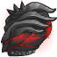
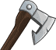

[Back to Main](index.md)

    
        Portait
    
    
        Base Model
    
    
        Rage Model
    

# Karlach

Karlach was a citizen of the Lower City of Baldur's Gate before being taken prisoner and forced to fight in the Blood War, the eternal conflict between demons and devils. She was a prisoner and champion of Zariel, Archdevil and ruler of Avernus, the first layer of the Nine Hells. Taking a risky chance on escape, Karlach boarded a hostile Mind Flayer ship when it appeared in the sky of Avernus. Using it, she made her escape from the Hells but was infected with a Mind Flayer Tadpole in the process. Now hunted, Karlach is a fugitive on the run from Zariel's forces, who seeks to have her warrior returned to her, and punished.

[Karlach - Baldur's Gate 3 Wiki](https://bg3.wiki/wiki/Karlach)

# Basic Information

Karlach will be the new champion in the Midwinter event on 10 January 2024.

    
        
            **Seat**:
        
        
            Unknown
        
    
    
        
            **Race**:
        
        
            Tiefling (Guess)
        
    
    
        
            **Class**:
        
        
            Barbarian (Guess)
        
    
    
        
            **Roles**:
        
        
            Tanking / DPS / Support (Guess)
        
    
    
        
            **Age**:
        
        
            Unknown
        
    
    
        
            **Gender**:
        
        
            Female (Guess)
        
    
    
        
            **Alignment**:
        
        
            Unknown
        
    
    
        
            **Affiliation**:
        
        
            Absolute Adversaries (Guess)
        
    

# Formation

Unknown.


    



# Abilities

**Base Attack: Greataxe Cleave** (Melee)
> Unknown effect.  
> Cooldown: 6s (Cap 1.5s)

<em>Raw Data</em>

<pre>
{
    "description": "",
    "long_description": "",
    "damage_modifier": 1,
    "damage_types": ["melee"],
    "graphic_id": 0,
    "target": "front",
    "aoe_radius": 0,
    "tags": ["melee"],
    "num_targets": 1,
    "animations": [{
        "damage_frame": 2,
        "jump_sound": 30,
        "sound_frames": {"2": 154},
        "target_offset_x": -34,
        "type": "melee_attack"
    }],
    "name": "Greataxe Cleave",
    "cooldown": 6,
    "id": 713
}
</pre>

**Base Attack: Soul Coin** (Melee)
> Unknown effect.  
> Cooldown: 6s (Cap 1.5s)

<em>Raw Data</em>

<pre>
{
    "description": "",
    "long_description": "",
    "damage_modifier": 1,
    "damage_types": ["melee"],
    "graphic_id": 21828,
    "target": "none",
    "aoe_radius": 0,
    "tags": ["melee"],
    "num_targets": 1,
    "animations": [{
        "damage_frame": 2,
        "jump_sound": 30,
        "sound_frames": {"2": 154},
        "target_offset_x": -34,
        "type": "melee_attack"
    }],
    "name": "Soul Coin",
    "cooldown": 6,
    "id": 714
}
</pre>

**Unknown** (Guess)
> As a Champion of Zariel, Karlach can be used in any Zariel Patron adventure or variant, even if she would not normally be available to be used due to variant or patron restrictions.

<em>Raw Data</em>

<pre>
{
    "effect_keys": [{"effect_string": "do_nothing"}],
    "requirements": "",
    "description": {"desc": "As a Champion of Zariel, Karlach can be used in any Zariel Patron adventure or variant, even if she would not normally be available to be used due to variant or patron restrictions."},
    "id": 1810,
    "flavour_text": "",
    "graphic_id": 0,
    "properties": {
        "use_outgoing_description": true,
        "is_formation_ability": true,
        "formation_circle_icon": false
    }
}
</pre>

**Fury of Avernus** (Guess)
> Karlach increases the damage of all Champions (including herself) in her column and the column behind her by 100%.

<em>Raw Data</em>

<pre>
{
    "effect_keys": [{
        "effect_string": "hero_dps_multiplier_mult,100",
        "targets": ["col_and_prev_col"]
    }],
    "requirements": "",
    "description": {"desc": "Karlach increases the damage of all Champions (including herself) in her column and the column behind her by $(amount)%."},
    "id": 1811,
    "flavour_text": "",
    "graphic_id": 21822,
    "properties": {"is_formation_ability": true}
}
</pre>

**Ceremorphosis** (Guess)
> Your formation gains one Ceremorphosis stack due to the mind flayer tadpole in Karlach's brain. Karlach increases the health of all other Champions by 20% of her max health, plus 2% for each Ceremorphosis stack the formation has, stacking additively.

<em>Raw Data</em>

<pre>
{
    "effect_keys": [
        {
            "stack_title": "Total Ceremorphosis Stacks",
            "amount_updated_listeners": [
                "upgrade_unlocked",
                "slot_changed",
                "feat_changed"
            ],
            "total_title": "Total Bonus",
            "off_when_benched": true,
            "show_bonus": true,
            "amount_func": "add",
            "stack_func": "per_ceremorphosis_stacks",
            "effect_string": "buff_upgrade,2,13722,4",
            "desc_forced_order": 2
        },
        {
            "stack_title": "Karlach Ceremorphosis Stacks",
            "manual_stacking": true,
            "stacks_multiply": false,
            "off_when_benched": true,
            "outgoing_buffs": false,
            "effect_string": "karlach_ceremorphosis_stacks,1",
            "show_stacks": true,
            "desc_forced_order": 1
        },
        {
            "off_when_benched": true,
            "effect_string": "base_amount,20"
        },
        {
            "amount_expr": "upgrade_amount(13722,2)+max_upgrade_amount(13722,0)",
            "off_when_benched": true,
            "effect_string": "increase_health_by_source_percent,0",
            "targets": ["other"]
        },
        {
            "off_when_benched": true,
            "effect_string": "do_nothing,0"
        }
    ],
    "requirements": "",
    "description": {"desc": "Your formation gains one Ceremorphosis stack due to the mind flayer tadpole in Karlach's brain. Karlach increases the health of all other Champions by $(amount___3)% of her max health, plus $(amount)% for each Ceremorphosis stack the formation has, stacking additively."},
    "id": 1812,
    "flavour_text": "",
    "graphic_id": 21820,
    "properties": {
        "indexed_effect_properties": true,
        "retain_on_slot_changed": true,
        "is_formation_ability": true,
        "default_bonus_index": 0,
        "owner_use_outgoing_description": true,
        "per_effect_index_bonuses": true
    }
}
</pre>

**Rage** (Guess)
> When Karlach attacks or is attacked, she gains a Rage stack, capped at 50 stacks. Karlach increases the effect of The Fury of Avernus by 25% for each Rage stack, stacking multiplicatively. Stacks are reduced by 60% when changing areas.

<em>Raw Data</em>

<pre>
{
    "effect_keys": [{
        "stack_title": "Rage stacks",
        "stacks_multiply": true,
        "reduce_percent": 60,
        "show_bonus": true,
        "effect_string": "buff_upgrade,25,13721",
        "max_stacks": 50,
        "more_triggers": [
            {
                "action": {"type": "add_stack"},
                "trigger": "owner_base_attack"
            },
            {
                "action": {"type": "add_stack"},
                "trigger": "hero_attacked",
                "target": "self_slot"
            },
            {
                "action": {
                    "type": "reduce_percent",
                    "percent": 60
                },
                "trigger": "area_changed"
            }
        ]
    }],
    "requirements": "",
    "description": {"desc": "When Karlach attacks or is attacked, she gains a Rage stack, capped at $(max_stacks) stacks. Karlach increases the effect of The Fury of Avernus by $(not_buffed amount)% for each Rage stack, stacking multiplicatively. Stacks are reduced by $(reduce_percent)% when changing areas."},
    "id": 1813,
    "flavour_text": "",
    "graphic_id": 21824,
    "properties": {
        "use_outgoing_description": true,
        "is_formation_ability": true
    }
}
</pre>

**Infernal Engine** (Guess)
> While Karlach has 20 or more Rage stacks, she ignites on fire dealing 0.1 second of BUD-based damage for each Rage stack to any enemy that attacks her. (Stacking additively).

<em>Raw Data</em>

<pre>
{
    "effect_keys": [{
        "stack_title": "Rage stacks",
        "per_other_stack_count_effect_key_index": 0,
        "amount_updated_listeners": ["stacks_changed"],
        "stacks_multiply": false,
        "total_title": "Seconds of BUD",
        "per_other_stack_count_upgrade_id": 13723,
        "show_bonus": true,
        "amount_func": "add",
        "stack_func": "per_other_stack_count",
        "effect_string": "do_nothing,0.1",
        "percent_values": false
    }],
    "requirements": "",
    "description": {"desc": "While Karlach has 20 or more Rage stacks, she ignites on fire dealing $(not_buffed amount) second of BUD-based damage for each Rage stack to any enemy that attacks her. (Stacking additively)"},
    "id": 1814,
    "flavour_text": "",
    "graphic_id": 21823,
    "properties": {
        "use_outgoing_description": true,
        "is_formation_ability": true
    }
}
</pre>

**Experienced Gladiator** (Guess)
> Unknown effect.

<em>Raw Data</em>

<pre>
{
    "effect_keys": [{"effect_string": "do_nothing"}],
    "requirements": "",
    "description": {"desc": ""},
    "id": 1815,
    "flavour_text": "",
    "graphic_id": 21821,
    "properties": {
        "use_outgoing_description": true,
        "is_formation_ability": true
    }
}
</pre>

# Specialisations

**Specialisation: Berserker** (Guess)
> Unknown effect.

<em>Raw Data</em>

<pre>
{
    "p": 0,
    "v": 2,
    "id": 21825,
    "export_params": {
        "quantize": true,
        "uses": ["icon"]
    },
    "type": 1,
    "graphic": "Icons/Events/2018Midwinter/Midwinter_Y7/Icon_Specialization_KarlachBerserker",
    "fs": 0
}
</pre>

**Specialisation: Wildheart** (Guess)
> Unknown effect.

<em>Raw Data</em>

<pre>
{
    "p": 0,
    "v": 2,
    "id": 21826,
    "export_params": {
        "quantize": true,
        "uses": ["icon"]
    },
    "type": 1,
    "graphic": "Icons/Events/2018Midwinter/Midwinter_Y7/Icon_Specialization_KarlachWildheart",
    "fs": 0
}
</pre>

**Specialisation: Wild Magic** (Guess)
> Unknown effect.

<em>Raw Data</em>

<pre>
{
    "p": 0,
    "v": 2,
    "id": 21827,
    "export_params": {
        "quantize": true,
        "uses": ["icon"]
    },
    "type": 1,
    "graphic": "Icons/Events/2018Midwinter/Midwinter_Y7/Icon_Specialization_KarlachWildMagic",
    "fs": 0
}
</pre>

# Items

    
        
            **Icons**
        
        
            **Name**
        
    
    
        
            
        
        
            Camp Stuff
        
    
    
        
            
        
        
            Clothes
        
    
    
        
            
        
        
            Engine
        
    
    
        
            
        
        
            Greataxe
        
    
    
        
            
        
        
            Soul Coin
        
    
    
        
            
        
        
            Tattoos
        
    

# Feats

Unknown.

# Legendaries

Unknown.

# Other Champion Images

    
        
            Console Portait
        
    
    
        
            Gold Chest Icon
        
        
            Silver Chest Icon
        
    

[Back to Top](#top)

*Last Modified: {{ site.time }}*