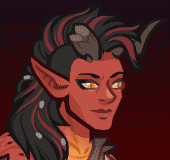

[Back to Main](index.md)

    
        Portait
    
    
        Model
    

# Karlach

Karlach was a citizen of the Lower City of Baldur's Gate before being taken prisoner and forced to fight in the Blood War, the eternal conflict between demons and devils. She was a prisoner and champion of Zariel, Archdevil and ruler of Avernus, the first layer of the Nine Hells. Taking a risky chance on escape, Karlach boarded a hostile Mind Flayer ship when it appeared in the sky of Avernus. Using it, she made her escape from the Hells but was infected with a Mind Flayer Tadpole in the process. Now hunted, Karlach is a fugitive on the run from Zariel's forces, who seeks to have her warrior returned to her, and punished.

[Karlach - Baldur's Gate 3 Wiki](https://bg3.wiki/wiki/Karlach)

# Basic Information

Karlach will be the new champion in the Midwinter event on 10 January 2024.

    
        
            **Seat**:
        
        
            Unknown
        
    
    
        
            **Race**:
        
        
            Tiefling (Guess)
        
    
    
        
            **Class**:
        
        
            Barbarian (Guess)
        
    
    
        
            **Roles**:
        
        
            Unknown
        
    
    
        
            **Age**:
        
        
            Unknown
        
    
    
        
            **Gender**:
        
        
            Female (Guess)
        
    
    
        
            **Alignment**:
        
        
            Unknown
        
    
    
        
            **Affiliation**:
        
        
            Absolute Adversaries (Guess)
        
    

# Formation

Unknown.


    



# Abilities

**Base Attack: Unknown**
> Unknown effect.

<em>Raw Data</em>

<pre>
</pre>

**Ultimate Attack: Unknown**
> Unknown effect.

<em>Raw Data</em>

<pre>
</pre>

**Unknown**
> Unknown effect.

<em>Raw Data</em>

<pre>
</pre>

# Specialisations

Unknown.

# Items

Unknown.

# Feats

Unknown.

# Legendaries

Unknown.

# Other Champion Images

    
        
            Console Portait
        
    
    

[Back to Top](#top)

*Last Modified: {{ site.time }}*