[Back to Main](index.md)

    
        
            
        
        
        Portrait
        
    
    
        
            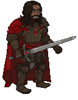
        
        
        Model
        
    

# Kas

Kas, also known as Kas of Tycheron, Kas the Terrible, Kas the Bloody-Handed, Kas the Betrayer, Kas the Hateful, and Kas the Destroyer, was the most trusted lieutenant of the despotic arch-lich Vecna. He wielded the Sword of Kas in his master's name.

[Kas - Greyhawk Wiki](https://ghwiki.greyparticle.com/index.php/Kas)

# Basic Information

Kas will be a new champion in the Liars' Night event on 2 October 2024.

    
        
            **Seat**:
        
        
            Unknown
        
    
    
        
            **Species**:
        
        
            Human / Vampire (Guess)
        
    
    
        
            **Class**:
        
        
            Fighter (Guess)
        
    
    
        
            **Roles**:
        
        
            DPS / Healing (Guess)
        
    
    
        
            **Age**:
        
        
            Unknown
        
    
    
        
            **Gender**:
        
        
            Male (Guess)
        
    
    
        
            **Alignment**:
        
        
            Lawful Evil (Guess)
        
    
    
        
            **Affiliation**:
        
        
            Unknown
        
    

# Formation

    <svg xmlns="http://www.w3.org/2000/svg" id="Kas" fill="#aaa" data-formationName="Kas" data-campaignName="Liar's Night" width="331" height="160"><circle cx="215" cy="45" r="15"/><circle cx="175" cy="65" r="15"/><circle cx="175" cy="145" r="15"/><circle cx="135" cy="85" r="15"/><circle cx="135" cy="125" r="15"/><circle cx="95" cy="25" r="15"/><circle cx="95" cy="65" r="15"/><circle cx="95" cy="105" r="15"/><circle cx="55" cy="125" r="15"/><circle cx="15" cy="145" r="15"/><text x="245" y="25" fill="#dcdcdc" font-size="25" font-family="Arial" font-weight="bold">Kas</text><text x="245" y="65" fill="#dcdcdc" font-size="15" font-family="Arial" font-weight="bold">Liar's Night</text></svg>

# Attacks

**Base Attack: Vengeful Swing** (Melee)
> Kas moves up to the closest enemy and swings his sword, dealing one hit to all enemies in a small area.  
> Cooldown: 5s (Cap 1.25s)

<em>Raw Data</em>

<pre>
{
    "id": 802,
    "name": "Vengeful Swing",
    "description": "Kas attacks the closest enemy and other nearby foes with a sweep of his sword.",
    "long_description": "Kas moves up to the closest enemy and swings his sword, dealing one hit to all enemies in a small area.",
    "graphic_id": 0,
    "target": "front",
    "num_targets": 1,
    "aoe_radius": 100,
    "damage_modifier": 1,
    "cooldown": 5,
    "animations": [
        {
            "type": "melee_attack",
            "damage_frame": 8,
            "target_offset_x": -40,
            "jump_sound": 30,
            "sound_frames": {
                "14": 154
            }
        }
    ],
    "tags": [
        "melee"
    ],
    "damage_types": [
        "melee"
    ]
}
</pre>

**Ultimate Attack: Rise, Fallen Soldier!**
> Kas summons two specters that move towards enemies, dealing ultimate damage each second for 15 seconds.  
> Cooldown: 400s (Cap 100s)

<em>Raw Data</em>

<pre>
{
    "id": 803,
    "name": "Rise, Fallen Soldier!",
    "description": "Kas summons two specters that deal ultimate damage each second for 15 seconds.",
    "long_description": "Kas summons two specters that move towards enemies, dealing ultimate damage each second for 15 seconds.",
    "graphic_id": 24585,
    "target": "none",
    "num_targets": 1,
    "aoe_radius": 0,
    "damage_modifier": 0.033,
    "cooldown": 400,
    "animations": [
        {
            "type": "ultimate_attack",
            "ultimate": "kas"
        }
    ],
    "tags": [
        "melee",
        "ultimate"
    ],
    "damage_types": [
        "melee"
    ]
}
</pre>

# Abilities

**Unknown** (Guess)
> Kas is Undead and counts as "dead" for the purposes of effects that care about dead Champions, but "alive" for all other purposes. Via his abilities, Kas may cause one or more other Champions in the formation to become his Vampire Spawns, which are also Undead.

<em>Raw Data</em>

<pre>
{
    "id": 2080,
    "flavour_text": "",
    "description": {
        "desc": "Kas is Undead and counts as \"dead\" for the purposes of effects that care about dead Champions, but \"alive\" for all other purposes. Via his abilities, Kas may cause one or more other Champions in the formation to become his Vampire Spawns, which are also Undead."
    },
    "effect_keys": [
        {
            "effect_string": "appear_dead"
        }
    ],
    "requirements": "",
    "graphic_id": 0,
    "large_graphic_id": 0,
    "properties": {
        "is_formation_ability": true,
        "formation_circle_icon": false,
        "owner_use_outgoing_description": true
    }
}
</pre>

**Born Into Evil** (Guess)
> Kas increases his damage by 100% for each Evil Champion in the formation, stacking multiplicatively.

ⓘ *Note: This ability is prestack.*

<em>Raw Data</em>

<pre>
{
    "id": 2081,
    "flavour_text": "",
    "description": {
        "desc": "Kas increases his damage by $(amount)% for each Evil Champion in the formation, stacking multiplicatively."
    },
    "effect_keys": [
        {
            "effect_string": "pre_stack,100",
            "skip_effect_key_desc": true
        },
        {
            "effect_string": "hero_dps_multiplier_mult,0",
            "amount_expr": "upgrade_amount(15619,0)",
            "amount_func": "mult",
            "stack_func": "per_hero_attribute",
            "per_hero_expr": "HasTag(`evil`)",
            "show_bonus": true,
            "stack_title": "Evil Champions",
            "off_when_benched": true
        }
    ],
    "requirements": "",
    "graphic_id": 24573,
    "large_graphic_id": 24567,
    "properties": {
        "is_formation_ability": true,
        "formation_circle_icon": true,
        "owner_use_outgoing_description": true,
        "indexed_effect_properties": true,
        "per_effect_index_bonuses": true,
        "default_bonus_index": 0
    }
}
</pre>

**Mortal Pawns** (Guess)
> Every time an area is completed, Kas gains Pawn stacks equal to the number of Champions in the formation that are not one of his Vampire Spawns. Each Pawn stack increases the effect of Born Into Evil by 1%, stacking multiplicatively.   
> Non Vampire Spawn Champions: $(upgrade_stacks_total 15620,3).

<em>Raw Data</em>

<pre>
{
    "id": 2082,
    "flavour_text": "",
    "description": {
        "desc": "Every time an area is completed, Kas gains Pawn stacks equal to the number of Champions in the formation that are not one of his Vampire Spawns. Each Pawn stack increases the effect of Born Into Evil by $(amount___2)%, stacking multiplicatively. ^Non Vampire Spawn Champions: $(upgrade_stacks_total 15620,3)"
    },
    "effect_keys": [
        {
            "effect_string": "expression_on_trigger,area_complete",
            "per_trigger_expr": "{AppendToSaveStat(`kas_mortal_pawn_stacks`, true, trigger_count*as_int(per_hero_count)) AppendToSaveStat(`kas_mortal_pawn_stacks_all_time`, false, trigger_count*as_int(per_hero_count))}",
            "per_hero_expr": "!HasEffect(`vampire_spawn`)",
            "off_when_benched": true
        },
        {
            "effect_string": "pre_stack,1",
            "skip_effect_key_desc": true
        },
        {
            "effect_string": "buff_upgrade,0,15619,1",
            "amount_expr": "upgrade_amount(15620,1)",
            "amount_func": "mult",
            "stack_func": "per_hero_attribute",
            "post_process_expr": "GetSaveStat(`kas_mortal_pawn_stacks`, true)",
            "stack_title": "Pawn Stacks",
            "show_bonus": true,
            "use_computed_amount_for_description": true,
            "amount_updated_listeners": [
                "slot_changed",
                "area_changed",
                "hero_appears_dead"
            ],
            "off_when_benched": true
        },
        {
            "effect_string": "abcd,100",
            "amount_func": "mult",
            "stack_func": "per_hero_attribute",
            "per_hero_expr": "!HasEffect(`vampire_spawn`)",
            "skip_effect_key_desc": true,
            "amount_updated_listeners": [
                "slot_changed",
                "hero_appears_dead"
            ]
        }
    ],
    "requirements": "",
    "graphic_id": 24575,
    "large_graphic_id": 24569,
    "properties": {
        "is_formation_ability": true,
        "formation_circle_icon": false,
        "owner_use_outgoing_description": true,
        "indexed_effect_properties": true,
        "per_effect_index_bonuses": true,
        "default_bonus_index": 0
    }
}
</pre>

**Life Drain** (Guess)
> When an Undead Champion in the formation attacks, they regain 50 Hit Points.

<em>Raw Data</em>

<pre>
{
    "id": 2083,
    "flavour_text": "",
    "description": {
        "desc": "When an Undead Champion in the formation attacks, they regain $(amount) Hit Points."
    },
    "effect_keys": [
        {
            "effect_string": "effect_action_on_attack,50",
            "target_self": true,
            "hero_expr": "is_undead",
            "effects": [
                {
                    "effect_string": "heal_targets_by_amount,0",
                    "targets": [
                        "self"
                    ]
                }
            ]
        },
        {
            "effect_string": "for_incoming_desc,100",
            "targets": [
                "all"
            ],
            "filter_targets": [
                {
                    "type": "hero_expr",
                    "hero_expr": "is_undead"
                }
            ],
            "off_when_benched": true
        }
    ],
    "requirements": "",
    "graphic_id": 24574,
    "large_graphic_id": 24568,
    "properties": {
        "is_formation_ability": true,
        "formation_circle_icon": false,
        "owner_use_outgoing_description": true,
        "use_outgoing_description": true
    }
}
</pre>

**Sword of Kas** (Guess)
> When a Champion that is not already Undead dies, they immediately resurrect at full health as a Vampire Spawn, counting as Undead for the rest of the adventure. The effect of Born Into Evil is increased by 100% for each Undead Champion in the formation, stacking multiplicatively.

<em>Raw Data</em>

<pre>
{
    "id": 2084,
    "flavour_text": "",
    "description": {
        "desc": "When a Champion that is not already Undead dies, they immediately resurrect at full health as a Vampire Spawn, counting as Undead for the rest of the adventure. The effect of Born Into Evil is increased by $(amount___2)% for each Undead Champion in the formation, stacking multiplicatively."
    },
    "effect_keys": [
        {
            "effect_string": "kas_spawn_of_kas",
            "resurrection_priority": 1500,
            "underlay_graphic_id": 24686,
            "vampire_spawn_effect_name": "vampire_spawn",
            "vampire_spawn_effect": {
                "effect_string": "vampire_spawn"
            },
            "vampire_spawn_effect_id": 2113,
            "off_when_benched": true
        },
        {
            "effect_string": "pre_stack,100",
            "skip_effect_key_desc": true
        },
        {
            "effect_string": "buff_upgrade,0,15619,1",
            "amount_expr": "upgrade_amount(15622,1)",
            "stack_func": "per_hero_attribute",
            "per_hero_expr": "is_undead",
            "amount_func": "mult",
            "show_bonus": true,
            "stack_title": "Undead Champions",
            "amount_updated_listeners": [
                "slot_changed",
                "hero_appears_dead"
            ],
            "off_when_benched": true
        }
    ],
    "requirements": "",
    "graphic_id": 24576,
    "large_graphic_id": 24570,
    "properties": {
        "is_formation_ability": true,
        "formation_circle_icon": false,
        "owner_use_outgoing_description": true,
        "indexed_effect_properties": true,
        "per_effect_index_bonuses": true,
        "default_bonus_index": 0
    }
}
</pre>

**Unlock Ultimate** (Guess)
> Unlocks Kas' Rise, Fallen Soldier! Ultimate Attack.

<em>Raw Data</em>

<pre>
{
    "id": 2088,
    "flavour_text": "",
    "description": {
        "desc": "Unlocks Kas' Rise, Fallen Soldier! Ultimate Attack"
    },
    "effect_keys": [
        {
            "effect_string": "kas_ultimate",
            "duration": 16,
            "skip_effect_key_desc": true,
            "specter_data": {
                "random_offset_range": 75,
                "move_speed": 175,
                "desired_distance_to_monster": 40,
                "damage_radius": 200
            }
        },
        {
            "effect_string": "set_ultimate_attack",
            "skip_effect_key_desc": true
        }
    ],
    "requirements": "",
    "graphic_id": 24585,
    "large_graphic_id": 24585,
    "properties": {
        "is_formation_ability": false,
        "owner_use_outgoing_description": false,
        "formation_circle_icon": false
    }
}
</pre>

# Specialisations

**Kas the Destroyer** (Guess)
> Kas increases the effect of Life Drain by 100% and evil Champions attack faster as their base attack cooldown is reduced by 0.5 seconds.

<em>Raw Data</em>

<pre>
{
    "id": 2085,
    "flavour_text": "",
    "description": {
        "desc": "Kas increases the effect of Life Drain by $(amount)% and evil Champions attack faster as their base attack cooldown is reduced by 0.5 seconds."
    },
    "effect_keys": [
        {
            "effect_string": "buff_upgrade,100,15621"
        },
        {
            "effect_string": "reduce_attack_cooldown,0.5",
            "targets": [
                "all"
            ],
            "filter_targets": [
                {
                    "type": "hero_expr",
                    "hero_expr": "HasTag(`evil`)"
                }
            ],
            "amount_updated_listeners": [
                "slot_changed",
                "feat_changed",
                "hero_tags_changed"
            ],
            "off_when_benched": true
        }
    ],
    "requirements": "",
    "graphic_id": 0,
    "large_graphic_id": 0,
    "properties": {
        "is_formation_ability": true,
        "formation_circle_icon": false,
        "owner_use_outgoing_description": true,
        "indexed_effect_properties": true,
        "per_effect_index_bonuses": true,
        "default_bonus_index": 0,
        "spec_option_post_apply_info": "Champions in Formation Targeted: $num_targets___2"
    }
}
</pre>

**Kas the Bloody Handed** (Guess)
> Kas' damage against Boss enemies is increased by 100%, and the effect of Born Into Evil is increased by 100% for each Undead Champion in the formation.

<em>Raw Data</em>

<pre>
{
    "id": 2086,
    "flavour_text": "",
    "description": {
        "desc": "Kas' damage against Boss enemies is increased by $(amount)%, and the effect of Born Into Evil is increased by $(amount___2)% for each Undead Champion in the formation."
    },
    "effect_keys": [
        {
            "effect_string": "increase_damage_against_monster_tag,100,boss"
        },
        {
            "effect_string": "pre_stack,100",
            "skip_effect_key_desc": true
        },
        {
            "effect_string": "buff_upgrade,0,15619,1",
            "amount_expr": "upgrade_amount(15624,1)",
            "stack_func": "per_hero_attribute",
            "per_hero_expr": "is_undead",
            "amount_func": "mult",
            "show_bonus": true,
            "stack_title": "Undead Champions",
            "total_title": "Total Buff to Born Into Evil",
            "amount_updated_listeners": [
                "slot_changed",
                "hero_appears_dead"
            ],
            "off_when_benched": true
        }
    ],
    "requirements": "",
    "graphic_id": 0,
    "large_graphic_id": 0,
    "properties": {
        "is_formation_ability": true,
        "formation_circle_icon": false,
        "owner_use_outgoing_description": true,
        "indexed_effect_properties": true,
        "per_effect_index_bonuses": true,
        "default_bonus_index": 0,
        "spec_option_post_apply_info": "Champions in Formation Targeted: $num_stacks___3"
    }
}
</pre>

**Kas the Betrayer** (Guess)
> Increases the effect of Born Into Evil by 100%. In addition, Champions adjacent to Kas gain the Evil tag. This does not affect their other alignment tags, and doesn't affect whether they are eligible for the adventure.

<em>Raw Data</em>

<pre>
{
    "id": 2087,
    "flavour_text": "",
    "description": {
        "desc": "Increases the effect of Born Into Evil by $(amount)%. In addition, Champions adjacent to Kas gain the Evil tag. This does not affect their other alignment tags, and doesn't affect whether they are eligible for the adventure."
    },
    "effect_keys": [
        {
            "effect_string": "buff_upgrade,100,15619,1"
        },
        {
            "off_when_benched": true,
            "effect_string": "add_hero_tags,0,evil",
            "targets": [
                "adj"
            ],
            "hide_amount_rate": true
        }
    ],
    "requirements": "",
    "graphic_id": 24581,
    "large_graphic_id": 24581,
    "properties": {
        "is_formation_ability": true,
        "formation_circle_icon": true,
        "owner_use_outgoing_description": true,
        "indexed_effect_properties": true,
        "per_effect_index_bonuses": true,
        "default_bonus_index": 0,
        "type": "not_buffable_by_nrakk"
    }
}
</pre>

# Items

    
        
            **Icons**
        
        
            **Name**
        
    
    
        
            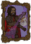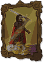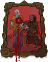
        
        
            Legandof
        
    
    
        
            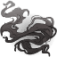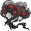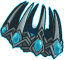
        
        
            Powers
        
    
    
        
            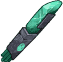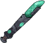
        
        
            Rodof Seven Parts
        
    
    
        
            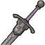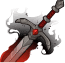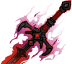
        
        
            Swords
        
    
    
        
            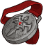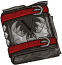
        
        
            Vampire Connections
        
    
    
        
            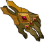
        
        
            Vecna Spoils
        
    

# Feats

Unknown.

# Legendaries

Unknown.

# Adventures and Variants

**Unlock Adventure: The Trickster's Delight (Kas)** (Complete Area 50)
> Chase down a masked man who has performed a daring heist.

 **Variant 1: Lieutenant of Evil** (Complete Area 75)
> Kas starts in the formation. He can be moved but not removed.  
> You may only use Evil Champions.  
> Getting to Know Kas: Kas' damage is increased when you use Evil Champions with him.

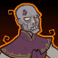 **Variant 2: Lord of Tovag** (Complete Area 125)
> Kas starts in the formation. He can be moved but not removed.  
> Every second, a random Champion in the formation takes a hit dealing 10% of their total health.  
> 1-2 Vecna Zombies spawn with each wave. They don't drop gold nor count towards quest progress.  
> Getting to Know Kas: As a Vampire Lord, Kas can transform other Champions into vampires, allowing them to heal when they attack enemies.

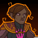 **Variant 3: Betrayer of Vecna** (Complete Area 175)
> Kas starts in the formation. He can be moved but not removed.  
> Bosses have 100% additional health for every 50 areas that have been completed, stacking multiplicatively.  
> 1-2 Vecna Cultists spawn with each wave. They don't drop gold nor count towards quest progress.  
> Getting to Know Kas: Kas' specialization choices give you multiple ways to augment his damage and healing. Which will you choose?

# Other Champion Images

    
        
            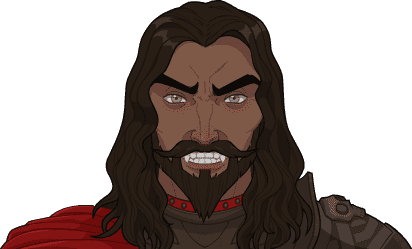Console Portrait
        
    
    
        
            Gold Chest Icon
        
        
            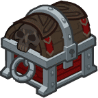Silver Chest Icon
        
    

[Back to Top](#top)

*Last Modified: {{ site.time }}*