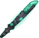

[Back to Main](index.md)

    
        
            
        
        
        Portrait
        
    
    
        
            
        
        
        Model
        
    

# Kas

Once the Lieutenant of Vecna, Kas betrayed his former master in a fight resulting in the dreaded artifacts, the Hand and Eye of Vecna. Kas is a vampire, legendary swordfighter, and ruthless warlord, and he is driven primarily by one thing: his hatred for Vecna.

# Basic Information

Kas will be a new champion in the Liars' Night event on 2 October 2024.

    
        
            **Seat**:
        
        
            6
        
        
            **Stat**
        
        
            **Value**
        
        
            **Day 1 Trials**
        
        
            **Patrons**
        
    
    
        
            **Species**:
        
        
            Human
        
        
            **Strength**:
        
        
            26
        
        
            Yes
        
        
            Mirt
        
    
    
        
            **Class**:
        
        
            Fighter
        
        
            **Dexterity**:
        
        
            20
        
        
            Yes
        
        
            Vajra
        
    
    
        
            **Roles**:
        
        
            DPS / Healing
        
        
            **Constitution**:
        
        
            22
        
        
            Yes
        
        
            Strahd
        
    
    
        
            **Age**:
        
        
            976
        
        
            **Intelligence**:
        
        
            24
        
        
            Yes
        
        
            Zariel
        
    
    
        
            **Gender**:
        
        
            Male
        
        
            **Wisdom**:
        
        
            19
        
        
            Yes
        
        
            Elminster
        
    
    
        
            **Alignment**:
        
        
            Neutral Evil
        
        
            **Charisma**:
        
        
            26
        
        
            Yes
        
        
            &nbsp;
        
    
    
        
            **Affiliation**:
        
        
            -
        
        
            **Total**:
        
        
            137
        
        
            Champion ID:
        
        
            153
        
    

# Formation

    <svg xmlns="http://www.w3.org/2000/svg" id="Kas" fill="#aaa" data-formationName="Kas" data-campaignName="Liar's Night" width="331" height="160"><circle cx="215" cy="45" r="15"/><circle cx="175" cy="65" r="15"/><circle cx="175" cy="145" r="15"/><circle cx="135" cy="85" r="15"/><circle cx="135" cy="125" r="15"/><circle cx="95" cy="25" r="15"/><circle cx="95" cy="65" r="15"/><circle cx="95" cy="105" r="15"/><circle cx="55" cy="125" r="15"/><circle cx="15" cy="145" r="15"/><text x="245" y="25" fill="#dcdcdc" font-size="25" font-family="Arial" font-weight="bold">Kas</text><text x="245" y="65" fill="#dcdcdc" font-size="15" font-family="Arial" font-weight="bold">Liar's Night</text></svg>

# Attacks

 **Base Attack: Vengeful Swing** (Melee)
> Kas moves up to the closest enemy and swings his sword, dealing one hit to all enemies in a small area.  
> Cooldown: 5s (Cap 1.25s)

<em>Raw Data</em>

<pre>
{
    "id": 802,
    "name": "Vengeful Swing",
    "description": "Kas attacks the closest enemy and other nearby foes with a sweep of his sword.",
    "long_description": "Kas moves up to the closest enemy and swings his sword, dealing one hit to all enemies in a small area.",
    "graphic_id": 0,
    "target": "front",
    "num_targets": 1,
    "aoe_radius": 100,
    "damage_modifier": 1,
    "cooldown": 5,
    "animations": [
        {
            "type": "melee_attack",
            "damage_frame": 8,
            "target_offset_x": -40,
            "jump_sound": 30,
            "sound_frames": {
                "14": 154
            }
        }
    ],
    "tags": [
        "melee"
    ],
    "damage_types": [
        "melee"
    ]
}
</pre>

 **Ultimate Attack: Rise, Fallen Soldier!** (Level: 0)
> Kas summons two specters that move towards enemies, dealing ultimate damage each second for 15 seconds.  
> Cooldown: 400s (Cap 100s)

<em>Raw Data</em>

<pre>
{
    "id": 803,
    "name": "Rise, Fallen Soldier!",
    "description": "Kas summons two specters that deal ultimate damage each second for 15 seconds.",
    "long_description": "Kas summons two specters that move towards enemies, dealing ultimate damage each second for 15 seconds.",
    "graphic_id": 24585,
    "target": "none",
    "num_targets": 1,
    "aoe_radius": 0,
    "damage_modifier": 0.033,
    "cooldown": 400,
    "animations": [
        {
            "type": "ultimate_attack",
            "ultimate": "kas"
        }
    ],
    "tags": [
        "melee",
        "ultimate"
    ],
    "damage_types": [
        "melee"
    ]
}
</pre>

# Abilities

**Vampire Lord** (Level: 0)
> Kas is Undead and counts as "dead" for the purposes of effects that care about dead Champions, but "alive" for all other purposes. Via his abilities, Kas may cause one or more other Champions in the formation to become his Vampire Spawns, which are also Undead.

<em>Raw Data</em>

<pre>
{
    "id": 15618,
    "hero_id": 153,
    "required_level": 0,
    "required_upgrade_id": 0,
    "upgrade_type": "unlock_ability",
    "effect": "effect_def,2080",
    "static_dps_mult": null,
    "default_enabled": 1,
    "name": "Vampire Lord"
}
{
    "id": 2080,
    "flavour_text": "",
    "description": {
        "desc": "Kas is Undead and counts as \"dead\" for the purposes of effects that care about dead Champions, but \"alive\" for all other purposes. Via his abilities, Kas may cause one or more other Champions in the formation to become his Vampire Spawns, which are also Undead."
    },
    "effect_keys": [
        {
            "effect_string": "appear_dead"
        }
    ],
    "requirements": "",
    "graphic_id": 0,
    "large_graphic_id": 0,
    "properties": {
        "is_formation_ability": true,
        "formation_circle_icon": false,
        "owner_use_outgoing_description": true
    }
}
</pre>

 **Born Into Evil** (Level: 10)
> Kas increases his damage by 100% for each Evil Champion in the formation, stacking multiplicatively.

ⓘ *Note: This ability is prestack.*

<em>Upgrade Data</em>

<pre>
Upgrades:
       60: 100%
      130: 100%
      280: 100%
      440: 100%
      650: 100%
      830: 100%
    1,030: 100%
    1,220: 100%
    1,410: 100%
    1,600: 100%
    1,790: 100%
    1,980: 100%
    2,170: 100%
    2,360: 100%
    2,540: 100%
    2,730: 100%
    2,920: 100%
    3,110: 100%
    3,300: 100%
    3,490: 100%

    Total Upgrade Bonus: 1.05e08%
</pre>

<em>Raw Data</em>

<pre>
{
    "id": 15619,
    "hero_id": 153,
    "required_level": 10,
    "required_upgrade_id": 0,
    "upgrade_type": "unlock_ability",
    "effect": "effect_def,2081",
    "static_dps_mult": null,
    "default_enabled": 1,
    "name": "Born Into Evil",
    "tip_text": "Kas increases his damage for each Evil Champion in the formation, stacking multiplicatively."
}
{
    "id": 2081,
    "flavour_text": "",
    "description": {
        "desc": "Kas increases his damage by $(amount)% for each Evil Champion in the formation, stacking multiplicatively."
    },
    "effect_keys": [
        {
            "effect_string": "pre_stack,100",
            "skip_effect_key_desc": true
        },
        {
            "effect_string": "hero_dps_multiplier_mult,0",
            "amount_expr": "upgrade_amount(15619,0)",
            "amount_func": "mult",
            "stack_func": "per_hero_attribute",
            "per_hero_expr": "HasTag(`evil`)",
            "show_bonus": true,
            "stack_title": "Evil Champions",
            "off_when_benched": true
        }
    ],
    "requirements": "",
    "graphic_id": 24573,
    "large_graphic_id": 24567,
    "properties": {
        "is_formation_ability": true,
        "formation_circle_icon": true,
        "owner_use_outgoing_description": true,
        "indexed_effect_properties": true,
        "per_effect_index_bonuses": true,
        "default_bonus_index": 0
    }
}
{
    "id": 15627,
    "hero_id": 153,
    "required_level": 60,
    "required_upgrade_id": 0,
    "upgrade_type": "upgrade_ability",
    "effect": "buff_upgrade,100,15619,1",
    "static_dps_mult": null,
    "default_enabled": 1,
    "name": ""
}
{
    "id": 15766,
    "hero_id": 153,
    "required_level": 130,
    "required_upgrade_id": 0,
    "upgrade_type": "upgrade_ability",
    "effect": "buff_upgrade,100,15619,1",
    "static_dps_mult": null,
    "default_enabled": 1,
    "name": ""
}
{
    "id": 15767,
    "hero_id": 153,
    "required_level": 280,
    "required_upgrade_id": 0,
    "upgrade_type": "upgrade_ability",
    "effect": "buff_upgrade,100,15619,1",
    "static_dps_mult": null,
    "default_enabled": 1,
    "name": ""
}
{
    "id": 15769,
    "hero_id": 153,
    "required_level": 440,
    "required_upgrade_id": 0,
    "upgrade_type": "upgrade_ability",
    "effect": "buff_upgrade,100,15619,1",
    "static_dps_mult": null,
    "default_enabled": 1,
    "name": ""
}
{
    "id": 15771,
    "hero_id": 153,
    "required_level": 650,
    "required_upgrade_id": 0,
    "upgrade_type": "upgrade_ability",
    "effect": "buff_upgrade,100,15619,1",
    "static_dps_mult": null,
    "default_enabled": 1,
    "name": ""
}
{
    "id": 15772,
    "hero_id": 153,
    "required_level": 830,
    "required_upgrade_id": 0,
    "upgrade_type": "upgrade_ability",
    "effect": "buff_upgrade,100,15619,1",
    "static_dps_mult": null,
    "default_enabled": 1,
    "name": ""
}
{
    "id": 15774,
    "hero_id": 153,
    "required_level": 1030,
    "required_upgrade_id": 0,
    "upgrade_type": "upgrade_ability",
    "effect": "buff_upgrade,100,15619,1",
    "static_dps_mult": null,
    "default_enabled": 1,
    "name": ""
}
{
    "id": 15776,
    "hero_id": 153,
    "required_level": 1220,
    "required_upgrade_id": 0,
    "upgrade_type": "upgrade_ability",
    "effect": "buff_upgrade,100,15619,1",
    "static_dps_mult": null,
    "default_enabled": 1,
    "name": ""
}
{
    "id": 15777,
    "hero_id": 153,
    "required_level": 1410,
    "required_upgrade_id": 0,
    "upgrade_type": "upgrade_ability",
    "effect": "buff_upgrade,100,15619,1",
    "static_dps_mult": null,
    "default_enabled": 1,
    "name": ""
}
{
    "id": 15779,
    "hero_id": 153,
    "required_level": 1600,
    "required_upgrade_id": 0,
    "upgrade_type": "upgrade_ability",
    "effect": "buff_upgrade,100,15619,1",
    "static_dps_mult": null,
    "default_enabled": 1,
    "name": ""
}
{
    "id": 15780,
    "hero_id": 153,
    "required_level": 1790,
    "required_upgrade_id": 0,
    "upgrade_type": "upgrade_ability",
    "effect": "buff_upgrade,100,15619,1",
    "static_dps_mult": null,
    "default_enabled": 1,
    "name": ""
}
{
    "id": 15782,
    "hero_id": 153,
    "required_level": 1980,
    "required_upgrade_id": 0,
    "upgrade_type": "upgrade_ability",
    "effect": "buff_upgrade,100,15619,1",
    "static_dps_mult": null,
    "default_enabled": 1,
    "name": ""
}
{
    "id": 15783,
    "hero_id": 153,
    "required_level": 2170,
    "required_upgrade_id": 0,
    "upgrade_type": "upgrade_ability",
    "effect": "buff_upgrade,100,15619,1",
    "static_dps_mult": null,
    "default_enabled": 1,
    "name": ""
}
{
    "id": 15785,
    "hero_id": 153,
    "required_level": 2360,
    "required_upgrade_id": 0,
    "upgrade_type": "upgrade_ability",
    "effect": "buff_upgrade,100,15619,1",
    "static_dps_mult": null,
    "default_enabled": 1,
    "name": ""
}
{
    "id": 15786,
    "hero_id": 153,
    "required_level": 2540,
    "required_upgrade_id": 0,
    "upgrade_type": "upgrade_ability",
    "effect": "buff_upgrade,100,15619,1",
    "static_dps_mult": null,
    "default_enabled": 1,
    "name": ""
}
{
    "id": 15788,
    "hero_id": 153,
    "required_level": 2730,
    "required_upgrade_id": 0,
    "upgrade_type": "upgrade_ability",
    "effect": "buff_upgrade,100,15619,1",
    "static_dps_mult": null,
    "default_enabled": 1,
    "name": ""
}
{
    "id": 15790,
    "hero_id": 153,
    "required_level": 2920,
    "required_upgrade_id": 0,
    "upgrade_type": "upgrade_ability",
    "effect": "buff_upgrade,100,15619,1",
    "static_dps_mult": null,
    "default_enabled": 1,
    "name": ""
}
{
    "id": 15791,
    "hero_id": 153,
    "required_level": 3110,
    "required_upgrade_id": 0,
    "upgrade_type": "upgrade_ability",
    "effect": "buff_upgrade,100,15619,1",
    "static_dps_mult": null,
    "default_enabled": 1,
    "name": ""
}
{
    "id": 15793,
    "hero_id": 153,
    "required_level": 3300,
    "required_upgrade_id": 0,
    "upgrade_type": "upgrade_ability",
    "effect": "buff_upgrade,100,15619,1",
    "static_dps_mult": null,
    "default_enabled": 1,
    "name": ""
}
{
    "id": 15794,
    "hero_id": 153,
    "required_level": 3490,
    "required_upgrade_id": 0,
    "upgrade_type": "upgrade_ability",
    "effect": "buff_upgrade,100,15619,1",
    "static_dps_mult": null,
    "default_enabled": 1,
    "name": ""
}
</pre>

 **Mortal Pawns** (Level: 40)
> Every time an area is completed, Kas gains Pawn stacks equal to the number of Champions in the formation that are not one of his Vampire Spawns. Each Pawn stack increases the effect of Born Into Evil by 1%, stacking multiplicatively.   
> Non Vampire Spawn Champions: $(upgrade_stacks_total 15620,3).

<em>Raw Data</em>

<pre>
{
    "id": 15620,
    "hero_id": 153,
    "required_level": 40,
    "required_upgrade_id": 0,
    "upgrade_type": "unlock_ability",
    "effect": "effect_def,2082",
    "static_dps_mult": null,
    "default_enabled": 1,
    "name": "Mortal Pawns"
}
{
    "id": 2082,
    "flavour_text": "",
    "description": {
        "desc": "Every time an area is completed, Kas gains Pawn stacks equal to the number of Champions in the formation that are not one of his Vampire Spawns. Each Pawn stack increases the effect of Born Into Evil by $(amount___2)%, stacking multiplicatively. ^Non Vampire Spawn Champions: $(upgrade_stacks_total 15620,3)"
    },
    "effect_keys": [
        {
            "effect_string": "expression_on_trigger,area_complete",
            "per_trigger_expr": "{AppendToSaveStat(`kas_mortal_pawn_stacks`, true, trigger_count*as_int(per_hero_count)) AppendToSaveStat(`kas_mortal_pawn_stacks_all_time`, false, trigger_count*as_int(per_hero_count))}",
            "per_hero_expr": "!HasEffect(`vampire_spawn`)",
            "off_when_benched": true
        },
        {
            "effect_string": "pre_stack,1",
            "skip_effect_key_desc": true
        },
        {
            "effect_string": "buff_upgrade,0,15619,1",
            "amount_expr": "upgrade_amount(15620,1)",
            "amount_func": "mult",
            "stack_func": "per_hero_attribute",
            "post_process_expr": "GetSaveStat(`kas_mortal_pawn_stacks`, true)",
            "stack_title": "Pawn Stacks",
            "show_bonus": true,
            "use_computed_amount_for_description": true,
            "amount_updated_listeners": [
                "slot_changed",
                "area_changed",
                "hero_appears_dead"
            ],
            "off_when_benched": true
        },
        {
            "effect_string": "abcd,100",
            "amount_func": "mult",
            "stack_func": "per_hero_attribute",
            "per_hero_expr": "!HasEffect(`vampire_spawn`)",
            "skip_effect_key_desc": true,
            "amount_updated_listeners": [
                "slot_changed",
                "hero_appears_dead"
            ]
        }
    ],
    "requirements": "",
    "graphic_id": 24575,
    "large_graphic_id": 24569,
    "properties": {
        "is_formation_ability": true,
        "formation_circle_icon": false,
        "owner_use_outgoing_description": true,
        "indexed_effect_properties": true,
        "per_effect_index_bonuses": true,
        "default_bonus_index": 0
    }
}
</pre>

 **Life Drain** (Level: 70)
> When an Undead Champion in the formation attacks, they regain 50 Hit Points.

<em>Upgrade Data</em>

<pre>
Upgrades:
      220: 70%
      370: 70%
      630: 70%
      850: 70%
    1,160: 70%
    1,510: 70%
    1,860: 70%
    2,200: 70%
    2,550: 70%
    2,900: 70%
    3,240: 70%
    3,590: 70%

    Total Upgrade Bonus: 5.82e04%
</pre>

<em>Raw Data</em>

<pre>
{
    "id": 15621,
    "hero_id": 153,
    "required_level": 70,
    "required_upgrade_id": 0,
    "upgrade_type": "unlock_ability",
    "effect": "effect_def,2083",
    "static_dps_mult": null,
    "default_enabled": 1,
    "name": "Life Drain"
}
{
    "id": 2083,
    "flavour_text": "",
    "description": {
        "desc": "When an Undead Champion in the formation attacks, they regain $(amount) Hit Points."
    },
    "effect_keys": [
        {
            "effect_string": "effect_action_on_attack,50",
            "target_self": true,
            "hero_expr": "is_undead",
            "effects": [
                {
                    "effect_string": "heal_targets_by_amount,0",
                    "targets": [
                        "self"
                    ]
                }
            ]
        },
        {
            "effect_string": "for_incoming_desc,100",
            "targets": [
                "all"
            ],
            "filter_targets": [
                {
                    "type": "hero_expr",
                    "hero_expr": "is_undead"
                }
            ],
            "off_when_benched": true
        }
    ],
    "requirements": "",
    "graphic_id": 24574,
    "large_graphic_id": 24568,
    "properties": {
        "is_formation_ability": true,
        "formation_circle_icon": false,
        "owner_use_outgoing_description": true,
        "use_outgoing_description": true
    }
}
{
    "id": 15628,
    "hero_id": 153,
    "required_level": 220,
    "required_upgrade_id": 0,
    "upgrade_type": "upgrade_ability",
    "effect": "buff_upgrade,70,15621,0",
    "static_dps_mult": null,
    "default_enabled": 1,
    "name": ""
}
{
    "id": 15768,
    "hero_id": 153,
    "required_level": 370,
    "required_upgrade_id": 0,
    "upgrade_type": "upgrade_ability",
    "effect": "buff_upgrade,70,15621,0",
    "static_dps_mult": null,
    "default_enabled": 1,
    "name": ""
}
{
    "id": 15770,
    "hero_id": 153,
    "required_level": 630,
    "required_upgrade_id": 0,
    "upgrade_type": "upgrade_ability",
    "effect": "buff_upgrade,70,15621,0",
    "static_dps_mult": null,
    "default_enabled": 1,
    "name": ""
}
{
    "id": 15773,
    "hero_id": 153,
    "required_level": 850,
    "required_upgrade_id": 0,
    "upgrade_type": "upgrade_ability",
    "effect": "buff_upgrade,70,15621,0",
    "static_dps_mult": null,
    "default_enabled": 1,
    "name": ""
}
{
    "id": 15775,
    "hero_id": 153,
    "required_level": 1160,
    "required_upgrade_id": 0,
    "upgrade_type": "upgrade_ability",
    "effect": "buff_upgrade,70,15621,0",
    "static_dps_mult": null,
    "default_enabled": 1,
    "name": ""
}
{
    "id": 15778,
    "hero_id": 153,
    "required_level": 1510,
    "required_upgrade_id": 0,
    "upgrade_type": "upgrade_ability",
    "effect": "buff_upgrade,70,15621,0",
    "static_dps_mult": null,
    "default_enabled": 1,
    "name": ""
}
{
    "id": 15781,
    "hero_id": 153,
    "required_level": 1860,
    "required_upgrade_id": 0,
    "upgrade_type": "upgrade_ability",
    "effect": "buff_upgrade,70,15621,0",
    "static_dps_mult": null,
    "default_enabled": 1,
    "name": ""
}
{
    "id": 15784,
    "hero_id": 153,
    "required_level": 2200,
    "required_upgrade_id": 0,
    "upgrade_type": "upgrade_ability",
    "effect": "buff_upgrade,70,15621,0",
    "static_dps_mult": null,
    "default_enabled": 1,
    "name": ""
}
{
    "id": 15787,
    "hero_id": 153,
    "required_level": 2550,
    "required_upgrade_id": 0,
    "upgrade_type": "upgrade_ability",
    "effect": "buff_upgrade,70,15621,0",
    "static_dps_mult": null,
    "default_enabled": 1,
    "name": ""
}
{
    "id": 15789,
    "hero_id": 153,
    "required_level": 2900,
    "required_upgrade_id": 0,
    "upgrade_type": "upgrade_ability",
    "effect": "buff_upgrade,70,15621,0",
    "static_dps_mult": null,
    "default_enabled": 1,
    "name": ""
}
{
    "id": 15792,
    "hero_id": 153,
    "required_level": 3240,
    "required_upgrade_id": 0,
    "upgrade_type": "upgrade_ability",
    "effect": "buff_upgrade,70,15621,0",
    "static_dps_mult": null,
    "default_enabled": 1,
    "name": ""
}
{
    "id": 15795,
    "hero_id": 153,
    "required_level": 3590,
    "required_upgrade_id": 0,
    "upgrade_type": "upgrade_ability",
    "effect": "buff_upgrade,70,15621,0",
    "static_dps_mult": null,
    "default_enabled": 1,
    "name": ""
}
</pre>

 **Spawn of Kas** (Level: 100)
> When a Champion that is not already Undead dies, they immediately resurrect at full health as a Vampire Spawn, counting as Undead for the rest of the adventure. The effect of Born Into Evil is increased by 100% for each Undead Champion in the formation, stacking multiplicatively.

<em>Raw Data</em>

<pre>
{
    "id": 15622,
    "hero_id": 153,
    "required_level": 100,
    "required_upgrade_id": 0,
    "upgrade_type": "unlock_ability",
    "effect": "effect_def,2084",
    "static_dps_mult": null,
    "default_enabled": 1,
    "name": "Spawn of Kas",
    "tip_text": "When a Champion that isn't Undead is defeated, Kas brings them back as an Undead Vampire Spawn. Undead Champions also heal with every attack."
}
{
    "id": 2084,
    "flavour_text": "",
    "description": {
        "desc": "When a Champion that is not already Undead dies, they immediately resurrect at full health as a Vampire Spawn, counting as Undead for the rest of the adventure. The effect of Born Into Evil is increased by $(amount___2)% for each Undead Champion in the formation, stacking multiplicatively."
    },
    "effect_keys": [
        {
            "effect_string": "kas_spawn_of_kas",
            "resurrection_priority": 1500,
            "underlay_graphic_id": 24686,
            "vampire_spawn_effect_name": "vampire_spawn",
            "vampire_spawn_effect": {
                "effect_string": "vampire_spawn"
            },
            "vampire_spawn_effect_id": 2113,
            "off_when_benched": true
        },
        {
            "effect_string": "pre_stack,100",
            "skip_effect_key_desc": true
        },
        {
            "effect_string": "buff_upgrade,0,15619,1",
            "amount_expr": "upgrade_amount(15622,1)",
            "stack_func": "per_hero_attribute",
            "per_hero_expr": "is_undead",
            "amount_func": "mult",
            "show_bonus": true,
            "stack_title": "Undead Champions",
            "amount_updated_listeners": [
                "slot_changed",
                "hero_appears_dead"
            ],
            "off_when_benched": true
        }
    ],
    "requirements": "",
    "graphic_id": 24576,
    "large_graphic_id": 24570,
    "properties": {
        "is_formation_ability": true,
        "formation_circle_icon": false,
        "owner_use_outgoing_description": true,
        "indexed_effect_properties": true,
        "per_effect_index_bonuses": true,
        "default_bonus_index": 0
    }
}
</pre>

 **Rise, Fallen Soldier!** (Level: 260)
> Unlocks Kas' Rise, Fallen Soldier! Ultimate Attack.

<em>Raw Data</em>

<pre>
{
    "id": 15626,
    "hero_id": 153,
    "required_level": 260,
    "required_upgrade_id": 0,
    "upgrade_type": "unlock_ultimate",
    "effect": "effect_def,2088",
    "static_dps_mult": null,
    "default_enabled": 1,
    "name": "Rise, Fallen Soldier!"
}
{
    "id": 2088,
    "flavour_text": "",
    "description": {
        "desc": "Unlocks Kas' Rise, Fallen Soldier! Ultimate Attack"
    },
    "effect_keys": [
        {
            "effect_string": "kas_ultimate",
            "duration": 16,
            "skip_effect_key_desc": true,
            "specter_data": {
                "random_offset_range": 75,
                "move_speed": 175,
                "desired_distance_to_monster": 40,
                "damage_radius": 200
            }
        },
        {
            "effect_string": "set_ultimate_attack",
            "skip_effect_key_desc": true
        }
    ],
    "requirements": "",
    "graphic_id": 24585,
    "large_graphic_id": 24585,
    "properties": {
        "is_formation_ability": false,
        "owner_use_outgoing_description": false,
        "formation_circle_icon": false
    }
}
</pre>

# Specialisations

 **Kas the Betrayer** (Level: 180)
> Kas' damage against Boss enemies is increased by 100%, and the effect of Born Into Evil is increased by 100% for each Undead Champion in the formation.

<em>Raw Data</em>

<pre>
{
    "id": 15624,
    "hero_id": 153,
    "required_level": 180,
    "required_upgrade_id": 0,
    "upgrade_type": "unlock_ability",
    "effect": "effect_def,2086",
    "static_dps_mult": null,
    "default_enabled": 1,
    "name": "Kas the Betrayer",
    "specialization_name": "Kas the Betrayer",
    "specialization_description": "Betraying those in charge is second nature for someone like Kas.",
    "specialization_graphic_id": 24579
}
{
    "id": 2086,
    "flavour_text": "",
    "description": {
        "desc": "Kas' damage against Boss enemies is increased by $(amount)%, and the effect of Born Into Evil is increased by $(amount___2)% for each Undead Champion in the formation."
    },
    "effect_keys": [
        {
            "effect_string": "increase_damage_against_monster_tag,100,boss"
        },
        {
            "effect_string": "pre_stack,100",
            "skip_effect_key_desc": true
        },
        {
            "effect_string": "buff_upgrade,0,15619,1",
            "amount_expr": "upgrade_amount(15624,1)",
            "stack_func": "per_hero_attribute",
            "per_hero_expr": "is_undead",
            "amount_func": "mult",
            "show_bonus": true,
            "stack_title": "Undead Champions",
            "total_title": "Total Buff to Born Into Evil",
            "amount_updated_listeners": [
                "slot_changed",
                "hero_appears_dead"
            ],
            "off_when_benched": true
        }
    ],
    "requirements": "",
    "graphic_id": 0,
    "large_graphic_id": 0,
    "properties": {
        "is_formation_ability": true,
        "formation_circle_icon": false,
        "owner_use_outgoing_description": true,
        "indexed_effect_properties": true,
        "per_effect_index_bonuses": true,
        "default_bonus_index": 0,
        "spec_option_post_apply_info": "Champions in Formation Targeted: $num_stacks___3"
    }
}
</pre>

 **Kas the Bloody Handed** (Level: 180)
> Kas increases the effect of Life Drain by 100% and evil Champions attack faster as their base attack cooldown is reduced by 0.5 seconds.

<em>Raw Data</em>

<pre>
{
    "id": 15623,
    "hero_id": 153,
    "required_level": 180,
    "required_upgrade_id": 0,
    "upgrade_type": "unlock_ability",
    "effect": "effect_def,2085",
    "static_dps_mult": null,
    "default_enabled": 1,
    "name": "Kas the Bloody Handed",
    "specialization_name": "Kas the Bloody Handed",
    "specialization_description": "Kas' Evil nature improves the healing abilities of his thralls.",
    "specialization_graphic_id": 24580
}
{
    "id": 2085,
    "flavour_text": "",
    "description": {
        "desc": "Kas increases the effect of Life Drain by $(amount)% and evil Champions attack faster as their base attack cooldown is reduced by 0.5 seconds."
    },
    "effect_keys": [
        {
            "effect_string": "buff_upgrade,100,15621"
        },
        {
            "effect_string": "reduce_attack_cooldown,0.5",
            "targets": [
                "all"
            ],
            "filter_targets": [
                {
                    "type": "hero_expr",
                    "hero_expr": "HasTag(`evil`)"
                }
            ],
            "amount_updated_listeners": [
                "slot_changed",
                "feat_changed",
                "hero_tags_changed"
            ],
            "off_when_benched": true
        }
    ],
    "requirements": "",
    "graphic_id": 0,
    "large_graphic_id": 0,
    "properties": {
        "is_formation_ability": true,
        "formation_circle_icon": false,
        "owner_use_outgoing_description": true,
        "indexed_effect_properties": true,
        "per_effect_index_bonuses": true,
        "default_bonus_index": 0,
        "spec_option_post_apply_info": "Champions in Formation Targeted: $num_targets___2"
    }
}
</pre>

 **Kas the Destroyer** (Level: 180)
> Increases the effect of Born Into Evil by 100%. In addition, Champions adjacent to Kas gain the Evil tag. This does not affect their other alignment tags, and doesn't affect whether they are eligible for the adventure.

<em>Raw Data</em>

<pre>
{
    "id": 15625,
    "hero_id": 153,
    "required_level": 180,
    "required_upgrade_id": 0,
    "upgrade_type": "unlock_ability",
    "effect": "effect_def,2087",
    "static_dps_mult": null,
    "default_enabled": 1,
    "name": "Kas the Destroyer",
    "specialization_name": "Kas the Destroyer",
    "specialization_description": "When in doubt, choose the evil path.",
    "specialization_graphic_id": 24581
}
{
    "id": 2087,
    "flavour_text": "",
    "description": {
        "desc": "Increases the effect of Born Into Evil by $(amount)%. In addition, Champions adjacent to Kas gain the Evil tag. This does not affect their other alignment tags, and doesn't affect whether they are eligible for the adventure."
    },
    "effect_keys": [
        {
            "effect_string": "buff_upgrade,100,15619,1"
        },
        {
            "off_when_benched": true,
            "effect_string": "add_hero_tags,0,evil",
            "targets": [
                "adj"
            ],
            "hide_amount_rate": true
        }
    ],
    "requirements": "",
    "graphic_id": 24581,
    "large_graphic_id": 24581,
    "properties": {
        "is_formation_ability": true,
        "formation_circle_icon": true,
        "owner_use_outgoing_description": true,
        "indexed_effect_properties": true,
        "per_effect_index_bonuses": true,
        "default_bonus_index": 0,
        "type": "not_buffable_by_nrakk"
    }
}
</pre>

# Items

    
        
            **Icons**
        
        
            **Slot**
        
        
            **Epic Name**
        
        
            **Effect**
        
    
    
        
            ID: 3626**Dark Tidings**In death, they offered me a new life. I would have been a fool to deny them.<code>buff_upgrade,25,15619,1</code>ID: 3627**Tendrils of Darkness**I can feel their influence on the fringes of my mind...<code>buff_upgrade,87.5,15619,1</code>ID: 3628**Will of the Dark Powers**...they need me to spread darkness across the multiverse. And I will.<code>buff_upgrade,150,15619,1</code>ID: 3629**Crown of Lies**I will be the heart of darkness within the light of hope.<code>buff_upgrade,275,15619,1</code>&nbsp;
        
        
            1
        
        
            Crown of Lies
        
        
            Born Into Evil
        
    
    
        
            ID: 3630**Memories of Glory**I still remember the feeling of the blade slicing his neck.<code>buff_upgrade,25,15620,2</code>ID: 3631**Death of Vecna**The look of terror on his decapitated head.<code>buff_upgrade,87.5,15620,2</code>ID: 3632**The Final Battle**The sight of his lifeless body collapsed.<code>buff_upgrade,150,15620,2</code>ID: 3633**Painting of Victory**How good the rage felt as the monster realized he had lost.<code>buff_upgrade,275,15620,2</code>
        
        
            2
        
        
            Painting of Victory
        
        
            Mortal Pawns
        
    
    
        
            ID: 3634**Former Banner**I once proudly rode under this banner.<code>buff_upgrade,10,15621,0</code>ID: 3635**Symbol of Vecna**The symbol strikes fear into the hearts of countless across the multiverse.<code>buff_upgrade,30,15621,0</code>ID: 3636**Hand of Vecna**I do not care of its power - this will never be used against me again.<code>buff_upgrade,50,15621,0</code>ID: 3637**Eye of Vecna**Sometimes I feel as if he can still see me through it...<code>buff_upgrade,100,15621,0</code>
        
        
            3
        
        
            Eye of Vecna
        
        
            Life Drain
        
    
    
        
            ID: 3638**The Key to Power**No longer will I hide in the shadows. My name will be feared once again.<code>buff_upgrade,10,15622,1</code>ID: 3639**Two of Seven**Those fools suspect nothing...<code>buff_upgrade,30,15622,1</code>ID: 3640**Four of Seven**...soon they will bring me everything I need.<code>buff_upgrade,50,15622,1</code>ID: 3641**The Rod of Seven Parts**Soon, my friend, you will be free.<code>buff_upgrade,100,15622,1</code>
        
        
            4
        
        
            The Rod of Seven Parts
        
        
            Spawn of Kas (Prestack)
        
    
    
        
            ID: 3642**Start Down a Dark Path**How many did I kill with one of these? Not just on the battlefield...<code>buff_upgrade,25,15623,0 buff_upgrade,25,15624,0 buff_upgrade,25,15625,0</code>ID: 3643**Lieutenant Sword**...but in the towns and cities Vecna claimed in his conquest.<code>buff_upgrade,87.5,15623,0 buff_upgrade,87.5,15624,0 buff_upgrade,87.5,15625,0</code>ID: 3644**Vengeful Sword**Into this blade, I pour my anger, my rage, and my vengeance.<code>buff_upgrade,150,15623,0 buff_upgrade,150,15624,0 buff_upgrade,150,15625,0</code>ID: 3645**Sword of Kas**It urged me to kill him. Haunted me with the thoughts of his death.<code>buff_upgrade,275,15623,0 buff_upgrade,275,15624,0 buff_upgrade,275,15625,0</code>
        
        
            5
        
        
            Sword of Kas
        
        
            All Specialisations
        
    
    
        
            ID: 3646**A Piece of Home**The Dark Power granted me leave from Tovag....<code>reduce_ultimate_cooldown,10</code>ID: 3647**Grave Dirt**...but I cannot exist far from its soil.<code>reduce_ultimate_cooldown,20</code>ID: 3648**Symbol of Kas**I found this just after Tovag was created. Do the Dark Power mock me?<code>reduce_ultimate_cooldown,40</code>ID: 3649**Book of the Vampyr**A gift from Darkon so I may learn about my new form of dread...<code>reduce_ultimate_cooldown,100</code>
        
        
            6
        
        
            Book of the Vampyr
        
        
            Ultimate Cooldown Reduction Cap: 501 dull / 251 shiny / 126 golden.
        
    

<em>Item Names and Descriptions</em>

<pre>
Slot 1:
           Dark Tidings: In death, they offered me a new life. I would have been a fool to deny
                         them.
   Tendrils of Darkness: I can feel their influence on the fringes of my mind...
Will of the Dark Powers: ...they need me to spread darkness across the multiverse. And I will.
          Crown of Lies: I will be the heart of darkness within the light of hope.

Slot 2:
      Memories of Glory: I still remember the feeling of the blade slicing his neck.
         Death of Vecna: The look of terror on his decapitated head.
       The Final Battle: The sight of his lifeless body collapsed.
    Painting of Victory: How good the rage felt as the monster realized he had lost.

Slot 3:
          Former Banner: I once proudly rode under this banner.
        Symbol of Vecna: The symbol strikes fear into the hearts of countless across the
                         multiverse.
          Hand of Vecna: I do not care of its power - this will never be used against me again.
           Eye of Vecna: Sometimes I feel as if he can still see me through it...

Slot 4:
       The Key to Power: No longer will I hide in the shadows. My name will be feared once
                         again.
           Two of Seven: Those fools suspect nothing...
          Four of Seven: ...soon they will bring me everything I need.
 The Rod of Seven Parts: Soon, my friend, you will be free.

Slot 5:
 Start Down a Dark Path: How many did I kill with one of these? Not just on the battlefield...
       Lieutenant Sword: ...but in the towns and cities Vecna claimed in his conquest.
         Vengeful Sword: Into this blade, I pour my anger, my rage, and my vengeance.
           Sword of Kas: It urged me to kill him. Haunted me with the thoughts of his death.

Slot 6:
        A Piece of Home: The Dark Power granted me leave from Tovag....
             Grave Dirt: ...but I cannot exist far from its soil.
          Symbol of Kas: I found this just after Tovag was created. Do the Dark Power mock me?
     Book of the Vampyr: A gift from Darkon so I may learn about my new form of dread...
</pre>

 

# Feats

This list will only show feats that are going to be available on the release of this champion. The separate [Feats](feats.md) page may show others that could be available later if they exist.

    
        
            **Feat**
        
        
            **Effect**
        
        
            **Source**
        
    
    
        
            ID: 1929**Tavern Brawler (Kas)**I do not brawl in taverns - I feast on mortal fools.<code>hero_dps_multiplier_mult,30</code>Tavern Brawler
        
        
            30% Self DPS
        
        
            Free
        
    
    
        
            ID: 1930**Grappler (Kas)**As my fangs sink into your neck - I want you to remember your life one last time.<code>hero_dps_multiplier_mult,60</code>Grappler
        
        
            60% Self DPS
        
        
            Gold Chest
        
    
    
        
            ID: 1931**Born in Darkness (Kas)**The Darkness made me who I am. It molded me into the man I am today.<code>buff_upgrade,20,15619,1</code>Born in Darkness
        
        
            20% Born Into Evil
        
        
            Free
        
    
    
        
            ID: 1932**Evil Begets Evil (Kas)**On its own, it grows. With many, it flourishes.<code>buff_upgrade,40,15619,1</code>Evil Begets Evil
        
        
            40% Born Into Evil
        
        
            12,500 Gems
        
    
    
        
            ID: 1933**Familiars (Kas)**Mortals still serve some purposes.<code>buff_upgrade,20,15620,2</code>Familiars
        
        
            20% Mortal Pawns
        
        
            Free
        
    
    
        
            ID: 1934**Followers (Kas)**Some mortals are more devoted than others.<code>buff_upgrade,40,15620,2</code>Followers
        
        
            40% Mortal Pawns
        
        
            12,500 Gems
        
    
    
        
            ID: 1935**Life From Death (Kas)**Take what you need from these mortals - life and all.<code>buff_upgrade,20,15621,0</code>Life From Death
        
        
            20% Life Drain
        
        
            Free
        
    
    
        
            ID: 1936**Sanguine Wine (Kas)**What is a man?<code>buff_upgrade,40,15621,0</code>Sanguine Wine
        
        
            40% Life Drain
        
        
            Gold Chest
        
    
    
        
            ID: 1937**Live Again (Kas)**Drink. And you will live forever.<code>buff_upgrade,40,15622,1</code>Live Again
        
        
            40% Spawn of Kas (Prestack)
        
        
            12,500 Gems
        
    
    
        
            ID: 1938**My Creatures (Kas)**To do my bidding and to be my jackals when I want to feed.<code>buff_upgrade,80,15622,1</code>My Creatures
        
        
            80% Spawn of Kas (Prestack)
        
        
            Event Bonus
        
    
    
        
            ID: 1939**Dark Powers' Embrace (Kas)**I am the vengeance in your heart. I am the rage in your veins.<code>buff_upgrade,40,15623,0 buff_upgrade,40,15624,0 buff_upgrade,40,15625,0</code>Dark Powers' Embrace
        
        
            40% All Specialisations
        
        
            Gold Chest
        
    
    
        
            ID: 1940**The Sword of Kas (Kas)**The voice... it's clearer now... it... it wants your death.<code>hero_dps_multiplier_mult,400 effect_def,2105</code>The Sword of Kas
        
        
            400% Self DPS & Reset Attack CD on Area Change
        
        
            50,000 Gems
        
    
    
        
            ID: 1941**Stake to the Heart (Kas)**ARGH! HOW DARE YOU! I will consume you in my rage!<code>hero_dps_multiplier_mult,400 vicious_damage,10</code>Stake to the Heart
        
        
            400% Self DPS & Prevent Healing for 10s
        
        
            Event Bonus
        
    

# Legendaries

* Increases the damage of all Champions by 100%.
* Increases the damage of all Champions by 20% for each Male Champion in the formation.
* Increases the damage of all Champions by 30% for each Human Champion in the formation.
* Increases the damage of all Champions with a INT score of 15 or higher by 200%.
* Increases the damage of all Champions by 40% for each Champion with a STR score of 15 or higher in the formation.
* Increases the damage of all Champions by 20% for each Melee Champion in the formation.

<em>DPS Applicable</em>

<pre>
     Arkhan: 5 / 6
    Artemis: 6 / 6
      Azaka: 5 / 6
     Binwin: 5 / 6
   Birdsong: 5 / 6
Black Viper: 5 / 6
      Bobby: 5 / 6
 Catti-brie: 6 / 6
     D'hani: 5 / 6
  Dark Urge: 5 / 6
     Delina: 6 / 6
    Dhadius: 6 / 6
     Drizzt: 5 / 6
    Farideh: 5 / 6
      Grimm: 5 / 6
     Gromma: 5 / 6
       Ishi: 5 / 6
    Jaheira: 5 / 6
    Jamilah: 5 / 6
   Jarlaxle: 6 / 6
        Jim: 6 / 6
    Karlach: 5 / 6
        Kas: 6 / 6
       Kent: 5 / 6
       Krux: 5 / 6
    Lae'zel: 5 / 6
     Lucius: 5 / 6
      Makos: 5 / 6
      Minsc: 5 / 6
      NERDS: 5 / 6
     Nahara: 5 / 6
      Nixie: 5 / 6
     Orisha: 5 / 6
   Prudence: 6 / 6
      Rosie: 5 / 6
      Strix: 6 / 6
    Torogar: 5 / 6
     Warden: 5 / 6
    Warduke: 5 / 6
       Wren: 5 / 6
     Yorven: 5 / 6
      Zorbu: 5 / 6
</pre>

<em>Non-DPS Applicable</em>

<pre>
       Aeon: 6 / 6
       Aila: 5 / 6
    Antrius: 5 / 6
   Astarion: 5 / 6
      Avren: 5 / 6
       BBEG: 6 / 6
    Baeloth: 6 / 6
   Barrowin: 5 / 6
     Beadle: 6 / 6
    Blooshi: 5 / 6
       Brig: 5 / 6
       Briv: 5 / 6
    Bruenor: 5 / 6
   Calliope: 5 / 6
    Celeste: 5 / 6
  Certainty: 6 / 6
    Corazón: 6 / 6
     Deekin: 5 / 6
    Desmond: 5 / 6
      Diana: 5 / 6
        Dob: 5 / 6
     Donaar: 5 / 6
 Dragonbait: 5 / 6
   Dynaheir: 6 / 6
     Egbert: 5 / 6
   Ellywick: 5 / 6
    Evandra: 5 / 6
  Ezmerelda: 6 / 6
     Freely: 5 / 6
       Gale: 6 / 6
    Gazrick: 6 / 6
    Havilar: 5 / 6
   Hew Maan: 5 / 6
      Hitch: 5 / 6
      Imoen: 6 / 6
   Jang Sao: 5 / 6
   K'thriss: 5 / 6
      Korth: 5 / 6
     Krydle: 5 / 6
    Lazaapz: 6 / 6
      Mehen: 5 / 6
       Melf: 6 / 6
   Merilwen: 5 / 6
      Miria: 6 / 6
     Môrgæn: 5 / 6
     Nayeli: 5 / 6
      Nerys: 5 / 6
     Nordom: 6 / 6
       Nova: 6 / 6
      Nrakk: 5 / 6
       Omin: 5 / 6
     Orkira: 5 / 6
    Paultin: 5 / 6
   Penelope: 5 / 6
     Presto: 6 / 6
      Pwent: 5 / 6
     Qillek: 5 / 6
  Ravengard: 5 / 6
      Regis: 5 / 6
       Rust: 5 / 6
     Selise: 6 / 6
     Sentry: 5 / 6
      Shaka: 6 / 6
   Sisaspia: 5 / 6
     Solaak: 5 / 6
      Spurt: 5 / 6
      Stoki: 5 / 6
Strongheart: 5 / 6
      Talin: 5 / 6
    Tatyana: 5 / 6
   Thellora: 5 / 6
     Turiel: 5 / 6
      Tyril: 5 / 6
    Ulkoria: 6 / 6
    Umberto: 5 / 6
      Uriah: 5 / 6
  Valentine: 5 / 6
         Vi: 6 / 6
    Viconia: 6 / 6
   Vin Ursa: 5 / 6
     Virgil: 5 / 6
    Vlahnya: 5 / 6
   Voronika: 5 / 6
     Walnut: 5 / 6
     Widdle: 6 / 6
    Wulfgar: 5 / 6
       Wyll: 5 / 6
     Xander: 5 / 6
   Xerophon: 5 / 6
</pre>

 

# Adventures and Variants

**Unlock Adventure: The Trickster's Delight (Kas)** (Complete Area 50)
> Chase down a masked man who has performed a daring heist.

 **Variant 1: Lieutenant of Evil** (Complete Area 75)
> Kas starts in the formation. He can be moved but not removed.  
> You may only use Evil Champions.  
> Getting to Know Kas: Kas' damage is increased when you use Evil Champions with him.

 **Variant 2: Lord of Tovag** (Complete Area 125)
> Kas starts in the formation. He can be moved but not removed.  
> Every second, a random Champion in the formation takes a hit dealing 10% of their total health.  
> 1-2 Vecna Zombies spawn with each wave. They don't drop gold nor count towards quest progress.  
> Getting to Know Kas: As a Vampire Lord, Kas can transform other Champions into vampires, allowing them to heal when they attack enemies.

 **Variant 3: Betrayer of Vecna** (Complete Area 175)
> Kas starts in the formation. He can be moved but not removed.  
> Bosses have 100% additional health for every 50 areas that have been completed, stacking multiplicatively.  
> 1-2 Vecna Cultists spawn with each wave. They don't drop gold nor count towards quest progress.  
> Getting to Know Kas: Kas' specialization choices give you multiple ways to augment his damage and healing. Which will you choose?

# Other Champion Images

    
        
            Console Portrait
        
    
    
        
            Gold Chest Icon
        
        
            Silver Chest Icon
        
    

[Back to Top](#top)

*Last Modified: {{ site.time }}*