[Back to Main](index.md)

    
        
            
        
        
            Portrait
        
    
    
        
            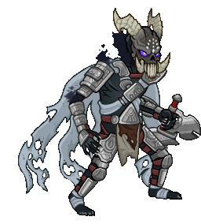
        
        
            Model
        
    

# King of Shadows

The King of Shadows is an ancient and powerful being featured in the NWN 2 official campaign. He is not a pre-existing Forgotten Realms character but one created specifically for NWN2.

[NWN2 Fandom Wiki](https://nwn2.fandom.com/wiki/King_of_Shadows)

# Basic Information

King of Shadows will be a new champion in the Liars' Night event on 1 October 2025.

    
        
            **Seat**:
        
        
            Unknown
        
    
    
        
            **Species**:
        
        
            Outsider (Guess)
        
    
    
        
            **Class**:
        
        
            Unknown
        
    
    
        
            **Roles**:
        
        
            Tanking / DPS / Support (Guess)
        
    
    
        
            **Age**:
        
        
            Unknown
        
    
    
        
            **Gender**:
        
        
            Male (Guess)
        
    
    
        
            **Alignment**:
        
        
            Neutral Evil (Guess)
        
    
    
        
            **Affiliation**:
        
        
            Unknown
        
    

# Formation

    <svg xmlns="http://www.w3.org/2000/svg" id="King of Shadows" fill="#aaa" data-formationName="King of Shadows" data-campaignName="Liar's Night" width="411" height="120"><circle cx="175" cy="65" r="15"/><circle cx="135" cy="85" r="15"/><circle cx="95" cy="25" r="15"/><circle cx="95" cy="65" r="15"/><circle cx="95" cy="105" r="15"/><circle cx="55" cy="45" r="15"/><circle cx="55" cy="85" r="15"/><circle cx="15" cy="25" r="15"/><circle cx="15" cy="65" r="15"/><circle cx="15" cy="105" r="15"/><text x="205" y="25" fill="#dcdcdc" font-size="25" font-family="Arial" font-weight="bold">King of Shadows</text><text x="205" y="65" fill="#dcdcdc" font-size="15" font-family="Arial" font-weight="bold">Liar's Night</text></svg>

# Attacks

**Base Attack: Shadow Strike** (Melee and Magic)
> The King of Shadows slashes the closest enemies, then blasts the enemy with the most health.  
> Cooldown: 5s (Cap 1.25s)

<em>Raw Data</em>

<pre>
{
    "id": 900,
    "name": "Shadow Strike",
    "description": "The King of Shadows slashes the closest enemies, then blasts the enemy with the most health.",
    "long_description": "",
    "graphic_id": 0,
    "target": "front",
    "num_targets": 1,
    "aoe_radius": 0,
    "damage_modifier": 1,
    "cooldown": 5,
    "animations": [
        {
            "type": "melee_attack",
            "special_melee": "king_of_shadows",
            "target_offset": [
                -200,
                0
            ],
            "seq_chargeloop": 1,
            "attack_sounds": {
                "melee": 179,
                "eb": 184
            }
        }
    ],
    "tags": [
        "melee",
        "ranged"
    ],
    "damage_types": [
        "melee",
        "magic"
    ]
}
</pre>

**Base Attack: Shadow Reaver Projectile** (Ranged)
> Unknown effect.  
> Cooldown: 5s (Cap 1.25s)

<em>Raw Data</em>

<pre>
{
    "id": 901,
    "name": "Shadow Reaver Projectile",
    "description": "",
    "long_description": "",
    "graphic_id": 0,
    "target": "random",
    "num_targets": 1,
    "aoe_radius": 0,
    "damage_modifier": 1,
    "cooldown": 5,
    "animations": [
        {
            "type": "ranged_attack",
            "projectile": "pd_generic_projectile",
            "shoot_frame": 13,
            "shoot_sound": 149,
            "hit_sound": 133,
            "projectile_details": {
                "hash": "db5275b6192a29d07c891fd49a73f44f",
                "target_offset_y": 0,
                "projectile_speed": 2000,
                "projectile_graphic_id": 27533,
                "projectile_hit_graphic_id": 27532
            }
        }
    ],
    "tags": [
        "ranged"
    ],
    "damage_types": [
        "ranged"
    ]
}
</pre>

**Ultimate Attack: Cradle of Rime**
> The King of Shadows blasts all enemies with cold and necrotic energies, slowing their movement for a short while.  
> Cooldown: 600s (Cap 150s)

<em>Raw Data</em>

<pre>
{
    "id": 902,
    "name": "Cradle of Rime",
    "description": "The King of Shadows blasts all enemies, slowing their movement.",
    "long_description": "The King of Shadows blasts all enemies with cold and necrotic energies, slowing their movement for a short while.",
    "graphic_id": 27513,
    "target": "all",
    "num_targets": 1,
    "aoe_radius": 0,
    "damage_modifier": 0.03,
    "cooldown": 600,
    "animations": [
        {
            "type": "ultimate_attack",
            "ultimate": "king_of_shadows",
            "projectile_data": {
                "type": "ranged_attack",
                "shoot_offset_y": -182,
                "shoot_offset_x": -25,
                "shoot_frame": 29,
                "shoot_sound": 149,
                "hit_sound": 133,
                "projectile_details": {
                    "hash": "king_of_shadows_ult_blast",
                    "projectile_speed": 1500,
                    "projectile_graphic_id": 687,
                    "impact_graphic_id": 19999,
                    "smoke_graphic_id": 446,
                    "explosion_graphic_id": 27562
                }
            },
            "damage_frame": 8,
            "effects_on_monsters": [
                {
                    "effect_string": "monster_speed_reduce,50",
                    "for_time": 30
                }
            ]
        }
    ],
    "tags": [
        "magic",
        "ultimate"
    ],
    "damage_types": [
        "magic"
    ]
}
</pre>

# Abilities

**Unknown** (Guess)
> The King of Shadows is Undead and counts as 'dead' for the purposes of effects that care about dead Champions, but 'alive' for all other purposes.

<em>Raw Data</em>

<pre>
{
    "id": 2446,
    "flavour_text": "",
    "description": {
        "desc": "The King of Shadows is Undead and counts as 'dead' for the purposes of effects that care about dead Champions, but 'alive' for all other purposes."
    },
    "effect_keys": [
        {
            "effect_string": "appear_dead"
        }
    ],
    "requirements": "",
    "graphic_id": 0,
    "large_graphic_id": 0,
    "properties": {
        "is_formation_ability": true,
        "owner_use_outgoing_description": true,
        "indexed_effect_properties": true,
        "per_effect_index_bonuses": true,
        "default_bonus_index": 0
    }
}
</pre>

**Phase One: The Watcher** (Guess)
> When you complete an area with the King of Shadows leading the formation from the front, he updates his current Toughness and Brutality stacks to the completed area number. When the King of Shadows is defeated for the first time, he immediately returns to full health, his Toughness stacks no longer update, and he enters Phase Two. When the King of Shadows is defeated for the second time, he immediately returns to full health, his Brutality stacks no longer update, and he enters Phase Three. His size increases by 25% each time he enters a new phase. Other abilities grant additional buffs upon gaining these new phases.

<em>Raw Data</em>

<pre>
{
    "id": 2447,
    "flavour_text": "",
    "description": {
        "desc": "When you complete an area with the King of Shadows leading the formation from the front, he updates his current Toughness and Brutality stacks to the completed area number. When the King of Shadows is defeated for the first time, he immediately returns to full health, his Toughness stacks no longer update, and he enters Phase Two. When the King of Shadows is defeated for the second time, he immediately returns to full health, his Brutality stacks no longer update, and he enters Phase Three. His size increases by $amount% each time he enters a new phase. Other abilities grant additional buffs upon gaining these new phases.",
        "post": {
            "conditions": [
                {
                    "condition": "not static_desc",
                    "desc": "^^ Toughness Stacks: $(stat_value kos_toughness_stacks 1 none)^^ Brutality Stacks: $(stat_value kos_brutality_stacks 1 none)"
                }
            ]
        }
    },
    "effect_keys": [
        {
            "effect_string": "king_of_shadows_phases,25",
            "pre_kill_priority": 1080,
            "off_when_benched": true
        }
    ],
    "requirements": "",
    "graphic_id": 0,
    "large_graphic_id": 0,
    "properties": {
        "is_formation_ability": true,
        "owner_use_outgoing_description": true,
        "indexed_effect_properties": true,
        "per_effect_index_bonuses": true,
        "default_bonus_index": 0
    }
}
</pre>

**Power of the King** (Guess)
> The King of Shadows increases the damage of himself and Champions in the two columns behind him by 100%. This is increased by 100% each time the King of Shadows' max health is doubled, stacking multiplicatively.

<em>Raw Data</em>

<pre>
{
    "id": 2448,
    "flavour_text": "",
    "description": {
        "desc": "The King of Shadows increases the damage of himself and Champions in the two columns behind him by $king_of_shadows_power_king%. This is increased by $(amount___3)% each time the King of Shadows' max health is doubled, stacking multiplicatively."
    },
    "effect_keys": [
        {
            "effect_string": "buff_upgrade,100,17757",
            "amount_expr": "upgrade_amount(17757,2)",
            "off_when_benched": true,
            "amount_func": "mult",
            "stack_func": "per_hero_attribute",
            "post_process_expr": "log(GetHeroHP(168)/GetHeroBaseHP(168))/log(2)",
            "amount_updated_listeners": [
                "max_health_changed",
                "feat_changed"
            ],
            "total_title": "Base Buff Bonus",
            "show_bonus": true
        },
        {
            "effect_string": "hero_dps_multiplier_mult,100",
            "off_when_benched": true,
            "targets": [
                "self_and_prev_two_col"
            ],
            "amount_updated_listeners": [
                "slot_changed",
                "feat_changed"
            ],
            "show_bonus": true
        },
        {
            "effect_string": "pre_stack,100"
        }
    ],
    "requirements": "",
    "graphic_id": 27500,
    "large_graphic_id": 27495,
    "properties": {
        "is_formation_ability": true,
        "owner_use_outgoing_description": true,
        "indexed_effect_properties": true,
        "per_effect_index_bonuses": true,
        "default_bonus_index": 1
    }
}
</pre>

**Shadow Plague** (Guess)
> The King of Shadows damages all adjacent Champions for 4% of their max health each second, as long as the Champions have at least 20% of their max health remaining. Each time The King of Shadows successfully deals damage in this manner, he gains a Shadow Plague stack. Each Shadow Plague stack increases his own max health by 4%, stacking additively. Stacks cap at 250 and reset when changing areas.

<em>Raw Data</em>

<pre>
{
    "id": 2449,
    "flavour_text": "",
    "description": {
        "desc": "The King of Shadows damages all adjacent Champions for $damage_percent% of their max health each second, as long as the Champions have at least $health_min_percent% of their max health remaining. Each time The King of Shadows successfully deals damage in this manner, he gains a Shadow Plague stack. Each Shadow Plague stack increases his own max health by $(amount___2)%, stacking additively. Stacks cap at $(max_stacks___2) and reset when changing areas."
    },
    "effect_keys": [
        {
            "effect_string": "king_of_shadows_shadow_plague",
            "off_when_benched": true,
            "targets": [
                "adj"
            ],
            "health_min_percent": 20,
            "damage_percent": 4,
            "health_buff_index": 1,
            "override_key_desc": "$target takes $damage_percent% of their max health each second, as long as $target has at least $health_min_percent% of their max health remaining"
        },
        {
            "effect_string": "health_mult,4",
            "stacks_on_trigger": "will_stack_manually",
            "max_stacks": 250,
            "stacks_multiply": false,
            "show_bonus": true
        }
    ],
    "requirements": "",
    "graphic_id": 27501,
    "large_graphic_id": 27496,
    "properties": {
        "is_formation_ability": true,
        "retain_on_slot_changed": true,
        "is_buff_incoming_formation_abilities_target": false,
        "owner_use_outgoing_description": true,
        "indexed_effect_properties": true,
        "per_effect_index_bonuses": true,
        "default_bonus_index": 0
    }
}
</pre>

**Phase Two: The Warden** (Guess)
> After the King of Shadows enters Phase Two, his health is increased by 1% for each Toughness stack he collected, stacking additively. He also increases the health of all other Champions by 25% of his max health, and healing effects on all Champions are increased by 25%.

<em>Raw Data</em>

<pre>
{
    "id": 2450,
    "flavour_text": "",
    "description": {
        "desc": "After the King of Shadows enters Phase Two, his health is increased by $(amount___2)% for each Toughness stack he collected, stacking additively. He also increases the health of all other Champions by $(amount___3)% of his max health, and healing effects on all Champions are increased by $(amount___4)%."
    },
    "effect_keys": [
        {
            "effect_string": "apply_effects_at_stacks",
            "off_when_benched": true,
            "show_description": false,
            "apply_effect_stack_amounts": [
                1,
                1,
                1
            ],
            "stacks_on_trigger": "will_stack_manually",
            "stacks_from_amount_func": "get_stat",
            "instance_stat": true,
            "stat": "kos_phase",
            "amount_updated_listeners": [
                "stat_changed,kos_phase",
                "slot_changed"
            ]
        },
        {
            "effect_string": "health_mult,1",
            "stacks_on_trigger": "will_stack_manually",
            "stacks_from_amount_func": "get_stat",
            "instance_stat": true,
            "stat": "kos_toughness_stacks",
            "amount_updated_listeners": [
                "stat_changed,kos_toughness_stacks",
                "slot_changed"
            ],
            "stacks_multiply": false,
            "show_bonus": true,
            "apply_manually": true
        },
        {
            "off_when_benched": true,
            "effect_string": "increase_health_by_source_percent,25",
            "targets": [
                "other"
            ],
            "show_bonus": true,
            "apply_manually": true
        },
        {
            "effect_string": "global_healing_mult,25",
            "show_bonus": true,
            "apply_manually": true
        }
    ],
    "requirements": "",
    "graphic_id": 27503,
    "large_graphic_id": 27498,
    "properties": {
        "is_formation_ability": true,
        "owner_use_outgoing_description": true,
        "indexed_effect_properties": true,
        "per_effect_index_bonuses": true,
        "default_bonus_index": 1
    }
}
</pre>

**Phase Three: The Warrior** (Guess)
> After the King of Shadows enters Phase Three, his damage is increased by 5% for each Brutality stack, stacking multiplicatively.

<em>Raw Data</em>

<pre>
{
    "id": 2451,
    "flavour_text": "",
    "description": {
        "desc": "After the King of Shadows enters Phase Three, his damage is increased by $(not_buffed amount___2)% for each Brutality stack, stacking multiplicatively."
    },
    "effect_keys": [
        {
            "effect_string": "apply_effects_at_stacks",
            "off_when_benched": true,
            "show_description": false,
            "apply_effect_stack_amounts": [
                2
            ],
            "stacks_on_trigger": "will_stack_manually",
            "stacks_from_amount_func": "get_stat",
            "instance_stat": true,
            "stat": "kos_phase",
            "amount_updated_listeners": [
                "stat_changed,kos_phase",
                "slot_changed"
            ]
        },
        {
            "effect_string": "hero_dps_multiplier_mult,5",
            "stacks_on_trigger": "will_stack_manually",
            "stacks_from_amount_func": "get_stat",
            "instance_stat": true,
            "stat": "kos_brutality_stacks",
            "amount_updated_listeners": [
                "stat_changed,kos_brutality_stacks",
                "slot_changed"
            ],
            "apply_manually": true,
            "stacks_multiply": true,
            "show_bonus": true
        }
    ],
    "requirements": "",
    "graphic_id": 27504,
    "large_graphic_id": 27499,
    "properties": {
        "is_formation_ability": true,
        "owner_use_outgoing_description": true,
        "indexed_effect_properties": true,
        "per_effect_index_bonuses": true,
        "default_bonus_index": 1
    }
}
</pre>

**Shadow Reavers** (Guess)
> After the King of Shadows enters Phase Two, he summons a Shadow Reaver each time he uses his ultimate. An additional Shadow Reaver is summoned for every 500 Toughness stacks he has. Each Shadow Reaver attacks a random enemy once every 5 seconds dealing 5 seconds of BUD-based damage. The Shadow Reavers last for 1 second plus 0.1 seconds for each Toughness stack he has. Using his ultimate again before the Shadow Reavers expire causes their duration to be refreshed to max.

<em>Raw Data</em>

<pre>
{
    "id": 2452,
    "flavour_text": "",
    "description": {
        "desc": "After the King of Shadows enters Phase Two, he summons a Shadow Reaver each time he uses his ultimate. An additional Shadow Reaver is summoned for every $reaver_per_toughness Toughness stacks he has. Each Shadow Reaver attacks a random enemy once every $attack_cooldown seconds dealing $seconds_of_bud seconds of BUD-based damage. The Shadow Reavers last for $base_duration second plus $duration_per_toughness seconds for each Toughness stack he has. Using his ultimate again before the Shadow Reavers expire causes their duration to be refreshed to max."
    },
    "effect_keys": [
        {
            "effect_string": "king_of_shadows_shadow_reavers",
            "off_when_benched": true,
            "reaver_per_toughness": 500,
            "duration_per_toughness": 0.1,
            "attack_cooldown": 5,
            "seconds_of_bud": 5,
            "base_duration": 1,
            "shadow_reaver_sequences": {
                "idle": 1,
                "walk": 1,
                "shoot": 2,
                "gethit": 3
            }
        }
    ],
    "requirements": "",
    "graphic_id": 27502,
    "large_graphic_id": 27497,
    "properties": {
        "is_formation_ability": true,
        "owner_use_outgoing_description": true,
        "retain_on_slot_changed": true,
        "indexed_effect_properties": true,
        "per_effect_index_bonuses": true,
        "default_bonus_index": 0
    }
}
</pre>

# Specialisations

**Master of Pawns** (Guess)
> Increases the effect of Power of the King by 100%.

<em>Raw Data</em>

<pre>
{
    "id": 2453,
    "flavour_text": "",
    "description": {
        "desc": "Increases the effect of Power of the King by $amount%."
    },
    "effect_keys": [
        {
            "effect_string": "buff_upgrade,100,17757",
            "off_when_benched": true
        }
    ],
    "requirements": "",
    "graphic_id": 27510,
    "large_graphic_id": 27510,
    "properties": {
        "is_formation_ability": true,
        "owner_use_outgoing_description": true,
        "indexed_effect_properties": true,
        "per_effect_index_bonuses": true,
        "default_bonus_index": 0
    }
}
</pre>

**Shadow Unleashed** (Guess)
> Increases the effect of Phase Three: The Warrior by 1000%.

<em>Raw Data</em>

<pre>
{
    "id": 2454,
    "flavour_text": "",
    "description": {
        "desc": "Increases the effect of Phase Three: The Warrior by $amount%."
    },
    "effect_keys": [
        {
            "effect_string": "buff_upgrade,1000,17760",
            "off_when_benched": true
        }
    ],
    "requirements": "",
    "graphic_id": 27512,
    "large_graphic_id": 27512,
    "properties": {
        "is_formation_ability": true,
        "owner_use_outgoing_description": true,
        "indexed_effect_properties": true,
        "per_effect_index_bonuses": true,
        "default_bonus_index": 0
    }
}
</pre>

**Legacy of Illfarn** (Guess)
> Increases the effect of Power of the King by 100% for each Elf, Dwarf, Half-Elf, and/or Human Champion in the formation, stacking multiplicatively.

ⓘ *Note: This ability is prestack.*

<em>Raw Data</em>

<pre>
{
    "id": 2455,
    "flavour_text": "",
    "description": {
        "desc": "Increases the effect of Power of the King by $amount% for each Elf, Dwarf, Half-Elf, and/or Human Champion in the formation, stacking multiplicatively."
    },
    "effect_keys": [
        {
            "effect_string": "pre_stack,100",
            "skip_effect_key_desc": true
        },
        {
            "effect_string": "buff_upgrade,0,17757",
            "off_when_benched": true,
            "amount_expr": "upgrade_amount(17764,0)",
            "amount_func": "mult",
            "stack_func": "per_hero_attribute",
            "per_hero_expr": "HasTag(`elf`) || HasTag(`half-elf`) || HasTag(`dwarf`) || HasTag(`human`)",
            "amount_updated_listeners": [
                "slot_changed",
                "hero_tags_changed"
            ],
            "show_bonus": true
        }
    ],
    "requirements": "",
    "graphic_id": 27509,
    "large_graphic_id": 27509,
    "properties": {
        "is_formation_ability": true,
        "owner_use_outgoing_description": true,
        "indexed_effect_properties": true,
        "per_effect_index_bonuses": true,
        "default_bonus_index": 0,
        "spec_option_post_apply_info": "Qualified Champions: $num_stacks___2"
    }
}
</pre>

**Embrace the Shadow** (Guess)
> Increases the effect of Power of the King by 200% for each Evil Champion in the formation, stacking multiplicatively.

ⓘ *Note: This ability is prestack.*

<em>Raw Data</em>

<pre>
{
    "id": 2456,
    "flavour_text": "",
    "description": {
        "desc": "Increases the effect of Power of the King by $amount% for each Evil Champion in the formation, stacking multiplicatively."
    },
    "effect_keys": [
        {
            "effect_string": "pre_stack,200",
            "skip_effect_key_desc": true
        },
        {
            "effect_string": "buff_upgrade,0,17757",
            "off_when_benched": true,
            "amount_expr": "upgrade_amount(17765,0)",
            "amount_func": "mult",
            "stack_func": "per_hero_attribute",
            "per_hero_expr": "HasTag(`evil`)",
            "amount_updated_listeners": [
                "slot_changed",
                "hero_tags_changed"
            ],
            "show_bonus": true
        }
    ],
    "requirements": "",
    "graphic_id": 27508,
    "large_graphic_id": 27508,
    "properties": {
        "is_formation_ability": true,
        "owner_use_outgoing_description": true,
        "indexed_effect_properties": true,
        "per_effect_index_bonuses": true,
        "default_bonus_index": 0,
        "spec_option_post_apply_info": "Evil Champions: $num_stacks___2"
    }
}
</pre>

**Rite of Survival** (Guess)
> Increases the effect of Power of the King by 300% for each Champion with the Healing role, stacking multiplicatively. Additionally, Shadow Plague no longer has a minimum health at which Champions will not be damaged, and the Shadow Plague stack cap is doubled.

ⓘ *Note: This ability is prestack.*

<em>Raw Data</em>

<pre>
{
    "id": 2457,
    "flavour_text": "",
    "description": {
        "desc": "Increases the effect of Power of the King by $amount% for each Champion with the Healing role, stacking multiplicatively. Additionally, Shadow Plague no longer has a minimum health at which Champions will not be damaged, and the Shadow Plague stack cap is doubled."
    },
    "effect_keys": [
        {
            "effect_string": "pre_stack,300",
            "skip_effect_key_desc": true
        },
        {
            "effect_string": "buff_upgrade,0,17757",
            "off_when_benched": true,
            "amount_expr": "upgrade_amount(17766,0)",
            "amount_func": "mult",
            "stack_func": "per_hero_attribute",
            "per_hero_expr": "HasTag(`healing`)",
            "amount_updated_listeners": [
                "slot_changed",
                "hero_tags_changed"
            ],
            "show_bonus": true
        },
        {
            "effect_string": "change_upgrade_data,17758",
            "data": {
                "health_min_percent": 0
            }
        },
        {
            "effect_string": "change_upgrade_data,17758,1",
            "data": {
                "max_stacks": 500
            }
        }
    ],
    "requirements": "",
    "graphic_id": 27511,
    "large_graphic_id": 27511,
    "properties": {
        "is_formation_ability": true,
        "owner_use_outgoing_description": true,
        "indexed_effect_properties": true,
        "per_effect_index_bonuses": true,
        "default_bonus_index": 0,
        "spec_option_post_apply_info": "Healing Champions: $num_stacks___2"
    }
}
</pre>

# Items

    
        
            **Icons**
        
        
            **Name**
        
    
    
        
            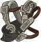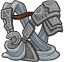
        
        
            Armor
        
    
    
        
            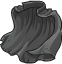
        
        
            Cloak
        
    
    
        
            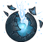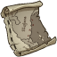
        
        
            History Items
        
    
    
        
            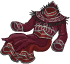
        
        
            Shadow Reaver Gear
        
    
    
        
            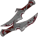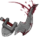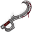
        
        
            Weapons
        
    
    
        
            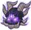
        
        
            Helm Mask
        
    

# Feats

Unknown.

# Legendaries

Unknown.

# Adventures and Variants

**Unlock Adventure: The Trickster's Delight (King of Shadows)** (Complete Area 50)
> Chase down a masked man who has performed a daring heist.

 **Variant 1: There's a New Boss in Town** (Complete Area 75)
> The King of Shadows starts in the formation. He can't be moved or removed.  
> Only the King of Shadows and Champions in the two columns behind him can deal damage.  
> All boss enemies deal 100% additional damage.  
> A Mad Wizard has a 50% chance to spawn in the second wave of each non-boss area. No other enemies can be damaged while the Mad Wizard is alive.  
> Getting to Know The King of Shadows: The King of Shadows main support ability increases his damage and the damage of Champions in the two columns behind him.

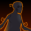 **Variant 2: Shadows of the Past** (Complete Area 125)
> The King of Shadows starts in the formation. He can't be moved or removed.  
> Two Shadow escorts join the formation.   
> Healing effects on Champions adjacent to one or more Shadows are reduced by 50%.   
> Getting to Know The King of Shadows: The King of Shadows gains Tanking and DPS abilities that get stronger the longer it takes for him to be defeated. Use healers and tanking Champions with Taunt to have him last longer!

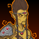 **Variant 3: A Path Through the Astral Plane** (Complete Area 175)
> The King of Shadows starts in the formation. He can't be moved or removed.  
> You may only use Elf, Dwarf, Half-Elf, Human, Evil, and/or Healing Champions.  
> 1-2 Githyanki Warriors spawn with each wave. They deal 500% additional damage to the King of Shadows due to their silver swords, and they don't drop gold nor count towards quest progress.  
> Getting to Know The King of Shadows: The King of Shadows' second specialization choice determines which Champions he synergizes with best. Which set will you choose?

# Other Champion Images

    
        
            Console Portrait
        
    
    
        
            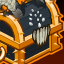Gold Chest Icon
        
        
            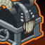Silver Chest Icon
        
    

[Back to Top](#top)

*Last Modified: {{ site.time }}*