[Back to Main](index.md)

    
        
            
        
        
            Portrait
        
    
    
        
            
        
        
            Model
        
    

# Kitiara Uth Matar

[Kitiara Uth Matar - Dragonlace Fandom Wiki](https://dragonlance.fandom.com/wiki/Kitiara_Uth_Matar){:target="_blank"}

# Basic Information

Kitiara Uth Matar will be a new champion - potentially in the Liars' Night event on 7 October 2026.

    
        
            **Seat**:
        
        
            Unknown
        
    
    
        
            **Species**:
        
        
            Human (Guess)
        
    
    
        
            **Class**:
        
        
            Unknown
        
    
    
        
            **Roles**:
        
        
            Unknown
        
    
    
        
            **Age**:
        
        
            Unknown
        
    
    
        
            **Gender**:
        
        
            Female (Guess)
        
    
    
        
            **Alignment**:
        
        
            Unknown
        
    
    
        
            **Affiliation**:
        
        
            Heroes of the Lance (Guess)
        
    

# Formation

    <svg xmlns="http://www.w3.org/2000/svg" id="Kitiara" fill="#aaa" data-formationName="Kitiara" data-campaignName="Liar's Night" width="291" height="120"><circle cx="175" cy="25" r="15"/><circle cx="175" cy="65" r="15"/><circle cx="175" cy="105" r="15"/><circle cx="135" cy="45" r="15"/><circle cx="135" cy="85" r="15"/><circle cx="95" cy="65" r="15"/><circle cx="95" cy="105" r="15"/><circle cx="55" cy="45" r="15"/><circle cx="55" cy="85" r="15"/><circle cx="15" cy="65" r="15"/><text x="205" y="25" fill="#dcdcdc" font-size="25" font-family="Arial" font-weight="bold">Kitiara</text><text x="205" y="65" fill="#dcdcdc" font-size="15" font-family="Arial" font-weight="bold">Liar's Night</text></svg>

# Attacks

Unknown.

# Abilities

**Arrogant Charm** (Guess)
> Unknown effect.

<em>Raw Data</em>

<pre>
{
    "id": 31331,
    "graphic": "Icons/Events/2017LiarsNight/Liars Night Y10/Icon_Formation_KitiaraArrogantCharm",
    "v": 2,
    "fs": 0,
    "p": 0,
    "type": 1,
    "export_params": {
        "uses": [
            "formation_icon"
        ],
        "quantize": true
    }
}
</pre>

**Cruel Cunning** (Guess)
> Unknown effect.

<em>Raw Data</em>

<pre>
{
    "id": 31332,
    "graphic": "Icons/Events/2017LiarsNight/Liars Night Y10/Icon_Formation_KitiaraCruelCunning",
    "v": 2,
    "fs": 0,
    "p": 0,
    "type": 1,
    "export_params": {
        "uses": [
            "formation_icon"
        ],
        "quantize": true
    }
}
</pre>

**Knight of the Black Rose** (Guess)
> Unknown effect.

<em>Raw Data</em>

<pre>
{
    "id": 31333,
    "graphic": "Icons/Events/2017LiarsNight/Liars Night Y10/Icon_Formation_KitiaraKnightoftheBlackRose",
    "v": 2,
    "fs": 0,
    "p": 0,
    "type": 1,
    "export_params": {
        "uses": [
            "formation_icon"
        ],
        "quantize": true
    }
}
</pre>

**Merciless Resolve** (Guess)
> Unknown effect.

<em>Raw Data</em>

<pre>
{
    "id": 31334,
    "graphic": "Icons/Events/2017LiarsNight/Liars Night Y10/Icon_Formation_KitiaraMercilessResolve",
    "v": 2,
    "fs": 0,
    "p": 0,
    "type": 1,
    "export_params": {
        "uses": [
            "formation_icon"
        ],
        "quantize": true
    }
}
</pre>

**The Only Truth** (Guess)
> Unknown effect.

<em>Raw Data</em>

<pre>
{
    "id": 31335,
    "graphic": "Icons/Events/2017LiarsNight/Liars Night Y10/Icon_Formation_KitiaraTheOnlyTruth",
    "v": 2,
    "fs": 0,
    "p": 0,
    "type": 1,
    "export_params": {
        "uses": [
            "formation_icon"
        ],
        "quantize": true
    }
}
</pre>

# Specialisations

**Loyal To Darkness** (Guess)
> Unknown effect.

<em>Raw Data</em>

<pre>
{
    "id": 31336,
    "graphic": "Icons/Events/2017LiarsNight/Liars Night Y10/Icon_Specialization_KitiaraLoyalToDarkness",
    "v": 2,
    "fs": 0,
    "p": 0,
    "type": 1,
    "export_params": {
        "uses": [
            "specialization_icon"
        ],
        "quantize": true
    }
}
</pre>

**Loyal To Her Past** (Guess)
> Unknown effect.

<em>Raw Data</em>

<pre>
{
    "id": 31337,
    "graphic": "Icons/Events/2017LiarsNight/Liars Night Y10/Icon_Specialization_KitiaraLoyalToHerPast",
    "v": 2,
    "fs": 0,
    "p": 0,
    "type": 1,
    "export_params": {
        "uses": [
            "specialization_icon"
        ],
        "quantize": true
    }
}
</pre>

**Loyal To Herself** (Guess)
> Unknown effect.

<em>Raw Data</em>

<pre>
{
    "id": 31338,
    "graphic": "Icons/Events/2017LiarsNight/Liars Night Y10/Icon_Specialization_KitiaraLoyalToHerself",
    "v": 2,
    "fs": 0,
    "p": 0,
    "type": 1,
    "export_params": {
        "uses": [
            "specialization_icon"
        ],
        "quantize": true
    }
}
</pre>

# Items

    
        
            **Icons**
        
        
            **Name**
        
    
    
        
            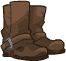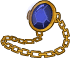
        
        
            Accessories
        
    
    
        
            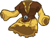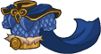
        
        
            Armour
        
    
    
        
            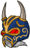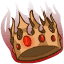
        
        
            Headpieces
        
    
    
        
            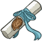
        
        
            Letters
        
    
    
        
            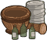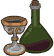
        
        
            Miscellaneous
        
    
    
        
            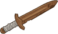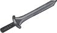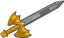
        
        
            Weapons
        
    

# Feats

Unknown.

# Legendaries

Unknown.

# Adventures and Variants

**Unlock Adventure: The Trickster's Delight (Kitiara)** (Complete Area 50)
> Chase down a masked man who has performed a daring heist.

**Variant 1: Variant 1** (Complete Area 75)
> 

**Variant 2: Variant 2** (Complete Area 125)
> 

**Variant 3: Variant 3** (Complete Area 175)
> 

# Other Champion Images

    
        
            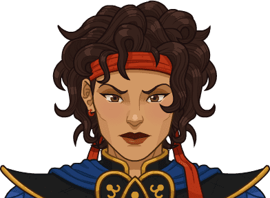Console Portrait
        
    
    
        
            Gold Chest Icon
        
        
            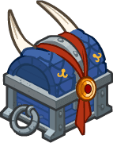Silver Chest Icon
        
    

[Back to Top](#top)

*Last Modified: {{ site.time }}*