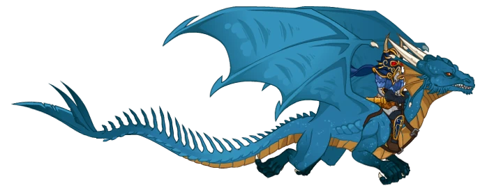

[Back to Main](index.md)

    
        
            
        
        
            Portrait
        
    
    
        
            
        
        
            Base Model
        
    
    
        
            
        
        
            Skie Model
        
    

# Kitiara Uth Matar

[Kitiara Uth Matar - Dragonlace Fandom Wiki](https://dragonlance.fandom.com/wiki/Kitiara_Uth_Matar){:target="_blank"}

# Basic Information

Kitiara Uth Matar will be a new champion in the Liars' Night event on 7 October 2026.

  **Seat**:
  Unknown
  **Species**:
  Human (Guess)
  **Class**:
  Unknown
  **Roles**:
  Support / Control (Guess)
  **Age**:
  Unknown
  **Gender**:
  Female (Guess)
  **Alignment**:
  Unknown
  **Affiliation**:
  - (Guess)

# Formation

    <svg xmlns="http://www.w3.org/2000/svg" id="Kitiara" fill="#aaa" data-formationName="Kitiara" data-campaignName="Liar's Night" width="291" height="120"><circle cx="175" cy="25" r="15"/><circle cx="175" cy="65" r="15"/><circle cx="175" cy="105" r="15"/><circle cx="135" cy="45" r="15"/><circle cx="135" cy="85" r="15"/><circle cx="95" cy="65" r="15"/><circle cx="95" cy="105" r="15"/><circle cx="55" cy="45" r="15"/><circle cx="55" cy="85" r="15"/><circle cx="15" cy="65" r="15"/><text x="205" y="25" fill="#dcdcdc" font-size="25" font-family="Arial" font-weight="bold">Kitiara</text><text x="205" y="65" fill="#dcdcdc" font-size="15" font-family="Arial" font-weight="bold">Liar's Night</text></svg>

# Attacks

**Base Attack: Unpredictable Assault** (Melee)
> Kitiara strikes out at an unsuspecting random enemy with her sharpened blade.  
> Cooldown: 4s (Cap 1s)

<em>Raw Data</em>

<pre>
{
    "id": 1002,
    "name": "Unpredictable Assault",
    "description": "Kitiara strikes out at an unsuspecting random enemy with her sharpened blade.",
    "long_description": "",
    "graphic_id": 0,
    "target": "front",
    "num_targets": 1,
    "aoe_radius": 0,
    "damage_modifier": 1,
    "cooldown": 4,
    "animations": [
        {
            "type": "melee_attack",
            "target_offset_x": -34,
            "damage_frame": 2,
            "jump_sound": 30,
            "sound_frames": {
                "2": 154
            }
        }
    ],
    "tags": [
        "melee"
    ],
    "damage_types": [
        "melee"
    ]
}
</pre>

**Ultimate Attack: Blue Dragon Strafe** (Guess)
> Kitiara and her blue dragon Skie blast the entire battlefield with lightning - multiple times with enough Power. Previously charmed enemies who survive are awed by this display of power and are able to be charmed by Kitiara again.  
> Cooldown: 300s (Cap 75s)

<em>Raw Data</em>

<pre>
{
    "id": 1003,
    "name": "Blue Dragon Strafe",
    "description": "Kitiara commands a blue dragon to blast the entire battlefield with lightning.",
    "long_description": "Kitiara and her blue dragon Skie blast the entire battlefield with lightning - multiple times with enough Power. Previously charmed enemies who survive are awed by this display of power and are able to be charmed by Kitiara again.",
    "graphic_id": 28968,
    "target": "all",
    "num_targets": 1,
    "aoe_radius": 0,
    "damage_modifier": 0.03,
    "cooldown": 300,
    "animations": [
        {
            "type": "kitiara_ultimate",
            "dragon_sequences": {
                "fly": 0,
                "breathefire": 1
            },
            "projectile_data": {
                "type": "ranged_attack",
                "projectile": "fire_breath_simple",
                "single_projectile": false,
                "does_no_damage": true,
                "shoot_offset_x": 166,
                "shoot_offset_y": -98,
                "auto_projectile_angle": false,
                "projectile_angle": -135,
                "hold_time": 2,
                "particle_duration": 0.7,
                "projectile_strength": 1200
            }
        }
    ],
    "tags": [
        "magic",
        "ultimate"
    ],
    "damage_types": [
        "magic"
    ]
}
</pre>

# Abilities

**Merciless Resolve** (Guess)
> Kitiara increases the damage of all Champions furthest from her by 100% for each Champion adjacent to her, stacking multiplicatively.

ⓘ *Note: This ability is prestack.*

<em>Raw Data</em>

<pre>
{
    "id": 2913,
    "flavour_text": "",
    "description": {
        "desc": "Kitiara increases the damage of all Champions furthest from her by $(amount)% for each Champion adjacent to her, stacking multiplicatively."
    },
    "effect_keys": [
        {
            "effect_string": "pre_stack,100"
        },
        {
            "effect_string": "hero_dps_multiplier_mult,100",
            "targets": [
                "farthest_away_hero"
            ],
            "stack_func": "per_hero_attribute",
            "post_process_expr": "as_int(GetUpgradeStacks(20597, 2))",
            "amount_func": "mult",
            "amount_expr": "upgrade_amount(20597,0)",
            "stack_title": "Merciless Stacks",
            "off_when_benched": true,
            "show_bonus": true,
            "amount_updated_listeners": [
                "upgrade_unlocked",
                "slot_changed"
            ],
            "use_computed_amount_for_description": true
        },
        {
            "effect_string": "do_nothing,0",
            "skip_effect_key_desc": true,
            "show_stacks": false,
            "show_bonus": false,
            "stack_func": "adjacent_champions",
            "amount_updated_listeners": [
                "upgrade_unlocked",
                "slot_changed"
            ]
        },
        {
            "effect_string": "merciless_resolve",
            "skip_effect_key_desc": true,
            "targets": [
                "farthest_away_hero"
            ],
            "off_when_benched": true,
            "amount_updated_listeners": [
                "upgrade_unlocked",
                "slot_changed"
            ]
        }
    ],
    "requirements": "",
    "graphic_id": 31334,
    "large_graphic_id": 31329,
    "properties": {
        "is_formation_ability": true,
        "formation_circle_icon": false,
        "owner_use_outgoing_description": true,
        "indexed_effect_properties": true,
        "per_effect_index_bonuses": true,
        "default_bonus_index": 0
    }
}
</pre>

**Arrogant Charm** (Guess)
> Kitiara charms all enemies that attempt to attack her, stunning them indefinitely. The stun is removed when the enemy is hit by Kitiara, and each enemy can only be charmed once.

<em>Raw Data</em>

<pre>
{
    "id": 2914,
    "flavour_text": "",
    "description": {
        "desc": "Kitiara charms all enemies that attempt to attack her, stunning them indefinitely. The stun is removed when the enemy is hit by Kitiara, and each enemy can only be charmed once."
    },
    "effect_keys": [
        {
            "effect_string": "kitiara_arrogant_charm_handler",
            "loyal_to_herself_upgrade_id": 20603
        }
    ],
    "requirements": "",
    "graphic_id": 31331,
    "large_graphic_id": 31326,
    "properties": {
        "is_formation_ability": true,
        "owner_use_outgoing_description": true,
        "retain_on_slot_changed": true
    }
}
</pre>

**The Only Truth** (Guess)
> When Champions other than Kitiara cumulatively take damage equal to 100% of their max health, Kitiara gains a Power stack. This can trigger multiple times each time other Champions reach the threshold. The post-stack effect of Merciless Resolve is increased by 10% for each Power stack she has, stacking multiplicatively. Caps at 100 stacks and reset when changing areas.

<em>Raw Data</em>

<pre>
{
    "id": 2915,
    "flavour_text": "",
    "description": {
        "desc": "When Champions other than Kitiara cumulatively take damage equal to 100% of their max health, Kitiara gains a Power stack. This can trigger multiple times each time other Champions reach the threshold.  The post-stack effect of Merciless Resolve is increased by 10% for each Power stack she has, stacking multiplicatively. Caps at 100 stacks and reset when changing areas."
    },
    "effect_keys": [
        {
            "effect_string": "kitiara_the_only_truth_handler",
            "off_when_benched": true,
            "power_index": 1,
            "loyal_to_herself_stack_index": 1,
            "loyal_to_her_past_upgrade_id": 20602,
            "loyal_to_darkness_upgrade_id": 20604,
            "stack_reset_mult": 0
        },
        {
            "effect_string": "buff_upgrade,10,20597,2",
            "off_when_benched": true,
            "stacks_on_trigger": "will_stack_manually",
            "stacks_multiply": true,
            "show_bonus": true,
            "stack_title": "Power Stacks"
        }
    ],
    "requirements": "",
    "graphic_id": 31335,
    "large_graphic_id": 31330,
    "properties": {
        "is_formation_ability": true,
        "owner_use_outgoing_description": true,
        "retain_on_slot_changed": true
    }
}
</pre>

**Cruel Cunning** (Guess)
> Champions affected by Merciless Resolve deal additional damage to enemies with segmented health. When they successfully break at least one segment, they break additional segments equal to 4 minus the number of Champions affected by Merciless Resolve, to a minimum of 1 extra segment.

<em>Raw Data</em>

<pre>
{
    "id": 2916,
    "flavour_text": "",
    "description": {
        "desc": "Champions affected by Merciless Resolve deal additional damage to enemies with segmented health. When they successfully break at least one segment, they break additional segments equal to $max_stacks minus the number of Champions affected by Merciless Resolve, to a minimum of $min_stacks extra segment."
    },
    "effect_keys": [
        {
            "effect_string": "increase_damage_against_monster_armor_and_hits,1",
            "max_stacks": 4,
            "min_stacks": 1,
            "show_stacks": true,
            "show_bonus": false,
            "stacks_multiply": false,
            "stack_func": "per_hero_attribute",
            "amount_func": "add",
            "per_hero_expr": "HasEffect(`merciless_resolve`)",
            "post_process_expr": "max(1 + (2 * as_int(GetFeatEquipped(2796))), 4 + (2 * as_int(GetFeatEquipped(2795))) - as_int(input))",
            "targets": [
                "farthest_away_hero"
            ],
            "formation_arrows_for_effected_only": true,
            "override_key_desc": "Increases the number of segments broken against enemies with segmented health by $amount",
            "use_computed_amount_for_description": true,
            "amount_updated_listeners": [
                "upgrade_unlocked",
                "slot_changed",
                "positional_formation_ability_changed",
                "feat_changed"
            ]
        }
    ],
    "requirements": "",
    "graphic_id": 31332,
    "large_graphic_id": 31327,
    "properties": {
        "is_formation_ability": true,
        "owner_use_outgoing_description": true
    }
}
</pre>

**Knight of the Black Rose** (Guess)
> When a boss enemy appears, Lord Soth enters the melee. He knocks back all enemies and spawns a wall of skeletal warriors who keep all enemies at bay for 15 seconds. While this skeletal wall persists, Kitiara gains 1 Power stack per second. Lord Soth will reappear and reapply this effect each time the boss's enrage meter reaches a multiple of 5.

<em>Raw Data</em>

<pre>
{
    "id": 2917,
    "flavour_text": "",
    "description": {
        "desc": "When a boss enemy appears, Lord Soth enters the melee. He knocks back all enemies and spawns a wall of skeletal warriors who keep all enemies at bay for $summon_duration seconds. While this skeletal wall persists, Kitiara gains $amount Power stack per second. Lord Soth will reappear and reapply this effect each time the boss's enrage meter reaches a multiple of $enrage_reapply_per."
    },
    "effect_keys": [
        {
            "effect_string": "kitiara_knight_of_the_black_rose_handler,1",
            "summon_duration": 15,
            "enrage_reapply_per": 5,
            "skeleton_wall_graphics": [
                1443,
                15722
            ],
            "skeleton_boss_graphic": 1784,
            "lord_soth_graphic": 18240,
            "the_only_truth_upgrade_id": 20599,
            "loyal_to_darkness_upgrade_id": 20604,
            "power_boost_feat_id": 2798
        }
    ],
    "requirements": "",
    "graphic_id": 31333,
    "large_graphic_id": 31328,
    "properties": {
        "is_formation_ability": true,
        "owner_use_outgoing_description": true
    }
}
</pre>

# Specialisations

**Loyal to Her Past** (Guess)
> Kitiara begrudgingly gains the Heroes of the Lance affiliation, and increases the effect of Merciless Resolve by 100% for each Heroes of the Lance Champion in the formation, stacking multiplicatively. Kitiara also starts each area by gaining Power stacks equal to the number of Heroes of the Lance Champions in the formation.

ⓘ *Note: This ability is prestack.*

<em>Raw Data</em>

<pre>
{
    "id": 2918,
    "flavour_text": "",
    "description": {
        "desc": "Kitiara begrudgingly gains the Heroes of the Lance affiliation, and increases the effect of Merciless Resolve by $amount% for each Heroes of the Lance Champion in the formation, stacking multiplicatively. Kitiara also starts each area by gaining Power stacks equal to the number of Heroes of the Lance Champions in the formation."
    },
    "effect_keys": [
        {
            "effect_string": "pre_stack,100",
            "skip_effect_key_desc": true
        },
        {
            "effect_string": "buff_upgrade,100,20597,2",
            "off_when_benched": true,
            "amount_expr": "upgrade_amount(20602,0)",
            "amount_func": "mult",
            "stack_func": "per_hero_attribute",
            "per_hero_expr": "HasTag(`heroeslance`)",
            "show_bonus": true,
            "stack_title": "Heroes of the Lance Champions",
            "amount_updated_listeners": [
                "slot_changed",
                "hero_tags_changed"
            ]
        },
        {
            "effect_string": "add_hero_tags,0,heroeslance"
        },
        {
            "effect_string": "todo"
        }
    ],
    "requirements": "",
    "graphic_id": 31337,
    "large_graphic_id": 31337,
    "properties": {
        "is_formation_ability": true,
        "owner_use_outgoing_description": true,
        "indexed_effect_properties": true,
        "per_effect_index_bonuses": true,
        "default_bonus_index": 0
    }
}
</pre>

**Loyal to Herself** (Guess)
> Kitiara increases the effect of Merciless Resolve by 100% for each Unaffiliated champion in the formation, stacking multiplicatively. Arrogant Charm will now trigger when enemies attempt to attack any Champions adjacent to Kitiara as well.

ⓘ *Note: This ability is prestack.*

<em>Raw Data</em>

<pre>
{
    "id": 2919,
    "flavour_text": "",
    "description": {
        "desc": "Kitiara increases the effect of Merciless Resolve by $amount% for each Unaffiliated champion in the formation, stacking multiplicatively. Arrogant Charm will now trigger when enemies attempt to attack any Champions adjacent to Kitiara as well."
    },
    "effect_keys": [
        {
            "effect_string": "pre_stack,100",
            "skip_effect_key_desc": true
        },
        {
            "effect_string": "buff_upgrade,100,20597,2",
            "off_when_benched": true,
            "amount_expr": "upgrade_amount(20603,0)",
            "amount_func": "mult",
            "stack_func": "per_hero_attribute",
            "per_hero_expr": "HasTag(`unaffiliated`)",
            "show_bonus": true,
            "stack_title": "Unaffiliated Champions",
            "amount_updated_listeners": [
                "slot_changed",
                "hero_tags_changed"
            ]
        }
    ],
    "requirements": "",
    "graphic_id": 31338,
    "large_graphic_id": 31338,
    "properties": {
        "is_formation_ability": true,
        "owner_use_outgoing_description": true,
        "indexed_effect_properties": true,
        "per_effect_index_bonuses": true,
        "default_bonus_index": 0
    }
}
</pre>

**Loyal to Darkness** (Guess)
> Kitiara increases the effect of Merciless Resolve by 100% for each Evil Champion in the formation, stacking multiplicatively. Knight of the Black Rose's Power stacks gained is also increased by 1.

ⓘ *Note: This ability is prestack.*

<em>Raw Data</em>

<pre>
{
    "id": 2920,
    "flavour_text": "",
    "description": {
        "desc": "Kitiara increases the effect of Merciless Resolve by $amount% for each Evil Champion in the formation, stacking multiplicatively. Knight of the Black Rose's Power stacks gained is also increased by $(amount___3)."
    },
    "effect_keys": [
        {
            "effect_string": "pre_stack,100",
            "skip_effect_key_desc": true
        },
        {
            "effect_string": "buff_upgrade,100,20597,2",
            "off_when_benched": true,
            "amount_expr": "upgrade_amount(20604,0)",
            "amount_func": "mult",
            "stack_func": "per_hero_attribute",
            "per_hero_expr": "HasTag(`evil`)",
            "show_bonus": true,
            "stack_title": "Evil Champions",
            "amount_updated_listeners": [
                "slot_changed",
                "hero_tags_changed"
            ]
        },
        {
            "effect_string": "buff_upgrade_add,1,20601,0",
            "skip_effect_key_desc": true
        }
    ],
    "requirements": "",
    "graphic_id": 31336,
    "large_graphic_id": 31336,
    "properties": {
        "is_formation_ability": true,
        "owner_use_outgoing_description": true,
        "indexed_effect_properties": true,
        "per_effect_index_bonuses": true,
        "default_bonus_index": 0
    }
}
</pre>

# Items

    
        
            **Icons**
        
        
            **Name**
        
    
    
        
            
        
        
            Accessories
        
    
    
        
            
        
        
            Armour
        
    
    
        
            
        
        
            Headpieces
        
    
    
        
            
        
        
            Letters
        
    
    
        
            
        
        
            Miscellaneous
        
    
    
        
            
        
        
            Weapons
        
    

# Feats

Unknown.

# Legendaries

Unknown.

# Adventures and Variants

**Unlock Adventure: The Trickster's Delight (Kitiara)** (Complete Area 50)
> Chase down a masked man who has performed a daring heist.

 **Variant 1: Show No Mercy** (Complete Area 75)
> Kitiara starts in the formation. She can be moved, but not removed.  
> Only Champions buffed by Kitiara's Merciless Resolve can deal damage.  
> Enemies move 100% faster and deal 100% more damage.  
> <b>Getting to Know Kitiara:</b> Kitiara buffs those furthest from her based on how many Champions are close to her. Place her near a lot of Champions, and place your damage deals as far from her as possible.

 **Variant 2: Trust Only Those You Control** (Complete Area 125)
> Kitiara starts in the formation. She can be moved, but not removed.  
> You may only use Champions who are Unaffiliated or a member of the Heroes of the Lance.  
> Enemies move 100% faster and deal 100% more damage.  
> Enemies can not be damaged until they have been stunned at least one time.  
> <b>Getting to Know Kitiara:</b> Enemies that attack Kitiara are automatically stunned until Kitiara deigns to attack them herself. You can use Kitiara's specializations to empower her based on the number of Unaffiliated or Heroes of the Lance Champions in the formation.

 **Variant 3: Conquest of the Blue Wing** (Complete Area 175)
> Kitiara starts in the formation. She can be moved, but not removed.  
> A Sivak Draconian take up 2 slots in the formation.  
> You may only use Champions who are Evil.  
> Enemies move 100% faster and deal 100% more damage.  
> A Knight of Solamnia boss appears alongside the normal boss in boss areas. They must also be defeated in order to progress.  
> <b>Getting to Know Kitiara:</b> Kitiara is pretty evil. You can use Kitiara's specializations to empower her based on the number of Evil Champions in the formation.

# Other Champion Images

    
        
            Console Portrait
        
    
    
        
            Gold Chest Icon
        
        
            Silver Chest Icon
        
    

[Back to Top](#top)

*Last Modified: {{ site.time }}*