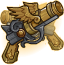
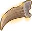

[Back to Main](index.md)

# Commodore Krux

> The giff Commodore Krux of the Second Wind met a group of adventurers in the Happy Beholder to recruit them to fight against the astral elves of the Xaryxian Empire.

[Wiki](https://forgottenrealms.fandom.com/wiki/Happy_Beholder)

# Basic Information

Krux will be an upcoming Evergreen champion guesstimated to release on 19 July 2023 with the [Xaryxis 5 content drop](contentdrops.md#xaryxis-5---19-july-2023).

* Seat: Unknown
* Race: Giff (Guess)
* Class: Unknown
* Roles: Support / Tank (Guess)
* Age: Unknown
* Gender: Male (Guess)
* Alignment: Unknown
* Affiliation: Unknown
* Stats: Unknown

# Abilities

**Base Attack: Flintlock Pistols** (Ranged)
> Commodore Krux fires a pistol at a random target.

<em>Raw Data</em>

<pre>
{
    "description": "Commodore Krux fires a pistol at a random target.",
    "long_description": "",
    "damage_modifier": 1,
    "damage_types": ["ranged"],
    "graphic_id": 0,
    "target": "random",
    "aoe_radius": 0,
    "tags": ["ranged"],
    "num_targets": 1,
    "animations": [{
        "projectile_count": 1,
        "projectile_details": {
            "has_trail": false,
            "extend_line": true,
            "projectile_graphic_id": 5395,
            "projectile_speed": 2400
        },
        "shoot_offset_y": -53,
        "shoot_offset_x": 80,
        "animation_sequence_name": "attack",
        "effects_on_monsters": [{"effect_string": "effect_def,1576"}],
        "type": "ranged_attack",
        "projectile": "generic",
        "shoot_frame": 6
    }],
    "name": "Flintlock Pistols",
    "cooldown": 3,
    "id": 643
}
</pre>

 

**Ultimate Attack: Force Grenade**
> Commodore Krux throws a grenade at the enemy with the most health, which explodes dealing ultimate damage to all enemies in a medium radius and knocking them all back a short distance.

<em>Raw Data</em>

<pre>
{
    "description": "Commodore Krux throws a grenade at the enemy with the most health which deals damage and knocks enemies back.",
    "long_description": "Commodore Krux throws a grenade at the enemy with the most health, which explodes dealing ultimate damage to all enemies in a medium radius and knocking them all back a short distance.",
    "damage_modifier": 0.03,
    "damage_types": ["ranged"],
    "graphic_id": 19891,
    "target": "highest_health",
    "aoe_radius": 200,
    "tags": [
        "ultimate",
        "ranged"
    ],
    "num_targets": 1,
    "animations": [{
        "projectile_details": {
            "projectile_hit_graphic_id": 19999,
            "trail": {
                "scale_lerp": [
                    {
                        "x": 2.5,
                        "y": 3
                    },
                    {
                        "x": 0,
                        "y": 0
                    }
                ],
                "lifespan": 0.25,
                "initial_velocity": {
                    "x": 0,
                    "y": 0
                },
                "alpha_lerp": {
                    "0": 0,
                    "1": 0,
                    "0.1": 0.4
                },
                "particle_graphic_ids": [13228],
                "spawn_rate": 100,
                "velocity_jitter": {
                    "x": 0,
                    "y": 0
                }
            },
            "percent_height_offset": 18,
            "target_offset_y": 30,
            "impact_offset_y": 80,
            "projectile_graphic_id": 19918,
            "projectile_freeze_frame": 0,
            "projectile_speed": 1200,
            "hash": "krux_force_grenade",
            "rotation_speed": 450
        },
        "hit_sound": 133,
        "shoot_offset_y": -90,
        "shoot_offset_x": -30,
        "shoot_sound": 149,
        "effects_on_monsters": [{"effect_string": "push_back_monster,20"}],
        "type": "ranged_attack",
        "projectile": "pd_generic_projectile",
        "shoot_frame": 63
    }],
    "name": "Force Grenade",
    "cooldown": 90,
    "id": 645
}
</pre>

 

**All Hands on Deck**
> Commodore Krux increases the damage of all Champions in his column and the rear-most column of the formation by `$(amount)%`. This does not apply twice if that is the same column.

<em>Raw Data</em>

<pre>
{
    "effect_keys": [{
        "off_when_benched": true,
        "effect_string": "hero_dps_multiplier_mult,100",
        "targets": [{
            "num_back_cols": 1,
            "type": "col_and_back_x"
        }]
    }],
    "requirements": [],
    "description": {"conditions": [
        {
            "condition": "feat_assigned 1369",
            "desc": "Commodore Krux increases the damage of all Champions in his column and the two rear-most columns of the formation by $(amount)%. This does not apply twice if he's in one of the two rear-most columns."
        },
        {"desc": "Commodore Krux increases the damage of all Champions in his column and the rear-most column of the formation by $(amount)%. This does not apply twice if that is the same column."}
    ]},
    "id": 1560,
    "flavour_text": "",
    "graphic_id": 19883,
    "properties": {"is_formation_ability": true}
}
</pre>

 

**Battle Stations**
> Commodore Krux increases the damage bonus of All Hands On Deck! by `$(not_buffed amount)%` for each second the Champions are in the current area, stacking multiplicatively up to a maximum of `$(max_stacks)` stacks.

<em>Raw Data</em>

<pre>
{
    "effect_keys": [{
        "stacks_multiply": true,
        "show_bonus": true,
        "effect_string": "buff_upgrade,20,11653",
        "max_stacks": 100,
        "more_triggers": [{
            "action": {"type": "reset"},
            "trigger": "area_changed"
        }],
        "stacks_on_trigger": "on_timer,1"
    }],
    "requirements": [],
    "description": {"desc": "Commodore Krux increases the damage bonus of All Hands On Deck! by $(not_buffed amount)% for each second the Champions are in the current area, stacking multiplicatively up to a maximum of $(max_stacks) stacks."},
    "id": 1561,
    "flavour_text": "",
    "graphic_id": 19885,
    "properties": {
        "retain_on_slot_changed": true,
        "is_formation_ability": true,
        "show_outgoing_desc_when_benched": false
    }
}
</pre>

 

**Batten Hatches**
> Commodore Krux increases the health of all other Champions by `$(amount)%` of his max health for each adventure, variant, and Patron variant you have completed in the Light of Xaryxis campaign, stacking additively. Any healing effect on those Champions is increased by the same amount.

<em>Raw Data</em>

<pre>
{
    "effect_keys": [
        {
            "amount_updated_listeners": ["stat_changed,XaryxisAdventuresCompleted"],
            "stacks_multiply": false,
            "stat": "XaryxisAdventuresCompleted",
            "amount_func": "add",
            "stack_func": "get_stat",
            "use_computed_amount_for_description": true,
            "effect_string": "increase_health_by_source_percent,0.1",
            "targets": ["other"],
            "stack_title": "Xaryxis Adventures Completed",
            "off_when_benched": true,
            "show_bonus": true,
            "override_total_bonus_sentence": "EFFECT_1562_EFFECT_KEYS_0_OVERRIDE_TOTAL_BONUS_SENTENCE|+$bonus% of Krux's Max HP",
            "show_current_value_bonus_desc": false,
            "override_key_desc": "Increases the health of $target and the effect of healing on $target by $amount"
        },
        {
            "amount_updated_listeners": ["stat_changed,XaryxisAdventuresCompleted"],
            "stacks_multiply": false,
            "stat": "XaryxisAdventuresCompleted",
            "off_when_benched": true,
            "amount_func": "add",
            "stack_func": "get_stat",
            "use_computed_amount_for_description": true,
            "effect_string": "healing_add_mult,0.1",
            "targets": ["other"],
            "skip_effect_key_desc": true
        }
    ],
    "requirements": [],
    "description": {"desc": "Commodore Krux increases the health of all other Champions by $(amount)% of his max health for each adventure, variant, and Patron variant you have completed in the Light of Xaryxis campaign, stacking additively. Any healing effect on those Champions is increased by the same amount."},
    "id": 1562,
    "flavour_text": "",
    "graphic_id": 19884,
    "properties": {
        "is_formation_ability": true,
        "owner_use_outgoing_description": true
    }
}
</pre>

 

**Starfarers Spyglass**
> Upon completing a new area, Commodore Krux raises a spyglass to his eye and spots an enemy from the next area. All enemies of that type become his Favored Foe (until another area is completed) and take `$(amount)%` more damage from all sources.
>  
> - `$(krux_starfarers_spyglass)`.

<em>Raw Data</em>

<pre>
{
    "effect_keys": [{
        "animation_play_time": 2.3,
        "off_when_benched": true,
        "effect_string": "krux_starfarers_spyglass,100",
        "valid_monster_types": [
            "aberration",
            "beast",
            "celestial",
            "construct",
            "dragon",
            "elemental",
            "fey",
            "fiend",
            "giant",
            "humanoid",
            "monstrosity",
            "ooze",
            "plant",
            "undead"
        ]
    }],
    "requirements": [],
    "description": {
        "post": {"conditions": [{
            "condition": "not static_desc",
            "desc": "^^$(krux_starfarers_spyglass)"
        }]},
        "desc": "Upon completing a new area, Commodore Krux raises a spyglass to his eye and spots an enemy from the next area. All enemies of that type become his Favored Foe (until another area is completed) and take $(amount)% more damage from all sources."
    },
    "id": 1563,
    "flavour_text": "",
    "graphic_id": 19887,
    "properties": {
        "retain_on_slot_changed": true,
        "is_formation_ability": true,
        "owner_use_outgoing_description": true
    }
}
</pre>

 

**Experienced Sailor**
> Commodore Krux increases the effect of All Hands On Deck! by `$(not_buffed amount)%` for each adventure, variant, and Patron variant you have completed in the Light of Xaryxis campaign, stacking multiplicatively.

<em>Raw Data</em>

<pre>
{
    "effect_keys": [{
        "stack_title": "Xaryxis Adventures Completed",
        "amount_updated_listeners": ["stat_changed,XaryxisAdventuresCompleted"],
        "stacks_multiply": true,
        "stat": "XaryxisAdventuresCompleted",
        "off_when_benched": true,
        "show_bonus": true,
        "amount_func": "mult",
        "stack_func": "get_stat",
        "effect_string": "buff_upgrade,20,11653"
    }],
    "requirements": [],
    "description": {"desc": "Commodore Krux increases the effect of All Hands On Deck! by $(not_buffed amount)% for each adventure, variant, and Patron variant you have completed in the Light of Xaryxis campaign, stacking multiplicatively."},
    "id": 1564,
    "flavour_text": "",
    "graphic_id": 19886,
    "properties": {
        "is_formation_ability": true,
        "owner_use_outgoing_description": true
    }
}
</pre>

 

**Unknown**
> Commodore Krux can be used in any Light of Xaryxis campaign adventure or variant, even if he would not normally be available to be used due to variant or patron restrictions.

<em>Raw Data</em>

<pre>
{
    "effect_keys": [],
    "requirements": [],
    "description": {"desc": "Commodore Krux can be used in any Light of Xaryxis campaign adventure or variant, even if he would not normally be available to be used due to variant or patron restrictions."},
    "id": 1559,
    "flavour_text": "",
    "graphic_id": 0,
    "properties": {
        "is_formation_ability": true,
        "formation_circle_icon": false
    }
}
</pre>

 

# Specialisations

**Specialisation: Nautical Knockback** (Guess)
> Commodore Krux increases the effect of All Hands On Deck! by `$(amount)%` and his base attack knocks back his targets a short distance.

<em>Raw Data</em>

<pre>
{
    "effect_keys": [{
        "off_when_benched": true,
        "effect_string": "buff_upgrade,200,11653"
    }],
    "requirements": [],
    "description": {"desc": "Commodore Krux increases the effect of All Hands On Deck! by $(amount)% and his base attack knocks back his targets a short distance."},
    "id": 1565,
    "flavour_text": "",
    "graphic_id": 0,
    "properties": {
        "is_formation_ability": true,
        "formation_circle_icon": false
    }
}
</pre>

 

**Specialisation: Take the Helm** (Guess)
> Commodore Krux increases the damage of Champions with a magic base attack by `$(amount)%`.

<em>Raw Data</em>

<pre>
{
    "effect_keys": [{
        "off_when_benched": true,
        "effect_string": "hero_dps_multiplier_mult,400",
        "filter_targets": [{
            "attacks": ["magic"],
            "type": "attack_type"
        }],
        "targets": ["all"]
    }],
    "requirements": [],
    "description": {"desc": "Commodore Krux increases the damage of Champions with a magic base attack by $(amount)%."},
    "id": 1566,
    "flavour_text": "",
    "graphic_id": 19890,
    "properties": {
        "is_formation_ability": true,
        "spec_option_post_apply_info": "Champions in Formation Targeted: $num_targets"
    }
}
</pre>

 

**Specialisation: Foe of Xaryxis** (Guess)
> Each time any favored foe is defeated, Commodore Krux increases the damage of All Hands On Deck! by `$(amount)%`, stacking additively up to `$(max_stacks)` times, until the area is changed.

<em>Raw Data</em>

<pre>
{
    "effect_keys": [{
        "stacks_multiply": false,
        "off_when_benched": true,
        "show_bonus": true,
        "effect_string": "buff_upgrade,25,11653",
        "max_stacks": 25,
        "more_triggers": [{
            "action": {"type": "reset"},
            "trigger": "area_changed"
        }],
        "stacks_on_trigger": "favored_foe_killed"
    }],
    "requirements": [],
    "description": {"desc": "Each time any favored foe is defeated, Commodore Krux increases the damage of All Hands On Deck! by $(amount)%, stacking additively up to $(max_stacks) times, until the area is changed."},
    "id": 1567,
    "flavour_text": "",
    "graphic_id": 0,
    "properties": {
        "retain_on_slot_changed": true,
        "is_formation_ability": true,
        "formation_circle_icon": false
    }
}
</pre>

 

# Items

| Icon | Name | Type |
|:-:|---|---|
|  | `Coin Pouch` | Unknown |
|  | `Flintlock Pistols` | Unknown |
|  | `Giff Uniform` | Unknown |
|  | `Hat` | Unknown |
|  | `Memento` | Unknown |
|  | `Navigation Gear` | Unknown |

# Feats

Unknown.

# Legendaries

Unknown.

# Console Portrait

# Chests

| Gold |
|---|
|  |

[Back to Top](#top)

*Last Modified: {{ site.time }}*