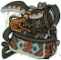

[Back to Main](index.md)

# Commodore Krux

Commodore Krux is a giff soldier who believes his glory days are behind him. Krux has spent the last few years working as a mercenary on and around the Rock of Bral, but lately the giff has been spending more time in his cups as new jobs have become fewer and farther between.

# Basic Information

Krux will be an upcoming Evergreen champion guesstimated to release on 19 July 2023 with the [Xaryxis 5 content drop](contentdrops.md#xaryxis-5---19-july-2023).

* Seat: 4
* Race: Giff
* Class: Fighter
* Roles: DPS / Tanking / Support
* Age: 52
* Gender: Male
* Alignment: Lawful Good

| Stat | Value | Day 1 Trials | Patrons |
|---|---|---|---|
| Strength | 18 | Yes | Mirt |
| Dexterity | 14 | Yes | Vajra |
| Constitution | 17 | Yes | - |
| Intelligence | 11 | Yes | - |
| Wisdom | 12 | Yes | |
| Charisma | 12 | Yes | |
| Total | 84 | |

# Abilities

 **Base Attack: Flintlock Pistols** (Ranged)
> Commodore Krux fires a pistol at a random target.

<em>Raw Data</em>

<pre>
{
    "description": "Commodore Krux fires a pistol at a random target.",
    "long_description": "",
    "damage_modifier": 1,
    "damage_types": ["ranged"],
    "graphic_id": 0,
    "target": "random",
    "aoe_radius": 0,
    "tags": ["ranged"],
    "num_targets": 1,
    "animations": [{
        "projectile_count": 1,
        "projectile_details": {
            "has_trail": false,
            "extend_line": true,
            "projectile_graphic_id": 5395,
            "projectile_speed": 2400
        },
        "shoot_offset_y": -53,
        "shoot_offset_x": 80,
        "animation_sequence_name": "attack",
        "effects_on_monsters": [{"effect_string": "effect_def,1576"}],
        "type": "ranged_attack",
        "projectile": "generic",
        "shoot_frame": 6
    }],
    "name": "Flintlock Pistols",
    "cooldown": 3,
    "id": 643
}
</pre>

 

 **Ultimate Attack: Force Grenade** (Level: 230)
> Commodore Krux throws a grenade at the enemy with the most health, which explodes dealing ultimate damage to all enemies in a medium radius and knocking them all back a short distance.

<em>Raw Data</em>

<pre>
{
    "description": "Commodore Krux throws a grenade at the enemy with the most health which deals damage and knocks enemies back.",
    "long_description": "Commodore Krux throws a grenade at the enemy with the most health, which explodes dealing ultimate damage to all enemies in a medium radius and knocking them all back a short distance.",
    "damage_modifier": 0.03,
    "damage_types": ["ranged"],
    "graphic_id": 19891,
    "target": "highest_health",
    "aoe_radius": 200,
    "tags": [
        "ultimate",
        "ranged"
    ],
    "num_targets": 1,
    "animations": [{
        "projectile_details": {
            "projectile_hit_graphic_id": 19999,
            "trail": {
                "scale_lerp": [
                    {
                        "x": 2.5,
                        "y": 3
                    },
                    {
                        "x": 0,
                        "y": 0
                    }
                ],
                "lifespan": 0.25,
                "initial_velocity": {
                    "x": 0,
                    "y": 0
                },
                "alpha_lerp": {
                    "0": 0,
                    "1": 0,
                    "0.1": 0.4
                },
                "particle_graphic_ids": [13228],
                "spawn_rate": 100,
                "velocity_jitter": {
                    "x": 0,
                    "y": 0
                }
            },
            "percent_height_offset": 18,
            "target_offset_y": 30,
            "impact_offset_y": 80,
            "projectile_graphic_id": 19918,
            "projectile_freeze_frame": 0,
            "projectile_speed": 1200,
            "hash": "krux_force_grenade",
            "rotation_speed": 450
        },
        "hit_sound": 133,
        "shoot_offset_y": -90,
        "shoot_offset_x": -30,
        "shoot_sound": 149,
        "effects_on_monsters": [{"effect_string": "push_back_monster,20"}],
        "type": "ranged_attack",
        "projectile": "pd_generic_projectile",
        "shoot_frame": 63
    }],
    "name": "Force Grenade",
    "cooldown": 90,
    "id": 645
}
</pre>

 

**Wildspace Lover** (Level: 0)
> Commodore Krux can be used in any Light of Xaryxis campaign adventure or variant, even if he would not normally be available to be used due to variant or patron restrictions.

<em>Raw Data</em>

<pre>
{
    "static_dps_mult": null,
    "required_level": 0,
    "effect": "effect_def,1559",
    "name": "Wildspace Lover",
    "id": 11652,
    "hero_id": 136,
    "upgrade_type": "unlock_ability",
    "default_enabled": 1,
    "required_upgrade_id": 0
}
{
    "effect_keys": [],
    "requirements": [],
    "description": {"desc": "Commodore Krux can be used in any Light of Xaryxis campaign adventure or variant, even if he would not normally be available to be used due to variant or patron restrictions."},
    "id": 1559,
    "flavour_text": "",
    "graphic_id": 0,
    "properties": {
        "is_formation_ability": true,
        "formation_circle_icon": false
    }
}
</pre>

 

 **All Hands On Deck!** (Level: 30)
> Commodore Krux increases the damage of all Champions in his column and the rear-most column of the formation by 100%. This does not apply twice if that is the same column.

<em>Raw Data</em>

<pre>
{
    "static_dps_mult": null,
    "required_level": 30,
    "effect": "effect_def,1560",
    "tip_text": "Commodore Krux buffs Champions who are in his column and the back column of the formation.",
    "name": "All Hands On Deck!",
    "id": 11653,
    "hero_id": 136,
    "upgrade_type": "unlock_ability",
    "default_enabled": 1,
    "required_upgrade_id": 0
}
{
    "effect_keys": [{
        "off_when_benched": true,
        "effect_string": "hero_dps_multiplier_mult,100",
        "targets": [{
            "num_back_cols": 1,
            "type": "col_and_back_x"
        }]
    }],
    "requirements": [],
    "description": {"conditions": [
        {
            "condition": "feat_assigned 1369",
            "desc": "Commodore Krux increases the damage of all Champions in his column and the two rear-most columns of the formation by $(amount)%. This does not apply twice if he's in one of the two rear-most columns."
        },
        {"desc": "Commodore Krux increases the damage of all Champions in his column and the rear-most column of the formation by $(amount)%. This does not apply twice if that is the same column."}
    ]},
    "id": 1560,
    "flavour_text": "",
    "graphic_id": 19883,
    "properties": {"is_formation_ability": true}
}
</pre>

 

 **Battle Stations!** (Level: 100)
> Commodore Krux increases the damage bonus of All Hands On Deck! by 25% for each second the Champions are in the current area, stacking multiplicatively up to a maximum of 100 stacks.

<em>Raw Data</em>

<pre>
{
    "static_dps_mult": null,
    "required_level": 100,
    "effect": "effect_def,1561",
    "name": "Battle Stations!",
    "id": 11654,
    "hero_id": 136,
    "upgrade_type": "upgrade_ability",
    "default_enabled": 1,
    "required_upgrade_id": 0
}
{
    "effect_keys": [{
        "stacks_multiply": true,
        "show_bonus": true,
        "effect_string": "buff_upgrade,25,11653",
        "max_stacks": 100,
        "more_triggers": [{
            "action": {"type": "reset"},
            "trigger": "area_changed"
        }],
        "stacks_on_trigger": "on_timer,1"
    }],
    "requirements": [],
    "description": {"desc": "Commodore Krux increases the damage bonus of All Hands On Deck! by $(not_buffed amount)% for each second the Champions are in the current area, stacking multiplicatively up to a maximum of $(max_stacks) stacks."},
    "id": 1561,
    "flavour_text": "",
    "graphic_id": 19885,
    "properties": {
        "retain_on_slot_changed": true,
        "is_formation_ability": true,
        "show_outgoing_desc_when_benched": false
    }
}
</pre>

 

 **Batten Down the Hatches!** (Level: 170)
> Commodore Krux increases the health of all other Champions by 0.1% of his max health for each adventure, variant, and Patron variant you have completed in the Light of Xaryxis campaign, stacking additively. Any healing effect on those Champions is increased by the same amount.

<em>Raw Data</em>

<pre>
{
    "static_dps_mult": null,
    "required_level": 170,
    "effect": "effect_def,1562",
    "name": "Batten Down the Hatches!",
    "id": 11655,
    "hero_id": 136,
    "upgrade_type": "increase_health",
    "default_enabled": 1,
    "required_upgrade_id": 0
}
{
    "effect_keys": [
        {
            "amount_updated_listeners": ["stat_changed,XaryxisAdventuresCompleted"],
            "stacks_multiply": false,
            "stat": "XaryxisAdventuresCompleted",
            "amount_func": "source_percent_health_add",
            "stack_func": "get_stat",
            "use_computed_amount_for_description": true,
            "effect_string": "increase_health_by_source_percent,0.1",
            "targets": ["other"],
            "stack_title": "Xaryxis Adventures Completed",
            "off_when_benched": true,
            "show_bonus": true,
            "override_total_bonus_sentence": "+$bonus HP",
            "show_current_value_bonus_desc": false,
            "override_key_desc": "Increases the health of $target and the effect of healing on $target by $amount"
        },
        {
            "amount_updated_listeners": ["stat_changed,XaryxisAdventuresCompleted"],
            "stacks_multiply": false,
            "stat": "XaryxisAdventuresCompleted",
            "off_when_benched": true,
            "amount_func": "source_percent_health_add",
            "stack_func": "get_stat",
            "use_computed_amount_for_description": true,
            "effect_string": "healing_add,0.1",
            "targets": ["other"],
            "skip_effect_key_desc": true
        }
    ],
    "requirements": [],
    "description": {"desc": "Commodore Krux increases the health of all other Champions by $(amount)% of his max health for each adventure, variant, and Patron variant you have completed in the Light of Xaryxis campaign, stacking additively. Any healing effect on those Champions is increased by the same amount."},
    "id": 1562,
    "flavour_text": "",
    "graphic_id": 19884,
    "properties": {
        "is_formation_ability": true,
        "owner_use_outgoing_description": true
    }
}
</pre>

 

 **Starfarer's Spyglass** (Level: 200)
> Upon completing a new area, Commodore Krux raises a spyglass to his eye and spots an enemy from the next area. All enemies of that type become his Favored Foe (until another area is completed) and take 100% more damage from all sources.
>  
> - $(krux_starfarers_spyglass)

<em>Raw Data</em>

<pre>
{
    "static_dps_mult": null,
    "required_level": 200,
    "effect": "effect_def,1563",
    "tip_text": "Commodore Krux is always looking ahead and chooses a Favored Foe from the next area when completing an area.",
    "name": "Starfarer's Spyglass",
    "id": 11656,
    "hero_id": 136,
    "upgrade_type": "unlock_ability",
    "default_enabled": 1,
    "required_upgrade_id": 0
}
{
    "effect_keys": [{
        "animation_play_time": 2.3,
        "off_when_benched": true,
        "effect_string": "krux_starfarers_spyglass,100",
        "valid_monster_types": [
            "aberration",
            "beast",
            "celestial",
            "construct",
            "dragon",
            "elemental",
            "fey",
            "fiend",
            "giant",
            "humanoid",
            "monstrosity",
            "ooze",
            "plant",
            "undead"
        ]
    }],
    "requirements": [],
    "description": {
        "post": {"conditions": [{
            "condition": "not static_desc",
            "desc": "^^$(krux_starfarers_spyglass)"
        }]},
        "desc": "Upon completing a new area, Commodore Krux raises a spyglass to his eye and spots an enemy from the next area. All enemies of that type become his Favored Foe (until another area is completed) and take $(amount)% more damage from all sources."
    },
    "id": 1563,
    "flavour_text": "",
    "graphic_id": 19887,
    "properties": {
        "retain_on_slot_changed": true,
        "is_formation_ability": true,
        "owner_use_outgoing_description": true
    }
}
</pre>

 

 **Force Grenade** (Level: 230)
> Unknown Effect.

<em>Raw Data</em>

<pre>
{
    "static_dps_mult": null,
    "required_level": 230,
    "effect": "set_ultimate_attack",
    "name": "Force Grenade",
    "id": 11661,
    "hero_id": 136,
    "upgrade_type": "unlock_ultimate",
    "default_enabled": 1,
    "required_upgrade_id": 0
}
</pre>

 

 **An Experienced Sailor** (Level: 440)
> Commodore Krux increases the effect of All Hands On Deck! by 20% for each adventure, variant, and Patron variant you have completed in the Light of Xaryxis campaign, stacking multiplicatively.

<em>Raw Data</em>

<pre>
{
    "static_dps_mult": null,
    "required_level": 440,
    "effect": "effect_def,1564",
    "name": "An Experienced Sailor",
    "id": 11657,
    "hero_id": 136,
    "upgrade_type": "upgrade_ability",
    "default_enabled": 1,
    "required_upgrade_id": 0
}
{
    "effect_keys": [{
        "stack_title": "Xaryxis Adventures Completed",
        "amount_updated_listeners": ["stat_changed,XaryxisAdventuresCompleted"],
        "stacks_multiply": true,
        "stat": "XaryxisAdventuresCompleted",
        "off_when_benched": true,
        "show_bonus": true,
        "amount_func": "mult",
        "stack_func": "get_stat",
        "effect_string": "buff_upgrade,20,11653"
    }],
    "requirements": [],
    "description": {"desc": "Commodore Krux increases the effect of All Hands On Deck! by $(not_buffed amount)% for each adventure, variant, and Patron variant you have completed in the Light of Xaryxis campaign, stacking multiplicatively."},
    "id": 1564,
    "flavour_text": "",
    "graphic_id": 19886,
    "properties": {
        "is_formation_ability": true,
        "owner_use_outgoing_description": true
    }
}
</pre>

 

# Specialisations

 **Foe of Xaryxis** (Level: 250)
> Each time any favored foe is defeated, Commodore Krux increases the damage of All Hands On Deck! by 25%, stacking additively up to 25 times, until the area is changed.

<em>Raw Data</em>

<pre>
{
    "static_dps_mult": null,
    "specialization_name": "Foe of Xaryxis",
    "required_level": 250,
    "effect": "effect_def,1567",
    "name": "Foe of Xaryxis",
    "specialization_graphic_id": 19888,
    "id": 11660,
    "hero_id": 136,
    "upgrade_type": null,
    "default_enabled": 1,
    "required_upgrade_id": 0,
    "specialization_description": "Commodore Krux keeps a keen eye on Favored Foes and further buffs Champions when one is defeated."
}
{
    "effect_keys": [{
        "stacks_multiply": false,
        "off_when_benched": true,
        "show_bonus": true,
        "effect_string": "buff_upgrade,25,11653",
        "max_stacks": 25,
        "more_triggers": [{
            "action": {"type": "reset"},
            "trigger": "area_changed"
        }],
        "stacks_on_trigger": "favored_foe_killed"
    }],
    "requirements": [],
    "description": {"desc": "Each time any favored foe is defeated, Commodore Krux increases the damage of All Hands On Deck! by $(amount)%, stacking additively up to $(max_stacks) times, until the area is changed."},
    "id": 1567,
    "flavour_text": "",
    "graphic_id": 0,
    "properties": {
        "retain_on_slot_changed": true,
        "is_formation_ability": true,
        "formation_circle_icon": false
    }
}
</pre>

 

 **Nautical Knockback** (Level: 250)
> Commodore Krux increases the effect of All Hands On Deck! by 200% and his base attack knocks back his targets a short distance.

<em>Raw Data</em>

<pre>
{
    "static_dps_mult": null,
    "specialization_name": "Nautical Knockback",
    "required_level": 250,
    "effect": "effect_def,1565",
    "name": "Nautical Knockback",
    "specialization_graphic_id": 19889,
    "id": 11658,
    "hero_id": 136,
    "upgrade_type": null,
    "default_enabled": 1,
    "required_upgrade_id": 0,
    "specialization_description": "Commodore Krux focuses on buffing the party and the strength of his Flintlock Pistols."
}
{
    "effect_keys": [{
        "off_when_benched": true,
        "effect_string": "buff_upgrade,200,11653"
    }],
    "requirements": [],
    "description": {"desc": "Commodore Krux increases the effect of All Hands On Deck! by $(amount)% and his base attack knocks back his targets a short distance."},
    "id": 1565,
    "flavour_text": "",
    "graphic_id": 0,
    "properties": {
        "is_formation_ability": true,
        "formation_circle_icon": false
    }
}
</pre>

 

 **Take the Helm** (Level: 250)
> Commodore Krux increases the damage of Champions with a magic base attack by 400%.

<em>Raw Data</em>

<pre>
{
    "static_dps_mult": null,
    "specialization_name": "Take the Helm",
    "required_level": 250,
    "effect": "effect_def,1566",
    "name": "Take the Helm",
    "specialization_graphic_id": 19890,
    "id": 11659,
    "hero_id": 136,
    "upgrade_type": null,
    "default_enabled": 1,
    "required_upgrade_id": 0,
    "specialization_description": "Commodore Krux focuses on buffing his magic-based allies."
}
{
    "effect_keys": [{
        "off_when_benched": true,
        "effect_string": "hero_dps_multiplier_mult,400",
        "filter_targets": [{
            "attacks": ["magic"],
            "type": "attack_type"
        }],
        "targets": ["all"]
    }],
    "requirements": [],
    "description": {"desc": "Commodore Krux increases the damage of Champions with a magic base attack by $(amount)%."},
    "id": 1566,
    "flavour_text": "",
    "graphic_id": 19890,
    "properties": {
        "is_formation_ability": true,
        "spec_option_post_apply_info": "Champions in Formation Targeted: $num_targets"
    }
}
</pre>

 

# Items

| Icon | Slot | Epic Name | Type |
|:-:|---|---|---|
|  | 1 | `Warlord Armor` | Health |
|  | 2 | `Muskets of Precision` | All Hands On Deck! |
|  | 3 | `Heavy Bag of Holding` | Battle Stations! |
|  | 4 | `Wildspace Orrery` | An Experienced Sailor |
|  | 5 | `Tarrasque Tooth` | All Specialisations |
|  | 6 | `Armored Top Hat` | Ultimate Cooldown Reduction |

<em>Item Names and Descriptions</em>

<pre>
Slot 1:
     Sailor's Clothes: Ah yes, been a few years since I fit into this one.
     Shipmate Uniform: Smell that? Still smells like my old ship. Good memories.
     Commodore Attire: On the Second Wind I get to choose my own uniform!
        Warlord Armor: Haha! Nothing can stop me in this!

Slot 2:
      Flimsy Firearms: I remember these being much sturdier...
   Reinforced Pistols: Oh, no, I was thinking of these. These were good weapons!
      Dueling Muskets: I took these in a duel. No one lost, but they were too drunk to notice.
 Muskets of Precision: Won these in a game at Infinity's. That celestial was not happy with
                       me...

Slot 3:
     Empty Coin Purse: Oh dear, it seems there's been a hole in this one...
Unusually Light Pouch: I swear there were more coins in here this morning
        Secured Purse: It may be light, but thieves can't easily access it!
 Heavy Bag of Holding: I can carry most anything in this! There's nothing in it, but I could!

Slot 4:
  Terrestrial Sextant: At one point I sailed the seas and this was always with me.
     Astral Navigator: I acquired this on a trip to the Radiant Citadel.
      Cosmic Spyglass: A normal spyglass just won't cut it in Wildspace.
     Wildspace Orrery: Only a fool would knowingly sail into Doomspace. And I'm that fool!

Slot 5:
  Broken Pocket Watch: This belonged to an old friend. Should I repair it?
Repaired Pocket Watch: It's good to hear this ticking away once again.
 Broken Sending Stone: Warwyck broke this the last time I saw him...
      Tarrasque Tooth: Few believe me when I tell them the story behind this tooth!

Slot 6:
        Dirty Flatcap: Wore this one down to the threads it seems.
     Tailored Flatcap: Well, this WAS tailored.
            Red Beret: Found this one floating out in Wildspace. I'm sure it's fine.
      Armored Top Hat: Wish I had this when I found that Tarrasque...
</pre>

 

# Feats

This list will only show feats that are going to be available on the release of this champion. The separate [Feats](feats.md) page may show others that could be available later if they exist.

| Icon | Feat | Effect | Source |
|---|---|---|---|
|  | `Selflessness` | 10% All Champion Damage | Free |
|  | `Inspiring Leader` | 25% All Champion Damage | Gold Chest |
|  | `Elven Accuracy` | 30% Self DPS | Free |
|  | `Sharpshooter` | 60% Self DPS | 12,500 Gems |
|  | `Tough` | 15% Health | Free |
|  | `Resilient` | 30% Health | 12,500 Gems |
|  | `Defensive Duelist` | +5 Overwhelm | Free |
|  | `Calm Under Pressure` | +10 Overwhelm | Gold Chest |
|  | `Trained Crew` | 20% All Hands On Deck! | Free |
|  | `Experienced Crew` | 40% All Hands On Deck! | Gold Chest |
|  | `Man the Cannons` | 40% Battle Stations! | Gold Chest |
|  | `Wildspace Veteran` | 40% All Specialisations | Gold Chest |
|  | `Nimble` | Stat: +1 Dexterity | 12,500 Gems |

# Legendaries

* Increases the damage of all Champions by 100%.
* Increases the damage of all Champions by 20% for each Male Champion in the formation.
* Increases the damage of all Champions by 10% for each Champion in the formation.
* Increases the damage of all Champions with a INT score of 11 or higher by 100%.
* Increases the damage of all Champions by 30% for each Champion with a CON score of 13 or higher in the formation.
* Increases the damage of all Champions by 40% for each Ranged Champion in the formation.

<em>DPS Applicable</em>

<pre>
     Arkhan: 5 / 6
    Artemis: 6 / 6
    Asharra: 6 / 6
      Azaka: 6 / 6
     Binwin: 5 / 6
   Birdsong: 6 / 6
Black Viper: 6 / 6
 Catti-brie: 6 / 6
     D'hani: 6 / 6
     Delina: 6 / 6
    Dhadius: 6 / 6
     Drizzt: 6 / 6
    Farideh: 6 / 6
        Fen: 6 / 6
      Grimm: 6 / 6
     Gromma: 6 / 6
    Jaheira: 5 / 6
    Jamilah: 5 / 6
        Jim: 6 / 6
      Krond: 6 / 6
     Lucius: 6 / 6
      Makos: 6 / 6
      Minsc: 5 / 6
      NERDS: 6 / 6
     Nahara: 5 / 6
      Nixie: 5 / 6
      Nrakk: 6 / 6
     Orisha: 6 / 6
   Prudence: 6 / 6
      Rosie: 6 / 6
      Strix: 6 / 6
    Torogar: 5 / 6
     Warden: 5 / 6
    Warduke: 5 / 6
     Yorven: 5 / 6
      Zorbu: 6 / 6
</pre>

 

# Console Portrait

# Chests

| Gold |
|---|
|  |

[Back to Top](#top)

*Last Modified: {{ site.time }}*