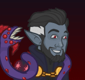

[Back to Main](index.md)

    
        
            
        
        
        Portrait
        
    

# K'thriss

Curious, affable, and morbid, the drow heretic K'thriss Drow'b seeks the insane god-truth behind the veil of reality. As the 'C' Team's hoardsperson, he keeps an eye out for occult relics that could aid him in his unearthly quest.

# Changes

K'thriss will be a reworked champion in the Founders' Day event on 9 July 2025 (expected a week after event start due to the Worst the Wait event augment).

Only abilities that have seen some changes will be displayed here - and be aware that there's a lot of guesswork involved. Some abilities may not have names - some may have the *wrong* names - or specialisations might not be marked as such - etc.. Focus on the effect data itself.

Please do me a favour and don't get all melodramatic about what you find here. I - and CNE - don't appreciate it. These are spoilers and will almost certainly change before release - likely multiple times. That and we don't have access to any upgrade data prior to release. Making assumptions on how the champions will turn out based on this information would be premature.

# Attacks

**Ultimate: Tentacular Spectacular** (Guess)
> K'thriss summons a horde of tentacles across the battlefield that damage all enemies.  
> Cooldown: 270s (Cap 67.5s)

<em>Raw Data</em>

<pre>
{
    "id": 876,
    "name": "Tentacular Spectacular",
    "description": "K'thriss summons a horde of tentacles that damage all enemies.",
    "long_description": "K'thriss summons a horde of tentacles across the battlefield that damage all enemies.",
    "graphic_id": 4743,
    "target": "all",
    "num_targets": 1,
    "aoe_radius": 0,
    "damage_modifier": 0.033,
    "cooldown": 270,
    "animations": [
        {
            "type": "kthriss_ultimate",
            "damage_frame": 10
        }
    ],
    "tags": [
        "ranged",
        "ultimate"
    ],
    "damage_types": [
        "magic"
    ]
}
</pre>

# Abilities

**Unseen Encouragement** (Guess)
> K'thriss' unseen servant, Velvet, increases the damage of Champions not adjacent to K'thriss by 100% for each affected Champion, stacking multiplicatively. .

<em>Raw Data</em>

<pre>
{
    "id": 2355,
    "flavour_text": "",
    "description": {
        "desc": "K'thriss' unseen servant, Velvet, increases the damage of Champions not adjacent to K'thriss by $amount% for each affected Champion, stacking multiplicatively. "
    },
    "effect_keys": [
        {
            "effect_string": "pre_stack_amount,100",
            "off_when_benched": true
        },
        {
            "effect_string": "hero_dps_multiplier_mult,0",
            "off_when_benched": true,
            "amount_expr": "upgrade_amount(17324,0)",
            "targets": [
                "non_adj"
            ],
            "amount_func": "mult",
            "stack_func": "per_hero_attribute",
            "per_hero_targets": [
                "non_adj"
            ],
            "per_hero_expr": "0",
            "post_process_expr": "num_targets",
            "show_bonus": true,
            "use_computed_amount_for_description": true,
            "include_hero_specific_multipliers_for_bonus": false
        }
    ],
    "requirements": "",
    "graphic_id": 4740,
    "large_graphic_id": 0,
    "properties": {
        "is_formation_ability": true,
        "owner_use_outgoing_description": true,
        "indexed_effect_properties": true,
        "per_effect_index_bonuses": true,
        "default_bonus_index": 1
    }
}
</pre>

**Hoardsperson** (Guess)
> K'thriss' keen eyes spy gold from enemy kills that the party misses. He gathers this gold to empower his own abilities (1 coin per enemy killed, 3 coins per boss enemy killed), and increases the effect of Unseen Encouragement and your party's gold find by 1% for each coin he has collected on the current adventure, stacking additively.

<em>Raw Data</em>

<pre>
{
    "id": 2356,
    "flavour_text": "",
    "description": {
        "desc": "K'thriss' keen eyes spy gold from enemy kills that the party misses. He gathers this gold to empower his own abilities ($coins_per_enemy coin per enemy killed, $coins_per_boss coins per boss enemy killed), and increases the effect of Unseen Encouragement and your party's gold find by $(not_buffed amount___2)% for each coin he has collected on the current adventure, stacking additively."
    },
    "effect_keys": [
        {
            "effect_string": "kthriss_hoardsperson_v2,100",
            "off_when_benched": true,
            "coins_per_enemy": 1,
            "coins_per_boss": 3
        },
        {
            "effect_string": "buff_upgrade,1,17324",
            "off_when_benched": true,
            "amount_func": "add",
            "stack_func": "get_stat",
            "stat": "kthriss_hoardsperson_coins",
            "instance_stat": true,
            "amount_updated_listeners": [
                "stat_changed,kthriss_hoardsperson_coins"
            ],
            "show_bonus": true,
            "total_title": "Total Unseen Encouragement Bonus",
            "stack_title": "Coins Collected",
            "desc_forced_order": 0
        },
        {
            "effect_string": "gold_multiplier_mult,1",
            "off_when_benched": true,
            "amount_func": "add",
            "stack_func": "get_stat",
            "stat": "kthriss_hoardsperson_coins",
            "instance_stat": true,
            "amount_updated_listeners": [
                "stat_changed,kthriss_hoardsperson_coins"
            ],
            "show_bonus": true,
            "total_title": "Total Gold Find Bonus",
            "stack_title": "Coins Collected",
            "desc_forced_order": 1
        }
    ],
    "requirements": "",
    "graphic_id": 4739,
    "large_graphic_id": 0,
    "properties": {
        "is_formation_ability": true,
        "owner_use_outgoing_description": true,
        "formation_circle_icon": false,
        "indexed_effect_properties": true,
        "per_effect_index_bonuses": true
    }
}
</pre>

**Shadow Demon** (Guess)
> Unlocks K'thriss' ultimate ability. When K'thriss uses his ultimate ability he summons a Shadow Demon that hovers behind him for 30 seconds. For its duration, the Shadow Demon has various effects based on how many coins K'thriss has gathered since the last time the Shadow Demon was summoned.

<em>Raw Data</em>

<pre>
{
    "id": 2357,
    "flavour_text": "",
    "description": {
        "desc": "Unlocks K'thriss' ultimate ability. When K'thriss uses his ultimate ability he summons a Shadow Demon that hovers behind him for $duration___2 seconds. For its duration, the Shadow Demon has various effects based on how many coins K'thriss has gathered since the last time the Shadow Demon was summoned.",
        "post": {
            "conditions": [
                {
                    "condition": "not static_desc",
                    "desc": "^^$kthriss_shadow_demon_desc"
                }
            ]
        }
    },
    "effect_keys": [
        {
            "effect_string": "set_ultimate_attack",
            "off_when_benched": true
        },
        {
            "effect_string": "kthriss_shadow_demon,100",
            "off_when_benched": true,
            "duration": 30,
            "shadow_demon_graphic_id": 4780,
            "shadow_demon_offset": [
                -60,
                -2
            ],
            "monster_slow_amount": 50,
            "base_bud_damage_amount": 3,
            "effects": [
                {
                    "coin_threshold": 10,
                    "base_effect_mult": 5,
                    "desc_text_key": "kthriss_shadow_demon_desc_2"
                },
                {
                    "coin_threshold": 50,
                    "add_monster_slow": true,
                    "desc_text_key": "kthriss_shadow_demon_desc_3"
                },
                {
                    "coin_threshold": 100,
                    "add_bud_damage": true,
                    "desc_text_key": "kthriss_shadow_demon_desc_4"
                },
                {
                    "coin_threshold": 250,
                    "base_effect_mult": 3,
                    "bud_damage_mult": 3,
                    "desc_text_key": "kthriss_shadow_demon_desc_5"
                },
                {
                    "coin_threshold": 1000,
                    "base_effect_mult": 5,
                    "bud_damage_mult": 5,
                    "desc_text_key": "kthriss_shadow_demon_desc_6"
                }
            ],
            "overlay_y": -13
        },
        {
            "effect_string": "buff_upgrade,0,17324",
            "apply_manually": true
        },
        {
            "effect_string": "monster_speed_reduce,0",
            "apply_manually": true
        }
    ],
    "requirements": "",
    "graphic_id": 26822,
    "large_graphic_id": 26813,
    "properties": {
        "is_formation_ability": true,
        "owner_use_outgoing_description": true,
        "formation_circle_icon": false,
        "indexed_effect_properties": true,
        "per_effect_index_bonuses": true,
        "default_bonus_index": 1,
        "retain_on_slot_changed": true
    }
}
</pre>

**Efficient Bookkeeping** (Guess)
> K'thriss uses his creative accounting skills to skim a little bit off the gold you spend to level up Champions and uses it to empower his abilities. For each order of magnitude of gold spent leveling up other Champions, increase the effect of Unseen Encouragement by 50%, stacking multiplicatively.

<em>Raw Data</em>

<pre>
{
    "id": 2358,
    "flavour_text": "",
    "description": {
        "desc": "K'thriss uses his creative accounting skills to skim a little bit off the gold you spend to level up Champions and uses it to empower his abilities. For each order of magnitude of gold spent leveling up other Champions, increase the effect of Unseen Encouragement by $(not_buffed amount)%, stacking multiplicatively."
    },
    "effect_keys": [
        {
            "effect_string": "buff_upgrade,50,17324",
            "off_when_benched": true,
            "amount_func": "mult",
            "stack_func": "get_stat",
            "instance_stat": true,
            "stat": "kthriss_efficient_bookkeeping",
            "orders_of_magnitude": true,
            "show_bonus": true,
            "amount_updated_listeners": [
                "stat_changed,kthriss_efficient_bookkeeping"
            ]
        }
    ],
    "requirements": "",
    "graphic_id": 26821,
    "large_graphic_id": 26812,
    "properties": {
        "is_formation_ability": true,
        "owner_use_outgoing_description": true,
        "formation_circle_icon": false
    }
}
</pre>

# Specialisations

**Specialisation: Velvet Touch** (Guess)
> The effect of Unseen Encouragement is increased by 400% for each slot away from K'thriss an affected Champion is, stacking multiplicatively.

<em>Raw Data</em>

<pre>
{
    "id": 2359,
    "flavour_text": "",
    "description": {
        "desc": "The effect of Unseen Encouragement is increased by $amount% for each slot away from K'thriss an affected Champion is, stacking multiplicatively."
    },
    "effect_keys": [
        {
            "effect_string": "buff_upgrade_mult_by_distance_from_source_mult,400,17324",
            "off_when_benched": true,
            "targets": [
                "non_adj"
            ],
            "show_bonus": false
        }
    ],
    "requirements": "",
    "graphic_id": 0,
    "large_graphic_id": 4742,
    "properties": {
        "is_formation_ability": true,
        "owner_use_outgoing_description": true,
        "formation_circle_icon": false
    }
}
</pre>

**Specialisation: Ligottis Minions** (Guess)
> The effect of Unseen Encouragement and the gold find bonus of Hoardsperson are increased by 100% for each C-Team, Acquisitions Incorporated, or Wafflecrew Champion in the formation, stacking multiplicatively.

<em>Raw Data</em>

<pre>
{
    "id": 2360,
    "flavour_text": "",
    "description": {
        "desc": "The effect of Unseen Encouragement and the gold find bonus of Hoardsperson are increased by $amount% for each C-Team, Acquisitions Incorporated, or Wafflecrew Champion in the formation, stacking multiplicatively."
    },
    "effect_keys": [
        {
            "effect_string": "buff_upgrade,100,17324",
            "off_when_benched": true,
            "amount_func": "mult",
            "stack_func": "per_hero_attribute",
            "per_hero_expr": "HasTag(`cteam`) || HasTag(`acqinc`) || HasTag(`wafflecrew`)",
            "show_bonus": true,
            "amount_updated_listeners": [
                "slot_changed",
                "hero_tags_changed"
            ]
        },
        {
            "effect_string": "buff_upgrade,100,17325,2",
            "off_when_benched": true,
            "amount_func": "mult",
            "stack_func": "per_hero_attribute",
            "per_hero_expr": "HasTag(`cteam`) || HasTag(`acqinc`) || HasTag(`wafflecrew`)",
            "amount_updated_listeners": [
                "slot_changed",
                "hero_tags_changed"
            ]
        }
    ],
    "requirements": "",
    "graphic_id": 0,
    "large_graphic_id": 26829,
    "properties": {
        "is_formation_ability": true,
        "owner_use_outgoing_description": true,
        "formation_circle_icon": false,
        "indexed_effect_properties": true,
        "spec_option_post_apply_info": "Qualified Champions: $num_stacks"
    }
}
</pre>

**Specialisation: The Unknowable Ur** (Guess)
> The effect of Unseen Encouragement is increased by 100000%. This amount is reduced by 50% for each enemy defeated in the current area, applying multiplicatively up to 10 enemies.

<em>Raw Data</em>

<pre>
{
    "id": 2361,
    "flavour_text": "",
    "description": {
        "desc": "The effect of Unseen Encouragement is increased by $amount%. This amount is reduced by $per_enemy_reduction% for each enemy defeated in the current area, applying multiplicatively up to $max_reductions enemies.",
        "post": {
            "conditions": [
                {
                    "condition": "not static_desc",
                    "desc": "^^$kthriss_unknowable_ur_desc"
                }
            ]
        }
    },
    "effect_keys": [
        {
            "effect_string": "kthriss_unknowable_ur,100000",
            "per_enemy_reduction": 50,
            "max_reductions": 10
        },
        {
            "effect_string": "buff_upgrade,0,17324"
        }
    ],
    "requirements": "",
    "graphic_id": 0,
    "large_graphic_id": 26828,
    "properties": {
        "is_formation_ability": true,
        "owner_use_outgoing_description": true,
        "formation_circle_icon": false,
        "indexed_effect_properties": true,
        "per_effect_index_bonuses": true,
        "default_bonus_index": 0,
        "retain_on_slot_changed": true,
        "show_outgoing_desc_when_benched": false
    }
}
</pre>

# Adventures and Variants

**Unlock Adventure: Deadwinter Day (K'thriss)** (Complete Area 50)
> Patrol the outskirts of Longsaddle on Deadwinter Day.

 **Variant 1: Velvet's Midwinter Adventure** (Complete Area 75)
> K'thriss and his unseen servant Velvet take up slots in the formation and cannot be moved or swapped out. Velvet is overzealous in their task and reduces your gold find by 50%, but stacks K'thriss' Hoardsperson ability faster (once unlocked). Velvet also causes those adjacent to them to receive K'thriss's Unseen Encouragement.

 **Variant 2: Truth Beyond Knowing** (Complete Area 125)
> A drow cultist empowered by the sign of Ur appears in every area. When killed, the cultist drops a Tetrathanotic Glyph, which increases the damage of Champions with an INT score of 13+ by 5%. Those not intelligent enough to understand the book lose 5% of their damage. These buffs stack and remain in effect until the adventure is completed.

 **Variant 3: More Like The Scream Team** (Complete Area 175)
> The Devourer now appears as an additional area 25 boss, in addition to its normal role as the area 50 boss. As if that wasn't scary enough, the Devourer now only takes 8 seconds to devour a Champion, down from 10. The dialog on this adventure is slightly tweaked.

# Formation

    <svg xmlns="http://www.w3.org/2000/svg" id="K'thriss" fill="#aaa" data-formationName="K'thriss" data-campaignName="Grand Revel" width="262" height="160"><circle cx="135" cy="45" r="15"/><circle cx="135" cy="85" r="15"/><circle cx="95" cy="65" r="15"/><circle cx="95" cy="105" r="15"/><circle cx="55" cy="45" r="15"/><circle cx="55" cy="125" r="15"/><circle cx="15" cy="25" r="15"/><circle cx="15" cy="65" r="15"/><circle cx="15" cy="105" r="15"/><circle cx="15" cy="145" r="15"/><text x="165" y="25" fill="#dcdcdc" font-size="25" font-family="Arial" font-weight="bold">K'thriss</text><text x="165" y="65" fill="#dcdcdc" font-size="15" font-family="Arial" font-weight="bold">Grand Revel</text></svg>

[Back to Top](#top)

*Last Modified: {{ site.time }}*