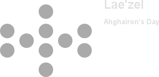
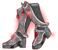
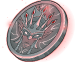
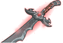
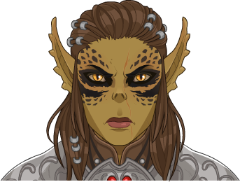

[Back to Main](index.md)





# Lae'zel

Was spoiled on the Server Maintenance Stream by Chris Dupuis. They are a character from the Baldur's Gate III game.

Info from a wiki.
> Lae'zel is a ferocious Githyanki warrior, mighty even by the standards of her mind flayer-hunting kin. Faced with transforming into the monster she's sworn to destroy, Lae'zel must cure herself and prove that she is worthy of wielding the silver sword of a Kith'rak.

[Wiki Link](https://baldursgate3.wiki.fextralife.com/Lae%27zel)

# Basic Information

Lae'zel will be the new champion in the Ahghairon's Day event on 16 August 2023.

* Seat: Unknown
* Race: Githyanki
* Class: Fighter
* Roles: Unknown
* Age: Unknown
* Gender: Female
* Alignment: Unknown
* Affiliation: Unknown
* Stats: Unknown

# Formation

Unknown.




# Abilities

**Base Attack: Greatsword** (Melee)
> Unknown effect.

<em>Raw Data</em>

<pre>
{
    "description": "",
    "long_description": "",
    "damage_modifier": 1,
    "damage_types": ["melee"],
    "graphic_id": 0,
    "target": "front",
    "aoe_radius": 0,
    "tags": ["melee"],
    "num_targets": 1,
    "animations": [{
        "damage_frame": 2,
        "jump_sound": 30,
        "sound_frames": {"2": 154},
        "target_offset_x": -34,
        "type": "melee_attack"
    }],
    "name": "Greatsword",
    "cooldown": 8,
    "id": 655
}
</pre>

 
**Base Attack: War Magic** (Melee and Magic)
> Unknown effect.

<em>Raw Data</em>

<pre>
{
    "description": "",
    "long_description": "",
    "damage_modifier": 1,
    "damage_types": [
        "melee",
        "magic"
    ],
    "graphic_id": 0,
    "target": "front",
    "aoe_radius": 0,
    "tags": [
        "melee",
        "ranged"
    ],
    "num_targets": 1,
    "animations": [{
        "damage_frame": 2,
        "jump_sound": 30,
        "sound_frames": {"2": 154},
        "target_offset_x": -34,
        "type": "melee_attack"
    }],
    "name": "War Magic",
    "cooldown": 8,
    "id": 656
}
</pre>

 

**Ultimate Attack: Psionic Leap** (Guess)
> Unknown effect.

<em>Raw Data</em>

<pre>
{
    "description": "",
    "long_description": "",
    "damage_modifier": 1,
    "damage_types": ["melee"],
    "graphic_id": 20244,
    "target": "front",
    "aoe_radius": 0,
    "tags": [
        "ultimate",
        "melee"
    ],
    "num_targets": 1,
    "animations": [{
        "damage_frame": 2,
        "jump_sound": 30,
        "sound_frames": {"2": 154},
        "target_offset_x": -34,
        "type": "melee_attack"
    }],
    "name": "Psionic Leap",
    "cooldown": 180,
    "id": 657
}
</pre>

 

**Critical Hit** (Guess)
> Lae'zel's base chance to Critical Hit is `$(amount)%`.

<em>Raw Data</em>

<pre>
{
    "effect_keys": [{"effect_string": "set_base_crit_chance,20"}],
    "requirements": "",
    "description": {"desc": "$source's base chance to Critical Hit is $(amount)%."},
    "id": 1597,
    "flavour_text": "",
    "graphic_id": 0,
    "properties": {
        "is_formation_ability": true,
        "owner_use_outgoing_description": true,
        "formation_circle_icon": false
    }
}
</pre>

 

**Lethal Coordination**
> Lae'zel increases the damage of all Champions in her column by `$(amount)%`, including herself.

<em>Raw Data</em>

<pre>
{
    "effect_keys": [{
        "effect_string": "hero_dps_multiplier_mult,100",
        "targets": ["col"]
    }],
    "requirements": "",
    "description": {"desc": "$source increases the damage of all Champions in her column by $(amount)%, including herself."},
    "id": 1598,
    "flavour_text": "",
    "graphic_id": 20239,
    "properties": {"is_formation_ability": true}
}
</pre>

 

**Ceremorphosis**
> Your formation gains one Ceremorphosis stack due to the mind flayer tadpole in Lae'zel's brain. Lae'zel increases the effect of `$(upgrade_name id___2)` by `$(amount)%` for each Ceremorphosis stack, stacking multiplicatively.

<em>Raw Data</em>

<pre>
{
    "effect_keys": [
        {"effect_string": "pre_stack_amount,100"},
        {
            "amount_expr": "upgrade_amount(12114,0)",
            "stack_title": "Total Ceremorphosis Stacks",
            "stacks_multiply": true,
            "total_title": "Total Bonus",
            "off_when_benched": true,
            "show_bonus": true,
            "amount_func": "mult",
            "stack_func": "per_ceremorphosis_stacks",
            "effect_string": "buff_upgrade,0,12113",
            "desc_forced_order": 2
        },
        {
            "stack_title": "Lae'zel Ceremorphosis Stacks",
            "manual_stacking": true,
            "stacks_multiply": false,
            "off_when_benched": true,
            "outgoing_buffs": false,
            "effect_string": "laezel_ceremorphosis_stacks,2",
            "show_stacks": true,
            "desc_forced_order": 1
        }
    ],
    "requirements": "",
    "description": {"desc": "Your formation gains one Ceremorphosis stack due to the mind flayer tadpole in $source's brain. $source increases the effect of $(upgrade_name id___2) by $(amount)% for each Ceremorphosis stack, stacking multiplicatively."},
    "id": 1599,
    "flavour_text": "",
    "graphic_id": 20237,
    "properties": {
        "indexed_effect_properties": true,
        "retain_on_slot_changed": true,
        "is_formation_ability": true,
        "default_bonus_index": 0,
        "owner_use_outgoing_description": true,
        "per_effect_index_bonuses": true
    }
}
</pre>

 

**Straight to the Point**
> Unknown effect.

<em>Raw Data</em>

<pre>
{
    "effect_keys": [{"effect_string": "do_nothing"}],
    "requirements": "",
    "description": {"desc": ""},
    "id": 1600,
    "flavour_text": "",
    "graphic_id": 20240,
    "properties": {"is_formation_ability": true}
}
</pre>

 

**Aberration Hunter**
> Aberrations are Lae'zel's Favored Foe. Every time an Aberration spawns, Lae'zel's `$(upgrade_name id___2)` is multiplicatively increased by `$(amount___2)%`, stacking up to `$(max_stack_mult___3)` times the Ceremorphosis stack count and resetting when changing areas. There is a `$(amount___4)%` with each wave in a non-boss area that an extra Mind Flayer spawns.

<em>Raw Data</em>

<pre>
{
    "effect_keys": [
        {
            "off_when_benched": true,
            "effect_string": "favored_foe,aberration"
        },
        {
            "stack_title": "Aberration Hunter Stacks",
            "stacks_multiply": true,
            "show_bonus": true,
            "effect_string": "buff_upgrade,100,12113",
            "more_triggers": [{
                "action": {"type": "reset"},
                "trigger": "area_changed"
            }],
            "max_stacks": 0,
            "stacks_on_trigger": {
                "is_source_favored_foe": true,
                "trigger": "favored_foe_spawned"
            }
        },
        {
            "max_stack_mult": 4,
            "rounding_mode": "ceil",
            "effect_string": "stacks_max_stack_expr,1,per_ceremorphosis_stacks*4"
        }
    ],
    "requirements": "",
    "description": {"desc": "Aberrations are $source's Favored Foe. Every time an Aberration spawns, $source's $(upgrade_name id___2) is multiplicatively increased by $(amount___2)%, stacking up to $(max_stack_mult___3) times the Ceremorphosis stack count and resetting when changing areas. There is a $(amount___4)% with each wave in a non-boss area that an extra Mind Flayer spawns."},
    "id": 1601,
    "flavour_text": "",
    "graphic_id": 20236,
    "properties": {
        "indexed_effect_properties": true,
        "retain_on_slot_changed": true,
        "is_formation_ability": true,
        "default_bonus_index": 1,
        "owner_use_outgoing_description": true,
        "per_effect_index_bonuses": true
    }
}
</pre>

 

**Ferocious Warrior**
> If Lae'zel attacks and any of her targets survive, her base attack cooldown for her next attack is reduced by `$(amount)` seconds.

<em>Raw Data</em>

<pre>
{
    "effect_keys": [{
        "stack_title": "Ferocious Warrior Stacks",
        "stacks_multiply": true,
        "bonus_is_seconds": true,
        "off_when_benched": true,
        "show_bonus": true,
        "effect_string": "reduce_attack_cooldown,4",
        "percent_values": false,
        "more_triggers": [{
            "action": {"type": "reset"},
            "trigger": "owner_kill"
        }],
        "max_stacks": 1,
        "stacks_on_trigger": "owner_attack_no_kill",
        "total_bonus_amount_prefix": "-"
    }],
    "requirements": "",
    "description": {"desc": "If $source attacks and any of her targets survive, her base attack cooldown for her next attack is reduced by $(amount) seconds."},
    "id": 1602,
    "flavour_text": "",
    "graphic_id": 20238,
    "properties": {
        "is_formation_ability": true,
        "owner_use_outgoing_description": true
    }
}
</pre>

 

# Specialisations

**Specialisation: Battle Master**
> Unknown effect.

<em>Raw Data</em>

<pre>
{
    "p": 0,
    "v": 2,
    "id": 20241,
    "export_params": {"uses": ["icon"]},
    "type": 1,
    "graphic": "Icons/Events/2018AhghaironsDay/AhghaironsDay_Y6/Icon_Specialization_LaezelBattleMaster",
    "fs": 0
}
</pre>

 

**Specialisation: Champion** (Guess)
> Increase Lae'zel's Critical Hit chance by `$(amount)%` and Critical Hit damage by `$(amount___2)%`.

<em>Raw Data</em>

<pre>
{
    "effect_keys": [
        {"effect_string": "buff_base_crit_chance_add,20"},
        {"effect_string": "buff_base_crit_damage_mult,100"}
    ],
    "requirements": "",
    "description": {"desc": "Increase $source's Critical Hit chance by $(amount)% and Critical Hit damage by $(amount___2)%."},
    "id": 1603,
    "flavour_text": "",
    "graphic_id": 0,
    "properties": {
        "indexed_effect_properties": true,
        "is_formation_ability": true,
        "owner_use_outgoing_description": true,
        "formation_circle_icon": false,
        "per_effect_index_bonuses": true
    }
}
</pre>

 

**Specialisation: Eldritch Knight**
> Unknown effect.

<em>Raw Data</em>

<pre>
{
    "p": 0,
    "v": 2,
    "id": 20243,
    "export_params": {"uses": ["icon"]},
    "type": 1,
    "graphic": "Icons/Events/2018AhghaironsDay/AhghaironsDay_Y6/Icon_Specialization_LaezelEldritchKnight",
    "fs": 0
}
</pre>

 

# Items

| Icon | Name | Type |
|:-:|---|---|
|  | `Armor` | Unknown |
|  | `Boots` | Unknown |
|  | `Githyanki` | Unknown |
|  | `Magic` | Unknown |
|  | `Ranged` | Unknown |
|  | `Sword` | Unknown |

# Feats

Unknown.

# Legendaries

Unknown.

# Console Portrait

# Chests

| Gold | Silver |
|---|---|
|  |  |

[Back to Top](#top)

*Last Modified: {{ site.time }}*