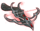
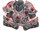

[Back to Main](index.md)

# Lae'zel

Lae'zel is a ferocious Githyanki warrior, mighty even by the standards of her mind flayer-hunting kind. Faced with transforming into the very monster she's sworn to destroy, Lae'zel must prove herself worthy of rejoining her people - if they don't execute her first.

# Basic Information

Lae'zel will be the new champion in the Ahghairon's Day event on 16 August 2023.

* Seat: 2
* Race: Githyanki
* Class: Fighter
* Roles: Support / DPS / Speed
* Age: 22
* Gender: Female
* Alignment: Lawful Evil
* Affiliation: Absolute Adversaries

| Stat | Value | Day 1 Trials | Patrons |
|---|---|---|---|
| Strength | 17 | Yes | Mirt |
| Dexterity | 13 | Yes | Vajra |
| Constitution | 14 | Yes | - |
| Intelligence | 11 | Yes | - |
| Wisdom | 12 | Yes | |
| Charisma | 8 | - | |
| Total | 75 | |

# Formation

# Abilities

 **Base Attack: Greatsword** (Melee)
> Lae'zel attacks the closest enemies with a swing of her greatsword.

<em>Raw Data</em>

<pre>
{
    "description": "Lae'zel attacks the closest enemies with a swing of her greatsword.",
    "long_description": "",
    "damage_modifier": 1,
    "damage_types": ["melee"],
    "graphic_id": 0,
    "target": "front",
    "aoe_radius": 0,
    "tags": ["melee"],
    "num_targets": 1,
    "animations": [{
        "melee_leap_offset": [
            -100,
            0
        ],
        "attack_sounds": {
            "magic": 149,
            "melee": 158
        },
        "melee_sequence": "attack",
        "special_melee": "laezel",
        "melee_hit_frame": 4,
        "type": "melee_attack",
        "melee_aoe_radius": 150
    }],
    "name": "Greatsword",
    "cooldown": 8,
    "id": 655
}
</pre>

  **Base Attack: War Magic** (Melee / Magic)
> Lae'zel attacks with her greatsword and a volley of magic missiles.

<em>Raw Data</em>

<pre>
{
    "description": "Lae'zel attacks with her greatsword and a volley of magic missiles.",
    "long_description": "",
    "damage_modifier": 1,
    "damage_types": [
        "melee",
        "magic"
    ],
    "graphic_id": 0,
    "target": "front",
    "aoe_radius": 0,
    "tags": [
        "melee",
        "ranged"
    ],
    "num_targets": 1,
    "animations": [{
        "melee_leap_offset": [
            -100,
            0
        ],
        "magic_shoot_offset": [
            100,
            -105
        ],
        "magic_sequence": "attack_b",
        "attack_sounds": {
            "magic": 149,
            "melee": 158
        },
        "melee_sequence": "attack",
        "special_melee": "laezel",
        "melee_hit_frame": 4,
        "magic_shoot_frames": [
            6,
            11,
            16
        ],
        "type": "melee_attack",
        "melee_aoe_radius": 150
    }],
    "name": "War Magic",
    "cooldown": 8,
    "id": 656
}
</pre>

 **Ultimate Attack: Psionic Leap** (Level: 300)
> Lae'zel psionically leaps into the enemies and attacks with a psionic shockwave, stunning them all for a short duration.

<em>Raw Data</em>

<pre>
{
    "description": "Lae'zel leaps into the enemies and attacks, stunning them all for a short duration.",
    "long_description": "Lae'zel psionically leaps into the enemies and attacks with a psionic shockwave, stunning them all for a short duration.",
    "damage_modifier": 0.03,
    "damage_types": ["melee"],
    "graphic_id": 20244,
    "target": "all",
    "aoe_radius": 0,
    "tags": [
        "ultimate",
        "melee"
    ],
    "num_targets": 1,
    "animations": [{
        "stun_duration": 5,
        "melee_leap_offset": [
            -150,
            0
        ],
        "ultimate": "laezel",
        "melee_aoe_offset": [
            150,
            -75
        ],
        "melee_hit_frame": 4,
        "type": "ultimate_attack",
        "melee_aoe_radius": 750
    }],
    "name": "Psionic Leap",
    "cooldown": 180,
    "id": 657
}
</pre>

**Critical Hit** (Level: 0)
> Lae'zel's base chance to Critical Hit is 20%.

<em>Raw Data</em>

<pre>
{
    "static_dps_mult": null,
    "required_level": 0,
    "effect": "effect_def,1597",
    "name": "Critical Hit",
    "id": 12112,
    "hero_id": 128,
    "upgrade_type": "unlock_ability",
    "default_enabled": 1,
    "required_upgrade_id": 0
}
{
    "effect_keys": [{"effect_string": "set_base_crit_chance,20"}],
    "requirements": "",
    "description": {"desc": "$source's base chance to Critical Hit is $(amount)%."},
    "id": 1597,
    "flavour_text": "",
    "graphic_id": 0,
    "properties": {
        "is_formation_ability": true,
        "owner_use_outgoing_description": true,
        "formation_circle_icon": false
    }
}
</pre>

 **Lethal Coordination** (Level: 30)
> Lae'zel increases the damage of all Champions in her column by 100%, including herself.

<em>Upgrade Data</em>

<pre>
Upgrades:
      120: 100%
      210: 100%
      280: 100%
      340: 100%
      410: 100%
      490: 100%
      560: 100%
      640: 100%
      710: 100%
      800: 100%
      880: 100%
      950: 100%
    1,020: 100%
    1,090: 100%
    1,180: 100%
    1,230: 100%
    1,300: 100%
    1,380: 100%
    1,460: 100%
    1,530: 100%
    1,620: 100%

    Total Upgrade Bonus: 2.10e08%

Expected numbers with various item levels:
	(Does not include feats.)
	(Possibly highly inaccurate.)

	Dull Epic ilvl    100: 1.01e09%
	Dull Epic ilvl  1,000: 3.09e09%
	Dull Epic ilvl 10,000: 2.39e10%
</pre>

<em>Raw Data</em>

<pre>
{
    "static_dps_mult": null,
    "required_level": 30,
    "effect": "effect_def,1598",
    "tip_text": "Lae'zel increases the damage of all Champions in her column, including herself.",
    "name": "Lethal Coordination",
    "id": 12113,
    "hero_id": 128,
    "upgrade_type": "unlock_ability",
    "default_enabled": 1,
    "required_upgrade_id": 0
}
{
    "effect_keys": [{
        "effect_string": "hero_dps_multiplier_mult,100",
        "targets": ["col"]
    }],
    "requirements": "",
    "description": {"desc": "$source increases the damage of all Champions in her column by $(amount)%, including herself."},
    "id": 1598,
    "flavour_text": "",
    "graphic_id": 20239,
    "properties": {"is_formation_ability": true}
}
</pre>

 **Ceremorphosis** (Level: 80)
> Your formation gains one Ceremorphosis stack due to the mind flayer tadpole in Lae'zel's brain. Lae'zel increases the effect of Lethal Coordination by 100% for each Ceremorphosis stack, stacking multiplicatively.

*Note: This ability might be prestack.*

<em>Raw Data</em>

<pre>
{
    "static_dps_mult": null,
    "required_level": 80,
    "effect": "effect_def,1599",
    "name": "Ceremorphosis",
    "id": 12114,
    "hero_id": 128,
    "upgrade_type": "unlock_ability",
    "default_enabled": 1,
    "required_upgrade_id": 0
}
{
    "effect_keys": [
        {"effect_string": "pre_stack_amount,100"},
        {
            "amount_expr": "upgrade_amount(12114,0)",
            "stack_title": "Total Ceremorphosis Stacks",
            "amount_updated_listeners": ["slot_changed"],
            "stacks_multiply": true,
            "total_title": "Total Bonus",
            "off_when_benched": true,
            "show_bonus": true,
            "amount_func": "mult",
            "stack_func": "per_ceremorphosis_stacks",
            "effect_string": "buff_upgrade,0,12113",
            "desc_forced_order": 2
        },
        {
            "stack_title": "Lae'zel Ceremorphosis Stacks",
            "manual_stacking": true,
            "stacks_multiply": false,
            "off_when_benched": true,
            "outgoing_buffs": false,
            "effect_string": "laezel_ceremorphosis_stacks,1",
            "show_stacks": true,
            "desc_forced_order": 1
        }
    ],
    "requirements": "",
    "description": {"desc": "Your formation gains one Ceremorphosis stack due to the mind flayer tadpole in $source's brain. $source increases the effect of $(upgrade_name id___2) by $(amount)% for each Ceremorphosis stack, stacking multiplicatively."},
    "id": 1599,
    "flavour_text": "",
    "graphic_id": 20237,
    "properties": {
        "indexed_effect_properties": true,
        "retain_on_slot_changed": true,
        "is_formation_ability": true,
        "default_bonus_index": 0,
        "owner_use_outgoing_description": true,
        "per_effect_index_bonuses": true
    }
}
</pre>

 **Straight to the Point** (Level: 100)
> In non-boss areas, whenever an enemy is defeated by anything OTHER than Lae'zel, she has a 100% chance to gain an Impatience stack. When she has 17 Impatience stacks, complete the current area and reset the Impatience stacks to the current Ceremorphosis count. Stacks persist when changing areas.

<em>Raw Data</em>

<pre>
{
    "static_dps_mult": null,
    "required_level": 100,
    "effect": "effect_def,1600",
    "tip_text": "Lae'zel gets impatient when other Champions defeat enemies which results in her complete areas early.",
    "name": "Straight to the Point",
    "id": 12115,
    "hero_id": 128,
    "upgrade_type": "unlock_ability",
    "default_enabled": 1,
    "required_upgrade_id": 0
}
{
    "effect_keys": [
        {"effect_string": "laezel_straight_to_the_point_chance,100"},
        {
            "stack_title": "Impatience stacks",
            "effect_string": "laezel_straight_to_the_point_stacks",
            "show_stacks": true,
            "max_stacks": 17,
            "stacks_on_trigger": "will_manually_stack"
        }
    ],
    "requirements": "",
    "description": {"desc": "In non-boss areas, whenever an enemy is defeated by anything OTHER than $source, she has a $(amount)% chance to gain an Impatience stack. When she has $(max_stacks___2) Impatience stacks, complete the current area and reset the Impatience stacks to the current Ceremorphosis count. Stacks persist when changing areas."},
    "id": 1600,
    "flavour_text": "",
    "graphic_id": 20240,
    "properties": {
        "indexed_effect_properties": true,
        "retain_on_slot_changed": true,
        "is_formation_ability": true,
        "default_bonus_index": 0,
        "owner_use_outgoing_description": true,
        "per_effect_index_bonuses": true
    }
}
</pre>

 **Aberration Hunter** (Level: 170)
> Aberrations are Lae'zel's Favored Foe. Every time an Aberration spawns, Lae'zel's Lethal Coordination is multiplicatively increased by 100%, stacking up to 4 times the Ceremorphosis stack count and resetting when changing areas. There is a 33% chance with each wave in a non-boss area that an extra Mind Flayer spawns.

<em>Upgrade Data</em>

<pre>
Upgrades:
      470: 100%
      770: 100%
    1,170: 100%
    1,570: 100%

    Total Upgrade Bonus: 1,500%

Expected numbers with various item levels:
	(Does not include feats.)
	(Possibly highly inaccurate.)

	Dull Epic ilvl    100: -2.26e01%
	Dull Epic ilvl  1,000: 1.36e02%
	Dull Epic ilvl 10,000: 1.72e03%
</pre>

<em>Raw Data</em>

<pre>
{
    "static_dps_mult": null,
    "required_level": 170,
    "effect": "effect_def,1601",
    "name": "Aberration Hunter",
    "id": 12116,
    "hero_id": 128,
    "upgrade_type": "unlock_ability",
    "default_enabled": 1,
    "required_upgrade_id": 0
}
{
    "effect_keys": [
        {
            "off_when_benched": true,
            "effect_string": "favored_foe,aberration"
        },
        {
            "stack_title": "Aberration Hunter Stacks",
            "stacks_multiply": true,
            "show_bonus": true,
            "effect_string": "buff_upgrade,100,12113",
            "more_triggers": [{
                "action": {"type": "reset"},
                "trigger": "area_changed"
            }],
            "max_stacks": 0,
            "stacks_on_trigger": {
                "is_source_favored_foe": true,
                "trigger": "favored_foe_spawned"
            }
        },
        {
            "max_stack_mult": 4,
            "effect_string": "stacks_max_stack_expr,1,per_ceremorphosis_stacks()*4"
        },
        {
            "effect_string": "laezel_aberration_hunter_spawn,33",
            "num_spawns": 1,
            "spawn_ids": [2028]
        }
    ],
    "requirements": "",
    "description": {"desc": "Aberrations are $source's Favored Foe. Every time an Aberration spawns, $source's $(upgrade_name id___2) is multiplicatively increased by $(not_buffed amount___2)%, stacking up to $(max_stack_mult___3) times the Ceremorphosis stack count and resetting when changing areas. There is a $(amount___4)% chance with each wave in a non-boss area that an extra Mind Flayer spawns."},
    "id": 1601,
    "flavour_text": "",
    "graphic_id": 20236,
    "properties": {
        "indexed_effect_properties": true,
        "retain_on_slot_changed": true,
        "is_formation_ability": true,
        "default_bonus_index": 1,
        "owner_use_outgoing_description": true,
        "per_effect_index_bonuses": true
    }
}
</pre>

 **Ferocious Warrior** (Level: 200)
> If Lae'zel attacks and any of her targets survive, her base attack cooldown for her next attack is reduced by 4 seconds.

<em>Raw Data</em>

<pre>
{
    "static_dps_mult": null,
    "required_level": 200,
    "effect": "effect_def,1602",
    "name": "Ferocious Warrior",
    "id": 12117,
    "hero_id": 128,
    "upgrade_type": "unlock_ability",
    "default_enabled": 1,
    "required_upgrade_id": 0
}
{
    "effect_keys": [{
        "stack_title": "Ferocious Warrior Stacks",
        "stacks_multiply": true,
        "bonus_is_seconds": true,
        "off_when_benched": true,
        "show_bonus": true,
        "effect_string": "reduce_attack_cooldown,4",
        "percent_values": false,
        "more_triggers": [{
            "action": {"type": "reset"},
            "trigger": "owner_kill"
        }],
        "max_stacks": 1,
        "stacks_on_trigger": "owner_attack_any_survived",
        "total_bonus_amount_prefix": "-"
    }],
    "requirements": "",
    "description": {"desc": "If $source attacks and any of her targets survive, her base attack cooldown for her next attack is reduced by $(amount) seconds."},
    "id": 1602,
    "flavour_text": "",
    "graphic_id": 20238,
    "properties": {
        "is_formation_ability": true,
        "owner_use_outgoing_description": true
    }
}
</pre>

# Specialisations

 **Battle Master** (Level: 230)
> When Lae'zel hits an enemy and they survive, the enemy is distracted and the next Champion (other than Lae'zel) that hits them deals an additional 4 seconds of BUD-based damage.

<em>Raw Data</em>

<pre>
{
    "static_dps_mult": null,
    "specialization_name": "Battle Master",
    "required_level": 230,
    "effect": "effect_def,1604",
    "name": "Battle Master",
    "specialization_graphic_id": 20241,
    "id": 12119,
    "hero_id": 128,
    "upgrade_type": "unlock_ability",
    "default_enabled": 1,
    "required_upgrade_id": 0,
    "specialization_description": "Lae'zel's attacks distract enemies, causing the next attack that hits them to do massive damage."
}
{
    "effect_keys": [{
        "distracted_graphic_offset": [
            -50,
            -150
        ],
        "effect_string": "laezel_battle_master,4"
    }],
    "requirements": "",
    "description": {"desc": "When $source hits an enemy and they survive, the enemy is distracted and the next Champion (other than $source) that hits them deals an additional $(amount) seconds of BUD-based damage."},
    "id": 1604,
    "flavour_text": "",
    "graphic_id": 0,
    "properties": {
        "is_formation_ability": true,
        "owner_use_outgoing_description": true,
        "formation_circle_icon": false
    }
}
</pre>

 **Champion** (Level: 230)
> Increases Lae'zel's Critical Hit chance by 20% (additively) and Critical Hit damage by 100% (multiplicatively).

<em>Raw Data</em>

<pre>
{
    "static_dps_mult": null,
    "specialization_name": "Champion",
    "required_level": 230,
    "effect": "effect_def,1603",
    "name": "Champion",
    "specialization_graphic_id": 20242,
    "id": 12118,
    "hero_id": 128,
    "upgrade_type": "unlock_ability",
    "default_enabled": 1,
    "required_upgrade_id": 0,
    "specialization_description": "Lae'zel becomes a Champion, increasing the chance and damage of her critical hits."
}
{
    "effect_keys": [
        {"effect_string": "buff_base_crit_chance_add,20"},
        {"effect_string": "buff_base_crit_damage_mult,100"}
    ],
    "requirements": "",
    "description": {"desc": "Increases $source's Critical Hit chance by $(amount)% (additively) and Critical Hit damage by $(amount___2)% (multiplicatively)."},
    "id": 1603,
    "flavour_text": "",
    "graphic_id": 0,
    "properties": {
        "indexed_effect_properties": true,
        "is_formation_ability": true,
        "owner_use_outgoing_description": true,
        "formation_circle_icon": false,
        "per_effect_index_bonuses": true
    }
}
</pre>

 **Eldritch Knight** (Level: 230)
> Lae'zel now casts Magic Missile immediately after attacking with her greatsword, firing a missile at 3 random targets.

<em>Raw Data</em>

<pre>
{
    "static_dps_mult": null,
    "specialization_name": "Eldritch Knight",
    "required_level": 230,
    "effect": "effect_def,1605",
    "name": "Eldritch Knight",
    "specialization_graphic_id": 20243,
    "id": 12120,
    "hero_id": 128,
    "upgrade_type": "unlock_ability",
    "default_enabled": 1,
    "required_upgrade_id": 0,
    "specialization_description": "Lae'zel becomes an Eldritch Knight, allowing her to cast Magic Missile after each of her Greatsword attacks."
}
{
    "effect_keys": [{"effect_string": "change_base_attack,656"}],
    "requirements": "",
    "description": {"desc": "$source now casts Magic Missile immediately after attacking with her greatsword, firing a missile at 3 random targets."},
    "id": 1605,
    "flavour_text": "",
    "graphic_id": 0,
    "properties": {
        "is_formation_ability": true,
        "owner_use_outgoing_description": true,
        "formation_circle_icon": false
    }
}
</pre>

# Items

    
        
            **Icons**
        
        
            **Slot**
        
        
            **Epic Name**
        
        
            **Effect**
        
    
    
        
            
        
        
            1
        
        
            Mind Seeker
        
        
            All Champion Damage
        
    
    
        
            
        
        
            2
        
        
            Githyanki Silver Sword
        
        
            Lethal Coordination
        
    
    
        
            
        
        
            3
        
        
            Token of Vlaakith
        
        
            Ceremorphosis
        
    
    
        
            
        
        
            4
        
        
            Dragonrider Armour
        
        
            Aberration Hunter
        
    
    
        
            
        
        
            5
        
        
            Astral Striders
        
        
            Ultimate Damage
        
    
    
        
            
        
        
            6
        
        
            Sunwalker's Gift
        
        
            Ultimate Cooldown Reduction
        
    

<em>Item Names and Descriptions</em>

<pre>
Slot 1:
          Raiding Daggers: A gift from my sa'varsh. I used them to survive my first of many
                           raids.
          Balanced Blades: A fellow initiate called these blades 'insufficient'. The wounds
                           they left on his forehead prove otherwise.
             Ghaik Slayer: This will help me bring a ghaik head to my Undying Queen.
              Mind Seeker: Each bolt is enchanted to seek out the brain of a ghaik and destroy
                           it.

Slot 2:
          Training Weapon: The edge may be dull, but it will cleave my foes open all the same.
     Battle Damaged Sword: Each mark on this blade is a lesson I learned on Crèche K'liir.
               Greatsword: One day I will wield a true silver sword in Vlaakith's name.
   Githyanki Silver Sword: Within this blade lives the whole of the empire's might!

Slot 3:
            Raiding Prize: A mere trinket.
      Memory of the Tears: A simple memento of the crèche I once called home.
            Aether Shards: Said to be found only in Tu'narath, the City of Death.
        Token of Vlaakith: The engraving on the back reads: 'Vlaakith'ka sivim hrath krash'ht'

Slot 4:
              Ornate Garb: Discarded attire from Crèche K'liir - a hand-me-down from the varsh.
        Ancient Adornment: Ceremonial garments, passed from the undead tl'a'ikith who wore them
                           in life.
           Githyanki Mail: The armor of a githyanki warrior is unmatched.
       Dragonrider Armour: To wear this armour atop a red dragon steed is my duty and my
                           destiny!

Slot 5:
          Leather Sandals: Tsk'va! I hate these things.
        Well Used Sandals: Training on Crèche K'liir with these was close to torture.
         Half Plate Boots: With one sturdy stomp, I could crush a ghaik's abominable skull.
          Astral Striders: With these, I can walk amongst the stars and hunt ghaik wherever
                           they hide.

Slot 6:
       Unidentified Crown: I snatched this from the ruins of a githyanki temple. It holds but a
                           trace of psionic magic.
            Ancient Crown: The magic within this crown reeks of shadow. I call upon it at my
                           own peril.
Gloves of Missile Snaring: The spoils of a victorious raid. They serve their purpose more than
                           adequately.
         Sunwalker's Gift: With this, the shadows bow to me.
</pre>

 

# Feats

This list will only show feats that are going to be available on the release of this champion. The separate [Feats](feats.md) page may show others that could be available later if they exist.

    
        
            **Feat**
        
        
            **Effect**
        
        
            **Source**
        
    
    
        
            Tavern Brawler
        
        
            30% Self DPS
        
        
            Free
        
    
    
        
            Grappler
        
        
            60% Self DPS
        
        
            Gold Chest
        
    
    
        
            Selflessness
        
        
            10% All Champion Damage
        
        
            Free
        
    
    
        
            Inspiring Leader
        
        
            25% All Champion Damage
        
        
            12,500 Gems
        
    
    
        
            Lethal Timing
        
        
            20% Lethal Coordination
        
        
            Free
        
    
    
        
            Lethal Tactics
        
        
            40% Lethal Coordination
        
        
            Gold Chest
        
    
    
        
            Stygian Vigor
        
        
            20% Ceremorphosis
        
        
            Free
        
    
    
        
            Eldritch Empowerment
        
        
            40% Ceremorphosis
        
        
            12,500 Gems
        
    
    
        
            No Time to Explain
        
        
            40% Straight to the Point
        
        
            12,500 Gems
        
    
    
        
            Hurry Up!
        
        
            80% Straight to the Point
        
        
            50,000 Gems
        
    
    
        
            Aberrant Slayer
        
        
            40% Aberration Hunter
        
        
            Gold Chest
        
    
    
        
            Battle Expertise
        
        
            +20% Crit Chance
        
        
            Gold Chest
        
    
    
        
            Cataclysmic Strike
        
        
            +60% Crit Damage
        
        
            Gold Chest
        
    

# Legendaries

* Increases the damage of all Champions by 10% for each Champion in the formation.
* Increases the damage of all Female Champions by 125%.
* Increases the damage of all Githyanki Champions by 150%.
* Increases the damage of all Champions by 20% for each Champion with a INT score of 11 or higher in the formation.
* Increases the damage of all Champions by 30% for each Champion with a DEX score of 13 or higher in the formation.
* Increases the damage of all Champions by 20% for each Melee Champion in the formation.

<em>DPS Applicable</em>

<pre>
     Arkhan: 4 / 6
    Artemis: 4 / 6
    Asharra: 5 / 6
      Azaka: 5 / 6
     Binwin: 4 / 6
   Birdsong: 5 / 6
Black Viper: 5 / 6
 Catti-brie: 5 / 6
     D'hani: 5 / 6
     Delina: 5 / 6
    Dhadius: 4 / 6
     Drizzt: 4 / 6
    Farideh: 5 / 6
        Fen: 5 / 6
      Grimm: 4 / 6
     Gromma: 5 / 6
       Ishi: 5 / 6
    Jaheira: 5 / 6
    Jamilah: 5 / 6
   Jarlaxle: 4 / 6
        Jim: 4 / 6
       Kent: 4 / 6
      Krond: 4 / 6
       Krux: 4 / 6
     Lucius: 4 / 6
      Makos: 4 / 6
      Minsc: 4 / 6
      NERDS: 4 / 6
     Nahara: 5 / 6
      Nixie: 5 / 6
      Nrakk: 4 / 6
     Orisha: 5 / 6
   Prudence: 5 / 6
      Rosie: 5 / 6
      Strix: 5 / 6
    Torogar: 4 / 6
     Warden: 4 / 6
    Warduke: 4 / 6
     Yorven: 4 / 6
      Zorbu: 4 / 6
</pre>

 

# Console Portrait

# Chests

| Gold | Silver |
|---|---|
|  |  |

[Back to Top](#top)

*Last Modified: {{ site.time }}*