[Back to Main](index.md)

    
        
            
        
        
            Portrait
        
    
    
        
            
        
        
            Model
        
    

# Lark

Lark, a bard with as many secrets as songs.

[The Fallbacks: Bound for Ruin - Fandom Wiki](https://forgottenrealms.fandom.com/wiki/The_Fallbacks:_Bound_for_Ruin)

# Basic Information

Lark will be a new champion in the Simril event on 3 December 2025.

    
        
            **Seat**:
        
        
            Unknown
        
    
    
        
            **Species**:
        
        
            Tiefling (Guess)
        
    
    
        
            **Class**:
        
        
            Bard (Guess)
        
    
    
        
            **Roles**:
        
        
            Support / Speed / Debuff (Guess)
        
    
    
        
            **Age**:
        
        
            Unknown
        
    
    
        
            **Gender**:
        
        
            Male (Guess)
        
    
    
        
            **Alignment**:
        
        
            Unknown
        
    
    
        
            **Affiliation**:
        
        
            The Fallbacks (Guess)
        
    

# Formation

    <svg xmlns="http://www.w3.org/2000/svg" id="Lark" fill="#aaa" data-formationName="Lark" data-campaignName="Simril" width="303" height="160"><circle cx="215" cy="85" r="15"/><circle cx="215" cy="125" r="15"/><circle cx="175" cy="65" r="15"/><circle cx="175" cy="105" r="15"/><circle cx="175" cy="145" r="15"/><circle cx="135" cy="85" r="15"/><circle cx="135" cy="125" r="15"/><circle cx="95" cy="65" r="15"/><circle cx="55" cy="45" r="15"/><circle cx="15" cy="25" r="15"/><text x="245" y="25" fill="#dcdcdc" font-size="25" font-family="Arial" font-weight="bold">Lark</text><text x="245" y="65" fill="#dcdcdc" font-size="15" font-family="Arial" font-weight="bold">Simril</text></svg>

# Attacks

**Base Attack: Vicious Mockery** (Magic)
> Lark attacks a random enemy, dealing 1 hit. Lark prefers to attack enemies he hasn't attacked yet.  
> Cooldown: 4s (Cap 1s)

<em>Raw Data</em>

<pre>
{
    "id": 912,
    "name": "Vicious Mockery",
    "description": "Lark mocks a random enemy for one hit.",
    "long_description": "Lark attacks a random enemy, dealing 1 hit. Lark prefers to attack enemies he hasn't attacked yet.",
    "graphic_id": 0,
    "target": "random",
    "num_targets": 1,
    "aoe_radius": 0,
    "damage_modifier": 1,
    "cooldown": 4,
    "animations": [
        {
            "type": "ranged_attack",
            "projectile_graphic_id": 1,
            "projectile": "song_of_pain",
            "shoot_frame": 9,
            "hit_sound": 133,
            "shoot_sound": 159
        }
    ],
    "tags": [
        "magic"
    ],
    "damage_types": [
        "magic"
    ]
}
</pre>

**Base Attack: Last Resort** (Ranged)
> Lark fires his Crossbow at the closest enemy, dealing 1 hit and deals 5 seconds of BUD based damage.  
> Cooldown: 4s (Cap 1s)

<em>Raw Data</em>

<pre>
{
    "id": 913,
    "name": "Last Resort",
    "description": "Lark fires his crossbow at the closest target, dealing 5 seconds of BUD-based damage.",
    "long_description": "Lark fires his Crossbow at the closest enemy, dealing 1 hit and deals 5 seconds of BUD based damage.",
    "graphic_id": 0,
    "target": "front",
    "num_targets": 1,
    "aoe_radius": 0,
    "damage_modifier": 1,
    "cooldown": 4,
    "animations": [
        {
            "type": "ranged_attack",
            "projectile": "generic",
            "shoot_frame": 17,
            "shoot_offset_x": 100,
            "shoot_offset_y": -47,
            "projectile_count": 1,
            "projectile_details": {
                "projectile_speed": 2400,
                "has_trail": false,
                "extend_line": false,
                "projectile_graphic_id": 27872
            },
            "animation_sequence": 4,
            "effect_on_monsters": {
                "effect_string": "damage_monster_target_by_bud",
                "hit_monsters": true,
                "damage_mult": 5,
                "after_damage": true
            }
        }
    ],
    "tags": [
        "ranged"
    ],
    "damage_types": [
        "ranged"
    ]
}
</pre>

**Base Attack: Fake Last Resort** (Ranged)
> Lark fires his Crossbow at the closest enemy, dealing 1 hit and deals 5 seconds of BUD based damage.  
> Cooldown: 4s (Cap 1s)

<em>Raw Data</em>

<pre>
{
    "id": 919,
    "name": "Fake Last Resort",
    "description": "Lark fires his crossbow at the closest target, dealing 5 seconds of BUD-based damage.",
    "long_description": "Lark fires his Crossbow at the closest enemy, dealing 1 hit and deals 5 seconds of BUD based damage.",
    "graphic_id": 0,
    "target": "none",
    "num_targets": 0,
    "aoe_radius": 0,
    "damage_modifier": 0,
    "cooldown": 4,
    "animations": [
        {
            "type": "melee_attack",
            "no_damage_display": true,
            "no_cooldown_display": true,
            "COMMENT": "READ NOTE ENTRY"
        }
    ],
    "tags": [
        "ranged"
    ],
    "damage_types": [
        "ranged"
    ]
}
</pre>

**Base Attack: Uggie's Bite** (Melee)
> Uggie leaps out and bites a random enemy, dealing 1 hit. Uggie will prioritize enemies she hasn't attacked yet.  
> Cooldown: 0s (Cap 0s)

<em>Raw Data</em>

<pre>
{
    "id": 914,
    "name": "Uggie's Bite",
    "description": "Uggie protects her persons by biting a scary monster.",
    "long_description": "Uggie leaps out and bites a random enemy, dealing 1 hit. Uggie will prioritize enemies she hasn't attacked yet.",
    "graphic_id": 0,
    "target": "random",
    "num_targets": 1,
    "aoe_radius": 0,
    "damage_modifier": 1,
    "cooldown": 0,
    "animations": [
        {
            "type": "melee_attack",
            "damage_frame": 3
        }
    ],
    "tags": [
        "melee",
        "ignore_cooldown_override"
    ],
    "damage_types": [
        "melee"
    ]
}
</pre>

**Base Attack: Uggie's Bite** (Melee)
> Uggie leaps out and bites a random enemy, dealing 1 hit. Uggie will prioritize enemies she hasn't attacked yet.  
> Cooldown: 4s (Cap 1s)

<em>Raw Data</em>

<pre>
{
    "id": 918,
    "name": "Uggie's Bite",
    "description": "Uggie protects her persons by biting a scary monster.",
    "long_description": "Uggie leaps out and bites a random enemy, dealing 1 hit. Uggie will prioritize enemies she hasn't attacked yet.",
    "graphic_id": 0,
    "target": "dummy",
    "num_targets": 0,
    "aoe_radius": 0,
    "damage_modifier": 1,
    "cooldown": 4,
    "animations": [
        {
            "type": "dummy_attack",
            "no_damage_display_disabled": true,
            "animation_sequence_name": "none",
            "COMMENT READ ME": "READ NOTE ENTRY"
        }
    ],
    "tags": [
        "melee"
    ],
    "damage_types": [
        "melee"
    ]
}
</pre>

**Ultimate Attack: Enthrall**
> Lark's powerful performance deals 1 ultimate hit to all enemies and charms them, making them more susceptible to additional damage.  
> Cooldown: 360s (Cap 90s)

<em>Raw Data</em>

<pre>
{
    "id": 917,
    "name": "Enthrall",
    "description": "Lark delivers 1 ultimate hit to enemies and makes them vulnerable to additional damage.",
    "long_description": "Lark's powerful performance deals 1 ultimate hit to all enemies and charms them, making them more susceptible to additional damage.",
    "graphic_id": 27921,
    "target": "all",
    "num_targets": 0,
    "aoe_radius": 0,
    "damage_modifier": 0.03,
    "cooldown": 360,
    "animations": [
        {
            "type": "ultimate_attack",
            "ultimate": "lark"
        }
    ],
    "tags": [
        "magic",
        "ultimate"
    ],
    "damage_types": [
        "magic"
    ]
}
</pre>

**Base Attack: United Strike (Enthrall)** (Magic)
> Lark directs all the Fallbacks to attack with their ultimate attack, including his own Enthrall.  
> Cooldown: 360s (Cap 90s)

<em>Raw Data</em>

<pre>
{
    "id": 916,
    "name": "United Strike (Enthrall)",
    "description": "Lark directs all the Fallbacks to make their ultimate attack.",
    "long_description": "Lark directs all the Fallbacks to attack with their ultimate attack, including his own Enthrall.",
    "graphic_id": 26836,
    "target": "none",
    "num_targets": 0,
    "aoe_radius": 0,
    "damage_modifier": 0.03,
    "cooldown": 360,
    "animations": [
        {
            "type": "united_strike_ultimate"
        }
    ],
    "tags": [
        "magic"
    ],
    "damage_types": [
        "magic"
    ]
}
</pre>

**Base Attack: Call Uggie**
> Lark calls Uggie to his side.  
> Cooldown: 0s (Cap 0s)

<em>Raw Data</em>

<pre>
{
    "id": 915,
    "name": "Call Uggie",
    "description": "Lark calls Uggie to his side.",
    "long_description": "Lark calls Uggie to his side.",
    "graphic_id": 27103,
    "target": "none",
    "num_targets": 0,
    "aoe_radius": 0,
    "damage_modifier": 0,
    "cooldown": 0,
    "animations": [
        {
            "type": "call_uggie_ultimate",
            "no_damage_display": true
        }
    ],
    "tags": [
        "ignore_familiar",
        "ignore_cooldown_override"
    ],
    "damage_types": []
}
</pre>

# Abilities

**Unknown** (Guess)
> Uggie joins the party, starting next to Lark unless she's already in the formation next to another Fallbacks Champion. Uggie increases the damage of all non-adjacent Champions by 100%.

<em>Raw Data</em>

<pre>
{
    "id": 2506,
    "flavour_text": "",
    "description": {
        "desc": "Uggie joins the party, starting next to Lark unless she's already in the formation next to another Fallbacks Champion. Uggie increases the damage of all non-adjacent Champions by $amount%."
    },
    "effect_keys": [
        {
            "effect_string": "uggie_handler,100",
            "off_when_benched": true,
            "uggie_roaming_disable_index": 1,
            "post_united_strike_effect_indices": [
                2,
                3
            ],
            "uggie_priority": 2,
            "uggie_buff_effect_id": 2366,
            "uggie_apply_lark_debuff": true,
            "call_uggie_ult_id": 915,
            "united_strike_ult_id": 916,
            "use_computed_amount_for_description": true,
            "attack_id": 914
        },
        {
            "effect_string": "disallow_roaming_familiar_ult_trigger",
            "apply_manually": true
        },
        {
            "effect_string": "buff_ultimate,100",
            "apply_manually": true,
            "targets": [
                "all"
            ],
            "filter_targets": [
                {
                    "type": "hero_expr",
                    "hero_expr": "HasTag(`fallbacks`)"
                }
            ]
        }
    ],
    "requirements": "",
    "graphic_id": 27103,
    "large_graphic_id": 27103,
    "properties": {
        "is_formation_ability": true,
        "show_incoming": false,
        "owner_use_outgoing_description": true,
        "indexed_effect_properties": true,
        "per_effect_index_bonuses": true,
        "default_bonus_index": 0,
        "retain_on_slot_changed": true
    }
}
</pre>

**Devil May Care** (Guess)
> Lark increases the damage of all Champions that aren't in the first or last column by 100%.

<em>Raw Data</em>

<pre>
{
    "id": 2507,
    "flavour_text": "",
    "description": {
        "desc": "Lark increases the damage of all Champions that aren't in the first or last column by $amount%."
    },
    "effect_keys": [
        {
            "effect_string": "hero_dps_multiplier_mult,100",
            "off_when_benched": true,
            "targets": [
                "middle_columns"
            ]
        },
        {
            "effect_string": "do_nothing_devil_may_care",
            "off_when_benched": true,
            "targets": [
                "middle_columns"
            ],
            "skip_effect_key_desc": true
        }
    ],
    "requirements": "",
    "graphic_id": 27829,
    "large_graphic_id": 27823,
    "properties": {
        "is_formation_ability": true,
        "owner_use_outgoing_description": true,
        "indexed_effect_properties": true,
        "per_effect_index_bonuses": true
    }
}
</pre>

**Uptempo Uggie** (Guess)
> Uggie's buff is increased by 400% when Lark is in the formation.

<em>Raw Data</em>

<pre>
{
    "id": 2508,
    "flavour_text": "",
    "description": {
        "desc": "Uggie's buff is increased by $amount% when Lark is in the formation."
    },
    "effect_keys": [
        {
            "effect_string": "unleash_uggie_contribution,400",
            "off_when_benched": true
        }
    ],
    "requirements": "",
    "graphic_id": 0,
    "large_graphic_id": 0,
    "properties": {
        "is_formation_ability": true,
        "owner_use_outgoing_description": true,
        "indexed_effect_properties": true,
        "per_effect_index_bonuses": true,
        "default_bonus_index": 0
    }
}
</pre>

**Rapt Audience** (Guess)
> When Lark attacks an enemy and does not defeat it, the enemy gains the Charmed debuff. Charmed enemies take 100% additional damage for each Charmed debuff that Lark has applied in the current area, stacking multiplicatively and capping at 10 stacks. If Lark attacks an enemy he has already Charmed, it still increments his Charmed count for the area. Once Lark applies his maximum number of Charmed stacks in an area, he switches over to use his crossbow, named Last Resort.

<em>Raw Data</em>

<pre>
{
    "id": 2509,
    "flavour_text": "",
    "description": {
        "desc": "When Lark attacks an enemy and does not defeat it, the enemy gains the Charmed debuff. Charmed enemies take $amount___2% additional damage for each Charmed debuff that Lark has applied in the current area, stacking multiplicatively and capping at $max_stacks stacks. If Lark attacks an enemy he has already Charmed, it still increments his Charmed count for the area. Once Lark applies his maximum number of Charmed stacks in an area, he switches over to use his crossbow, named Last Resort."
    },
    "effect_keys": [
        {
            "effect_string": "lark_charmed_counter,100",
            "max_stacks": 10,
            "initial_max_stacks": 10,
            "ultimate_max_stacks": 20,
            "stacks_multiply": true,
            "more_triggers": [
                {
                    "trigger": "area_changed",
                    "action": {
                        "type": "reset"
                    }
                },
                {
                    "trigger": "area_changed",
                    "action": {
                        "type": "reset_max_stacks"
                    }
                },
                {
                    "trigger": "DISABLED_owner_attack_no_kill",
                    "action": {
                        "type": "add_stack"
                    }
                }
            ],
            "show_bonus": true
        },
        {
            "effect_string": "lark_charmed_debuff,100",
            "lark_weapon_swap_index": 2,
            "lark_ultimate_id": 917,
            "off_when_benched": true,
            "debuffing_attack_ids": [
                912,
                913,
                914,
                917,
                916
            ],
            "debuff_effects": [
                {
                    "effect_string": "increase_monster_damage,100",
                    "active_graphic_id": 27873,
                    "active_graphic_y": -120,
                    "stack_func_d": "upgrade_stacks",
                    "stack_func_data_d": {
                        "upgrade_id": 18054,
                        "upgrade_index": 0
                    },
                    "amount_expr": "upgrade_amount(18054,0)"
                }
            ]
        },
        {
            "effect_string": "change_base_attack,913",
            "off_when_benched": true,
            "apply_manually": true
        }
    ],
    "requirements": "",
    "graphic_id": 27830,
    "large_graphic_id": 27824,
    "properties": {
        "is_formation_ability": true,
        "owner_use_outgoing_description": true,
        "indexed_effect_properties": true,
        "per_effect_index_bonuses": true,
        "default_bonus_index": 0
    }
}
</pre>

**Bardic Perspiration** (Guess)
> When Uggie is with Lark, and at least 50% of the area's quest requirements are met, Lark sprints off to the next area, leaving the formation (and Uggie) behind. When the formation catches up to him, Lark has already antagonized several enemies, spawning 1.0 1.0enemies1.01.0enemy1.0 in the next area before the formation even arrives.

<em>Raw Data</em>

<pre>
{
    "id": 2517,
    "flavour_text": "",
    "description": {
        "desc": "When Uggie is with Lark, and at least 50% of the area's quest requirements are met, Lark sprints off to the next area, leaving the formation (and Uggie) behind. When the formation catches up to him, Lark has already antagonized several enemies, spawning $lark_bardic_amount $(if has_bonus)enemies$(fi)$(if not has_bonus)enemy$(fi) in the next area before the formation even arrives."
    },
    "effect_keys": [
        {
            "effect_string": "lark_bardic_perspiration,1.0",
            "lark_bp_trigger_threshold": 0.5,
            "uggie_attack_effect_index": 1,
            "monster_spawn_cap": 15,
            "off_when_benched": true,
            "lark_fake_attack_index": 2
        },
        {
            "effect_string": "uggie_attack_handler,1",
            "off_when_benched": true,
            "uggie_attack_on_start": false
        },
        {
            "effect_string": "change_base_attack,918",
            "off_when_benched": true,
            "apply_manually": true
        }
    ],
    "requirements": "",
    "graphic_id": 27828,
    "large_graphic_id": 27822,
    "properties": {
        "is_formation_ability": true,
        "owner_use_outgoing_description": true
    }
}
</pre>

# Specialisations

**Band of Misfits** (Guess)
> Lark increases the damage of Devil May Care by 100% for each unique class in the formation, stacking multiplicatively.

ⓘ *Note: This ability is prestack.*

<em>Raw Data</em>

<pre>
{
    "id": 2511,
    "flavour_text": "",
    "description": {
        "desc": "Lark increases the damage of Devil May Care by $amount% for each unique class in the formation, stacking multiplicatively."
    },
    "effect_keys": [
        {
            "effect_string": "pre_stack,100",
            "skip_effect_key_desc": true
        },
        {
            "effect_string": "buff_upgrade,100,18051",
            "off_when_benched": true,
            "stack_func": "per_unique_class",
            "amount_func": "mult",
            "amount_expr": "upgrade_amount(18055,0)",
            "amount_updated_listeners": [
                "slot_changed",
                "upgrade_unlocked"
            ],
            "show_bonus": true
        }
    ],
    "requirements": "",
    "graphic_id": 27832,
    "large_graphic_id": 27832,
    "properties": {
        "is_formation_ability": true,
        "owner_use_outgoing_description": true,
        "indexed_effect_properties": true,
        "per_effect_index_bonuses": true,
        "default_bonus_index": 0,
        "spec_option_post_apply_info": "Unique Classes: $num_stacks___2"
    }
}
</pre>

**Centre of Attention** (Guess)
> Lark increases the damage of Devil May Care by 175% for each Fallback Champion and/or Champion with a Charisma score of 13 or lower in the formation, stacking multiplicatively.

ⓘ *Note: This ability is prestack.*

<em>Raw Data</em>

<pre>
{
    "id": 2512,
    "flavour_text": "",
    "description": {
        "desc": "Lark increases the damage of Devil May Care by $amount% for each Fallback Champion and/or Champion with a Charisma score of 13 or lower in the formation, stacking multiplicatively."
    },
    "effect_keys": [
        {
            "effect_string": "pre_stack,175",
            "skip_effect_key_desc": true
        },
        {
            "effect_string": "buff_upgrade,175,18051",
            "off_when_benched": true,
            "stack_func": "per_hero_attribute",
            "per_hero_expr": "GetStat(`cha`) <= 13 || HasTag(`fallbacks`)",
            "amount_func": "mult",
            "amount_expr": "upgrade_amount(18056,0)",
            "amount_updated_listeners": [
                "slot_changed",
                "upgrade_unlocked",
                "feat_changed",
                "loot_changed"
            ],
            "show_bonus": true
        }
    ],
    "requirements": "",
    "graphic_id": 27833,
    "large_graphic_id": 27833,
    "properties": {
        "is_formation_ability": true,
        "owner_use_outgoing_description": true,
        "indexed_effect_properties": true,
        "per_effect_index_bonuses": true,
        "default_bonus_index": 0,
        "spec_option_post_apply_info": "Qualified Champions: $num_stacks___2"
    }
}
</pre>

**Path of Nightmares** (Guess)
> Lark increases the damage of Devil May Care by 150% for each Tiefling and/or Evil Champion in the formation, stacking multiplicatively.

ⓘ *Note: This ability is prestack.*

<em>Raw Data</em>

<pre>
{
    "id": 2514,
    "flavour_text": "",
    "description": {
        "desc": "Lark increases the damage of Devil May Care by $amount% for each Tiefling and/or Evil Champion in the formation, stacking multiplicatively."
    },
    "effect_keys": [
        {
            "effect_string": "pre_stack,150",
            "skip_effect_key_desc": true
        },
        {
            "effect_string": "buff_upgrade,150,18051",
            "off_when_benched": true,
            "stack_func": "per_hero_attribute",
            "per_hero_expr": "HasTag(`tiefling`) || HasTag(`evil`)",
            "amount_func": "mult",
            "amount_expr": "upgrade_amount(18057,0)",
            "amount_updated_listeners": [
                "slot_changed",
                "upgrade_unlocked",
                "feat_changed",
                "loot_changed"
            ],
            "show_bonus": true
        }
    ],
    "requirements": "",
    "graphic_id": 27834,
    "large_graphic_id": 27834,
    "properties": {
        "is_formation_ability": true,
        "owner_use_outgoing_description": true,
        "indexed_effect_properties": true,
        "per_effect_index_bonuses": true,
        "default_bonus_index": 0,
        "spec_option_post_apply_info": "Qualified Champions: $num_stacks___2"
    }
}
</pre>

# Items

    
        
            **Icons**
        
        
            **Name**
        
    
    
        
            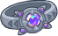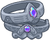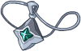
        
        
            Accessories
        
    
    
        
            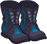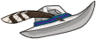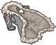
        
        
            Clothing
        
    
    
        
            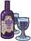
        
        
            Drinks
        
    
    
        
            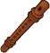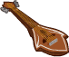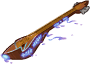
        
        
            Instruments
        
    
    
        
            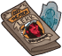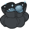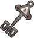
        
        
            Other Rewards
        
    
    
        
            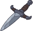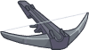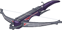
        
        
            Weapons
        
    

# Feats

Unknown.

# Legendaries

Unknown.

# Adventures and Variants

 **Unlock Adventure: The Simril Spoilsport (Lark)** (Complete Area 50)
> Simril is ruined! Someone has pilfered the food supplies!

 **Variant 1: No Autographs** (Complete Area 75)
> Lark starts in the formation with his Devil May Care ability unlocked. He can be moved, but not removed.  
> Only Lark and Champions buffed by both him and Uggie can deal damage.  
> 1-2 Unruly fans spawn with each wave. They don't drop gold nor count towards quest progress.   
> <b>Getting to Know Lark and Uggie:</b> Lark increases the damage of Champions in the middle columns, while Uggie increases the damage of Champions not next to her. Position your damage dealers to take advantage of both buffs!

 **Variant 2: Fortune's Fool** (Complete Area 125)
> Lark starts in the formation. He can be moved, but not removed.  
> Starting in area 51, enemies that don't have an active debuff reduce all normal attack damage to just 1 point of damage.  
> <b>Getting to Know Lark:</b> When Lark attacks an enemy and does not defeat it, he applies a debuff making it more susceptible to damage in the future. Use him and other debuff Champions to get through these resistant foes!

 **Variant 3: All Together Now** (Complete Area 175)
> Lark starts in the formation. He can be moved, but not removed.  
> You may only use Champions who are Fallbacks, Tieflings, Evil, multi-classed, or have a Charisma of 13 or lower.  
> Two backup musicians join the formation. They just get in the way.  
> Getting to Know Lark: Lark's specialization choice determines which sort of Champions he works best with. Build a formation that makes the most of his buffs!

# Other Champion Images

    
        
            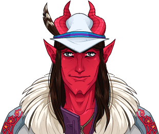Console Portrait
        
    
    
        
            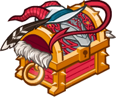Gold Chest Icon
        
        
            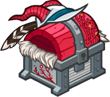Silver Chest Icon
        
    

[Back to Top](#top)

*Last Modified: {{ site.time }}*