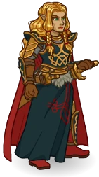
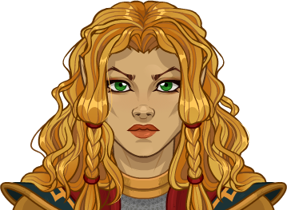
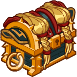
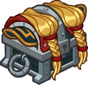

[Back to Main](index.md)

    
        
            
        
        
            Portrait
        
    
    
        
            
        
        
            Model
        
    

# Laurana

Lauralanthalasa Kanan, commonly known as Laurana, was a princess of the Qualinesti Elves and a Hero of the Lance. She was a brave fighter, a brilliant tactician, and an inspirational leader who became the Golden General of the Whitestone Army during the War of the Lance, leading them to victory.

[Dragonlace Fandom Wiki](https://dragonlance.fandom.com/wiki/Laurana_Kanan/){:target="_blank"}

# Basic Information

Laurana will be a new champion in the The Great Modron March event on 6 May 2026.

    
        
            **Seat**:
        
        
            Unknown
        
    
    
        
            **Species**:
        
        
            Elf (Guess)
        
    
    
        
            **Class**:
        
        
            Fighter (Guess)
        
    
    
        
            **Roles**:
        
        
            Unknown
        
    
    
        
            **Age**:
        
        
            Unknown
        
    
    
        
            **Gender**:
        
        
            Female (Guess)
        
    
    
        
            **Alignment**:
        
        
            Unknown
        
    
    
        
            **Affiliation**:
        
        
            Heroes of the Lance (Guess)
        
    

# Formation

Unknown.


    



# Attacks

Unknown.

# Abilities

Unknown.

# Specialisations

Unknown.

# Items

Unknown.

# Feats

Unknown.

# Legendaries

Unknown.

# Adventures and Variants

Unknown.

# Other Champion Images

    
        
            Console Portrait
        
    
    
        
            Gold Chest Icon
        
        
            Silver Chest Icon
        
    

[Back to Top](#top)

*Last Modified: {{ site.time }}*