[Back to Main](index.md)

    
        
            
        
        
            Portrait
        
    
    
        
            
        
        
            Base Model
        
    
    
        
            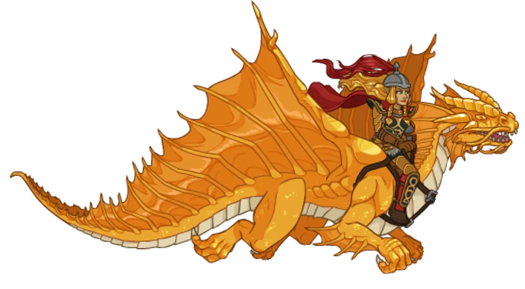
        
        
            Quallathon Model
        
    

# Laurana

Lauralanthalasa Kanan, commonly known as Laurana, was a princess of the Qualinesti Elves and a Hero of the Lance. She was a brave fighter, a brilliant tactician, and an inspirational leader who became the Golden General of the Whitestone Army during the War of the Lance, leading them to victory.

[Dragonlace Fandom Wiki](https://dragonlance.fandom.com/wiki/Laurana_Kanan/){:target="_blank"}

# Basic Information

Laurana will be a new champion in the The Great Modron March event on 6 May 2026.

    
        
            **Seat**:
        
        
            Unknown
        
    
    
        
            **Species**:
        
        
            Elf (Guess)
        
    
    
        
            **Class**:
        
        
            Fighter (Guess)
        
    
    
        
            **Roles**:
        
        
            Unknown
        
    
    
        
            **Age**:
        
        
            Unknown
        
    
    
        
            **Gender**:
        
        
            Female (Guess)
        
    
    
        
            **Alignment**:
        
        
            Unknown
        
    
    
        
            **Affiliation**:
        
        
            Heroes of the Lance (Guess)
        
    

# Formation

Unknown.


    



# Attacks

Unknown.

# Abilities

**Inner Strength** (Guess)
> Unknown effect.

<em>Raw Data</em>

<pre>
{
    "id": 28958,
    "graphic": "Icons/Events/2018 GreatModronMarch/GreatModronMarch_Y9/Icon_Formation_Lauarana_InnerStrength",
    "v": 2,
    "fs": 0,
    "p": 0,
    "type": 1,
    "export_params": {
        "uses": [
            "icon"
        ],
        "quantize": true
    }
}
</pre>

**Golden General** (Guess)
> Unknown effect.

<em>Raw Data</em>

<pre>
{
    "id": 28959,
    "graphic": "Icons/Events/2018 GreatModronMarch/GreatModronMarch_Y9/Icon_Formation_Laurana_GoldenGeneral",
    "v": 2,
    "fs": 0,
    "p": 0,
    "type": 1,
    "export_params": {
        "uses": [
            "icon"
        ],
        "quantize": true
    }
}
</pre>

**Leader of the Whitestone Armies** (Guess)
> Unknown effect.

<em>Raw Data</em>

<pre>
{
    "id": 28960,
    "graphic": "Icons/Events/2018 GreatModronMarch/GreatModronMarch_Y9/Icon_Formation_Laurana_LeaderoftheWhitestoneArmies",
    "v": 2,
    "fs": 0,
    "p": 0,
    "type": 1,
    "export_params": {
        "uses": [
            "icon"
        ],
        "quantize": true
    }
}
</pre>

**Strategic Reserves** (Guess)
> Unknown effect.

<em>Raw Data</em>

<pre>
{
    "id": 28961,
    "graphic": "Icons/Events/2018 GreatModronMarch/GreatModronMarch_Y9/Icon_Formation_Laurana_StrategicReserves",
    "v": 2,
    "fs": 0,
    "p": 0,
    "type": 1,
    "export_params": {
        "uses": [
            "icon"
        ],
        "quantize": true
    }
}
</pre>

# Specialisations

**Battle Plan: Charge** (Guess)
> Unknown effect.

<em>Raw Data</em>

<pre>
{
    "id": 28962,
    "graphic": "Icons/Events/2018 GreatModronMarch/GreatModronMarch_Y9/Icon_Specialization_Laurana_BattlePlanCharge",
    "v": 2,
    "fs": 0,
    "p": 0,
    "type": 1,
    "export_params": {
        "uses": [
            "icon"
        ],
        "quantize": true
    }
}
</pre>

**Battle Plan: Fortify** (Guess)
> Unknown effect.

<em>Raw Data</em>

<pre>
{
    "id": 28963,
    "graphic": "Icons/Events/2018 GreatModronMarch/GreatModronMarch_Y9/Icon_Specialization_Laurana_BattlePlanFortify",
    "v": 2,
    "fs": 0,
    "p": 0,
    "type": 1,
    "export_params": {
        "uses": [
            "icon"
        ],
        "quantize": true
    }
}
</pre>

**Battle Plan: Outflank** (Guess)
> Unknown effect.

<em>Raw Data</em>

<pre>
{
    "id": 28964,
    "graphic": "Icons/Events/2018 GreatModronMarch/GreatModronMarch_Y9/Icon_Specialization_Laurana_BattlePlanOutflank",
    "v": 2,
    "fs": 0,
    "p": 0,
    "type": 1,
    "export_params": {
        "uses": [
            "icon"
        ],
        "quantize": true
    }
}
</pre>

**Lead the Attack** (Guess)
> Unknown effect.

<em>Raw Data</em>

<pre>
{
    "id": 28965,
    "graphic": "Icons/Events/2018 GreatModronMarch/GreatModronMarch_Y9/Icon_Specialization_Laurana_LeadtheAttack",
    "v": 2,
    "fs": 0,
    "p": 0,
    "type": 1,
    "export_params": {
        "uses": [
            "icon"
        ],
        "quantize": true
    }
}
</pre>

**Protect the Vulnerable** (Guess)
> Unknown effect.

<em>Raw Data</em>

<pre>
{
    "id": 28966,
    "graphic": "Icons/Events/2018 GreatModronMarch/GreatModronMarch_Y9/Icon_Specialization_Laurana_ProtecttheVulnerable",
    "v": 2,
    "fs": 0,
    "p": 0,
    "type": 1,
    "export_params": {
        "uses": [
            "icon"
        ],
        "quantize": true
    }
}
</pre>

**Wield the Dragonlance** (Guess)
> Unknown effect.

<em>Raw Data</em>

<pre>
{
    "id": 28967,
    "graphic": "Icons/Events/2018 GreatModronMarch/GreatModronMarch_Y9/Icon_Specialization_Laurana_WieldtheDragonlance",
    "v": 2,
    "fs": 0,
    "p": 0,
    "type": 1,
    "export_params": {
        "uses": [
            "icon"
        ],
        "quantize": true
    }
}
</pre>

# Items

    
        
            **Icons**
        
        
            **Name**
        
    
    
        
            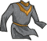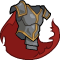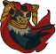
        
        
            Armors
        
    
    
        
            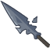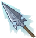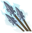
        
        
            Dragonlance
        
    
    
        
            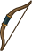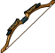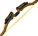
        
        
            Longbows
        
    
    
        
            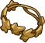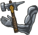
        
        
            More Item
        
    
    
        
            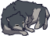
        
        
            Story Item
        
    
    
        
            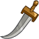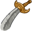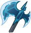
        
        
            Weapons
        
    

# Feats

Unknown.

# Legendaries

Unknown.

# Adventures and Variants

Unknown.

# Other Champion Images

    
        
            Console Portrait
        
    
    
        
            Gold Chest Icon
        
        
            Silver Chest Icon
        
    

[Back to Top](#top)

*Last Modified: {{ site.time }}*