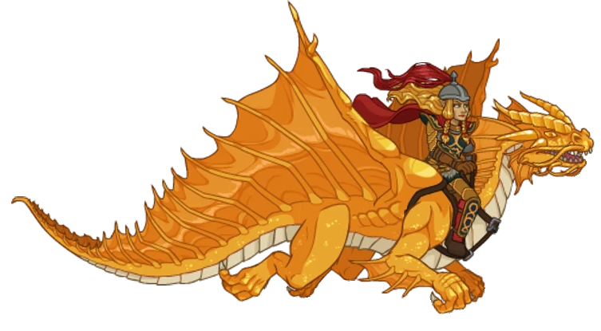
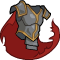
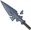
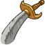

[Back to Main](index.md)

    
        
            
        
        
            Portrait
        
    
    
        
            
        
        
            Base Model
        
    
    
        
            
        
        
            Quallathon Model
        
    

# Laurana

Lauralanthalasa Kanan, commonly known as Laurana, was a princess of the Qualinesti Elves and a Hero of the Lance. She was a brave fighter, a brilliant tactician, and an inspirational leader who became the Golden General of the Whitestone Army during the War of the Lance, leading them to victory.

[Dragonlace Fandom Wiki](https://dragonlance.fandom.com/wiki/Laurana_Kanan){:target="_blank"}

# Basic Information

Laurana will be a new champion in the The Great Modron March event on 6 May 2026.

    
        
            **Seat**:
        
        
            Unknown
        
    
    
        
            **Species**:
        
        
            Elf (Guess)
        
    
    
        
            **Class**:
        
        
            Fighter (Guess)
        
    
    
        
            **Roles**:
        
        
            Tanking / Support / Hunter (Guess)
        
    
    
        
            **Age**:
        
        
            Unknown
        
    
    
        
            **Gender**:
        
        
            Female (Guess)
        
    
    
        
            **Alignment**:
        
        
            Unknown
        
    
    
        
            **Affiliation**:
        
        
            Heroes of the Lance (Guess)
        
    

# Formation

    <svg xmlns="http://www.w3.org/2000/svg" id="Laurana" fill="#aaa" data-formationName="Laurana" data-campaignName="The Great Modron March" width="349" height="140"><circle cx="135" cy="45" r="15"/><circle cx="135" cy="85" r="15"/><circle cx="95" cy="25" r="15"/><circle cx="95" cy="65" r="15"/><circle cx="95" cy="105" r="15"/><circle cx="55" cy="85" r="15"/><circle cx="55" cy="125" r="15"/><circle cx="15" cy="25" r="15"/><circle cx="15" cy="65" r="15"/><circle cx="15" cy="105" r="15"/><text x="165" y="25" fill="#dcdcdc" font-size="25" font-family="Arial" font-weight="bold">Laurana</text><text x="165" y="65" fill="#dcdcdc" font-size="15" font-family="Arial" font-weight="bold">The Great Modron March</text></svg>

# Attacks

**Base Attack: Sword Strike** (Melee)
> Laurana nimbly attacks the closest enemy with her shortsword for one hit.  
> Cooldown: 5s (Cap 1.25s)

<em>Raw Data</em>

<pre>
{
    "id": 962,
    "name": "Sword Strike",
    "description": "Laurana attacks the closest enemy for one hit.",
    "long_description": "Laurana nimbly attacks the closest enemy with her shortsword for one hit.",
    "graphic_id": 0,
    "target": "front",
    "num_targets": 1,
    "aoe_radius": 0,
    "damage_modifier": 1,
    "cooldown": 5,
    "animations": [
        {
            "type": "melee_attack",
            "target_offset_x": -34,
            "damage_frame": 7,
            "jump_sound": 30,
            "sound_frames": {
                "7": 154
            }
        }
    ],
    "tags": [
        "melee"
    ],
    "damage_types": [
        "melee"
    ]
}
</pre>

**Ultimate Attack: Dragon Strafe** (Guess)
> Laurana and Quallathon deal one ultimate hit to all enemies, which additionally encourages her allies for a short while.  
> Cooldown: 300s (Cap 75s)

<em>Raw Data</em>

<pre>
{
    "id": 963,
    "name": "Dragon Strafe",
    "description": "Laurana and Quallathon deal one ultimate hit to all enemies, and encourage her allies.",
    "long_description": "Laurana and Quallathon deal one ultimate hit to all enemies, which additionally encourages her allies for a short while.",
    "graphic_id": 28968,
    "target": "all",
    "num_targets": 1,
    "aoe_radius": 0,
    "damage_modifier": 0.03,
    "cooldown": 300,
    "animations": [
        {
            "type": "laurana_ultimate",
            "dragon_sequences": {
                "fly": 0,
                "breathefire": 1
            },
            "projectile_data": {
                "type": "ranged_attack",
                "projectile": "fire_breath_simple",
                "single_projectile": false,
                "does_no_damage": true,
                "shoot_offset_x": 166,
                "shoot_offset_y": -98,
                "auto_projectile_angle": false,
                "projectile_angle": -135,
                "hold_time": 2,
                "particle_duration": 0.7,
                "projectile_strength": 1200
            }
        }
    ],
    "tags": [
        "magic",
        "ultimate"
    ],
    "damage_types": [
        "magic"
    ]
}
</pre>

# Abilities

**Unknown** (Guess)
> Laurana has 20 achievements. She gains one Campaign stack for each of her achievements that you have completed.

<em>Raw Data</em>

<pre>
{
    "id": 2684,
    "flavour_text": "",
    "description": {
        "desc": "Laurana has 20 achievements. She gains one Campaign stack for each of her achievements that you have completed.",
        "post": {
            "conditions": [
                {
                    "condition": "laurana_has_bonus_from_adventure",
                    "desc": "^^Laurana has two extra stacks from the current adventure restrictions."
                },
                {
                    "condition": "not static_desc",
                    "desc": "^^Areas completed with Laurana this adventure: $(laurana_achievement_areas)."
                }
            ]
        }
    },
    "effect_keys": [
        {
            "effect_string": "laurana_achievement_handler",
            "off_when_benched": true,
            "stacks_on_trigger": "will_stack_manually",
            "amount_updated_listeners": [
                "slot_changed",
                "collection_and_guide_quest_changed"
            ],
            "stack_title": "Campaign Stacks",
            "show_stacks": true,
            "achievement_ids": [
                942,
                943,
                944,
                945,
                946,
                947,
                948,
                949,
                950,
                951,
                952,
                953,
                954,
                955,
                956,
                957,
                958,
                959,
                960,
                961
            ],
            "bonus_achievement_ids": [
                947,
                948,
                949,
                950,
                951,
                952,
                953,
                954,
                955,
                956,
                957,
                958,
                959,
                960,
                961
            ],
            "bonus_adventure_ids": [
                1965
            ]
        },
        {
            "effect_string": "expression_on_trigger,any_champion_crit",
            "per_trigger_expr": "AppendToSaveStat(`laurana_decisive_blows`, false, trigger_count))",
            "off_when_benched": true
        }
    ],
    "requirements": "",
    "graphic_id": 0,
    "large_graphic_id": 0,
    "properties": {
        "is_formation_ability": true,
        "owner_use_outgoing_description": true,
        "formation_circle_icon": true
    }
}
</pre>

**Golden General** (Guess)
> The effect of Laurana's chosen Battle Plan specialization choice is increased by 100% for each Campaign stack she has, stacking multiplicatively.

ⓘ *Note: This ability is prestack.*

<em>Raw Data</em>

<pre>
{
    "id": 2685,
    "flavour_text": "",
    "description": {
        "desc": "The effect of Laurana's chosen Battle Plan specialization choice is increased by $amount% for each Campaign stack she has, stacking multiplicatively."
    },
    "effect_keys": [
        {
            "effect_string": "pre_stack_amount,100",
            "skip_effect_key_desc": true
        },
        {
            "effect_string": "buff_upgrades,0,19356,19355,19354",
            "stack_func": "per_hero_attribute",
            "post_process_expr": "as_int(GetUpgradeStacks(19348, 0))",
            "amount_func": "mult",
            "amount_expr": "upgrade_amount(19350,0)",
            "stack_title": "Campaign Stacks",
            "off_when_benched": true,
            "show_bonus": true
        }
    ],
    "requirements": "",
    "graphic_id": 28959,
    "large_graphic_id": 28955,
    "properties": {
        "is_formation_ability": true,
        "owner_use_outgoing_description": true,
        "formation_circle_icon": true,
        "indexed_effect_properties": true,
        "per_effect_index_bonuses": true,
        "default_bonus_index": 0
    }
}
</pre>

**Leader of the Whitestone Armies** (Guess)
> Laurana's Soldiers are Heroes of the Lance Champions. Laurana gains Army stacks equal to the number of Soldiers in the formation, or the number of Campaign stacks she has divided by 2, whichever is lower. Laurana increases the effect of her chosen Battle Plan specialization choice by 100% for each Army stack that she has, stacking multiplicatively. A specialization choice and certain feats can add more Champions who are her Soldiers.

ⓘ *Note: This ability is prestack.*

<em>Raw Data</em>

<pre>
{
    "id": 2686,
    "flavour_text": "",
    "description": {
        "desc": "Laurana's Soldiers are Heroes of the Lance Champions. Laurana gains Army stacks equal to the number of Soldiers in the formation, or the number of Campaign stacks she has divided by 2, whichever is lower. Laurana increases the effect of her chosen Battle Plan specialization choice by $amount% for each Army stack that she has, stacking multiplicatively. A specialization choice and certain feats can add more Champions who are her Soldiers."
    },
    "effect_keys": [
        {
            "effect_string": "pre_stack_amount,100",
            "skip_effect_key_desc": true
        },
        {
            "effect_string": "buff_upgrades,0,19356,19355,19354",
            "amount_func": "mult",
            "amount_expr": "upgrade_amount(19351,0)",
            "stack_func": "per_hero_attribute",
            "per_hero_expr": "HasTag(`heroeslance`) || (GetUpgradeUnlocked(19357) && HasTag(`dps`)) || (GetUpgradeUnlocked(19358) && GetStat(`con`) <= 12) || (GetUpgradeUnlocked(19359) && HasTag(`hunter`)) || (GetFeatEquipped(2578) && (HasTag(`elf`) || HasTag(`halfelf`))) || (GetFeatEquipped(2579) && GetStat(`total_ability_score`) >= 85) || (GetFeatEquipped(2580) && HasAttackDamageType(`melee`))",
            "post_process_expr": "min(as_int((GetUpgradeStacks(19348, 0) + 1)/2), input)",
            "amount_updated_listeners": [
                "slot_changed",
                "hero_tags_changed",
                "collection_and_guide_quest_changed"
            ],
            "stack_title": "Army Stacks",
            "show_bonus": true,
            "use_computed_amount_for_description": true,
            "off_when_benched": true
        }
    ],
    "requirements": "",
    "graphic_id": 28960,
    "large_graphic_id": 28956,
    "properties": {
        "is_formation_ability": true,
        "owner_use_outgoing_description": true,
        "formation_circle_icon": true,
        "indexed_effect_properties": true,
        "per_effect_index_bonuses": true,
        "default_bonus_index": 0
    }
}
</pre>

**Strategic Reserves** (Guess)
> Laurana increases the health of all other Champions in the formation by 10% of her max health, plus 2% for each Campaign stack, stacking additively.

<em>Raw Data</em>

<pre>
{
    "id": 2687,
    "flavour_text": "",
    "description": {
        "desc": "Laurana increases the health of all other Champions in the formation by 10% of her max health, plus 2% for each Campaign stack, stacking additively."
    },
    "effect_keys": [
        {
            "off_when_benched": true,
            "effect_string": "do_nothing,2",
            "stack_func": "per_hero_attribute",
            "post_process_expr": "as_int(GetUpgradeStacks(19348, 0))",
            "amount_func": "add",
            "show_bonus": true,
            "stack_title": "Campaign Stacks",
            "total_title": "Campaign Stack Bonus",
            "desc_forced_order": 2,
            "listen_for_computed_changes": true,
            "amount_updated_listeners": [
                "upgrade_unlocked",
                "slot_changed",
                "feat_changed",
                "effect_key_changed"
            ]
        },
        {
            "off_when_benched": true,
            "effect_string": "do_nothing,10",
            "skip_effect_key_desc": true
        },
        {
            "off_when_benched": true,
            "effect_string": "increase_health_by_source_percent,0",
            "amount_expr": "upgrade_amount(19352,1)+max_upgrade_amount(19352,0)",
            "percent_values": false,
            "round_bonus_value": true,
            "show_current_value_bonus_desc": false,
            "use_computed_amount_for_description": true,
            "override_key_desc": "Increases the Health of $target by $amount",
            "targets": [
                "other"
            ],
            "desc_forced_order": 3
        }
    ],
    "requirements": "",
    "graphic_id": 28961,
    "large_graphic_id": 28957,
    "properties": {
        "is_formation_ability": true,
        "owner_use_outgoing_description": true,
        "formation_circle_icon": true
    }
}
</pre>

**Inner Strength** (Guess)
> Laurana counts the number of enemies that have spawned in the current area, with bosses counting as the same as three times the number of Campaign stacks she has. Laurana increases the effect of her Battle Plan specialization choice by 20% for each one of these enemies, stacking multiplicatively and capped at 70.

<em>Raw Data</em>

<pre>
{
    "id": 2688,
    "flavour_text": "",
    "description": {
        "desc": "Laurana counts the number of enemies that have spawned in the current area, with bosses counting as the same as three times the number of Campaign stacks she has. Laurana increases the effect of her Battle Plan specialization choice by $(not_buffed amount)% for each one of these enemies, stacking multiplicatively and capped at 70."
    },
    "effect_keys": [
        {
            "effect_string": "buff_upgrades,20,19356,19355,19354",
            "off_when_benched": true,
            "stacks_on_trigger": "will_stack_manually",
            "more_triggers": [
                {
                    "trigger": "area_changed",
                    "action": {
                        "type": "reset"
                    }
                }
            ],
            "stacks_multiply": true,
            "max_stacks": 70,
            "show_bonus": true
        },
        {
            "effect_string": "do_nothing,0",
            "off_when_benched": true,
            "stack_func": "per_hero_attribute",
            "post_process_expr": "as_int(GetUpgradeStacks(19348, 0))",
            "stacks_multiply": true,
            "show_bonus": false
        },
        {
            "effect_string": "laurana_inner_strength_handler",
            "off_when_benched": true,
            "bonus_stack_index": 0,
            "campaign_stack_index": 1
        }
    ],
    "requirements": "",
    "graphic_id": 28958,
    "large_graphic_id": 28954,
    "properties": {
        "is_formation_ability": true,
        "owner_use_outgoing_description": true,
        "formation_circle_icon": true,
        "indexed_effect_properties": true,
        "per_effect_index_bonuses": true,
        "default_bonus_index": 0
    }
}
</pre>

# Specialisations

**Battle Plan: Charge** (Guess)
> Laurana increases the damage of Champions in the column behind her by 100%.

<em>Raw Data</em>

<pre>
{
    "id": 2689,
    "flavour_text": "",
    "description": {
        "desc": "Laurana increases the damage of Champions in the column behind her by $amount%."
    },
    "effect_keys": [
        {
            "off_when_benched": true,
            "effect_string": "hero_dps_multiplier_mult,100",
            "targets": [
                {
                    "type": "exactly_x_behind",
                    "num_columns": 1
                }
            ]
        }
    ],
    "requirements": "",
    "graphic_id": 28962,
    "large_graphic_id": 28962,
    "properties": {
        "is_formation_ability": true,
        "owner_use_outgoing_description": true,
        "formation_circle_icon": true
    }
}
</pre>

**Battle Plan: Outflank** (Guess)
> Laurana increases the damage of Champions in the column that is two columns behind her by 100%.

<em>Raw Data</em>

<pre>
{
    "id": 2690,
    "flavour_text": "",
    "description": {
        "desc": "Laurana increases the damage of Champions in the column that is two columns behind her by $amount%."
    },
    "effect_keys": [
        {
            "off_when_benched": true,
            "effect_string": "hero_dps_multiplier_mult,100",
            "targets": [
                {
                    "type": "exactly_x_behind",
                    "num_columns": 2
                }
            ]
        }
    ],
    "requirements": "",
    "graphic_id": 28964,
    "large_graphic_id": 28964,
    "properties": {
        "is_formation_ability": true,
        "owner_use_outgoing_description": true,
        "formation_circle_icon": true
    }
}
</pre>

**Battle Plan: Fortify** (Guess)
> Laurana increases the damage of Champions in the column that is three columns behind her by 100%.

<em>Raw Data</em>

<pre>
{
    "id": 2691,
    "flavour_text": "",
    "description": {
        "desc": "Laurana increases the damage of Champions in the column that is three columns behind her by $amount%."
    },
    "effect_keys": [
        {
            "off_when_benched": true,
            "effect_string": "hero_dps_multiplier_mult,100",
            "targets": [
                {
                    "type": "exactly_x_behind",
                    "num_columns": 3
                }
            ]
        }
    ],
    "requirements": "",
    "graphic_id": 28963,
    "large_graphic_id": 28963,
    "properties": {
        "is_formation_ability": true,
        "owner_use_outgoing_description": true,
        "formation_circle_icon": true
    }
}
</pre>

**Lead the Attack** (Guess)
> Laurana additively increases the Critical Hit Chance of her Soldiers by 20%, and the Critical Hit Damage by 100%. Additionally, DPS Champions also count as Laurana's Soldiers.

<em>Raw Data</em>

<pre>
{
    "id": 2692,
    "flavour_text": "",
    "description": {
        "desc": "Laurana additively increases the Critical Hit Chance of her Soldiers by 20%, and the Critical Hit Damage by $amount%. Additionally, DPS Champions also count as Laurana's Soldiers."
    },
    "effect_keys": [
        {
            "effect_string": "global_buff_base_crit_damage_add,100",
            "off_when_benched": true
        },
        {
            "effect_string": "global_buff_base_crit_chance_add,20",
            "off_when_benched": true,
            "stack_func": "per_hero_attribute",
            "per_hero_expr": "HasTag(`dps`)",
            "show_stacks": false
        },
        {
            "effect_string": "do_nothing",
            "off_when_benched": true,
            "stack_func": "per_hero_attribute",
            "per_hero_expr": "HasTag(`dps`)",
            "show_stacks": false
        }
    ],
    "requirements": "",
    "graphic_id": 28965,
    "large_graphic_id": 28965,
    "properties": {
        "is_formation_ability": true,
        "owner_use_outgoing_description": true,
        "formation_circle_icon": true,
        "indexed_effect_properties": true,
        "per_effect_index_bonuses": true,
        "default_bonus_index": 0,
        "spec_option_post_apply_info": "DPS Champions: $num_stacks___3"
    }
}
</pre>

**Protect the Vulnerable** (Guess)
> Laurana increases her maximum health by 100%. Additionally, Champions with a Constitution of 12 or lower also count as Laurana's Soldiers.

<em>Raw Data</em>

<pre>
{
    "id": 2693,
    "flavour_text": "",
    "description": {
        "desc": "Laurana increases her maximum health by $amount%. Additionally, Champions with a Constitution of 12 or lower also count as Laurana's Soldiers."
    },
    "effect_keys": [
        {
            "effect_string": "health_mult,100",
            "off_when_benched": true
        },
        {
            "effect_string": "do_nothing",
            "off_when_benched": true,
            "stack_func": "per_hero_attribute",
            "per_hero_expr": "GetStat(`con`) <= 12",
            "show_stacks": false
        }
    ],
    "requirements": "",
    "graphic_id": 28966,
    "large_graphic_id": 28966,
    "properties": {
        "is_formation_ability": true,
        "owner_use_outgoing_description": true,
        "formation_circle_icon": true,
        "indexed_effect_properties": true,
        "per_effect_index_bonuses": true,
        "default_bonus_index": 0,
        "spec_option_post_apply_info": "Qualified Champions: $num_stacks___2"
    }
}
</pre>

**Wield the Dragonlance** (Guess)
> Laurana gains the Hunter role. Dragons and Monstrosities become her favored foes, allowing Champions to deal 400% more damage against them for each Hunter in the formation, stacking multiplicatively. Hunters also count as Laurana's Soldiers.

<em>Raw Data</em>

<pre>
{
    "id": 2694,
    "flavour_text": "",
    "description": {
        "desc": "Laurana gains the Hunter role. Dragons and Monstrosities become her favored foes, allowing Champions to deal $(not_buffed amount)% more damage against them for each Hunter in the formation, stacking multiplicatively. Hunters also count as Laurana's Soldiers. "
    },
    "effect_keys": [
        {
            "effect_string": "increase_damage_against_monster,400",
            "monster_is_favored_foe_of_effect_owner": true,
            "targets": [
                "all"
            ],
            "off_when_benched": true,
            "override_key_desc": "$target does $amount% more damage against Laurana's Favored Foes.",
            "amount_func": "mult",
            "stacks_multiply": true,
            "stack_func": "per_hero_attribute",
            "per_hero_expr": "HasTag(`hunter`)",
            "amount_updated_listeners": [
                "slot_changed",
                "hero_tags_changed"
            ],
            "show_bonus": true
        },
        {
            "off_when_benched": true,
            "effect_string": "favored_foe,dragon"
        },
        {
            "off_when_benched": true,
            "effect_string": "favored_foe,monstrosity"
        },
        {
            "effect_string": "add_hero_tags,0,hunter"
        },
        {
            "effect_string": "do_nothing",
            "off_when_benched": true,
            "stack_func": "per_hero_attribute",
            "per_hero_expr": "HasTag(`hunter`)",
            "show_stacks": false
        }
    ],
    "requirements": "",
    "graphic_id": 28967,
    "large_graphic_id": 28967,
    "properties": {
        "is_formation_ability": true,
        "owner_use_outgoing_description": true,
        "formation_circle_icon": true,
        "indexed_effect_properties": true,
        "per_effect_index_bonuses": true,
        "default_bonus_index": 0,
        "spec_option_post_apply_info": "Hunter Champions: $num_stacks___5"
    }
}
</pre>

# Items

    
        
            **Icons**
        
        
            **Name**
        
    
    
        
            
        
        
            Armors
        
    
    
        
            
        
        
            Dragonlance
        
    
    
        
            
        
        
            Longbows
        
    
    
        
            
        
        
            More Item
        
    
    
        
            
        
        
            Story Item
        
    
    
        
            
        
        
            Weapons
        
    

# Feats

Unknown.

# Legendaries

Unknown.

# Adventures and Variants

**Unlock Adventure: The Mechanical Menace (Laurana)** (Complete Area 50)
> Stop the Modron March from crushing Waterdeep under its mechanical heel.

**Variant 1: Arrival of the Golden General** (Complete Area 75)
> Laurana starts in the formation. She can be moved, but not removed.  
> After area 50, only Laurana and Champions targeted by her Battle Plan specialization choice can deal damage.  
> 1-2 Baaz or Kapak Draconians spawn with each wave. They don't drop gold nor count towards quest progress.  
> In each boss area, a Sivak Draconian boss spawns as part of the first wave. It must also be defeated to progress.  
> <b>Getting to Know Laurana:</b> Laurana's first specialization choice selects one column behind her for her primary buff. Put your main damage dealer in that column!

**Variant 2: Dragons of Winter Night** (Complete Area 125)
> Laurana starts in the formation. She can't be moved or removed.  
> Laurana gains 2 bonus Campaign stacks while on this adventure.  
> Fizban joins the formation. Champions in Fizban's column deal 1000% additional damage. This bonus counts as a positional formation ability.  
> 1-2 Chromatic Wyrmlings spawn with each wave. They don't drop gold, nor count towards quest progress.  
> All enemies move 100% faster and deal 100% more damage.  
> <b>Getting to Know Laurana:</b> Laurana has 15 bonus achievements, and her abilities improve as you complete these achievements. These achievements are listed in the Great Modron March section of the achievement dialog.

**Variant 3: Critical Soldiers** (Complete Area 175)
> Laurana starts in the formation. She can be moved, but not removed.  
> You may only use Heroes of the Lance Champions, DPS Champions, Hunter Champions, or Champions with a Constitution of 12 or lower.  
> After area 50, bosses spawn with a special shield which must be destroyed before their regular hit points appear. To destroy a special shield, an enemy must be hit with a critical hit. After area 500, this special shield takes 5 critical hits to destroy.  
> 1-2 Bozak Draconians spawn with each wave. They don't drop gold nor count towards quest progress.  
> In each boss area, an Aurak Draconian boss spawns as part of the first wave. It must also be defeated to progress.  
> <b>Getting to Know Laurana:</b> Laurana's Soldiers further increase the power of her buff. Use her second specialization choice to add more Champions to her list of potential Soldiers!

# Other Champion Images

    
        
            Console Portrait
        
    
    
        
            Gold Chest Icon
        
        
            Silver Chest Icon
        
    

[Back to Top](#top)

*Last Modified: {{ site.time }}*