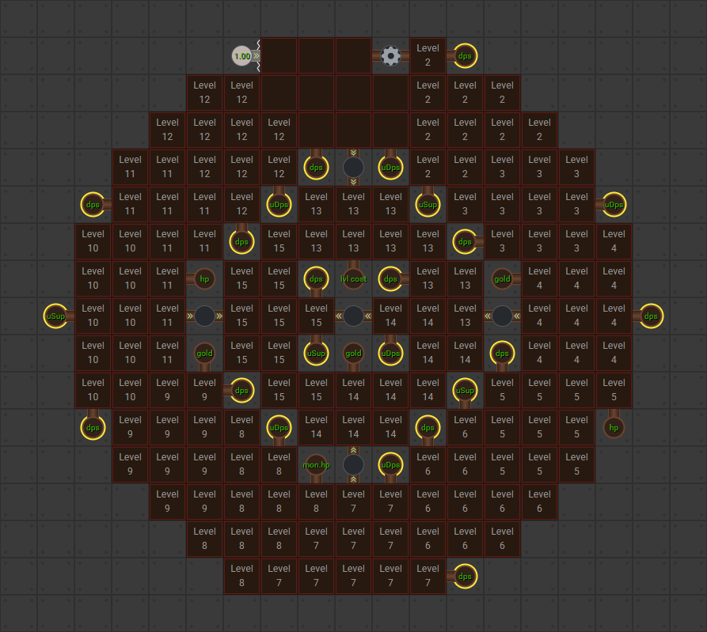
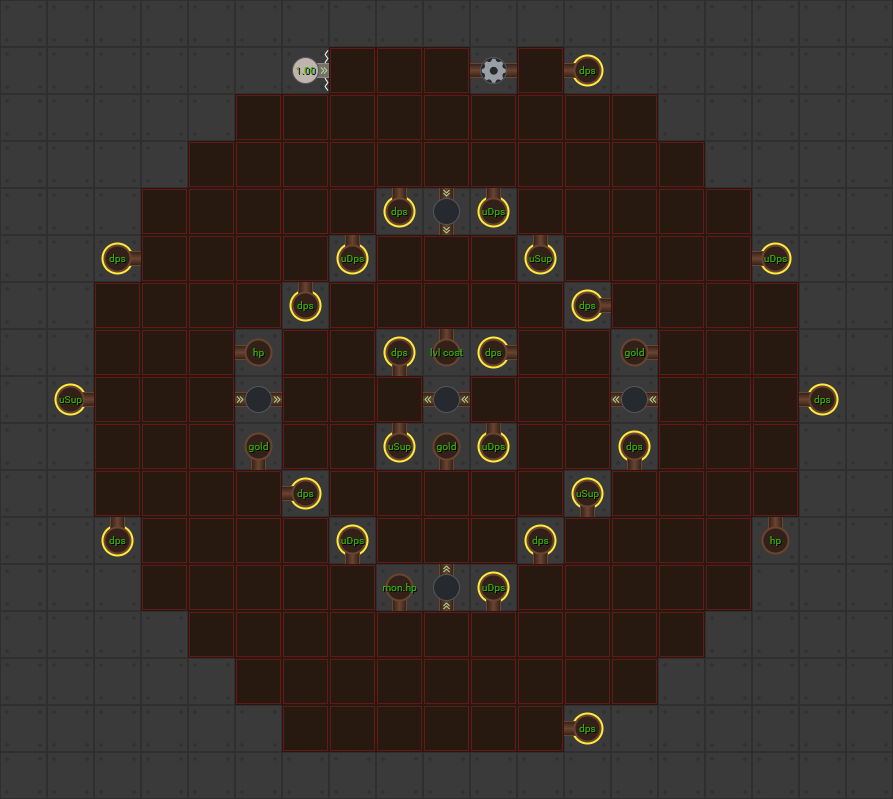

[Back to Main](index.md)

# Lawful Modron Core

We got the full core in the definitions now. It has exactly the same mechanics the Unaffiliated and Dexterous cores before it had. Some nodes buff exclusively Lawful DPS and some node buff based on the number of Lawful champions in the formation.

Unfortunately its layout leaves a lot to be desired and likely will not be able to reach the same numbers that Unaffiliated or Dexterous do.

## Icon

| Icon | Name |
|---|---|
|  | `Icons/Icon_ModronCore_Lawful` |

# Level 1

# Level 15

[Back to Top](#top)

*Last Modified: {{ site.time }}*