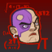

[Back to Main](index.md)

    
        
            
        
        
        Portrait
        
    

# Lazaapz

Born in The Cogs beneath Sharn's Lower City, Lazaapz's remarkable intellect elevated her to the Tradefair district, where her mechanical genius became highly sought after by the Dragonmarked Houses. Lazaapz's first invention was a functional mechanical arm to replace the one she was born without; now she leads an elite team of engineers in cutting edge research and development. Following the discovery of a mysterious Eldritch Machine, Lazaapz was brought in by House Cannith to ascertain the purpose of the device. Shortly after, both Lazaapz and the machine disappeared, never to be seen again.

# Changes

Lazaapz will be a reworked champion in the Ahghairon's Day event on 13 August 2025 (expected a week after event start due to Worst the Wait).

Only abilities that have seen some changes will be displayed here - and be aware that there's a lot of guesswork involved. Some abilities may not have names - some may have the *wrong* names - or specialisations might not be marked as such - etc.. Focus on the effect data itself.

Please do me a favour and don't get all melodramatic about what you find here. I - and CNE - don't appreciate it. These are spoilers and will almost certainly change before release - likely multiple times. That and we don't have access to any upgrade data prior to release. Making assumptions on how the champions will turn out based on this information would be premature.

# Abilities

**Fury of the Small** (Guess)
> Lazaapz's posse is Champions that are from smaller species: dwarves, fairies, gnomes, goblins, halflings, kobolds, and/or plasmoids. Lazaapz increases the damage of her posse by 100% for each posse member in the formation, stacking multiplicatively.

<em>Raw Data</em>

<pre>
{
    "id": 2394,
    "flavour_text": "",
    "description": {
        "desc": "Lazaapz's posse is Champions that are from smaller species: dwarves, fairies, gnomes, goblins, halflings, kobolds, and/or plasmoids. Lazaapz increases the damage of her posse by $amount% for each posse member in the formation, stacking multiplicatively."
    },
    "effect_keys": [
        {
            "effect_string": "pre_stack,100",
            "off_when_benched": true,
            "retarget_when_any_hero_slot_changed": true,
            "retarget_when_hero_tags_changed": true,
            "retarget_when_upgrade_purchased_ids": [
                17484,
                17485,
                17486
            ]
        },
        {
            "effect_string": "hero_dps_multiplier_mult,0",
            "off_when_benched": true,
            "amount_expr": "upgrade_amount(17479,0)",
            "targets": [
                "all"
            ],
            "filter_targets": [
                {
                    "type": "hero_expr",
                    "hero_expr": "HasTag(`dwarf`) || HasTag(`gnome`) || HasTag(`goblin`) || HasTag(`halfling`) || HasTag(`kobold`) || HasTag(`plasmoid`) || HasTag(`fairy`) || (GetUpgradeUnlocked(17484) && HasAttackDamageType(`melee`)) || (GetUpgradeUnlocked(17485) && HasTag(`evil`)) || (GetUpgradeUnlocked(17486) && HasTag(`control`))"
                }
            ],
            "formation_arrows_for_effected_only": true,
            "amount_func": "mult",
            "stack_func": "per_hero_attribute",
            "per_hero_expr": "HasTag(`dwarf`) || HasTag(`gnome`) || HasTag(`goblin`) || HasTag(`halfling`) || HasTag(`kobold`) || HasTag(`plasmoid`) || HasTag(`fairy`) || (GetUpgradeUnlocked(17484) && HasAttackDamageType(`melee`)) || (GetUpgradeUnlocked(17485) && HasTag(`evil`)) || (GetUpgradeUnlocked(17486) && HasTag(`control`))",
            "amount_updated_listeners": [
                "slot_changed",
                "hero_tags_changed",
                "upgrade_unlocked"
            ],
            "show_bonus": true,
            "use_computed_amount_for_description": true
        }
    ],
    "requirements": "",
    "graphic_id": 8654,
    "large_graphic_id": 8649,
    "properties": {
        "is_formation_ability": true,
        "owner_use_outgoing_description": true,
        "indexed_effect_properties": true,
        "per_effect_index_bonuses": true,
        "default_bonus_index": 1
    }
}
</pre>

**Power Armour** (Guess)
> 

<em>Raw Data</em>

<pre>
{
    "id": 2395,
    "flavour_text": "",
    "description": {
        "desc": ""
    },
    "effect_keys": [
        {
            "effect_string": "do_nothing",
            "off_when_benched": true
        }
    ],
    "requirements": "",
    "graphic_id": 8656,
    "large_graphic_id": 8650,
    "properties": {
        "is_formation_ability": true,
        "owner_use_outgoing_description": true,
        "formation_circle_icon": false
    }
}
</pre>

**Contigency Plan** (Guess)
> 

<em>Raw Data</em>

<pre>
{
    "id": 2396,
    "flavour_text": "",
    "description": {
        "desc": ""
    },
    "effect_keys": [
        {
            "effect_string": "do_nothing",
            "off_when_benched": true
        }
    ],
    "requirements": "",
    "graphic_id": 27011,
    "large_graphic_id": 27004,
    "properties": {
        "is_formation_ability": true,
        "owner_use_outgoing_description": true,
        "formation_circle_icon": false
    }
}
</pre>

**Artificier Infusion** (Guess)
> Lazaapz infuses the equipment of other Champions in the formation with her Artificer powers. Infused equipment has its item level increased by 125. The equipment slot that is affected is equal to each Champions' exact distance from Lazaapz, so for example adjacent Champions (1 slot away) have their slot 1 equipment infused, while Champions 2 slots away have their slot 2 equipment infused, and so on.

<em>Raw Data</em>

<pre>
{
    "id": 2397,
    "flavour_text": "",
    "description": {
        "desc": "Lazaapz infuses the equipment of other Champions in the formation with her Artificer powers. Infused equipment has its item level increased by $amount. The equipment slot that is affected is equal to each Champions' exact distance from Lazaapz, so for example adjacent Champions (1 slot away) have their slot 1 equipment infused, while Champions 2 slots away have their slot 2 equipment infused, and so on."
    },
    "effect_keys": [
        {
            "effect_string": "add_base_item_levels_to_slot,125",
            "off_when_benched": true,
            "targets": [
                "other"
            ],
            "slot_expr": "distance_from_source"
        }
    ],
    "requirements": "",
    "graphic_id": 27010,
    "large_graphic_id": 27003,
    "properties": {
        "is_formation_ability": true,
        "owner_use_outgoing_description": true
    }
}
</pre>

**Shield of Sharn** (Guess)
> Lazaapz increases the max health of all other Champions by 25% of her base max health and healing effects on all Champions are increased by 25%.

<em>Raw Data</em>

<pre>
{
    "id": 2398,
    "flavour_text": "",
    "description": {
        "desc": "Lazaapz increases the max health of all other Champions by $amount% of her base max health and healing effects on all Champions are increased by $amount___2%."
    },
    "effect_keys": [
        {
            "effect_string": "increase_health_by_source_percent,25",
            "off_when_benched": true,
            "targets": [
                "other"
            ]
        },
        {
            "effect_string": "healing_add_mult,25",
            "off_when_benched": true,
            "targets": [
                "all"
            ]
        }
    ],
    "requirements": "",
    "graphic_id": 8657,
    "large_graphic_id": 8653,
    "properties": {
        "is_formation_ability": true,
        "owner_use_outgoing_description": true,
        "indexed_effect_properties": true
    }
}
</pre>

# Specialisations

**Specialisation: Fury of the Brawl** (Guess)
> Lazaapz's posse now also includes Champions with a melee base attack and is buffed by 100% (post-stack).

<em>Raw Data</em>

<pre>
{
    "id": 2399,
    "flavour_text": "",
    "description": {
        "desc": "Lazaapz's posse now also includes Champions with a melee base attack and is buffed by $amount% (post-stack)."
    },
    "effect_keys": [
        {
            "effect_string": "buff_upgrade,100,17479",
            "off_when_benched": true
        }
    ],
    "requirements": "",
    "graphic_id": 0,
    "large_graphic_id": 27018,
    "properties": {
        "is_formation_ability": true,
        "owner_use_outgoing_description": true,
        "formation_circle_icon": false
    }
}
</pre>

**Specialisation: Fury of the Cabal** (Guess)
> Lazaapz's posse now also includes Evil Champions and is buffed by 150% (post-stack).

<em>Raw Data</em>

<pre>
{
    "id": 2400,
    "flavour_text": "",
    "description": {
        "desc": "Lazaapz's posse now also includes Evil Champions and is buffed by $amount% (post-stack)."
    },
    "effect_keys": [
        {
            "effect_string": "buff_upgrade,150,17479",
            "off_when_benched": true
        }
    ],
    "requirements": "",
    "graphic_id": 0,
    "large_graphic_id": 27019,
    "properties": {
        "is_formation_ability": true,
        "owner_use_outgoing_description": true,
        "formation_circle_icon": false
    }
}
</pre>

**Specialisation: Fury of the Stall** (Guess)
> Lazaapz's posse now also includes Champions with the Control role and is buffed by 150% (post-stack).

<em>Raw Data</em>

<pre>
{
    "id": 2401,
    "flavour_text": "",
    "description": {
        "desc": "Lazaapz's posse now also includes Champions with the Control role and is buffed by $amount% (post-stack)."
    },
    "effect_keys": [
        {
            "effect_string": "buff_upgrade,150,17479",
            "off_when_benched": true
        }
    ],
    "requirements": "",
    "graphic_id": 0,
    "large_graphic_id": 27020,
    "properties": {
        "is_formation_ability": true,
        "owner_use_outgoing_description": true,
        "formation_circle_icon": false
    }
}
</pre>

**Specialisation: Guardian** (Guess)
> 

<em>Raw Data</em>

<pre>
{
    "id": 2402,
    "flavour_text": "",
    "description": {
        "desc": ""
    },
    "effect_keys": [
        {
            "effect_string": "do_nothing",
            "off_when_benched": true
        }
    ],
    "requirements": "",
    "graphic_id": 0,
    "large_graphic_id": 27021,
    "properties": {
        "is_formation_ability": true,
        "owner_use_outgoing_description": true,
        "formation_circle_icon": false
    }
}
</pre>

**Specialisation: Infiltrator** (Guess)
> 

<em>Raw Data</em>

<pre>
{
    "id": 2403,
    "flavour_text": "",
    "description": {
        "desc": ""
    },
    "effect_keys": [
        {
            "effect_string": "do_nothing",
            "off_when_benched": true
        }
    ],
    "requirements": "",
    "graphic_id": 0,
    "large_graphic_id": 27022,
    "properties": {
        "is_formation_ability": true,
        "owner_use_outgoing_description": true,
        "formation_circle_icon": false
    }
}
</pre>

# Adventures and Variants

**Unlock Adventure: Brightly into Darkness (Lazaapz)** (Complete Area 50)
> Help the Harpells track down a lost artifact.

 **Variant 1: Lolth's Army** (Complete Area 75)
> Additional Drow Fighters spawn in each wave. Whenever you kill any drow enemy, Lolth grows angry and tracks your transgressions. For every drow killed during this adventure, the damage and movement speed of every other drow enemy goes up by 0.1% (additively)

 **Variant 2: I Got This...?** (Complete Area 125)
> Only Champions with INT 14 or lower, plus Lazaapz, can be used.

 **Variant 3: Short Force Leader** (Complete Area 175)
> A roving band of Ogres have joined the enemies waves during this adventure! Let's show 'em what Lazaapz and her crew can do! Lazaapz starts in the formation. She cannot be moved, removed, or swapped. All Champions in the two columns behind Lazaapz count as a small Champion for the purposes of Lazaapz' Fury of the Small. All enemies have their damage and movement speed increased by 100% for each Ogre Battering Ram on screen (additive).

# Formation

    <svg xmlns="http://www.w3.org/2000/svg" id="Lazaapz" fill="#aaa" data-formationName="Lazaapz" data-campaignName="Feast of the Moon" width="378" height="160"><circle cx="215" cy="85" r="15"/><circle cx="175" cy="65" r="15"/><circle cx="175" cy="105" r="15"/><circle cx="135" cy="45" r="15"/><circle cx="135" cy="85" r="15"/><circle cx="135" cy="125" r="15"/><circle cx="95" cy="25" r="15"/><circle cx="95" cy="145" r="15"/><circle cx="55" cy="45" r="15"/><circle cx="15" cy="65" r="15"/><text x="245" y="25" fill="#dcdcdc" font-size="25" font-family="Arial" font-weight="bold">Lazaapz</text><text x="245" y="65" fill="#dcdcdc" font-size="15" font-family="Arial" font-weight="bold">Feast of the Moon</text></svg>

[Back to Top](#top)

*Last Modified: {{ site.time }}*