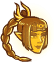

[Back to Main](index.md)

# Legendary Feats

On 22 July 2026 CNE will be adding some Mastery Variants. These mastery variants will award Mastery Medallions. With these medallions you will be able to buy Legendary Feats. We also know that these feats will be able to be levelled up via Scales of Tiamat.

So far we know of 6 legendary feats. See the icons at the bottom of the page for a list.

# Roadmap Information

ⓘ *Note: The roadmap information is taken directly from the [roadmap twitch stream](https://www.twitch.tv/videos/2788712278?t=0h46m53s){:target="_blank"}.*

> Mastery Variants reward Mastery Medallions, which can be used to purchase Legendary Feats.
> 
> Legendary Feats generally have a main effect that stacks up (based on how you've built your formation) and a secondary effect that requires a certain number of stacks of the main effect to activate.
> 
> Legendary Feats can be leveled up, which increases the pre-stack value of their main effect and usually decreases the required number of stacks for the secondary effect to activate.
> 
> Not all Legendary Feats will be able to be collected in the first month, so you'll need to choose wisely!
> 
> ### **Apex Predator** - Legendary Feat for Drizzt Do'Urden
> 
> Whenever Drizzt scores a Critical Hit, he gains an Instinct stack that expires after 15 seconds. His damage is increased by 1000% for each Instinct stack he has, stacking multiplicatively.
> 
> If he scores another Critical Hit before his stacks expire, the timers for all his stacks restart. The ability caps at 4 stacks. If there are at least 20 Mithral Hall stacks in the formation, Drizzt's base Critical Hit chance is increased by an additional 20%.
> 
> Level Up boost:
> * x2 damage buff per level
> * -1 Mithral Hall req per feat level
> * +2 stack cap per feat level
> * Caps at level 10

# Icons

| Icon | Champion |
|---|---|
|  | Drizzt |
|  | Laezel |
|  | Pwent |
|  | Wulfgar |
|  | Shadowheart |
|  | Eric |

[Back to Top](#top)

*Last Modified: {{ site.time }}*