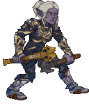
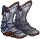
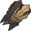
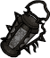
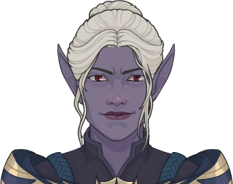
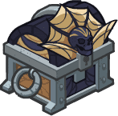

[Back to Main](index.md)

    
        Portrait
    
    
        Base Model
    
    
        Kar'niss Model
    

# Minthara

A member of the ancient House Baenre, Minthara is a True Soul in the service of the Absolute and one of the three leaders of the Goblin Camp in the Wilderness. She and her fellow True Souls, Priestess Gut and Dror Ragzlin, set up a base of operations in an old Selûnite temple in search of a Mysterious Artefact by order of the Absolute.

[Minthara - BG3 Wiki](https://bg3.wiki/wiki/Minthara)

# Basic Information

Minthara will be a new champion in the Feast of the Moon event on 6 November 2024.

    
        
            **Seat**:
        
        
            Unknown
        
    
    
        
            **Species**:
        
        
            Drow (Guess)
        
    
    
        
            **Class**:
        
        
            Paladin (Guess)
        
    
    
        
            **Roles**:
        
        
            Tanking / DPS / Support / Debuff (Guess)
        
    
    
        
            **Age**:
        
        
            Unknown
        
    
    
        
            **Gender**:
        
        
            Female (Guess)
        
    
    
        
            **Alignment**:
        
        
            Unknown
        
    
    
        
            **Affiliation**:
        
        
            Absolute Adversaries (Guess)
        
    

# Formation

Unknown.


    



# Attacks

**Base Attack: Double Maces** (Melee)
> Minthara moves up to the enemy with the highest remaining health percentage and attacks with her maces dealing one hit to all nearby enemies.  
> Cooldown: 5s (Cap 1.25s)

<em>Raw Data</em>

<pre>
{
    "id": 810,
    "name": "Double Maces",
    "description": "Minthara dashes toward the healthiest enemy and damages nearby foes with a swing of her maces.",
    "long_description": "Minthara moves up to the enemy with the highest remaining health percentage and attacks with her maces dealing one hit to all nearby enemies.",
    "graphic_id": 0,
    "target": "highest_health",
    "num_targets": 1,
    "aoe_radius": 100,
    "damage_modifier": 1,
    "cooldown": 5,
    "animations": [
        {
            "type": "melee_attack",
            "damage_frame": 8,
            "target_offset_x": -40,
            "jump_sound": 30,
            "sound_frames": {
                "14": 154
            }
        }
    ],
    "tags": [
        "melee"
    ],
    "damage_types": [
        "melee"
    ]
}
</pre>

**Base Attack: Spider's Lyre** (Melee)
> Minthara summons Kar'niss the Drider to attack all enemies. In a non-boss area, the Champions advance to the next area if no enemies remain after the attack.  
> Cooldown: 5s (Cap 1.25s)

<em>Raw Data</em>

<pre>
{
    "id": 811,
    "name": "Spider's Lyre",
    "description": "A summoned Drider attacks all enemies, potentially completing the current area.",
    "long_description": "Minthara summons Kar'niss the Drider to attack all enemies. In a non-boss area, the Champions advance to the next area if no enemies remain after the attack.",
    "graphic_id": 0,
    "target": "front",
    "num_targets": 1,
    "aoe_radius": 0,
    "damage_modifier": 1,
    "cooldown": 5,
    "animations": [
        {
            "type": "ultimate_attack",
            "ultimate": "kas"
        }
    ],
    "tags": [
        "melee"
    ],
    "damage_types": [
        "melee"
    ]
}
</pre>

# Abilities

**Noble of Menzoberranzan** (Guess)
> Minthara gains a Strife stack for each Evil Champion in the formation, including herself. Minthara increases the damage of these Champions by 100% for each Strife stack, stacking multiplicatively.

ⓘ *Note: This ability is prestack.*

<em>Raw Data</em>

<pre>
{
    "id": 2115,
    "flavour_text": "",
    "description": {
        "desc": "Minthara gains a Strife stack for each Evil Champion in the formation, including herself. Minthara increases the damage of these Champions by $(amount)% for each Strife stack, stacking multiplicatively."
    },
    "effect_keys": [
        {
            "effect_string": "pre_stack,100",
            "skip_effect_key_desc": true
        },
        {
            "effect_string": "hero_dps_multiplier_mult,0",
            "amount_expr": "upgrade_amount(15942,0)",
            "targets": [
                "all"
            ],
            "filter_targets": [
                {
                    "type": "hero_expr",
                    "hero_expr": "HasTag(`evil`)"
                }
            ],
            "amount_func": "mult",
            "stack_func": "per_hero_attribute",
            "per_hero_expr": "HasTag(`evil`)",
            "amount_updated_listeners": [
                "slot_changed",
                "hero_tags_changed"
            ],
            "show_bonus": true,
            "stack_title": "Strife Stacks",
            "off_when_benched": true,
            "use_computed_amount_for_description": true
        }
    ],
    "requirements": "",
    "graphic_id": 24877,
    "large_graphic_id": 24871,
    "properties": {
        "is_formation_ability": true,
        "formation_circle_icon": true,
        "owner_use_outgoing_description": true,
        "indexed_effect_properties": true,
        "per_effect_index_bonuses": true,
        "default_bonus_index": 0
    }
}
</pre>

**Ceremorphosis** (Guess)
> Your formation gains one Ceremorphosis stack due to the mind flayer tadpole in Minthara's brain. Minthara increases the health of all other Champions by 20% of her max health, plus 2% for each Ceremorphosis stack the formation has, stacking additively.

<em>Raw Data</em>

<pre>
{
    "id": 2116,
    "flavour_text": "",
    "description": {
        "desc": "Your formation gains one Ceremorphosis stack due to the mind flayer tadpole in Minthara's brain. Minthara increases the health of all other Champions by $(not_buffed amount___3)% of her max health, plus $(not_buffed amount)% for each Ceremorphosis stack the formation has, stacking additively."
    },
    "effect_keys": [
        {
            "off_when_benched": true,
            "effect_string": "do_nothing,2",
            "stack_func": "per_ceremorphosis_stacks",
            "amount_func": "add",
            "show_bonus": true,
            "stack_title": "Total Ceremorphosis Stacks",
            "total_title": "Ceremorphosis Stack Bonus",
            "desc_forced_order": 2,
            "listen_for_computed_changes": true,
            "amount_updated_listeners": [
                "upgrade_unlocked",
                "slot_changed",
                "feat_changed"
            ]
        },
        {
            "off_when_benched": true,
            "outgoing_buffs": false,
            "effect_string": "minthara_ceremorphosis_stacks,1",
            "manual_stacking": true,
            "stacks_multiply": false,
            "show_stacks": true,
            "stack_title": "Minthara Ceremorphosis Stacks",
            "desc_forced_order": 1,
            "skip_effect_key_desc": true
        },
        {
            "off_when_benched": true,
            "effect_string": "do_nothing,20",
            "skip_effect_key_desc": true
        },
        {
            "off_when_benched": true,
            "effect_string": "increase_health_by_source_percent,0",
            "amount_expr": "upgrade_amount(15943,2)+max_upgrade_amount(15943,0)",
            "percent_values": false,
            "round_bonus_value": true,
            "show_current_value_bonus_desc": false,
            "use_computed_amount_for_description": true,
            "override_key_desc": "Increases the Health of $target by $amount",
            "targets": [
                "other"
            ],
            "desc_forced_order": 3
        }
    ],
    "requirements": "",
    "graphic_id": 24876,
    "large_graphic_id": 24870,
    "properties": {
        "is_formation_ability": true,
        "formation_circle_icon": false,
        "owner_use_outgoing_description": true,
        "indexed_effect_properties": true,
        "per_effect_index_bonuses": true,
        "default_bonus_index": 0,
        "retain_on_slot_changed": true
    }
}
</pre>

**Soul Branding** (Guess)
> When Minthara damages an enemy, they take 100% additional damage from all subsequent attacks, stacking multiplicatively up to the number of Strife stacks Minthara has.

ⓘ *Note: This ability is prestack.*

<em>Raw Data</em>

<pre>
{
    "id": 2117,
    "flavour_text": "",
    "description": {
        "desc": "When Minthara damages an enemy, they take 100% additional damage from all subsequent attacks, stacking multiplicatively up to the number of Strife stacks Minthara has."
    },
    "effect_keys": [
        {
            "effect_string": "pre_stack,100"
        },
        {
            "effect_string": "minthara_soul_branding",
            "off_when_benched": true,
            "broadcast_name": "minthara_debuffs_monster",
            "debuff_before_damage": true,
            "debuff_max_stacks": 5,
            "debuffing_attack_ids": [
                810
            ],
            "debuff_effects": [
                {
                    "effect_string": "increase_monster_damage,0",
                    "amount_expr": "upgrade_amount(15944,0)",
                    "is_minthara_debuff": true,
                    "active_graphic_id": 23961,
                    "active_graphic_y": -120,
                    "use_stack_as_frame": true,
                    "stack_as_frame_offset": 0,
                    "overlay_play_mode": "stopped",
                    "bottom": false,
                    "stacks_on_reapply": true,
                    "manual_stacking": true,
                    "max_stacks": 0,
                    "stacks_multiply": true,
                    "use_collection_source": false,
                    "stack_across_effects": false
                }
            ],
            "max_stack_expression": "HasTag(`evil`)"
        }
    ],
    "requirements": "",
    "graphic_id": 24879,
    "large_graphic_id": 24873,
    "properties": {
        "is_formation_ability": true,
        "formation_circle_icon": false,
        "owner_use_outgoing_description": true,
        "indexed_effect_properties": true,
        "per_effect_index_bonuses": true,
        "default_bonus_index": 0
    }
}
</pre>

**Oath of Vengeance** (Guess)
> Minthara provides benefits based on the number of Strife stacks she has.  
> 3+ Strife stacks: Unyielding: Minthara increases her health by 300% for each Strife stack she has, stacking additively.  
> 5+ Strife stacks: Piercing: Monsters affected by at least two Soul Branding stacks lose an additional armor or segmented health piece when they are attacked.  
> 7+ Strife stacks: Scarring: When Minthara damages an enemy, she immediately applies the maximum possible number of Soul Branding stacks.  
> 9+ Strife stacks: Nobility: Increase the base value of Noble of Menzoberranzan by 300.

<em>Raw Data</em>

<pre>
{
    "id": 2118,
    "flavour_text": "",
    "description": {
        "desc": "Minthara provides benefits based on the number of Strife stacks she has.^3+ Strife stacks: Unyielding: Minthara increases her health by $(amount___2)% for each Strife stack she has, stacking additively.^5+ Strife stacks: Piercing: Monsters affected by at least two Soul Branding stacks lose an additional armor or segmented health piece when they are attacked.^7+ Strife stacks: Scarring: When Minthara damages an enemy, she immediately applies the maximum possible number of Soul Branding stacks.^9+ Strife stacks: Nobility: Increase the base value of Noble of Menzoberranzan by $(amount___5)."
    },
    "effect_keys": [
        {
            "effect_string": "apply_effects_at_stacks",
            "show_description": false,
            "apply_effect_stack_amounts": [
                3,
                5,
                7,
                9
            ],
            "show_stacks": true,
            "stacks_are_bonus": false,
            "stacks_from_amount_func": "per_crusader",
            "target_filters": [
                {
                    "type": "tags",
                    "tags": "evil"
                }
            ],
            "amount_updated_listeners": [
                "slot_changed",
                "hero_tags_changed"
            ],
            "off_when_benched": true,
            "active_effect_key_description_prepender": "- ",
            "active_effect_key_description_joiner": "^"
        },
        {
            "apply_manually": true,
            "effect_string": "reduce_attack_cooldown,0.5",
            "targets": [
                "all"
            ],
            "filter_targets": [
                {
                    "type": "hero_expr",
                    "hero_expr": "HasTag(`evil`)"
                }
            ],
            "off_when_benched": true
        },
        {
            "apply_manually": true,
            "effect_string": "buff_positional_formation_abilities_per_crusader,25",
            "targets": [
                {
                    "type": "attack_type",
                    "attack": "magic"
                }
            ],
            "target_filters": [
                {
                    "type": "attack_type",
                    "attack": "magic"
                }
            ],
            "amount_updated_listeners": [
                "attack_changed"
            ],
            "off_when_benched": true,
            "override_key_desc": "Increases the potency of $target's Formation Abilities by $amount% for each Champion with a magical base attack.",
            "use_computed_amount_for_description": true,
            "show_bonus": false,
            "show_stacks": false
        },
        {
            "apply_manually": true,
            "effect_string": "add_monster_hit_effects,100",
            "reqs": [
                "base_attack"
            ],
            "apply_last": true,
            "target_hero": true,
            "chance": 50,
            "monster_effect": {
                "effect_string": "reduce_base_attack_cooldown_by_percent_action,$amount"
            },
            "targets": [
                {
                    "type": "attack_type",
                    "attack": "magic"
                }
            ],
            "off_when_benched": true,
            "override_key_desc": "After $target attacks with their Base Attack, $target has $(chance)% to refresh that attack's Cooldown."
        },
        {
            "apply_manually": true,
            "effect_string": "change_upgrade_data,4346,0",
            "data": {
                "amount": 300
            },
            "off_when_benched": true,
            "override_key_desc": "Increases the base value of Spellcaster School by 200%"
        }
    ],
    "requirements": "",
    "graphic_id": 24878,
    "large_graphic_id": 24872,
    "properties": {
        "is_formation_ability": true,
        "formation_circle_icon": false,
        "owner_use_outgoing_description": true,
        "indexed_effect_properties": true,
        "per_effect_index_bonuses": true,
        "default_bonus_index": 0
    }
}
</pre>

# Specialisations

**House Matron** (Guess)
> Noble of Menzoberranzan now also grants Strife stacks for Neutral Champions in the formation (on the good/evil axis).

<em>Raw Data</em>

<pre>
{
    "id": 2119,
    "flavour_text": "",
    "description": {
        "desc": "Noble of Menzoberranzan now also grants Strife stacks for Neutral Champions in the formation (on the good/evil axis)."
    },
    "effect_keys": [
        {
            "effect_string": "do_nothing"
        }
    ],
    "requirements": "",
    "graphic_id": 0,
    "large_graphic_id": 0,
    "properties": {
        "is_formation_ability": true,
        "formation_circle_icon": true,
        "owner_use_outgoing_description": true,
        "indexed_effect_properties": true,
        "per_effect_index_bonuses": true,
        "default_bonus_index": 0
    }
}
</pre>

**Soul Destroyer** (Guess)
> Your formation gains 2 additional Ceremorphosis stacks.

<em>Raw Data</em>

<pre>
{
    "id": 2120,
    "flavour_text": "",
    "description": {
        "desc": "Your formation gains 2 additional Ceremorphosis stacks."
    },
    "effect_keys": [
        {
            "effect_string": "do_nothing"
        }
    ],
    "requirements": "",
    "graphic_id": 0,
    "large_graphic_id": 0,
    "properties": {
        "is_formation_ability": true,
        "owner_use_outgoing_description": true,
        "formation_circle_icon": false
    }
}
</pre>

**True Soul** (Guess)
> The maximum number of Soul Branding stacks is doubled.

<em>Raw Data</em>

<pre>
{
    "id": 2121,
    "flavour_text": "",
    "description": {
        "desc": "The maximum number of Soul Branding stacks is doubled."
    },
    "effect_keys": [
        {
            "effect_string": "do_nothing"
        }
    ],
    "requirements": "",
    "graphic_id": 0,
    "large_graphic_id": 0,
    "properties": {
        "is_formation_ability": true,
        "owner_use_outgoing_description": true,
        "formation_circle_icon": false
    }
}
</pre>

# Items

    
        
            **Icons**
        
        
            **Name**
        
    
    
        
            
        
        
            Armor
        
    
    
        
            
        
        
            Boots
        
    
    
        
            
        
        
            Clothing
        
    
    
        
            
        
        
            Lolth Drider
        
    
    
        
            
        
        
            Mind Flayer Absolute
        
    
    
        
            
        
        
            Weapon
        
    

# Feats

Unknown.

# Legendaries

Unknown.

# Adventures and Variants

**Unlock Adventure: The Crypt of Legends (Minthara)** (Complete Area 50)
> Pay respects to the heroes of olde during the Feast of the Moon.

**Variant 1: TBD** (Complete Area 75)
> 

**Variant 2: TBD** (Complete Area 125)
> 

**Variant 3: TBD** (Complete Area 175)
> 

# Other Champion Images

    
        
            Console Portrait
        
    
    
        
            Gold Chest Icon
        
        
            Silver Chest Icon
        
    

[Back to Top](#top)

*Last Modified: {{ site.time }}*