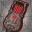
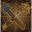
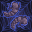

[Back to Main](index.md)

    
        
            
        
        
        Portrait
        
    
    
        
            
        
        
        Base Model
        
    
    
        
            
                
            
            
        
        
        Kar'niss Model
        
    

# Minthara

Minthara, once a House Matron from the esteemed House Baenre in Menzoberranzan, was cast aside by the Absolute after failing to recover a powerful and mysterious artifact. Having broken free from the Absolute's control, she now harbors an intense hatred for her former master. Fueled by vengeance and a desire to reclaim her lost honor, Minthara channels her dark powers and cunning to oppose the Absolute and any who stand in her way.

# Basic Information

Minthara will be a new champion in the Feast of the Moon event on 6 November 2024.

    
        
            **Seat**:
        
        
            3
        
        
            **Stat**
        
        
            **Value**
        
        
            **Day 1 Trials**
        
        
            **Patrons**
        
    
    
        
            **Species**:
        
        
            Elf (Drow)
        
        
            **Strength**:
        
        
            16
        
        
            Yes
        
        
            Mirt
        
    
    
        
            **Class**:
        
        
            Paladin
        
        
            **Dexterity**:
        
        
            15
        
        
            Yes
        
        
            Vajra
        
    
    
        
            **Roles**:
        
        
            Support / Debuff / Tanking
        
        
            **Constitution**:
        
        
            14
        
        
            Yes
        
        
            -
        
    
    
        
            **Age**:
        
        
            150
        
        
            **Intelligence**:
        
        
            10
        
        
            Yes
        
        
            Zariel
        
    
    
        
            **Gender**:
        
        
            Female
        
        
            **Wisdom**:
        
        
            12
        
        
            Yes
        
        
            Elminster
        
    
    
        
            **Alignment**:
        
        
            Neutral Evil
        
        
            **Charisma**:
        
        
            17
        
        
            Yes
        
        
            &nbsp;
        
    
    
        
            **Affiliation**:
        
        
            Absolute Adversaries
        
        
            **Total**:
        
        
            84
        
        
            Champion ID:
        
        
            154
        
    

# Formation

    <svg xmlns="http://www.w3.org/2000/svg" id="Minthara" fill="#aaa" data-formationName="Minthara" data-campaignName="Feast of the Moon" width="338" height="160"><circle cx="175" cy="145" r="15"/><circle cx="135" cy="45" r="15"/><circle cx="135" cy="85" r="15"/><circle cx="135" cy="125" r="15"/><circle cx="95" cy="25" r="15"/><circle cx="95" cy="105" r="15"/><circle cx="55" cy="45" r="15"/><circle cx="55" cy="85" r="15"/><circle cx="55" cy="125" r="15"/><circle cx="15" cy="145" r="15"/><text x="205" y="25" fill="#dcdcdc" font-size="25" font-family="Arial" font-weight="bold">Minthara</text><text x="205" y="65" fill="#dcdcdc" font-size="15" font-family="Arial" font-weight="bold">Feast of the Moon</text></svg>

# Attacks

 **Base Attack: Double Maces** (Melee)
> Minthara dashes toward the healthiest enemy and damages nearby foes with a swing of her maces.  
> Cooldown: 5s (Cap 1.25s)

<em>Raw Data</em>

<pre>
{
    "id": 810,
    "name": "Double Maces",
    "description": "Minthara dashes toward the healthiest enemy and damages nearby foes with a swing of her maces.",
    "long_description": "",
    "graphic_id": 0,
    "target": "highest_health",
    "num_targets": 1,
    "aoe_radius": 100,
    "damage_modifier": 1,
    "cooldown": 5,
    "animations": [
        {
            "type": "melee_attack",
            "damage_frame": 8,
            "target_offset_x": -40,
            "jump_sound": 30,
            "sound_frames": {
                "14": 154
            }
        }
    ],
    "tags": [
        "melee"
    ],
    "damage_types": [
        "melee"
    ]
}
</pre>

 **Ultimate Attack: Spider's Lyre** (Level: 0)
> Minthara summons Kar'niss the Drider to attack all enemies. In a non-boss area, the Champions advance to the next area if no enemies remain after the attack.  
> Cooldown: 350s (Cap 87.5s)

<em>Raw Data</em>

<pre>
{
    "id": 811,
    "name": "Spider's Lyre",
    "description": "A summoned Drider attacks all enemies, potentially completing the current area.",
    "long_description": "Minthara summons Kar'niss the Drider to attack all enemies. In a non-boss area, the Champions advance to the next area if no enemies remain after the attack.",
    "graphic_id": 24887,
    "target": "front",
    "num_targets": 1,
    "aoe_radius": 0,
    "damage_modifier": 0.03,
    "cooldown": 350,
    "animations": [
        {
            "type": "ultimate_attack",
            "ultimate": "minthara"
        }
    ],
    "tags": [
        "melee",
        "ultimate"
    ],
    "damage_types": [
        "melee"
    ]
}
</pre>

# Abilities

 **Noble of Menzoberranzan** (Level: 20)
> Minthara gains a Strife stack for each Evil Champion in the formation, including herself. Minthara increases the damage of these Champions by 100% for each Strife stack, stacking multiplicatively.

<em>Upgrade Data</em>

<pre>
Upgrades:
       80: 100%
      220: 100%
      290: 100%
      380: 100%
      470: 100%
      560: 100%
      650: 100%
      750: 100%
      840: 100%
      940: 100%
    1,030: 100%
    1,130: 100%
    1,230: 100%
    1,330: 100%
    1,430: 100%
    1,520: 100%
    1,620: 100%
    1,710: 100%
    1,810: 100%
    1,910: 100%

    Total Upgrade Bonus: 1.05e08%
</pre>

<em>Raw Data</em>

<pre>
{
    "id": 15942,
    "hero_id": 154,
    "required_level": 20,
    "required_upgrade_id": 0,
    "upgrade_type": "unlock_ability",
    "effect": "effect_def,2115",
    "static_dps_mult": null,
    "default_enabled": 1,
    "name": "Noble of Menzoberranzan",
    "tip_text": "Minthara buffs Evil Champions, and these abilities improve as more Evil Champions are in the formation."
}
{
    "id": 2115,
    "flavour_text": "",
    "description": {
        "conditions": [
            {
                "condition": "upgrade_purchased 15946",
                "desc": "Minthara gains a Strife stack for each Evil or Neutral (Good/Evil axis) Champion in the formation, including herself. Minthara increases the damage of these Champions by $(amount)% for each Strife stack, stacking multiplicatively."
            },
            {
                "desc": "Minthara gains a Strife stack for each Evil Champion in the formation, including herself. Minthara increases the damage of these Champions by $(amount)% for each Strife stack, stacking multiplicatively."
            }
        ]
    },
    "effect_keys": [
        {
            "effect_string": "pre_stack,100",
            "skip_effect_key_desc": true
        },
        {
            "effect_string": "hero_dps_multiplier_mult,0",
            "amount_expr": "upgrade_amount(15942,0)",
            "targets": [
                "all"
            ],
            "filter_targets": [
                {
                    "type": "hero_expr",
                    "hero_expr": "HasTag(`evil`)"
                }
            ],
            "amount_func": "mult",
            "stack_func": "per_hero_attribute",
            "per_hero_expr": "HasTag(`evil`)",
            "amount_updated_listeners": [
                "slot_changed",
                "hero_tags_changed"
            ],
            "show_bonus": true,
            "stack_title": "Strife Stacks",
            "off_when_benched": true,
            "use_computed_amount_for_description": true
        }
    ],
    "requirements": "",
    "graphic_id": 24877,
    "large_graphic_id": 24871,
    "properties": {
        "is_formation_ability": true,
        "formation_circle_icon": true,
        "owner_use_outgoing_description": true,
        "indexed_effect_properties": true,
        "per_effect_index_bonuses": true,
        "default_bonus_index": 1
    }
}
{
    "id": 15950,
    "hero_id": 154,
    "required_level": 80,
    "required_upgrade_id": 0,
    "upgrade_type": "upgrade_ability",
    "effect": "buff_upgrade,100,15942",
    "static_dps_mult": null,
    "default_enabled": 1,
    "name": ""
}
{
    "id": 15974,
    "hero_id": 154,
    "required_level": 220,
    "required_upgrade_id": 0,
    "upgrade_type": "upgrade_ability",
    "effect": "buff_upgrade,100,15942",
    "static_dps_mult": null,
    "default_enabled": 1,
    "name": ""
}
{
    "id": 15976,
    "hero_id": 154,
    "required_level": 290,
    "required_upgrade_id": 0,
    "upgrade_type": "upgrade_ability",
    "effect": "buff_upgrade,100,15942",
    "static_dps_mult": null,
    "default_enabled": 1,
    "name": ""
}
{
    "id": 15978,
    "hero_id": 154,
    "required_level": 380,
    "required_upgrade_id": 0,
    "upgrade_type": "upgrade_ability",
    "effect": "buff_upgrade,100,15942",
    "static_dps_mult": null,
    "default_enabled": 1,
    "name": ""
}
{
    "id": 15981,
    "hero_id": 154,
    "required_level": 470,
    "required_upgrade_id": 0,
    "upgrade_type": "upgrade_ability",
    "effect": "buff_upgrade,100,15942",
    "static_dps_mult": null,
    "default_enabled": 1,
    "name": ""
}
{
    "id": 15983,
    "hero_id": 154,
    "required_level": 560,
    "required_upgrade_id": 0,
    "upgrade_type": "upgrade_ability",
    "effect": "buff_upgrade,100,15942",
    "static_dps_mult": null,
    "default_enabled": 1,
    "name": ""
}
{
    "id": 15984,
    "hero_id": 154,
    "required_level": 650,
    "required_upgrade_id": 0,
    "upgrade_type": "upgrade_ability",
    "effect": "buff_upgrade,100,15942",
    "static_dps_mult": null,
    "default_enabled": 1,
    "name": ""
}
{
    "id": 15987,
    "hero_id": 154,
    "required_level": 750,
    "required_upgrade_id": 0,
    "upgrade_type": "upgrade_ability",
    "effect": "buff_upgrade,100,15942",
    "static_dps_mult": null,
    "default_enabled": 1,
    "name": ""
}
{
    "id": 15988,
    "hero_id": 154,
    "required_level": 840,
    "required_upgrade_id": 0,
    "upgrade_type": "upgrade_ability",
    "effect": "buff_upgrade,100,15942",
    "static_dps_mult": null,
    "default_enabled": 1,
    "name": ""
}
{
    "id": 15991,
    "hero_id": 154,
    "required_level": 940,
    "required_upgrade_id": 0,
    "upgrade_type": "upgrade_ability",
    "effect": "buff_upgrade,100,15942",
    "static_dps_mult": null,
    "default_enabled": 1,
    "name": ""
}
{
    "id": 15992,
    "hero_id": 154,
    "required_level": 1030,
    "required_upgrade_id": 0,
    "upgrade_type": "upgrade_ability",
    "effect": "buff_upgrade,100,15942",
    "static_dps_mult": null,
    "default_enabled": 1,
    "name": ""
}
{
    "id": 15995,
    "hero_id": 154,
    "required_level": 1130,
    "required_upgrade_id": 0,
    "upgrade_type": "upgrade_ability",
    "effect": "buff_upgrade,100,15942",
    "static_dps_mult": null,
    "default_enabled": 1,
    "name": ""
}
{
    "id": 15996,
    "hero_id": 154,
    "required_level": 1230,
    "required_upgrade_id": 0,
    "upgrade_type": "upgrade_ability",
    "effect": "buff_upgrade,100,15942",
    "static_dps_mult": null,
    "default_enabled": 1,
    "name": ""
}
{
    "id": 15999,
    "hero_id": 154,
    "required_level": 1330,
    "required_upgrade_id": 0,
    "upgrade_type": "upgrade_ability",
    "effect": "buff_upgrade,100,15942",
    "static_dps_mult": null,
    "default_enabled": 1,
    "name": ""
}
{
    "id": 16001,
    "hero_id": 154,
    "required_level": 1430,
    "required_upgrade_id": 0,
    "upgrade_type": "upgrade_ability",
    "effect": "buff_upgrade,100,15942",
    "static_dps_mult": null,
    "default_enabled": 1,
    "name": ""
}
{
    "id": 16003,
    "hero_id": 154,
    "required_level": 1520,
    "required_upgrade_id": 0,
    "upgrade_type": "upgrade_ability",
    "effect": "buff_upgrade,100,15942",
    "static_dps_mult": null,
    "default_enabled": 1,
    "name": ""
}
{
    "id": 16005,
    "hero_id": 154,
    "required_level": 1620,
    "required_upgrade_id": 0,
    "upgrade_type": "upgrade_ability",
    "effect": "buff_upgrade,100,15942",
    "static_dps_mult": null,
    "default_enabled": 1,
    "name": ""
}
{
    "id": 16007,
    "hero_id": 154,
    "required_level": 1710,
    "required_upgrade_id": 0,
    "upgrade_type": "upgrade_ability",
    "effect": "buff_upgrade,100,15942",
    "static_dps_mult": null,
    "default_enabled": 1,
    "name": ""
}
{
    "id": 16009,
    "hero_id": 154,
    "required_level": 1810,
    "required_upgrade_id": 0,
    "upgrade_type": "upgrade_ability",
    "effect": "buff_upgrade,100,15942",
    "static_dps_mult": null,
    "default_enabled": 1,
    "name": ""
}
{
    "id": 16011,
    "hero_id": 154,
    "required_level": 1910,
    "required_upgrade_id": 0,
    "upgrade_type": "upgrade_ability",
    "effect": "buff_upgrade,100,15942",
    "static_dps_mult": null,
    "default_enabled": 1,
    "name": ""
}
</pre>

 **Soul Branding** (Level: 100)
> When Minthara damages an enemy, they take 100% additional damage from all subsequent attacks, stacking multiplicatively up to the number of Strife stacks Minthara has.

ⓘ *Note: This ability is prestack.*

<em>Raw Data</em>

<pre>
{
    "id": 15944,
    "hero_id": 154,
    "required_level": 100,
    "required_upgrade_id": 0,
    "upgrade_type": "unlock_ability",
    "effect": "effect_def,2117",
    "static_dps_mult": null,
    "default_enabled": 1,
    "name": "Soul Branding",
    "tip_text": "Minthara debuffs enemies she hits, causing them to take more damage from subsequent attacks."
}
{
    "id": 2117,
    "flavour_text": "",
    "description": {
        "desc": "When Minthara damages an enemy, they take $(amount)% additional damage from all subsequent attacks, stacking multiplicatively up to the number of Strife stacks Minthara has.",
        "post": {
            "conditions": [
                {
                    "condition": "not static_desc",
                    "desc": "^^Max Stacks: $minthara_max_stacks"
                }
            ]
        }
    },
    "effect_keys": [
        {
            "effect_string": "pre_stack,100"
        },
        {
            "effect_string": "minthara_soul_branding",
            "off_when_benched": true,
            "broadcast_name": "minthara_debuffs_monster",
            "debuff_before_damage": true,
            "debuff_max_stacks": 5,
            "debuffing_attack_ids": [
                810
            ],
            "soul_destroyer_upgrade_id": 15948,
            "debuff_effects": [
                {
                    "effect_string": "minthara_increase_monster_damage,0",
                    "amount_expr": "upgrade_amount(15944,0)",
                    "is_minthara_debuff": true,
                    "active_graphic_id": 24888,
                    "active_graphic_y": -120,
                    "use_stack_as_frame": true,
                    "use_stack_as_alpha": true,
                    "stack_count_debug": false,
                    "min_stack_alpha": 0.4,
                    "pre_max_stack_alpha": 0.8,
                    "stack_as_frame_offset": 0,
                    "overlay_play_mode": "stopped",
                    "bottom": false,
                    "stacks_on_reapply": true,
                    "manual_stacking": true,
                    "max_stacks": 5,
                    "stacks_multiply": true,
                    "use_collection_source": false,
                    "stack_across_effects": false
                }
            ],
            "max_stack_expression": "HasTag(`evil`)"
        }
    ],
    "requirements": "",
    "graphic_id": 24879,
    "large_graphic_id": 24873,
    "properties": {
        "is_formation_ability": true,
        "formation_circle_icon": false,
        "owner_use_outgoing_description": true,
        "indexed_effect_properties": true,
        "per_effect_index_bonuses": true,
        "default_bonus_index": 0,
        "retain_on_slot_changed": true
    }
}
</pre>

 **Oath of Vengeance** (Level: 140)
> Minthara provides benefits based on the number of Strife stacks she has.  
> 3+ Strife stacks: Unyielding: Minthara increases her health by 10% for each Strife stack she has, stacking additively.  
> 5+ Strife stacks: Piercing: Enemies affected by at least two Soul Branding stacks lose an additional armor or segmented health piece when they are attacked.  
> 7+ Strife stacks: Scarring: When Minthara damages an enemy, she immediately applies the maximum possible number of Soul Branding stacks.  
> 9+ Strife stacks: Nobility: Increases the base value of Noble of Menzoberranzan by 400%.

<em>Raw Data</em>

<pre>
{
    "id": 15945,
    "hero_id": 154,
    "required_level": 140,
    "required_upgrade_id": 0,
    "upgrade_type": "unlock_ability",
    "effect": "effect_def,2118",
    "static_dps_mult": null,
    "default_enabled": 1,
    "name": "Oath of Vengeance"
}
{
    "id": 2118,
    "flavour_text": "",
    "description": {
        "desc": "Minthara provides benefits based on the number of Strife stacks she has.^3+ Strife stacks: Unyielding: Minthara increases her health by $(amount___2)% for each Strife stack she has, stacking additively.^5+ Strife stacks: Piercing: Enemies affected by at least two Soul Branding stacks lose an additional armor or segmented health piece when they are attacked.^7+ Strife stacks: Scarring: When Minthara damages an enemy, she immediately applies the maximum possible number of Soul Branding stacks.^9+ Strife stacks: Nobility: Increases the base value of Noble of Menzoberranzan by $(amount___5)%."
    },
    "effect_keys": [
        {
            "effect_string": "apply_effects_at_stacks",
            "show_description": false,
            "apply_effect_stack_amounts": [
                3,
                5,
                7,
                9
            ],
            "show_stacks": true,
            "stacks_are_bonus": false,
            "stacks_from_amount_func": "per_crusader",
            "target_filters": [
                {
                    "type": "tags",
                    "tags": "evil"
                }
            ],
            "amount_updated_listeners": [
                "slot_changed",
                "hero_tags_changed"
            ],
            "off_when_benched": true,
            "active_effect_key_description_prepender": "- ",
            "active_effect_key_description_joiner": "^"
        },
        {
            "effect_string": "health_mult,10",
            "apply_manually": true,
            "off_when_benched": true,
            "amount_func": "add",
            "stack_func": "per_hero_attribute",
            "per_hero_expr": "HasTag(`evil`)",
            "amount_updated_listeners": [
                "slot_changed",
                "hero_tags_changed"
            ],
            "override_key_desc": "Minthara increases her health by 10% for each Strife stack she has, stacking additively.",
            "show_bonus": false,
            "show_stacks": false
        },
        {
            "effect_string": "increase_damage_against_monster_armor_and_hits,1",
            "apply_manually": true,
            "off_when_benched": true,
            "monster_has_effect_key": "minthara_increase_monster_damage",
            "required_stacks": 2,
            "targets": [
                "all"
            ],
            "override_key_desc": "Monsters affected by at least two Soul Branding stacks lose an additional armor or segmented health piece when they are attacked."
        },
        {
            "effect_string": "minthara_apply_max_stacks",
            "apply_manually": true,
            "off_when_benched": true,
            "override_key_desc": "When Minthara damages an enemy, she immediately applies the maximum possible number of Soul Branding stacks.",
            "show_bonus": false,
            "show_stacks": false
        },
        {
            "effect_string": "buff_upgrade,400,15942,0",
            "apply_manually": true,
            "off_when_benched": true,
            "override_key_desc": "Increases the base value of Noble of Menzoberranzan by 400%."
        }
    ],
    "requirements": "",
    "graphic_id": 24878,
    "large_graphic_id": 24872,
    "properties": {
        "is_formation_ability": true,
        "formation_circle_icon": false,
        "owner_use_outgoing_description": false,
        "indexed_effect_properties": true,
        "per_effect_index_bonuses": true,
        "default_bonus_index": 0
    }
}
</pre>

 **Spider's Lyre** (Level: 180)
> Unlocks Minthara's Spider's Lyre Ultimate Attack.

<em>Raw Data</em>

<pre>
{
    "id": 15949,
    "hero_id": 154,
    "required_level": 180,
    "required_upgrade_id": 0,
    "upgrade_type": "unlock_ultimate",
    "effect": "effect_def,2122",
    "static_dps_mult": null,
    "default_enabled": 1,
    "name": "Spider's Lyre"
}
{
    "id": 2122,
    "flavour_text": "",
    "description": {
        "desc": "Unlocks Minthara's Spider's Lyre Ultimate Attack"
    },
    "effect_keys": [
        {
            "effect_string": "minthara_ultimate",
            "skip_effect_key_desc": true,
            "max_duration": 30,
            "startup_delay": 1.2,
            "required_minthara_kills": 1,
            "knockback_effect": {
                "effect_string": "push_back_monster,10"
            },
            "stop_spawn_effect": {
                "effect_string": "stop_spawns",
                "include_bosses": true,
                "targets": [
                    "area"
                ]
            },
            "drider_data": {
                "start_pos": [
                    -200,
                    725
                ],
                "end_pos": [
                    2200,
                    725
                ],
                "move_duration": 4,
                "anim_stride": 250,
                "glow_graphic_id": 21930
            }
        },
        {
            "effect_string": "set_ultimate_attack",
            "skip_effect_key_desc": true
        }
    ],
    "requirements": "",
    "graphic_id": 0,
    "large_graphic_id": 0,
    "properties": {
        "is_formation_ability": false,
        "owner_use_outgoing_description": false,
        "formation_circle_icon": false
    }
}
</pre>

 **Ceremorphosis** (Level: 200)
> Your formation gains one Ceremorphosis stack due to the mind flayer tadpole in Minthara's brain. Minthara increases the health of all other Champions by 20% of her max health, plus 2% for each Ceremorphosis stack the formation has, stacking additively.

<em>Raw Data</em>

<pre>
{
    "id": 15943,
    "hero_id": 154,
    "required_level": 200,
    "required_upgrade_id": 0,
    "upgrade_type": "unlock_ability",
    "effect": "effect_def,2116",
    "static_dps_mult": null,
    "default_enabled": 1,
    "name": "Ceremorphosis"
}
{
    "id": 2116,
    "flavour_text": "",
    "description": {
        "desc": "Your formation gains one Ceremorphosis stack due to the mind flayer tadpole in Minthara's brain. Minthara increases the health of all other Champions by $(not_buffed amount___3)% of her max health, plus $(not_buffed amount)% for each Ceremorphosis stack the formation has, stacking additively."
    },
    "effect_keys": [
        {
            "off_when_benched": true,
            "effect_string": "do_nothing,2",
            "stack_func": "per_ceremorphosis_stacks",
            "amount_func": "add",
            "show_bonus": true,
            "stack_title": "Total Ceremorphosis Stacks",
            "total_title": "Ceremorphosis Stack Bonus",
            "desc_forced_order": 2,
            "listen_for_computed_changes": true,
            "amount_updated_listeners": [
                "upgrade_unlocked",
                "slot_changed",
                "feat_changed"
            ]
        },
        {
            "off_when_benched": true,
            "outgoing_buffs": false,
            "effect_string": "minthara_ceremorphosis_stacks,1",
            "manual_stacking": true,
            "stacks_multiply": false,
            "show_stacks": true,
            "stack_title": "Minthara Ceremorphosis Stacks",
            "desc_forced_order": 1,
            "skip_effect_key_desc": true,
            "stack_func": "per_hero_attribute",
            "per_hero_expr": "0",
            "post_process_expr": "1 + 2*as_int(GetUpgradeUnlocked(15947))"
        },
        {
            "off_when_benched": true,
            "effect_string": "do_nothing,20",
            "skip_effect_key_desc": true
        },
        {
            "off_when_benched": true,
            "effect_string": "increase_health_by_source_percent,0",
            "amount_expr": "upgrade_amount(15943,2)+max_upgrade_amount(15943,0)",
            "percent_values": false,
            "round_bonus_value": true,
            "show_current_value_bonus_desc": false,
            "use_computed_amount_for_description": true,
            "override_key_desc": "Increases the Health of $target by $amount",
            "targets": [
                "other"
            ],
            "desc_forced_order": 3
        }
    ],
    "requirements": "",
    "graphic_id": 24876,
    "large_graphic_id": 24870,
    "properties": {
        "is_formation_ability": true,
        "formation_circle_icon": true,
        "owner_use_outgoing_description": true,
        "indexed_effect_properties": true,
        "per_effect_index_bonuses": true,
        "default_bonus_index": 3,
        "retain_on_slot_changed": true
    }
}
</pre>

# Specialisations

 **House Matron** (Level: 250)
> Noble of Menzoberranzan now also grants Strife stacks for Neutral Champions in the formation (on the Good/Evil axis).

<em>Raw Data</em>

<pre>
{
    "id": 15946,
    "hero_id": 154,
    "required_level": 250,
    "required_upgrade_id": 0,
    "upgrade_type": "unlock_ability",
    "effect": "effect_def,2119",
    "static_dps_mult": null,
    "default_enabled": 1,
    "name": "House Matron",
    "specialization_name": "House Matron",
    "specialization_description": "Minthara calls upon the ancient power of her lineage, extending her influence to encompass those that tread the line between good and evil.",
    "specialization_graphic_id": 24882
}
{
    "id": 2119,
    "flavour_text": "",
    "description": {
        "desc": "Noble of Menzoberranzan now also grants Strife stacks for Neutral Champions in the formation (on the Good/Evil axis)."
    },
    "effect_keys": [
        {
            "effect_string": "change_upgrade_data,15942,1",
            "data": {
                "filter_targets": [
                    {
                        "type": "hero_expr",
                        "hero_expr": "HasTag(`geneutral`)||HasTag(`evil`)"
                    }
                ]
            },
            "off_when_benched": true
        },
        {
            "effect_string": "change_upgrade_data,15942,1",
            "data": {
                "per_hero_expr": "HasTag(`geneutral`)||HasTag(`evil`)"
            },
            "off_when_benched": true,
            "skip_effect_key_desc": true
        },
        {
            "effect_string": "change_upgrade_data,15944,1",
            "data": {
                "max_stack_expression": "HasTag(`geneutral`)||HasTag(`evil`)"
            },
            "off_when_benched": true,
            "skip_effect_key_desc": true
        },
        {
            "effect_string": "change_upgrade_data,15945,0",
            "data": {
                "target_filters": [
                    {
                        "type": "tags",
                        "tags": "evil|geneutral"
                    }
                ]
            },
            "off_when_benched": true,
            "skip_effect_key_desc": true
        },
        {
            "effect_string": "change_upgrade_data,15945,1",
            "data": {
                "per_hero_expr": "HasTag(`geneutral`)||HasTag(`evil`)"
            },
            "off_when_benched": true,
            "skip_effect_key_desc": true
        }
    ],
    "requirements": "",
    "graphic_id": 24882,
    "large_graphic_id": 24882,
    "properties": {
        "is_formation_ability": true,
        "formation_circle_icon": true,
        "owner_use_outgoing_description": true,
        "indexed_effect_properties": true,
        "per_effect_index_bonuses": true,
        "default_bonus_index": 0
    }
}
</pre>

 **Soul Destroyer** (Level: 250)
> The maximum number of Soul Branding stacks is doubled.

<em>Raw Data</em>

<pre>
{
    "id": 15948,
    "hero_id": 154,
    "required_level": 250,
    "required_upgrade_id": 0,
    "upgrade_type": "unlock_ability",
    "effect": "effect_def,2121",
    "static_dps_mult": null,
    "default_enabled": 1,
    "name": "Soul Destroyer",
    "specialization_name": "Soul Destroyer",
    "specialization_description": "Minthara harnesses the full potential of her dark magic to inflict even greater suffering on her enemies.",
    "specialization_graphic_id": 24883
}
{
    "id": 2121,
    "flavour_text": "",
    "description": {
        "desc": "The maximum number of Soul Branding stacks is doubled."
    },
    "effect_keys": [
        {
            "effect_string": "minthara_multiply_max_stacks,100",
            "off_when_benched": true
        }
    ],
    "requirements": "",
    "graphic_id": 24883,
    "large_graphic_id": 24883,
    "properties": {
        "is_formation_ability": true,
        "owner_use_outgoing_description": true,
        "formation_circle_icon": false
    }
}
</pre>

 **True Soul** (Level: 250)
> Your formation gains 2 additional Ceremorphosis stacks.

<em>Raw Data</em>

<pre>
{
    "id": 15947,
    "hero_id": 154,
    "required_level": 250,
    "required_upgrade_id": 0,
    "upgrade_type": "unlock_ability",
    "effect": "effect_def,2120",
    "static_dps_mult": null,
    "default_enabled": 1,
    "name": "True Soul",
    "specialization_name": "True Soul",
    "specialization_description": "Minthara draws upon the sinister power of the mind flayer tadpole within her.",
    "specialization_graphic_id": 24884
}
{
    "id": 2120,
    "flavour_text": "",
    "description": {
        "desc": "Your formation gains 2 additional Ceremorphosis stacks."
    },
    "effect_keys": [
        {
            "off_when_benched": true,
            "outgoing_buffs": false,
            "effect_string": "minthara_ceremorphosis_stacks,2",
            "manual_stacking": true,
            "stacks_multiply": false,
            "desc_forced_order": 1
        }
    ],
    "requirements": "",
    "graphic_id": 24884,
    "large_graphic_id": 24884,
    "properties": {
        "is_formation_ability": true,
        "owner_use_outgoing_description": true,
        "formation_circle_icon": false
    }
}
</pre>

# Items

    
        
            **Icons**
        
        
            **Slot**
        
        
            **Epic Name**
        
        
            **Effect**
        
    
    
        
            ID: 3650**Rusted Knife**Still capable, in the right hand.<code>global_dps_multiplier_mult,10 allow_ge:true</code>ID: 3651**Trusty Dagger**Clean. Sharp. Yes, this shall serve.<code>global_dps_multiplier_mult,65 allow_ge:true</code>ID: 3652**Nightwarden's Mace**I will crush them where they stand.<code>global_dps_multiplier_mult,120 allow_ge:true</code>ID: 3653**Xyanyde**Ice cold and engraved with spiderwebs.<code>global_dps_multiplier_mult,230 allow_ge:true</code>&nbsp;
        
        
            1
        
        
            Xyanyde
        
        
            All Champion Damage
        
    
    
        
            ID: 3654**Prison Footwear**Stay quiet. Maintain the element of surprise.<code>global_dps_multiplier_mult,10 allow_ge:false</code>ID: 3655**Spidersilk Slippers**They shall not hear my approach until it is too late.<code>global_dps_multiplier_mult,65 allow_ge:false</code>ID: 3656**Tasteful Boots**The leather is long-lived, like my kind.<code>global_dps_multiplier_mult,120 allow_ge:false</code>ID: 3657**Boots of Striding**With every step, I grow closer to my revenge.<code>global_dps_multiplier_mult,230 allow_ge:false</code>
        
        
            2
        
        
            Boots of Striding
        
        
            All Champion Damage
        
    
    
        
            ID: 3658**Discarded Armour**Broken, but not useless.<code>health_mult,10 allow_ge:false</code>ID: 3659**Matron Armour**Armour more befitting my bearing.<code>health_mult,30 allow_ge:false</code>ID: 3660**Spidersilk Armour**Comfort and elegance, yet formidably fearsome.<code>health_mult,50 allow_ge:false</code>ID: 3661**Magical Studded Leather**Somewhat gaudy, but pronounced in its practicality.<code>health_mult,100 allow_ge:false</code>
        
        
            3
        
        
            Magical Studded Leather
        
        
            Health
        
    
    
        
            ID: 3662**Faded Clothes**This old thing must do for now.<code>buff_upgrade,25,15942,1 allow_ge:false</code>ID: 3663**Drow Silk Vestments**Ease of mobility is paramount in the Underdark.<code>buff_upgrade,87.5,15942,1 allow_ge:false</code>ID: 3664**Drow Leather Gloves**Lizard hide is both supple and flexible.<code>buff_upgrade,150,15942,1 allow_ge:false</code>ID: 3665**House Baenre Signet Ring**Menzoberranzan's most ancient and powerful House.<code>buff_upgrade,275,15942,1 allow_ge:false</code>
        
        
            4
        
        
            House Baenre Signet Ring
        
        
            Noble of Menzoberranzan
        
    
    
        
            ID: 3666**Tattered Emblem**This marking is familiar to me.<code>buff_upgrade,25,15944,0 allow_ge:false</code>ID: 3667**Mark of the Absolute**My enemies shall know my wrath.<code>buff_upgrade,87.5,15944,0 allow_ge:false</code>ID: 3668**Captured Illithid Tadpole**The source of a terrible yet intriguing power.<code>buff_upgrade,150,15944,0 allow_ge:false</code>ID: 3669**Orin's Netherstone**My vengeance, writ in blood.<code>buff_upgrade,275,15944,0 allow_ge:false</code>
        
        
            5
        
        
            Orin's Netherstone
        
        
            Soul Branding (Prestack)
        
    
    
        
            ID: 3670**Broken Moonlantern**This bauble is incapable of providing any aid.<code>reduce_ultimate_cooldown,9 allow_ge:false</code>ID: 3671**Moonlantern**Sufficient protection against the Shadow Curse.<code>reduce_ultimate_cooldown,18 allow_ge:false</code>ID: 3672**Spider's Lyre**The creature will come when called.<code>reduce_ultimate_cooldown,35 allow_ge:false</code>ID: 3673**Amulet of Lolth**May the Spider Queen guide my blade, should I be worthy.<code>reduce_ultimate_cooldown,85 allow_ge:false</code>
        
        
            6
        
        
            Amulet of Lolth
        
        
            Ultimate Cooldown Reduction Cap: 501 dull / 251 shiny / 126 golden.
        
    

<em>Item Names and Descriptions</em>

<pre>
Slot 1:
             Rusted Knife: Still capable, in the right hand.
            Trusty Dagger: Clean. Sharp. Yes, this shall serve.
       Nightwarden's Mace: I will crush them where they stand.
                  Xyanyde: Ice cold and engraved with spiderwebs.

Slot 2:
          Prison Footwear: Stay quiet. Maintain the element of surprise.
      Spidersilk Slippers: They shall not hear my approach until it is too late.
           Tasteful Boots: The leather is long-lived, like my kind.
        Boots of Striding: With every step, I grow closer to my revenge.

Slot 3:
         Discarded Armour: Broken, but not useless.
            Matron Armour: Armour more befitting my bearing.
        Spidersilk Armour: Comfort and elegance, yet formidably fearsome.
  Magical Studded Leather: Somewhat gaudy, but pronounced in its practicality.

Slot 4:
            Faded Clothes: This old thing must do for now.
      Drow Silk Vestments: Ease of mobility is paramount in the Underdark.
      Drow Leather Gloves: Lizard hide is both supple and flexible.
 House Baenre Signet Ring: Menzoberranzan's most ancient and powerful House.

Slot 5:
          Tattered Emblem: This marking is familiar to me.
     Mark of the Absolute: My enemies shall know my wrath.
Captured Illithid Tadpole: The source of a terrible yet intriguing power.
       Orin's Netherstone: My vengeance, writ in blood.

Slot 6:
       Broken Moonlantern: This bauble is incapable of providing any aid.
              Moonlantern: Sufficient protection against the Shadow Curse.
            Spider's Lyre: The creature will come when called.
          Amulet of Lolth: May the Spider Queen guide my blade, should I be worthy.
</pre>

 

# Feats

This list will only show feats that are going to be available on the release of this champion. The separate [Feats](feats.md) page may show others that could be available later if they exist.

    
        
            **Feat**
        
        
            **Effect**
        
        
            **Source**
        
    
    
        
            ID: 1956**Selflessness (Minthara)**Only the most deserving are granted my aid.<code>global_dps_multiplier_mult,10</code>Selflessness
        
        
            10% All Champion Damage
        
        
            Free
        
    
    
        
            ID: 1957**Inspiring Leader (Minthara)**Obey my command, and we shall win the day.<code>global_dps_multiplier_mult,25</code>Inspiring Leader
        
        
            25% All Champion Damage
        
        
            Gold Chest
        
    
    
        
            ID: 1958**Tough (Minthara)**The Underdark breeds fine warriors, by necessity.<code>health_mult,15</code>Tough
        
        
            15% Health
        
        
            Free
        
    
    
        
            ID: 1959**Resilient (Minthara)**They tried to break me. And yet, I persist.<code>health_mult,30</code>Resilient
        
        
            30% Health
        
        
            Gold Chest
        
    
    
        
            ID: 1960**Defensive Duelist (Minthara)**Watch for an opening, then strike without hesitation.<code>overwhelm_start_increase,5</code>Defensive Duelist
        
        
            +5 Overwhelm
        
        
            Free
        
    
    
        
            ID: 1961**Calm Under Pressure (Minthara)**Panic's home is within our enemy, not our hearts.<code>overwhelm_start_increase,10</code>Calm Under Pressure
        
        
            +10 Overwhelm
        
        
            12,500 Gems
        
    
    
        
            ID: 1962**Drow Noble (Minthara)**I am a daughter of House Baenre. I lived a life of privilege and danger.<code>buff_upgrade,20,15942,1</code>Drow Noble
        
        
            20% Noble of Menzoberranzan
        
        
            Free
        
    
    
        
            ID: 1963**Drow Survivor (Minthara)**I enjoyed every luxury, and survived my first assassination attempt as a babe.<code>buff_upgrade,40,15942,1</code>Drow Survivor
        
        
            40% Noble of Menzoberranzan
        
        
            12,500 Gems
        
    
    
        
            ID: 1964**Daughter of House Baenre (Minthara)**Do you still dare to cross me?<code>buff_upgrade,80,15942,1</code>Daughter of House Baenre
        
        
            80% Noble of Menzoberranzan
        
        
            50,000 Gems
        
    
    
        
            ID: 1965**Compelling Strife (Minthara)**I do not have violent urges. I have violent intentions.<code>buff_upgrade,40,15944,0</code>Compelling Strife
        
        
            40% Soul Branding (Prestack)
        
        
            Gold Chest
        
    
    
        
            ID: 1972**Nightwarden's Oath (Minthara)**They broke my mind. We are going to break them back.<code>buff_upgrade,80,15945,4</code>Nightwarden's Oath
        
        
            80% Oath of Vengeance (Prestack)
        
        
            Event Bonus
        
    

# Legendaries

* Increases the damage of all Champions by 100%.
* Increases the damage of all Female Champions by 125%.
* Increases the damage of all Elf Champions by 150%.
* Increases the damage of all Champions with a DEX score of 13 or higher by 150%.
* Increases the damage of all Champions by 30% for each Champion with a CHA score of 13 or higher in the formation.
* Increases the damage of all Champions by 40% for each Champion in the formation with a EVIL alignment.

<em>DPS Applicable</em>

<pre>
     Arkhan: 4 / 6
    Asharra: 4 / 6
      Azaka: 5 / 6
   Birdsong: 5 / 6
Black Viper: 5 / 6
      Bobby: 4 / 6
 Catti-brie: 5 / 6
     D'hani: 5 / 6
  Dark Urge: 4 / 6
     Delina: 6 / 6
    Dhadius: 3 / 6
     Drizzt: 5 / 6
    Farideh: 5 / 6
        Fen: 6 / 6
      Grimm: 3 / 6
       Ishi: 5 / 6
    Jaheira: 5 / 6
    Jamilah: 5 / 6
   Jarlaxle: 5 / 6
        Jim: 4 / 6
    Karlach: 5 / 6
        Kas: 4 / 6
       Kent: 4 / 6
      Krond: 3 / 6
       Krux: 4 / 6
    Lae'zel: 5 / 6
     Lucius: 5 / 6
      Makos: 3 / 6
      Minsc: 3 / 6
      NERDS: 3 / 6
      Nixie: 5 / 6
     Orisha: 5 / 6
   Prudence: 4 / 6
      Rosie: 5 / 6
      Strix: 4 / 6
    Torogar: 4 / 6
     Warden: 4 / 6
    Warduke: 3 / 6
     Yorven: 4 / 6
      Zorbu: 4 / 6
</pre>

<em>Non-DPS Applicable</em>

<pre>
          Aeon: 4 / 6
          Aila: 6 / 6
       Alyndra: 6 / 6
       Antrius: 4 / 6
      Astarion: 5 / 6
         Avren: 4 / 6
       Baeloth: 5 / 6
      Barrowin: 4 / 6
        Beadle: 4 / 6
       Blooshi: 5 / 6
          Briv: 4 / 6
       Bruenor: 3 / 6
      Calliope: 5 / 6
       Celeste: 4 / 6
     Certainty: 4 / 6
       Corazón: 4 / 6
        Deekin: 4 / 6
       Desmond: 4 / 6
         Diana: 5 / 6
           Dob: 4 / 6
        Donaar: 3 / 6
    Dragonbait: 4 / 6
Dungeon Master: 4 / 6
        Egbert: 4 / 6
      Ellywick: 5 / 6
       Evandra: 4 / 6
        Evelyn: 5 / 6
     Ezmerelda: 5 / 6
        Freely: 4 / 6
          Gale: 4 / 6
       Gazrick: 3 / 6
       Havilar: 5 / 6
      Hew Maan: 4 / 6
         Hitch: 4 / 6
         Imoen: 5 / 6
      Jang Sao: 5 / 6
      K'thriss: 5 / 6
         Korth: 4 / 6
         Krull: 4 / 6
        Krydle: 4 / 6
       Lazaapz: 5 / 6
          Melf: 5 / 6
      Merilwen: 6 / 6
      Minthara: 6 / 6
         Miria: 6 / 6
        Môrgæn: 6 / 6
         Nerys: 5 / 6
        Nordom: 4 / 6
          Nova: 5 / 6
         Nrakk: 4 / 6
        Orkira: 5 / 6
       Paultin: 4 / 6
      Penelope: 5 / 6
        Presto: 3 / 6
         Pwent: 4 / 6
        Qillek: 4 / 6
     Ravengard: 4 / 6
         Regis: 4 / 6
          Reya: 4 / 6
          Rust: 4 / 6
        Selise: 4 / 6
        Sentry: 4 / 6
     Sgt. Knox: 3 / 6
   Shadowheart: 5 / 6
         Shaka: 4 / 6
       Shandie: 5 / 6
      Sisaspia: 5 / 6
        Solaak: 4 / 6
         Stoki: 5 / 6
   Strongheart: 3 / 6
         Talin: 4 / 6
       Tatyana: 5 / 6
      Thellora: 4 / 6
        Turiel: 3 / 6
         Tyril: 4 / 6
       Ulkoria: 5 / 6
       Umberto: 3 / 6
         Uriah: 3 / 6
     Valentine: 5 / 6
            Vi: 4 / 6
       Viconia: 6 / 6
      Vin Ursa: 5 / 6
        Virgil: 4 / 6
       Vlahnya: 6 / 6
      Voronika: 6 / 6
        Walnut: 6 / 6
        Widdle: 5 / 6
       Wulfgar: 4 / 6
          Wyll: 4 / 6
        Xander: 4 / 6
      Xerophon: 4 / 6
</pre>

 

# Adventures and Variants

**Unlock Adventure: The Crypt of Legends (Minthara)** (Complete Area 50)
> Pay respects to the heroes of olde during the Feast of the Moon.

 **Variant 1: Ex-True Soul of the Absolute** (Complete Area 75)
> Minthara starts in the formation. She can be moved, but not removed.  
> You may only use Evil and/or Neutral Champions.  
> Getting to Know Minthara: Minthara works well with Evil Champions, and a specialization choice extends that to include Neutral Champions.

 **Variant 2: Moonrise Escape** (Complete Area 125)
> Minthara starts in the formation. She can be moved, but not removed.  
> You may not use tanking Champions other than Minthara.  
> One Zealot of the Absolute with 8 armored health spawns with each wave. They don't drop gold nor count towards quest progress.  
> Getting to Know Minthara: Minthara is a Tanking Champion that can help cut through enemies with armored or segmented health. Increase her Strife stacks to 5 or more to make it even easier!

 **Variant 3: Brand Value** (Complete Area 175)
> Minthara starts in the formation with her Soul Branding ability unlocked. She can be moved, but not removed.  
> Enemies that don't have an active debuff reduce all normal attack damage to just 1 point of damage.  
> Getting to Know Minthara: Minthara debuffs enemies with each attack. Use her and other debuffing Champions to cut through these pesky foes!

# Other Champion Images

    
        
            Console Portrait
        
    
    
        
            Gold Chest Icon
        
        
            Silver Chest Icon
        
    

[Back to Top](#top)

*Last Modified: {{ site.time }}*