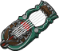
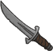
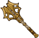

[Back to Main](index.md)

    
        Portrait
    
    
        Base Model
    
    
        Kar'niss Model
    

# Minthara

A member of the ancient House Baenre, Minthara is a True Soul in the service of the Absolute and one of the three leaders of the Goblin Camp in the Wilderness. She and her fellow True Souls, Priestess Gut and Dror Ragzlin, set up a base of operations in an old Selûnite temple in search of a Mysterious Artefact by order of the Absolute.

[Minthara - BG3 Wiki](https://bg3.wiki/wiki/Minthara)

# Basic Information

Minthara will be a new champion - potentially in the Feast of the Moon event on 6 November 2024. (It's possible they could be in a different event - we don't know yet.)

    
        
            **Seat**:
        
        
            Unknown
        
    
    
        
            **Race**:
        
        
            Drow (Guess)
        
    
    
        
            **Class**:
        
        
            Paladin (Guess)
        
    
    
        
            **Roles**:
        
        
            Unknown
        
    
    
        
            **Age**:
        
        
            Unknown
        
    
    
        
            **Gender**:
        
        
            Female (Guess)
        
    
    
        
            **Alignment**:
        
        
            Unknown
        
    
    
        
            **Affiliation**:
        
        
            Unknown
        
    

# Formation

Unknown.


    



# Attacks

Unknown.

# Abilities

**Ceremorphosis** (Guess)
> Unknown effect.

<em>Raw Data</em>

<pre>
{
    "id": 24876,
    "graphic": "Icons/Events/2017FeastOfTheMoon/Y8/Icon_Formation_Minthara_Ceremorphosis",
    "v": 2,
    "fs": 0,
    "p": 0,
    "type": 1,
    "export_params": {
        "uses": [
            "icon"
        ],
        "quantize": true
    }
}
</pre>

**Noble of Menzo** (Guess)
> Unknown effect.

<em>Raw Data</em>

<pre>
{
    "id": 24877,
    "graphic": "Icons/Events/2017FeastOfTheMoon/Y8/Icon_Formation_Minthara_NobleofMenzo",
    "v": 2,
    "fs": 0,
    "p": 0,
    "type": 1,
    "export_params": {
        "uses": [
            "icon"
        ],
        "quantize": true
    }
}
</pre>

**Oath of Vengeance** (Guess)
> Unknown effect.

<em>Raw Data</em>

<pre>
{
    "id": 24878,
    "graphic": "Icons/Events/2017FeastOfTheMoon/Y8/Icon_Formation_Minthara_OathofVengeance",
    "v": 2,
    "fs": 0,
    "p": 0,
    "type": 1,
    "export_params": {
        "uses": [
            "icon"
        ],
        "quantize": true
    }
}
</pre>

**Soul Branding** (Guess)
> Unknown effect.

<em>Raw Data</em>

<pre>
{
    "id": 24879,
    "graphic": "Icons/Events/2017FeastOfTheMoon/Y8/Icon_Formation_Minthara_SoulBranding",
    "v": 2,
    "fs": 0,
    "p": 0,
    "type": 1,
    "export_params": {
        "uses": [
            "icon"
        ],
        "quantize": true
    }
}
</pre>

# Specialisations

**House Matron** (Guess)
> Unknown effect.

<em>Raw Data</em>

<pre>
{
    "id": 24882,
    "graphic": "Icons/Events/2017FeastOfTheMoon/Y8/Icon_Specialization_Minthara_HouseMatron",
    "v": 2,
    "fs": 0,
    "p": 0,
    "type": 1,
    "export_params": {
        "uses": [
            "icon"
        ],
        "quantize": true
    }
}
</pre>

**Soul Destroyer** (Guess)
> Unknown effect.

<em>Raw Data</em>

<pre>
{
    "id": 24883,
    "graphic": "Icons/Events/2017FeastOfTheMoon/Y8/Icon_Specialization_Minthara_SoulDestroyer",
    "v": 2,
    "fs": 0,
    "p": 0,
    "type": 1,
    "export_params": {
        "uses": [
            "icon"
        ],
        "quantize": true
    }
}
</pre>

**True Soul** (Guess)
> Unknown effect.

<em>Raw Data</em>

<pre>
{
    "id": 24884,
    "graphic": "Icons/Events/2017FeastOfTheMoon/Y8/Icon_Specialization_Minthara_TrueSoul",
    "v": 2,
    "fs": 0,
    "p": 0,
    "type": 1,
    "export_params": {
        "uses": [
            "icon"
        ],
        "quantize": true
    }
}
</pre>

# Items

    
        
            **Icons**
        
        
            **Name**
        
    
    
        
            
        
        
            Armor
        
    
    
        
            
        
        
            Boots
        
    
    
        
            
        
        
            Clothing
        
    
    
        
            
        
        
            Lolth Drider
        
    
    
        
            
        
        
            Mind Flayer Absolute
        
    
    
        
            
        
        
            Weapon
        
    

# Feats

Unknown.

# Legendaries

Unknown.

# Adventures and Variants

**Unlock Adventure: The Crypt of Legends (???)** (Complete Area 50)
> Pay respects to the heroes of olde during the Feast of the Moon.

**Variant 1: TBD** (Complete Area 75)
> 

**Variant 2: TBD** (Complete Area 125)
> 

**Variant 3: TBD** (Complete Area 175)
> 

# Other Champion Images

    
        
            Console Portrait
        
    
    
        
            Gold Chest Icon
        
        
            Silver Chest Icon
        
    

[Back to Top](#top)

*Last Modified: {{ site.time }}*