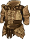

[Back to Main](index.md)

    
        
            
        
        
        Portrait
        
    
    
        
            
        
        
        Base Model
        
    
    
        
            
                
            
            
        
        
        Kar'niss Model
        
    

# Minthara

A member of the ancient House Baenre, Minthara is a True Soul in the service of the Absolute and one of the three leaders of the Goblin Camp in the Wilderness. She and her fellow True Souls, Priestess Gut and Dror Ragzlin, set up a base of operations in an old Selûnite temple in search of a Mysterious Artefact by order of the Absolute.

[Minthara - BG3 Wiki](https://bg3.wiki/wiki/Minthara)

# Basic Information

Minthara will be a new champion in the Feast of the Moon event on 6 November 2024.

    
        
            **Seat**:
        
        
            Unknown
        
    
    
        
            **Species**:
        
        
            Drow (Guess)
        
    
    
        
            **Class**:
        
        
            Paladin (Guess)
        
    
    
        
            **Roles**:
        
        
            Tanking / DPS / Support / Debuff (Guess)
        
    
    
        
            **Age**:
        
        
            Unknown
        
    
    
        
            **Gender**:
        
        
            Female (Guess)
        
    
    
        
            **Alignment**:
        
        
            Unknown
        
    
    
        
            **Affiliation**:
        
        
            Absolute Adversaries (Guess)
        
    

# Formation

    <svg xmlns="http://www.w3.org/2000/svg" id="Minthara" fill="#aaa" data-formationName="Minthara" data-campaignName="Feast of the Moon" width="338" height="160"><circle cx="175" cy="145" r="15"/><circle cx="135" cy="45" r="15"/><circle cx="135" cy="85" r="15"/><circle cx="135" cy="125" r="15"/><circle cx="95" cy="25" r="15"/><circle cx="95" cy="105" r="15"/><circle cx="55" cy="45" r="15"/><circle cx="55" cy="85" r="15"/><circle cx="55" cy="125" r="15"/><circle cx="15" cy="145" r="15"/><text x="205" y="25" fill="#dcdcdc" font-size="25" font-family="Arial" font-weight="bold">Minthara</text><text x="205" y="65" fill="#dcdcdc" font-size="15" font-family="Arial" font-weight="bold">Feast of the Moon</text></svg>

# Attacks

**Base Attack: Double Maces** (Melee)
> Minthara dashes toward the healthiest enemy and damages nearby foes with a swing of her maces.  
> Cooldown: 5s (Cap 1.25s)

<em>Raw Data</em>

<pre>
{
    "id": 810,
    "name": "Double Maces",
    "description": "Minthara dashes toward the healthiest enemy and damages nearby foes with a swing of her maces.",
    "long_description": "",
    "graphic_id": 0,
    "target": "highest_health",
    "num_targets": 1,
    "aoe_radius": 100,
    "damage_modifier": 1,
    "cooldown": 5,
    "animations": [
        {
            "type": "melee_attack",
            "damage_frame": 8,
            "target_offset_x": -40,
            "jump_sound": 30,
            "sound_frames": {
                "14": 154
            }
        }
    ],
    "tags": [
        "melee"
    ],
    "damage_types": [
        "melee"
    ]
}
</pre>

**Ultimate Attack: Spider's Lyre**
> Minthara summons Kar'niss the Drider to attack all enemies. In a non-boss area, the Champions advance to the next area if no enemies remain after the attack.  
> Cooldown: 350s (Cap 87.5s)

<em>Raw Data</em>

<pre>
{
    "id": 811,
    "name": "Spider's Lyre",
    "description": "A summoned Drider attacks all enemies, potentially completing the current area.",
    "long_description": "Minthara summons Kar'niss the Drider to attack all enemies. In a non-boss area, the Champions advance to the next area if no enemies remain after the attack.",
    "graphic_id": 24887,
    "target": "front",
    "num_targets": 1,
    "aoe_radius": 0,
    "damage_modifier": 0.03,
    "cooldown": 350,
    "animations": [
        {
            "type": "ultimate_attack",
            "ultimate": "minthara"
        }
    ],
    "tags": [
        "melee",
        "ultimate"
    ],
    "damage_types": [
        "melee"
    ]
}
</pre>

# Abilities

**Noble of Menzoberranzan** (Guess)
> Minthara gains a Strife stack for each Evil Champion in the formation, including herself. Minthara increases the damage of these Champions by 100% for each Strife stack, stacking multiplicatively.

<em>Raw Data</em>

<pre>
{
    "id": 2115,
    "flavour_text": "",
    "description": {
        "conditions": [
            {
                "condition": "upgrade_purchased 15946",
                "desc": "Minthara gains a Strife stack for each Evil or Neutral (Good/Evil axis) Champion in the formation, including herself. Minthara increases the damage of these Champions by $(amount)% for each Strife stack, stacking multiplicatively."
            },
            {
                "desc": "Minthara gains a Strife stack for each Evil Champion in the formation, including herself. Minthara increases the damage of these Champions by $(amount)% for each Strife stack, stacking multiplicatively."
            }
        ]
    },
    "effect_keys": [
        {
            "effect_string": "pre_stack,100",
            "skip_effect_key_desc": true
        },
        {
            "effect_string": "hero_dps_multiplier_mult,0",
            "amount_expr": "upgrade_amount(15942,0)",
            "targets": [
                "all"
            ],
            "filter_targets": [
                {
                    "type": "hero_expr",
                    "hero_expr": "HasTag(`evil`)"
                }
            ],
            "amount_func": "mult",
            "stack_func": "per_hero_attribute",
            "per_hero_expr": "HasTag(`evil`)",
            "amount_updated_listeners": [
                "slot_changed",
                "hero_tags_changed"
            ],
            "show_bonus": true,
            "stack_title": "Strife Stacks",
            "off_when_benched": true,
            "use_computed_amount_for_description": true
        }
    ],
    "requirements": "",
    "graphic_id": 24877,
    "large_graphic_id": 24871,
    "properties": {
        "is_formation_ability": true,
        "formation_circle_icon": true,
        "owner_use_outgoing_description": true,
        "indexed_effect_properties": true,
        "per_effect_index_bonuses": true,
        "default_bonus_index": 1
    }
}
</pre>

**Ceremorphosis** (Guess)
> Your formation gains one Ceremorphosis stack due to the mind flayer tadpole in Minthara's brain. Minthara increases the health of all other Champions by 20% of her max health, plus 2% for each Ceremorphosis stack the formation has, stacking additively.

<em>Raw Data</em>

<pre>
{
    "id": 2116,
    "flavour_text": "",
    "description": {
        "desc": "Your formation gains one Ceremorphosis stack due to the mind flayer tadpole in Minthara's brain. Minthara increases the health of all other Champions by $(not_buffed amount___3)% of her max health, plus $(not_buffed amount)% for each Ceremorphosis stack the formation has, stacking additively."
    },
    "effect_keys": [
        {
            "off_when_benched": true,
            "effect_string": "do_nothing,2",
            "stack_func": "per_ceremorphosis_stacks",
            "amount_func": "add",
            "show_bonus": true,
            "stack_title": "Total Ceremorphosis Stacks",
            "total_title": "Ceremorphosis Stack Bonus",
            "desc_forced_order": 2,
            "listen_for_computed_changes": true,
            "amount_updated_listeners": [
                "upgrade_unlocked",
                "slot_changed",
                "feat_changed"
            ]
        },
        {
            "off_when_benched": true,
            "outgoing_buffs": false,
            "effect_string": "minthara_ceremorphosis_stacks,1",
            "manual_stacking": true,
            "stacks_multiply": false,
            "show_stacks": true,
            "stack_title": "Minthara Ceremorphosis Stacks",
            "desc_forced_order": 1,
            "skip_effect_key_desc": true,
            "stack_func": "per_hero_attribute",
            "per_hero_expr": "0",
            "post_process_expr": "1 + 2*as_int(GetUpgradeUnlocked(15947))"
        },
        {
            "off_when_benched": true,
            "effect_string": "do_nothing,20",
            "skip_effect_key_desc": true
        },
        {
            "off_when_benched": true,
            "effect_string": "increase_health_by_source_percent,0",
            "amount_expr": "upgrade_amount(15943,2)+max_upgrade_amount(15943,0)",
            "percent_values": false,
            "round_bonus_value": true,
            "show_current_value_bonus_desc": false,
            "use_computed_amount_for_description": true,
            "override_key_desc": "Increases the Health of $target by $amount",
            "targets": [
                "other"
            ],
            "desc_forced_order": 3
        }
    ],
    "requirements": "",
    "graphic_id": 24876,
    "large_graphic_id": 24870,
    "properties": {
        "is_formation_ability": true,
        "formation_circle_icon": true,
        "owner_use_outgoing_description": true,
        "indexed_effect_properties": true,
        "per_effect_index_bonuses": true,
        "default_bonus_index": 3,
        "retain_on_slot_changed": true
    }
}
</pre>

**Soul Branding** (Guess)
> When Minthara damages an enemy, they take 100% additional damage from all subsequent attacks, stacking multiplicatively up to the number of Strife stacks Minthara has.

ⓘ *Note: This ability is prestack.*

<em>Raw Data</em>

<pre>
{
    "id": 2117,
    "flavour_text": "",
    "description": {
        "desc": "When Minthara damages an enemy, they take $(amount)% additional damage from all subsequent attacks, stacking multiplicatively up to the number of Strife stacks Minthara has.",
        "post": {
            "conditions": [
                {
                    "condition": "not static_desc",
                    "desc": "^^Max Stacks: $minthara_max_stacks"
                }
            ]
        }
    },
    "effect_keys": [
        {
            "effect_string": "pre_stack,100"
        },
        {
            "effect_string": "minthara_soul_branding",
            "off_when_benched": true,
            "broadcast_name": "minthara_debuffs_monster",
            "debuff_before_damage": true,
            "debuff_max_stacks": 5,
            "debuffing_attack_ids": [
                810
            ],
            "soul_destroyer_upgrade_id": 15948,
            "debuff_effects": [
                {
                    "effect_string": "minthara_increase_monster_damage,0",
                    "amount_expr": "upgrade_amount(15944,0)",
                    "is_minthara_debuff": true,
                    "active_graphic_id": 24888,
                    "active_graphic_y": -120,
                    "use_stack_as_frame": true,
                    "use_stack_as_alpha": true,
                    "stack_count_debug": false,
                    "min_stack_alpha": 0.4,
                    "pre_max_stack_alpha": 0.8,
                    "stack_as_frame_offset": 0,
                    "overlay_play_mode": "stopped",
                    "bottom": false,
                    "stacks_on_reapply": true,
                    "manual_stacking": true,
                    "max_stacks": 5,
                    "stacks_multiply": true,
                    "use_collection_source": false,
                    "stack_across_effects": false
                }
            ],
            "max_stack_expression": "HasTag(`evil`)"
        }
    ],
    "requirements": "",
    "graphic_id": 24879,
    "large_graphic_id": 24873,
    "properties": {
        "is_formation_ability": true,
        "formation_circle_icon": false,
        "owner_use_outgoing_description": true,
        "indexed_effect_properties": true,
        "per_effect_index_bonuses": true,
        "default_bonus_index": 0,
        "retain_on_slot_changed": true
    }
}
</pre>

**Oath of Vengeance** (Guess)
> Minthara provides benefits based on the number of Strife stacks she has.  
> 3+ Strife stacks: Unyielding: Minthara increases her health by 10% for each Strife stack she has, stacking additively.  
> 5+ Strife stacks: Piercing: Enemies affected by at least two Soul Branding stacks lose an additional armor or segmented health piece when they are attacked.  
> 7+ Strife stacks: Scarring: When Minthara damages an enemy, she immediately applies the maximum possible number of Soul Branding stacks.  
> 9+ Strife stacks: Nobility: Increases the base value of Noble of Menzoberranzan by 400%.

<em>Raw Data</em>

<pre>
{
    "id": 2118,
    "flavour_text": "",
    "description": {
        "desc": "Minthara provides benefits based on the number of Strife stacks she has.^3+ Strife stacks: Unyielding: Minthara increases her health by $(amount___2)% for each Strife stack she has, stacking additively.^5+ Strife stacks: Piercing: Enemies affected by at least two Soul Branding stacks lose an additional armor or segmented health piece when they are attacked.^7+ Strife stacks: Scarring: When Minthara damages an enemy, she immediately applies the maximum possible number of Soul Branding stacks.^9+ Strife stacks: Nobility: Increases the base value of Noble of Menzoberranzan by $(amount___5)%."
    },
    "effect_keys": [
        {
            "effect_string": "apply_effects_at_stacks",
            "show_description": false,
            "apply_effect_stack_amounts": [
                3,
                5,
                7,
                9
            ],
            "show_stacks": true,
            "stacks_are_bonus": false,
            "stacks_from_amount_func": "per_crusader",
            "target_filters": [
                {
                    "type": "tags",
                    "tags": "evil"
                }
            ],
            "amount_updated_listeners": [
                "slot_changed",
                "hero_tags_changed"
            ],
            "off_when_benched": true,
            "active_effect_key_description_prepender": "- ",
            "active_effect_key_description_joiner": "^"
        },
        {
            "effect_string": "health_mult,10",
            "apply_manually": true,
            "off_when_benched": true,
            "amount_func": "add",
            "stack_func": "per_hero_attribute",
            "per_hero_expr": "HasTag(`evil`)",
            "amount_updated_listeners": [
                "slot_changed",
                "hero_tags_changed"
            ],
            "override_key_desc": "Minthara increases her health by 10% for each Strife stack she has, stacking additively.",
            "show_bonus": false,
            "show_stacks": false
        },
        {
            "effect_string": "increase_damage_against_monster_armor_and_hits,1",
            "apply_manually": true,
            "off_when_benched": true,
            "monster_has_effect_key": "minthara_increase_monster_damage",
            "required_stacks": 2,
            "targets": [
                "all"
            ],
            "override_key_desc": "Monsters affected by at least two Soul Branding stacks lose an additional armor or segmented health piece when they are attacked."
        },
        {
            "effect_string": "minthara_apply_max_stacks",
            "apply_manually": true,
            "off_when_benched": true,
            "override_key_desc": "When Minthara damages an enemy, she immediately applies the maximum possible number of Soul Branding stacks.",
            "show_bonus": false,
            "show_stacks": false
        },
        {
            "effect_string": "buff_upgrade,400,15942,0",
            "apply_manually": true,
            "off_when_benched": true,
            "override_key_desc": "Increases the base value of Noble of Menzoberranzan by 400%."
        }
    ],
    "requirements": "",
    "graphic_id": 24878,
    "large_graphic_id": 24872,
    "properties": {
        "is_formation_ability": true,
        "formation_circle_icon": false,
        "owner_use_outgoing_description": false,
        "indexed_effect_properties": true,
        "per_effect_index_bonuses": true,
        "default_bonus_index": 0
    }
}
</pre>

# Specialisations

**House Matron** (Guess)
> Noble of Menzoberranzan now also grants Strife stacks for Neutral Champions in the formation (on the Good/Evil axis).

<em>Raw Data</em>

<pre>
{
    "id": 2119,
    "flavour_text": "",
    "description": {
        "desc": "Noble of Menzoberranzan now also grants Strife stacks for Neutral Champions in the formation (on the Good/Evil axis)."
    },
    "effect_keys": [
        {
            "effect_string": "change_upgrade_data,15942,1",
            "data": {
                "filter_targets": [
                    {
                        "type": "hero_expr",
                        "hero_expr": "HasTag(`geneutral`)||HasTag(`evil`)"
                    }
                ]
            },
            "off_when_benched": true
        },
        {
            "effect_string": "change_upgrade_data,15942,1",
            "data": {
                "per_hero_expr": "HasTag(`geneutral`)||HasTag(`evil`)"
            },
            "off_when_benched": true,
            "skip_effect_key_desc": true
        },
        {
            "effect_string": "change_upgrade_data,15944,1",
            "data": {
                "max_stack_expression": "HasTag(`geneutral`)||HasTag(`evil`)"
            },
            "off_when_benched": true,
            "skip_effect_key_desc": true
        },
        {
            "effect_string": "change_upgrade_data,15945,0",
            "data": {
                "target_filters": [
                    {
                        "type": "tags",
                        "tags": "evil|geneutral"
                    }
                ]
            },
            "off_when_benched": true,
            "skip_effect_key_desc": true
        },
        {
            "effect_string": "change_upgrade_data,15945,1",
            "data": {
                "per_hero_expr": "HasTag(`geneutral`)||HasTag(`evil`)"
            },
            "off_when_benched": true,
            "skip_effect_key_desc": true
        }
    ],
    "requirements": "",
    "graphic_id": 24882,
    "large_graphic_id": 24882,
    "properties": {
        "is_formation_ability": true,
        "formation_circle_icon": true,
        "owner_use_outgoing_description": true,
        "indexed_effect_properties": true,
        "per_effect_index_bonuses": true,
        "default_bonus_index": 0
    }
}
</pre>

**Soul Destroyer** (Guess)
> Your formation gains 2 additional Ceremorphosis stacks.

<em>Raw Data</em>

<pre>
{
    "id": 2120,
    "flavour_text": "",
    "description": {
        "desc": "Your formation gains 2 additional Ceremorphosis stacks."
    },
    "effect_keys": [
        {
            "off_when_benched": true,
            "outgoing_buffs": false,
            "effect_string": "minthara_ceremorphosis_stacks,2",
            "manual_stacking": true,
            "stacks_multiply": false,
            "desc_forced_order": 1
        }
    ],
    "requirements": "",
    "graphic_id": 24884,
    "large_graphic_id": 24884,
    "properties": {
        "is_formation_ability": true,
        "owner_use_outgoing_description": true,
        "formation_circle_icon": false
    }
}
</pre>

**True Soul** (Guess)
> The maximum number of Soul Branding stacks is doubled.

<em>Raw Data</em>

<pre>
{
    "id": 2121,
    "flavour_text": "",
    "description": {
        "desc": "The maximum number of Soul Branding stacks is doubled."
    },
    "effect_keys": [
        {
            "effect_string": "minthara_multiply_max_stacks,100",
            "off_when_benched": true
        }
    ],
    "requirements": "",
    "graphic_id": 24883,
    "large_graphic_id": 24883,
    "properties": {
        "is_formation_ability": true,
        "owner_use_outgoing_description": true,
        "formation_circle_icon": false
    }
}
</pre>

# Items

    
        
            **Icons**
        
        
            **Name**
        
    
    
        
            
        
        
            Armor
        
    
    
        
            
        
        
            Boots
        
    
    
        
            
        
        
            Clothing
        
    
    
        
            
        
        
            Lolth Drider
        
    
    
        
            
        
        
            Mind Flayer Absolute
        
    
    
        
            
        
        
            Weapon
        
    

# Feats

Unknown.

# Legendaries

Unknown.

# Adventures and Variants

**Unlock Adventure: The Crypt of Legends (Minthara)** (Complete Area 50)
> Pay respects to the heroes of olde during the Feast of the Moon.

 **Variant 1: Ex-True Soul of the Absolute** (Complete Area 75)
> Minthara starts in the formation. She can be moved, but not removed.  
> You may only use Evil and/or Neutral Champions.  
> Getting to Know Minthara: Minthara works well with Evil Champions, and a specialization choice extends that to include Neutral Champions.

 **Variant 2: Moonrise Escape** (Complete Area 125)
> Minthara starts in the formation. She can be moved, but not removed.  
> You may not use tanking Champions other than Minthara.  
> One Zealot of the Absolute with 8 armored health spawns with each wave. They don't drop gold nor count towards quest progress.  
> Getting to Know Minthara: Minthara is a Tanking Champion that can help cut through enemies with armored or segmented health. Increase her Strife stacks to 5 or more to make it even easier!

 **Variant 3: Brand Value** (Complete Area 175)
> Minthara starts in the formation with her Soul Branding ability unlocked. She can be moved, but not removed.  
> Enemies that don't have an active debuff reduce all normal attack damage to just 1 point of damage.  
> Getting to Know Minthara: Minthara debuffs enemies with each attack. Use her and other debuffing Champions to cut through these pesky foes!

# Other Champion Images

    
        
            Console Portrait
        
    
    
        
            Gold Chest Icon
        
        
            Silver Chest Icon
        
    

[Back to Top](#top)

*Last Modified: {{ site.time }}*