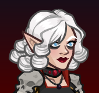
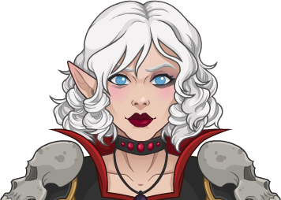
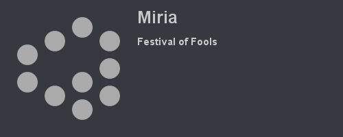

[Back to Main](index.md)

|:--|--:|
|  |  |

# Miria

I know even less about this champion than I do about Solaak.

# Basic Information

Miria will be the new champion in the Festival of Fools event on 15 March 2023.

* Seat: Unknown
* Race: Unknown
* Class: Wizard (Guess)
* Roles: Unknown
* Gender: Female (Guess)
* Alignment: Unknown
* Affiliation: Unknown
* Stats: Unknown

# Formation

Unknown.
<!--  -->

# Abilities

**Base Attack: Ray of Sickness** (Guess)
> Unknown effect.

<em>Raw Data</em>

<pre>
{
    "p": 0,
    "v": 2,
    "id": 18242,
    "export_params": {
        "uses": ["effect"],
        "export_animation": true
    },
    "type": 1,
    "graphic": "Effects/Effect_MiriaRayofSickness",
    "fs": 0
}
</pre>

 

**Ultimate Attack: Unknown**
> Unknown effect.

<em>Raw Data</em>

<pre>
</pre>

 

**Clone**
> Unknown effect.

<em>Raw Data</em>

<pre>
{
    "p": 0,
    "v": 2,
    "id": 18260,
    "export_params": {"uses": ["icon"]},
    "type": 1,
    "graphic": "Icons/Events/2018FestivalofFools/FestivalofFools_Y6/Icon_Formation_MiriaClone",
    "fs": 0
}
</pre>

 

**Life Transference**
> Unknown effect.

<em>Raw Data</em>

<pre>
{
    "p": 0,
    "v": 2,
    "id": 18261,
    "export_params": {"uses": ["icon"]},
    "type": 1,
    "graphic": "Icons/Events/2018FestivalofFools/FestivalofFools_Y6/Icon_Formation_MiriaLifeTransference",
    "fs": 0
}
</pre>

 

**Mage of High Society**
> Unknown effect.

<em>Raw Data</em>

<pre>
{
    "p": 0,
    "v": 2,
    "id": 18262,
    "export_params": {"uses": ["icon"]},
    "type": 1,
    "graphic": "Icons/Events/2018FestivalofFools/FestivalofFools_Y6/Icon_Formation_MiriaMageofHighSociety",
    "fs": 0
}
</pre>

 

**Soul Cage**
> Unknown effect.

<em>Raw Data</em>

<pre>
{
    "p": 0,
    "v": 2,
    "id": 18263,
    "export_params": {"uses": ["icon"]},
    "type": 1,
    "graphic": "Icons/Events/2018FestivalofFools/FestivalofFools_Y6/Icon_Formation_MiriaSoulCage",
    "fs": 0
}
</pre>

 

**Zombie Bodyguards**
> Unknown effect.

<em>Raw Data</em>

<pre>
{
    "p": 0,
    "v": 2,
    "id": 18264,
    "export_params": {"uses": ["icon"]},
    "type": 1,
    "graphic": "Icons/Events/2018FestivalofFools/FestivalofFools_Y6/Icon_Formation_MiriaZombieBodyguards",
    "fs": 0
}
</pre>

 

# Specialisations

**Independent**
> Unknown effect.

<em>Raw Data</em>

<pre>
{
    "p": 0,
    "v": 2,
    "id": 18265,
    "export_params": {"uses": ["icon"]},
    "type": 1,
    "graphic": "Icons/Events/2018FestivalofFools/FestivalofFools_Y6/Icon_Specialization_MiriaIndependent",
    "fs": 0
}
</pre>

 

**Intellectual**
> Unknown effect.

<em>Raw Data</em>

<pre>
{
    "p": 0,
    "v": 2,
    "id": 18266,
    "export_params": {"uses": ["icon"]},
    "type": 1,
    "graphic": "Icons/Events/2018FestivalofFools/FestivalofFools_Y6/Icon_Specialization_MiriaIntellectual",
    "fs": 0
}
</pre>

 

**Methodical**
> Unknown effect.

<em>Raw Data</em>

<pre>
{
    "p": 0,
    "v": 2,
    "id": 18267,
    "export_params": {"uses": ["icon"]},
    "type": 1,
    "graphic": "Icons/Events/2018FestivalofFools/FestivalofFools_Y6/Icon_Specialization_MiriaMethodical",
    "fs": 0
}
</pre>

 

# Items

| Slot | Name | Type |
|---|---|---|
| 1 | `Black Robes` | Unknown |
| 2 | `Cube of Force` | Unknown |
| 3 | `Fashionable Jewellery` | Unknown |
| 4 | `Necromancy Fashion` | Unknown |
| 5 | `Soul Cage` | Unknown |
| 6 | `Star Jewel` | Unknown |

# Feats

Unknown.

# Legendaries

Unknown.

[Back to Top](#top)

*Last Modified: {{ site.time }}*