[Back to Main](index.md)

    
        
            
        
        
            Portrait
        
    
    
        
            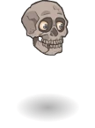
        
        
            Model
        
    

# Mortimer Rictusgrin

[Morte - Fandom Wiki](https://forgottenrealms.fandom.com/wiki/Morte){:target="_blank"}

# Basic Information

Mortimer Rictusgrin will be a new champion in the Feast of the Moon event on 4 November 2026.

  **Seat**:
  Unknown
  **Species**:
  Unknown
  **Class**:
  Unknown
  **Roles**:
  Unknown
  **Age**:
  Unknown
  **Gender**:
  Male (Guess)
  **Alignment**:
  Unknown
  **Affiliation**:
  Unknown

# Formation

Unknown.


    



# Attacks

Unknown.

# Abilities

**Biting Wit** (Guess)
> Unknown effect.

<em>Raw Data</em>

<pre>
{
    "id": 31388,
    "graphic": "Icons/Events/2017FeastOfTheMoon/Y10/Icon_Formation_Morte_BitingWit",
    "v": 2,
    "fs": 0,
    "p": 0,
    "type": 1,
    "export_params": {
        "uses": [
            "formation_icon"
        ],
        "quantize": true
    }
}
</pre>

**Don't Trust the Skull** (Guess)
> Unknown effect.

<em>Raw Data</em>

<pre>
{
    "id": 31389,
    "graphic": "Icons/Events/2017FeastOfTheMoon/Y10/Icon_Formation_Morte_DontTrusttheSkull",
    "v": 2,
    "fs": 0,
    "p": 0,
    "type": 1,
    "export_params": {
        "uses": [
            "formation_icon"
        ],
        "quantize": true
    }
}
</pre>

**Give 'em the Laugh** (Guess)
> Unknown effect.

<em>Raw Data</em>

<pre>
{
    "id": 31390,
    "graphic": "Icons/Events/2017FeastOfTheMoon/Y10/Icon_Formation_Morte_GiveEmtheLaugh",
    "v": 2,
    "fs": 0,
    "p": 0,
    "type": 1,
    "export_params": {
        "uses": [
            "formation_icon"
        ],
        "quantize": true
    }
}
</pre>

**Heads Up Chief** (Guess)
> Unknown effect.

<em>Raw Data</em>

<pre>
{
    "id": 31391,
    "graphic": "Icons/Events/2017FeastOfTheMoon/Y10/Icon_Formation_Morte_HeadsUpChief",
    "v": 2,
    "fs": 0,
    "p": 0,
    "type": 1,
    "export_params": {
        "uses": [
            "formation_icon"
        ],
        "quantize": true
    }
}
</pre>

**Litany of Curses** (Guess)
> Unknown effect.

<em>Raw Data</em>

<pre>
{
    "id": 31392,
    "graphic": "Icons/Events/2017FeastOfTheMoon/Y10/Icon_Formation_Morte_LitanyofCurses",
    "v": 2,
    "fs": 0,
    "p": 0,
    "type": 1,
    "export_params": {
        "uses": [
            "formation_icon"
        ],
        "quantize": true
    }
}
</pre>

**Planar Traveler** (Guess)
> Unknown effect.

<em>Raw Data</em>

<pre>
{
    "id": 31393,
    "graphic": "Icons/Events/2017FeastOfTheMoon/Y10/Icon_Formation_Morte_PlanarTraveler",
    "v": 2,
    "fs": 0,
    "p": 0,
    "type": 1,
    "export_params": {
        "uses": [
            "formation_icon"
        ],
        "quantize": true
    }
}
</pre>

# Specialisations

**Cross Trade Companions** (Guess)
> Unknown effect.

<em>Raw Data</em>

<pre>
{
    "id": 31394,
    "graphic": "Icons/Events/2017FeastOfTheMoon/Y10/Icon_Specialization_Morte_CrossTradeCompanions",
    "v": 2,
    "fs": 0,
    "p": 0,
    "type": 1,
    "export_params": {
        "uses": [
            "specialization_icon"
        ],
        "quantize": true
    }
}
</pre>

**Dodgy Tactics** (Guess)
> Unknown effect.

<em>Raw Data</em>

<pre>
{
    "id": 31395,
    "graphic": "Icons/Events/2017FeastOfTheMoon/Y10/Icon_Specialization_Morte_DodgyTactics",
    "v": 2,
    "fs": 0,
    "p": 0,
    "type": 1,
    "export_params": {
        "uses": [
            "specialization_icon"
        ],
        "quantize": true
    }
}
</pre>

**Floating Flirt** (Guess)
> Unknown effect.

<em>Raw Data</em>

<pre>
{
    "id": 31396,
    "graphic": "Icons/Events/2017FeastOfTheMoon/Y10/Icon_Specialization_Morte_FloatingFlirt",
    "v": 2,
    "fs": 0,
    "p": 0,
    "type": 1,
    "export_params": {
        "uses": [
            "specialization_icon"
        ],
        "quantize": true
    }
}
</pre>

**Laughing Skull** (Guess)
> Unknown effect.

<em>Raw Data</em>

<pre>
{
    "id": 31397,
    "graphic": "Icons/Events/2017FeastOfTheMoon/Y10/Icon_Specialization_Morte_LaughingSkull",
    "v": 2,
    "fs": 0,
    "p": 0,
    "type": 1,
    "export_params": {
        "uses": [
            "specialization_icon"
        ],
        "quantize": true
    }
}
</pre>

**Misfits of the Maze** (Guess)
> Unknown effect.

<em>Raw Data</em>

<pre>
{
    "id": 31398,
    "graphic": "Icons/Events/2017FeastOfTheMoon/Y10/Icon_Specialization_Morte_MisfitsoftheMaze",
    "v": 2,
    "fs": 0,
    "p": 0,
    "type": 1,
    "export_params": {
        "uses": [
            "specialization_icon"
        ],
        "quantize": true
    }
}
</pre>

**What's Eatin' You Chief** (Guess)
> Unknown effect.

<em>Raw Data</em>

<pre>
{
    "id": 31399,
    "graphic": "Icons/Events/2017FeastOfTheMoon/Y10/Icon_Specialization_Morte_WhatsEatinYouChief",
    "v": 2,
    "fs": 0,
    "p": 0,
    "type": 1,
    "export_params": {
        "uses": [
            "specialization_icon"
        ],
        "quantize": true
    }
}
</pre>

# Items

    
        
            **Icons**
        
        
            **Name**
        
    
    
        
            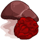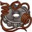
        
        
            Lostand Found
        
    
    
        
            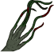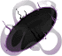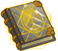
        
        
            Other Things
        
    
    
        
            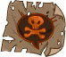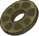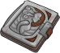
        
        
            Readin Materials
        
    
    
        
            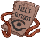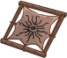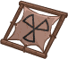
        
        
            Tattoos
        
    
    
        
            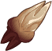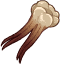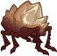
        
        
            Teeth
        
    
    
        
            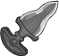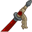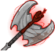
        
        
            Weaponsof Friends
        
    

# Feats

Unknown.

# Legendaries

Unknown.

# Adventures and Variants

Unknown.

# Other Champion Images

    
        
            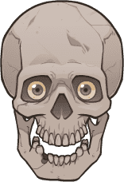Console Portrait
        
    
    
        
            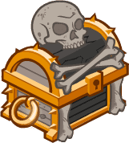Gold Chest Icon
        
        
            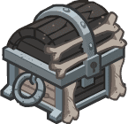Silver Chest Icon
        
    

[Back to Top](#top)

*Last Modified: {{ site.time }}*