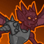
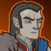

[Back to Main](index.md)

    
        
            
        
        
            Portrait
        
    

# Nahara

Nahara is a reborn fallen Aasimar undead warlock/college of the spirits bard. She fell into the mists of Ravenloft unable to remember anything from her life (or past lives as we've come to learn). All she knows is that her current Patron, Azalin Rex, has asked her to aid him against his foe Strahd von Zarovich, who for reasons unknown to her, has been desperately seeking her out.

# Changes

Nahara is potentially a reworked champion in the Founders' Day event and delayed until 8 July 2026.

Only abilities that have seen some changes will be displayed here - and be aware that there's a lot of guesswork involved. Some abilities may not have names - some may have the *wrong* names - or specialisations might not be marked as such - etc.. Focus on the effect data itself.

Please do me a favour and don't get all melodramatic about what you find here. I - and CNE - don't appreciate it. These are spoilers and will almost certainly change before release - likely multiple times. That and we don't have access to any upgrade data prior to release. Making assumptions on how the champions will turn out based on this information would be premature.

# Abilities

**To Amuse or Avenge** (Guess)
> When Nahara attacks and defeats at least one enemy, she gains a Levity stack, with a maximum of 30 stacks. When she attacks and doesn't defeat an enemy, she loses a Levity stack. Nahara gets a 10% damage bonus for each Levity stack she has below 30, and at the start of each area, she reduces the area requirements by 2% for each Levity stack above 15.

<em>Raw Data</em>

<pre>
{
    "id": 2750,
    "flavour_text": "",
    "description": {
        "desc": "When $(source_hero) attacks and defeats at least one enemy, she gains a Levity stack, with a maximum of $(max_stacks___2) stacks. When she attacks and doesn't defeat an enemy, she loses a Levity stack. $(source_hero) gets a $(amount)% damage bonus for each Levity stack she has below $(max_stacks___2), and at the start of each area, she reduces the area requirements by $(amount___4)% for each Levity stack above $(start_stacks___2)."
    },
    "effect_keys": [
        {
            "effect_string": "pre_stack,10",
            "off_when_benched": true
        },
        {
            "effect_string": "nahara_to_amuse_or_avenge,1",
            "stack_title": "Levity Stacks",
            "manual_stacking": true,
            "clear_stacks_on_deactivate": false,
            "start_stacks": 15,
            "max_stacks": 30,
            "stacks_multiply": false,
            "show_stacks": true,
            "desc_forced_order": 0,
            "damage_buff_index": 2,
            "quest_buff_index": 3
        },
        {
            "off_when_benched": true,
            "effect_string": "hero_dps_multiplier_mult,0",
            "amount_expr": "upgrade_amount(19720,0)",
            "manual_stacking": true,
            "stacks_multiply": true,
            "total_title": "Total Damage Bonus",
            "show_bonus": true,
            "show_advanced_info": false,
            "prepend_line_break": false,
            "desc_forced_order": 1
        },
        {
            "off_when_benched": true,
            "effect_string": "chance_reduce_quest_requirement,2,100",
            "manual_stacking": true,
            "stacks_multiply": false,
            "total_title": "Total Quest Requirement Reduction",
            "show_bonus": true,
            "show_advanced_info": false,
            "prepend_line_break": false,
            "desc_forced_order": 2
        }
    ],
    "requirements": "",
    "graphic_id": 14618,
    "large_graphic_id": 14614,
    "properties": {
        "is_formation_ability": true,
        "owner_use_outgoing_description": true,
        "indexed_effect_properties": true,
        "per_effect_index_bonuses": true,
        "default_bonus_index": 2
    }
}
</pre>

**Strong Society** (Guess)
> Nahara's damage is increased by 400% for each Black Dice Society affiliation member in the formation, stacking multiplicatively.

<em>Raw Data</em>

<pre>
{
    "id": 2751,
    "flavour_text": "",
    "description": {
        "desc": "$(source_hero)'s damage is increased by $(amount)% for each Black Dice Society affiliation member in the formation, stacking multiplicatively."
    },
    "effect_keys": [
        {
            "effect_string": "strong_society_base,400"
        },
        {
            "effect_string": "hero_dps_mult_per_tagged_crusader_mult,0,blackdicesociety",
            "amount_expr": "upgrade_amount(19721,0)",
            "stacks_multiply": true,
            "exclude_self": false,
            "stack_title": "Black Dice Society Members"
        }
    ],
    "requirements": "",
    "graphic_id": 14617,
    "large_graphic_id": 14613,
    "properties": {
        "is_formation_ability": true,
        "owner_use_outgoing_description": true,
        "indexed_effect_properties": true,
        "per_effect_index_bonuses": true,
        "default_bonus_index": 0
    }
}
</pre>

# Specialisations

**Specialisation: A Grave Experience** (Guess)
> The $(upgrade_name id) counter increments three times for every area cleared.

<em>Raw Data</em>

<pre>
{
    "id": 2771,
    "flavour_text": "",
    "description": {
        "desc": "The $(upgrade_name id) counter increments three times for every area cleared."
    },
    "effect_keys": [
        {
            "effect_string": "change_upgrade_data,19719,0",
            "data": {
                "base_stack_amount": 3
            }
        }
    ],
    "requirements": "",
    "graphic_id": 0,
    "large_graphic_id": 0,
    "properties": {
        "is_formation_ability": true,
        "owner_use_outgoing_description": true,
        "type": "upgrade",
        "formation_circle_icon": false
    }
}
</pre>

**Specialisation: A Barovian Bond** (Guess)
> $(upgrade_name id) gets a 400% increase and Black Dice Society members can be used if Strahd is currently the Patron, even if they do not qualify for the other variant requirements.

<em>Raw Data</em>

<pre>
{
    "id": 2772,
    "flavour_text": "",
    "description": {
        "desc": "$(upgrade_name id) gets a $(amount)% increase and Black Dice Society members can be used if Strahd is currently the Patron, even if they do not qualify for the other variant requirements."
    },
    "effect_keys": [
        {
            "effect_string": "buff_upgrade,400,19721,0"
        },
        {
            "off_when_benched": true,
            "effect_string": "force_allow_hero_by_tag,blackdicesociety",
            "valid_for_patron_ids": [
                3
            ]
        }
    ],
    "requirements": "",
    "graphic_id": 0,
    "large_graphic_id": 0,
    "properties": {
        "is_formation_ability": true,
        "owner_use_outgoing_description": true,
        "type": "upgrade",
        "formation_circle_icon": false,
        "retain_on_slot_changed": true,
        "spec_option_post_apply_info": "Additional Champions Unlocked: $active_effect_key_handler_exclude_owner___2",
        "dont_disable": true
    }
}
</pre>

**Specialisation: A Skilled Lyre** (Guess)
> The area reduction in $(upgrade_name id) is increased by 50%.

<em>Raw Data</em>

<pre>
{
    "id": 2773,
    "flavour_text": "",
    "description": {
        "desc": "The area reduction in $(upgrade_name id) is increased by $(amount)%."
    },
    "effect_keys": [
        {
            "effect_string": "buff_upgrade,50,19720,3"
        }
    ],
    "requirements": "",
    "graphic_id": 0,
    "large_graphic_id": 0,
    "properties": {
        "is_formation_ability": true,
        "owner_use_outgoing_description": true,
        "type": "upgrade",
        "formation_circle_icon": false
    }
}
</pre>

# Adventures and Variants

**Unlock Adventure: Party Crashers (Nahara)** (Complete Area 50)
> Save Waterdeep from the chaos of a Founders' Day gone awry.

 **Variant 1: Durable Devils** (Complete Area 75)
> Nahara starts in the formation. She can be moved, but not removed.  
> Armored Imps appear in each area. They do not drop gold, nor do they count towards quest progress.  
> Getting to Know Nahara: If Nahara attacks an enemy and doesn't defeat it, she'll continue to target it until it is vanquished.

 **Variant 2: Double Trouble** (Complete Area 125)
> Nahara starts in the formation. She can be moved, but not removed.  
> Normal area requirements are doubled.  
> Getting to Know Nahara: When Nahara is easily taking out enemies, she decreases the next area's requirements. Unlock her "To Amuse or Avenge" to progress faster!

 **Variant 3: Barovian Bliss** (Complete Area 175)
> The weather is foggy in all areas.  
> Only Champions with an INT of 13+ and/or Black Dice Society affiliation members may be used.  
> Each boss area features Strahd as an additional boss that must be defeated to progress.  
> Getting to know Nahara: Nahara's ties to Strahd means she's always available to adventure when he is your patron.

# Formation

    <svg xmlns="http://www.w3.org/2000/svg" id="Nahara" fill="#aaa" data-formationName="Nahara" data-campaignName="Founders' Day" width="352" height="140"><circle cx="215" cy="125" r="15"/><circle cx="175" cy="65" r="15"/><circle cx="175" cy="105" r="15"/><circle cx="135" cy="45" r="15"/><circle cx="135" cy="85" r="15"/><circle cx="135" cy="125" r="15"/><circle cx="95" cy="65" r="15"/><circle cx="95" cy="105" r="15"/><circle cx="55" cy="45" r="15"/><circle cx="15" cy="25" r="15"/><text x="245" y="25" fill="#dcdcdc" font-size="25" font-family="Arial" font-weight="bold">Nahara</text><text x="245" y="65" fill="#dcdcdc" font-size="15" font-family="Arial" font-weight="bold">Founders' Day</text></svg>

[Back to Top](#top)

*Last Modified: {{ site.time }}*