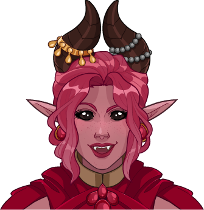

[Back to Main](index.md)

# Nixie

Nixie is a "tiefling sorcerer and pyromaniac" from the 1 For All sketch show.

[https://tvtropes.org/pmwiki/pmwiki.php/Characters/OneForAll](https://tvtropes.org/pmwiki/pmwiki.php/Characters/OneForAll)

# Basic Information

Nixie will be the new champion in the The Running event on 3 May 2023.

* Seat: Unknown
* Race: Tiefling (Guess)
* Class: Sorcerer (Guess)
* Roles: DPS / Support (Guess)
* Age: Unknown
* Gender: Female (Guess)
* Alignment: Unknown
* Affiliation: Awful Ones (Guess)
* Stats: Unknown

# Formation

# Abilities

**Base Attack: Fireball?** (Magic)
> Nixie attacks with a ball of fire centered on a random target dealing 1 hit of damage to all enemies in a small radius.

<em>Raw Data</em>

<pre>
{
    "description": "Nixie attacks with a ball of fire centered on a random target dealing 1 hit of damage to all enemies in a small radius.",
    "long_description": "",
    "damage_modifier": 1,
    "damage_types": ["magic"],
    "graphic_id": 0,
    "target": "random",
    "aoe_radius": 150,
    "tags": [
        "ranged",
        "aoe"
    ],
    "num_targets": 1,
    "animations": [{
        "projectile_details": {
            "projectile_hit_graphic_id": 750,
            "trail": {
                "scale_lerp": [
                    {
                        "x": 1,
                        "y": 1
                    },
                    {
                        "x": 0,
                        "y": 0
                    }
                ],
                "lifespan": 0.2,
                "initial_velocity": {
                    "x": 0,
                    "y": 0
                },
                "alpha_lerp": {
                    "0": 0,
                    "1": 0,
                    "0.1": 0.75
                },
                "tint": {
                    "a": 1,
                    "r": 1,
                    "b": 1,
                    "g": 1
                },
                "particle_graphic_ids": [
                    19009,
                    6093,
                    749
                ],
                "spawn_rate": 100,
                "velocity_jitter": {
                    "x": 50,
                    "y": 50
                }
            },
            "percent_height_offset": 10,
            "use_auto_rotation": true,
            "name": "nixie_fireball",
            "projectile_graphic_id": 19009,
            "projectile_speed": 1500,
            "rotation_speed": 0
        },
        "hit_sound": 133,
        "shoot_offset_y": -20,
        "shoot_offset_x": 50,
        "shoot_sound": 149,
        "type": "ranged_attack",
        "projectile": "pd_generic_projectile",
        "shoot_frame": 9
    }],
    "name": "Fireball?",
    "cooldown": 6,
    "id": 620
}
</pre>

 

**Base Attack: Potted Plant** (Magic)
> Nixie is currently a plant and cannot attack.

<em>Raw Data</em>

<pre>
{
    "description": "Nixie is currently a plant and cannot attack.",
    "long_description": "",
    "damage_modifier": 0,
    "damage_types": ["magic"],
    "graphic_id": 0,
    "target": "none",
    "aoe_radius": 0,
    "tags": [
        "ranged",
        "aoe"
    ],
    "num_targets": 0,
    "animations": [{
        "no_cooldown_display": true,
        "no_jump": true,
        "animation_sequence_name": "special",
        "type": "melee_attack",
        "no_damage_display": true
    }],
    "name": "Potted Plant",
    "cooldown": 6,
    "id": 622
}
</pre>

 

**Ultimate Attack: FIREBALL!!!**
> Nixie casts a gigantic fireball that engulfs the entire enemy's side of the screen, dealing 1 ultimate hit to all enemies. In addition, there is a 10% chance for each monster hit by this attack to be surrounded by Engulfing Flames.

<em>Raw Data</em>

<pre>
{
    "description": "Nixie casts a fireball that engulfs the battlefield, hitting all enemies.  Each monster hit may be surrounded by Engulfing Flames.",
    "long_description": "Nixie casts a gigantic fireball that engulfs the entire enemy's side of the screen, dealing 1 ultimate hit to all enemies. In addition, there is a 10% chance for each monster hit by this attack to be surrounded by Engulfing Flames.",
    "damage_modifier": 0.03,
    "damage_types": ["magic"],
    "graphic_id": 19069,
    "target": "all",
    "aoe_radius": 0,
    "tags": [
        "ranged",
        "aoe",
        "ultimate"
    ],
    "num_targets": 1,
    "animations": [{
        "duration": 20,
        "projectile_data": {
            "projectile_details": {
                "trail": {
                    "scale_lerp": {
                        "0.0": {
                            "x": 0,
                            "y": 0
                        },
                        "1.0": {
                            "x": 0.75,
                            "y": 0.75
                        }
                    },
                    "lifespan": 0.3,
                    "initial_velocity": {
                        "x": 0,
                        "y": 0
                    },
                    "alpha_lerp": {
                        "0.0": 0.75,
                        "1.0": 0
                    },
                    "particle_graphic_ids": [
                        11739,
                        11740
                    ],
                    "spawn_rate": 50,
                    "velocity_jitter": {
                        "x": 30,
                        "y": 100
                    }
                },
                "percent_height_offset": 75,
                "use_auto_rotation": true,
                "projectile_graphic_id": 749,
                "projectile_speed": 500
            },
            "hit_sound": 133,
            "shoot_offset_y": -90,
            "shoot_offset_x": 100,
            "shoot_sound": 149,
            "type": "ranged_attack",
            "shoot_frame": 19
        },
        "ultimate": "nixie",
        "type": "ultimate_attack",
        "engulfing_flames_chance": 10
    }],
    "name": "FIREBALL!!!",
    "cooldown": 320,
    "id": 621
}
</pre>

 

**Blazing Charisma**
> Nixie increases the damage of all Champions with a Charisma of 17+ by `$(amount)%`, including herself.

<em>Raw Data</em>

<pre>
{
    "effect_keys": [{
        "effect_string": "hero_dps_multiplier_mult,100",
        "filter_targets": [{
            "score": 17,
            "stat": "cha",
            "check": ">=",
            "type": "stat_score"
        }],
        "targets": ["all"]
    }],
    "requirements": "",
    "description": {"desc": "$(source_hero) increases the damage of all Champions with a Charisma of 17+ by $(amount)%, including herself."},
    "id": 1473,
    "flavour_text": "",
    "graphic_id": 19063,
    "properties": {"is_formation_ability": true}
}
</pre>

 

**Wild Magic Surge**
> Each time Nixie makes a normal attack, there is a high chance that a random wild magic event happens.
>  
> - Engulfing Flames - Nixie lights the area of her attack on fire for 20 seconds. While lit, it deals `$(seconds_plural amount___2)` of BUD to enemies in the effect each second.
> - Potted Punch - Nixie turns into a potted plant for 5 seconds and can't attack, increasing the damage bonus of `$(upgrade_name id___5)` by `$(amount___5)%` while in that form, and for 15 additional seconds afterwards.
> - Coin Cascade - Gold coins also fly out from her attack's explosion, worth `$(amount___6)%` of a normal monster kill.
> - Shockwave - Nixie's attack also sends out a shockwave that stuns Monsters in the attack's area for `$(seconds_plural amount___7)`.
> - Feeling Blue - Nixie's skin turns blue for 10 seconds.
> - Eldritch Entourage - A random monster is summoned.
> - Enlarge - Nixie's size increases. Her damage also increases by `$(amount___11)%` for 20 seconds.

<em>Raw Data</em>

<pre>
{
    "effect_keys": [
        {
            "wild_magic_effects": [
                {
                    "effects": [],
                    "probability": 20
                },
                {
                    "effects": [{
                        "duration": 20,
                        "index": 1
                    }],
                    "probability": 20
                },
                {
                    "effects": [
                        {
                            "duration": 5,
                            "index": 2
                        },
                        {
                            "duration": 5,
                            "index": 3
                        },
                        {
                            "duration": 20,
                            "index": 4
                        }
                    ],
                    "probability": 10
                },
                {
                    "effects": [{
                        "duration": 0,
                        "index": 5
                    }],
                    "probability": 10
                },
                {
                    "effects": [{
                        "duration": 0,
                        "index": 6
                    }],
                    "probability": 10
                },
                {
                    "effects": [{
                        "duration": 10,
                        "index": 7
                    }],
                    "probability": 10
                },
                {
                    "effects": [{
                        "duration": 0,
                        "index": 8
                    }],
                    "probability": 10
                },
                {
                    "effects": [
                        {
                            "duration": 20,
                            "index": 9
                        },
                        {
                            "duration": 20,
                            "index": 10
                        }
                    ],
                    "probability": 10
                }
            ],
            "effect_string": "nixie_wild_magic_surge"
        },
        {
            "projectile_details": {
                "trail": {
                    "scale_lerp": {
                        "0.0": {
                            "x": 1,
                            "y": 1
                        },
                        "1.0": {
                            "x": 0,
                            "y": 0
                        }
                    },
                    "lifespan": 0.5,
                    "initial_velocity": {
                        "x": 0,
                        "y": -30
                    },
                    "alpha_lerp": {
                        "0": 0,
                        "1": 0,
                        "0.1": 0.75
                    },
                    "particle_graphic_ids": [6093],
                    "spawn_rate": 50,
                    "velocity_jitter": {
                        "x": 30,
                        "y": 50
                    }
                },
                "percent_height_offset": 50,
                "use_auto_rotation": true,
                "projectile_graphic_id": 6093,
                "projectile_speed": 500
            },
            "effect_string": "nixie_engulfing_flames,1",
            "radius": 150
        },
        {"effect_string": "nixie_potted_punch"},
        {
            "effect_string": "change_base_attack,622",
            "apply_manually": true
        },
        {
            "effect_string": "buff_upgrade,100,10887",
            "apply_manually": true
        },
        {
            "projectile_details": {
                "trail": {
                    "scale_lerp": [
                        {
                            "x": 1,
                            "y": 1
                        },
                        {
                            "x": 0,
                            "y": 0
                        }
                    ],
                    "lifespan": 0.25,
                    "initial_velocity": {
                        "x": 0,
                        "y": 0
                    },
                    "alpha_lerp": {
                        "0": 0,
                        "1": 0,
                        "0.1": 0.75
                    },
                    "particle_graphic_ids": [189],
                    "spawn_rate": 50,
                    "velocity_jitter": {
                        "x": 30,
                        "y": 30
                    }
                },
                "percent_height_offset": 50,
                "use_auto_rotation": true,
                "projectile_graphic_id": 189,
                "projectile_speed": 250
            },
            "effect_string": "nixie_coin_cascade,10",
            "radius": 100
        },
        {
            "effect_string": "nixie_shockwave,5",
            "radius": 150
        },
        {
            "blue_graphic_id": 19008,
            "effect_string": "nixie_feeling_blue"
        },
        {
            "monster_ids": [
                39,
                635,
                1966
            ],
            "effect_string": "nixie_eldritch_entourage"
        },
        {
            "effect_string": "increase_hero_scale,25",
            "apply_manually": true
        },
        {
            "effect_string": "hero_dps_multiplier_mult,100",
            "apply_manually": true
        }
    ],
    "requirements": "",
    "description": {
        "post": {"conditions": [{
            "condition": "not static_desc",
            "desc": "^^Engulfing Flames - $(source_hero) lights the area of her attack on fire for 20 seconds. While lit, it deals $(seconds_plural amount___2) of BUD to enemies in the effect each second.^Potted Punch - $(source_hero) turns into a potted plant for 5 seconds and can't attack, increasing the damage bonus of $(upgrade_name id___5) by $(amount___5)% while in that form, and for 15 additional seconds afterwards.^Coin Cascade - Gold coins also fly out from her attack's explosion, worth $(amount___6)% of a normal monster kill.^Shockwave - $(source_hero)'s attack also sends out a shockwave that stuns Monsters in the attack's area for $(seconds_plural amount___7).^Feeling Blue - $(source_hero)'s skin turns blue for 10 seconds.^Eldritch Entourage - A random monster is summoned.^Enlarge - $(source_hero)'s size increases. Her damage also increases by $(amount___11)% for 20 seconds."
        }]},
        "desc": "Each time $(source_hero) makes a normal attack, there is a high chance that a random wild magic event happens."
    },
    "id": 1474,
    "flavour_text": "",
    "graphic_id": 19065,
    "properties": {
        "indexed_effect_properties": true,
        "is_formation_ability": true,
        "default_bonus_index": 0,
        "owner_use_outgoing_description": true,
        "per_effect_index_bonuses": true
    }
}
</pre>

 

**Gigantic Growth**
> Increases the damage bonus of `$(upgrade_name id)`: Potted Punch by `$(amount)%` and `$(upgrade_name id)`: Enlarge by `$(amount___2)%`.

<em>Raw Data</em>

<pre>
{
    "effect_keys": [
        {"effect_string": "buff_upgrade,100,10888,4"},
        {"effect_string": "buff_upgrade,100,10888,10"}
    ],
    "requirements": "",
    "description": {"desc": "Increases the damage bonus of $(upgrade_name id): Potted Punch by $(amount)% and $(upgrade_name id): Enlarge by $(amount___2)%"},
    "id": 1475,
    "flavour_text": "",
    "graphic_id": 19064,
    "properties": {
        "indexed_effect_properties": true,
        "is_formation_ability": true,
        "owner_use_outgoing_description": true,
        "per_effect_index_bonuses": true
    }
}
</pre>

 

# Specialisations

**Specialisation: Infernal Impact** (Guess)
> Nixie increases the damage bonus of `$(upgrade_name id)` by `$(not_buffed amount)%` for each Tiefling champion in the formation, stacking multiplicatively.

<em>Raw Data</em>

<pre>
{
    "effect_keys": [{
        "stacks_multiply": true,
        "off_when_benched": true,
        "effect_string": "buff_upgrade_per_any_tagged_crusader_mult,200,10887,tiefling"
    }],
    "requirements": "",
    "description": {"desc": "$(source_hero) increases the damage bonus of $(upgrade_name id) by $(not_buffed amount)% for each Tiefling champion in the formation, stacking multiplicatively."},
    "id": 1476,
    "flavour_text": "",
    "graphic_id": 0,
    "properties": {
        "is_formation_ability": true,
        "spec_option_post_apply_info": "Tiefling Champions: $num_stacks",
        "owner_use_outgoing_description": true,
        "type": "upgrade",
        "formation_circle_icon": false
    }
}
</pre>

 

**Specialisation: Flawed Force** (Guess)
> Nixie increases the damage bonus of `$(upgrade_name id)` by `$(not_buffed amount)%` for each Champion with a total ability score of 78 or less in the formation, stacking multiplicatively.

<em>Raw Data</em>

<pre>
{
    "effect_keys": [{
        "stack_title": "Affected Champions",
        "amount_updated_listeners": [
            "slot_changed",
            "feat_changed"
        ],
        "show_bonus": true,
        "amount_func": "mult",
        "stack_func": "per_crusader",
        "effect_string": "buff_upgrade,150,10887",
        "stack_func_data": {"target_filters": [{
            "stat": "total_ability_score",
            "comparison": "<=",
            "type": "stat",
            "value": 78
        }]}
    }],
    "requirements": "",
    "description": {"desc": "$(source_hero) increases the damage bonus of $(upgrade_name id) by $(not_buffed amount)% for each Champion with a total ability score of 78 or less in the formation, stacking multiplicatively."},
    "id": 1477,
    "flavour_text": "",
    "graphic_id": 0,
    "properties": {
        "is_formation_ability": true,
        "spec_option_post_apply_info": "Qualified Champions: $num_stacks",
        "owner_use_outgoing_description": true,
        "type": "upgrade",
        "formation_circle_icon": false
    }
}
</pre>

 

**Specialisation: Anarchy Amplified** (Guess)
> Nixie increases the damage bonus of `$(upgrade_name id)` by `$(not_buffed amount)%` for each Chaotic champion in the formation, stacking multiplicatively.

<em>Raw Data</em>

<pre>
{
    "effect_keys": [{
        "stacks_multiply": true,
        "off_when_benched": true,
        "effect_string": "buff_upgrade_per_any_tagged_crusader_mult,100,10887,chaotic"
    }],
    "requirements": "",
    "description": {"desc": "$(source_hero) increases the damage bonus of $(upgrade_name id) by $(not_buffed amount)% for each Chaotic champion in the formation, stacking multiplicatively."},
    "id": 1478,
    "flavour_text": "",
    "graphic_id": 0,
    "properties": {
        "is_formation_ability": true,
        "spec_option_post_apply_info": "Chaotic Champions: $num_stacks",
        "owner_use_outgoing_description": true,
        "type": "upgrade",
        "formation_circle_icon": false
    }
}
</pre>

 

# Items

| Slot | Name | Type |
|---|---|---|
| 1 | `Arm Coverings` | Unknown |
| 2 | `Capes` | Unknown |
| 3 | `Jewelery Collection` | Unknown |
| 4 | `Silver Talisman` | Unknown |
| 5 | `Spell Components` | Unknown |
| 6 | `Tail Ribbon` | Unknown |

# Feats

Unknown.

# Legendaries

Unknown.

# Console Portrait

# Chests

| Gold | Silver |
|---|---|
|  |  |

[Back to Top](#top)

*Last Modified: {{ site.time }}*