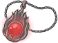
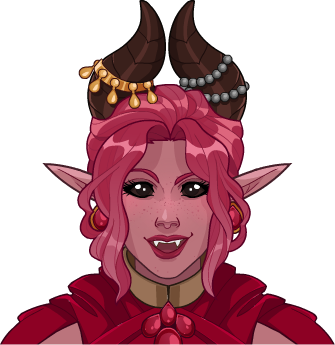
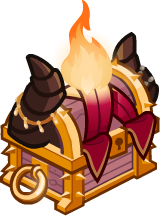
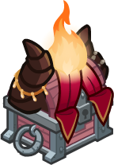

[Back to Main](index.md)

# Nixie

Nixie is a charismatic tiefling that brings a chaotic element to the party. Growing up in a wealthy but oppressive household, Nixie was punished for using magic despite her natural talent. In a rebellious move, she stole the family grimoire to teach herself dark sorcery only to result in the burning down of her family manor and all her family inside. Despite this tragedy, Nixie is now on a journey to enjoy her newfound magical freedom and find a new family. When confronted by enemies, and occasionally even friends, she's always ready to hurl her favorite spell, Fireball, with unbridled enthusiasm.

# Basic Information

Nixie will be the new champion in the The Running event on 3 May 2023.

* Seat: 1
* Race: Tiefling
* Class: Sorcerer
* Roles: DPS / Support
* Age: 19
* Gender: Female
* Alignment: Chaotic Neutral
* Affiliation: Awful Ones

| Stat | Value | Day 1 Trials | Patrons |
|---|---|---|---|
| Strength | 8 | - | - |
| Dexterity | 14 | Yes | Vajra |
| Constitution | 17 | Yes | - |
| Intelligence | 3 | - | - |
| Wisdom | 8 | - | |
| Charisma | 20 | Yes | |
| Total | 70 | |

# Formation

# Abilities

 **Base Attack: Fireball?** (Magic)
> Nixie attacks with a ball of fire centered on a random target dealing 1 hit of damage to all enemies in a small radius.

<em>Raw Data</em>

<pre>
{
    "description": "Nixie attacks with a ball of fire centered on a random target dealing 1 hit of damage to all enemies in a small radius.",
    "long_description": "",
    "damage_modifier": 1,
    "damage_types": ["magic"],
    "graphic_id": 0,
    "target": "random",
    "aoe_radius": 150,
    "tags": [
        "ranged",
        "aoe"
    ],
    "num_targets": 1,
    "animations": [{
        "projectile_details": {
            "projectile_hit_graphic_id": 750,
            "trail": {
                "scale_lerp": [
                    {
                        "x": 1,
                        "y": 1
                    },
                    {
                        "x": 0,
                        "y": 0
                    }
                ],
                "lifespan": 0.2,
                "initial_velocity": {
                    "x": 0,
                    "y": 0
                },
                "alpha_lerp": {
                    "0": 0,
                    "1": 0,
                    "0.1": 0.75
                },
                "tint": {
                    "a": 1,
                    "r": 1,
                    "b": 1,
                    "g": 1
                },
                "particle_graphic_ids": [
                    19009,
                    6093,
                    749
                ],
                "spawn_rate": 100,
                "velocity_jitter": {
                    "x": 50,
                    "y": 50
                }
            },
            "percent_height_offset": 10,
            "use_auto_rotation": true,
            "name": "nixie_fireball",
            "projectile_graphic_id": 19009,
            "projectile_speed": 1500,
            "rotation_speed": 0
        },
        "hit_sound": 133,
        "shoot_offset_y": -20,
        "shoot_offset_x": 50,
        "shoot_sound": 149,
        "type": "ranged_attack",
        "projectile": "pd_generic_projectile",
        "shoot_frame": 9
    }],
    "name": "Fireball?",
    "cooldown": 6,
    "id": 620
}
</pre>

 

 **Base Attack: Potted Plant** (Magic)
> Nixie is currently a plant and cannot attack.

<em>Raw Data</em>

<pre>
{
    "description": "Nixie is currently a plant and cannot attack.",
    "long_description": "",
    "damage_modifier": 0,
    "damage_types": ["magic"],
    "graphic_id": 0,
    "target": "none",
    "aoe_radius": 0,
    "tags": [
        "ranged",
        "aoe"
    ],
    "num_targets": 0,
    "animations": [{
        "no_cooldown_display": true,
        "no_jump": true,
        "animation_sequence_name": "special",
        "type": "melee_attack",
        "no_damage_display": true
    }],
    "name": "Potted Plant",
    "cooldown": 6,
    "id": 622
}
</pre>

 

 **Ultimate Attack: FIREBALL!!!** (Level: 150)
> Nixie casts a gigantic fireball that engulfs the entire enemy's side of the screen, dealing 1 ultimate hit to all enemies. In addition, there is a 10% chance for each monster hit by this attack to be surrounded by Engulfing Flames.

<em>Raw Data</em>

<pre>
{
    "description": "Nixie casts a fireball that engulfs the battlefield, hitting all enemies.  Each monster hit may be surrounded by Engulfing Flames.",
    "long_description": "Nixie casts a gigantic fireball that engulfs the entire enemy's side of the screen, dealing 1 ultimate hit to all enemies. In addition, there is a 10% chance for each monster hit by this attack to be surrounded by Engulfing Flames.",
    "damage_modifier": 0.03,
    "damage_types": ["magic"],
    "graphic_id": 19069,
    "target": "all",
    "aoe_radius": 0,
    "tags": [
        "ranged",
        "aoe",
        "ultimate"
    ],
    "num_targets": 1,
    "animations": [{
        "duration": 20,
        "projectile_data": {
            "projectile_details": {
                "trail": {
                    "scale_lerp": {
                        "0.0": {
                            "x": 0,
                            "y": 0
                        },
                        "1.0": {
                            "x": 0.75,
                            "y": 0.75
                        }
                    },
                    "lifespan": 0.3,
                    "initial_velocity": {
                        "x": 0,
                        "y": 0
                    },
                    "alpha_lerp": {
                        "0.0": 0.75,
                        "1.0": 0
                    },
                    "particle_graphic_ids": [
                        11739,
                        11740
                    ],
                    "spawn_rate": 50,
                    "velocity_jitter": {
                        "x": 30,
                        "y": 100
                    }
                },
                "percent_height_offset": 75,
                "use_auto_rotation": true,
                "projectile_graphic_id": 749,
                "projectile_speed": 500
            },
            "hit_sound": 133,
            "shoot_offset_y": -90,
            "shoot_offset_x": 100,
            "shoot_sound": 149,
            "type": "ranged_attack",
            "shoot_frame": 19
        },
        "ultimate": "nixie",
        "type": "ultimate_attack",
        "engulfing_flames_chance": 10
    }],
    "name": "FIREBALL!!!",
    "cooldown": 320,
    "id": 621
}
</pre>

 

 **Blazing Charisma** (Level: 30)
> Nixie increases the damage of all Champions with a Charisma of 17+ by 100%, including herself.

<em>Raw Data</em>

<pre>
{
    "static_dps_mult": null,
    "required_level": 30,
    "effect": "effect_def,1473",
    "tip_text": "Nixie increases the damage of all Champions with 17+ Charisma including herself.",
    "name": "Blazing Charisma",
    "id": 10887,
    "hero_id": 123,
    "upgrade_type": "unlock_ability",
    "default_enabled": 1,
    "required_upgrade_id": 0
}
{
    "effect_keys": [{
        "effect_string": "hero_dps_multiplier_mult,100",
        "filter_targets": [{
            "score": 17,
            "stat": "cha",
            "check": ">=",
            "type": "stat_score"
        }],
        "targets": ["all"]
    }],
    "requirements": "",
    "description": {"desc": "$(source_hero) increases the damage of all Champions with a Charisma of 17+ by $(amount)%, including herself."},
    "id": 1473,
    "flavour_text": "",
    "graphic_id": 19063,
    "properties": {"is_formation_ability": true}
}
</pre>

 

 **Wild Magic Surge** (Level: 100)
> Each time Nixie makes a normal attack, there is a high chance that a random wild magic event happens.
>  
> - Engulfing Flames - Nixie lights the area of her attack on fire for 20 seconds. While lit, it deals 1s of BUD to enemies in the effect each second.
> - Potted Punch - Nixie turns into a potted plant for 5 seconds and can't attack, increasing the damage bonus of Blazing Charisma by 100% while in that form, and for 15 additional seconds afterwards.
> - Coin Cascade - Gold coins also fly out from her attack's explosion, worth 10% of a normal monster kill.
> - Shockwave - Nixie's attack also sends out a shockwave that stuns Monsters in the attack's area for 5s.
> - Feeling Blue - Nixie's skin turns blue for 10 seconds.
> - Eldritch Entourage - A random monster is summoned.
> - Enlarge - Nixie's size increases. Her damage also increases by 100% for 20 seconds.

<em>Raw Data</em>

<pre>
{
    "static_dps_mult": null,
    "required_level": 100,
    "effect": "effect_def,1474",
    "tip_text": "Each time Nixie makes a normal attack, there is a high chance that a random wild magic event happens. Many are good, some are not.",
    "name": "Wild Magic Surge",
    "id": 10888,
    "hero_id": 123,
    "upgrade_type": "unlock_ability",
    "default_enabled": 1,
    "required_upgrade_id": 0
}
{
    "effect_keys": [
        {
            "wild_magic_effects": [
                {
                    "effects": [],
                    "probability": 20
                },
                {
                    "effects": [{
                        "duration": 20,
                        "index": 1
                    }],
                    "probability": 20
                },
                {
                    "effects": [
                        {
                            "duration": 5,
                            "index": 2
                        },
                        {
                            "duration": 5,
                            "index": 3
                        },
                        {
                            "duration": 20,
                            "index": 4
                        }
                    ],
                    "probability": 10
                },
                {
                    "effects": [{
                        "duration": 0,
                        "index": 5
                    }],
                    "probability": 10
                },
                {
                    "effects": [{
                        "duration": 0,
                        "index": 6
                    }],
                    "probability": 10
                },
                {
                    "effects": [{
                        "duration": 10,
                        "index": 7
                    }],
                    "probability": 10
                },
                {
                    "effects": [{
                        "duration": 0,
                        "index": 8
                    }],
                    "probability": 10
                },
                {
                    "effects": [
                        {
                            "duration": 20,
                            "index": 9
                        },
                        {
                            "duration": 20,
                            "index": 10
                        }
                    ],
                    "probability": 10
                }
            ],
            "effect_string": "nixie_wild_magic_surge"
        },
        {
            "projectile_details": {
                "trail": {
                    "scale_lerp": {
                        "0.0": {
                            "x": 1,
                            "y": 1
                        },
                        "1.0": {
                            "x": 0,
                            "y": 0
                        }
                    },
                    "lifespan": 0.5,
                    "initial_velocity": {
                        "x": 0,
                        "y": -30
                    },
                    "alpha_lerp": {
                        "0": 0,
                        "1": 0,
                        "0.1": 0.75
                    },
                    "particle_graphic_ids": [6093],
                    "spawn_rate": 50,
                    "velocity_jitter": {
                        "x": 30,
                        "y": 50
                    }
                },
                "percent_height_offset": 50,
                "use_auto_rotation": true,
                "projectile_graphic_id": 6093,
                "projectile_speed": 500
            },
            "effect_string": "nixie_engulfing_flames,1",
            "radius": 150
        },
        {"effect_string": "nixie_potted_punch"},
        {
            "effect_string": "change_base_attack,622",
            "apply_manually": true
        },
        {
            "effect_string": "buff_upgrade,100,10887",
            "apply_manually": true
        },
        {
            "projectile_details": {
                "trail": {
                    "scale_lerp": [
                        {
                            "x": 1,
                            "y": 1
                        },
                        {
                            "x": 0,
                            "y": 0
                        }
                    ],
                    "lifespan": 0.25,
                    "initial_velocity": {
                        "x": 0,
                        "y": 0
                    },
                    "alpha_lerp": {
                        "0": 0,
                        "1": 0,
                        "0.1": 0.75
                    },
                    "particle_graphic_ids": [189],
                    "spawn_rate": 50,
                    "velocity_jitter": {
                        "x": 30,
                        "y": 30
                    }
                },
                "percent_height_offset": 50,
                "use_auto_rotation": true,
                "projectile_graphic_id": 189,
                "projectile_speed": 250
            },
            "effect_string": "nixie_coin_cascade,10",
            "radius": 100
        },
        {
            "effect_string": "nixie_shockwave,5",
            "radius": 150
        },
        {
            "blue_graphic_id": 19008,
            "effect_string": "nixie_feeling_blue"
        },
        {
            "monster_ids": [
                39,
                635,
                1966
            ],
            "effect_string": "nixie_eldritch_entourage"
        },
        {
            "effect_string": "increase_hero_scale,25",
            "apply_manually": true
        },
        {
            "effect_string": "hero_dps_multiplier_mult,100",
            "apply_manually": true
        }
    ],
    "requirements": "",
    "description": {
        "post": {"conditions": [{
            "condition": "not static_desc",
            "desc": "^^Engulfing Flames - $(source_hero) lights the area of her attack on fire for 20 seconds. While lit, it deals $(seconds_plural amount___2) of BUD to enemies in the effect each second.^Potted Punch - $(source_hero) turns into a potted plant for 5 seconds and can't attack, increasing the damage bonus of $(upgrade_name id___5) by $(amount___5)% while in that form, and for 15 additional seconds afterwards.^Coin Cascade - Gold coins also fly out from her attack's explosion, worth $(amount___6)% of a normal monster kill.^Shockwave - $(source_hero)'s attack also sends out a shockwave that stuns Monsters in the attack's area for $(seconds_plural amount___7).^Feeling Blue - $(source_hero)'s skin turns blue for 10 seconds.^Eldritch Entourage - A random monster is summoned.^Enlarge - $(source_hero)'s size increases. Her damage also increases by $(amount___11)% for 20 seconds."
        }]},
        "desc": "Each time $(source_hero) makes a normal attack, there is a high chance that a random wild magic event happens."
    },
    "id": 1474,
    "flavour_text": "",
    "graphic_id": 19065,
    "properties": {
        "indexed_effect_properties": true,
        "is_formation_ability": true,
        "default_bonus_index": 0,
        "owner_use_outgoing_description": true,
        "per_effect_index_bonuses": true
    }
}
</pre>

 

 **Gigantic Growth** (Level: 200)
> Increases the damage bonus of Wild Magic Surge: Potted Punch by 100% and Wild Magic Surge: Enlarge by 100%

<em>Raw Data</em>

<pre>
{
    "static_dps_mult": null,
    "required_level": 200,
    "effect": "effect_def,1475",
    "name": "Gigantic Growth",
    "id": 10889,
    "hero_id": 123,
    "upgrade_type": "unlock_ability",
    "default_enabled": 1,
    "required_upgrade_id": 0
}
{
    "effect_keys": [
        {"effect_string": "buff_upgrade,100,10888,4"},
        {"effect_string": "buff_upgrade,100,10888,10"}
    ],
    "requirements": "",
    "description": {"desc": "Increases the damage bonus of $(upgrade_name id): Potted Punch by $(amount)% and $(upgrade_name id): Enlarge by $(amount___2)%"},
    "id": 1475,
    "flavour_text": "",
    "graphic_id": 19064,
    "properties": {
        "indexed_effect_properties": true,
        "is_formation_ability": true,
        "owner_use_outgoing_description": true,
        "per_effect_index_bonuses": true
    }
}
</pre>

 

# Specialisations

 **Anarchy Amplified** (Level: 130)
> Nixie increases the damage bonus of Blazing Charisma by 100% for each Chaotic champion in the formation, stacking multiplicatively.

<em>Raw Data</em>

<pre>
{
    "static_dps_mult": null,
    "specialization_name": "Anarchy Amplified",
    "required_level": 130,
    "effect": "effect_def,1478",
    "name": "Anarchy Amplified",
    "specialization_graphic_id": 19066,
    "id": 10892,
    "hero_id": 123,
    "upgrade_type": "unlock_ability",
    "default_enabled": 1,
    "required_upgrade_id": 0,
    "specialization_description": "Nixie focuses on the chaos."
}
{
    "effect_keys": [{
        "stacks_multiply": true,
        "off_when_benched": true,
        "effect_string": "buff_upgrade_per_any_tagged_crusader_mult,100,10887,chaotic"
    }],
    "requirements": "",
    "description": {"desc": "$(source_hero) increases the damage bonus of $(upgrade_name id) by $(not_buffed amount)% for each Chaotic champion in the formation, stacking multiplicatively."},
    "id": 1478,
    "flavour_text": "",
    "graphic_id": 0,
    "properties": {
        "is_formation_ability": true,
        "spec_option_post_apply_info": "Chaotic Champions: $num_stacks",
        "owner_use_outgoing_description": true,
        "type": "upgrade",
        "formation_circle_icon": false
    }
}
</pre>

 

 **Flawed Force** (Level: 130)
> Nixie increases the damage bonus of Blazing Charisma by 150% for each Champion with a total ability score of 78 or less in the formation, stacking multiplicatively.

<em>Raw Data</em>

<pre>
{
    "static_dps_mult": null,
    "specialization_name": "Flawed Force",
    "required_level": 130,
    "effect": "effect_def,1477",
    "name": "Flawed Force",
    "specialization_graphic_id": 19067,
    "id": 10891,
    "hero_id": 123,
    "upgrade_type": "unlock_ability",
    "default_enabled": 1,
    "required_upgrade_id": 0,
    "specialization_description": "Nixie focuses on her bond with others with Awful stats."
}
{
    "effect_keys": [{
        "stack_title": "Affected Champions",
        "amount_updated_listeners": [
            "slot_changed",
            "feat_changed"
        ],
        "show_bonus": true,
        "amount_func": "mult",
        "stack_func": "per_crusader",
        "effect_string": "buff_upgrade,150,10887",
        "stack_func_data": {"target_filters": [{
            "stat": "total_ability_score",
            "comparison": "<=",
            "type": "stat",
            "value": 78
        }]}
    }],
    "requirements": "",
    "description": {"desc": "$(source_hero) increases the damage bonus of $(upgrade_name id) by $(not_buffed amount)% for each Champion with a total ability score of 78 or less in the formation, stacking multiplicatively."},
    "id": 1477,
    "flavour_text": "",
    "graphic_id": 0,
    "properties": {
        "is_formation_ability": true,
        "spec_option_post_apply_info": "Qualified Champions: $num_stacks",
        "owner_use_outgoing_description": true,
        "type": "upgrade",
        "formation_circle_icon": false
    }
}
</pre>

 

 **Infernal Impact** (Level: 130)
> Nixie increases the damage bonus of Blazing Charisma by 200% for each Tiefling champion in the formation, stacking multiplicatively.

<em>Raw Data</em>

<pre>
{
    "static_dps_mult": null,
    "specialization_name": "Infernal Impact",
    "required_level": 130,
    "effect": "effect_def,1476",
    "name": "Infernal Impact",
    "specialization_graphic_id": 19068,
    "id": 10890,
    "hero_id": 123,
    "upgrade_type": "unlock_ability",
    "default_enabled": 1,
    "required_upgrade_id": 0,
    "specialization_description": "Nixie focuses on her Tiefling bond."
}
{
    "effect_keys": [{
        "stacks_multiply": true,
        "off_when_benched": true,
        "effect_string": "buff_upgrade_per_any_tagged_crusader_mult,200,10887,tiefling"
    }],
    "requirements": "",
    "description": {"desc": "$(source_hero) increases the damage bonus of $(upgrade_name id) by $(not_buffed amount)% for each Tiefling champion in the formation, stacking multiplicatively."},
    "id": 1476,
    "flavour_text": "",
    "graphic_id": 0,
    "properties": {
        "is_formation_ability": true,
        "spec_option_post_apply_info": "Tiefling Champions: $num_stacks",
        "owner_use_outgoing_description": true,
        "type": "upgrade",
        "formation_circle_icon": false
    }
}
</pre>

 

# Items

| Icon | Slot | Epic Name | Type |
|:-:|---|---|---|
|  | 1 | `Fireproof Arm Coverings` | All Champion Damage |
|  | 2 | `Magic Cloak` | All Champion Damage |
|  | 3 | `Scorching Brooch` | Blazing Charisma |
|  | 4 | `Fancy Noisemaker` | Gigantic Growth |
|  | 5 | `Talisman of Fireball` | All Specialisations |
|  | 6 | `Pyromancer's Holster` | Ultimate Cooldown Reduction |

<em>Item Names and Descriptions</em>

<pre>
Slot 1:
           Old Bandages: These have maybe one or two more Burning Hands before they're done...
  New-ish Arm Wrappings: I found these on a dead guard - I mean bandit. Yeah, it was a bandit.
         Heroic Present: Marquis gave me these in exchange for not setting his manor on fire.
Fireproof Arm Coverings: I can't burn these?! Let me try - FIREBALL!

Slot 2:
      Adventurer's Cape: I can do so many cool poses in this! Check out this one! Now this one!
        Flamboyant Cape: Look what it does when I spin - wheeeeeee!
         Carnival Shawl: I got this one in the Witchlight Carnival when I was a Bearowl
                         trainer!
            Magic Cloak: This cloak is magic! I don't know what it does, but it's magic!

Slot 3:
        Simple Earrings: Wild Magic turned two merchants into these. They're prettier now!
        Pretty Earrings: Aren't these cute? You should see them when I cast fireball - they get
                         extra shiny.
       Crystal Necklace: No, I didn't steal this crystal from the Minotaurium Emporium - I
                         would never!
       Scorching Brooch: This makes my fire burn things more. I guess that's as good as another
                         fireball?

Slot 4:
           Manor Ribbon: The only thing I have from my family's manor that burned down. It
                         wasn't me.
     Replacement Ribbon: The last one burned up. Hey, just like the manor!
             Pretty Bow: Evandra says it looks stupid, but she's what's stupid!
       Fancy Noisemaker: Okay, I DID steal this one...

Slot 5:
   Silver Fire Necklace: What do you mean it doesn't cast FIREBALL?!
 Fireball-like Necklace: If something looks like a fireball... THEN IT SHOULD CAST FIREBALL!
    Ball of Fire Amulet: FIRE. BALL. What don't you understand about this?
   Talisman of Fireball: Fireball! Fireball! FIREBALL! FINALLY - AHAHAH!

Slot 6:
      Random Components: All of these are flammable - so they help me cast Fireball, right?
      Fresh Ingredients: These taste like crap.
     Quality Components: The dying wizard was all like, 'No, stop. They're for the students.'
                         Psh. Weirdo.
   Pyromancer's Holster: I have everything I need! Bat guano. Sulfur. It's all here!
</pre>

 

# Feats

This list will only show feats that are going to be available on the release of this champion. The separate [Feats](feats.md) page may show others that could be available later if they exist.

| Feat | Effect | Source |
|---|---|---|
| `Tavern Brawler` | 30% Self DPS | Free |
| `Grappler` | 60% Self DPS | Gold Chest |
| `Selflessness` | 10% All Champion Damage | Free |
| `Inspiring Leader` | 25% All Champion Damage | Gold Chest |
| `Blazing Destruction` | 20% Blazing Charisma | Free |
| `Charismatic Devastation` | 40% Blazing Charisma | 12,500 Gems |
| `Enlarge` | 40% Gigantic Growth | 12,500 Gems |
| `Immolation` | 1s BUD per sec for 5s | 50,000 Gems |
| `Fired Up` | 20% All Specialisations | Gold Chest |

# Legendaries

* Increases the damage of all Champions by 100%.
* Increases the damage of all Female Champions by 125%.
* Increases the damage of all Champions by 95% for each Tiefling Champion in the formation.
* Increases the damage of all Champions with a DEX score of 11 or higher by 100%.
* Increases the damage of all Champions by 40% for each Champion with a CON score of 15 or higher in the formation.
* Increases the damage of all Champions by 30% for each Magic Champion in the formation.

<em>DPS Applicable</em>

<pre>
     Arkhan: 5 / 6
    Artemis: 5 / 6
    Asharra: 6 / 6
      Azaka: 6 / 6
     Binwin: 4 / 6
   Birdsong: 6 / 6
Black Viper: 6 / 6
 Catti-brie: 6 / 6
     Delina: 6 / 6
    Dhadius: 5 / 6
     Drizzt: 5 / 6
    Farideh: 6 / 6
        Fen: 6 / 6
      Grimm: 5 / 6
     Gromma: 5 / 6
       Ishi: 6 / 6
    Jaheira: 6 / 6
    Jamilah: 6 / 6
   Jarlaxle: 5 / 6
        Jim: 5 / 6
       Kent: 5 / 6
      Krond: 5 / 6
     Lucius: 5 / 6
      Makos: 4 / 6
      Minsc: 5 / 6
     Nahara: 6 / 6
      Nrakk: 5 / 6
     Orisha: 6 / 6
   Prudence: 6 / 6
      Rosie: 6 / 6
      Strix: 6 / 6
    Torogar: 5 / 6
     Warden: 5 / 6
    Warduke: 5 / 6
     Yorven: 5 / 6
      Zorbu: 5 / 6
</pre>

 

# Console Portrait

# Chests

| Gold | Silver |
|---|---|
|  |  |

[Back to Top](#top)

*Last Modified: {{ site.time }}*