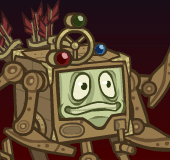
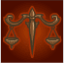

[Back to Main](index.md)

    
        
            
        
        
            Portrait
        
    

# Nordom

Modrons are the embodiment of law and order, marching in lockstep through the planes. But when Nordom Whistleklik was separated from his fellow modrons, the essence of chaos infected this rogue quadrone. Now with his crossbow-shaped gear spirits in hand, he works to fit his complex new outlook into his logical-if quirky-understanding of the planes.

# Changes

Nordom will be a reworked champion in the Simril event and delayed until 10 December 2025.

Only abilities that have seen some changes will be displayed here - and be aware that there's a lot of guesswork involved. Some abilities may not have names - some may have the *wrong* names - or specialisations might not be marked as such - etc.. Focus on the effect data itself.

Please do me a favour and don't get all melodramatic about what you find here. I - and CNE - don't appreciate it. These are spoilers and will almost certainly change before release - likely multiple times. That and we don't have access to any upgrade data prior to release. Making assumptions on how the champions will turn out based on this information would be premature.

# Attacks

**Base Attack: Gear Spirits** (Guess)
> Two gear spirits have taken the form of crossbows, which Nordom fires simultaneously at the closest two enemies. If only one enemy remains, he'll instead hit it twice.  
> Cooldown: 7s (Cap 1.75s)

<em>Raw Data</em>

<pre>
{
    "id": 911,
    "name": "Gear Spirits",
    "description": "Nordom simultaneously fires two crossbows at the closest two enemies.",
    "long_description": "Two gear spirits have taken the form of crossbows, which Nordom fires simultaneously at the closest two enemies. If only one enemy remains, he'll instead hit it twice.",
    "graphic_id": 0,
    "target": "front",
    "num_targets": 2,
    "aoe_radius": 0,
    "damage_modifier": 1,
    "cooldown": 7,
    "animations": [
        {
            "type": "ranged_attack",
            "projectile": "generic",
            "shoot_frame": 8,
            "per_projectile_shoot_offsets": [
                {
                    "shoot_offset_x": 30,
                    "shoot_offset_y": 25
                },
                {
                    "shoot_offset_x": 60,
                    "shoot_offset_y": 20
                }
            ],
            "projectile_multi_hits": true,
            "projectile_count": 2,
            "projectile_details": {
                "projectile_speed": 2400,
                "has_trail": false,
                "extend_line": true,
                "projectile_graphic_id": 14204
            }
        }
    ],
    "tags": [
        "ranged",
        "magic"
    ],
    "damage_types": [
        "ranged",
        "magic"
    ]
}
</pre>

**Base Attack: Gear Spirits** (Guess)
> Two gear spirits have taken the form of crossbows, which Nordom fires simultaneously at the closest two enemies. If only one enemy remains, he'll instead hit it twice.  
> Cooldown: 7s (Cap 1.75s)

<em>Raw Data</em>

<pre>
{
    "id": 513,
    "name": "Gear Spirits",
    "description": "Nordom simultaneously fires two crossbows at the closest two enemies.",
    "long_description": "Two gear spirits have taken the form of crossbows, which Nordom fires simultaneously at the closest two enemies. If only one enemy remains, he'll instead hit it twice.",
    "graphic_id": 0,
    "target": "front",
    "num_targets": 2,
    "aoe_radius": 0,
    "damage_modifier": 1,
    "cooldown": 7,
    "animations": [
        {
            "type": "ranged_attack",
            "projectile": "generic",
            "shoot_frame": 8,
            "per_projectile_shoot_offsets": [
                {
                    "shoot_offset_x": 30,
                    "shoot_offset_y": 25
                },
                {
                    "shoot_offset_x": 60,
                    "shoot_offset_y": 20
                }
            ],
            "projectile_multi_hits": true,
            "projectile_count": 2,
            "projectile_details": {
                "projectile_speed": 2400,
                "has_trail": false,
                "extend_line": true,
                "projectile_graphic_id": 14204
            }
        }
    ],
    "tags": [
        "ranged"
    ],
    "damage_types": [
        "ranged"
    ]
}
</pre>

**Base Attack: Gear Spirits** (Guess)
> Two gear spirits have taken the form of crossbows, which Nordom fires simultaneously at the closest two enemies. If only one enemy remains, he'll instead hit it twice. Piercing Bolts - Causes enemies to take additional damage after being hit.  
> Cooldown: 7s (Cap 1.75s)

<em>Raw Data</em>

<pre>
{
    "id": 920,
    "name": "Gear Spirits - Piercing Bolts",
    "description": "Nordom simultaneously fires two crossbows at the closest two enemies. Piercing Bolts - Causes enemies to take additional damage after being hit.",
    "long_description": "Two gear spirits have taken the form of crossbows, which Nordom fires simultaneously at the closest two enemies. If only one enemy remains, he'll instead hit it twice. Piercing Bolts - Causes enemies to take additional damage after being hit.",
    "graphic_id": 0,
    "target": "front",
    "num_targets": 2,
    "aoe_radius": 0,
    "damage_modifier": 1,
    "cooldown": 7,
    "animations": [
        {
            "type": "ranged_attack",
            "projectile": "generic",
            "shoot_frame": 8,
            "per_projectile_shoot_offsets": [
                {
                    "shoot_offset_x": 30,
                    "shoot_offset_y": 25
                },
                {
                    "shoot_offset_x": 60,
                    "shoot_offset_y": 20
                }
            ],
            "projectile_multi_hits": true,
            "projectile_count": 2,
            "projectile_details": {
                "projectile_speed": 2400,
                "has_trail": false,
                "extend_line": true,
                "projectile_graphic_id": 14204
            }
        }
    ],
    "tags": [
        "ranged"
    ],
    "damage_types": [
        "ranged"
    ]
}
</pre>

**Base Attack: Gear Spirits - Piercing Bolts** (Guess)
> Two gear spirits have taken the form of crossbows, which Nordom fires simultaneously at the closest two enemies. If only one enemy remains, he'll instead hit it twice. Piercing Bolts - Causes enemies to take additional damage after being hit.  
> Cooldown: 7s (Cap 1.75s)

<em>Raw Data</em>

<pre>
{
    "id": 922,
    "name": "Gear Spirits - Piercing Bolts",
    "description": "Nordom simultaneously fires two crossbows at the closest two enemies. Piercing Bolts - Causes enemies to take additional damage after being hit.",
    "long_description": "Two gear spirits have taken the form of crossbows, which Nordom fires simultaneously at the closest two enemies. If only one enemy remains, he'll instead hit it twice. Piercing Bolts - Causes enemies to take additional damage after being hit.",
    "graphic_id": 0,
    "target": "front",
    "num_targets": 2,
    "aoe_radius": 0,
    "damage_modifier": 1,
    "cooldown": 7,
    "animations": [
        {
            "type": "ranged_attack",
            "projectile": "generic",
            "shoot_frame": 8,
            "per_projectile_shoot_offsets": [
                {
                    "shoot_offset_x": 30,
                    "shoot_offset_y": 25
                },
                {
                    "shoot_offset_x": 60,
                    "shoot_offset_y": 20
                }
            ],
            "projectile_multi_hits": true,
            "projectile_count": 2,
            "projectile_details": {
                "projectile_speed": 2400,
                "has_trail": false,
                "extend_line": true,
                "projectile_graphic_id": 14204
            }
        }
    ],
    "tags": [
        "ranged",
        "magic"
    ],
    "damage_types": [
        "ranged",
        "magic"
    ]
}
</pre>

**Base Attack: Gear Spirits - Explosive Bolts** (Guess)
> Two gear spirits have taken the form of crossbows, which Nordom fires simultaneously at the closest two enemies. If only one enemy remains, he'll instead hit it twice. Explosive Bolts - Knocks enemies back.  
> Cooldown: 7s (Cap 1.75s)

<em>Raw Data</em>

<pre>
{
    "id": 921,
    "name": "Gear Spirits - Explosive Bolts",
    "description": "Nordom simultaneously fires two crossbows at the closest two enemies. Explosive Bolts - Knocks enemies back.",
    "long_description": "Two gear spirits have taken the form of crossbows, which Nordom fires simultaneously at the closest two enemies. If only one enemy remains, he'll instead hit it twice. Explosive Bolts - Knocks enemies back.",
    "graphic_id": 0,
    "target": "front",
    "num_targets": 2,
    "aoe_radius": 150,
    "damage_modifier": 1,
    "cooldown": 7,
    "animations": [
        {
            "type": "ranged_attack",
            "projectile": "generic",
            "shoot_frame": 8,
            "per_projectile_shoot_offsets": [
                {
                    "shoot_offset_x": 30,
                    "shoot_offset_y": 25
                },
                {
                    "shoot_offset_x": 60,
                    "shoot_offset_y": 20
                }
            ],
            "projectile_multi_hits": true,
            "projectile_count": 2,
            "projectile_details": {
                "projectile_speed": 2400,
                "has_trail": false,
                "extend_line": true,
                "projectile_graphic_id": 14204,
                "projectile_hit_graphic_id": 750
            },
            "effects_on_monsters": [
                {
                    "effect_string": "push_back_monster,10",
                    "animation": "hit",
                    "after_damage": true
                }
            ]
        }
    ],
    "tags": [
        "ranged"
    ],
    "damage_types": [
        "ranged"
    ]
}
</pre>

**Base Attack: Gear Spirits - Explosive Bolts** (Guess)
> Two gear spirits have taken the form of crossbows, which Nordom fires simultaneously at the closest two enemies. If only one enemy remains, he'll instead hit it twice. Explosive Bolts - Knocks enemies back.  
> Cooldown: 7s (Cap 1.75s)

<em>Raw Data</em>

<pre>
{
    "id": 923,
    "name": "Gear Spirits - Explosive Bolts",
    "description": "Nordom simultaneously fires two crossbows at the closest two enemies. Explosive Bolts - Knocks enemies back.",
    "long_description": "Two gear spirits have taken the form of crossbows, which Nordom fires simultaneously at the closest two enemies. If only one enemy remains, he'll instead hit it twice. Explosive Bolts - Knocks enemies back.",
    "graphic_id": 0,
    "target": "front",
    "num_targets": 2,
    "aoe_radius": 150,
    "damage_modifier": 1,
    "cooldown": 7,
    "animations": [
        {
            "type": "ranged_attack",
            "projectile": "generic",
            "shoot_frame": 8,
            "per_projectile_shoot_offsets": [
                {
                    "shoot_offset_x": 30,
                    "shoot_offset_y": 25
                },
                {
                    "shoot_offset_x": 60,
                    "shoot_offset_y": 20
                }
            ],
            "projectile_multi_hits": true,
            "projectile_count": 2,
            "projectile_details": {
                "projectile_speed": 2400,
                "has_trail": false,
                "extend_line": true,
                "projectile_graphic_id": 14204
            },
            "effects_on_monsters": [
                {
                    "effect_string": "push_back_monster,10",
                    "animation": "hit",
                    "after_damage": true
                }
            ]
        }
    ],
    "tags": [
        "ranged",
        "magic"
    ],
    "damage_types": [
        "ranged",
        "magic"
    ]
}
</pre>

# Abilities

**Form Orderly Ranks** (Guess)
> Nordom increases the damage of all Champions in the column ahead of him by 100%.

<em>Raw Data</em>

<pre>
{
    "id": 2510,
    "flavour_text": "",
    "description": {
        "desc": "$(source_hero) increases the damage of all Champions in the column ahead of him by $(amount)%."
    },
    "effect_keys": [
        {
            "off_when_benched": true,
            "effect_string": "hero_dps_multiplier_mult,100",
            "targets": [
                "next_col"
            ]
        }
    ],
    "requirements": "",
    "graphic_id": 14237,
    "large_graphic_id": 14234,
    "properties": {
        "is_formation_ability": true,
        "owner_use_outgoing_description": true
    }
}
</pre>

**Rule of Law** (Guess)
> Nordom increases the effect of Form Orderly Ranks and potentially augments his own abilities depending on which Modron Core you have assigned to the current adventuring party. Buffs stack multiplicatively.  
> Modest Core100: 100% for each unique species in the formation.  
> Strong Core100: 100% for each Champion with a total ability score of 78 or higher in the formation.  
> Fast Core100: 100% for each Speed Champion in the formation.  
> Magic Core100: 100% for each Champion with a magic base attack in the formation, and Nordom's crossbows count as Ranged/Magic attacks.  
> Aerois Core100: 300% for each Heroes of Aerois Champion in the formation, and Nordom gains the Heroes of Aerois affiliation.  
> Unaffiliated Core100: 100% for each unaffiliated Champion in the formation.  
> Dexterous Core100: 100% for each Champion with a Dexterity of 15 or higher in the formation.  
> Lawful Core or No Core$(nordom_modron_core_active -1): 100% for each Lawful Champion in the formation.

ⓘ *Note: This ability is prestack.*

<em>Raw Data</em>

<pre>
{
    "id": 2513,
    "flavour_text": "",
    "description": {
        "conditions": [
            {
                "condition": "static_desc",
                "desc": "Nordom increases the effect of Form Orderly Ranks and potentially augments his own abilities depending on which Modron Core you have assigned to the current adventuring party. Buffs stack multiplicatively."
            },
            {
                "desc": "Nordom increases the effect of Form Orderly Ranks and potentially augments his own abilities depending on which Modron Core you have assigned to the current adventuring party. Buffs stack multiplicatively.^^Modest Core$(nordom_modron_core_active 1): $(amount)% for each unique species in the formation.^Strong Core$(nordom_modron_core_active 2): $(amount)% for each Champion with a total ability score of 78 or higher in the formation.^Fast Core$(nordom_modron_core_active 3): $(amount)% for each Speed Champion in the formation.^Magic Core$(nordom_modron_core_active 4): $(amount)% for each Champion with a magic base attack in the formation, and Nordom's crossbows count as Ranged/Magic attacks.^Aerois Core$(nordom_modron_core_active 5): $(amount___2)% for each Heroes of Aerois Champion in the formation, and Nordom gains the Heroes of Aerois affiliation.^Unaffiliated Core$(nordom_modron_core_active 6): $(amount)% for each unaffiliated Champion in the formation.^Dexterous Core$(nordom_modron_core_active 7): $(amount)% for each Champion with a Dexterity of 15 or higher in the formation.^Lawful Core or No Core$(nordom_modron_core_active -1): $(amount)% for each Lawful Champion in the formation."
            }
        ]
    },
    "effect_keys": [
        {
            "effect_string": "pre_stack,100"
        },
        {
            "effect_string": "pre_stack,300"
        },
        {
            "effect_string": "buff_upgrade_per_unique_race,100,18058",
            "amount_expr": "upgrade_amount(18059,0)",
            "off_when_benched": true,
            "apply_manually": true,
            "show_bonus": true,
            "use_computed_amount_for_description": true,
            "amount_updated_listeners": [
                "slot_changed",
                "hero_tags_changed",
                "feat_changed"
            ]
        },
        {
            "effect_string": "buff_upgrade,100,18058",
            "amount_expr": "upgrade_amount(18059,0)",
            "off_when_benched": true,
            "amount_func": "mult",
            "stack_func": "per_crusader",
            "stack_func_data": {
                "target_filters": [
                    {
                        "type": "stat",
                        "stat": "total_ability_score",
                        "comparison": ">=",
                        "value": 78
                    }
                ]
            },
            "apply_manually": true,
            "show_bonus": true,
            "use_computed_amount_for_description": true,
            "amount_updated_listeners": [
                "slot_changed",
                "feat_changed",
                "ability_score_changed"
            ]
        },
        {
            "effect_string": "buff_upgrade_per_any_tagged_crusader_mult,100,18058,speed",
            "amount_expr": "upgrade_amount(18059,0)",
            "off_when_benched": true,
            "apply_manually": true,
            "show_bonus": true,
            "use_computed_amount_for_description": true,
            "amount_updated_listeners": [
                "slot_changed",
                "hero_tags_changed",
                "feat_changed"
            ]
        },
        {
            "effect_string": "buff_upgrade,100,18058",
            "amount_expr": "upgrade_amount(18059,0)",
            "off_when_benched": true,
            "amount_func": "mult",
            "stack_func": "per_crusader",
            "target_filters": [
                {
                    "type": "attack_type",
                    "attack": "magic"
                }
            ],
            "show_bonus": true,
            "apply_manually": true,
            "use_computed_amount_for_description": true,
            "amount_updated_listeners": [
                "slot_changed",
                "hero_tags_changed",
                "feat_changed",
                "attack_changed"
            ]
        },
        {
            "effect_string": "buff_upgrade_per_any_tagged_crusader_mult,300,18058,aerois",
            "amount_expr": "upgrade_amount(18059,1)",
            "off_when_benched": true,
            "apply_manually": true,
            "show_bonus": true,
            "use_computed_amount_for_description": true,
            "amount_updated_listeners": [
                "slot_changed",
                "hero_tags_changed",
                "feat_changed"
            ]
        },
        {
            "effect_string": "buff_upgrade_per_any_tagged_crusader_mult,100,18058,unaffiliated",
            "amount_expr": "upgrade_amount(18059,0)",
            "off_when_benched": true,
            "apply_manually": true,
            "show_bonus": true,
            "use_computed_amount_for_description": true,
            "amount_updated_listeners": [
                "slot_changed",
                "hero_tags_changed",
                "feat_changed"
            ]
        },
        {
            "effect_string": "buff_upgrade,100,18058",
            "amount_expr": "upgrade_amount(18059,0)",
            "off_when_benched": true,
            "stacks_multiply": true,
            "amount_func": "mult",
            "stack_func": "per_crusader",
            "stack_func_data": {
                "target_filters": [
                    {
                        "type": "stat",
                        "stat": "dex",
                        "comparison": ">=",
                        "value": 15
                    }
                ]
            },
            "amount_updated_listeners": [
                "slot_changed",
                "hero_tags_changed",
                "feat_changed",
                "ability_score_changed"
            ],
            "show_bonus": true,
            "apply_manually": true,
            "use_computed_amount_for_description": true
        },
        {
            "effect_string": "buff_upgrade_per_any_tagged_crusader_mult,100,18058,lawful",
            "amount_expr": "upgrade_amount(18059,0)",
            "off_when_benched": true,
            "apply_manually": true,
            "show_bonus": true,
            "use_computed_amount_for_description": true,
            "amount_updated_listeners": [
                "slot_changed",
                "hero_tags_changed",
                "feat_changed"
            ]
        },
        {
            "effect_string": "add_affiliations_to_heroes",
            "off_when_benched": true,
            "apply_manually": true,
            "affiliations": [
                "aerois"
            ],
            "hero_ids": [
                111
            ]
        },
        {
            "effect_string": "nordom_core_programming_buff",
            "off_when_benched": true,
            "effect_keys_by_core_id": {
                "-1": [
                    9
                ],
                "1": [
                    2
                ],
                "2": [
                    3
                ],
                "3": [
                    4
                ],
                "4": [
                    5
                ],
                "5": [
                    6,
                    10
                ],
                "6": [
                    7
                ],
                "7": [
                    8
                ],
                "8": [
                    9
                ]
            }
        }
    ],
    "requirements": "",
    "graphic_id": 27846,
    "large_graphic_id": 27826,
    "properties": {
        "is_formation_ability": true,
        "owner_use_outgoing_description": true,
        "indexed_effect_properties": true,
        "per_effect_index_bonuses": true
    }
}
</pre>

**The Great Modron Puzzle** (Guess)
> Nordom gains Pipe Puzzle stacks based on the status of the outputs in all active Modron Cores you have equipped across all parties. The effect of Form Orderly Ranks is increased by 25% for each Pipe Puzzle stack, stacking multiplicatively. You gain Pipe Puzzle stacks for having:.

<em>Raw Data</em>

<pre>
{
    "id": 2518,
    "flavour_text": "",
    "description": {
        "conditions": [
            {
                "condition": "static_desc",
                "desc": "Nordom gains Pipe Puzzle stacks based on the status of the outputs in all active Modron Cores you have equipped across all parties. The effect of Form Orderly Ranks is increased by 25% for each Pipe Puzzle stack, stacking multiplicatively."
            },
            {
                "desc": "Nordom gains Pipe Puzzle stacks based on the status of the outputs in all active Modron Cores you have equipped across all parties. The effect of Form Orderly Ranks is increased by 25% for each Pipe Puzzle stack, stacking multiplicatively. You gain Pipe Puzzle stacks for having:^$(nordom_powered_outputs_count)"
            }
        ]
    },
    "effect_keys": [
        {
            "effect_string": "nordom_great_modron_puzzle_buff",
            "off_when_benched": true
        },
        {
            "effect_string": "buff_upgrade,25,18058",
            "off_when_benched": true,
            "stacks_on_trigger": "will_stack_manually",
            "show_bonus": true,
            "stacks_multiply": true,
            "stack_title": "Pipe Puzzle Stacks"
        }
    ],
    "requirements": "",
    "graphic_id": 27847,
    "large_graphic_id": 27827,
    "properties": {
        "is_formation_ability": true,
        "owner_use_outgoing_description": true
    }
}
</pre>

**Core Programming** (Guess)
> Nordom increases the effect of Form Orderly Ranks by 33% for each BASE adventure you have completed in the Grand Tour campaign, stacking multiplicatively.

<em>Raw Data</em>

<pre>
{
    "id": 2519,
    "flavour_text": "",
    "description": {
        "desc": "Nordom increases the effect of Form Orderly Ranks by $amount% for each BASE adventure you have completed in the Grand Tour campaign, stacking multiplicatively."
    },
    "effect_keys": [
        {
            "effect_string": "buff_upgrade,33,18058",
            "off_when_benched": true,
            "stacks_multiply": true,
            "amount_func": "mult",
            "stack_func": "get_stat",
            "instance_stat": true,
            "stat": "GrandTourBaseAdventuresCompleted",
            "ided_stat_id": 1,
            "ided_stat_handler": "CompletedBaseAdventures",
            "use_computed_amount_for_description": true,
            "show_bonus": true,
            "amount_updated_listeners": [
                "stat_changed,GrandTourBaseAdventuresCompleted"
            ]
        }
    ],
    "requirements": "",
    "graphic_id": 0,
    "large_graphic_id": 0,
    "properties": {
        "is_formation_ability": true,
        "formation_circle_icon": false,
        "owner_use_outgoing_description": true,
        "retain_on_slot_changed": true,
        "spec_option_post_apply_info": "Grand Tour Adventures Completed: $num_stacks"
    }
}
</pre>

# Specialisations

**Specialisation: Modron Core Toolbox** (Guess)
> Nordom increases the amount of experience gained on the Modron Core attached to his adventuring party when completing new areas by 20%.

<em>Raw Data</em>

<pre>
{
    "id": 2520,
    "flavour_text": "",
    "description": {
        "desc": "Nordom increases the amount of experience gained on the Modron Core attached to his adventuring party when completing new areas by $amount%"
    },
    "effect_keys": [
        {
            "off_when_benched": true,
            "effect_string": "nordom_modron_xp_buff,20"
        }
    ],
    "requirements": "",
    "graphic_id": 0,
    "large_graphic_id": 0,
    "properties": {
        "is_formation_ability": true,
        "owner_use_outgoing_description": true,
        "spec_option_post_apply_info": "$active_effect_key_handler_custom_spec_hint"
    }
}
</pre>

**Specialisation: Core Competency** (Guess)
> Nordom gains Core Competency stacks based on the total level of all of your modron cores. The effect of Form Orderly Ranks is increased by 25% for each Core Competency stack, stacking multiplicatively.

<em>Raw Data</em>

<pre>
{
    "id": 2521,
    "flavour_text": "",
    "description": {
        "desc": "Nordom gains Core Competency stacks based on the total level of all of your modron cores. The effect of Form Orderly Ranks is increased by $(nordom_core_competency_bonus)% for each Core Competency stack, stacking multiplicatively."
    },
    "effect_keys": [
        {
            "effect_string": "pre_stack,25",
            "use_computed_amount_for_description": true,
            "show_bonus": false
        },
        {
            "effect_string": "buff_upgrade,0,18058",
            "off_when_benched": true,
            "show_bonus": true,
            "stacks_multiply": true,
            "amount_expr": "upgrade_amount(18168,0)",
            "stacks_on_trigger": "will_stack_manually",
            "stack_title": "Core Competency Stacks",
            "use_computed_amount_for_description": true
        },
        {
            "effect_string": "nordom_core_competency_buff"
        }
    ],
    "requirements": "",
    "graphic_id": 0,
    "large_graphic_id": 0,
    "properties": {
        "is_formation_ability": true,
        "owner_use_outgoing_description": true,
        "indexed_effect_properties": true,
        "per_effect_index_bonuses": true,
        "default_bonus_index": 1,
        "spec_option_post_apply_info": "$active_effect_key_handler_custom_spec_hint___3"
    }
}
</pre>

**Specialisation: BASIC Functionality** (Guess)
> 

<em>Raw Data</em>

<pre>
{
    "id": 2522,
    "flavour_text": "",
    "description": {
        "desc": ""
    },
    "effect_keys": [
        {
            "effect_string": "change_base_attack,513",
            "off_when_benched": true,
            "apply_manually": true,
            "description": ""
        },
        {
            "effect_string": "change_base_attack,920",
            "off_when_benched": true,
            "apply_manually": true,
            "description": ""
        },
        {
            "effect_string": "change_base_attack,921",
            "off_when_benched": true,
            "apply_manually": true,
            "description": ""
        },
        {
            "effect_string": "change_base_attack,911",
            "off_when_benched": true,
            "apply_manually": true,
            "description": ""
        },
        {
            "effect_string": "change_base_attack,922",
            "off_when_benched": true,
            "apply_manually": true,
            "description": ""
        },
        {
            "effect_string": "change_base_attack,923",
            "off_when_benched": true,
            "apply_manually": true,
            "description": ""
        },
        {
            "effect_string": "nordom_attack_change",
            "debuffing_attack_ids": [
                920,
                922
            ],
            "debuff_before_damage": true,
            "debuff_effects": [
                {
                    "effect_string": "increase_monster_damage,400",
                    "active_graphic_id": 14490,
                    "active_graphic_y": -60
                }
            ],
            "off_when_benched": true,
            "description": ""
        }
    ],
    "requirements": "",
    "graphic_id": 0,
    "large_graphic_id": 0,
    "properties": {
        "show_incoming": false,
        "formation_circle_icon": false
    }
}
</pre>

# Adventures and Variants

**Unlock Adventure: The Mechanical Menace (Nordom)** (Complete Area 50)
> Stop the Modron March from crushing Waterdeep under its mechanical heel.

 **Variant 1: Rogue Modron Hunting** (Complete Area 75)
> Nordom starts in the formation. They can't be moved or removed.  
> Nodrom is hunted by Duodrones and Pentadrones! They drop no gold, nor do they count towards quest progress.  
> Getting to know Nordom: Nordom increases the damage of Champions in the column in front of him. Use this to defeat these rogue modron hunters!

 **Variant 2: A Lawful Lot of Champions** (Complete Area 125)
> Nordom starts in the formation. They can't be moved or removed.  
> Chaotic Champions can't be used, and Neutral champions (l/c axis) deal no damage but can still use their formation abilities.  
> Getting to know Nordom: Nordom's ability to increase damage improves with the number of lawful Champions in your formation. Try to get the most of it!

 **Variant 3: Core Strength** (Complete Area 175)
> Nordom starts in the formation. They can't be moved or removed.  
> Potions of Speed gain a 100% duration bonus.  
> You may only use Champions with the Speed tag and/or Champions with a STR of 16 or higher.  
> Getting to know Nordom: If you have a modron core, Nordom can increase the rate it gains levels. Use some speed Champions to maximize this ability!

# Formation

    <svg xmlns="http://www.w3.org/2000/svg" id="Nordom" fill="#aaa" data-formationName="Nordom" data-campaignName="The Great Modron March" width="429" height="160"><circle cx="215" cy="85" r="15"/><circle cx="175" cy="25" r="15"/><circle cx="175" cy="65" r="15"/><circle cx="175" cy="105" r="15"/><circle cx="175" cy="145" r="15"/><circle cx="135" cy="85" r="15"/><circle cx="95" cy="65" r="15"/><circle cx="95" cy="105" r="15"/><circle cx="55" cy="85" r="15"/><circle cx="15" cy="65" r="15"/><text x="245" y="25" fill="#dcdcdc" font-size="25" font-family="Arial" font-weight="bold">Nordom</text><text x="245" y="65" fill="#dcdcdc" font-size="15" font-family="Arial" font-weight="bold">The Great Modron March</text></svg>

[Back to Top](#top)

*Last Modified: {{ site.time }}*