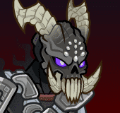

[Back to Main](index.md)

# Unknown Exclusive Giveaway

Contents of an upcoming Unknown exclusive platform giveaway have been spoiled.

ID: 657

### Cozy Dark Urge Party Pack - $19.99  
Date of release: 11 December 2025

> 

ⓘ *Note: This pack might not be available for purchase since it's potentially a platform giveaway.*

Contents:

    
        
            ID: 103**Valentine (Seat 5)**
        
        
            **Champion Unlock**
            Valentine
        
    
    
        
            ID: 146**Dark Urge (Seat 11)**
        
        
            **Champion Unlock**
            Dark Urge
        
    
    
        
            ID: 168**King of Shadows (Seat 9)**
        
        
            **Champion Unlock**
            King of Shadows
        
    
    
        
            ID: 638**Cozy Dark Urge (Dark Urge)**
        
        
            **Skin**
            Cozy Dark Urge
        
    
    
        
            ID: 2440**Vicious Damage**Ooh, that's sure to leave a nasty scar, milord. Bravo!  Increases the damage of Dark Urge by 400%. Dark Urge's attacks prevent the target from healing for 10 seconds.<code>hero_dps_multiplier_mult,400 vicious_damage,10</code>
        
        
            **Feat**
            Vicious Damage
            Dark Urge
        
    
    
        
            ID: 363**Platinum Valentine Chest**Loot for: Valentine<code>"for_crusaders":[103]</code>
        
        
            **Chest**
            Platinum Valentine Chest
            x14 (Shinies x1)
        
    
    
        
            ID: 563**Platinum The Dark Urge Chest**Loot for: Dark Urge<code>"for_crusaders":[146]</code>
        
        
            **Chest**
            Platinum The Dark Urge Chest
            x14 (Shinies x1)
        
    
    
        
            ID: 756**Platinum King of Shadows Chest**Loot for: King of Shadows<code>"for_crusaders":[168]</code>
        
        
            **Chest**
            Platinum King of Shadows Chest
            x14 (Shinies x1)
        
    

[Back to Top](#top)

*Last Modified: {{ site.time }}*