[Back to Main](index.md)

# Premium Packs and DLC

Upcoming real-money shop items.

ID: 591

### Fortune Hunter Tess Theme Pack - 3,830 Platinum  
Date of release: 02 Jul 2025

> Unlock Tess along with an exclusive Fortune Hunter Skin & Familiar!

Contents:

    
        
            ID: 164**Tess**
        
        
            **Champion Unlock**
            Tess
        
    
    
        
            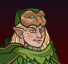ID: 572**Fortune Hunter Tess (Tess)**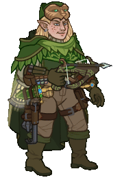
        
        
            **Skin**
            Fortune Hunter Tess
        
    
    
        
            ID: 271**Wormy the Baby Purple Worm**I'll bite your ankles until you die!
        
        
            **Familiar**
            Wormy the Baby Purple Worm
        
    
    
        
            ID: 2246**Feat**???: 2246
        
        
            **Feat**
            ???: 2246
        
    
    
        
            ID: 661**Platinum Tess Chest**Loot for: Tess<code>"for_crusaders":[164]</code>
        
        
            **Chest**
            Platinum Tess Chest
            x32 (Shinies x2)
        
    
    
        
            ID: 1723**Potion of the Gem Hunter**Increases the gem drops from bosses by 50%<code>increase_boss_gems_percent,50</code>
        
        
            **Buff**
            Potion of the Gem Hunter
            x1
        
    

ID: 592

### Archeologist Strongheart Skin & Feat Pack - 1,680 Platinum  
Date of release: 02 Jul 2025

> Unlock Strongheart along with his exclusive Archeologist Skin & Feat!

Contents:

    
        
            ID: 126**Strongheart (Seat 11)**
        
        
            **Champion Unlock**
            Strongheart
        
    
    
        
            ID: 573**Archeologist Strongheart (Strongheart)**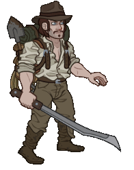
        
        
            **Skin**
            Archeologist Strongheart
        
    
    
        
            ID: 2220**Master's Precision**Steel, strike true!<code>buff_base_crit_chance_add,20</code>
        
        
            **Feat**
            Master's Precision
            Strongheart (+20% Crit Chance)
        
    
    
        
            ID: 20**Large Bounty Contract**Claim a bounty worth 8 hours of offline gold earnings and event tokens.<code>seconds_worth_of_gold,28800</code>
        
        
            **Buff**
            Large Bounty Contract
            x6
        
    
    
        
            ID: 34**Large Blacksmithing Contract**Contract a master blacksmith to improve a piece of equipment owned by one of your Champions.<code>level_up_loot,24</code>
        
        
            **Buff**
            Large Blacksmithing Contract
            x6
        
    
    
        
            ID: 454**Platinum Strongheart Chest**Loot for: Strongheart<code>"for_crusaders":[126]</code>
        
        
            **Chest**
            Platinum Strongheart Chest
            x14 (Shinies x1)
        
    

ID: 593

### Fortune Hunter Nahara Skin & Feat Pack - 1,680 Platinum  
Date of release: 02 Jul 2025

> Unlock Nahara along with her exclusive Fortune Hunter Skin & Feat!

Contents:

    
        
            ID: 102**Nahara (Seat 3)**
        
        
            **Champion Unlock**
            Nahara
        
    
    
        
            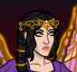ID: 574**Fortune Hunter Nahara (Nahara)**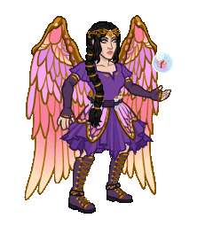
        
        
            **Skin**
            Fortune Hunter Nahara
        
    
    
        
            ID: 2221**Immolation**You will burn for this, and it will be by my hand.<code>immolation,1,5</code>
        
        
            **Feat**
            Immolation
            Nahara (1s BUD per sec for 5s)
        
    
    
        
            ID: 20**Large Bounty Contract**Claim a bounty worth 8 hours of offline gold earnings and event tokens.<code>seconds_worth_of_gold,28800</code>
        
        
            **Buff**
            Large Bounty Contract
            x6
        
    
    
        
            ID: 34**Large Blacksmithing Contract**Contract a master blacksmith to improve a piece of equipment owned by one of your Champions.<code>level_up_loot,24</code>
        
        
            **Buff**
            Large Blacksmithing Contract
            x6
        
    
    
        
            ID: 361**Platinum Nahara Chest**Loot for: Nahara<code>"for_crusaders":[102]</code>
        
        
            **Chest**
            Platinum Nahara Chest
            x14 (Shinies x1)
        
    

ID: 589

### Beadle & Grimm Dragon Delves Pack - Free  
Date of release: 08 Jul 2025

> 

ⓘ *Note: This pack might not be available for purchase since it's potentially a platform giveaway.*

Contents:

    
        
            ID: 64**Beadle (Seat 8)**
        
        
            **Champion Unlock**
            Beadle
        
    
    
        
            ID: 161**Grimm (Seat 2)**
        
        
            **Champion Unlock**
            Grimm
        
    
    
        
            ID: 569**Dragon Hoard Beadle (Beadle)**
        
        
            **Skin**
            Dragon Hoard Beadle
        
    
    
        
            ID: 570**Dragon Slayer Grimm (Grimm)**
        
        
            **Skin**
            Dragon Slayer Grimm
        
    
    
        
            ID: 269**Verdigrin the Baby Copper Dragon**Ready for a life full of wonder and possibility.
        
        
            **Familiar**
            Verdigrin the Baby Copper Dragon
        
    
    
        
            ID: 187**Platinum Beadle Chest**Loot for: Beadle<code>"for_crusaders":[64]</code>
        
        
            **Chest**
            Platinum Beadle Chest
            x14 (Shinies x1)
        
    
    
        
            ID: 655**Platinum Grimm Chest**Loot for: Grimm<code>"for_crusaders":[161]</code>
        
        
            **Chest**
            Platinum Grimm Chest
            x14 (Shinies x1)
        
    
    
        
            ID: 1723**Potion of the Gem Hunter**Increases the gem drops from bosses by 50%<code>increase_boss_gems_percent,50</code>
        
        
            **Buff**
            Potion of the Gem Hunter
            x1
        
    

ID: 594

### Chompers the Aurumvorax Familiar Pack - 840 Platinum  
Date of release: 09 Jul 2025

> Collect your own Chompers the Aurumvorax Familiar!

Contents:

    
        
            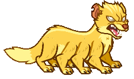ID: 272**Chompers the Aurumvorax**Don't open the chest, or you'll learn why we named him Chompers…
        
        
            **Familiar**
            Chompers the Aurumvorax
        
    
    
        
            ID: 4**Huge Potion of Giant's Strength**A transparent potion in which floats the sliver of a giant's fingernail.<code>global_dps_multiplier_mult,900</code>
        
        
            **Buff**
            Huge Potion of Giant's Strength
            x2
        
    
    
        
            ID: 8**Huge Potion of Clairvoyance**Three eyeballs bob in this yellowish potion.<code>gold_multiplier_mult,400</code>
        
        
            **Buff**
            Huge Potion of Clairvoyance
            x2
        
    
    
        
            ID: 77**Huge Potion of Speed**This potion's yellow fluid is streaked with black and swirls on its own.<code>time_scale,2.75</code>
        
        
            **Buff**
            Huge Potion of Speed
            x2
        
    

ID: 595

### Dungeoneer Deekin Skin & Feat Pack - 1,680 Platinum  
Date of release: 09 Jul 2025

> Unlock Deekin along with his exclusive Dungeoneer Skin & Feat!

Contents:

    
        
            ID: 28**Deekin (Seat 1)**
        
        
            **Champion Unlock**
            Deekin
        
    
    
        
            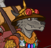ID: 575**Dungeoneer Deekin (Deekin)**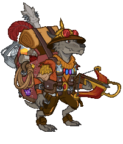
        
        
            **Skin**
            Dungeoneer Deekin
        
    
    
        
            ID: 159**Prophesied Leader**Deekin lead you all to DOOM.<code>global_dps_multiplier_mult,50</code>
        
        
            **Feat**
            Prophesied Leader
            Deekin (50% All Champion Damage)
        
    
    
        
            ID: 20**Large Bounty Contract**Claim a bounty worth 8 hours of offline gold earnings and event tokens.<code>seconds_worth_of_gold,28800</code>
        
        
            **Buff**
            Large Bounty Contract
            x6
        
    
    
        
            ID: 34**Large Blacksmithing Contract**Contract a master blacksmith to improve a piece of equipment owned by one of your Champions.<code>level_up_loot,24</code>
        
        
            **Buff**
            Large Blacksmithing Contract
            x6
        
    
    
        
            ID: 54**Platinum Deekin Chest**Loot for: Deekin<code>"for_crusaders":[28]</code>
        
        
            **Chest**
            Platinum Deekin Chest
            x14 (Shinies x1)
        
    

ID: 596

### Reincarnated K'thriss Theme Pack - 3,830 Platinum  
Date of release: 09 Jul 2025

> Unlock K'thriss along with an exclusive Reincarnated Skin & Familiar!

Contents:

    
        
            ID: 38**K'thriss (Seat 1)**
        
        
            **Champion Unlock**
            K'thriss
        
    
    
        
            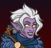ID: 576**Reincarnated K'thriss (K'thriss)**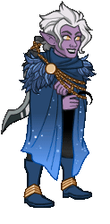
        
        
            **Skin**
            Reincarnated K'thriss
        
    
    
        
            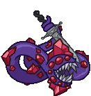ID: 273**Ligotti the Tentacle Familiar**What possible harm could one perpetually ravenous tentacle do?
        
        
            **Familiar**
            Ligotti the Tentacle Familiar
        
    
    
        
            ID: 2259**Feat**???: 2259
        
        
            **Feat**
            ???: 2259
        
    
    
        
            ID: 86**Platinum K'thriss Chest**Loot for: K'thriss<code>"for_crusaders":[38]</code>
        
        
            **Chest**
            Platinum K'thriss Chest
            x32 (Shinies x2)
        
    
    
        
            ID: 1723**Potion of the Gem Hunter**Increases the gem drops from bosses by 50%<code>increase_boss_gems_percent,50</code>
        
        
            **Buff**
            Potion of the Gem Hunter
            x1
        
    

ID: 578

### Midas the Baby Gold Dragon Familiar Pack - 2,380 Platinum  
Date of release: 16 Jul 2025

> Collect your own Midas the Baby Gold Dragon Familiar!

Contents:

    
        
            ID: 264**Midas the Baby Gold Dragon**I'm here to eat goblins and collect treasure, and I'm all out of goblins!
        
        
            **Familiar**
            Midas the Baby Gold Dragon
        
    
    
        
            ID: 4**Huge Potion of Giant's Strength**A transparent potion in which floats the sliver of a giant's fingernail.<code>global_dps_multiplier_mult,900</code>
        
        
            **Buff**
            Huge Potion of Giant's Strength
            x6
        
    
    
        
            ID: 8**Huge Potion of Clairvoyance**Three eyeballs bob in this yellowish potion.<code>gold_multiplier_mult,400</code>
        
        
            **Buff**
            Huge Potion of Clairvoyance
            x6
        
    
    
        
            ID: 36**Potion of Polish**This shiny, silver liquid clings to the edge of the bottle in an unusual way.<code>shiny_loot,1</code>
        
        
            **Buff**
            Potion of Polish
            x1
        
    
    
        
            ID: 40**Huge Potion of Fire Breath**The orange liquid in this vial flickers and smoke fills the top of the container.<code>click_damage_seconds_global_dps,600</code>
        
        
            **Buff**
            Huge Potion of Fire Breath
            x6
        
    
    
        
            ID: 77**Huge Potion of Speed**This potion's yellow fluid is streaked with black and swirls on its own.<code>time_scale,2.75</code>
        
        
            **Buff**
            Huge Potion of Speed
            x6
        
    
    
        
            ID: 1721**Potion of the Gold Hunter**Increase Gold Find by 100%<code>gold_multiplier_mult,100</code>
        
        
            **Buff**
            Potion of the Gold Hunter
            x1
        
    
    
        
            **Modron Component Pieces**
        
        
            **Modron Component Pieces**
            x2,000
        
    

ID: 598

### Dungeon Raider Aeon Skin & Feat Pack - 1,680 Platinum  
Date of release: 16 Jul 2025

> Unlock Aeon along with her exclusive Dungeon Raider Skin & Feat!

Contents:

    
        
            ID: 150**Aeon (Seat 10)**
        
        
            **Champion Unlock**
            Aeon
        
    
    
        
            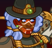ID: 578**Dungeon Raider Aeon (Aeon)**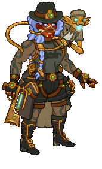
        
        
            **Skin**
            Dungeon Raider Aeon
        
    
    
        
            ID: 2223**Clandestine Operation**They must never know what we do in the shadows.<code>buff_upgrade,80,15196,1</code>
        
        
            **Feat**
            Clandestine Operation
            Aeon (80% Inner Circle)
        
    
    
        
            ID: 20**Large Bounty Contract**Claim a bounty worth 8 hours of offline gold earnings and event tokens.<code>seconds_worth_of_gold,28800</code>
        
        
            **Buff**
            Large Bounty Contract
            x6
        
    
    
        
            ID: 34**Large Blacksmithing Contract**Contract a master blacksmith to improve a piece of equipment owned by one of your Champions.<code>level_up_loot,24</code>
        
        
            **Buff**
            Large Blacksmithing Contract
            x6
        
    
    
        
            ID: 571**Platinum Aeon Chest**Loot for: Aeon<code>"for_crusaders":[150]</code>
        
        
            **Chest**
            Platinum Aeon Chest
            x14 (Shinies x1)
        
    

ID: 599

### Chosen of Vecna Warduke Skin & Feat Pack - 1,680 Platinum  
Date of release: 23 Jul 2025

> Unlock Warduke along with his exclusive Chosen of Vecna Skin & Feat!

Contents:

    
        
            ID: 116**Warduke (Seat 8)**
        
        
            **Champion Unlock**
            Warduke
        
    
    
        
            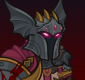ID: 579**Chosen of Vecna Warduke (Warduke)**
        
        
            **Skin**
            Chosen of Vecna Warduke
        
    
    
        
            ID: 2225**Right Hand of Evil**I go where I'm told, and whatever I find there I destroy.<code>buff_upgrade,80,9618</code>
        
        
            **Feat**
            Right Hand of Evil
            Warduke (80% Drawn to Power)
        
    
    
        
            ID: 20**Large Bounty Contract**Claim a bounty worth 8 hours of offline gold earnings and event tokens.<code>seconds_worth_of_gold,28800</code>
        
        
            **Buff**
            Large Bounty Contract
            x6
        
    
    
        
            ID: 34**Large Blacksmithing Contract**Contract a master blacksmith to improve a piece of equipment owned by one of your Champions.<code>level_up_loot,24</code>
        
        
            **Buff**
            Large Blacksmithing Contract
            x6
        
    
    
        
            ID: 434**Platinum Warduke Chest**Loot for: Warduke<code>"for_crusaders":[116]</code>
        
        
            **Chest**
            Platinum Warduke Chest
            x14 (Shinies x1)
        
    

ID: 600

### Knick Knack the Pseudodragon Familiar Pack - 2,380 Platinum  
Date of release: 23 Jul 2025

> Collect your own Knick Knack the Pseudodragon Familiar!

Contents:

    
        
            ID: 275**Knick Knack the Pseudodragon**Watch out, he collects EVERYTHING.
        
        
            **Familiar**
            Knick Knack the Pseudodragon
        
    
    
        
            ID: 4**Huge Potion of Giant's Strength**A transparent potion in which floats the sliver of a giant's fingernail.<code>global_dps_multiplier_mult,900</code>
        
        
            **Buff**
            Huge Potion of Giant's Strength
            x6
        
    
    
        
            ID: 8**Huge Potion of Clairvoyance**Three eyeballs bob in this yellowish potion.<code>gold_multiplier_mult,400</code>
        
        
            **Buff**
            Huge Potion of Clairvoyance
            x6
        
    
    
        
            ID: 36**Potion of Polish**This shiny, silver liquid clings to the edge of the bottle in an unusual way.<code>shiny_loot,1</code>
        
        
            **Buff**
            Potion of Polish
            x1
        
    
    
        
            ID: 40**Huge Potion of Fire Breath**The orange liquid in this vial flickers and smoke fills the top of the container.<code>click_damage_seconds_global_dps,600</code>
        
        
            **Buff**
            Huge Potion of Fire Breath
            x6
        
    
    
        
            ID: 77**Huge Potion of Speed**This potion's yellow fluid is streaked with black and swirls on its own.<code>time_scale,2.75</code>
        
        
            **Buff**
            Huge Potion of Speed
            x6
        
    
    
        
            ID: 1721**Potion of the Gold Hunter**Increase Gold Find by 100%<code>gold_multiplier_mult,100</code>
        
        
            **Buff**
            Potion of the Gold Hunter
            x1
        
    
    
        
            **Modron Component Pieces**
        
        
            **Modron Component Pieces**
            x2,000
        
    

ID: 601

### Fortune Hunter Eric Skin & Feat Pack - 1,680 Platinum  
Date of release: 30 Jul 2025

> Unlock Eric along with his exclusive Fortune Hunter Skin & Feat!

Contents:

    
        
            ID: 157**Eric (Seat 4)**
        
        
            **Champion Unlock**
            Eric
        
    
    
        
            ID: 580**Fortune Hunter Eric (Eric)**
        
        
            **Skin**
            Fortune Hunter Eric
        
    
    
        
            ID: 2035**Powerful Shove**Let's keep a safe distance. Way over there sounds perfect.<code>buff_upgrade,80,16132,1</code>
        
        
            **Feat**
            Powerful Shove
            Eric (80% Keep Away)
        
    
    
        
            ID: 20**Large Bounty Contract**Claim a bounty worth 8 hours of offline gold earnings and event tokens.<code>seconds_worth_of_gold,28800</code>
        
        
            **Buff**
            Large Bounty Contract
            x6
        
    
    
        
            ID: 34**Large Blacksmithing Contract**Contract a master blacksmith to improve a piece of equipment owned by one of your Champions.<code>level_up_loot,24</code>
        
        
            **Buff**
            Large Blacksmithing Contract
            x6
        
    
    
        
            ID: 647**Platinum Eric Chest**Loot for: Eric<code>"for_crusaders":[157]</code>
        
        
            **Chest**
            Platinum Eric Chest
            x14 (Shinies x1)
        
    

ID: 602

### Goldie the Sprite Familiar Pack - 1,680 Platinum  
Date of release: 30 Jul 2025

> Collect your own Goldie the Sprite Familiar!

Contents:

    
        
            ID: 276**Goldie the Sprite**She valiantly defends the gold hoard of the dragon's lair in her forest.
        
        
            **Familiar**
            Goldie the Sprite
        
    
    
        
            ID: 4**Huge Potion of Giant's Strength**A transparent potion in which floats the sliver of a giant's fingernail.<code>global_dps_multiplier_mult,900</code>
        
        
            **Buff**
            Huge Potion of Giant's Strength
            x4
        
    
    
        
            ID: 8**Huge Potion of Clairvoyance**Three eyeballs bob in this yellowish potion.<code>gold_multiplier_mult,400</code>
        
        
            **Buff**
            Huge Potion of Clairvoyance
            x4
        
    
    
        
            ID: 36**Potion of Polish**This shiny, silver liquid clings to the edge of the bottle in an unusual way.<code>shiny_loot,1</code>
        
        
            **Buff**
            Potion of Polish
            x1
        
    
    
        
            ID: 77**Huge Potion of Speed**This potion's yellow fluid is streaked with black and swirls on its own.<code>time_scale,2.75</code>
        
        
            **Buff**
            Huge Potion of Speed
            x4
        
    

ID: 605

### Ascended Baldric Theme Pack - 3,830 Platinum  
Date of release: 06 Aug 2025

> Unlock Baldric along with an exclusive Ascended Skin & Familiar!

Contents:

    
        
            ID: 165**Baldric**
        
        
            **Champion Unlock**
            Baldric
        
    
    
        
            ID: 585**Ascended Baldric (Baldric)**
        
        
            **Skin**
            Ascended Baldric
        
    
    
        
            ID: 279**Uggie the Otyugh**Loves giving hugs and eating trash.
        
        
            **Familiar**
            Uggie the Otyugh
        
    
    
        
            ID: 2275**Feat**???: 2275
        
        
            **Feat**
            ???: 2275
        
    
    
        
            ID: 663**Platinum Baldric Chest**Loot for: Baldric<code>"for_crusaders":[165]</code>
        
        
            **Chest**
            Platinum Baldric Chest
            x32 (Shinies x2)
        
    
    
        
            ID: 1723**Potion of the Gem Hunter**Increases the gem drops from bosses by 50%<code>increase_boss_gems_percent,50</code>
        
        
            **Buff**
            Potion of the Gem Hunter
            x1
        
    

ID: 606

### Quandary the Sphinx of Wonder Familiar Pack - 1,680 Platinum  
Date of release: 06 Aug 2025

> Collect your own Quandary the Sphinx of Wonder Familiar!

Contents:

    
        
            ID: 280**Quandary the Sphinx of Wonder**Mystifying even to themselves.
        
        
            **Familiar**
            Quandary the Sphinx of Wonder
        
    
    
        
            ID: 4**Huge Potion of Giant's Strength**A transparent potion in which floats the sliver of a giant's fingernail.<code>global_dps_multiplier_mult,900</code>
        
        
            **Buff**
            Huge Potion of Giant's Strength
            x4
        
    
    
        
            ID: 8**Huge Potion of Clairvoyance**Three eyeballs bob in this yellowish potion.<code>gold_multiplier_mult,400</code>
        
        
            **Buff**
            Huge Potion of Clairvoyance
            x4
        
    
    
        
            ID: 36**Potion of Polish**This shiny, silver liquid clings to the edge of the bottle in an unusual way.<code>shiny_loot,1</code>
        
        
            **Buff**
            Potion of Polish
            x1
        
    
    
        
            ID: 77**Huge Potion of Speed**This potion's yellow fluid is streaked with black and swirls on its own.<code>time_scale,2.75</code>
        
        
            **Buff**
            Huge Potion of Speed
            x4
        
    

ID: 608

### Kith'rak Lae'zel Skin & Feat Pack - 1,680 Platinum  
Date of release: 06 Aug 2025

> Unlock Lae'zel along with her exclusive Kith'rak Skin & Feat!

Contents:

    
        
            ID: 128**Lae'zel (Seat 2)**
        
        
            **Champion Unlock**
            Lae'zel
        
    
    
        
            ID: 503**Kith'rak Lae'zel (Lae'zel)**
        
        
            **Skin**
            Kith'rak Lae'zel
        
    
    
        
            ID: 2222**Queen's Blade**Vlaakith gha'g shkath zai!<code>buff_upgrade,80,12114</code>
        
        
            **Feat**
            Queen's Blade
            Lae'zel (80% Ceremorphosis (Prestack))
        
    
    
        
            ID: 20**Large Bounty Contract**Claim a bounty worth 8 hours of offline gold earnings and event tokens.<code>seconds_worth_of_gold,28800</code>
        
        
            **Buff**
            Large Bounty Contract
            x6
        
    
    
        
            ID: 34**Large Blacksmithing Contract**Contract a master blacksmith to improve a piece of equipment owned by one of your Champions.<code>level_up_loot,24</code>
        
        
            **Buff**
            Large Blacksmithing Contract
            x6
        
    
    
        
            ID: 458**Platinum Lae'zel Chest**Loot for: Lae'zel<code>"for_crusaders":[128]</code>
        
        
            **Chest**
            Platinum Lae'zel Chest
            x14 (Shinies x1)
        
    

ID: 607

### Seven Heavens Lazaapz Theme Pack - 3,830 Platinum  
Date of release: 13 Aug 2025

> Unlock Lazaapz along with an exclusive Seven Heavens Skin & Familiar!

Contents:

    
        
            ID: 66**Lazaapz (Seat 9)**
        
        
            **Champion Unlock**
            Lazaapz
        
    
    
        
            ID: 586**Seven Heavens Lazaapz (Lazaapz)**
        
        
            **Skin**
            Seven Heavens Lazaapz
        
    
    
        
            ID: 281**Aurelia the Clockwork Hollyphant**Made by Mechanus' finest artificers.
        
        
            **Familiar**
            Aurelia the Clockwork Hollyphant
        
    
    
        
            ID: 2278**Feat**???: 2278
        
        
            **Feat**
            ???: 2278
        
    
    
        
            ID: 191**Platinum Lazaapz Chest**Loot for: Lazaapz<code>"for_crusaders":[66]</code>
        
        
            **Chest**
            Platinum Lazaapz Chest
            x32 (Shinies x2)
        
    
    
        
            ID: 1723**Potion of the Gem Hunter**Increases the gem drops from bosses by 50%<code>increase_boss_gems_percent,50</code>
        
        
            **Buff**
            Potion of the Gem Hunter
            x1
        
    

ID: 610

### Arborean Hunter Shandie Skin & Feat Pack - 1,680 Platinum  
Date of release: 13 Aug 2025

> Unlock Shandie along with her exclusive Arborean Hunter Skin & Feat!

Contents:

    
        
            ID: 47**Shandie (Seat 6)**
        
        
            **Champion Unlock**
            Shandie
        
    
    
        
            ID: 589**Arborean Hunter Shandie (Shandie)**
        
        
            **Skin**
            Arborean Hunter Shandie
        
    
    
        
            ID: 2248**True Shot**I never miss.<code>buff_upgrades,80,9730,9731,9732</code>
        
        
            **Feat**
            True Shot
            Shandie (80% All Specialisations)
        
    
    
        
            ID: 20**Large Bounty Contract**Claim a bounty worth 8 hours of offline gold earnings and event tokens.<code>seconds_worth_of_gold,28800</code>
        
        
            **Buff**
            Large Bounty Contract
            x6
        
    
    
        
            ID: 34**Large Blacksmithing Contract**Contract a master blacksmith to improve a piece of equipment owned by one of your Champions.<code>level_up_loot,24</code>
        
        
            **Buff**
            Large Blacksmithing Contract
            x6
        
    
    
        
            ID: 104**Platinum Shandie Chest**Loot for: Shandie<code>"for_crusaders":[47]</code>
        
        
            **Chest**
            Platinum Shandie Chest
            x14 (Shinies x1)
        
    

ID: 609

### Blind Justice Ishi Skin & Feat Pack - 1,680 Platinum  
Date of release: 20 Aug 2025

> Unlock Ishi along with her exclusive Blind Justice Skin & Feat!

Contents:

    
        
            ID: 31**Ishi (Seat 4)**
        
        
            **Champion Unlock**
            Ishi
        
    
    
        
            ID: 588**Blind Justice Ishi (Ishi)**
        
        
            **Skin**
            Blind Justice Ishi
        
    
    
        
            ID: 1577**Enemy Enumeration**Five stabs, six stabs, seven stabs, MORE!<code>buff_upgrade,80,16530</code>
        
        
            **Feat**
            Enemy Enumeration
            Ishi (80% Faster, Harder, Stronger)
        
    
    
        
            ID: 20**Large Bounty Contract**Claim a bounty worth 8 hours of offline gold earnings and event tokens.<code>seconds_worth_of_gold,28800</code>
        
        
            **Buff**
            Large Bounty Contract
            x6
        
    
    
        
            ID: 34**Large Blacksmithing Contract**Contract a master blacksmith to improve a piece of equipment owned by one of your Champions.<code>level_up_loot,24</code>
        
        
            **Buff**
            Large Blacksmithing Contract
            x6
        
    
    
        
            ID: 58**Platinum Ishi Chest**Loot for: Ishi<code>"for_crusaders":[31]</code>
        
        
            **Chest**
            Platinum Ishi Chest
            x14 (Shinies x1)
        
    

ID: 611

### Radiance the Pegasus Familiar Pack - 2,380 Platinum  
Date of release: 20 Aug 2025

> Collect your own Radiance the Pegasus Familiar!

Contents:

    
        
            ID: 282**Radiance the Pegasus Familiar**From the skies of the Seven Heavens.
        
        
            **Familiar**
            Radiance the Pegasus Familiar
        
    
    
        
            ID: 4**Huge Potion of Giant's Strength**A transparent potion in which floats the sliver of a giant's fingernail.<code>global_dps_multiplier_mult,900</code>
        
        
            **Buff**
            Huge Potion of Giant's Strength
            x6
        
    
    
        
            ID: 8**Huge Potion of Clairvoyance**Three eyeballs bob in this yellowish potion.<code>gold_multiplier_mult,400</code>
        
        
            **Buff**
            Huge Potion of Clairvoyance
            x6
        
    
    
        
            ID: 36**Potion of Polish**This shiny, silver liquid clings to the edge of the bottle in an unusual way.<code>shiny_loot,1</code>
        
        
            **Buff**
            Potion of Polish
            x1
        
    
    
        
            ID: 40**Huge Potion of Fire Breath**The orange liquid in this vial flickers and smoke fills the top of the container.<code>click_damage_seconds_global_dps,600</code>
        
        
            **Buff**
            Huge Potion of Fire Breath
            x6
        
    
    
        
            ID: 77**Huge Potion of Speed**This potion's yellow fluid is streaked with black and swirls on its own.<code>time_scale,2.75</code>
        
        
            **Buff**
            Huge Potion of Speed
            x6
        
    
    
        
            ID: 1721**Potion of the Gold Hunter**Increase Gold Find by 100%<code>gold_multiplier_mult,100</code>
        
        
            **Buff**
            Potion of the Gold Hunter
            x1
        
    
    
        
            **Modron Component Pieces**
        
        
            **Modron Component Pieces**
            x2,000
        
    

ID: 612

### Weave Anchor Volo Skin & Feat Pack - 1,680 Platinum  
Date of release: 27 Aug 2025

> Unlock Volo along with his exclusive Weave Anchor Skin & Feat!

Contents:

    
        
            ID: 159**Volo (Seat 9)**
        
        
            **Champion Unlock**
            Volo
        
    
    
        
            ID: 590**Weave Anchor Volo (Volo)**
        
        
            **Skin**
            Weave Anchor Volo
        
    
    
        
            ID: 2249**Unknown Power**You ask why Elminster is so concerned with my wellbeing? He's a true fan, of course! Why else?<code>buff_upgrade,80,16554,0 buff_upgrade,80,16555,0 buff_upgrade,80,16556,0</code>
        
        
            **Feat**
            Unknown Power
            Volo (80% All Specialisations (Prestack))
        
    
    
        
            ID: 20**Large Bounty Contract**Claim a bounty worth 8 hours of offline gold earnings and event tokens.<code>seconds_worth_of_gold,28800</code>
        
        
            **Buff**
            Large Bounty Contract
            x6
        
    
    
        
            ID: 34**Large Blacksmithing Contract**Contract a master blacksmith to improve a piece of equipment owned by one of your Champions.<code>level_up_loot,24</code>
        
        
            **Buff**
            Large Blacksmithing Contract
            x6
        
    
    
        
            ID: 651**Platinum Volo Chest**Loot for: Volo<code>"for_crusaders":[159]</code>
        
        
            **Chest**
            Platinum Volo Chest
            x14 (Shinies x1)
        
    

ID: 613

### Solar Scion Drizzt Skin & Feat Pack - 1,680 Platinum  
Date of release: 27 Aug 2025

> Collect an exclusive Solar Scion Skin & Feat for Drizzt!

Contents:

    
        
            ID: 591**Solar Scion Drizzt (Drizzt)**
        
        
            **Skin**
            Solar Scion Drizzt
        
    
    
        
            ID: 2250**Eternal Companions**I am truly blessed to know them as dear friends.<code>buff_upgrade,80,11514</code>
        
        
            **Feat**
            Eternal Companions
            Drizzt (80% Companions of the Hall)
        
    
    
        
            ID: 20**Large Bounty Contract**Claim a bounty worth 8 hours of offline gold earnings and event tokens.<code>seconds_worth_of_gold,28800</code>
        
        
            **Buff**
            Large Bounty Contract
            x6
        
    
    
        
            ID: 34**Large Blacksmithing Contract**Contract a master blacksmith to improve a piece of equipment owned by one of your Champions.<code>level_up_loot,24</code>
        
        
            **Buff**
            Large Blacksmithing Contract
            x6
        
    
    
        
            ID: 474**Platinum Drizzt Chest**Loot for: Drizzt<code>"for_crusaders":[18]</code>
        
        
            **Chest**
            Platinum Drizzt Chest
            x14 (Shinies x1)
        
    

ID: 586

### Mythic Cazrin Theme Pack - 3,830 Platinum  
Date of release: 03 Sept 2025

> Unlock Cazrin along with an exclusive Mythic Skin & Familiar!

Contents:

    
        
            ID: 166**Cazrin**
        
        
            **Champion Unlock**
            Cazrin
        
    
    
        
            ID: 594**Mythic Cazrin (Cazrin)**
        
        
            **Skin**
            Mythic Cazrin
        
    
    
        
            ID: 284**Keeper the Spellbook**Little secret keepers.
        
        
            **Familiar**
            Keeper the Spellbook
        
    
    
        
            ID: 2290**Feat**???: 2290
        
        
            **Feat**
            ???: 2290
        
    
    
        
            ID: 665**Platinum Cazrin Chest**Loot for: Cazrin<code>"for_crusaders":[166]</code>
        
        
            **Chest**
            Platinum Cazrin Chest
            x32 (Shinies x2)
        
    
    
        
            ID: 1723**Potion of the Gem Hunter**Increases the gem drops from bosses by 50%<code>increase_boss_gems_percent,50</code>
        
        
            **Buff**
            Potion of the Gem Hunter
            x1
        
    

ID: 597

### Heroic Bobby Skin & Feat Pack - 1,680 Platinum  
Date of release: 03 Sept 2025

> Collect an exclusive Heroic Skin & Feat for Bobby!

Contents:

    
        
            ID: 152**Bobby (Seat 12)**
        
        
            **Champion Unlock**
            Bobby
        
    
    
        
            ID: 595**Heroic Bobby (Bobby)**
        
        
            **Skin**
            Heroic Bobby
        
    
    
        
            ID: 2227**TBD Bobby Feat (Do not translate)**
        
        
            **Feat**
            TBD Bobby Feat (Do not translate)
            Bobby ()
        
    
    
        
            ID: 20**Large Bounty Contract**Claim a bounty worth 8 hours of offline gold earnings and event tokens.<code>seconds_worth_of_gold,28800</code>
        
        
            **Buff**
            Large Bounty Contract
            x6
        
    
    
        
            ID: 34**Large Blacksmithing Contract**Contract a master blacksmith to improve a piece of equipment owned by one of your Champions.<code>level_up_loot,24</code>
        
        
            **Buff**
            Large Blacksmithing Contract
            x6
        
    
    
        
            ID: 575**Platinum Bobby Chest**Loot for: Bobby<code>"for_crusaders":[152]</code>
        
        
            **Chest**
            Platinum Bobby Chest
            x14 (Shinies x1)
        
    

ID: 603

### Founder's Pack VIII - 3,360 Platinum  
Date of release: 03 Sept 2025

> Get an INCREDIBLE deal to gear up and start your adventures in the Forgotten Realms quickly!

Contents:

    
        
            ID: 596**???**
        
        
            **???**
            skin
            ID: 596
        
    
    
        
            ID: 274**TBD (Do not translate)**
        
        
            **Familiar**
            TBD (Do not translate)
        
    
    
        
            ID: 2**Platinum Chest**<code>"for_crusaders":[]</code>
        
        
            **Chest**
            Platinum Chest
            x84 (Shinies x5)
        
    
    
        
            ID: 4**Huge Potion of Giant's Strength**A transparent potion in which floats the sliver of a giant's fingernail.<code>global_dps_multiplier_mult,900</code>
        
        
            **Buff**
            Huge Potion of Giant's Strength
            x2
        
    
    
        
            ID: 8**Huge Potion of Clairvoyance**Three eyeballs bob in this yellowish potion.<code>gold_multiplier_mult,400</code>
        
        
            **Buff**
            Huge Potion of Clairvoyance
            x2
        
    
    
        
            ID: 20**Large Bounty Contract**Claim a bounty worth 8 hours of offline gold earnings and event tokens.<code>seconds_worth_of_gold,28800</code>
        
        
            **Buff**
            Large Bounty Contract
            x2
        
    
    
        
            ID: 34**Large Blacksmithing Contract**Contract a master blacksmith to improve a piece of equipment owned by one of your Champions.<code>level_up_loot,24</code>
        
        
            **Buff**
            Large Blacksmithing Contract
            x2
        
    
    
        
            ID: 40**Huge Potion of Fire Breath**The orange liquid in this vial flickers and smoke fills the top of the container.<code>click_damage_seconds_global_dps,600</code>
        
        
            **Buff**
            Huge Potion of Fire Breath
            x2
        
    
    
        
            ID: 1723**Potion of the Gem Hunter**Increases the gem drops from bosses by 50%<code>increase_boss_gems_percent,50</code>
        
        
            **Buff**
            Potion of the Gem Hunter
            x1
        
    
    
        
            ID: 1798**Epic Golden Potion**Gold and purple liquid swirl around each other as if dancing.<code>golden_loot,1</code>
        
        
            **Buff**
            Epic Golden Potion
            x1
        
    
    
        
            **Gems**
        
        
            **Gems**
            x5,000
        
    

ID: 614

### Legendkeeper Alyndra Theme Pack - 3,830 Platinum  
Date of release: 10 Sept 2025

> Unlock Alyndra along with an exclusive Legendkeeper Skin & Familiar!

Contents:

    
        
            ID: 77**Alyndra (Seat 6)**
        
        
            **Champion Unlock**
            Alyndra
        
    
    
        
            ID: 597**Legendkeeper Alyndra (Alyndra)**
        
        
            **Skin**
            Legendkeeper Alyndra
        
    
    
        
            ID: 278**Professor Griff**The judgiest judge to ever judge.
        
        
            **Familiar**
            Professor Griff
        
    
    
        
            ID: 1**Selflessness**Aye, a selfless dwarf I am.<code>global_dps_multiplier_mult,10</code>
        
        
            **Feat**
            Selflessness
            Bruenor (10% All Champion Damage)
        
    
    
        
            ID: 261**Platinum Alyndra Chest**Loot for: Alyndra<code>"for_crusaders":[77]</code>
        
        
            **Chest**
            Platinum Alyndra Chest
            x32 (Shinies x2)
        
    
    
        
            ID: 1723**Potion of the Gem Hunter**Increases the gem drops from bosses by 50%<code>increase_boss_gems_percent,50</code>
        
        
            **Buff**
            Potion of the Gem Hunter
            x1
        
    

ID: 615

### Mythic Torogar Skin & Feat Pack - 1,680 Platinum  
Date of release: 10 Sept 2025

> Collect an exclusive Mythic Skin & Feat for Torogar!

Contents:

    
        
            ID: 69**Torogar (Seat 10)**
        
        
            **Champion Unlock**
            Torogar
        
    
    
        
            ID: 598**Mythic Torogar (Torogar)**
        
        
            **Skin**
            Mythic Torogar
        
    
    
        
            ID: 2009**TBD Torogar Feat (Do not translate)**
        
        
            **Feat**
            TBD Torogar Feat (Do not translate)
            Torogar ()
        
    
    
        
            ID: 20**Large Bounty Contract**Claim a bounty worth 8 hours of offline gold earnings and event tokens.<code>seconds_worth_of_gold,28800</code>
        
        
            **Buff**
            Large Bounty Contract
            x6
        
    
    
        
            ID: 34**Large Blacksmithing Contract**Contract a master blacksmith to improve a piece of equipment owned by one of your Champions.<code>level_up_loot,24</code>
        
        
            **Buff**
            Large Blacksmithing Contract
            x6
        
    
    
        
            ID: 245**Platinum Torogar Chest**Loot for: Torogar<code>"for_crusaders":[69]</code>
        
        
            **Chest**
            Platinum Torogar Chest
            x14 (Shinies x1)
        
    

ID: 617

### Berserker Wulfgar Skin & Feat Pack - 1,680 Platinum  
Date of release: 17 Sept 2025

> Collect an exclusive Berserker Skin & Feat for Wulfgar!

Contents:

    
        
            ID: 32**Wulfgar (Seat 10)**
        
        
            **Champion Unlock**
            Wulfgar
        
    
    
        
            ID: 600**Berserker Wulfgar (Wulfgar)**
        
        
            **Skin**
            Berserker Wulfgar
        
    
    
        
            ID: 2261**TBD Wulfgar Feat (Do not translate)**
        
        
            **Feat**
            TBD Wulfgar Feat (Do not translate)
            Wulfgar ()
        
    
    
        
            ID: 20**Large Bounty Contract**Claim a bounty worth 8 hours of offline gold earnings and event tokens.<code>seconds_worth_of_gold,28800</code>
        
        
            **Buff**
            Large Bounty Contract
            x6
        
    
    
        
            ID: 34**Large Blacksmithing Contract**Contract a master blacksmith to improve a piece of equipment owned by one of your Champions.<code>level_up_loot,24</code>
        
        
            **Buff**
            Large Blacksmithing Contract
            x6
        
    
    
        
            ID: 68**Platinum Wulfgar Chest**Loot for: Wulfgar<code>"for_crusaders":[32]</code>
        
        
            **Chest**
            Platinum Wulfgar Chest
            x14 (Shinies x1)
        
    

ID: 618

### Nightmare D'hani Skin & Feat Pack - 1,680 Platinum  
Date of release: 17 Sept 2025

> Collect an exclusive Nightmare Skin & Feat for D'hani!

Contents:

    
        
            ID: 89**D'hani (Seat 1)**
        
        
            **Champion Unlock**
            D'hani
        
    
    
        
            ID: 601**Nightmare D'hani (D'hani)**
        
        
            **Skin**
            Nightmare D'hani
        
    
    
        
            ID: 2262**TBD D'hani Feat (Do not translate)**
        
        
            **Feat**
            TBD D'hani Feat (Do not translate)
            D'hani ()
        
    
    
        
            ID: 20**Large Bounty Contract**Claim a bounty worth 8 hours of offline gold earnings and event tokens.<code>seconds_worth_of_gold,28800</code>
        
        
            **Buff**
            Large Bounty Contract
            x6
        
    
    
        
            ID: 34**Large Blacksmithing Contract**Contract a master blacksmith to improve a piece of equipment owned by one of your Champions.<code>level_up_loot,24</code>
        
        
            **Buff**
            Large Blacksmithing Contract
            x6
        
    
    
        
            ID: 335**Platinum D'hani Chest**Loot for: D'hani<code>"for_crusaders":[89]</code>
        
        
            **Chest**
            Platinum D'hani Chest
            x14 (Shinies x1)
        
    

ID: 619

### Silver Sword of Gith Familiar Pack - 840 Platinum  
Date of release: 24 Sept 2025

> Collect your own Silver Sword of Gith Familiar!

Contents:

    
        
            ID: 283**Animated Silver Sword**A gift. A burden. The sacred blade of shadow's bane.
        
        
            **Familiar**
            Animated Silver Sword
        
    
    
        
            ID: 4**Huge Potion of Giant's Strength**A transparent potion in which floats the sliver of a giant's fingernail.<code>global_dps_multiplier_mult,900</code>
        
        
            **Buff**
            Huge Potion of Giant's Strength
            x2
        
    
    
        
            ID: 8**Huge Potion of Clairvoyance**Three eyeballs bob in this yellowish potion.<code>gold_multiplier_mult,400</code>
        
        
            **Buff**
            Huge Potion of Clairvoyance
            x2
        
    
    
        
            ID: 77**Huge Potion of Speed**This potion's yellow fluid is streaked with black and swirls on its own.<code>time_scale,2.75</code>
        
        
            **Buff**
            Huge Potion of Speed
            x2
        
    

[Back to Top](#top)

*Last Modified: {{ site.time }}*