[Back to Main](index.md)

# Premium Packs and DLC

Upcoming real-money shop items.

ID: 504

### Goblin Glitch Calliope Skin & Feat Pack - 1,680 Platinum ($11.99)  
Date of release: 27 Nov 2024

> Snag Calliope's exclusive Goblin Glitch Skin & Feat!

Contents:

    
        
            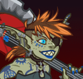ID: 483**Goblin Glitch Calliope (Calliope)**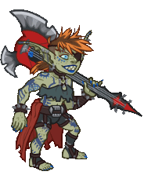
        
        
            **Skin**
            Goblin Glitch Calliope
        
    
    
        
            ID: 1979**Goblin Glitch**I finally look on the outside how I feel on the inside!<code>add_hero_tags,0,goblin reduce_attack_cooldown,0.5</code>
        
        
            **Feat**
            Goblin Glitch
            Calliope (Counts as Goblin & -0.5s Base Attack Cooldown)
        
    
    
        
            ID: 20**Large Bounty Contract**Claim a bounty worth 8 hours of offline gold earnings and event tokens.<code>seconds_worth_of_gold,28800</code>
        
        
            **Buff**
            Large Bounty Contract
            x6
        
    
    
        
            ID: 34**Large Blacksmithing Contract**Contract a master blacksmith to improve a piece of equipment owned by one of your Champions.<code>level_up_loot,24</code>
        
        
            **Buff**
            Large Blacksmithing Contract
            x6
        
    
    
        
            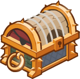ID: 465**Platinum Calliope Chest**Loot for: Calliope<code>"for_crusaders":[5]</code>
        
        
            **Chest**
            Platinum Calliope Chest
            x14 (Shinies x1)
        
    

ID: 505

### Herald of the Champions Dungeon Master Skin & Feat Pack - 1,680 Platinum ($11.99)  
Date of release: 27 Nov 2024

> Unlock Dungeon Master along with his exclusive Herald of the Champions Skin & Feat!

Contents:

    
        
            ID: 99**Dungeon Master (Seat 6)**
        
        
            **Champion Unlock**
            Dungeon Master
        
    
    
        
            ID: 490**Herald of the Champions Dungeon Master (DM)**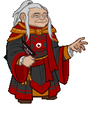
        
        
            **Skin**
            Herald of the Champions Dungeon Master
        
    
    
        
            ID: 1978**Wound Master**It is not yet your time. More adventure awaits!<code>buff_upgrade,80,7845</code>
        
        
            **Feat**
            Wound Master
            DM (80% Words of Encouragement)
        
    
    
        
            ID: 20**Large Bounty Contract**Claim a bounty worth 8 hours of offline gold earnings and event tokens.<code>seconds_worth_of_gold,28800</code>
        
        
            **Buff**
            Large Bounty Contract
            x6
        
    
    
        
            ID: 34**Large Blacksmithing Contract**Contract a master blacksmith to improve a piece of equipment owned by one of your Champions.<code>level_up_loot,24</code>
        
        
            **Buff**
            Large Blacksmithing Contract
            x6
        
    
    
        
            ID: 355**Platinum Dungeon Master Chest**Loot for: Dungeon Master<code>"for_crusaders":[99]</code>
        
        
            **Chest**
            Platinum Dungeon Master Chest
            x14 (Shinies x1)
        
    

ID: 506

### Moonlight Halsin Theme Pack - 3,830 Platinum ($27.99)  
Date of release: 04 Dec 2024

> Unlock Halsin along with an exclusive Moonlight Skin & Armored Owlbear Familiar!

Contents:

    
        
            ID: 156**Halsin (Seat 3 (Guess))**
        
        
            **Champion Unlock**
            Halsin
        
    
    
        
            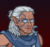ID: 500**Moonlight Halsin (Halsin)**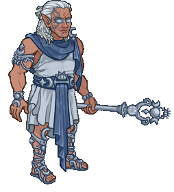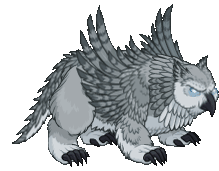
        
        
            **Skin**
            Moonlight Halsin
        
    
    
        
            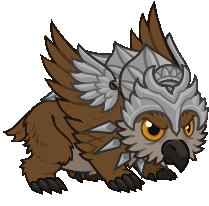ID: 232**Armored Owlbear**Don't test them.
        
        
            **Familiar**
            Armored Owlbear
        
    
    
        
            ID: 2002**Feat**???: 2002
        
        
            **Feat**
            ???: 2002
        
    
    
        
            ID: 645**Platinum Halsin Chest**Loot for: Halsin<code>"for_crusaders":[156]</code>
        
        
            **Chest**
            Platinum Halsin Chest
            x32 (Shinies x2)
        
    
    
        
            ID: 1723**Potion of the Gem Hunter**Increases the gem drops from bosses by 50%<code>increase_boss_gems_percent,50</code>
        
        
            **Buff**
            Potion of the Gem Hunter
            x1
        
    

ID: 508

### Shadowheart's Champions of Renown Pack - 0 Platinum ($69.99)  
Date of release: 04 Dec 2024

> Xbox Exclusive (Do Not Translate)

ⓘ *Note: This pack might not be available for purchase since it's potentially a platform giveaway.*

Contents:

    
        
            ID: 28**Deekin (Seat 1)**
        
        
            **Champion Unlock**
            Deekin
        
    
    
        
            ID: 58**Briv (Seat 5)**
        
        
            **Champion Unlock**
            Briv
        
    
    
        
            ID: 61**Jaheira (Seat 9)**
        
        
            **Champion Unlock**
            Jaheira
        
    
    
        
            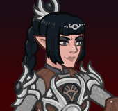ID: 141**Shadowheart (Seat 6)**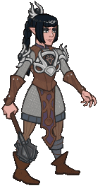
        
        
            **Champion Unlock**
            Shadowheart
        
    
    
        
            ID: 142**Wyll (Seat 12)**
        
        
            **Champion Unlock**
            Wyll
        
    
    
        
            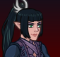ID: 492**Sharran Shadowheart (Shadowheart)**
        
        
            **Skin**
            Sharran Shadowheart
        
    
    
        
            ID: 234**Sir Perchington the Fancy Owl**Hoot, I say. HOOOOOOOT!
        
        
            **Familiar**
            Sir Perchington the Fancy Owl
        
    
    
        
            ID: 54**Platinum Deekin Chest**Loot for: Deekin<code>"for_crusaders":[28]</code>
        
        
            **Chest**
            Platinum Deekin Chest
            x32 (Shinies x2)
        
    
    
        
            ID: 175**Platinum Briv Chest**Loot for: Briv<code>"for_crusaders":[58]</code>
        
        
            **Chest**
            Platinum Briv Chest
            x32 (Shinies x2)
        
    
    
        
            ID: 181**Platinum Jaheira Chest**Loot for: Jaheira<code>"for_crusaders":[61]</code>
        
        
            **Chest**
            Platinum Jaheira Chest
            x32 (Shinies x2)
        
    
    
        
            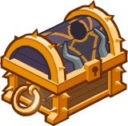ID: 553**Platinum  Shadowheart Chest**Loot for: Shadowheart<code>"for_crusaders":[141]</code>
        
        
            **Chest**
            Platinum  Shadowheart Chest
            x32 (Shinies x2)
        
    
    
        
            ID: 555**Platinum Wyll Chest**Loot for: Wyll<code>"for_crusaders":[142]</code>
        
        
            **Chest**
            Platinum Wyll Chest
            x32 (Shinies x2)
        
    
    
        
            ID: 1721**Potion of the Gold Hunter**Increase Gold Find by 100%<code>gold_multiplier_mult,100</code>
        
        
            **Buff**
            Potion of the Gold Hunter
            x1
        
    
    
        
            ID: 1723**Potion of the Gem Hunter**Increases the gem drops from bosses by 50%<code>increase_boss_gems_percent,50</code>
        
        
            **Buff**
            Potion of the Gem Hunter
            x1
        
    

ID: 509

### Shadow Warduke Skin & Feat Pack - 1,680 Platinum ($0.00)  
Date of release: 04 Dec 2024

> Unlock Warduke along with his exclusive Shadow Warduke Skin & Feat!

Contents:

    
        
            ID: 116**Warduke (Seat 8)**
        
        
            **Champion Unlock**
            Warduke
        
    
    
        
            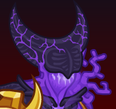ID: 493**Shadow Warduke (Warduke)**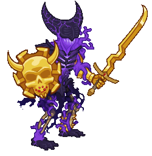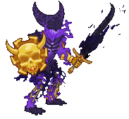
        
        
            **Skin**
            Shadow Warduke
        
    
    
        
            ID: 1049**Immolation**Yes! Burn! Burn and die!<code>immolation,1,5</code>
        
        
            **Feat**
            Immolation
            Warduke (1s BUD per sec for 5s)
        
    
    
        
            ID: 20**Large Bounty Contract**Claim a bounty worth 8 hours of offline gold earnings and event tokens.<code>seconds_worth_of_gold,28800</code>
        
        
            **Buff**
            Large Bounty Contract
            x6
        
    
    
        
            ID: 34**Large Blacksmithing Contract**Contract a master blacksmith to improve a piece of equipment owned by one of your Champions.<code>level_up_loot,24</code>
        
        
            **Buff**
            Large Blacksmithing Contract
            x6
        
    
    
        
            ID: 434**Platinum Warduke Chest**Loot for: Warduke<code>"for_crusaders":[116]</code>
        
        
            **Chest**
            Platinum Warduke Chest
            x14 (Shinies x1)
        
    

ID: 11

### Bruenor's Starter Pack - 0 Platinum ($11.99)  
Date of release: 11 Dec 2024

> Contains 10 Platinum Chests and awesome gear for Bruenor!

Contents:

    
        
            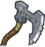ID: 3**Well Used Axe (Bruenor)**I've lost count of the number of goblins slaughtered by its razor edge.
        
        
            **Rare**
            All Champion Damage
            Bruenor (Slot 1)
        
    
    
        
            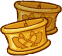ID: 8**Gold Beard Clips of the Clan (Bruenor)**Ancient family clips found in the depths of the Mithral Hall.
        
        
            **Golden Epic**
            All Champion Damage
            Bruenor (Slot 2)
        
    
    
        
            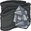ID: 11**Thick Sturdy Belt (Bruenor)**It's quite slimming!
        
        
            **Rare**
            Dwarven Glory
            Bruenor (Slot 3)
        
    
    
        
            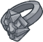ID: 15**Dark Iron Ring (Bruenor)**A magical ring crafted from a fallen meteorite.
        
        
            **Rare**
            Rally
            Bruenor (Slot 4)
        
    
    
        
            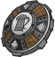ID: 19**Strong Shield (Bruenor)**It's strong enough to stop a blow from a raging giant.
        
        
            **Rare**
            Ultimate Damage
            Bruenor (Slot 5)
        
    
    
        
            ID: 23**Mithral Helm (Bruenor)**Stronger than steel, and far lighter.
        
        
            **Rare**
            Ultimate Cooldown Reduction
            Bruenor (Slot 6)
        
    
    
        
            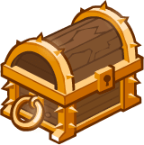ID: 2**Platinum Chest**<code>"for_crusaders":[]</code>
        
        
            **Chest**
            Platinum Chest
            x10 (Shinies x1)
        
    

ID: 15

### Force Grey - Calliope Pack - 0 Platinum ($11.99)  
Date of release: 11 Dec 2024

> Contains 10 Platinum Chests and awesome gear for Calliope!

Contents:

    
        
            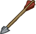ID: 99**Broadhead Crossbow Bolt (Calliope)**It nearly doesn't fit in my lute!
        
        
            **Rare**
            All Champion Damage
            Calliope (Slot 1)
        
    
    
        
            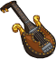ID: 104**Ornate Lute of Ballads (Calliope)**Hey, are you even listening to me? Argh! That's it...!
        
        
            **Golden Epic**
            All Champion Damage
            Calliope (Slot 2)
        
    
    
        
            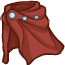ID: 107**Triple-Clasped Cloak (Calliope)**The only way this thing comes flying off in combat is if I'm feeling especially fabulous.
        
        
            **Rare**
            Bardic Inspiration
            Calliope (Slot 3)
        
    
    
        
            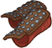ID: 111**Studded Leather Bracers (Calliope)**Some of the best wrist-based protection a girl can ask for.
        
        
            **Rare**
            Song of Protection
            Calliope (Slot 4)
        
    
    
        
            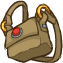ID: 115**Magically Enhanced Satchel (Calliope)**Touch the gem in the wrong way and boom! Hope you weren't too attached to that hand.
        
        
            **Rare**
            Ultimate Damage
            Calliope (Slot 5)
        
    
    
        
            ID: 119**Sturdy Leather Eyepatch (Calliope)**A sturdy accessory that aids in my night time adventures.
        
        
            **Rare**
            Ultimate Cooldown Reduction
            Calliope (Slot 6)
        
    
    
        
            ID: 2**Platinum Chest**<code>"for_crusaders":[]</code>
        
        
            **Chest**
            Platinum Chest
            x10 (Shinies x1)
        
    

ID: 16

### Force Grey - Hitch Pack - 0 Platinum ($11.99)  
Date of release: 11 Dec 2024

> Contains 10 Platinum Chests and awesome gear for Hitch!

Contents:

    
        
            ID: 13**Hitch (Seat 8)**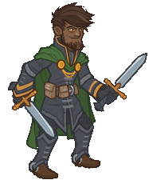
        
        
            **Champion Unlock**
            Hitch
        
    
    
        
            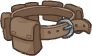ID: 291**Multi-Pouch (Hitch)**Why have one pouch when you could have five?
        
        
            **Rare**
            Ricochet
            Hitch (Slot 1)
        
    
    
        
            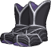ID: 295**Sticky Boots (Hitch)**I can scale all but the slipperiest surfaces.
        
        
            **Rare**
            All Champion Damage
            Hitch (Slot 3)
        
    
    
        
            ID: 300**Magnificent Cape of Free Flowing (Hitch)**It never gets tangled in my legs.
        
        
            **Golden Epic**
            Natural Performer
            Hitch (Slot 4)
        
    
    
        
            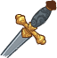ID: 303**Golden Dagger (Hitch)**Everything's better with a little gold added in.
        
        
            **Rare**
            All Champion Damage
            Hitch (Slot 2)
        
    
    
        
            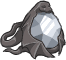ID: 307**Crystal Ring (Hitch)**That's 100% legitimate Icewind Crystal.
        
        
            **Rare**
            Ultimate Damage
            Hitch (Slot 5)
        
    
    
        
            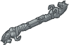ID: 311**Static Rod (Hitch)**It has some small magical properties that makes it quite useful.
        
        
            **Rare**
            Ultimate Cooldown Reduction
            Hitch (Slot 6)
        
    
    
        
            ID: 2**Platinum Chest**<code>"for_crusaders":[]</code>
        
        
            **Chest**
            Platinum Chest
            x10 (Shinies x1)
        
    

ID: 17

### Force Grey - Tyril Pack - 0 Platinum ($11.99)  
Date of release: 11 Dec 2024

> Contains 10 Platinum Chests and awesome gear for Tyril!

Contents:

    
        
            ID: 219**Twisted Wooden Staff (Tyril)**The twisting only serves to make it stronger.
        
        
            **Rare**
            Health
            Tyril (Slot 1)
        
    
    
        
            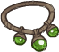ID: 223**Fine Jade Necklace (Tyril)**A fine necklace purchased from a merchant in Triboar.
        
        
            **Rare**
            All Champion Damage
            Tyril (Slot 2)
        
    
    
        
            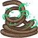ID: 228**Empowered Rope of Entanglement (Tyril)**It's easier for you if you don't fight it. It feeds on your struggles.
        
        
            **Golden Epic**
            All Champion Damage
            Tyril (Slot 3)
        
    
    
        
            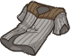ID: 231**Fine Cloth Shirt (Tyril)**A fine shirt. I almost feel bad taking it out into the wild. Almost.
        
        
            **Rare**
            Moonbeam and Wild Inspiration
            Tyril (Slot 4)
        
    
    
        
            ID: 235**Hefty Bag of Tricks (Tyril)**It's almost too heavy to carry. Perhaps that's a trick for its owner.
        
        
            **Rare**
            Ultimate Damage
            Tyril (Slot 5)
        
    
    
        
            ID: 239**Fine Ring of the Frog (Tyril)**Frogs have many fine attributes that are quite useful when adventuring.
        
        
            **Rare**
            Ultimate Cooldown Reduction
            Tyril (Slot 6)
        
    
    
        
            ID: 2**Platinum Chest**<code>"for_crusaders":[]</code>
        
        
            **Chest**
            Platinum Chest
            x10 (Shinies x1)
        
    

ID: 18

### Force Grey - Jamilah Pack - 0 Platinum ($11.99)  
Date of release: 11 Dec 2024

> Contains 10 Platinum Chests and awesome gear for Jamilah!

Contents:

    
        
            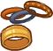ID: 243**Metal Bangles (Jamilah)**More elegant arm wear for a more successful adventurer.
        
        
            **Rare**
            Self DPS
            Jamilah (Slot 1)
        
    
    
        
            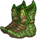ID: 247**Stealthy Boots (Jamilah)**A fine pair of boots with a padded sole.
        
        
            **Rare**
            Self DPS
            Jamilah (Slot 2)
        
    
    
        
            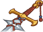ID: 252**Deathbringer Greatsword (Jamilah)**They'll never see me coming.
        
        
            **Golden Epic**
            Frontline Fighter
            Jamilah (Slot 3)
        
    
    
        
            ID: 255**Heroic Periapt (Jamilah)**A heroic amulet granted to me by a village leader after I saved some villagers.
        
        
            **Rare**
            Berserker Confidence
            Jamilah (Slot 4)
        
    
    
        
            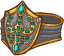ID: 259**Emerald Ring (Jamilah)**The beauty of this ring is eclipsed only by its power.
        
        
            **Rare**
            Ultimate Damage
            Jamilah (Slot 5)
        
    
    
        
            ID: 263**Patterned Scarf (Jamilah)**A fine scarf purchased from a merchant in Port Nyanzaru.
        
        
            **Rare**
            Ultimate Cooldown Reduction
            Jamilah (Slot 6)
        
    
    
        
            ID: 2**Platinum Chest**<code>"for_crusaders":[]</code>
        
        
            **Chest**
            Platinum Chest
            x10 (Shinies x1)
        
    

ID: 19

### Force Grey - Arkhan Pack - 0 Platinum ($11.99)  
Date of release: 11 Dec 2024

> Contains 10 Platinum Chests and awesome gear for Arkhan!

Contents:

    
        
            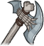ID: 267**Cruel Battle Axe (Arkhan)**The craftsmanship is exquisite.
        
        
            **Rare**
            Self DPS
            Arkhan (Slot 1)
        
    
    
        
            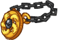ID: 272**Holy Symbol of Tiamat (Arkhan)**I've foresworn my paladin oaths and dedicated my life to serving Tiamat.
        
        
            **Golden Epic**
            Self DPS
            Arkhan (Slot 2)
        
    
    
        
            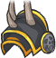ID: 275**Spiked Pauldron (Arkhan)**I'll impale the heads of my enemies on these spikes! Hah hah hah!
        
        
            **Rare**
            Gold
            Arkhan (Slot 3)
        
    
    
        
            ID: 279**Dragon-Blessed Shield (Arkhan)**Blessed by the Cult of the Dragon and carried into battle against their enemies.
        
        
            **Rare**
            All Specialisations
            Arkhan (Slot 4)
        
    
    
        
            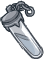ID: 283**Crystal Vial (Arkhan)**A crystal vial with a finely crafted silver stopper.
        
        
            **Rare**
            Ultimate Damage
            Arkhan (Slot 5)
        
    
    
        
            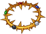ID: 287**Golden Wreath (Arkhan)**A golden wreath of thorns worn about ones neck.
        
        
            **Rare**
            Ultimate Cooldown Reduction
            Arkhan (Slot 6)
        
    
    
        
            ID: 2**Platinum Chest**<code>"for_crusaders":[]</code>
        
        
            **Chest**
            Platinum Chest
            x10 (Shinies x1)
        
    

ID: 20

### Force Grey Bundle Pack - 0 Platinum ($43.99)  
Date of release: 11 Dec 2024

> Contains 50 Platinum Chests and awesome gear for the five Force Grey Champions!

Contents:

    
        
            ID: 13**Hitch (Seat 8)**
        
        
            **Champion Unlock**
            Hitch
        
    
    
        
            ID: 99**Broadhead Crossbow Bolt (Calliope)**It nearly doesn't fit in my lute!
        
        
            **Rare**
            All Champion Damage
            Calliope (Slot 1)
        
    
    
        
            ID: 104**Ornate Lute of Ballads (Calliope)**Hey, are you even listening to me? Argh! That's it...!
        
        
            **Golden Epic**
            All Champion Damage
            Calliope (Slot 2)
        
    
    
        
            ID: 107**Triple-Clasped Cloak (Calliope)**The only way this thing comes flying off in combat is if I'm feeling especially fabulous.
        
        
            **Rare**
            Bardic Inspiration
            Calliope (Slot 3)
        
    
    
        
            ID: 111**Studded Leather Bracers (Calliope)**Some of the best wrist-based protection a girl can ask for.
        
        
            **Rare**
            Song of Protection
            Calliope (Slot 4)
        
    
    
        
            ID: 115**Magically Enhanced Satchel (Calliope)**Touch the gem in the wrong way and boom! Hope you weren't too attached to that hand.
        
        
            **Rare**
            Ultimate Damage
            Calliope (Slot 5)
        
    
    
        
            ID: 119**Sturdy Leather Eyepatch (Calliope)**A sturdy accessory that aids in my night time adventures.
        
        
            **Rare**
            Ultimate Cooldown Reduction
            Calliope (Slot 6)
        
    
    
        
            ID: 219**Twisted Wooden Staff (Tyril)**The twisting only serves to make it stronger.
        
        
            **Rare**
            Health
            Tyril (Slot 1)
        
    
    
        
            ID: 223**Fine Jade Necklace (Tyril)**A fine necklace purchased from a merchant in Triboar.
        
        
            **Rare**
            All Champion Damage
            Tyril (Slot 2)
        
    
    
        
            ID: 228**Empowered Rope of Entanglement (Tyril)**It's easier for you if you don't fight it. It feeds on your struggles.
        
        
            **Golden Epic**
            All Champion Damage
            Tyril (Slot 3)
        
    
    
        
            ID: 231**Fine Cloth Shirt (Tyril)**A fine shirt. I almost feel bad taking it out into the wild. Almost.
        
        
            **Rare**
            Moonbeam and Wild Inspiration
            Tyril (Slot 4)
        
    
    
        
            ID: 235**Hefty Bag of Tricks (Tyril)**It's almost too heavy to carry. Perhaps that's a trick for its owner.
        
        
            **Rare**
            Ultimate Damage
            Tyril (Slot 5)
        
    
    
        
            ID: 239**Fine Ring of the Frog (Tyril)**Frogs have many fine attributes that are quite useful when adventuring.
        
        
            **Rare**
            Ultimate Cooldown Reduction
            Tyril (Slot 6)
        
    
    
        
            ID: 243**Metal Bangles (Jamilah)**More elegant arm wear for a more successful adventurer.
        
        
            **Rare**
            Self DPS
            Jamilah (Slot 1)
        
    
    
        
            ID: 247**Stealthy Boots (Jamilah)**A fine pair of boots with a padded sole.
        
        
            **Rare**
            Self DPS
            Jamilah (Slot 2)
        
    
    
        
            ID: 252**Deathbringer Greatsword (Jamilah)**They'll never see me coming.
        
        
            **Golden Epic**
            Frontline Fighter
            Jamilah (Slot 3)
        
    
    
        
            ID: 255**Heroic Periapt (Jamilah)**A heroic amulet granted to me by a village leader after I saved some villagers.
        
        
            **Rare**
            Berserker Confidence
            Jamilah (Slot 4)
        
    
    
        
            ID: 259**Emerald Ring (Jamilah)**The beauty of this ring is eclipsed only by its power.
        
        
            **Rare**
            Ultimate Damage
            Jamilah (Slot 5)
        
    
    
        
            ID: 263**Patterned Scarf (Jamilah)**A fine scarf purchased from a merchant in Port Nyanzaru.
        
        
            **Rare**
            Ultimate Cooldown Reduction
            Jamilah (Slot 6)
        
    
    
        
            ID: 267**Cruel Battle Axe (Arkhan)**The craftsmanship is exquisite.
        
        
            **Rare**
            Self DPS
            Arkhan (Slot 1)
        
    
    
        
            ID: 272**Holy Symbol of Tiamat (Arkhan)**I've foresworn my paladin oaths and dedicated my life to serving Tiamat.
        
        
            **Golden Epic**
            Self DPS
            Arkhan (Slot 2)
        
    
    
        
            ID: 275**Spiked Pauldron (Arkhan)**I'll impale the heads of my enemies on these spikes! Hah hah hah!
        
        
            **Rare**
            Gold
            Arkhan (Slot 3)
        
    
    
        
            ID: 279**Dragon-Blessed Shield (Arkhan)**Blessed by the Cult of the Dragon and carried into battle against their enemies.
        
        
            **Rare**
            All Specialisations
            Arkhan (Slot 4)
        
    
    
        
            ID: 283**Crystal Vial (Arkhan)**A crystal vial with a finely crafted silver stopper.
        
        
            **Rare**
            Ultimate Damage
            Arkhan (Slot 5)
        
    
    
        
            ID: 287**Golden Wreath (Arkhan)**A golden wreath of thorns worn about ones neck.
        
        
            **Rare**
            Ultimate Cooldown Reduction
            Arkhan (Slot 6)
        
    
    
        
            ID: 291**Multi-Pouch (Hitch)**Why have one pouch when you could have five?
        
        
            **Rare**
            Ricochet
            Hitch (Slot 1)
        
    
    
        
            ID: 295**Sticky Boots (Hitch)**I can scale all but the slipperiest surfaces.
        
        
            **Rare**
            All Champion Damage
            Hitch (Slot 3)
        
    
    
        
            ID: 300**Magnificent Cape of Free Flowing (Hitch)**It never gets tangled in my legs.
        
        
            **Golden Epic**
            Natural Performer
            Hitch (Slot 4)
        
    
    
        
            ID: 303**Golden Dagger (Hitch)**Everything's better with a little gold added in.
        
        
            **Rare**
            All Champion Damage
            Hitch (Slot 2)
        
    
    
        
            ID: 307**Crystal Ring (Hitch)**That's 100% legitimate Icewind Crystal.
        
        
            **Rare**
            Ultimate Damage
            Hitch (Slot 5)
        
    
    
        
            ID: 311**Static Rod (Hitch)**It has some small magical properties that makes it quite useful.
        
        
            **Rare**
            Ultimate Cooldown Reduction
            Hitch (Slot 6)
        
    
    
        
            ID: 2**Platinum Chest**<code>"for_crusaders":[]</code>
        
        
            **Chest**
            Platinum Chest
            x50 (Shinies x5)
        
    

ID: 22

### Minsc's Starter Pack - 0 Platinum ($11.99)  
Date of release: 11 Dec 2024

> Contains 10 Platinum Chests and awesome gear for Minsc!

Contents:

    
        
            ID: 147**Sharp Greatsword (Minsc)**Minsc just got this sharpened by a smithy in Baldur's Gate. Good fellow. Cheap.
        
        
            **Rare**
            Self DPS
            Minsc (Slot 1)
        
    
    
        
            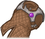ID: 151**Reinforced Leather Vest (Minsc)**It's got holes for Minsc's extremely large biceps, so Minsc is a fan!
        
        
            **Rare**
            Self DPS
            Minsc (Slot 2)
        
    
    
        
            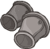ID: 155**Full Iron Bracers (Minsc)**This reminds Minsc of a time... never mind.
        
        
            **Rare**
            Overkill
            Minsc (Slot 3)
        
    
    
        
            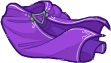ID: 160**Silken Cloak of the Beloved Ranger (Minsc)**Minsc saves some king's daughter, and this is all he gets? Barely worth it!
        
        
            **Golden Epic**
            All Specialisations
            Minsc (Slot 4)
        
    
    
        
            ID: 163**Tight Leather Belt (Minsc)**It's important to keep your pants up, lest Boo bite you in hard to reach places.
        
        
            **Rare**
            Ultimate Damage
            Minsc (Slot 5)
        
    
    
        
            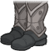ID: 167**Solid Plate Boots (Minsc)**Solid buttkicking soles! Good find, Boo!
        
        
            **Rare**
            Ultimate Cooldown Reduction
            Minsc (Slot 6)
        
    
    
        
            ID: 2**Platinum Chest**<code>"for_crusaders":[]</code>
        
        
            **Chest**
            Platinum Chest
            x10 (Shinies x1)
        
    

ID: 29

### Jarlaxle's Starter Pack - 0 Platinum ($11.99)  
Date of release: 11 Dec 2024

> Contains 10 Platinum Chests and awesome gear for Jarlaxle!

Contents:

    
        
            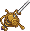ID: 75**Majestic Rapier (Jarlaxle)**There's nothing quite so elegant or majestic as a finely crafted rapier.
        
        
            **Rare**
            Self DPS
            Jarlaxle (Slot 1)
        
    
    
        
            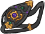ID: 80**Knave's Eye Patch (Jarlaxle)**You can't hide from my magical eye... patch.
        
        
            **Golden Epic**
            Master Attuner
            Jarlaxle (Slot 2)
        
    
    
        
            ID: 83**Velvet Feathered Hat (Jarlaxle)**It's a pleasure to wear, though not for my enemies.
        
        
            **Rare**
            Master of Disguise
            Jarlaxle (Slot 3)
        
    
    
        
            ID: 87**Lesser Piwafwi Cloak (Jarlaxle)**It has some use, but it could be so much more.
        
        
            **Rare**
            Master of Piracy
            Jarlaxle (Slot 4)
        
    
    
        
            ID: 91**Ring of Power (Jarlaxle)**But what power, you ask? I'll never tell.
        
        
            **Rare**
            Ultimate Damage
            Jarlaxle (Slot 5)
        
    
    
        
            ID: 95**Shiny Mithral Spurs (Jarlaxle)**Dirty dwarven metal, sure, but you can't deny the craftsmanship.
        
        
            **Rare**
            Ultimate Cooldown Reduction
            Jarlaxle (Slot 6)
        
    
    
        
            ID: 2**Platinum Chest**<code>"for_crusaders":[]</code>
        
        
            **Chest**
            Platinum Chest
            x10 (Shinies x1)
        
    

ID: 36

### Asharra Starter Pack - 0 Platinum ($5.99)  
Date of release: 11 Dec 2024

> Contains 10 Platinum Chests and awesome gear for Asharra!

Contents:

    
        
            ID: 124**Ornate Jade Spear of the Mind (Asharra)**The finest spear I've seen in all my years protecting the skies of Chult.
        
        
            **Golden Epic**
            Self DPS
            Asharra (Slot 1)
        
    
    
        
            ID: 127**Orb of Squalls (Asharra)**This orb causes a strong wind to swirl past you, making footing difficult.
        
        
            **Rare**
            Take Flight
            Asharra (Slot 2)
        
    
    
        
            ID: 131**Golden Robe (Asharra)**A golden robe with light colors and brilliant golden cloud motifs.
        
        
            **Rare**
            Paragon of Kir Sabal
            Asharra (Slot 3)
        
    
    
        
            ID: 135**Hardened Leather Pouch (Asharra)**A well loved pouch that I'd guess belonged to a lesser Aarakocra priest or cleric.
        
        
            **Rare**
            All Specialisations
            Asharra (Slot 4)
        
    
    
        
            ID: 139**Jeweled Aarakocra Necklace (Asharra)**This fine necklace obviously belonged to a powerful Aarakocra at some point in the past.
        
        
            **Rare**
            Ultimate Damage
            Asharra (Slot 5)
        
    
    
        
            ID: 143**Jeweled Copper Armlet (Asharra)**A shiny armlet with what looks like a small citrine or amber set in it.
        
        
            **Rare**
            Ultimate Cooldown Reduction
            Asharra (Slot 6)
        
    
    
        
            ID: 2**Platinum Chest**<code>"for_crusaders":[]</code>
        
        
            **Chest**
            Platinum Chest
            x10 (Shinies x1)
        
    

ID: 37

### Delina's Starter Pack - 0 Platinum ($11.99)  
Date of release: 11 Dec 2024

> Contains 10 Platinum Chests and awesome gear for Delina!

Contents:

    
        
            ID: 172**Ruby Focused Dagger of Danger (Delina)**In a pinch, I can channel my spells through the ruby on this dagger.
        
        
            **Golden Epic**
            Self DPS
            Delina (Slot 1)
        
    
    
        
            ID: 175**Master's Necklace (Delina)**Someone of great power wore this necklace. But they're gone, and I'm still here.
        
        
            **Rare**
            Self DPS
            Delina (Slot 2)
        
    
    
        
            ID: 179**Charged Orb (Delina)**Channeling the Weave into your focus allows you to charge your spells.
        
        
            **Rare**
            Surge of Power
            Delina (Slot 3)
        
    
    
        
            ID: 183**Fine Belt and Sheath (Delina)**A fine gift from a young human who once fancied me.
        
        
            **Rare**
            Spell Bombardment
            Delina (Slot 4)
        
    
    
        
            ID: 187**High Collared Cape (Delina)**I look like quite the mature and knowledgeable elf wearing this. Little do they know.
        
        
            **Rare**
            Empowered Spell
            Delina (Slot 5)
        
    
    
        
            ID: 191**Masterful Silken Robe (Delina)**I've been searching for the master who crafted this for years. It's wondrous!
        
        
            **Rare**
            Ultimate Cooldown Reduction
            Delina (Slot 6)
        
    
    
        
            ID: 2**Platinum Chest**<code>"for_crusaders":[]</code>
        
        
            **Chest**
            Platinum Chest
            x10 (Shinies x1)
        
    

ID: 38

### Makos Starter Pack - 0 Platinum ($11.99)  
Date of release: 11 Dec 2024

> Contains 10 Platinum Chests and awesome gear for Makos!

Contents:

    
        
            ID: 196**Golden Necklace of Fireballs (Makos)**This ought to draw their attention.
        
        
            **Golden Epic**
            Self DPS
            Makos (Slot 1)
        
    
    
        
            ID: 199**Twisted Dagger Focus (Makos)**Allows me to focus my fiendish magic.
        
        
            **Rare**
            Self DPS
            Makos (Slot 2)
        
    
    
        
            ID: 203**Dyed Leather Pouch (Makos)**Finding black leather dye is extremely difficult. Luckily, I know a Fiend or two.
        
        
            **Rare**
            All Champion Damage
            Makos (Slot 3)
        
    
    
        
            ID: 207**Magnificent Cape (Makos)**Magnificent, much like myself!
        
        
            **Rare**
            All Specialisations
            Makos (Slot 4)
        
    
    
        
            ID: 211**Gold Stitched Robe (Makos)**Finally, a robe worthy of my great power.
        
        
            **Rare**
            Ultimate Damage
            Makos (Slot 5)
        
    
    
        
            ID: 215**Fine Acolyte's Belt (Makos)**A rare gift from my patron, Arikas. It serves me well.
        
        
            **Rare**
            Ultimate Cooldown Reduction
            Makos (Slot 6)
        
    
    
        
            ID: 2**Platinum Chest**<code>"for_crusaders":[]</code>
        
        
            **Chest**
            Platinum Chest
            x10 (Shinies x1)
        
    

ID: 507

### Sharran Stoki Theme Pack - 3,830 Platinum ($0.00)  
Date of release: 11 Dec 2024

> Unlock Stoki along with an exclusive Sharran Skin & Viper Familiar!

Contents:

    
        
            ID: 14**Stoki (Seat 4)**
        
        
            **Champion Unlock**
            Stoki
        
    
    
        
            ID: 491**Sharran Stoki (Stoki)**
        
        
            **Skin**
            Sharran Stoki
        
    
    
        
            ID: 233**Sharran Viper**Oh, don't mind her unless she's looking at you.
        
        
            **Familiar**
            Sharran Viper
        
    
    
        
            ID: 2016**Feat**???: 2016
        
        
            **Feat**
            ???: 2016
        
    
    
        
            ID: 4**Platinum Stoki Chest**Loot for: Stoki<code>"for_crusaders":[14]</code>
        
        
            **Chest**
            Platinum Stoki Chest
            x32 (Shinies x2)
        
    
    
        
            ID: 1723**Potion of the Gem Hunter**Increases the gem drops from bosses by 50%<code>increase_boss_gems_percent,50</code>
        
        
            **Buff**
            Potion of the Gem Hunter
            x1
        
    

ID: 510

### Selûnite Shadowheart Skin & Feat Pack - 1,680 Platinum ($0.00)  
Date of release: 11 Dec 2024

> Unlock Shadowheart along with her exclusive Selûnite Shadowheart Skin & Feat!

Contents:

    
        
            ID: 141**Shadowheart (Seat 6)**
        
        
            **Champion Unlock**
            Shadowheart
        
    
    
        
            ID: 494**Selunite Shadowheart (Shadowheart)**
        
        
            **Skin**
            Selunite Shadowheart
        
    
    
        
            ID: 1980**Selûne's Blessing**You can't cast a shadow without some light.<code>change_hero_alignment_tag,lawful,good</code>
        
        
            **Feat**
            Selûne's Blessing
            Shadowheart (Change Alignment to Lawful Good)
        
    
    
        
            ID: 20**Large Bounty Contract**Claim a bounty worth 8 hours of offline gold earnings and event tokens.<code>seconds_worth_of_gold,28800</code>
        
        
            **Buff**
            Large Bounty Contract
            x6
        
    
    
        
            ID: 34**Large Blacksmithing Contract**Contract a master blacksmith to improve a piece of equipment owned by one of your Champions.<code>level_up_loot,24</code>
        
        
            **Buff**
            Large Blacksmithing Contract
            x6
        
    
    
        
            ID: 553**Platinum  Shadowheart Chest**Loot for: Shadowheart<code>"for_crusaders":[141]</code>
        
        
            **Chest**
            Platinum  Shadowheart Chest
            x14 (Shinies x1)
        
    

ID: 513

### Avatar of Shar Familiar Pack - 1,680 Platinum ($0.00)  
Date of release: 11 Dec 2024

> Collect your own Avatar of Shar Familiar!

Contents:

    
        
            ID: 235**Sharran Weasel**If you lose it, it will return!
        
        
            **Familiar**
            Sharran Weasel
        
    
    
        
            ID: 77**Huge Potion of Speed**This potion's yellow fluid is streaked with black and swirls on its own.<code>time_scale,2.75</code>
        
        
            **Buff**
            Huge Potion of Speed
            x2
        
    
    
        
            ID: 1712**Potion of the Hunter**Increase Global Damage by 100%<code>global_dps_multiplier_mult,100</code>
        
        
            **Buff**
            Potion of the Hunter
            x1
        
    
    
        
            ID: 1798**Epic Golden Potion**Gold and purple liquid swirl around each other as if dancing.<code>golden_loot,1</code>
        
        
            **Buff**
            Epic Golden Potion
            x1
        
    

ID: 530

### DPS Starter Pack - 0 Platinum ($11.99)  
Date of release: 11 Dec 2024

> Power up Jarlaxle to push your formations further and faster!

ⓘ *Note: This pack might not be available for purchase since it's potentially a platform giveaway.*

Contents:

    
        
            ID: 74**Well Balanced Rapier (Jarlaxle)**You can't be very effective with an unbalanced sword, you know!
        
        
            **Uncommon**
            Self DPS
            Jarlaxle (Slot 1)
        
    
    
        
            ID: 80**Knave's Eye Patch (Jarlaxle)**You can't hide from my magical eye... patch.
        
        
            **Golden Epic**
            Master Attuner
            Jarlaxle (Slot 2)
        
    
    
        
            ID: 82**Gull Feathered Hat (Jarlaxle)**A decent enough feather, I suppose. In a pinch.
        
        
            **Uncommon**
            Master of Disguise
            Jarlaxle (Slot 3)
        
    
    
        
            ID: 86**Brightly Colored Cloak (Jarlaxle)**A useful distraction if you want your foes to see your cloak and not yourself.
        
        
            **Uncommon**
            Master of Piracy
            Jarlaxle (Slot 4)
        
    
    
        
            ID: 90**Scuffed Steel Ring (Jarlaxle)**Rub it three times and a genie pops out. Aha! Gotcha! So gullible.
        
        
            **Uncommon**
            Ultimate Damage
            Jarlaxle (Slot 5)
        
    
    
        
            ID: 94**Dull Steel Spurs (Jarlaxle)**Remind me sometime to tell you the story of how I came into possession of these.
        
        
            **Uncommon**
            Ultimate Cooldown Reduction
            Jarlaxle (Slot 6)
        
    
    
        
            **Platinum**
        
        
            **Platinum**
            x1,760
        
    
    
        
            ID: 35**Potion of Specialization**The dense, purple liquid has an ovoid cloud of pink floating in it.<code>reset_specializations,1</code>
        
        
            **Buff**
            Potion of Specialization
            x5
        
    
    
        
            ID: 77**Huge Potion of Speed**This potion's yellow fluid is streaked with black and swirls on its own.<code>time_scale,2.75</code>
        
        
            **Buff**
            Huge Potion of Speed
            x5
        
    
    
        
            ID: 464**Platinum Jarlaxle Chest**Loot for: Jarlaxle<code>"for_crusaders":[4]</code>
        
        
            **Chest**
            Platinum Jarlaxle Chest
            x6 (Shinies x1)
        
    

ID: 531

### Tanking & Healing Starter Pack - 0 Platinum ($24.99)  
Date of release: 11 Dec 2024

> Unlock the full power of tanking & healing with boosts to Celeste, Nayeli, and Calliope as well as an exclusive familiar to help you!

ⓘ *Note: This pack might not be available for purchase since it's potentially a platform giveaway.*

Contents:

    
        
            ID: 7**Champion Nayeli (Nayeli)**
        
        
            **Skin**
            Champion Nayeli
        
    
    
        
            ID: 19**Champion Calliope (Calliope)**
        
        
            **Skin**
            Champion Calliope
        
    
    
        
            ID: 28**Healer of Toril Celeste (Celeste)**
        
        
            **Skin**
            Healer of Toril Celeste
        
    
    
        
            ID: 13**Iris**Looks very familiar.
        
        
            **Familiar**
            Iris
        
    
    
        
            ID: 28**Ornate Headband of Faith (Celeste)**A golden headband inlaid with a brilliant blue sapphire.
        
        
            **Golden Epic**
            All Champion Damage
            Celeste (Slot 1)
        
    
    
        
            ID: 30**Leather Gauntlets (Celeste)**The inside is padded to protect against bumps and bruises.
        
        
            **Uncommon**
            All Champion Damage
            Celeste (Slot 2)
        
    
    
        
            ID: 34**Soft Belt (Celeste)**Given to me by a sister cleric on my first day of worship at the temple.
        
        
            **Uncommon**
            Crusader's Mantle
            Celeste (Slot 3)
        
    
    
        
            ID: 38**Steel Amulet (Celeste)**A more durable form of a commonly carried amulet.
        
        
            **Uncommon**
            Mass Cure Wounds
            Celeste (Slot 4)
        
    
    
        
            ID: 42**Smooth Leather Boots (Celeste)**Durable and soft, these boots can last a lifetime if properly cared for.
        
        
            **Uncommon**
            Ultimate Damage
            Celeste (Slot 5)
        
    
    
        
            ID: 46**Understated Holy Symbol (Celeste)**Never underestimate the wrath of an angry goddess.
        
        
            **Uncommon**
            Ultimate Cooldown Reduction
            Celeste (Slot 6)
        
    
    
        
            ID: 52**Figurine Of Wondrous Power (Nayeli)**A wondrous item that grants me the power to track down those I've sworn vengeance against.
        
        
            **Golden Epic**
            All Champion Damage
            Nayeli (Slot 1)
        
    
    
        
            ID: 54**Iron Breastplate (Nayeli)**A sturdy breastplate. Well enough to deliver evenhanded justice in, at least.
        
        
            **Uncommon**
            Health
            Nayeli (Slot 2)
        
    
    
        
            ID: 58**Fine Chainmail Shirt (Nayeli)**As fine a shirt as you could expect to find, from a common merchant.
        
        
            **Uncommon**
            Aura of Courage
            Nayeli (Slot 3)
        
    
    
        
            ID: 62**Sturdy Gauntlets (Nayeli)**They won't budge in battle, and with a sturdy wrist will deflect all but the strongest attack.
        
        
            **Uncommon**
            Aura of Protection
            Nayeli (Slot 4)
        
    
    
        
            ID: 66**Polished Holy Symbol (Nayeli)**This symbol has been meticulously cared for over the years. A great sign of respect.
        
        
            **Uncommon**
            Ultimate Damage
            Nayeli (Slot 5)
        
    
    
        
            ID: 70**Sharp Steel Greatsword (Nayeli)**Crafted by the finest smithy in Daggerford.
        
        
            **Uncommon**
            Ultimate Cooldown Reduction
            Nayeli (Slot 6)
        
    
    
        
            ID: 102**Partially Tuned Lute (Calliope)**I've heard better, but it's a good focus for my songs and spells.
        
        
            **Uncommon**
            All Champion Damage
            Calliope (Slot 2)
        
    
    
        
            ID: 104**Ornate Lute of Ballads (Calliope)**Hey, are you even listening to me? Argh! That's it...!
        
        
            **Golden Epic**
            All Champion Damage
            Calliope (Slot 2)
        
    
    
        
            ID: 106**Bard's Cloak (Calliope)**Your average bard's cloak. Good for blending into crowds... of bards.
        
        
            **Uncommon**
            Bardic Inspiration
            Calliope (Slot 3)
        
    
    
        
            ID: 110**Stiff Hide Bracers (Calliope)**You could deflect a dull sword with these, if you're quick enough, which I am.
        
        
            **Uncommon**
            Song of Protection
            Calliope (Slot 4)
        
    
    
        
            ID: 114**Sturdy Leather Bag (Calliope)**It's holding knick-knacks from dozens of passed out pirates. They won't miss 'em.
        
        
            **Uncommon**
            Ultimate Damage
            Calliope (Slot 5)
        
    
    
        
            ID: 118**Soft Cloth Eyepatch (Calliope)**A pleasure to wear - it's like a blanket for my eye!
        
        
            **Uncommon**
            Ultimate Cooldown Reduction
            Calliope (Slot 6)
        
    
    
        
            **Platinum**
        
        
            **Platinum**
            x3,833
        
    
    
        
            ID: 35**Potion of Specialization**The dense, purple liquid has an ovoid cloud of pink floating in it.<code>reset_specializations,1</code>
        
        
            **Buff**
            Potion of Specialization
            x10
        
    
    
        
            ID: 77**Huge Potion of Speed**This potion's yellow fluid is streaked with black and swirls on its own.<code>time_scale,2.75</code>
        
        
            **Buff**
            Huge Potion of Speed
            x10
        
    
    
        
            ID: 462**Platinum Celeste Chest**Loot for: Celeste<code>"for_crusaders":[2]</code>
        
        
            **Chest**
            Platinum Celeste Chest
            x6 (Shinies x1)
        
    
    
        
            ID: 463**Platinum Nayeli Chest**Loot for: Nayeli<code>"for_crusaders":[3]</code>
        
        
            **Chest**
            Platinum Nayeli Chest
            x6 (Shinies x1)
        
    
    
        
            ID: 465**Platinum Calliope Chest**Loot for: Calliope<code>"for_crusaders":[5]</code>
        
        
            **Chest**
            Platinum Calliope Chest
            x6 (Shinies x1)
        
    

ID: 532

### Choose Your Champion Starter Pack - 0 Platinum ($11.99)  
Date of release: 11 Dec 2024

> Unlock a Champion of your choice with full Uncommon gear, 6 Platinum Chests, and an assortment of potions to speed your play!

ⓘ *Note: This pack might not be available for purchase since it's potentially a platform giveaway.*

Contents:

    
        
            **Platinum**
        
        
            **Platinum**
            x840
        
    
    
        
            ID: 35**Potion of Specialization**The dense, purple liquid has an ovoid cloud of pink floating in it.<code>reset_specializations,1</code>
        
        
            **Buff**
            Potion of Specialization
            x5
        
    
    
        
            ID: 77**Huge Potion of Speed**This potion's yellow fluid is streaked with black and swirls on its own.<code>time_scale,2.75</code>
        
        
            **Buff**
            Huge Potion of Speed
            x5
        
    
    
        
            ID: 2143**Scroll of Champion Summoning**Using this scroll allows you to choose any Event Champion. You will collect the Champion, full uncommon gear, 6 Platinum Chests, and a Golden Epic for that Champion if you haven't already collected it!
        
        
            **Buff**
            Scroll of Champion Summoning
            x1
        
    

ID: 533

### 3x Choose Your Champion Starter Pack - 0 Platinum ($24.99)  
Date of release: 11 Dec 2024

> Unlock THREE Champions of your choice with gear & Platinum Chests for them and an exclusive familiar to help you!

ⓘ *Note: This pack might not be available for purchase since it's potentially a platform giveaway.*

Contents:

    
        
            **Platinum**
        
        
            **Platinum**
            x1,760
        
    
    
        
            ID: 35**Potion of Specialization**The dense, purple liquid has an ovoid cloud of pink floating in it.<code>reset_specializations,1</code>
        
        
            **Buff**
            Potion of Specialization
            x10
        
    
    
        
            ID: 77**Huge Potion of Speed**This potion's yellow fluid is streaked with black and swirls on its own.<code>time_scale,2.75</code>
        
        
            **Buff**
            Huge Potion of Speed
            x10
        
    
    
        
            ID: 2143**Scroll of Champion Summoning**Using this scroll allows you to choose any Event Champion. You will collect the Champion, full uncommon gear, 6 Platinum Chests, and a Golden Epic for that Champion if you haven't already collected it!
        
        
            **Buff**
            Scroll of Champion Summoning
            x3
        
    

ID: 517

### Grymforge Karlach Party Pack - 0 Platinum ($19.99)  
Date of release: 12 Dec 2024

> 

ⓘ *Note: This pack might not be available for purchase since it's potentially a platform giveaway.*

Contents:

    
        
            ID: 143**Karlach (Seat 4)**
        
        
            **Champion Unlock**
            Karlach
        
    
    
        
            ID: 147**Gale (Seat 1)**
        
        
            **Champion Unlock**
            Gale
        
    
    
        
            ID: 156**Halsin (Seat 3 (Guess))**
        
        
            **Champion Unlock**
            Halsin
        
    
    
        
            ID: 501**Grymforge Karlach (Karlach)**
        
        
            **Skin**
            Grymforge Karlach
        
    
    
        
            ID: 2005**Heart Ablaze**I don't think I've ever felt more powerful.<code>todo DevNote: Increase BUD damage caused by Infernal Engine</code>
        
        
            **Feat**
            Heart Ablaze
            Karlach (todo)
        
    
    
        
            ID: 557**Platinum  Karlach Chest**Loot for: Karlach<code>"for_crusaders":[143]</code>
        
        
            **Chest**
            Platinum  Karlach Chest
            x14 (Shinies x1)
        
    
    
        
            ID: 565**Platinum Gale Chest**Loot for: Gale<code>"for_crusaders":[147]</code>
        
        
            **Chest**
            Platinum Gale Chest
            x14 (Shinies x1)
        
    
    
        
            ID: 645**Platinum Halsin Chest**Loot for: Halsin<code>"for_crusaders":[156]</code>
        
        
            **Chest**
            Platinum Halsin Chest
            x14 (Shinies x1)
        
    

ID: 511

### Moonlight Regis Skin & Feat Pack - 1,680 Platinum ($0.00)  
Date of release: 18 Dec 2024

> Unlock Regis along with his exclusive Moonlight Regis Skin & Feat!

Contents:

    
        
            ID: 20**Regis (Seat 2)**
        
        
            **Champion Unlock**
            Regis
        
    
    
        
            ID: 495**Moonlight Regis (Regis)**
        
        
            **Skin**
            Moonlight Regis
        
    
    
        
            ID: 1349**Prodigal Leader**Win or lose -- we still made a difference!<code>global_dps_multiplier_mult,50</code>
        
        
            **Feat**
            Prodigal Leader
            Regis (50% All Champion Damage)
        
    
    
        
            ID: 20**Large Bounty Contract**Claim a bounty worth 8 hours of offline gold earnings and event tokens.<code>seconds_worth_of_gold,28800</code>
        
        
            **Buff**
            Large Bounty Contract
            x6
        
    
    
        
            ID: 34**Large Blacksmithing Contract**Contract a master blacksmith to improve a piece of equipment owned by one of your Champions.<code>level_up_loot,24</code>
        
        
            **Buff**
            Large Blacksmithing Contract
            x6
        
    
    
        
            ID: 17**Platinum Regis Chest**Loot for: Regis<code>"for_crusaders":[20]</code>
        
        
            **Chest**
            Platinum Regis Chest
            x14 (Shinies x1)
        
    

ID: 512

### Selûnite Warden Skin & Feat Pack - 1,680 Platinum ($0.00)  
Date of release: 18 Dec 2024

> Unlock Warden along with his exclusive Selûnite Warden Skin & Feat!

Contents:

    
        
            ID: 36**Warden (Seat 11)**
        
        
            **Champion Unlock**
            Warden
        
    
    
        
            ID: 496**Selûnite Warden (Warden)**
        
        
            **Skin**
            Selûnite Warden
        
    
    
        
            ID: 1983**Prodigal Leader**Follow me, or suffer my wrath.<code>global_dps_multiplier_mult,50</code>
        
        
            **Feat**
            Prodigal Leader
            Warden (50% All Champion Damage)
        
    
    
        
            ID: 20**Large Bounty Contract**Claim a bounty worth 8 hours of offline gold earnings and event tokens.<code>seconds_worth_of_gold,28800</code>
        
        
            **Buff**
            Large Bounty Contract
            x6
        
    
    
        
            ID: 34**Large Blacksmithing Contract**Contract a master blacksmith to improve a piece of equipment owned by one of your Champions.<code>level_up_loot,24</code>
        
        
            **Buff**
            Large Blacksmithing Contract
            x6
        
    
    
        
            ID: 82**Platinum Warden Chest**Loot for: Warden<code>"for_crusaders":[36]</code>
        
        
            **Chest**
            Platinum Warden Chest
            x14 (Shinies x1)
        
    

ID: 514

### Sharran Celeste Skin & Feat Pack - 1,680 Platinum ($0.00)  
Date of release: 26 Dec 2024

> Snag Celeste's exclusive Sharran Celeste Skin & Feat!

Contents:

    
        
            ID: 497**Sharran Celeste (Celeste)**
        
        
            **Skin**
            Sharran Celeste
        
    
    
        
            ID: 1984**Dark Revelation**Selûne's power is nothing - Shar's perfection eclipses it<code>change_hero_alignment_tag,lawful,evil</code>
        
        
            **Feat**
            Dark Revelation
            Celeste (Change Alignment to Lawful Evil)
        
    
    
        
            ID: 20**Large Bounty Contract**Claim a bounty worth 8 hours of offline gold earnings and event tokens.<code>seconds_worth_of_gold,28800</code>
        
        
            **Buff**
            Large Bounty Contract
            x6
        
    
    
        
            ID: 34**Large Blacksmithing Contract**Contract a master blacksmith to improve a piece of equipment owned by one of your Champions.<code>level_up_loot,24</code>
        
        
            **Buff**
            Large Blacksmithing Contract
            x6
        
    
    
        
            ID: 462**Platinum Celeste Chest**Loot for: Celeste<code>"for_crusaders":[2]</code>
        
        
            **Chest**
            Platinum Celeste Chest
            x14 (Shinies x1)
        
    

ID: 515

### Crescent the Lunar Moth Familiar Pack - 840 Platinum ($0.00)  
Date of release: 26 Dec 2024

> Collect your own Crescent the Lunar Moth Familiar!

Contents:

    
        
            ID: 236**Crescent the Lunar Moth**It glows in moonlight!
        
        
            **Familiar**
            Crescent the Lunar Moth
        
    
    
        
            ID: 4**Huge Potion of Giant's Strength**A transparent potion in which floats the sliver of a giant's fingernail.<code>global_dps_multiplier_mult,900</code>
        
        
            **Buff**
            Huge Potion of Giant's Strength
            x2
        
    
    
        
            ID: 8**Huge Potion of Clairvoyance**Three eyeballs bob in this yellowish potion.<code>gold_multiplier_mult,400</code>
        
        
            **Buff**
            Huge Potion of Clairvoyance
            x2
        
    
    
        
            ID: 77**Huge Potion of Speed**This potion's yellow fluid is streaked with black and swirls on its own.<code>time_scale,2.75</code>
        
        
            **Buff**
            Huge Potion of Speed
            x2
        
    

ID: 516

### Yule Log Nordom Skin & Feat Pack - 1,680 Platinum ($0.00)  
Date of release: 26 Dec 2024

> Unlock Nordom along with his exclusive Yule Log Nordom Skin & Feat!

Contents:

    
        
            ID: 100**Nordom (Seat 9)**
        
        
            **Champion Unlock**
            Nordom
        
    
    
        
            ID: 498**Yule Log Nordom (Nordom)**
        
        
            **Skin**
            Yule Log Nordom
        
    
    
        
            ID: 1985**Prodigal Leader**Command: Increase combat output by fifty percent.<code>global_dps_multiplier_mult,50</code>
        
        
            **Feat**
            Prodigal Leader
            Nordom (50% All Champion Damage)
        
    
    
        
            ID: 20**Large Bounty Contract**Claim a bounty worth 8 hours of offline gold earnings and event tokens.<code>seconds_worth_of_gold,28800</code>
        
        
            **Buff**
            Large Bounty Contract
            x6
        
    
    
        
            ID: 34**Large Blacksmithing Contract**Contract a master blacksmith to improve a piece of equipment owned by one of your Champions.<code>level_up_loot,24</code>
        
        
            **Buff**
            Large Blacksmithing Contract
            x6
        
    
    
        
            ID: 357**Platinum Nordom Chest**Loot for: Nordom<code>"for_crusaders":[100]</code>
        
        
            **Chest**
            Platinum Nordom Chest
            x14 (Shinies x1)
        
    

ID: 518

### Stone Golem Eric Theme Pack - 3,830 Platinum ($0.00)  
Date of release: 01 Jan 2025

> Unlock Eric along with an exclusive Stone Golem Skin & Familiar!

Contents:

    
        
            ID: 157**Eric**
        
        
            **Champion Unlock**
            Eric
        
    
    
        
            ID: 505**Stone Golem Eric (Eric)**
        
        
            **Skin**
            Stone Golem Eric
        
    
    
        
            ID: 238**Skystrike the Baby Griffon**Oh brother, he thinks I'm his mother! I guess I'll have to teach him that Uni isn't food.
        
        
            **Familiar**
            Skystrike the Baby Griffon
        
    
    
        
            ID: 2040**Feat**???: 2040
        
        
            **Feat**
            ???: 2040
        
    
    
        
            ID: 647**Platinum Eric Chest**Loot for: Eric<code>"for_crusaders":[157]</code>
        
        
            **Chest**
            Platinum Eric Chest
            x32 (Shinies x2)
        
    
    
        
            ID: 1723**Potion of the Gem Hunter**Increases the gem drops from bosses by 50%<code>increase_boss_gems_percent,50</code>
        
        
            **Buff**
            Potion of the Gem Hunter
            x1
        
    

ID: 519

### Glasswork Golem Artemis Skin & Feat Pack - 1,680 Platinum ($0.00)  
Date of release: 01 Jan 2025

> Unlock Artemis along with his exclusive Glasswork Golem Skin & Feat!

Contents:

    
        
            ID: 54**Artemis (Seat 3)**
        
        
            **Champion Unlock**
            Artemis
        
    
    
        
            ID: 506**Glasswork Golem Artemis (Artemis)**
        
        
            **Skin**
            Glasswork Golem Artemis
        
    
    
        
            ID: 2008**Multiversal Allies**Death is part of every culture, every people. I've studied them all.<code>_effect_def,2193</code>
        
        
            **Feat**
            Multiversal Allies
            Artemis (do_nothing)
        
    
    
        
            ID: 20**Large Bounty Contract**Claim a bounty worth 8 hours of offline gold earnings and event tokens.<code>seconds_worth_of_gold,28800</code>
        
        
            **Buff**
            Large Bounty Contract
            x6
        
    
    
        
            ID: 34**Large Blacksmithing Contract**Contract a master blacksmith to improve a piece of equipment owned by one of your Champions.<code>level_up_loot,24</code>
        
        
            **Buff**
            Large Blacksmithing Contract
            x6
        
    
    
        
            ID: 167**Platinum Artemis Chest**Loot for: Artemis<code>"for_crusaders":[54]</code>
        
        
            **Chest**
            Platinum Artemis Chest
            x14 (Shinies x1)
        
    

ID: 520

### Crystal Titan Mehen Theme Pack - 3,830 Platinum ($0.00)  
Date of release: 08 Jan 2025

> Unlock Mehen along with an exclusive Crystal Titan Skin & Familiar!

Contents:

    
        
            ID: 80**Mehen (Seat 3)**
        
        
            **Champion Unlock**
            Mehen
        
    
    
        
            ID: 507**Crystal Titan Mehen (Mehen)**
        
        
            **Skin**
            Crystal Titan Mehen
        
    
    
        
            ID: 242**Mercy the Vein Golem**I'm a big titan now!
        
        
            **Familiar**
            Mercy the Vein Golem
        
    
    
        
            ID: 2043**Fierce Fighter**I've seen a thousand battles, and I'll see a thousand more.<code>buff_upgrades,80,16150,16151,16152</code>
        
        
            **Feat**
            Fierce Fighter
            Mehen (80% All  Specialisations)
        
    
    
        
            ID: 267**Platinum Mehen Chest**Loot for: Mehen<code>"for_crusaders":[80]</code>
        
        
            **Chest**
            Platinum Mehen Chest
            x32 (Shinies x2)
        
    
    
        
            ID: 1723**Potion of the Gem Hunter**Increases the gem drops from bosses by 50%<code>increase_boss_gems_percent,50</code>
        
        
            **Buff**
            Potion of the Gem Hunter
            x1
        
    

ID: 521

### Magen Baeloth Skin & Feat Pack - 1,680 Platinum ($0.00)  
Date of release: 08 Jan 2025

> Unlock Baeloth along with his exclusive Magen Baeloth Skin & Feat!

Contents:

    
        
            ID: 73**Baeloth (Seat 4)**
        
        
            **Champion Unlock**
            Baeloth
        
    
    
        
            ID: 508**Magen Baeloth (Baeloth)**
        
        
            **Skin**
            Magen Baeloth
        
    
    
        
            ID: 2045**Electrodeposition**Did you know gold is highly conductive? Would you like a demonstration?<code>buff_upgrade,80,4745</code>
        
        
            **Feat**
            Electrodeposition
            Baeloth (80% Paid Partially with Pain)
        
    
    
        
            ID: 20**Large Bounty Contract**Claim a bounty worth 8 hours of offline gold earnings and event tokens.<code>seconds_worth_of_gold,28800</code>
        
        
            **Buff**
            Large Bounty Contract
            x6
        
    
    
        
            ID: 34**Large Blacksmithing Contract**Contract a master blacksmith to improve a piece of equipment owned by one of your Champions.<code>level_up_loot,24</code>
        
        
            **Buff**
            Large Blacksmithing Contract
            x6
        
    
    
        
            ID: 253**Platinum Baeloth Chest**Loot for: Baeloth<code>"for_crusaders":[73]</code>
        
        
            **Chest**
            Platinum Baeloth Chest
            x14 (Shinies x1)
        
    

ID: 522

### Ganderloo the Clockwork Goose Familiar Pack - 2,380 Platinum ($0.00)  
Date of release: 08 Jan 2025

> Collect your own Ganderloo the Clockwork Goose Familiar!

Contents:

    
        
            ID: 239**Ganderloo the Clockwork Goose**It can't be bargained with. It can't be reasoned with.
        
        
            **Familiar**
            Ganderloo the Clockwork Goose
        
    
    
        
            ID: 4**Huge Potion of Giant's Strength**A transparent potion in which floats the sliver of a giant's fingernail.<code>global_dps_multiplier_mult,900</code>
        
        
            **Buff**
            Huge Potion of Giant's Strength
            x6
        
    
    
        
            ID: 8**Huge Potion of Clairvoyance**Three eyeballs bob in this yellowish potion.<code>gold_multiplier_mult,400</code>
        
        
            **Buff**
            Huge Potion of Clairvoyance
            x6
        
    
    
        
            ID: 36**Potion of Polish**This shiny, silver liquid clings to the edge of the bottle in an unusual way.<code>shiny_loot,1</code>
        
        
            **Buff**
            Potion of Polish
            x1
        
    
    
        
            ID: 40**Huge Potion of Fire Breath**The orange liquid in this vial flickers and smoke fills the top of the container.<code>click_damage_seconds_global_dps,600</code>
        
        
            **Buff**
            Huge Potion of Fire Breath
            x6
        
    
    
        
            ID: 77**Huge Potion of Speed**This potion's yellow fluid is streaked with black and swirls on its own.<code>time_scale,2.75</code>
        
        
            **Buff**
            Huge Potion of Speed
            x6
        
    
    
        
            ID: 1721**Potion of the Gold Hunter**Increase Gold Find by 100%<code>gold_multiplier_mult,100</code>
        
        
            **Buff**
            Potion of the Gold Hunter
            x1
        
    
    
        
            **Modron Component Pieces**
        
        
            **Modron Component Pieces**
            x2,000
        
    

ID: 523

### Iron Golem Barrowin Skin & Feat Pack - 1,680 Platinum ($0.00)  
Date of release: 15 Jan 2025

> Unlock Barrowin along with her exclusive Iron Golem Skin & Feat!

Contents:

    
        
            ID: 19**Barrowin (Seat 10)**
        
        
            **Champion Unlock**
            Barrowin
        
    
    
        
            ID: 509**Iron Golem Barrowin (Barrowin)**
        
        
            **Skin**
            Iron Golem Barrowin
        
    
    
        
            ID: 2046**Prodigal Leader**Rally under the banner of Clan Undurr!<code>global_dps_multiplier_mult,50</code>
        
        
            **Feat**
            Prodigal Leader
            Barrowin (50% All Champion Damage)
        
    
    
        
            ID: 20**Large Bounty Contract**Claim a bounty worth 8 hours of offline gold earnings and event tokens.<code>seconds_worth_of_gold,28800</code>
        
        
            **Buff**
            Large Bounty Contract
            x6
        
    
    
        
            ID: 34**Large Blacksmithing Contract**Contract a master blacksmith to improve a piece of equipment owned by one of your Champions.<code>level_up_loot,24</code>
        
        
            **Buff**
            Large Blacksmithing Contract
            x6
        
    
    
        
            ID: 12**Platinum Barrowin Chest**Loot for: Barrowin<code>"for_crusaders":[19]</code>
        
        
            **Chest**
            Platinum Barrowin Chest
            x14 (Shinies x1)
        
    

ID: 524

### Magen Imoen Skin & Feat Pack - 1,680 Platinum ($0.00)  
Date of release: 15 Jan 2025

> Unlock Imoen along with her exclusive Magen Skin & Feat!

Contents:

    
        
            ID: 117**Imoen (Seat 11)**
        
        
            **Champion Unlock**
            Imoen
        
    
    
        
            ID: 510**Magen Imoen (Imoen)**
        
        
            **Skin**
            Magen Imoen
        
    
    
        
            ID: 2047**Prodigal Leader**I'll never give up the fight!<code>global_dps_multiplier_mult,50</code>
        
        
            **Feat**
            Prodigal Leader
            Imoen (50% All Champion Damage)
        
    
    
        
            ID: 20**Large Bounty Contract**Claim a bounty worth 8 hours of offline gold earnings and event tokens.<code>seconds_worth_of_gold,28800</code>
        
        
            **Buff**
            Large Bounty Contract
            x6
        
    
    
        
            ID: 34**Large Blacksmithing Contract**Contract a master blacksmith to improve a piece of equipment owned by one of your Champions.<code>level_up_loot,24</code>
        
        
            **Buff**
            Large Blacksmithing Contract
            x6
        
    
    
        
            ID: 436**Platinum Imoen Chest**Loot for: Imoen<code>"for_crusaders":[117]</code>
        
        
            **Chest**
            Platinum Imoen Chest
            x14 (Shinies x1)
        
    

ID: 525

### Stone Golem Diana Skin & Feat Pack - 1,680 Platinum ($0.00)  
Date of release: 22 Jan 2025

> Unlock Diana along with her exclusive Stone Golem Skin & Feat!

Contents:

    
        
            ID: 148**Diana (Seat 9)**
        
        
            **Champion Unlock**
            Diana
        
    
    
        
            ID: 511**Stone Golem Diana (Diana)**
        
        
            **Skin**
            Stone Golem Diana
        
    
    
        
            ID: 2048**Unwavering Inspiration**I believe in myself! I believe in all of us!<code>buff_upgrades,80,14791,14792,14793</code>
        
        
            **Feat**
            Unwavering Inspiration
            Diana (80% All First Specialisations)
        
    
    
        
            ID: 20**Large Bounty Contract**Claim a bounty worth 8 hours of offline gold earnings and event tokens.<code>seconds_worth_of_gold,28800</code>
        
        
            **Buff**
            Large Bounty Contract
            x6
        
    
    
        
            ID: 34**Large Blacksmithing Contract**Contract a master blacksmith to improve a piece of equipment owned by one of your Champions.<code>level_up_loot,24</code>
        
        
            **Buff**
            Large Blacksmithing Contract
            x6
        
    
    
        
            ID: 567**Platinum Diana Chest**Loot for: Diana<code>"for_crusaders":[148]</code>
        
        
            **Chest**
            Platinum Diana Chest
            x14 (Shinies x1)
        
    

ID: 526

### Autognome Stoki Skin & Feat Pack - 1,680 Platinum ($0.00)  
Date of release: 22 Jan 2025

> Unlock Stoki along with her exclusive Autognome Skin & Feat!

Contents:

    
        
            ID: 14**Stoki (Seat 4)**
        
        
            **Champion Unlock**
            Stoki
        
    
    
        
            ID: 512**Autognome Stoki (Stoki)**
        
        
            **Skin**
            Autognome Stoki
        
    
    
        
            ID: 1240**Feat**???: 1240
        
        
            **Feat**
            ???: 1240
        
    
    
        
            ID: 20**Large Bounty Contract**Claim a bounty worth 8 hours of offline gold earnings and event tokens.<code>seconds_worth_of_gold,28800</code>
        
        
            **Buff**
            Large Bounty Contract
            x6
        
    
    
        
            ID: 34**Large Blacksmithing Contract**Contract a master blacksmith to improve a piece of equipment owned by one of your Champions.<code>level_up_loot,24</code>
        
        
            **Buff**
            Large Blacksmithing Contract
            x6
        
    
    
        
            ID: 4**Platinum Stoki Chest**Loot for: Stoki<code>"for_crusaders":[14]</code>
        
        
            **Chest**
            Platinum Stoki Chest
            x14 (Shinies x1)
        
    

ID: 527

### Hexton Modron Familiar Pack - 2,380 Platinum ($0.00)  
Date of release: 22 Jan 2025

> Collect your own Hexton Modron Familiar!

Contents:

    
        
            ID: 240**Hexton Modron**The march MUST continue!
        
        
            **Familiar**
            Hexton Modron
        
    
    
        
            ID: 4**Huge Potion of Giant's Strength**A transparent potion in which floats the sliver of a giant's fingernail.<code>global_dps_multiplier_mult,900</code>
        
        
            **Buff**
            Huge Potion of Giant's Strength
            x6
        
    
    
        
            ID: 8**Huge Potion of Clairvoyance**Three eyeballs bob in this yellowish potion.<code>gold_multiplier_mult,400</code>
        
        
            **Buff**
            Huge Potion of Clairvoyance
            x6
        
    
    
        
            ID: 36**Potion of Polish**This shiny, silver liquid clings to the edge of the bottle in an unusual way.<code>shiny_loot,1</code>
        
        
            **Buff**
            Potion of Polish
            x1
        
    
    
        
            ID: 40**Huge Potion of Fire Breath**The orange liquid in this vial flickers and smoke fills the top of the container.<code>click_damage_seconds_global_dps,600</code>
        
        
            **Buff**
            Huge Potion of Fire Breath
            x6
        
    
    
        
            ID: 77**Huge Potion of Speed**This potion's yellow fluid is streaked with black and swirls on its own.<code>time_scale,2.75</code>
        
        
            **Buff**
            Huge Potion of Speed
            x6
        
    
    
        
            ID: 1721**Potion of the Gold Hunter**Increase Gold Find by 100%<code>gold_multiplier_mult,100</code>
        
        
            **Buff**
            Potion of the Gold Hunter
            x1
        
    
    
        
            **Modron Component Pieces**
        
        
            **Modron Component Pieces**
            x2,000
        
    

ID: 528

### Android Kent Skin & Feat Pack - 1,680 Platinum ($0.00)  
Date of release: 29 Jan 2025

> Unlock Kent along with his exclusive Android Skin & Feat!

Contents:

    
        
            ID: 114**Kent (Seat 4)**
        
        
            **Champion Unlock**
            Kent
        
    
    
        
            ID: 513**Android Kent (Kent)**
        
        
            **Skin**
            Android Kent
        
    
    
        
            ID: 2050**Multiversal Allies**We are stronger together.<code>_effect_def,2193</code>
        
        
            **Feat**
            Multiversal Allies
            Kent (do_nothing)
        
    
    
        
            ID: 20**Large Bounty Contract**Claim a bounty worth 8 hours of offline gold earnings and event tokens.<code>seconds_worth_of_gold,28800</code>
        
        
            **Buff**
            Large Bounty Contract
            x6
        
    
    
        
            ID: 34**Large Blacksmithing Contract**Contract a master blacksmith to improve a piece of equipment owned by one of your Champions.<code>level_up_loot,24</code>
        
        
            **Buff**
            Large Blacksmithing Contract
            x6
        
    
    
        
            ID: 430**Platinum Kent Chest**Loot for: Kent<code>"for_crusaders":[114]</code>
        
        
            **Chest**
            Platinum Kent Chest
            x14 (Shinies x1)
        
    

ID: 529

### Aria the Metallic Warbler Familiar Pack - 1,680 Platinum ($0.00)  
Date of release: 29 Jan 2025

> Collect your own Aria the Metallic Warbler Familiar!

Contents:

    
        
            ID: 241**Aria the Metallic Warbler**Their telepathic bond lets them summon their dragon creators in case of dire need.
        
        
            **Familiar**
            Aria the Metallic Warbler
        
    
    
        
            ID: 4**Huge Potion of Giant's Strength**A transparent potion in which floats the sliver of a giant's fingernail.<code>global_dps_multiplier_mult,900</code>
        
        
            **Buff**
            Huge Potion of Giant's Strength
            x4
        
    
    
        
            ID: 8**Huge Potion of Clairvoyance**Three eyeballs bob in this yellowish potion.<code>gold_multiplier_mult,400</code>
        
        
            **Buff**
            Huge Potion of Clairvoyance
            x4
        
    
    
        
            ID: 36**Potion of Polish**This shiny, silver liquid clings to the edge of the bottle in an unusual way.<code>shiny_loot,1</code>
        
        
            **Buff**
            Potion of Polish
            x1
        
    
    
        
            ID: 77**Huge Potion of Speed**This potion's yellow fluid is streaked with black and swirls on its own.<code>time_scale,2.75</code>
        
        
            **Buff**
            Huge Potion of Speed
            x4
        
    

[Back to Top](#top)

*Last Modified: {{ site.time }}*