[Back to Main](index.md)

# Premium Packs and DLC

Upcoming real-money shop items.

ID: 518

### Stone Golem Eric Theme Pack - 3,830 Platinum ($27.99)  
Date of release: 01 Jan 2025

> Unlock Eric along with an exclusive Stone Golem Skin & Familiar!

Contents:

    
        
            ID: 157**Eric (Seat 4)**
        
        
            **Champion Unlock**
            Eric
        
    
    
        
            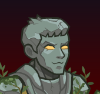ID: 505**Stone Golem Eric (Eric)**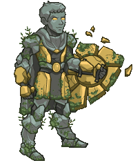
        
        
            **Skin**
            Stone Golem Eric
        
    
    
        
            ID: 238**Skystrike the Baby Griffon**Oh brother, he thinks I'm his mother! I guess I'll have to teach him that Uni isn't food.
        
        
            **Familiar**
            Skystrike the Baby Griffon
        
    
    
        
            ID: 2040**Friendly Resolve**We'll all make it back home one way or another, and we'll do it together.<code>buff_upgrades,80,16137,16138,16139</code>
        
        
            **Feat**
            Friendly Resolve
            Eric (80% All Second Specialisations (Prestack))
        
    
    
        
            ID: 647**Platinum Eric Chest**Loot for: Eric<code>"for_crusaders":[157]</code>
        
        
            **Chest**
            Platinum Eric Chest
            x32 (Shinies x2)
        
    
    
        
            ID: 1723**Potion of the Gem Hunter**Increases the gem drops from bosses by 50%<code>increase_boss_gems_percent,50</code>
        
        
            **Buff**
            Potion of the Gem Hunter
            x1
        
    

ID: 519

### Glasswork Golem Artemis Skin & Feat Pack - 1,680 Platinum ($11.99)  
Date of release: 01 Jan 2025

> Unlock Artemis along with his exclusive Glasswork Golem Skin & Feat!

Contents:

    
        
            ID: 54**Artemis (Seat 3)**
        
        
            **Champion Unlock**
            Artemis
        
    
    
        
            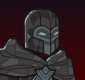ID: 506**Glasswork Golem Artemis (Artemis)**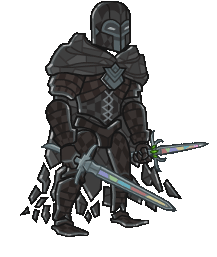
        
        
            **Skin**
            Glasswork Golem Artemis
        
    
    
        
            ID: 2008**Multiversal Allies**Death is part of every culture, every people. I've studied them all.<code>_effect_def,2193</code>
        
        
            **Feat**
            Multiversal Allies
            Artemis (20% All Champion Damage per Unique Species in Formation (Additive) (This Feat Won't Do Anything))
        
    
    
        
            ID: 20**Large Bounty Contract**Claim a bounty worth 8 hours of offline gold earnings and event tokens.<code>seconds_worth_of_gold,28800</code>
        
        
            **Buff**
            Large Bounty Contract
            x6
        
    
    
        
            ID: 34**Large Blacksmithing Contract**Contract a master blacksmith to improve a piece of equipment owned by one of your Champions.<code>level_up_loot,24</code>
        
        
            **Buff**
            Large Blacksmithing Contract
            x6
        
    
    
        
            ID: 167**Platinum Artemis Chest**Loot for: Artemis<code>"for_crusaders":[54]</code>
        
        
            **Chest**
            Platinum Artemis Chest
            x14 (Shinies x1)
        
    

ID: 520

### Crystal Titan Mehen Theme Pack - 3,830 Platinum ($27.99)  
Date of release: 08 Jan 2025

> Unlock Mehen along with an exclusive Crystal Titan Skin & Familiar!

Contents:

    
        
            ID: 80**Mehen (Seat 3)**
        
        
            **Champion Unlock**
            Mehen
        
    
    
        
            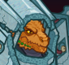ID: 507**Crystal Titan Mehen (Mehen)**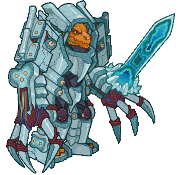
        
        
            **Skin**
            Crystal Titan Mehen
        
    
    
        
            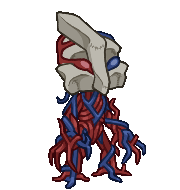ID: 242**Mercy the Vein Golem**I used to be an ancient titan's capillaries! Now I'm the cutest little bean!
        
        
            **Familiar**
            Mercy the Vein Golem
        
    
    
        
            ID: 2043**Fierce Fighter**I've seen a thousand battles, and I'll see a thousand more.<code>buff_upgrades,80,16150,16151,16152</code>
        
        
            **Feat**
            Fierce Fighter
            Mehen (80% All  Specialisations)
        
    
    
        
            ID: 267**Platinum Mehen Chest**Loot for: Mehen<code>"for_crusaders":[80]</code>
        
        
            **Chest**
            Platinum Mehen Chest
            x32 (Shinies x2)
        
    
    
        
            ID: 1723**Potion of the Gem Hunter**Increases the gem drops from bosses by 50%<code>increase_boss_gems_percent,50</code>
        
        
            **Buff**
            Potion of the Gem Hunter
            x1
        
    

ID: 521

### Magen Baeloth Skin & Feat Pack - 1,680 Platinum ($11.99)  
Date of release: 08 Jan 2025

> Unlock Baeloth along with his exclusive Magen Baeloth Skin & Feat!

Contents:

    
        
            ID: 73**Baeloth (Seat 4)**
        
        
            **Champion Unlock**
            Baeloth
        
    
    
        
            ID: 508**Magen Baeloth (Baeloth)**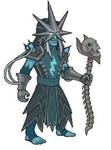
        
        
            **Skin**
            Magen Baeloth
        
    
    
        
            ID: 2045**Electrodeposition**Did you know gold is highly conductive? Would you like a demonstration?<code>buff_upgrade,80,4745</code>
        
        
            **Feat**
            Electrodeposition
            Baeloth (80% Paid Partially with Pain)
        
    
    
        
            ID: 20**Large Bounty Contract**Claim a bounty worth 8 hours of offline gold earnings and event tokens.<code>seconds_worth_of_gold,28800</code>
        
        
            **Buff**
            Large Bounty Contract
            x6
        
    
    
        
            ID: 34**Large Blacksmithing Contract**Contract a master blacksmith to improve a piece of equipment owned by one of your Champions.<code>level_up_loot,24</code>
        
        
            **Buff**
            Large Blacksmithing Contract
            x6
        
    
    
        
            ID: 253**Platinum Baeloth Chest**Loot for: Baeloth<code>"for_crusaders":[73]</code>
        
        
            **Chest**
            Platinum Baeloth Chest
            x14 (Shinies x1)
        
    

ID: 522

### Ganderloo the Clockwork Goose Familiar Pack - 2,380 Platinum ($16.99)  
Date of release: 08 Jan 2025

> Collect your own Ganderloo the Clockwork Goose Familiar!

Contents:

    
        
            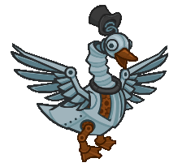ID: 239**Ganderloo the Clockwork Goose**It can't be bargained with. It can't be reasoned with.
        
        
            **Familiar**
            Ganderloo the Clockwork Goose
        
    
    
        
            ID: 4**Huge Potion of Giant's Strength**A transparent potion in which floats the sliver of a giant's fingernail.<code>global_dps_multiplier_mult,900</code>
        
        
            **Buff**
            Huge Potion of Giant's Strength
            x6
        
    
    
        
            ID: 8**Huge Potion of Clairvoyance**Three eyeballs bob in this yellowish potion.<code>gold_multiplier_mult,400</code>
        
        
            **Buff**
            Huge Potion of Clairvoyance
            x6
        
    
    
        
            ID: 36**Potion of Polish**This shiny, silver liquid clings to the edge of the bottle in an unusual way.<code>shiny_loot,1</code>
        
        
            **Buff**
            Potion of Polish
            x1
        
    
    
        
            ID: 40**Huge Potion of Fire Breath**The orange liquid in this vial flickers and smoke fills the top of the container.<code>click_damage_seconds_global_dps,600</code>
        
        
            **Buff**
            Huge Potion of Fire Breath
            x6
        
    
    
        
            ID: 77**Huge Potion of Speed**This potion's yellow fluid is streaked with black and swirls on its own.<code>time_scale,2.75</code>
        
        
            **Buff**
            Huge Potion of Speed
            x6
        
    
    
        
            ID: 1721**Potion of the Gold Hunter**Increase Gold Find by 100%<code>gold_multiplier_mult,100</code>
        
        
            **Buff**
            Potion of the Gold Hunter
            x1
        
    
    
        
            **Modron Component Pieces**
        
        
            **Modron Component Pieces**
            x2,000
        
    

ID: 523

### Iron Golem Barrowin Skin & Feat Pack - 1,680 Platinum ($11.99)  
Date of release: 15 Jan 2025

> Unlock Barrowin along with her exclusive Iron Golem Skin & Feat!

Contents:

    
        
            ID: 19**Barrowin (Seat 10)**
        
        
            **Champion Unlock**
            Barrowin
        
    
    
        
            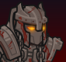ID: 509**Iron Golem Barrowin (Barrowin)**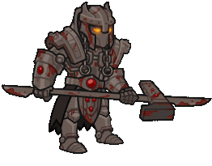
        
        
            **Skin**
            Iron Golem Barrowin
        
    
    
        
            ID: 2046**Prodigal Leader**Rally under the banner of Clan Undurr!<code>global_dps_multiplier_mult,50</code>
        
        
            **Feat**
            Prodigal Leader
            Barrowin (50% All Champion Damage)
        
    
    
        
            ID: 20**Large Bounty Contract**Claim a bounty worth 8 hours of offline gold earnings and event tokens.<code>seconds_worth_of_gold,28800</code>
        
        
            **Buff**
            Large Bounty Contract
            x6
        
    
    
        
            ID: 34**Large Blacksmithing Contract**Contract a master blacksmith to improve a piece of equipment owned by one of your Champions.<code>level_up_loot,24</code>
        
        
            **Buff**
            Large Blacksmithing Contract
            x6
        
    
    
        
            ID: 12**Platinum Barrowin Chest**Loot for: Barrowin<code>"for_crusaders":[19]</code>
        
        
            **Chest**
            Platinum Barrowin Chest
            x14 (Shinies x1)
        
    

ID: 524

### Magen Imoen Skin & Feat Pack - 1,680 Platinum ($0.00)  
Date of release: 15 Jan 2025

> Unlock Imoen along with her exclusive Magen Skin & Feat!

Contents:

    
        
            ID: 117**Imoen (Seat 11)**
        
        
            **Champion Unlock**
            Imoen
        
    
    
        
            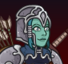ID: 510**Magen Imoen (Imoen)**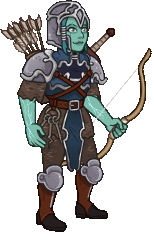
        
        
            **Skin**
            Magen Imoen
        
    
    
        
            ID: 2047**Prodigal Leader**I'll never give up the fight!<code>global_dps_multiplier_mult,50</code>
        
        
            **Feat**
            Prodigal Leader
            Imoen (50% All Champion Damage)
        
    
    
        
            ID: 20**Large Bounty Contract**Claim a bounty worth 8 hours of offline gold earnings and event tokens.<code>seconds_worth_of_gold,28800</code>
        
        
            **Buff**
            Large Bounty Contract
            x6
        
    
    
        
            ID: 34**Large Blacksmithing Contract**Contract a master blacksmith to improve a piece of equipment owned by one of your Champions.<code>level_up_loot,24</code>
        
        
            **Buff**
            Large Blacksmithing Contract
            x6
        
    
    
        
            ID: 436**Platinum Imoen Chest**Loot for: Imoen<code>"for_crusaders":[117]</code>
        
        
            **Chest**
            Platinum Imoen Chest
            x14 (Shinies x1)
        
    

ID: 525

### Stone Golem Diana Skin & Feat Pack - 1,680 Platinum ($0.00)  
Date of release: 22 Jan 2025

> Unlock Diana along with her exclusive Stone Golem Skin & Feat!

Contents:

    
        
            ID: 148**Diana (Seat 9)**
        
        
            **Champion Unlock**
            Diana
        
    
    
        
            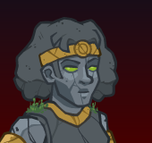ID: 511**Stone Golem Diana (Diana)**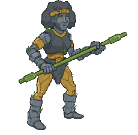
        
        
            **Skin**
            Stone Golem Diana
        
    
    
        
            ID: 2048**Unwavering Inspiration**I believe in myself! I believe in all of us!<code>buff_upgrades,80,14791,14792,14793</code>
        
        
            **Feat**
            Unwavering Inspiration
            Diana (80% All First Specialisations)
        
    
    
        
            ID: 20**Large Bounty Contract**Claim a bounty worth 8 hours of offline gold earnings and event tokens.<code>seconds_worth_of_gold,28800</code>
        
        
            **Buff**
            Large Bounty Contract
            x6
        
    
    
        
            ID: 34**Large Blacksmithing Contract**Contract a master blacksmith to improve a piece of equipment owned by one of your Champions.<code>level_up_loot,24</code>
        
        
            **Buff**
            Large Blacksmithing Contract
            x6
        
    
    
        
            ID: 567**Platinum Diana Chest**Loot for: Diana<code>"for_crusaders":[148]</code>
        
        
            **Chest**
            Platinum Diana Chest
            x14 (Shinies x1)
        
    

ID: 526

### Autognome Stoki Skin & Feat Pack - 1,680 Platinum ($0.00)  
Date of release: 22 Jan 2025

> Unlock Stoki along with her exclusive Autognome Skin & Feat!

Contents:

    
        
            ID: 14**Stoki (Seat 4)**
        
        
            **Champion Unlock**
            Stoki
        
    
    
        
            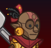ID: 512**Autognome Stoki (Stoki)**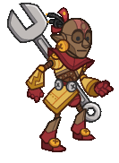
        
        
            **Skin**
            Autognome Stoki
        
    
    
        
            ID: 1240**Maintain Focus**We can't afford to waste time on distractions.<code>change_upgrade_data,16052,5</code>
        
        
            **Feat**
            Maintain Focus
            Stoki (Focus Points Are Only Reduced by 33% On Changing Areas)
        
    
    
        
            ID: 20**Large Bounty Contract**Claim a bounty worth 8 hours of offline gold earnings and event tokens.<code>seconds_worth_of_gold,28800</code>
        
        
            **Buff**
            Large Bounty Contract
            x6
        
    
    
        
            ID: 34**Large Blacksmithing Contract**Contract a master blacksmith to improve a piece of equipment owned by one of your Champions.<code>level_up_loot,24</code>
        
        
            **Buff**
            Large Blacksmithing Contract
            x6
        
    
    
        
            ID: 4**Platinum Stoki Chest**Loot for: Stoki<code>"for_crusaders":[14]</code>
        
        
            **Chest**
            Platinum Stoki Chest
            x14 (Shinies x1)
        
    

ID: 527

### Hexton Modron Familiar Pack - 2,380 Platinum ($0.00)  
Date of release: 22 Jan 2025

> Collect your own Hexton Modron Familiar!

Contents:

    
        
            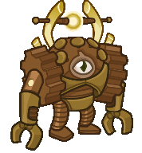ID: 240**Hexton Modron**The march MUST continue!
        
        
            **Familiar**
            Hexton Modron
        
    
    
        
            ID: 4**Huge Potion of Giant's Strength**A transparent potion in which floats the sliver of a giant's fingernail.<code>global_dps_multiplier_mult,900</code>
        
        
            **Buff**
            Huge Potion of Giant's Strength
            x6
        
    
    
        
            ID: 8**Huge Potion of Clairvoyance**Three eyeballs bob in this yellowish potion.<code>gold_multiplier_mult,400</code>
        
        
            **Buff**
            Huge Potion of Clairvoyance
            x6
        
    
    
        
            ID: 36**Potion of Polish**This shiny, silver liquid clings to the edge of the bottle in an unusual way.<code>shiny_loot,1</code>
        
        
            **Buff**
            Potion of Polish
            x1
        
    
    
        
            ID: 40**Huge Potion of Fire Breath**The orange liquid in this vial flickers and smoke fills the top of the container.<code>click_damage_seconds_global_dps,600</code>
        
        
            **Buff**
            Huge Potion of Fire Breath
            x6
        
    
    
        
            ID: 77**Huge Potion of Speed**This potion's yellow fluid is streaked with black and swirls on its own.<code>time_scale,2.75</code>
        
        
            **Buff**
            Huge Potion of Speed
            x6
        
    
    
        
            ID: 1721**Potion of the Gold Hunter**Increase Gold Find by 100%<code>gold_multiplier_mult,100</code>
        
        
            **Buff**
            Potion of the Gold Hunter
            x1
        
    
    
        
            **Modron Component Pieces**
        
        
            **Modron Component Pieces**
            x2,000
        
    

ID: 528

### Android Kent Skin & Feat Pack - 1,680 Platinum ($0.00)  
Date of release: 29 Jan 2025

> Unlock Kent along with his exclusive Android Skin & Feat!

Contents:

    
        
            ID: 114**Kent (Seat 4)**
        
        
            **Champion Unlock**
            Kent
        
    
    
        
            ID: 513**Android Kent (Kent)**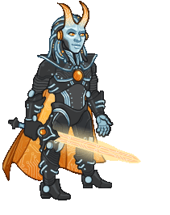
        
        
            **Skin**
            Android Kent
        
    
    
        
            ID: 2050**Multiversal Allies**We are stronger together.<code>_effect_def,2193</code>
        
        
            **Feat**
            Multiversal Allies
            Kent (20% All Champion Damage per Unique Species in Formation (Additive) (This Feat Won't Do Anything))
        
    
    
        
            ID: 20**Large Bounty Contract**Claim a bounty worth 8 hours of offline gold earnings and event tokens.<code>seconds_worth_of_gold,28800</code>
        
        
            **Buff**
            Large Bounty Contract
            x6
        
    
    
        
            ID: 34**Large Blacksmithing Contract**Contract a master blacksmith to improve a piece of equipment owned by one of your Champions.<code>level_up_loot,24</code>
        
        
            **Buff**
            Large Blacksmithing Contract
            x6
        
    
    
        
            ID: 430**Platinum Kent Chest**Loot for: Kent<code>"for_crusaders":[114]</code>
        
        
            **Chest**
            Platinum Kent Chest
            x14 (Shinies x1)
        
    

ID: 529

### Aria the Metallic Warbler Familiar Pack - 1,680 Platinum ($0.00)  
Date of release: 29 Jan 2025

> Collect your own Aria the Metallic Warbler Familiar!

Contents:

    
        
            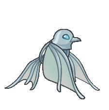ID: 241**Aria the Metallic Warbler**Their telepathic bond lets them summon their dragon creators in case of dire need.
        
        
            **Familiar**
            Aria the Metallic Warbler
        
    
    
        
            ID: 4**Huge Potion of Giant's Strength**A transparent potion in which floats the sliver of a giant's fingernail.<code>global_dps_multiplier_mult,900</code>
        
        
            **Buff**
            Huge Potion of Giant's Strength
            x4
        
    
    
        
            ID: 8**Huge Potion of Clairvoyance**Three eyeballs bob in this yellowish potion.<code>gold_multiplier_mult,400</code>
        
        
            **Buff**
            Huge Potion of Clairvoyance
            x4
        
    
    
        
            ID: 36**Potion of Polish**This shiny, silver liquid clings to the edge of the bottle in an unusual way.<code>shiny_loot,1</code>
        
        
            **Buff**
            Potion of Polish
            x1
        
    
    
        
            ID: 77**Huge Potion of Speed**This potion's yellow fluid is streaked with black and swirls on its own.<code>time_scale,2.75</code>
        
        
            **Buff**
            Huge Potion of Speed
            x4
        
    

ID: 534

### Ruby Rose Knight Kalix Theme Pack - 3,830 Platinum ($0.00)  
Date of release: 05 Feb 2025

> Unlock Kalix along with an exclusive Ruby Rose Knight Skin & Familiar!

Contents:

    
        
            ID: 158**Kalix**
        
        
            **Champion Unlock**
            Kalix
        
    
    
        
            ID: 525**Ruby Rose Knight Kalix (Kalix)**
        
        
            **Skin**
            Ruby Rose Knight Kalix
        
    
    
        
            ID: 245**Dendria the Orchid Mantis**Always by your side.
        
        
            **Familiar**
            Dendria the Orchid Mantis
        
    
    
        
            ID: 2065**Feat**???: 2065
        
        
            **Feat**
            ???: 2065
        
    
    
        
            ID: 649**Platinum Kalix Chest**Loot for: Kalix<code>"for_crusaders":[158]</code>
        
        
            **Chest**
            Platinum Kalix Chest
            x32 (Shinies x2)
        
    
    
        
            ID: 1723**Potion of the Gem Hunter**Increases the gem drops from bosses by 50%<code>increase_boss_gems_percent,50</code>
        
        
            **Buff**
            Potion of the Gem Hunter
            x1
        
    

ID: 535

### Demilich Hew Maan Skin & Feat Pack - 1,680 Platinum ($0.00)  
Date of release: 05 Feb 2025

> Unlock Hew Maan along with their exclusive Demilich Skin & Feat!

Contents:

    
        
            ID: 75**Hew Maan (Seat 8)**
        
        
            **Champion Unlock**
            Hew Maan
        
    
    
        
            ID: 517**Demilich Hew Maan (Hew Maan)**
        
        
            **Skin**
            Demilich Hew Maan
        
    
    
        
            ID: 2077**Misdirection**Zrang? Nope. Never heard of 'em. ~Zrang<code>global_dps_multiplier_mult,100 reverse_taunt</code>
        
        
            **Feat**
            Misdirection
            Hew Maan (100% All Champion Damage & Enemies Will Attack Other Champions If Possible)
        
    
    
        
            ID: 20**Large Bounty Contract**Claim a bounty worth 8 hours of offline gold earnings and event tokens.<code>seconds_worth_of_gold,28800</code>
        
        
            **Buff**
            Large Bounty Contract
            x6
        
    
    
        
            ID: 34**Large Blacksmithing Contract**Contract a master blacksmith to improve a piece of equipment owned by one of your Champions.<code>level_up_loot,24</code>
        
        
            **Buff**
            Large Blacksmithing Contract
            x6
        
    
    
        
            ID: 257**Platinum Hew Maan Chest**Loot for: Hew Maan<code>"for_crusaders":[75]</code>
        
        
            **Chest**
            Platinum Hew Maan Chest
            x14 (Shinies x1)
        
    

ID: 536

### Dashing Ishi Theme Pack - 3,830 Platinum ($0.00)  
Date of release: 12 Feb 2025

> Unlock Ishi along with an exclusive Dashing Skin & Familiar!

Contents:

    
        
            ID: 111**Y4E15**
        
        
            **Champion Unlock**
            Y4E15
        
    
    
        
            ID: 518**Dashing Ishi (Y4E15)**
        
        
            **Skin**
            Dashing Ishi
        
    
    
        
            ID: 246**Nub-ub the Mouse**This simple mouse, often mistaken for the God Ubtao, is probably just a simple mouse.
        
        
            **Familiar**
            Nub-ub the Mouse
        
    
    
        
            ID: 2089**Feat**???: 2089
        
        
            **Feat**
            ???: 2089
        
    
    
        
            ID: 58**Platinum Ishi Chest**Loot for: Ishi<code>"for_crusaders":[31]</code>
        
        
            **Chest**
            Platinum Ishi Chest
            x32 (Shinies x2)
        
    
    
        
            ID: 1723**Potion of the Gem Hunter**Increases the gem drops from bosses by 50%<code>increase_boss_gems_percent,50</code>
        
        
            **Buff**
            Potion of the Gem Hunter
            x1
        
    

ID: 537

### Prom Night Presto Skin & Feat Pack - 1,680 Platinum ($0.00)  
Date of release: 12 Feb 2025

> Unlock Presto along with his exclusive Prom Night Skin & Feat!

Contents:

    
        
            ID: 144**Presto (Seat 2)**
        
        
            **Champion Unlock**
            Presto
        
    
    
        
            ID: 519**Prom Night Presto (Presto)**
        
        
            **Skin**
            Prom Night Presto
        
    
    
        
            ID: 2078**Presto's Aplomb**Growing up sure is scary, but I'll be brave.<code>buff_upgrades,20,13765,13766,13767</code>
        
        
            **Feat**
            Presto's Aplomb
            Presto (20% All Specialisations)
        
    
    
        
            ID: 20**Large Bounty Contract**Claim a bounty worth 8 hours of offline gold earnings and event tokens.<code>seconds_worth_of_gold,28800</code>
        
        
            **Buff**
            Large Bounty Contract
            x6
        
    
    
        
            ID: 34**Large Blacksmithing Contract**Contract a master blacksmith to improve a piece of equipment owned by one of your Champions.<code>level_up_loot,24</code>
        
        
            **Buff**
            Large Blacksmithing Contract
            x6
        
    
    
        
            ID: 559**Platinum Presto Chest**Loot for: Presto<code>"for_crusaders":[144]</code>
        
        
            **Chest**
            Platinum Presto Chest
            x14 (Shinies x1)
        
    

ID: 538

### Meepo the Kobold Familiar Pack - 1,680 Platinum ($0.00)  
Date of release: 12 Feb 2025

> Collect your own Meepo the Kobold Familiar!

Contents:

    
        
            ID: 247**Meepo the Kobold**Has anyone seen Calcryx?
        
        
            **Familiar**
            Meepo the Kobold
        
    
    
        
            ID: 4**Huge Potion of Giant's Strength**A transparent potion in which floats the sliver of a giant's fingernail.<code>global_dps_multiplier_mult,900</code>
        
        
            **Buff**
            Huge Potion of Giant's Strength
            x4
        
    
    
        
            ID: 8**Huge Potion of Clairvoyance**Three eyeballs bob in this yellowish potion.<code>gold_multiplier_mult,400</code>
        
        
            **Buff**
            Huge Potion of Clairvoyance
            x4
        
    
    
        
            ID: 36**Potion of Polish**This shiny, silver liquid clings to the edge of the bottle in an unusual way.<code>shiny_loot,1</code>
        
        
            **Buff**
            Potion of Polish
            x1
        
    
    
        
            ID: 77**Huge Potion of Speed**This potion's yellow fluid is streaked with black and swirls on its own.<code>time_scale,2.75</code>
        
        
            **Buff**
            Huge Potion of Speed
            x4
        
    

ID: 539

### Ballroom Vi Skin & Feat Pack - 1,680 Platinum ($0.00)  
Date of release: 19 Feb 2025

> Unlock Vi along with her exclusive Ballroom Skin & Feat!

Contents:

    
        
            ID: 95**Vi (Seat 12)**
        
        
            **Champion Unlock**
            Vi
        
    
    
        
            ID: 520**Ballroom Vi (Vi)**
        
        
            **Skin**
            Ballroom Vi
        
    
    
        
            ID: 2079**Prodigal Leader**When you look this good, people will do just about anything for you.<code>global_dps_multiplier_mult,50</code>
        
        
            **Feat**
            Prodigal Leader
            Vi (50% All Champion Damage)
        
    
    
        
            ID: 20**Large Bounty Contract**Claim a bounty worth 8 hours of offline gold earnings and event tokens.<code>seconds_worth_of_gold,28800</code>
        
        
            **Buff**
            Large Bounty Contract
            x6
        
    
    
        
            ID: 34**Large Blacksmithing Contract**Contract a master blacksmith to improve a piece of equipment owned by one of your Champions.<code>level_up_loot,24</code>
        
        
            **Buff**
            Large Blacksmithing Contract
            x6
        
    
    
        
            ID: 347**Platinum Vi Chest**Loot for: Vi<code>"for_crusaders":[95]</code>
        
        
            **Chest**
            Platinum Vi Chest
            x14 (Shinies x1)
        
    

ID: 540

### Formal Birdsong Skin & Feat Pack - 1,680 Platinum ($0.00)  
Date of release: 19 Feb 2025

> Unlock Birdsong along with her exclusive Formal Skin & Feat!

Contents:

    
        
            ID: 21**Birdsong (Seat 9)**
        
        
            **Champion Unlock**
            Birdsong
        
    
    
        
            ID: 521**Formal Birdsong (Birdsong)**
        
        
            **Skin**
            Formal Birdsong
        
    
    
        
            ID: 2080**Weapon Master**Take away my blades and I'll show you what these claws can do.<code>hero_dps_multiplier_mult,120</code>
        
        
            **Feat**
            Weapon Master
            Birdsong (120% Self DPS)
        
    
    
        
            ID: 20**Large Bounty Contract**Claim a bounty worth 8 hours of offline gold earnings and event tokens.<code>seconds_worth_of_gold,28800</code>
        
        
            **Buff**
            Large Bounty Contract
            x6
        
    
    
        
            ID: 34**Large Blacksmithing Contract**Contract a master blacksmith to improve a piece of equipment owned by one of your Champions.<code>level_up_loot,24</code>
        
        
            **Buff**
            Large Blacksmithing Contract
            x6
        
    
    
        
            ID: 19**Platinum Birdsong Chest**Loot for: Birdsong<code>"for_crusaders":[21]</code>
        
        
            **Chest**
            Platinum Birdsong Chest
            x14 (Shinies x1)
        
    

ID: 541

### Dragonlance Thellora Skin & Feat Pack - 1,680 Platinum ($0.00)  
Date of release: 26 Feb 2025

> Unlock Thellora along with her exclusive Dragonlance Skin & Feat!

Contents:

    
        
            ID: 139**Thellora (Seat 1)**
        
        
            **Champion Unlock**
            Thellora
        
    
    
        
            ID: 522**Dragonlance Thellora (Thellora)**
        
        
            **Skin**
            Dragonlance Thellora
        
    
    
        
            ID: 2081**Ferocious Charge**With me! Overwhelm them with our combined might! Make them fear us!<code>buff_upgrade,80,12978</code>
        
        
            **Feat**
            Ferocious Charge
            Thellora (80% Strength of the Luma)
        
    
    
        
            ID: 20**Large Bounty Contract**Claim a bounty worth 8 hours of offline gold earnings and event tokens.<code>seconds_worth_of_gold,28800</code>
        
        
            **Buff**
            Large Bounty Contract
            x6
        
    
    
        
            ID: 34**Large Blacksmithing Contract**Contract a master blacksmith to improve a piece of equipment owned by one of your Champions.<code>level_up_loot,24</code>
        
        
            **Buff**
            Large Blacksmithing Contract
            x6
        
    
    
        
            ID: 549**Platinum Thellora Chest**Loot for: Thellora<code>"for_crusaders":[139]</code>
        
        
            **Chest**
            Platinum Thellora Chest
            x14 (Shinies x1)
        
    

ID: 542

### Dragonlance BBEG Skin & Feat Pack - 1,680 Platinum ($0.00)  
Date of release: 26 Feb 2025

> Unlock BBEG along with his exclusive Dragonlance Skin & Feat!

Contents:

    
        
            ID: 125**BBEG (Seat 3)**
        
        
            **Champion Unlock**
            BBEG
        
    
    
        
            ID: 523**Dragonlance BBEG (BBEG)**
        
        
            **Skin**
            Dragonlance BBEG
        
    
    
        
            ID: 2082**Secret Stash**I've hoarded an assortment of accursed concoctions just for this occasion.<code>buff_upgrade,40,11540</code>
        
        
            **Feat**
            Secret Stash
            BBEG (40% Homebrew)
        
    
    
        
            ID: 20**Large Bounty Contract**Claim a bounty worth 8 hours of offline gold earnings and event tokens.<code>seconds_worth_of_gold,28800</code>
        
        
            **Buff**
            Large Bounty Contract
            x6
        
    
    
        
            ID: 34**Large Blacksmithing Contract**Contract a master blacksmith to improve a piece of equipment owned by one of your Champions.<code>level_up_loot,24</code>
        
        
            **Buff**
            Large Blacksmithing Contract
            x6
        
    
    
        
            ID: 452**Platinum BBEG Chest**Loot for: BBEG<code>"for_crusaders":[125]</code>
        
        
            **Chest**
            Platinum BBEG Chest
            x14 (Shinies x1)
        
    

ID: 543

### Krynn the Crystal Dragon Familiar Pack - 2,380 Platinum ($0.00)  
Date of release: 26 Feb 2025

> Collect your own Krynn the Crystal Dragon Familiar!

Contents:

    
        
            ID: 248**Krynn the Crystal Dragon**She only gets angry when you mention Takhisis.
        
        
            **Familiar**
            Krynn the Crystal Dragon
        
    
    
        
            ID: 4**Huge Potion of Giant's Strength**A transparent potion in which floats the sliver of a giant's fingernail.<code>global_dps_multiplier_mult,900</code>
        
        
            **Buff**
            Huge Potion of Giant's Strength
            x6
        
    
    
        
            ID: 8**Huge Potion of Clairvoyance**Three eyeballs bob in this yellowish potion.<code>gold_multiplier_mult,400</code>
        
        
            **Buff**
            Huge Potion of Clairvoyance
            x6
        
    
    
        
            ID: 36**Potion of Polish**This shiny, silver liquid clings to the edge of the bottle in an unusual way.<code>shiny_loot,1</code>
        
        
            **Buff**
            Potion of Polish
            x1
        
    
    
        
            ID: 40**Huge Potion of Fire Breath**The orange liquid in this vial flickers and smoke fills the top of the container.<code>click_damage_seconds_global_dps,600</code>
        
        
            **Buff**
            Huge Potion of Fire Breath
            x6
        
    
    
        
            ID: 77**Huge Potion of Speed**This potion's yellow fluid is streaked with black and swirls on its own.<code>time_scale,2.75</code>
        
        
            **Buff**
            Huge Potion of Speed
            x6
        
    
    
        
            ID: 1721**Potion of the Gold Hunter**Increase Gold Find by 100%<code>gold_multiplier_mult,100</code>
        
        
            **Buff**
            Potion of the Gold Hunter
            x1
        
    
    
        
            **Modron Component Pieces**
        
        
            **Modron Component Pieces**
            x2,000
        
    

ID: 544

### Privateer Volo Theme Pack - 3,830 Platinum ($0.00)  
Date of release: 05 Mar 2025

> Unlock Volo along with an exclusive Privateer Skin & Familiar!

Contents:

    
        
            ID: 159**Sheila**
        
        
            **Champion Unlock**
            Sheila
        
    
    
        
            ID: 526**Privateer Volo (Sheila)**
        
        
            **Skin**
            Privateer Volo
        
    
    
        
            ID: 250**Magical Animated Quill**
        
        
            **Familiar**
            Magical Animated Quill
        
    
    
        
            ID: 1**Selflessness**Aye, a selfless dwarf I am.<code>global_dps_multiplier_mult,10</code>
        
        
            **Feat**
            Selflessness
            Bruenor (10% All Champion Damage)
        
    
    
        
            ID: 651****Loot for: Sheila<code>"for_crusaders":[159]</code>
        
        
            **Chest**
            
            x32 (Shinies x2)
        
    
    
        
            ID: 1723**Potion of the Gem Hunter**Increases the gem drops from bosses by 50%<code>increase_boss_gems_percent,50</code>
        
        
            **Buff**
            Potion of the Gem Hunter
            x1
        
    

ID: 545

### Fathomless Gale Skin & Feat Pack - 1,680 Platinum ($0.00)  
Date of release: 05 Mar 2025

> Unlock Gale along with his exclusive Fathomless Skin & Feat!

Contents:

    
        
            ID: 147**Gale (Seat 1)**
        
        
            **Champion Unlock**
            Gale
        
    
    
        
            ID: 527**Fathomless Gale (Gale)**
        
        
            **Skin**
            Fathomless Gale
        
    
    
        
            ID: 2090**TBD Gale Feat**
        
        
            **Feat**
            TBD Gale Feat
            Gale ()
        
    
    
        
            ID: 20**Large Bounty Contract**Claim a bounty worth 8 hours of offline gold earnings and event tokens.<code>seconds_worth_of_gold,28800</code>
        
        
            **Buff**
            Large Bounty Contract
            x6
        
    
    
        
            ID: 34**Large Blacksmithing Contract**Contract a master blacksmith to improve a piece of equipment owned by one of your Champions.<code>level_up_loot,24</code>
        
        
            **Buff**
            Large Blacksmithing Contract
            x6
        
    
    
        
            ID: 565**Platinum Gale Chest**Loot for: Gale<code>"for_crusaders":[147]</code>
        
        
            **Chest**
            Platinum Gale Chest
            x14 (Shinies x1)
        
    

ID: 546

### Swashbuckler Sheila Theme Pack - 3,830 Platinum ($0.00)  
Date of release: 12 Mar 2025

> Unlock Sheila along with an exclusive Swashbuckler Skin & Familiar!

Contents:

    
        
            ID: 160**Volo**
        
        
            **Champion Unlock**
            Volo
        
    
    
        
            ID: 528**Swashbuckler Sheila (Volo)**
        
        
            **Skin**
            Swashbuckler Sheila
        
    
    
        
            ID: 251**TBD Sheila Familiar**
        
        
            **Familiar**
            TBD Sheila Familiar
        
    
    
        
            ID: 1**Selflessness**Aye, a selfless dwarf I am.<code>global_dps_multiplier_mult,10</code>
        
        
            **Feat**
            Selflessness
            Bruenor (10% All Champion Damage)
        
    
    
        
            ID: 653****Loot for: Volo<code>"for_crusaders":[160]</code>
        
        
            **Chest**
            
            x32 (Shinies x2)
        
    
    
        
            ID: 1723**Potion of the Gem Hunter**Increases the gem drops from bosses by 50%<code>increase_boss_gems_percent,50</code>
        
        
            **Buff**
            Potion of the Gem Hunter
            x1
        
    

ID: 547

### Swashbuckler Orkira Skin & Feat Pack - 1,680 Platinum ($0.00)  
Date of release: 12 Mar 2025

> Unlock Orkira along with her exclusive Swashbuckler Skin & Feat!

Contents:

    
        
            ID: 78**Orkira (Seat 1)**
        
        
            **Champion Unlock**
            Orkira
        
    
    
        
            ID: 529**Swashbuckler Orkira (Orkira)**
        
        
            **Skin**
            Swashbuckler Orkira
        
    
    
        
            ID: 2091**TBD Orkira Feat**
        
        
            **Feat**
            TBD Orkira Feat
            Orkira ()
        
    
    
        
            ID: 20**Large Bounty Contract**Claim a bounty worth 8 hours of offline gold earnings and event tokens.<code>seconds_worth_of_gold,28800</code>
        
        
            **Buff**
            Large Bounty Contract
            x6
        
    
    
        
            ID: 34**Large Blacksmithing Contract**Contract a master blacksmith to improve a piece of equipment owned by one of your Champions.<code>level_up_loot,24</code>
        
        
            **Buff**
            Large Blacksmithing Contract
            x6
        
    
    
        
            ID: 263**Platinum Orkira Chest**Loot for: Orkira<code>"for_crusaders":[78]</code>
        
        
            **Chest**
            Platinum Orkira Chest
            x14 (Shinies x1)
        
    

ID: 548

### Pirate Queen Sisaspia Skin & Feat Pack - 1,680 Platinum ($0.00)  
Date of release: 19 Mar 2025

> Unlock Sisaspia along with her exclusive Pirate Queen Skin & Feat!

Contents:

    
        
            ID: 57**Sisaspia (Seat 1)**
        
        
            **Champion Unlock**
            Sisaspia
        
    
    
        
            ID: 530**Pirate Queen Sisaspia (Sisaspia)**
        
        
            **Skin**
            Pirate Queen Sisaspia
        
    
    
        
            ID: 2092**TBD Sisaspia Feat**
        
        
            **Feat**
            TBD Sisaspia Feat
            Sisaspia ()
        
    
    
        
            ID: 20**Large Bounty Contract**Claim a bounty worth 8 hours of offline gold earnings and event tokens.<code>seconds_worth_of_gold,28800</code>
        
        
            **Buff**
            Large Bounty Contract
            x6
        
    
    
        
            ID: 34**Large Blacksmithing Contract**Contract a master blacksmith to improve a piece of equipment owned by one of your Champions.<code>level_up_loot,24</code>
        
        
            **Buff**
            Large Blacksmithing Contract
            x6
        
    
    
        
            ID: 173**Platinum Sisaspia Chest**Loot for: Sisaspia<code>"for_crusaders":[57]</code>
        
        
            **Chest**
            Platinum Sisaspia Chest
            x14 (Shinies x1)
        
    

ID: 549

### Pirate Lord Nrakk Skin & Feat Pack - 1,680 Platinum ($0.00)  
Date of release: 19 Mar 2025

> Unlock Nrakk along with his exclusive Pirate Lord Skin & Feat!

Contents:

    
        
            ID: 24**Nrakk (Seat 8)**
        
        
            **Champion Unlock**
            Nrakk
        
    
    
        
            ID: 531**Pirate Lord Nrakk (Nrakk)**
        
        
            **Skin**
            Pirate Lord Nrakk
        
    
    
        
            ID: 2093**TBD Nrakk Feat**
        
        
            **Feat**
            TBD Nrakk Feat
            Nrakk ()
        
    
    
        
            ID: 20**Large Bounty Contract**Claim a bounty worth 8 hours of offline gold earnings and event tokens.<code>seconds_worth_of_gold,28800</code>
        
        
            **Buff**
            Large Bounty Contract
            x6
        
    
    
        
            ID: 34**Large Blacksmithing Contract**Contract a master blacksmith to improve a piece of equipment owned by one of your Champions.<code>level_up_loot,24</code>
        
        
            **Buff**
            Large Blacksmithing Contract
            x6
        
    
    
        
            ID: 30**Platinum Nrakk Chest**Loot for: Nrakk<code>"for_crusaders":[24]</code>
        
        
            **Chest**
            Platinum Nrakk Chest
            x14 (Shinies x1)
        
    

[Back to Top](#top)

*Last Modified: {{ site.time }}*