[Back to Main](index.md)

# Premium Packs and DLC

Upcoming real-money shop items.

ID: 667

### Pirate Dragonbait Skin & Feat Pack - 1,680 Platinum  
Date of release: 28 Jan 2026

> Collect an exclusive Pirate Skin & Feat for Dragonbait!

Contents:

    
        
            ID: 650**Pirate Dragonbait (Dragonbait)**
        
        
            **Skin**
            Pirate Dragonbait
        
    
    
        
            ID: 2448**Scent of Battle**Boss smells like a burning bakery.  Increases the effect of Dragonbait's Shen-state ability by 80%.<code>buff_upgrade,80,3272</code>
        
        
            **Feat**
            Scent of Battle
            Dragonbait
        
    
    
        
            ID: 20**Large Bounty Contract**Claim a bounty worth 8 hours of offline gold earnings and event tokens.<code>seconds_worth_of_gold,28800</code>
        
        
            **Buff**
            Large Bounty Contract
            x6
        
    
    
        
            ID: 34**Large Blacksmithing Contract**Contract a master blacksmith to improve a piece of equipment owned by one of your Champions.<code>level_up_loot,24</code>
        
        
            **Buff**
            Large Blacksmithing Contract
            x6
        
    
    
        
            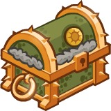ID: 476**Platinum Dragonbait Chest**Loot for: Dragonbait<code>"for_crusaders":[67]</code>
        
        
            **Chest**
            Platinum Dragonbait Chest
            x14 (Shinies x1)
        
    

ID: 668

### Scarlet Corsair Dark Urge Skin & Feat Pack - 1,680 Platinum  
Date of release: 28 Jan 2026

> Unlock The Dark Urge along with his exclusive Scarlet Corsair Skin & Feat!

Contents:

    
        
            ID: 146**Dark Urge (Seat 11)**
        
        
            **Champion Unlock**
            Dark Urge
        
    
    
        
            ID: 651**Scarlet Corsair Dark Urge (Dark Urge)**
        
        
            **Skin**
            Scarlet Corsair Dark Urge
        
    
    
        
            ID: 2449**Human Glitch**In another world - another life - would my destiny be any different?  The Dark Urge also counts as a Human and increases the damage of all Champions by 20% for each Ceremorphosis stack the formation has.<code>add_hero_tags,0,human global_dps_multiplier_mult,20</code>
        
        
            **Feat**
            Human Glitch
            Dark Urge
        
    
    
        
            ID: 20**Large Bounty Contract**Claim a bounty worth 8 hours of offline gold earnings and event tokens.<code>seconds_worth_of_gold,28800</code>
        
        
            **Buff**
            Large Bounty Contract
            x6
        
    
    
        
            ID: 34**Large Blacksmithing Contract**Contract a master blacksmith to improve a piece of equipment owned by one of your Champions.<code>level_up_loot,24</code>
        
        
            **Buff**
            Large Blacksmithing Contract
            x6
        
    
    
        
            ID: 563**Platinum The Dark Urge Chest**Loot for: Dark Urge<code>"for_crusaders":[146]</code>
        
        
            **Chest**
            Platinum The Dark Urge Chest
            x14 (Shinies x1)
        
    

ID: 669

### Spurt's Jar of Green Slime Familiar & Feat Pack - 1,680 Platinum  
Date of release: 28 Jan 2026

> Collect a Feat for Spurt along with an exclusive Spurt-themed familiar!

Contents:

    
        
            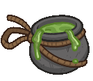ID: 305**Jar of Green Slime**'This is my brother - say hi brother!'~ Spurt
        
        
            **Familiar**
            Jar of Green Slime
        
    
    
        
            ID: 2450**Non-Standard Affair**I want to be friends with everyone! EVERYONE!  Increases the damage of all Champions by 20% for each non-Standard species in the formation, stacking additively. Standard species are Aasimar, Dragonborn, Dwarf, Elf, Gnome, Goliath, Halfling, Human, Orc, Tiefling, Half-Orc, and Half-Elf.<code>effect_def,2608</code>
        
        
            **Feat**
            Non-Standard Affair
            Spurt
        
    
    
        
            ID: 36**Potion of Polish**This shiny, silver liquid clings to the edge of the bottle in an unusual way.<code>shiny_loot,1</code>
        
        
            **Buff**
            Potion of Polish
            x1
        
    
    
        
            ID: 77**Huge Potion of Speed**This potion's yellow fluid is streaked with black and swirls on its own.<code>time_scale,2.75</code>
        
        
            **Buff**
            Huge Potion of Speed
            x2
        
    
    
        
            ID: 1712**Potion of the Hunter**Increase Global Damage by 100%<code>global_dps_multiplier_mult,100</code>
        
        
            **Buff**
            Potion of the Hunter
            x1
        
    

ID: 670

### Ancient Kyre Theme Pack - 3,830 Platinum  
Date of release: 04 Feb 2026

> Unlock Kyre along with an exclusive Ancient Skin & Familiar!

Contents:

    
        
            ID: 172**Kyre**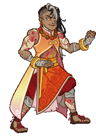
        
        
            **Champion Unlock**
            Kyre
        
    
    
        
            ID: 661**Ancient Kyre (Kyre)**
        
        
            **Skin**
            Ancient Kyre
        
    
    
        
            ID: 306**Soul the Sun Elemental**We are made of star-stuff.
        
        
            **Familiar**
            Soul the Sun Elemental
        
    
    
        
            ID: 2473**Feat**???: 2473
        
        
            **Feat**
            ???: 2473
        
    
    
        
            ID: 782**Platinum Kyre Chest**Loot for: Kyre<code>"for_crusaders":[172]</code>
        
        
            **Chest**
            Platinum Kyre Chest
            x32 (Shinies x2)
        
    
    
        
            ID: 1723**Potion of the Gem Hunter**Increases the gem drops from bosses by 50%<code>increase_boss_gems_percent,50</code>
        
        
            **Buff**
            Potion of the Gem Hunter
            x1
        
    

ID: 671

### Ancient Hew Maan Skin & Feat Pack - 1,680 Platinum  
Date of release: 04 Feb 2026

> Unlock Hew Maan along with their exclusive Ancient Skin & Feat!

Contents:

    
        
            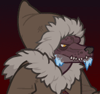ID: 75**Hew Maan (Seat 8)**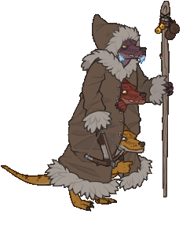
        
        
            **Champion Unlock**
            Hew Maan
        
    
    
        
            ID: 652**Ancient Hew Maan (Hew Maan)**
        
        
            **Skin**
            Ancient Hew Maan
        
    
    
        
            ID: 2451**Free Agent**Agents Zrang, Kleeb, and Yassa, ready! We're a triple threat!  Increases the damage of all Champions by 20% for each Unaffiliated Champion in the formation.<code>global_dps_multiplier_mult,20</code>
        
        
            **Feat**
            Free Agent
            Hew Maan
        
    
    
        
            ID: 20**Large Bounty Contract**Claim a bounty worth 8 hours of offline gold earnings and event tokens.<code>seconds_worth_of_gold,28800</code>
        
        
            **Buff**
            Large Bounty Contract
            x6
        
    
    
        
            ID: 34**Large Blacksmithing Contract**Contract a master blacksmith to improve a piece of equipment owned by one of your Champions.<code>level_up_loot,24</code>
        
        
            **Buff**
            Large Blacksmithing Contract
            x6
        
    
    
        
            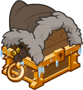ID: 257**Platinum Hew Maan Chest**Loot for: Hew Maan<code>"for_crusaders":[75]</code>
        
        
            **Chest**
            Platinum Hew Maan Chest
            x14 (Shinies x1)
        
    

ID: 672

### Primordial Fire Karlach Skin & Feat Pack - 1,680 Platinum  
Date of release: 04 Feb 2026

> Unlock Karlach along with her exclusive Primordial Fire Skin & Feat!

Contents:

    
        
            ID: 143**Karlach (Seat 4)**
        
        
            **Champion Unlock**
            Karlach
        
    
    
        
            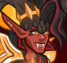ID: 653**Primordial Fire Karlach (Karlach)**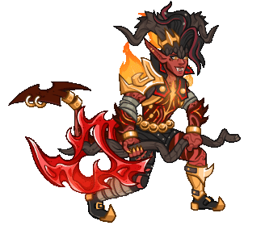
        
        
            **Skin**
            Primordial Fire Karlach
        
    
    
        
            ID: 2452**Hell's Heart**Avernus taught me everything there is to know about pain. Let me show you.  Increases the effect of Karlach's An Experienced Gladiator ability by 80%.<code>buff_upgrade,80,13725</code>
        
        
            **Feat**
            Hell's Heart
            Karlach
        
    
    
        
            ID: 20**Large Bounty Contract**Claim a bounty worth 8 hours of offline gold earnings and event tokens.<code>seconds_worth_of_gold,28800</code>
        
        
            **Buff**
            Large Bounty Contract
            x6
        
    
    
        
            ID: 34**Large Blacksmithing Contract**Contract a master blacksmith to improve a piece of equipment owned by one of your Champions.<code>level_up_loot,24</code>
        
        
            **Buff**
            Large Blacksmithing Contract
            x6
        
    
    
        
            ID: 557**Platinum  Karlach Chest**Loot for: Karlach<code>"for_crusaders":[143]</code>
        
        
            **Chest**
            Platinum  Karlach Chest
            x14 (Shinies x1)
        
    

ID: 673

### Mountain Donaar Theme Pack - 3,830 Platinum  
Date of release: 11 Feb 2026

> Unlock Donaar along with an exclusive Mountain Skin & Familiar!

Contents:

    
        
            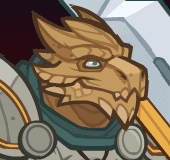ID: 34**Donaar (Seat 2)**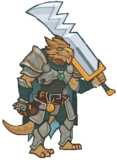
        
        
            **Champion Unlock**
            Donaar
        
    
    
        
            ID: 654**Mountain Donaar (Donaar)**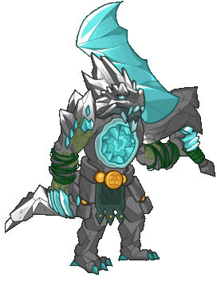
        
        
            **Skin**
            Mountain Donaar
        
    
    
        
            ID: 307**Clarkemoore the Goat**The greatest of all time, in his own mind.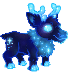
        
        
            **Familiar**
            Clarkemoore the Goat
        
    
    
        
            ID: 2497**Feat**???: 2497
        
        
            **Feat**
            ???: 2497
        
    
    
        
            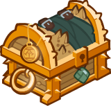ID: 74**Platinum Donaar Chest**Loot for: Donaar<code>"for_crusaders":[34]</code>
        
        
            **Chest**
            Platinum Donaar Chest
            x32 (Shinies x2)
        
    
    
        
            ID: 1723**Potion of the Gem Hunter**Increases the gem drops from bosses by 50%<code>increase_boss_gems_percent,50</code>
        
        
            **Buff**
            Potion of the Gem Hunter
            x1
        
    

ID: 674

### Primordial Earth Kalix Skin & Feat Pack - 1,680 Platinum  
Date of release: 11 Feb 2026

> Unlock Kalix along with his exclusive Primordial Earth Skin & Feat!

Contents:

    
        
            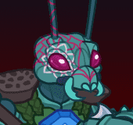ID: 158**Kalix (Seat 5)**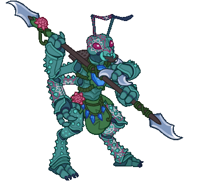
        
        
            **Champion Unlock**
            Kalix
        
    
    
        
            ID: 655**Primordial Earth Kalix (Kalix)**
        
        
            **Skin**
            Primordial Earth Kalix
        
    
    
        
            ID: 2453**True Kin**The clutch is all. The clutch IS all. The clutch is ALL.  Increases the effect of Kalix's Unorthodox Alliance ability by 80%. (Prestack)<code>buff_upgrade,80,16518,0</code>
        
        
            **Feat**
            True Kin
            Kalix
        
    
    
        
            ID: 20**Large Bounty Contract**Claim a bounty worth 8 hours of offline gold earnings and event tokens.<code>seconds_worth_of_gold,28800</code>
        
        
            **Buff**
            Large Bounty Contract
            x6
        
    
    
        
            ID: 34**Large Blacksmithing Contract**Contract a master blacksmith to improve a piece of equipment owned by one of your Champions.<code>level_up_loot,24</code>
        
        
            **Buff**
            Large Blacksmithing Contract
            x6
        
    
    
        
            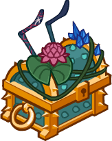ID: 649**Platinum Kalix Chest**Loot for: Kalix<code>"for_crusaders":[158]</code>
        
        
            **Chest**
            Platinum Kalix Chest
            x14 (Shinies x1)
        
    

ID: 675

### Ancient Magus Presto Skin & Feat Pack - 1,680 Platinum  
Date of release: 11 Feb 2026

> Unlock Presto along with his exclusive Ancient Magus Skin & Feat!

Contents:

    
        
            ID: 144**Presto (Seat 2)**
        
        
            **Champion Unlock**
            Presto
        
    
    
        
            ID: 656**Ancient Magus Presto (Presto)**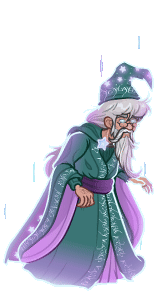
        
        
            **Skin**
            Ancient Magus Presto
        
    
    
        
            ID: 2454**Prodigal Leader**I'll never stop learning. That's what life's all about!  All Champions damage +50%.<code>global_dps_multiplier_mult,50</code>
        
        
            **Feat**
            Prodigal Leader
            Presto
        
    
    
        
            ID: 20**Large Bounty Contract**Claim a bounty worth 8 hours of offline gold earnings and event tokens.<code>seconds_worth_of_gold,28800</code>
        
        
            **Buff**
            Large Bounty Contract
            x6
        
    
    
        
            ID: 34**Large Blacksmithing Contract**Contract a master blacksmith to improve a piece of equipment owned by one of your Champions.<code>level_up_loot,24</code>
        
        
            **Buff**
            Large Blacksmithing Contract
            x6
        
    
    
        
            ID: 559**Platinum Presto Chest**Loot for: Presto<code>"for_crusaders":[144]</code>
        
        
            **Chest**
            Platinum Presto Chest
            x14 (Shinies x1)
        
    

ID: 676

### Primordial Air Birdsong Skin & Feat Pack - 1,680 Platinum  
Date of release: 18 Feb 2026

> Unlock Birdsong along with her exclusive Primordial Air Skin & Feat!

Contents:

    
        
            ID: 21**Birdsong (Seat 9)**
        
        
            **Champion Unlock**
            Birdsong
        
    
    
        
            ID: 657**Primordial Air Birdsong (Birdsong)**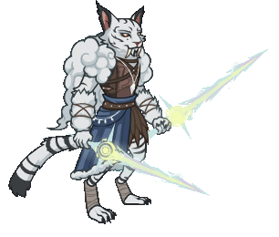
        
        
            **Skin**
            Primordial Air Birdsong
        
    
    
        
            ID: 2455**Multiversal Allies**A broadened perspective inspires the heart to greater heights.  Increases the damage of all Champions by 20% for each unique species in the formation, stacking additively.<code>effect_def,2193</code>
        
        
            **Feat**
            Multiversal Allies
            Birdsong
        
    
    
        
            ID: 20**Large Bounty Contract**Claim a bounty worth 8 hours of offline gold earnings and event tokens.<code>seconds_worth_of_gold,28800</code>
        
        
            **Buff**
            Large Bounty Contract
            x6
        
    
    
        
            ID: 34**Large Blacksmithing Contract**Contract a master blacksmith to improve a piece of equipment owned by one of your Champions.<code>level_up_loot,24</code>
        
        
            **Buff**
            Large Blacksmithing Contract
            x6
        
    
    
        
            ID: 19**Platinum Birdsong Chest**Loot for: Birdsong<code>"for_crusaders":[21]</code>
        
        
            **Chest**
            Platinum Birdsong Chest
            x14 (Shinies x1)
        
    

ID: 677

### Winter Hexblade K'thriss Skin & Feat Pack - 1,680 Platinum  
Date of release: 18 Feb 2026

> Unlock K'thriss along with their exclusive Winter Hexblade Skin & Feat!

Contents:

    
        
            ID: 38**K'thriss (Seat 1)**
        
        
            **Champion Unlock**
            K'thriss
        
    
    
        
            ID: 658**Winter Hexblade K'thriss (K'thriss)**
        
        
            **Skin**
            Winter Hexblade K'thriss
        
    
    
        
            ID: 2456**Holiday Bonus**We've all been working so hard, I just thought perhaps we all deserve a little treat.  Increases the base effect of K'thriss' Unseen Encouragement ability by 80%. (Prestack)<code>buff_upgrade,80,17324,0</code>
        
        
            **Feat**
            Holiday Bonus
            K'thriss
        
    
    
        
            ID: 20**Large Bounty Contract**Claim a bounty worth 8 hours of offline gold earnings and event tokens.<code>seconds_worth_of_gold,28800</code>
        
        
            **Buff**
            Large Bounty Contract
            x6
        
    
    
        
            ID: 34**Large Blacksmithing Contract**Contract a master blacksmith to improve a piece of equipment owned by one of your Champions.<code>level_up_loot,24</code>
        
        
            **Buff**
            Large Blacksmithing Contract
            x6
        
    
    
        
            ID: 86**Platinum K'thriss Chest**Loot for: K'thriss<code>"for_crusaders":[38]</code>
        
        
            **Chest**
            Platinum K'thriss Chest
            x14 (Shinies x1)
        
    

ID: 678

### Lord Brook the Marid Familiar Pack - 1,680 Platinum  
Date of release: 18 Feb 2026

> Collect your own Lord Brook the Marid familiar!

Contents:

    
        
            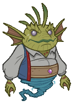ID: 308**Lord Brook the Marid**Beware wishes granted by this little watery lord.
        
        
            **Familiar**
            Lord Brook the Marid
        
    
    
        
            ID: 4**Huge Potion of Giant's Strength**A transparent potion in which floats the sliver of a giant's fingernail.<code>global_dps_multiplier_mult,900</code>
        
        
            **Buff**
            Huge Potion of Giant's Strength
            x4
        
    
    
        
            ID: 8**Huge Potion of Clairvoyance**Three eyeballs bob in this yellowish potion.<code>gold_multiplier_mult,400</code>
        
        
            **Buff**
            Huge Potion of Clairvoyance
            x4
        
    
    
        
            ID: 36**Potion of Polish**This shiny, silver liquid clings to the edge of the bottle in an unusual way.<code>shiny_loot,1</code>
        
        
            **Buff**
            Potion of Polish
            x1
        
    
    
        
            ID: 77**Huge Potion of Speed**This potion's yellow fluid is streaked with black and swirls on its own.<code>time_scale,2.75</code>
        
        
            **Buff**
            Huge Potion of Speed
            x4
        
    

ID: 679

### Undying Queen Lae'zel Skin & Feat Pack - 1,680 Platinum  
Date of release: 25 Feb 2026

> Unlock Lae'zel along with her exclusive Undying Queen Skin & Feat!

Contents:

    
        
            ID: 128**Lae'zel (Seat 2)**
        
        
            **Champion Unlock**
            Lae'zel
        
    
    
        
            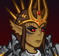ID: 659**Undying Queen Lae'zel (Lae'zel)**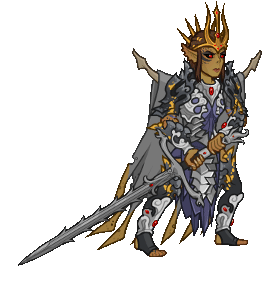
        
        
            **Skin**
            Undying Queen Lae'zel
        
    
    
        
            ID: 2457**Bane of Ghaik**They must ALL be destroyed, no matter the costs.  Increases the effect of Lae'zel's Aberration Hunter ability by 80%.<code>buff_upgrade,80,12116</code>
        
        
            **Feat**
            Bane of Ghaik
            Lae'zel
        
    
    
        
            ID: 20**Large Bounty Contract**Claim a bounty worth 8 hours of offline gold earnings and event tokens.<code>seconds_worth_of_gold,28800</code>
        
        
            **Buff**
            Large Bounty Contract
            x6
        
    
    
        
            ID: 34**Large Blacksmithing Contract**Contract a master blacksmith to improve a piece of equipment owned by one of your Champions.<code>level_up_loot,24</code>
        
        
            **Buff**
            Large Blacksmithing Contract
            x6
        
    
    
        
            ID: 458**Platinum Lae'zel Chest**Loot for: Lae'zel<code>"for_crusaders":[128]</code>
        
        
            **Chest**
            Platinum Lae'zel Chest
            x14 (Shinies x1)
        
    

ID: 680

### Heroic Hank Skin & Feat Pack - 1,680 Platinum  
Date of release: 25 Feb 2026

> Unlock Hank along with his exclusive Heroic Skin & Feat!

Contents:

    
        
            ID: 163**Hank (Seat 1)**
        
        
            **Champion Unlock**
            Hank
        
    
    
        
            ID: 660**Heroic Hank (Hank)**
        
        
            **Skin**
            Heroic Hank
        
    
    
        
            ID: 2458**TBD Hank Feat (Do not translate)**
        
        
            **Feat**
            TBD Hank Feat (Do not translate)
            Hank
        
    
    
        
            ID: 20**Large Bounty Contract**Claim a bounty worth 8 hours of offline gold earnings and event tokens.<code>seconds_worth_of_gold,28800</code>
        
        
            **Buff**
            Large Bounty Contract
            x6
        
    
    
        
            ID: 34**Large Blacksmithing Contract**Contract a master blacksmith to improve a piece of equipment owned by one of your Champions.<code>level_up_loot,24</code>
        
        
            **Buff**
            Large Blacksmithing Contract
            x6
        
    
    
        
            ID: 659**Platinum Hank Chest**Loot for: Hank<code>"for_crusaders":[163]</code>
        
        
            **Chest**
            Platinum Hank Chest
            x14 (Shinies x1)
        
    

ID: 681

### Splash the Water Elemental Familiar Pack - 1,680 Platinum  
Date of release: 25 Feb 2026

> Collect your own Splash the Water Elemental familiar!

Contents:

    
        
            ID: 309**Splash the Water Elemental**The consummate puddle jumper.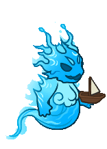
        
        
            **Familiar**
            Splash the Water Elemental
        
    
    
        
            ID: 4**Huge Potion of Giant's Strength**A transparent potion in which floats the sliver of a giant's fingernail.<code>global_dps_multiplier_mult,900</code>
        
        
            **Buff**
            Huge Potion of Giant's Strength
            x4
        
    
    
        
            ID: 8**Huge Potion of Clairvoyance**Three eyeballs bob in this yellowish potion.<code>gold_multiplier_mult,400</code>
        
        
            **Buff**
            Huge Potion of Clairvoyance
            x4
        
    
    
        
            ID: 36**Potion of Polish**This shiny, silver liquid clings to the edge of the bottle in an unusual way.<code>shiny_loot,1</code>
        
        
            **Buff**
            Potion of Polish
            x1
        
    
    
        
            ID: 77**Huge Potion of Speed**This potion's yellow fluid is streaked with black and swirls on its own.<code>time_scale,2.75</code>
        
        
            **Buff**
            Huge Potion of Speed
            x4
        
    

ID: 682

### Raistlin, Master of Past and Present Theme Pack - 3,830 Platinum  
Date of release: 04 Mar 2026

> Unlock Raistlin along with an exclusive Master of Past and Present Skin & Familiar!

Contents:

    
        
            ID: 173**Raistlin**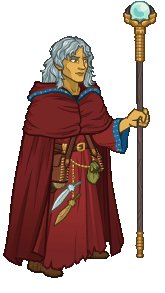
        
        
            **Champion Unlock**
            Raistlin
        
    
    
        
            ID: 662**Raistlin, Master of Past and Present (Raistlin)**
        
        
            **Skin**
            Raistlin, Master of Past and Present
        
    
    
        
            ID: 310**Caramon the Rabbit**Dear, good, steadfast, boring Caramon.
        
        
            **Familiar**
            Caramon the Rabbit
        
    
    
        
            ID: 1**Selflessness**Aye, a selfless dwarf I am.  All Champions damage +10%.<code>global_dps_multiplier_mult,10</code>
        
        
            **Feat**
            Selflessness
            Bruenor
        
    
    
        
            ID: 790**Platinum Raistlin Chest**Loot for: Raistlin<code>"for_crusaders":[173]</code>
        
        
            **Chest**
            Platinum Raistlin Chest
            x32 (Shinies x2)
        
    
    
        
            ID: 1723**Potion of the Gem Hunter**Increases the gem drops from bosses by 50%<code>increase_boss_gems_percent,50</code>
        
        
            **Buff**
            Potion of the Gem Hunter
            x1
        
    

ID: 683

### Dragon Orb of Istar Familiar Pack - 840 Platinum  
Date of release: 04 Mar 2026

> Collect your own Dragon Orb of Istar familiar!

Contents:

    
        
            ID: 311**Dragon Orb of Istar**
        
        
            **Familiar**
            Dragon Orb of Istar
        
    
    
        
            ID: 4**Huge Potion of Giant's Strength**A transparent potion in which floats the sliver of a giant's fingernail.<code>global_dps_multiplier_mult,900</code>
        
        
            **Buff**
            Huge Potion of Giant's Strength
            x2
        
    
    
        
            ID: 8**Huge Potion of Clairvoyance**Three eyeballs bob in this yellowish potion.<code>gold_multiplier_mult,400</code>
        
        
            **Buff**
            Huge Potion of Clairvoyance
            x2
        
    
    
        
            ID: 77**Huge Potion of Speed**This potion's yellow fluid is streaked with black and swirls on its own.<code>time_scale,2.75</code>
        
        
            **Buff**
            Huge Potion of Speed
            x2
        
    

ID: 684

### Order of the Red Robes Gale Skin & Feat Pack - 1,680 Platinum  
Date of release: 04 Mar 2026

> Unlock Gale along with his exclusive Order of the Red Robes Skin & Feat!

Contents:

    
        
            ID: 147**Gale (Seat 1)**
        
        
            **Champion Unlock**
            Gale
        
    
    
        
            ID: 663**Order of the Red Robes Gale (Gale)**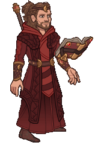
        
        
            **Skin**
            Order of the Red Robes Gale
        
    
    
        
            ID: 2475**TBD Gale Feat**
        
        
            **Feat**
            TBD Gale Feat
            Gale
        
    
    
        
            ID: 20**Large Bounty Contract**Claim a bounty worth 8 hours of offline gold earnings and event tokens.<code>seconds_worth_of_gold,28800</code>
        
        
            **Buff**
            Large Bounty Contract
            x6
        
    
    
        
            ID: 34**Large Blacksmithing Contract**Contract a master blacksmith to improve a piece of equipment owned by one of your Champions.<code>level_up_loot,24</code>
        
        
            **Buff**
            Large Blacksmithing Contract
            x6
        
    
    
        
            ID: 565**Platinum Gale Chest**Loot for: Gale<code>"for_crusaders":[147]</code>
        
        
            **Chest**
            Platinum Gale Chest
            x14 (Shinies x1)
        
    

ID: 685

### Bard of the Dragon Queen Deekin Theme Pack - 3,830 Platinum  
Date of release: 11 Mar 2026

> Unlock Deekin along with an exclusive Bard of the Dragon Queen Skin & Familiar!

Contents:

    
        
            ID: 28**Deekin (Seat 1)**
        
        
            **Champion Unlock**
            Deekin
        
    
    
        
            ID: 664**Bard of the Dragon Queen Deekin (Deekin)**
        
        
            **Skin**
            Bard of the Dragon Queen Deekin
        
    
    
        
            ID: 312**Drone of Dooooom**Bards can't share their stories all alone…
        
        
            **Familiar**
            Drone of Dooooom
        
    
    
        
            ID: 1**Selflessness**Aye, a selfless dwarf I am.  All Champions damage +10%.<code>global_dps_multiplier_mult,10</code>
        
        
            **Feat**
            Selflessness
            Bruenor
        
    
    
        
            ID: 54**Platinum Deekin Chest**Loot for: Deekin<code>"for_crusaders":[28]</code>
        
        
            **Chest**
            Platinum Deekin Chest
            x32 (Shinies x2)
        
    
    
        
            ID: 1723**Potion of the Gem Hunter**Increases the gem drops from bosses by 50%<code>increase_boss_gems_percent,50</code>
        
        
            **Buff**
            Potion of the Gem Hunter
            x1
        
    

ID: 686

### Knight of Solamnia Zorbu Skin & Feat Pack - 1,680 Platinum  
Date of release: 11 Mar 2026

> Unlock Zorbu along with his exclusive Knight of Solamnia Skin & Feat!

Contents:

    
        
            ID: 22**Zorbu (Seat 12)**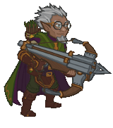
        
        
            **Champion Unlock**
            Zorbu
        
    
    
        
            ID: 665**Knight of Solamnia Zorbu (Zorbu)**
        
        
            **Skin**
            Knight of Solamnia Zorbu
        
    
    
        
            ID: 2476**TBD Zorbu Feat**
        
        
            **Feat**
            TBD Zorbu Feat
            Zorbu
        
    
    
        
            ID: 20**Large Bounty Contract**Claim a bounty worth 8 hours of offline gold earnings and event tokens.<code>seconds_worth_of_gold,28800</code>
        
        
            **Buff**
            Large Bounty Contract
            x6
        
    
    
        
            ID: 34**Large Blacksmithing Contract**Contract a master blacksmith to improve a piece of equipment owned by one of your Champions.<code>level_up_loot,24</code>
        
        
            **Buff**
            Large Blacksmithing Contract
            x6
        
    
    
        
            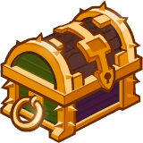ID: 22**Platinum Zorbu Chest**Loot for: Zorbu<code>"for_crusaders":[22]</code>
        
        
            **Chest**
            Platinum Zorbu Chest
            x14 (Shinies x1)
        
    

ID: 687

### Heroic Sheila Skin & Feat Pack - 1,680 Platinum  
Date of release: 11 Mar 2026

> Unlock Sheila along with her exclusive Heroic Skin & Feat!

Contents:

    
        
            ID: 160**Sheila (Seat 7)**
        
        
            **Champion Unlock**
            Sheila
        
    
    
        
            ID: 666**Heroic Sheila (Sheila)**
        
        
            **Skin**
            Heroic Sheila
        
    
    
        
            ID: 2477**TBD Sheila Feat**
        
        
            **Feat**
            TBD Sheila Feat
            Sheila
        
    
    
        
            ID: 20**Large Bounty Contract**Claim a bounty worth 8 hours of offline gold earnings and event tokens.<code>seconds_worth_of_gold,28800</code>
        
        
            **Buff**
            Large Bounty Contract
            x6
        
    
    
        
            ID: 34**Large Blacksmithing Contract**Contract a master blacksmith to improve a piece of equipment owned by one of your Champions.<code>level_up_loot,24</code>
        
        
            **Buff**
            Large Blacksmithing Contract
            x6
        
    
    
        
            ID: 653**Platinum Sheila Chests**Loot for: Sheila<code>"for_crusaders":[160]</code>
        
        
            **Chest**
            Platinum Sheila Chests
            x14 (Shinies x1)
        
    

ID: 688

### Dragon Chronicler Volo Skin & Feat Pack - 1,680 Platinum  
Date of release: 18 Mar 2026

> Unlock Volo along with his exclusive Dragon Chronicler Skin & Feat!

Contents:

    
        
            ID: 159**Volo (Seat 9)**
        
        
            **Champion Unlock**
            Volo
        
    
    
        
            ID: 667**Dragon Chronicler Volo (Volo)**
        
        
            **Skin**
            Dragon Chronicler Volo
        
    
    
        
            ID: 2478**TBD Volo Feat**
        
        
            **Feat**
            TBD Volo Feat
            Volo
        
    
    
        
            ID: 20**Large Bounty Contract**Claim a bounty worth 8 hours of offline gold earnings and event tokens.<code>seconds_worth_of_gold,28800</code>
        
        
            **Buff**
            Large Bounty Contract
            x6
        
    
    
        
            ID: 34**Large Blacksmithing Contract**Contract a master blacksmith to improve a piece of equipment owned by one of your Champions.<code>level_up_loot,24</code>
        
        
            **Buff**
            Large Blacksmithing Contract
            x6
        
    
    
        
            ID: 651**Platinum Volo Chest**Loot for: Volo<code>"for_crusaders":[159]</code>
        
        
            **Chest**
            Platinum Volo Chest
            x14 (Shinies x1)
        
    

ID: 689

### Desmondlance Desmond Skin & Feat Pack - 1,680 Platinum  
Date of release: 18 Mar 2026

> Unlock Desmond along with his exclusive Desmondlance Skin & Feat!

Contents:

    
        
            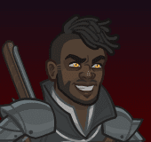ID: 96**Desmond (Seat 4)**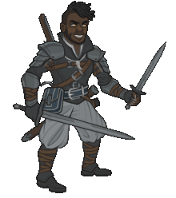
        
        
            **Champion Unlock**
            Desmond
        
    
    
        
            ID: 668**Desmondlance Desmond (Desmond)**
        
        
            **Skin**
            Desmondlance Desmond
        
    
    
        
            ID: 2479**TBD Desmond Feat**
        
        
            **Feat**
            TBD Desmond Feat
            Desmond
        
    
    
        
            ID: 20**Large Bounty Contract**Claim a bounty worth 8 hours of offline gold earnings and event tokens.<code>seconds_worth_of_gold,28800</code>
        
        
            **Buff**
            Large Bounty Contract
            x6
        
    
    
        
            ID: 34**Large Blacksmithing Contract**Contract a master blacksmith to improve a piece of equipment owned by one of your Champions.<code>level_up_loot,24</code>
        
        
            **Buff**
            Large Blacksmithing Contract
            x6
        
    
    
        
            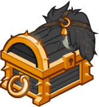ID: 349**Platinum Desmond Chest**Loot for: Desmond<code>"for_crusaders":[96]</code>
        
        
            **Chest**
            Platinum Desmond Chest
            x14 (Shinies x1)
        
    

ID: 690

### Mage of the White Robes Orkira Skin & Feat Pack - 1,680 Platinum  
Date of release: 18 Mar 2026

> Unlock Orkira along with her exclusive Mage of the White Robes Skin & Feat!

Contents:

    
        
            ID: 78**Orkira (Seat 1)**
        
        
            **Champion Unlock**
            Orkira
        
    
    
        
            ID: 669**Mage of the White Robes Orkira (Orkira)**
        
        
            **Skin**
            Mage of the White Robes Orkira
        
    
    
        
            ID: 2480**TBD Orkira Feat**
        
        
            **Feat**
            TBD Orkira Feat
            Orkira
        
    
    
        
            ID: 20**Large Bounty Contract**Claim a bounty worth 8 hours of offline gold earnings and event tokens.<code>seconds_worth_of_gold,28800</code>
        
        
            **Buff**
            Large Bounty Contract
            x6
        
    
    
        
            ID: 34**Large Blacksmithing Contract**Contract a master blacksmith to improve a piece of equipment owned by one of your Champions.<code>level_up_loot,24</code>
        
        
            **Buff**
            Large Blacksmithing Contract
            x6
        
    
    
        
            ID: 263**Platinum Orkira Chest**Loot for: Orkira<code>"for_crusaders":[78]</code>
        
        
            **Chest**
            Platinum Orkira Chest
            x14 (Shinies x1)
        
    

ID: 691

### Dragonlance Karlach Skin & Feat Pack - 1,680 Platinum  
Date of release: 25 Mar 2026

> Unlock Karlach along with her exclusive Dragonlance Skin & Feat!

Contents:

    
        
            ID: 143**Karlach (Seat 4)**
        
        
            **Champion Unlock**
            Karlach
        
    
    
        
            ID: 670**Dragonlance Karlach (Karlach)**
        
        
            **Skin**
            Dragonlance Karlach
        
    
    
        
            ID: 2481**TBD Karlach Feat**
        
        
            **Feat**
            TBD Karlach Feat
            Karlach
        
    
    
        
            ID: 20**Large Bounty Contract**Claim a bounty worth 8 hours of offline gold earnings and event tokens.<code>seconds_worth_of_gold,28800</code>
        
        
            **Buff**
            Large Bounty Contract
            x6
        
    
    
        
            ID: 34**Large Blacksmithing Contract**Contract a master blacksmith to improve a piece of equipment owned by one of your Champions.<code>level_up_loot,24</code>
        
        
            **Buff**
            Large Blacksmithing Contract
            x6
        
    
    
        
            ID: 557**Platinum  Karlach Chest**Loot for: Karlach<code>"for_crusaders":[143]</code>
        
        
            **Chest**
            Platinum  Karlach Chest
            x14 (Shinies x1)
        
    

ID: 692

### Seeker the Star Angler Familiar Pack - 2,380 Platinum  
Date of release: 25 Mar 2026

> Collect your own Seeker the Star Angler familiar!

Contents:

    
        
            ID: 314**Seeker the Star Angler**Just watch out when her teeth grow in!
        
        
            **Familiar**
            Seeker the Star Angler
        
    
    
        
            ID: 4**Huge Potion of Giant's Strength**A transparent potion in which floats the sliver of a giant's fingernail.<code>global_dps_multiplier_mult,900</code>
        
        
            **Buff**
            Huge Potion of Giant's Strength
            x6
        
    
    
        
            ID: 8**Huge Potion of Clairvoyance**Three eyeballs bob in this yellowish potion.<code>gold_multiplier_mult,400</code>
        
        
            **Buff**
            Huge Potion of Clairvoyance
            x6
        
    
    
        
            ID: 36**Potion of Polish**This shiny, silver liquid clings to the edge of the bottle in an unusual way.<code>shiny_loot,1</code>
        
        
            **Buff**
            Potion of Polish
            x1
        
    
    
        
            ID: 40**Huge Potion of Fire Breath**The orange liquid in this vial flickers and smoke fills the top of the container.<code>click_damage_seconds_global_dps,600</code>
        
        
            **Buff**
            Huge Potion of Fire Breath
            x6
        
    
    
        
            ID: 77**Huge Potion of Speed**This potion's yellow fluid is streaked with black and swirls on its own.<code>time_scale,2.75</code>
        
        
            **Buff**
            Huge Potion of Speed
            x6
        
    
    
        
            ID: 1721**Potion of the Gold Hunter**Increase Gold Find by 100%<code>gold_multiplier_mult,100</code>
        
        
            **Buff**
            Potion of the Gold Hunter
            x1
        
    
    
        
            **Modron Component Pieces**
        
        
            **Modron Component Pieces**
            x2,000
        
    

[Back to Top](#top)

*Last Modified: {{ site.time }}*