[Back to Main](index.md)

# Premium Packs and DLC

Upcoming real-money shop items.

ID: 562

### Mind Flayer Minthara Skin & Feat Pack - 1,680 Platinum  
Date of release: 30 Apr 2025

> Unlock Minthara along with her exclusive Mind Flayer Skin & Feat!

Contents:

    
        
            ID: 154**Minthara (Seat 3)**
        
        
            **Champion Unlock**
            Minthara
        
    
    
        
            ID: 547**Mind Flayer Minthara (Minthara)**
        
        
            **Skin**
            Mind Flayer Minthara
        
    
    
        
            ID: 1967**Unrelenting Strife**If somebody causes me sorrow, I remove their ability to do so again.<code>minthara_increase_max_stacks,2</code>
        
        
            **Feat**
            Unrelenting Strife
            Minthara (+2 max Soul Branding stacks)
        
    
    
        
            ID: 20**Large Bounty Contract**Claim a bounty worth 8 hours of offline gold earnings and event tokens.<code>seconds_worth_of_gold,28800</code>
        
        
            **Buff**
            Large Bounty Contract
            x6
        
    
    
        
            ID: 34**Large Blacksmithing Contract**Contract a master blacksmith to improve a piece of equipment owned by one of your Champions.<code>level_up_loot,24</code>
        
        
            **Buff**
            Large Blacksmithing Contract
            x6
        
    
    
        
            ID: 579**Platinum Minthara Chest**Loot for: Minthara<code>"for_crusaders":[154]</code>
        
        
            **Chest**
            Platinum Minthara Chest
            x14 (Shinies x1)
        
    

ID: 563

### Pepper the Baby Black Dragon Familiar Pack - 1,680 Platinum  
Date of release: 30 Apr 2025

> Collect your own Pepper the Baby Black Dragon Familiar!

Contents:

    
        
            ID: 257**Pepper the Baby Black Dragon**She hunts the others in her clutch, watch her pounce!
        
        
            **Familiar**
            Pepper the Baby Black Dragon
        
    
    
        
            ID: 4**Huge Potion of Giant's Strength**A transparent potion in which floats the sliver of a giant's fingernail.<code>global_dps_multiplier_mult,900</code>
        
        
            **Buff**
            Huge Potion of Giant's Strength
            x4
        
    
    
        
            ID: 8**Huge Potion of Clairvoyance**Three eyeballs bob in this yellowish potion.<code>gold_multiplier_mult,400</code>
        
        
            **Buff**
            Huge Potion of Clairvoyance
            x4
        
    
    
        
            ID: 36**Potion of Polish**This shiny, silver liquid clings to the edge of the bottle in an unusual way.<code>shiny_loot,1</code>
        
        
            **Buff**
            Potion of Polish
            x1
        
    
    
        
            ID: 77**Huge Potion of Speed**This potion's yellow fluid is streaked with black and swirls on its own.<code>time_scale,2.75</code>
        
        
            **Buff**
            Huge Potion of Speed
            x4
        
    

ID: 564

### Mind Flayer Halsin Skin & Feat Pack - 1,680 Platinum  
Date of release: 30 Apr 2025

> Unlock Halsin along with his exclusive Mind Flayer Skin & Feat!

Contents:

    
        
            ID: 156**Halsin (Seat 3)**
        
        
            **Champion Unlock**
            Halsin
        
    
    
        
            ID: 548**Mind Flayer Halsin (Halsin)**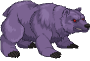
        
        
            **Skin**
            Mind Flayer Halsin
        
    
    
        
            ID: 2135**Verdant Vow**I give my all to serve the Oak Father. No sacrifice is too great.<code>buff_upgrade,80,15962,0</code>
        
        
            **Feat**
            Verdant Vow
            Halsin (80% Archdruid of Emerald Grove (Prestack))
        
    
    
        
            ID: 20**Large Bounty Contract**Claim a bounty worth 8 hours of offline gold earnings and event tokens.<code>seconds_worth_of_gold,28800</code>
        
        
            **Buff**
            Large Bounty Contract
            x6
        
    
    
        
            ID: 34**Large Blacksmithing Contract**Contract a master blacksmith to improve a piece of equipment owned by one of your Champions.<code>level_up_loot,24</code>
        
        
            **Buff**
            Large Blacksmithing Contract
            x6
        
    
    
        
            ID: 645**Platinum Halsin Chest**Loot for: Halsin<code>"for_crusaders":[156]</code>
        
        
            **Chest**
            Platinum Halsin Chest
            x14 (Shinies x1)
        
    

ID: 565

### Tempest Noble Vlithryn Theme Pack - 3,830 Platinum  
Date of release: 07 May 2025

> Unlock Vlithryn along with an exclusive Tempest Noble Skin & Familiar!

Contents:

    
        
            ID: 162**Vlithryn**
        
        
            **Champion Unlock**
            Vlithryn
        
    
    
        
            ID: 549**Tempest Noble Vlithryn (Vlithryn)**
        
        
            **Skin**
            Tempest Noble Vlithryn
        
    
    
        
            ID: 258**Mango the Hippocampus**Time to look my gift horse in the mouth! ~Vlithryn
        
        
            **Familiar**
            Mango the Hippocampus
        
    
    
        
            ID: 2167**Feat**???: 2167
        
        
            **Feat**
            ???: 2167
        
    
    
        
            ID: 657**Platinum Vlithryn Chest**Loot for: Vlithryn<code>"for_crusaders":[162]</code>
        
        
            **Chest**
            Platinum Vlithryn Chest
            x32 (Shinies x2)
        
    
    
        
            ID: 1723**Potion of the Gem Hunter**Increases the gem drops from bosses by 50%<code>increase_boss_gems_percent,50</code>
        
        
            **Buff**
            Potion of the Gem Hunter
            x1
        
    

ID: 566

### Tairnadal Jaheira Skin & Feat Pack - 1,680 Platinum  
Date of release: 07 May 2025

> Unlock Jaheira along with her exclusive Tairnadal Skin & Feat!

Contents:

    
        
            ID: 61**Jaheira (Seat 9)**
        
        
            **Champion Unlock**
            Jaheira
        
    
    
        
            ID: 550**Tairnadal Jaheira (Jaheira)**
        
        
            **Skin**
            Tairnadal Jaheira
        
    
    
        
            ID: 2136**Sylvan Calling**I'm getting in touch with my roots.<code>buff_upgrades,80,9714,9715,9716,9717</code>
        
        
            **Feat**
            Sylvan Calling
            Jaheira (80% All First Specialisations)
        
    
    
        
            ID: 20**Large Bounty Contract**Claim a bounty worth 8 hours of offline gold earnings and event tokens.<code>seconds_worth_of_gold,28800</code>
        
        
            **Buff**
            Large Bounty Contract
            x6
        
    
    
        
            ID: 34**Large Blacksmithing Contract**Contract a master blacksmith to improve a piece of equipment owned by one of your Champions.<code>level_up_loot,24</code>
        
        
            **Buff**
            Large Blacksmithing Contract
            x6
        
    
    
        
            ID: 181**Platinum Jaheira Chest**Loot for: Jaheira<code>"for_crusaders":[61]</code>
        
        
            **Chest**
            Platinum Jaheira Chest
            x14 (Shinies x1)
        
    

ID: 567

### Brigadier Evandra Skin & Feat Pack - 1,680 Platinum  
Date of release: 07 May 2025

> Unlock Evandra along with her exclusive Brigadier Skin & Feat!

Contents:

    
        
            ID: 124**Evandra (Seat 5)**
        
        
            **Champion Unlock**
            Evandra
        
    
    
        
            ID: 551**Brigadier Evandra (Evandra)**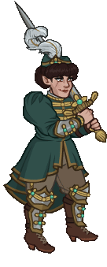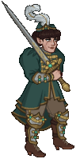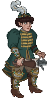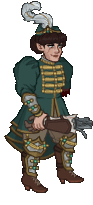
        
        
            **Skin**
            Brigadier Evandra
        
    
    
        
            ID: 2137**Regimented Fury**Classy, sassy, and about to kick your --<code>buff_upgrades,80,11299,11300,11301</code>
        
        
            **Feat**
            Regimented Fury
            Evandra (80% All Specialisations)
        
    
    
        
            ID: 20**Large Bounty Contract**Claim a bounty worth 8 hours of offline gold earnings and event tokens.<code>seconds_worth_of_gold,28800</code>
        
        
            **Buff**
            Large Bounty Contract
            x6
        
    
    
        
            ID: 34**Large Blacksmithing Contract**Contract a master blacksmith to improve a piece of equipment owned by one of your Champions.<code>level_up_loot,24</code>
        
        
            **Buff**
            Large Blacksmithing Contract
            x6
        
    
    
        
            ID: 450**Platinum Evandra Chest**Loot for: Evandra<code>"for_crusaders":[124]</code>
        
        
            **Chest**
            Platinum Evandra Chest
            x14 (Shinies x1)
        
    

ID: 571

### Lamplighter Nixie Skin & Feat Pack - 1,680 Platinum  
Date of release: 07 May 2025

> Unlock Nixie along with her exclusive Lamplighter Skin & Feat!

Contents:

    
        
            ID: 123**Nixie (Seat 1)**
        
        
            **Champion Unlock**
            Nixie
        
    
    
        
            ID: 554**Lamplighter Nixie (Nixie)**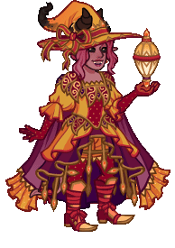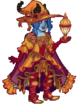
        
        
            **Skin**
            Lamplighter Nixie
        
    
    
        
            ID: 2139**Burning Beauty**Can't spell charm without harm!<code>buff_upgrades,80,10890,10891,10892</code>
        
        
            **Feat**
            Burning Beauty
            Nixie (80% All Specialisations)
        
    
    
        
            ID: 20**Large Bounty Contract**Claim a bounty worth 8 hours of offline gold earnings and event tokens.<code>seconds_worth_of_gold,28800</code>
        
        
            **Buff**
            Large Bounty Contract
            x6
        
    
    
        
            ID: 34**Large Blacksmithing Contract**Contract a master blacksmith to improve a piece of equipment owned by one of your Champions.<code>level_up_loot,24</code>
        
        
            **Buff**
            Large Blacksmithing Contract
            x6
        
    
    
        
            ID: 448**Platinum Nixie Chest**Loot for: Nixie<code>"for_crusaders":[123]</code>
        
        
            **Chest**
            Platinum Nixie Chest
            x14 (Shinies x1)
        
    

ID: 572

### Clawfoot the Dinosaur Familiar Pack - 1,680 Platinum  
Date of release: 07 May 2025

> Collect your own Clawfoot the Dinosaur Familiar!

Contents:

    
        
            ID: 261**Clawfoot the Dinosaur**Beware its deadly cuddles.
        
        
            **Familiar**
            Clawfoot the Dinosaur
        
    
    
        
            ID: 4**Huge Potion of Giant's Strength**A transparent potion in which floats the sliver of a giant's fingernail.<code>global_dps_multiplier_mult,900</code>
        
        
            **Buff**
            Huge Potion of Giant's Strength
            x4
        
    
    
        
            ID: 8**Huge Potion of Clairvoyance**Three eyeballs bob in this yellowish potion.<code>gold_multiplier_mult,400</code>
        
        
            **Buff**
            Huge Potion of Clairvoyance
            x4
        
    
    
        
            ID: 36**Potion of Polish**This shiny, silver liquid clings to the edge of the bottle in an unusual way.<code>shiny_loot,1</code>
        
        
            **Buff**
            Potion of Polish
            x1
        
    
    
        
            ID: 77**Huge Potion of Speed**This potion's yellow fluid is streaked with black and swirls on its own.<code>time_scale,2.75</code>
        
        
            **Buff**
            Huge Potion of Speed
            x4
        
    

ID: 568

### Nomad Yorven Theme Pack - 3,830 Platinum  
Date of release: 14 May 2025

> Unlock Yorven along with an exclusive Nomad Skin & Familiar!

Contents:

    
        
            ID: 92**Yorven (Seat 10)**
        
        
            **Champion Unlock**
            Yorven
        
    
    
        
            ID: 552**Nomad Yorven (Yorven)**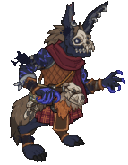
        
        
            **Skin**
            Nomad Yorven
        
    
    
        
            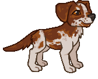ID: 259**Chase the Spaniel**Your new best friend who will do anything for table scraps.
        
        
            **Familiar**
            Chase the Spaniel
        
    
    
        
            ID: 2019**Feat**???: 2019
        
        
            **Feat**
            ???: 2019
        
    
    
        
            ID: 341**Platinum Yorven Chest**Loot for: Yorven<code>"for_crusaders":[92]</code>
        
        
            **Chest**
            Platinum Yorven Chest
            x32 (Shinies x2)
        
    
    
        
            ID: 1723**Potion of the Gem Hunter**Increases the gem drops from bosses by 50%<code>increase_boss_gems_percent,50</code>
        
        
            **Buff**
            Potion of the Gem Hunter
            x1
        
    

ID: 569

### Spark the Living Lightning Bolt Familiar Pack - 2,380 Platinum  
Date of release: 14 May 2025

> Collect your own Spark the Living Lightning Bolt Familiar!

Contents:

    
        
            ID: 260**Spark the Living Lightning Bolt**Hissszzzap!
        
        
            **Familiar**
            Spark the Living Lightning Bolt
        
    
    
        
            ID: 4**Huge Potion of Giant's Strength**A transparent potion in which floats the sliver of a giant's fingernail.<code>global_dps_multiplier_mult,900</code>
        
        
            **Buff**
            Huge Potion of Giant's Strength
            x6
        
    
    
        
            ID: 8**Huge Potion of Clairvoyance**Three eyeballs bob in this yellowish potion.<code>gold_multiplier_mult,400</code>
        
        
            **Buff**
            Huge Potion of Clairvoyance
            x6
        
    
    
        
            ID: 36**Potion of Polish**This shiny, silver liquid clings to the edge of the bottle in an unusual way.<code>shiny_loot,1</code>
        
        
            **Buff**
            Potion of Polish
            x1
        
    
    
        
            ID: 40**Huge Potion of Fire Breath**The orange liquid in this vial flickers and smoke fills the top of the container.<code>click_damage_seconds_global_dps,600</code>
        
        
            **Buff**
            Huge Potion of Fire Breath
            x6
        
    
    
        
            ID: 77**Huge Potion of Speed**This potion's yellow fluid is streaked with black and swirls on its own.<code>time_scale,2.75</code>
        
        
            **Buff**
            Huge Potion of Speed
            x6
        
    
    
        
            ID: 1721**Potion of the Gold Hunter**Increase Gold Find by 100%<code>gold_multiplier_mult,100</code>
        
        
            **Buff**
            Potion of the Gold Hunter
            x1
        
    
    
        
            **Modron Component Pieces**
        
        
            **Modron Component Pieces**
            x2,000
        
    

ID: 570

### Valaes Tairn Melf Skin & Feat Pack - 1,680 Platinum  
Date of release: 14 May 2025

> Unlock Melf along with his exclusive Valaes Tairn Skin & Feat!

Contents:

    
        
            ID: 59**Melf (Seat 12)**
        
        
            **Champion Unlock**
            Melf
        
    
    
        
            ID: 553**Valaes Tairn Melf (Melf)**
        
        
            **Skin**
            Valaes Tairn Melf
        
    
    
        
            ID: 2138**Prodigal Leader**Rally to me, friends. We will survive this, and glory shall be ours.<code>global_dps_multiplier_mult,50</code>
        
        
            **Feat**
            Prodigal Leader
            Melf (50% All Champion Damage)
        
    
    
        
            ID: 20**Large Bounty Contract**Claim a bounty worth 8 hours of offline gold earnings and event tokens.<code>seconds_worth_of_gold,28800</code>
        
        
            **Buff**
            Large Bounty Contract
            x6
        
    
    
        
            ID: 34**Large Blacksmithing Contract**Contract a master blacksmith to improve a piece of equipment owned by one of your Champions.<code>level_up_loot,24</code>
        
        
            **Buff**
            Large Blacksmithing Contract
            x6
        
    
    
        
            ID: 177**Platinum Melf Chest**Loot for: Melf<code>"for_crusaders":[59]</code>
        
        
            **Chest**
            Platinum Melf Chest
            x14 (Shinies x1)
        
    

ID: 573

### Warforged Evelyn Skin & Feat Pack - 1,680 Platinum  
Date of release: 14 May 2025

> Unlock Evelyn along with her exclusive Warforged Skin & Feat!

Contents:

    
        
            ID: 26**Evelyn (Seat 6)**
        
        
            **Champion Unlock**
            Evelyn
        
    
    
        
            ID: 555**Warforged Evelyn (Evelyn)**
        
        
            **Skin**
            Warforged Evelyn
        
    
    
        
            ID: 1472**Under Pressure**Uh oh -- more enemies! Everyone get behind me!<code>buff_upgrade,80,12207</code>
        
        
            **Feat**
            Under Pressure
            Evelyn (80% Steadfast Might)
        
    
    
        
            ID: 20**Large Bounty Contract**Claim a bounty worth 8 hours of offline gold earnings and event tokens.<code>seconds_worth_of_gold,28800</code>
        
        
            **Buff**
            Large Bounty Contract
            x6
        
    
    
        
            ID: 34**Large Blacksmithing Contract**Contract a master blacksmith to improve a piece of equipment owned by one of your Champions.<code>level_up_loot,24</code>
        
        
            **Buff**
            Large Blacksmithing Contract
            x6
        
    
    
        
            ID: 41**Platinum Evelyn Chest**Loot for: Evelyn<code>"for_crusaders":[26]</code>
        
        
            **Chest**
            Platinum Evelyn Chest
            x14 (Shinies x1)
        
    

ID: 574

### Prodigal Son Wyll Skin & Feat Pack - 1,680 Platinum  
Date of release: 28 May 2025

> Unlock Wyll along with his exclusive Prodigal Son Skin & Feat!

Contents:

    
        
            ID: 142**Wyll (Seat 12)**
        
        
            **Champion Unlock**
            Wyll
        
    
    
        
            ID: 556**Prodigal Son Wyll (Wyll)**
        
        
            **Skin**
            Prodigal Son Wyll
        
    
    
        
            ID: 2141**Duke's Pride**He is our shield, as I am his blade. Together, we protect the people of Baldur's Gate.<code>buff_upgrade,80,13429</code>
        
        
            **Feat**
            Duke's Pride
            Wyll (80% Folk Hero (Prestack))
        
    
    
        
            ID: 20**Large Bounty Contract**Claim a bounty worth 8 hours of offline gold earnings and event tokens.<code>seconds_worth_of_gold,28800</code>
        
        
            **Buff**
            Large Bounty Contract
            x6
        
    
    
        
            ID: 34**Large Blacksmithing Contract**Contract a master blacksmith to improve a piece of equipment owned by one of your Champions.<code>level_up_loot,24</code>
        
        
            **Buff**
            Large Blacksmithing Contract
            x6
        
    
    
        
            ID: 555**Platinum Wyll Chest**Loot for: Wyll<code>"for_crusaders":[142]</code>
        
        
            **Chest**
            Platinum Wyll Chest
            x14 (Shinies x1)
        
    

ID: 575

### Virtue the Valenar Foal Familiar Pack - 840 Platinum  
Date of release: 28 May 2025

> Collect your own Virtue the Valenar Foal Familiar!

Contents:

    
        
            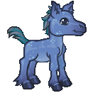ID: 262**Virtue the Valenar Foal**To be its chosen companion is a high honor.
        
        
            **Familiar**
            Virtue the Valenar Foal
        
    
    
        
            ID: 4**Huge Potion of Giant's Strength**A transparent potion in which floats the sliver of a giant's fingernail.<code>global_dps_multiplier_mult,900</code>
        
        
            **Buff**
            Huge Potion of Giant's Strength
            x2
        
    
    
        
            ID: 8**Huge Potion of Clairvoyance**Three eyeballs bob in this yellowish potion.<code>gold_multiplier_mult,400</code>
        
        
            **Buff**
            Huge Potion of Clairvoyance
            x2
        
    
    
        
            ID: 77**Huge Potion of Speed**This potion's yellow fluid is streaked with black and swirls on its own.<code>time_scale,2.75</code>
        
        
            **Buff**
            Huge Potion of Speed
            x2
        
    

ID: 576

### Dracolich Duke Ravengard Skin & Feat Pack - 1,680 Platinum  
Date of release: 04 Jun 2025

> Unlock Duke Ravengard along with his exclusive Dracolich Skin & Feat!

Contents:

    
        
            ID: 149**Ravengard (Seat 8)**
        
        
            **Champion Unlock**
            Ravengard
        
    
    
        
            ID: 559**Dracolich Duke Ravengard (Ravengard)**
        
        
            **Skin**
            Dracolich Duke Ravengard
        
    
    
        
            ID: 1823**Morale Boost**This is what our soldiers needed - hope.<code>buff_upgrade_effect_stacks_max_add,20,15030</code>
        
        
            **Feat**
            Morale Boost
            Ravengard (+20 Max Stacks to Critical Teamwork)
        
    
    
        
            ID: 20**Large Bounty Contract**Claim a bounty worth 8 hours of offline gold earnings and event tokens.<code>seconds_worth_of_gold,28800</code>
        
        
            **Buff**
            Large Bounty Contract
            x6
        
    
    
        
            ID: 34**Large Blacksmithing Contract**Contract a master blacksmith to improve a piece of equipment owned by one of your Champions.<code>level_up_loot,24</code>
        
        
            **Buff**
            Large Blacksmithing Contract
            x6
        
    
    
        
            ID: 569**Platinum Duke Ravengard Chest**Loot for: Ravengard<code>"for_crusaders":[149]</code>
        
        
            **Chest**
            Platinum Duke Ravengard Chest
            x14 (Shinies x1)
        
    

ID: 577

### Dragonslayer Hank Theme Pack - 3,830 Platinum  
Date of release: 04 Jun 2025

> Unlock Hank along with an exclusive Dragonslayer Skin & Familiar!

Contents:

    
        
            ID: 163**Hank**
        
        
            **Champion Unlock**
            Hank
        
    
    
        
            ID: 560**Dragonslayer Hank (Hank)**
        
        
            **Skin**
            Dragonslayer Hank
        
    
    
        
            ID: 263**Verdant the Baby Green Dragon**By the time you see him, it's too late!
        
        
            **Familiar**
            Verdant the Baby Green Dragon
        
    
    
        
            ID: 2202**Feat**???: 2202
        
        
            **Feat**
            ???: 2202
        
    
    
        
            ID: 659**Platinum Hank Chest**Loot for: Hank<code>"for_crusaders":[163]</code>
        
        
            **Chest**
            Platinum Hank Chest
            x32 (Shinies x2)
        
    
    
        
            ID: 1723**Potion of the Gem Hunter**Increases the gem drops from bosses by 50%<code>increase_boss_gems_percent,50</code>
        
        
            **Buff**
            Potion of the Gem Hunter
            x1
        
    

ID: 587

### Shimmer the Baby Silver Dragon Familiar Pack - 1,680 Platinum  
Date of release: 04 Jun 2025

> Collect your own Shimmer the Baby Silver Dragon Familiar!

Contents:

    
        
            ID: 267**Shimmer the Baby Silver Dragon**He might be small, but he can eat. Watch out for your turkey leg!
        
        
            **Familiar**
            Shimmer the Baby Silver Dragon
        
    
    
        
            ID: 4**Huge Potion of Giant's Strength**A transparent potion in which floats the sliver of a giant's fingernail.<code>global_dps_multiplier_mult,900</code>
        
        
            **Buff**
            Huge Potion of Giant's Strength
            x4
        
    
    
        
            ID: 8**Huge Potion of Clairvoyance**Three eyeballs bob in this yellowish potion.<code>gold_multiplier_mult,400</code>
        
        
            **Buff**
            Huge Potion of Clairvoyance
            x4
        
    
    
        
            ID: 36**Potion of Polish**This shiny, silver liquid clings to the edge of the bottle in an unusual way.<code>shiny_loot,1</code>
        
        
            **Buff**
            Potion of Polish
            x1
        
    
    
        
            ID: 77**Huge Potion of Speed**This potion's yellow fluid is streaked with black and swirls on its own.<code>time_scale,2.75</code>
        
        
            **Buff**
            Huge Potion of Speed
            x4
        
    

ID: 579

### Dragon Rider Krond Theme Pack - 3,830 Platinum  
Date of release: 11 Jun 2025

> Unlock Krond along with an exclusive Dragon Rider Skin & Familiar!

Contents:

    
        
            ID: 15**Krond (Seat 6)**
        
        
            **Champion Unlock**
            Krond
        
    
    
        
            ID: 561**Dragon Rider Krond (Krond)**
        
        
            **Skin**
            Dragon Rider Krond
        
    
    
        
            ID: 265**Noctis the Baby Deep Dragon**She barters in secrets.
        
        
            **Familiar**
            Noctis the Baby Deep Dragon
        
    
    
        
            ID: 2217**Feat**???: 2217
        
        
            **Feat**
            ???: 2217
        
    
    
        
            ID: 6**Platinum Krond Chest**Loot for: Krond<code>"for_crusaders":[15]</code>
        
        
            **Chest**
            Platinum Krond Chest
            x32 (Shinies x2)
        
    
    
        
            ID: 1723**Potion of the Gem Hunter**Increases the gem drops from bosses by 50%<code>increase_boss_gems_percent,50</code>
        
        
            **Buff**
            Potion of the Gem Hunter
            x1
        
    

ID: 580

### Reaper BBEG Skin & Feat Pack - 1,680 Platinum  
Date of release: 11 Jun 2025

> Unlock BBEG along with his exclusive Reaper Skin & Feat!

Contents:

    
        
            ID: 125**BBEG (Seat 3)**
        
        
            **Champion Unlock**
            BBEG
        
    
    
        
            ID: 562**Reaper BBEG (BBEG)**
        
        
            **Skin**
            Reaper BBEG
        
    
    
        
            ID: 2140**Undead Army**Death is not the end. Life begins after death. Live your afterlife to the fullest.<code>buff_upgrade,80,11542</code>
        
        
            **Feat**
            Undead Army
            BBEG (80% Sources of Corpses (Prestack))
        
    
    
        
            ID: 20**Large Bounty Contract**Claim a bounty worth 8 hours of offline gold earnings and event tokens.<code>seconds_worth_of_gold,28800</code>
        
        
            **Buff**
            Large Bounty Contract
            x6
        
    
    
        
            ID: 34**Large Blacksmithing Contract**Contract a master blacksmith to improve a piece of equipment owned by one of your Champions.<code>level_up_loot,24</code>
        
        
            **Buff**
            Large Blacksmithing Contract
            x6
        
    
    
        
            ID: 452**Platinum BBEG Chest**Loot for: BBEG<code>"for_crusaders":[125]</code>
        
        
            **Chest**
            Platinum BBEG Chest
            x14 (Shinies x1)
        
    

ID: 581

### Vendetta the Baby White Dragon Familiar Pack - 1,680 Platinum  
Date of release: 11 Jun 2025

> Collect your own Vendetta the Baby White Dragon Familiar!

Contents:

    
        
            ID: 266**Vendetta the Baby White Dragon**Don't even THINK about stepping near her tail!
        
        
            **Familiar**
            Vendetta the Baby White Dragon
        
    
    
        
            ID: 4**Huge Potion of Giant's Strength**A transparent potion in which floats the sliver of a giant's fingernail.<code>global_dps_multiplier_mult,900</code>
        
        
            **Buff**
            Huge Potion of Giant's Strength
            x4
        
    
    
        
            ID: 8**Huge Potion of Clairvoyance**Three eyeballs bob in this yellowish potion.<code>gold_multiplier_mult,400</code>
        
        
            **Buff**
            Huge Potion of Clairvoyance
            x4
        
    
    
        
            ID: 36**Potion of Polish**This shiny, silver liquid clings to the edge of the bottle in an unusual way.<code>shiny_loot,1</code>
        
        
            **Buff**
            Potion of Polish
            x1
        
    
    
        
            ID: 77**Huge Potion of Speed**This potion's yellow fluid is streaked with black and swirls on its own.<code>time_scale,2.75</code>
        
        
            **Buff**
            Huge Potion of Speed
            x4
        
    

ID: 582

### Dragon King Dungeon Master Skin & Feat Pack - 1,680 Platinum  
Date of release: 18 Jun 2025

> Unlock Dungeon Master along with his exclusive Dragon King Skin & Feat!

Contents:

    
        
            ID: 99**Dungeon Master (Seat 6)**
        
        
            **Champion Unlock**
            Dungeon Master
        
    
    
        
            ID: 563**Dragon King Dungeon Master (DM)**
        
        
            **Skin**
            Dragon King Dungeon Master
        
    
    
        
            ID: 2134**Young at Heart**You are only as old as you feel, adventurers!<code>change_upgrade_data,7844,0</code>
        
        
            **Feat**
            Young at Heart
            DM (+5 Years Limit to Patience Young Ones)
        
    
    
        
            ID: 20**Large Bounty Contract**Claim a bounty worth 8 hours of offline gold earnings and event tokens.<code>seconds_worth_of_gold,28800</code>
        
        
            **Buff**
            Large Bounty Contract
            x6
        
    
    
        
            ID: 34**Large Blacksmithing Contract**Contract a master blacksmith to improve a piece of equipment owned by one of your Champions.<code>level_up_loot,24</code>
        
        
            **Buff**
            Large Blacksmithing Contract
            x6
        
    
    
        
            ID: 355**Platinum Dungeon Master Chest**Loot for: Dungeon Master<code>"for_crusaders":[99]</code>
        
        
            **Chest**
            Platinum Dungeon Master Chest
            x14 (Shinies x1)
        
    

ID: 583

### Skypirate Antrius Skin & Feat Pack - 1,680 Platinum  
Date of release: 18 Jun 2025

> Unlock Antrius along with his exclusive Skypirate Skin & Feat!

Contents:

    
        
            ID: 122**Antrius (Seat 4)**
        
        
            **Champion Unlock**
            Antrius
        
    
    
        
            ID: 564**Skypirate Antrius (Antrius)**
        
        
            **Skin**
            Skypirate Antrius
        
    
    
        
            ID: 2130**Sky Shanty**Come on, sing! It will LIFT your spirits! Get it? Gods, I'm good.<code>buff_upgrade,80,10794,0</code>
        
        
            **Feat**
            Sky Shanty
            Antrius (80% Inspiring Song)
        
    
    
        
            ID: 20**Large Bounty Contract**Claim a bounty worth 8 hours of offline gold earnings and event tokens.<code>seconds_worth_of_gold,28800</code>
        
        
            **Buff**
            Large Bounty Contract
            x6
        
    
    
        
            ID: 34**Large Blacksmithing Contract**Contract a master blacksmith to improve a piece of equipment owned by one of your Champions.<code>level_up_loot,24</code>
        
        
            **Buff**
            Large Blacksmithing Contract
            x6
        
    
    
        
            ID: 446**Platinum Antrius Chest**Loot for: Antrius<code>"for_crusaders":[122]</code>
        
        
            **Chest**
            Platinum Antrius Chest
            x14 (Shinies x1)
        
    

ID: 584

### Cosmic Dragon Nova Skin & Feat Pack - 1,680 Platinum  
Date of release: 18 Jun 2025

> Unlock Nova along with her exclusive Cosmic Dragon Skin & Feat!

Contents:

    
        
            ID: 62**Nova (Seat 11)**
        
        
            **Champion Unlock**
            Nova
        
    
    
        
            ID: 565**Cosmic Dragon Nova (Nova)**
        
        
            **Skin**
            Cosmic Dragon Nova
        
    
    
        
            ID: 2049**Applied Mathematics**Now that it's confirmed, let's put my theory to the test.<code>buff_upgrade,80,8747</code>
        
        
            **Feat**
            Applied Mathematics
            Nova (80% Curiosity)
        
    
    
        
            ID: 20**Large Bounty Contract**Claim a bounty worth 8 hours of offline gold earnings and event tokens.<code>seconds_worth_of_gold,28800</code>
        
        
            **Buff**
            Large Bounty Contract
            x6
        
    
    
        
            ID: 34**Large Blacksmithing Contract**Contract a master blacksmith to improve a piece of equipment owned by one of your Champions.<code>level_up_loot,24</code>
        
        
            **Buff**
            Large Blacksmithing Contract
            x6
        
    
    
        
            ID: 183**Platinum Nova Chest**Loot for: Nova<code>"for_crusaders":[62]</code>
        
        
            **Chest**
            Platinum Nova Chest
            x14 (Shinies x1)
        
    

ID: 590

### Rainbow Guardian Familiar Pack - $5.99  
Date of release: 23 Jun 2025

> Collect your own Rainbow Guardian Familiar!

ⓘ *Note: It appears that this pack will only be available for real money instead of Platinum.*

Contents:

    
        
            ID: 270**Rainbow Guardian**Directive: Protection.
        
        
            **Familiar**
            Rainbow Guardian
        
    
    
        
            ID: 4**Huge Potion of Giant's Strength**A transparent potion in which floats the sliver of a giant's fingernail.<code>global_dps_multiplier_mult,900</code>
        
        
            **Buff**
            Huge Potion of Giant's Strength
            x2
        
    
    
        
            ID: 8**Huge Potion of Clairvoyance**Three eyeballs bob in this yellowish potion.<code>gold_multiplier_mult,400</code>
        
        
            **Buff**
            Huge Potion of Clairvoyance
            x2
        
    
    
        
            ID: 77**Huge Potion of Speed**This potion's yellow fluid is streaked with black and swirls on its own.<code>time_scale,2.75</code>
        
        
            **Buff**
            Huge Potion of Speed
            x2
        
    

ID: 585

### Cataclysmic Kas Skin & Feat Pack - 1,680 Platinum  
Date of release: 25 Jun 2025

> Unlock Kas along with his exclusive Cataclysmic Skin & Feat!

Contents:

    
        
            ID: 153**Kas (Seat 6)**
        
        
            **Champion Unlock**
            Kas
        
    
    
        
            ID: 566**Cataclysmic Kas (Kas)**
        
        
            **Skin**
            Cataclysmic Kas
        
    
    
        
            ID: 1982**Cataclysmic Power**I would burn this world to ash for the sake of my revenge.<code>buff_upgrade,80,15623,0 buff_upgrade,80,15624,0 buff_upgrade,80,15625,0</code>
        
        
            **Feat**
            Cataclysmic Power
            Kas (80% All Specialisations)
        
    
    
        
            ID: 20**Large Bounty Contract**Claim a bounty worth 8 hours of offline gold earnings and event tokens.<code>seconds_worth_of_gold,28800</code>
        
        
            **Buff**
            Large Bounty Contract
            x6
        
    
    
        
            ID: 34**Large Blacksmithing Contract**Contract a master blacksmith to improve a piece of equipment owned by one of your Champions.<code>level_up_loot,24</code>
        
        
            **Buff**
            Large Blacksmithing Contract
            x6
        
    
    
        
            ID: 577**Platinum Kas Chest**Loot for: Kas<code>"for_crusaders":[153]</code>
        
        
            **Chest**
            Platinum Kas Chest
            x14 (Shinies x1)
        
    

ID: 586

### Wind Duke Asharra Skin & Feat Pack - 1,680 Platinum  
Date of release: 25 Jun 2025

> Unlock Asharra along with her exclusive Wind Duke Skin & Feat!

Contents:

    
        
            ID: 571**Wind Duke Asharra (Asharra)**
        
        
            **Skin**
            Wind Duke Asharra
        
    
    
        
            ID: 2010**Teacher of Kir Sabal**My ancestors watch over us. We must stand together now, for the fate of all.
        
        
            **Feat**
            Teacher of Kir Sabal
            Asharra ()
        
    
    
        
            ID: 20**Large Bounty Contract**Claim a bounty worth 8 hours of offline gold earnings and event tokens.<code>seconds_worth_of_gold,28800</code>
        
        
            **Buff**
            Large Bounty Contract
            x6
        
    
    
        
            ID: 34**Large Blacksmithing Contract**Contract a master blacksmith to improve a piece of equipment owned by one of your Champions.<code>level_up_loot,24</code>
        
        
            **Buff**
            Large Blacksmithing Contract
            x6
        
    
    
        
            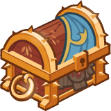ID: 466**Platinum Asharra Chest**Loot for: Asharra<code>"for_crusaders":[6]</code>
        
        
            **Chest**
            Platinum Asharra Chest
            x14 (Shinies x1)
        
    

ID: 602

### Goldie the Sprite Familiar Pack - 1,680 Platinum  
Date of release: 30 Jun 2025

> Collect your own Goldie the Sprite Familiar!

Contents:

    
        
            ID: 276**Goldie the Sprite**She valiantly defends the gold hoard of the dragon's lair in her forest.
        
        
            **Familiar**
            Goldie the Sprite
        
    
    
        
            ID: 4**Huge Potion of Giant's Strength**A transparent potion in which floats the sliver of a giant's fingernail.<code>global_dps_multiplier_mult,900</code>
        
        
            **Buff**
            Huge Potion of Giant's Strength
            x4
        
    
    
        
            ID: 8**Huge Potion of Clairvoyance**Three eyeballs bob in this yellowish potion.<code>gold_multiplier_mult,400</code>
        
        
            **Buff**
            Huge Potion of Clairvoyance
            x4
        
    
    
        
            ID: 36**Potion of Polish**This shiny, silver liquid clings to the edge of the bottle in an unusual way.<code>shiny_loot,1</code>
        
        
            **Buff**
            Potion of Polish
            x1
        
    
    
        
            ID: 77**Huge Potion of Speed**This potion's yellow fluid is streaked with black and swirls on its own.<code>time_scale,2.75</code>
        
        
            **Buff**
            Huge Potion of Speed
            x4
        
    

ID: 591

### Fortune Hunter Tess Theme Pack - 3,830 Platinum  
Date of release: 02 Jul 2025

> Unlock Tess along with an exclusive Fortune Hunter Skin & Familiar!

Contents:

    
        
            ID: 164**Tess**
        
        
            **Champion Unlock**
            Tess
        
    
    
        
            ID: 572**Fortune Hunter Tess (Tess)**
        
        
            **Skin**
            Fortune Hunter Tess
        
    
    
        
            ID: 271**Wormy the Baby Purple Worm**I'll bite your ankles until you die!
        
        
            **Familiar**
            Wormy the Baby Purple Worm
        
    
    
        
            ID: 1**Selflessness**Aye, a selfless dwarf I am.<code>global_dps_multiplier_mult,10</code>
        
        
            **Feat**
            Selflessness
            Bruenor (10% All Champion Damage)
        
    
    
        
            ID: 661****Loot for: Tess<code>"for_crusaders":[164]</code>
        
        
            **Chest**
            
            x32 (Shinies x2)
        
    
    
        
            ID: 1723**Potion of the Gem Hunter**Increases the gem drops from bosses by 50%<code>increase_boss_gems_percent,50</code>
        
        
            **Buff**
            Potion of the Gem Hunter
            x1
        
    

ID: 592

### Archeologist Strongheart Skin & Feat Pack - 1,680 Platinum  
Date of release: 02 Jul 2025

> Unlock Strongheart along with his exclusive Archeologist Skin & Feat!

Contents:

    
        
            ID: 126**Strongheart (Seat 11)**
        
        
            **Champion Unlock**
            Strongheart
        
    
    
        
            ID: 573**Archeologist Strongheart (Strongheart)**
        
        
            **Skin**
            Archeologist Strongheart
        
    
    
        
            ID: 2220**Master's Precision**Steel, strike true!<code>buff_base_crit_chance_add,20</code>
        
        
            **Feat**
            Master's Precision
            Strongheart (+20% Crit Chance)
        
    
    
        
            ID: 20**Large Bounty Contract**Claim a bounty worth 8 hours of offline gold earnings and event tokens.<code>seconds_worth_of_gold,28800</code>
        
        
            **Buff**
            Large Bounty Contract
            x6
        
    
    
        
            ID: 34**Large Blacksmithing Contract**Contract a master blacksmith to improve a piece of equipment owned by one of your Champions.<code>level_up_loot,24</code>
        
        
            **Buff**
            Large Blacksmithing Contract
            x6
        
    
    
        
            ID: 454**Platinum Strongheart Chest**Loot for: Strongheart<code>"for_crusaders":[126]</code>
        
        
            **Chest**
            Platinum Strongheart Chest
            x14 (Shinies x1)
        
    

ID: 593

### Fortune Hunter Nahara Skin & Feat Pack - 1,680 Platinum  
Date of release: 02 Jul 2025

> 

Contents:

    
        
            ID: 102**Nahara (Seat 3)**
        
        
            **Champion Unlock**
            Nahara
        
    
    
        
            ID: 574**Fortune Hunter Nahara (Nahara)**
        
        
            **Skin**
            Fortune Hunter Nahara
        
    
    
        
            ID: 2221**Immolation**You will burn for this, and it will be by my hand.<code>immolation,1,5</code>
        
        
            **Feat**
            Immolation
            Nahara (1s BUD per sec for 5s)
        
    
    
        
            ID: 20**Large Bounty Contract**Claim a bounty worth 8 hours of offline gold earnings and event tokens.<code>seconds_worth_of_gold,28800</code>
        
        
            **Buff**
            Large Bounty Contract
            x6
        
    
    
        
            ID: 34**Large Blacksmithing Contract**Contract a master blacksmith to improve a piece of equipment owned by one of your Champions.<code>level_up_loot,24</code>
        
        
            **Buff**
            Large Blacksmithing Contract
            x6
        
    
    
        
            ID: 361**Platinum Nahara Chest**Loot for: Nahara<code>"for_crusaders":[102]</code>
        
        
            **Chest**
            Platinum Nahara Chest
            x14 (Shinies x1)
        
    

ID: 589

### Beadle & Grimm Dragon Delves Pack - Free  
Date of release: 08 Jul 2025

> 

ⓘ *Note: This pack might not be available for purchase since it's potentially a platform giveaway.*

Contents:

    
        
            ID: 64**Beadle (Seat 8)**
        
        
            **Champion Unlock**
            Beadle
        
    
    
        
            ID: 161**Grimm (Seat 2)**
        
        
            **Champion Unlock**
            Grimm
        
    
    
        
            ID: 569**Dragon Hoard Beadle (Beadle)**
        
        
            **Skin**
            Dragon Hoard Beadle
        
    
    
        
            ID: 570**Dragon Slayer Grimm (Grimm)**
        
        
            **Skin**
            Dragon Slayer Grimm
        
    
    
        
            ID: 269**Verdigrin the Baby Copper Dragon**Ready for a life full of wonder and possibility.
        
        
            **Familiar**
            Verdigrin the Baby Copper Dragon
        
    
    
        
            ID: 187**Platinum Beadle Chest**Loot for: Beadle<code>"for_crusaders":[64]</code>
        
        
            **Chest**
            Platinum Beadle Chest
            x14 (Shinies x1)
        
    
    
        
            ID: 655**Platinum Grimm Chest**Loot for: Grimm<code>"for_crusaders":[161]</code>
        
        
            **Chest**
            Platinum Grimm Chest
            x14 (Shinies x1)
        
    
    
        
            ID: 1723**Potion of the Gem Hunter**Increases the gem drops from bosses by 50%<code>increase_boss_gems_percent,50</code>
        
        
            **Buff**
            Potion of the Gem Hunter
            x1
        
    

ID: 594

### Chompers the Aurumvorax Familiar Pack - 840 Platinum  
Date of release: 09 Jul 2025

> Collect your own Chompers the Aurumvorax Familiar!

Contents:

    
        
            ID: 272**Chompers the Aurumvorax**Don't open the chest, or you'll learn why we named him Chompers…
        
        
            **Familiar**
            Chompers the Aurumvorax
        
    
    
        
            ID: 4**Huge Potion of Giant's Strength**A transparent potion in which floats the sliver of a giant's fingernail.<code>global_dps_multiplier_mult,900</code>
        
        
            **Buff**
            Huge Potion of Giant's Strength
            x2
        
    
    
        
            ID: 8**Huge Potion of Clairvoyance**Three eyeballs bob in this yellowish potion.<code>gold_multiplier_mult,400</code>
        
        
            **Buff**
            Huge Potion of Clairvoyance
            x2
        
    
    
        
            ID: 77**Huge Potion of Speed**This potion's yellow fluid is streaked with black and swirls on its own.<code>time_scale,2.75</code>
        
        
            **Buff**
            Huge Potion of Speed
            x2
        
    

ID: 595

### Dungeoneer Deekin Skin & Feat Pack - 1,680 Platinum  
Date of release: 09 Jul 2025

> Unlock Deekin along with his exclusive Dungeoneer Skin & Feat!

Contents:

    
        
            ID: 28**Deekin (Seat 1)**
        
        
            **Champion Unlock**
            Deekin
        
    
    
        
            ID: 575**Dungeoneer Deekin (Deekin)**
        
        
            **Skin**
            Dungeoneer Deekin
        
    
    
        
            ID: 159**Prophesied Leader**Deekin lead you all to DOOM.<code>global_dps_multiplier_mult,50</code>
        
        
            **Feat**
            Prophesied Leader
            Deekin (50% All Champion Damage)
        
    
    
        
            ID: 20**Large Bounty Contract**Claim a bounty worth 8 hours of offline gold earnings and event tokens.<code>seconds_worth_of_gold,28800</code>
        
        
            **Buff**
            Large Bounty Contract
            x6
        
    
    
        
            ID: 34**Large Blacksmithing Contract**Contract a master blacksmith to improve a piece of equipment owned by one of your Champions.<code>level_up_loot,24</code>
        
        
            **Buff**
            Large Blacksmithing Contract
            x6
        
    
    
        
            ID: 54**Platinum Deekin Chest**Loot for: Deekin<code>"for_crusaders":[28]</code>
        
        
            **Chest**
            Platinum Deekin Chest
            x14 (Shinies x1)
        
    

ID: 596

### Reincarnated K'thriss Theme Pack - 3,830 Platinum  
Date of release: 09 Jul 2025

> Unlock K'thriss along with an exclusive Reincarnated Skin & Familiar!

Contents:

    
        
            ID: 38**K'thriss (Seat 1)**
        
        
            **Champion Unlock**
            K'thriss
        
    
    
        
            ID: 576**Reincarnated K'thriss (K'thriss)**
        
        
            **Skin**
            Reincarnated K'thriss
        
    
    
        
            ID: 273**Ligotti the Tentacle Familiar**
        
        
            **Familiar**
            Ligotti the Tentacle Familiar
        
    
    
        
            ID: 1**Selflessness**Aye, a selfless dwarf I am.<code>global_dps_multiplier_mult,10</code>
        
        
            **Feat**
            Selflessness
            Bruenor (10% All Champion Damage)
        
    
    
        
            ID: 86**Platinum K'thriss Chest**Loot for: K'thriss<code>"for_crusaders":[38]</code>
        
        
            **Chest**
            Platinum K'thriss Chest
            x32 (Shinies x2)
        
    
    
        
            ID: 1723**Potion of the Gem Hunter**Increases the gem drops from bosses by 50%<code>increase_boss_gems_percent,50</code>
        
        
            **Buff**
            Potion of the Gem Hunter
            x1
        
    

ID: 578

### Midas the Baby Gold Dragon Familiar Pack - 2,380 Platinum  
Date of release: 16 Jul 2025

> Collect your own Midas the Baby Gold Dragon Familiar!

Contents:

    
        
            ID: 264**Midas the Baby Gold Dragon**I'm here to eat goblins and collect treasure, and I'm all out of goblins!
        
        
            **Familiar**
            Midas the Baby Gold Dragon
        
    
    
        
            ID: 4**Huge Potion of Giant's Strength**A transparent potion in which floats the sliver of a giant's fingernail.<code>global_dps_multiplier_mult,900</code>
        
        
            **Buff**
            Huge Potion of Giant's Strength
            x6
        
    
    
        
            ID: 8**Huge Potion of Clairvoyance**Three eyeballs bob in this yellowish potion.<code>gold_multiplier_mult,400</code>
        
        
            **Buff**
            Huge Potion of Clairvoyance
            x6
        
    
    
        
            ID: 36**Potion of Polish**This shiny, silver liquid clings to the edge of the bottle in an unusual way.<code>shiny_loot,1</code>
        
        
            **Buff**
            Potion of Polish
            x1
        
    
    
        
            ID: 40**Huge Potion of Fire Breath**The orange liquid in this vial flickers and smoke fills the top of the container.<code>click_damage_seconds_global_dps,600</code>
        
        
            **Buff**
            Huge Potion of Fire Breath
            x6
        
    
    
        
            ID: 77**Huge Potion of Speed**This potion's yellow fluid is streaked with black and swirls on its own.<code>time_scale,2.75</code>
        
        
            **Buff**
            Huge Potion of Speed
            x6
        
    
    
        
            ID: 1721**Potion of the Gold Hunter**Increase Gold Find by 100%<code>gold_multiplier_mult,100</code>
        
        
            **Buff**
            Potion of the Gold Hunter
            x1
        
    
    
        
            **Modron Component Pieces**
        
        
            **Modron Component Pieces**
            x2,000
        
    

ID: 597

### Gelatinous Cube Vin Ursa Theme Pack - 3,830 Platinum  
Date of release: 16 Jul 2025

> Unlock Vin Ursa along with an exclusive Gelatinous Cube Skin & Familiar!

Contents:

    
        
            ID: 127**Vin Ursa (Seat 7)**
        
        
            **Champion Unlock**
            Vin Ursa
        
    
    
        
            ID: 577**Gelatinous Cube Vin Ursa (Vin Ursa)**
        
        
            **Skin**
            Gelatinous Cube Vin Ursa
        
    
    
        
            ID: 274**Ursus the Bear**Exterminator of the noobs.
        
        
            **Familiar**
            Ursus the Bear
        
    
    
        
            ID: 2224**Orbital Ooze**I'm a simple plasmoid making my way through wildspace.<code>buff_upgrades,80,12092,12093,12094</code>
        
        
            **Feat**
            Orbital Ooze
            Vin Ursa (80% All Second Specialisations)
        
    
    
        
            ID: 456**Platinum Vin Ursa Chest**Loot for: Vin Ursa<code>"for_crusaders":[127]</code>
        
        
            **Chest**
            Platinum Vin Ursa Chest
            x32 (Shinies x2)
        
    
    
        
            ID: 1723**Potion of the Gem Hunter**Increases the gem drops from bosses by 50%<code>increase_boss_gems_percent,50</code>
        
        
            **Buff**
            Potion of the Gem Hunter
            x1
        
    

ID: 598

### Dungeon Raider Aeon Skin & Feat Pack - 1,680 Platinum  
Date of release: 16 Jul 2025

> 

Contents:

    
        
            ID: 150**Aeon (Seat 10)**
        
        
            **Champion Unlock**
            Aeon
        
    
    
        
            ID: 578**Dungeon Raider Aeon (Aeon)**
        
        
            **Skin**
            Dungeon Raider Aeon
        
    
    
        
            ID: 2223**Clandestine Operation**They must never know what we do in the shadows.<code>buff_upgrade,80,15196,1</code>
        
        
            **Feat**
            Clandestine Operation
            Aeon (80% Inner Circle)
        
    
    
        
            ID: 20**Large Bounty Contract**Claim a bounty worth 8 hours of offline gold earnings and event tokens.<code>seconds_worth_of_gold,28800</code>
        
        
            **Buff**
            Large Bounty Contract
            x6
        
    
    
        
            ID: 34**Large Blacksmithing Contract**Contract a master blacksmith to improve a piece of equipment owned by one of your Champions.<code>level_up_loot,24</code>
        
        
            **Buff**
            Large Blacksmithing Contract
            x6
        
    
    
        
            ID: 571**Platinum Aeon Chest**Loot for: Aeon<code>"for_crusaders":[150]</code>
        
        
            **Chest**
            Platinum Aeon Chest
            x14 (Shinies x1)
        
    

ID: 599

### Chosen of Vecna Warduke Skin & Feat Pack - 1,680 Platinum  
Date of release: 23 Jul 2025

> Unlock Warduke along with his exclusive Chosen of Vecna Skin & Feat!

Contents:

    
        
            ID: 116**Warduke (Seat 8)**
        
        
            **Champion Unlock**
            Warduke
        
    
    
        
            ID: 579**Chosen of Vecna Warduke (Warduke)**
        
        
            **Skin**
            Chosen of Vecna Warduke
        
    
    
        
            ID: 2225**Right Hand of Evil**I go where I'm told, and whatever I find there I destroy.<code>buff_upgrade,80,9618</code>
        
        
            **Feat**
            Right Hand of Evil
            Warduke (80% Drawn to Power)
        
    
    
        
            ID: 20**Large Bounty Contract**Claim a bounty worth 8 hours of offline gold earnings and event tokens.<code>seconds_worth_of_gold,28800</code>
        
        
            **Buff**
            Large Bounty Contract
            x6
        
    
    
        
            ID: 34**Large Blacksmithing Contract**Contract a master blacksmith to improve a piece of equipment owned by one of your Champions.<code>level_up_loot,24</code>
        
        
            **Buff**
            Large Blacksmithing Contract
            x6
        
    
    
        
            ID: 434**Platinum Warduke Chest**Loot for: Warduke<code>"for_crusaders":[116]</code>
        
        
            **Chest**
            Platinum Warduke Chest
            x14 (Shinies x1)
        
    

ID: 600

### Knick Knack the Pseudodragon Familiar Pack - 2,380 Platinum  
Date of release: 23 Jul 2025

> Collect your own Knick Knack the Pseudodragon Familiar!

Contents:

    
        
            ID: 275**Knick Knack the Pseudodragon**Watch out, he collects EVERYTHING.
        
        
            **Familiar**
            Knick Knack the Pseudodragon
        
    
    
        
            ID: 4**Huge Potion of Giant's Strength**A transparent potion in which floats the sliver of a giant's fingernail.<code>global_dps_multiplier_mult,900</code>
        
        
            **Buff**
            Huge Potion of Giant's Strength
            x6
        
    
    
        
            ID: 8**Huge Potion of Clairvoyance**Three eyeballs bob in this yellowish potion.<code>gold_multiplier_mult,400</code>
        
        
            **Buff**
            Huge Potion of Clairvoyance
            x6
        
    
    
        
            ID: 36**Potion of Polish**This shiny, silver liquid clings to the edge of the bottle in an unusual way.<code>shiny_loot,1</code>
        
        
            **Buff**
            Potion of Polish
            x1
        
    
    
        
            ID: 40**Huge Potion of Fire Breath**The orange liquid in this vial flickers and smoke fills the top of the container.<code>click_damage_seconds_global_dps,600</code>
        
        
            **Buff**
            Huge Potion of Fire Breath
            x6
        
    
    
        
            ID: 77**Huge Potion of Speed**This potion's yellow fluid is streaked with black and swirls on its own.<code>time_scale,2.75</code>
        
        
            **Buff**
            Huge Potion of Speed
            x6
        
    
    
        
            ID: 1721**Potion of the Gold Hunter**Increase Gold Find by 100%<code>gold_multiplier_mult,100</code>
        
        
            **Buff**
            Potion of the Gold Hunter
            x1
        
    
    
        
            **Modron Component Pieces**
        
        
            **Modron Component Pieces**
            x2,000
        
    

ID: 601

### Fortune Hunter Eric Skin & Feat Pack - 1,680 Platinum  
Date of release: 30 Jul 2025

> Unlock Eric along with his exclusive Fortune Hunter Skin & Feat!

Contents:

    
        
            ID: 157**Eric (Seat 4)**
        
        
            **Champion Unlock**
            Eric
        
    
    
        
            ID: 580**Fortune Hunter Eric (Eric)**
        
        
            **Skin**
            Fortune Hunter Eric
        
    
    
        
            ID: 2035**Powerful Shove**Let's keep a safe distance. Way over there sounds perfect.<code>buff_upgrade,80,16132,1</code>
        
        
            **Feat**
            Powerful Shove
            Eric (80% Keep Away)
        
    
    
        
            ID: 20**Large Bounty Contract**Claim a bounty worth 8 hours of offline gold earnings and event tokens.<code>seconds_worth_of_gold,28800</code>
        
        
            **Buff**
            Large Bounty Contract
            x6
        
    
    
        
            ID: 34**Large Blacksmithing Contract**Contract a master blacksmith to improve a piece of equipment owned by one of your Champions.<code>level_up_loot,24</code>
        
        
            **Buff**
            Large Blacksmithing Contract
            x6
        
    
    
        
            ID: 647**Platinum Eric Chest**Loot for: Eric<code>"for_crusaders":[157]</code>
        
        
            **Chest**
            Platinum Eric Chest
            x14 (Shinies x1)
        
    

[Back to Top](#top)

*Last Modified: {{ site.time }}*