[Back to Main](index.md)

# Premium Packs and DLC

Upcoming real-money shop items.

### Cursed Banshee Thellora Skin & Feat Pack - $11.99  
Date of release: 09 Oct 2024

> Unlock Thellora along with her exclusive Banshee Skin & Feat!

Contents:

    
        
            ID: 139**Thellora (Seat 1)**
        
        
            **Champion Unlock**
            Thellora
        
    
    
        
            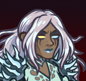ID: 479**Cursed Banshee Thellora (Thellora)**
        
        
            **Skin**
            Cursed Banshee Thellora
        
    
    
        
            ID: 1518**Scholar**A tactician is only as good as their knowledge.<code>increase_ability_score_not_always_on,int,2</code>
        
        
            **Feat**
            Scholar
            Thellora (Stat: +2 Intelligence)
        
    
    
        
            ID: 34**Large Blacksmithing Contract**Contract a master blacksmith to improve a piece of equipment owned by one of your Champions.<code>level_up_loot,24</code>
        
        
            **Buff**
            Large Blacksmithing Contract
            x6
        
    
    
        
            ID: 20**Large Bounty Contract**Claim a bounty worth 8 hours of offline gold earnings and event tokens.<code>seconds_worth_of_gold,28800</code>
        
        
            **Buff**
            Large Bounty Contract
            x6
        
    
    
        
            ID: 549**Gold Thellora Chest**Loot for: Thellora<code>"for_crusaders":[139]</code>
        
        
            **Chest**
            Gold Thellora Chest
            x7 (Shinies x1)
        
    

### Vampire Hunter Voronika Theme Pack - $27.99  
Date of release: 09 Oct 2024

> Unlock Voronika along with an exclusive Vampire Hunter Skin & Ghost Owl Familiar!

Contents:

    
        
            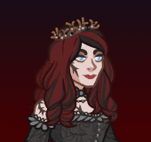ID: 104**Voronika (Seat 1)**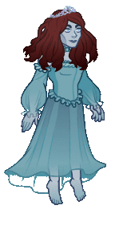
        
        
            **Champion Unlock**
            Voronika
        
    
    
        
            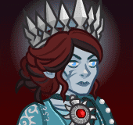ID: 472**Vampire Hunter Voronika (Voronika)**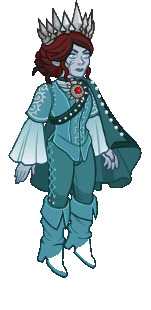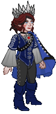
        
        
            **Skin**
            Vampire Hunter Voronika
        
    
    
        
            ID: 1547**Feat**???: 1547
        
        
            **Feat**
            ???: 1547
        
    
    
        
            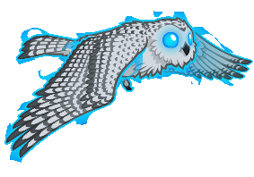ID: 222**Glimmer the Ghost Owl**Light as a feather, sharp as a stake.
        
        
            **Familiar**
            Glimmer the Ghost Owl
        
    
    
        
            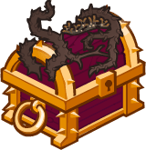ID: 365**Gold Voronika Chest**Loot for: Voronika<code>"for_crusaders":[104]</code>
        
        
            **Chest**
            Gold Voronika Chest
            x16 (Shinies x2)
        
    
    
        
            ID: 1723**Potion of the Gem Hunter**Increases the gem drops from bosses by 50%<code>increase_boss_gems_percent,50</code>
        
        
            **Buff**
            Potion of the Gem Hunter
            x1
        
    

### Avatar of Leira Familiar Pack - $11.99  
Date of release: 16 Oct 2024

> Collect your own Mirror Shade Familiar!

Contents:

    
        
            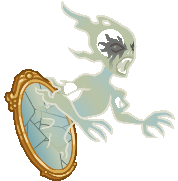ID: 226**Mirror Shade**When the spirit of a malevolent trickster refuses to enter the afterlife, the spirit sometimes becomes a mirror shade instead.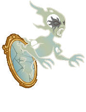
        
        
            **Familiar**
            Mirror Shade
        
    
    
        
            ID: 1712**Potion of the Hunter**Increase Global Damage by 100%<code>global_dps_multiplier_mult,100</code>
        
        
            **Buff**
            Potion of the Hunter
            x1
        
    
    
        
            ID: 1798**Epic Golden Potion**Gold and purple liquid swirl around each other as if dancing.<code>golden_loot,1</code>
        
        
            **Buff**
            Epic Golden Potion
            x1
        
    
    
        
            ID: 77**Huge Potion of Speed**This potion's yellow fluid is streaked with black and swirls on its own.<code>time_scale,2.75</code>
        
        
            **Buff**
            Huge Potion of Speed
            x2
        
    

### Headless Horseman Kent Skin & Feat Pack - $11.99  
Date of release: 16 Oct 2024

> Unlock Kent along with his exclusive Headless Horseman Skin & Feat!

Contents:

    
        
            ID: 114**Kent (Seat 4)**
        
        
            **Champion Unlock**
            Kent
        
    
    
        
            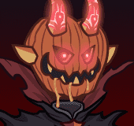ID: 475**Headless Horseman Kent (Kent)**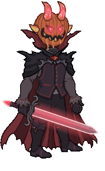
        
        
            **Skin**
            Headless Horseman Kent
        
    
    
        
            ID: 1891**Prodigal Leader**I am, aren't I?!<code>global_dps_multiplier_mult,50</code>
        
        
            **Feat**
            Prodigal Leader
            Kent (50% All Champion Damage)
        
    
    
        
            ID: 34**Large Blacksmithing Contract**Contract a master blacksmith to improve a piece of equipment owned by one of your Champions.<code>level_up_loot,24</code>
        
        
            **Buff**
            Large Blacksmithing Contract
            x6
        
    
    
        
            ID: 20**Large Bounty Contract**Claim a bounty worth 8 hours of offline gold earnings and event tokens.<code>seconds_worth_of_gold,28800</code>
        
        
            **Buff**
            Large Bounty Contract
            x6
        
    
    
        
            ID: 430**Gold Kent Chest**Loot for: Kent<code>"for_crusaders":[114]</code>
        
        
            **Chest**
            Gold Kent Chest
            x7 (Shinies x1)
        
    

### Werebear Donaar Skin & Feat Pack - $11.99  
Date of release: 16 Oct 2024

> Unlock Donaar along with his exclusive Werebear Skin & Feat!

Contents:

    
        
            ID: 34**Donaar (Seat 2)**
        
        
            **Champion Unlock**
            Donaar
        
    
    
        
            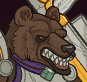ID: 480**Werebear Donaar (Donaar)**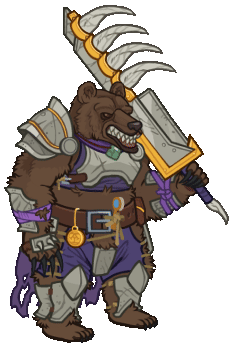
        
        
            **Skin**
            Werebear Donaar
        
    
    
        
            ID: 1892**Fortune's Favor**What do you mean: give up the gold? There was nothing there...<code>gold_multiplier_mult,25</code>
        
        
            **Feat**
            Fortune's Favor
            Donaar (25% Gold)
        
    
    
        
            ID: 34**Large Blacksmithing Contract**Contract a master blacksmith to improve a piece of equipment owned by one of your Champions.<code>level_up_loot,24</code>
        
        
            **Buff**
            Large Blacksmithing Contract
            x6
        
    
    
        
            ID: 20**Large Bounty Contract**Claim a bounty worth 8 hours of offline gold earnings and event tokens.<code>seconds_worth_of_gold,28800</code>
        
        
            **Buff**
            Large Bounty Contract
            x6
        
    
    
        
            ID: 74**Gold Donaar Chest**Loot for: Donaar<code>"for_crusaders":[34]</code>
        
        
            **Chest**
            Gold Donaar Chest
            x7 (Shinies x1)
        
    

### Vampire Hunter Desmond Skin & Feat Pack - $11.99  
Date of release: 23 Oct 2024

> Unlock Desmond along with his exclusive Vampire Hunter Skin & Feat!

Contents:

    
        
            ID: 96**Desmond (Seat 4)**
        
        
            **Champion Unlock**
            Desmond
        
    
    
        
            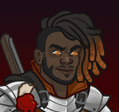ID: 481**Vampire Hunter Desmond (Desmond)**
        
        
            **Skin**
            Vampire Hunter Desmond
        
    
    
        
            ID: 1954**Prodigal Leader**When I lead, you should follow.<code>global_dps_multiplier_mult,50</code>
        
        
            **Feat**
            Prodigal Leader
            Desmond (50% All Champion Damage)
        
    
    
        
            ID: 34**Large Blacksmithing Contract**Contract a master blacksmith to improve a piece of equipment owned by one of your Champions.<code>level_up_loot,24</code>
        
        
            **Buff**
            Large Blacksmithing Contract
            x6
        
    
    
        
            ID: 20**Large Bounty Contract**Claim a bounty worth 8 hours of offline gold earnings and event tokens.<code>seconds_worth_of_gold,28800</code>
        
        
            **Buff**
            Large Bounty Contract
            x6
        
    
    
        
            ID: 349**Gold Desmond Chest**Loot for: Desmond<code>"for_crusaders":[96]</code>
        
        
            **Chest**
            Gold Desmond Chest
            x7 (Shinies x1)
        
    

### Vampire Viconia Skin & Feat Pack - $11.99  
Date of release: 23 Oct 2024

> Unlock Viconia along with her exclusive Vampire Skin & Feat!

Contents:

    
        
            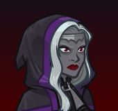ID: 93**Viconia (Seat 5)**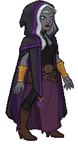
        
        
            **Champion Unlock**
            Viconia
        
    
    
        
            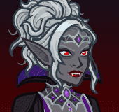ID: 476**Vampire Viconia (Viconia)**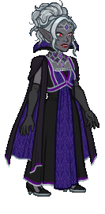
        
        
            **Skin**
            Vampire Viconia
        
    
    
        
            ID: 1896**Make Undead**My vitality is yet another thing lost in the pursuit of the Lady of Loss' goals.<code>add_hero_tags,0,undead buff_upgrade,80,9782,1</code>
        
        
            **Feat**
            Make Undead
            Viconia (Counts as Undead & 80% Animate Dead)
        
    
    
        
            ID: 34**Large Blacksmithing Contract**Contract a master blacksmith to improve a piece of equipment owned by one of your Champions.<code>level_up_loot,24</code>
        
        
            **Buff**
            Large Blacksmithing Contract
            x6
        
    
    
        
            ID: 20**Large Bounty Contract**Claim a bounty worth 8 hours of offline gold earnings and event tokens.<code>seconds_worth_of_gold,28800</code>
        
        
            **Buff**
            Large Bounty Contract
            x6
        
    
    
        
            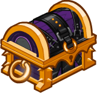ID: 343**Gold Viconia Chest**Loot for: Viconia<code>"for_crusaders":[93]</code>
        
        
            **Chest**
            Gold Viconia Chest
            x7 (Shinies x1)
        
    

### Vincent the Vargouille Familiar Pack - $11.99  
Date of release: 23 Oct 2024

> Collect your own Vincent the Vargouille Familiar!

Contents:

    
        
            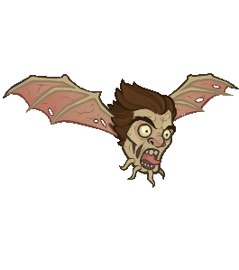ID: 224**Vincent the Vargouille**A Vargouille's shriek can paralyze creatures with fear, which also makes them susceptible to the vargouille's curse!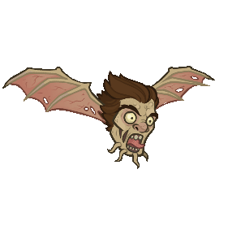
        
        
            **Familiar**
            Vincent the Vargouille
        
    
    
        
            ID: 77**Huge Potion of Speed**This potion's yellow fluid is streaked with black and swirls on its own.<code>time_scale,2.75</code>
        
        
            **Buff**
            Huge Potion of Speed
            x4
        
    
    
        
            ID: 4**Huge Potion of Giant's Strength**A transparent potion in which floats the sliver of a giant's fingernail.<code>global_dps_multiplier_mult,900</code>
        
        
            **Buff**
            Huge Potion of Giant's Strength
            x4
        
    
    
        
            ID: 8**Huge Potion of Clairvoyance**Three eyeballs bob in this yellowish potion.<code>gold_multiplier_mult,400</code>
        
        
            **Buff**
            Huge Potion of Clairvoyance
            x4
        
    
    
        
            ID: 36**Potion of Polish**This shiny, silver liquid clings to the edge of the bottle in an unusual way.<code>shiny_loot,1</code>
        
        
            **Buff**
            Potion of Polish
            x1
        
    

### Creeping Hut Familiar Pack - $5.99  
Date of release: 30 Oct 2024

> Collect your own Creeping Hut Familiar!

Contents:

    
        
            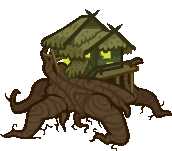ID: 225**Creeping Hut**'I will not rest until the last of my son's enemies are destroyed.' ~ Baba Lysaga
        
        
            **Familiar**
            Creeping Hut
        
    
    
        
            ID: 77**Huge Potion of Speed**This potion's yellow fluid is streaked with black and swirls on its own.<code>time_scale,2.75</code>
        
        
            **Buff**
            Huge Potion of Speed
            x2
        
    
    
        
            ID: 4**Huge Potion of Giant's Strength**A transparent potion in which floats the sliver of a giant's fingernail.<code>global_dps_multiplier_mult,900</code>
        
        
            **Buff**
            Huge Potion of Giant's Strength
            x2
        
    
    
        
            ID: 8**Huge Potion of Clairvoyance**Three eyeballs bob in this yellowish potion.<code>gold_multiplier_mult,400</code>
        
        
            **Buff**
            Huge Potion of Clairvoyance
            x2
        
    

### Devil Wyll Skin & Feat Pack - $11.99  
Date of release: 30 Oct 2024

> Unlock Wyll along with his exclusive Devil Skin & Feat!

Contents:

    
        
            ID: 142**Wyll (Seat 12)**
        
        
            **Champion Unlock**
            Wyll
        
    
    
        
            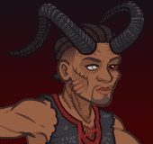ID: 477**Devil Wyll (Wyll)**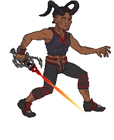
        
        
            **Skin**
            Devil Wyll
        
    
    
        
            ID: 1897**Mizora's Pawn**'Quite the handsome devil, if I do say so.' ~ Mizora<code>add_hero_tags,0,tiefling buff_upgrade,80,13429</code>
        
        
            **Feat**
            Mizora's Pawn
            Wyll (Counts as Tiefling & 80% Folk Hero (Prestack))
        
    
    
        
            ID: 34**Large Blacksmithing Contract**Contract a master blacksmith to improve a piece of equipment owned by one of your Champions.<code>level_up_loot,24</code>
        
        
            **Buff**
            Large Blacksmithing Contract
            x6
        
    
    
        
            ID: 20**Large Bounty Contract**Claim a bounty worth 8 hours of offline gold earnings and event tokens.<code>seconds_worth_of_gold,28800</code>
        
        
            **Buff**
            Large Bounty Contract
            x6
        
    
    
        
            ID: 555**Gold Wyll Chest**Loot for: Wyll<code>"for_crusaders":[142]</code>
        
        
            **Chest**
            Gold Wyll Chest
            x7 (Shinies x1)
        
    

### Lobita the Guardian Familiar Pack - $11.99  
Date of release: 04 Nov 2024

> Collect your own Lobita the Guardian Familiar!

Contents:

    
        
            ID: 227**Lobita the Guardian**Let’s play!!
        
        
            **Familiar**
            Lobita the Guardian
        
    
    
        
            ID: 77**Huge Potion of Speed**This potion's yellow fluid is streaked with black and swirls on its own.<code>time_scale,2.75</code>
        
        
            **Buff**
            Huge Potion of Speed
            x4
        
    
    
        
            ID: 4**Huge Potion of Giant's Strength**A transparent potion in which floats the sliver of a giant's fingernail.<code>global_dps_multiplier_mult,900</code>
        
        
            **Buff**
            Huge Potion of Giant's Strength
            x4
        
    
    
        
            ID: 8**Huge Potion of Clairvoyance**Three eyeballs bob in this yellowish potion.<code>gold_multiplier_mult,400</code>
        
        
            **Buff**
            Huge Potion of Clairvoyance
            x4
        
    
    
        
            ID: 36**Potion of Polish**This shiny, silver liquid clings to the edge of the bottle in an unusual way.<code>shiny_loot,1</code>
        
        
            **Buff**
            Potion of Polish
            x1
        
    

### Herald of Protection Sentry Skin & Feat Pack - $11.99  
Date of release: 06 Nov 2024

> Unlock Sentry along with her exclusive Herald of Protection Skin & Feat!

Contents:

    
        
            ID: 52**Sentry (Seat 4)**
        
        
            **Champion Unlock**
            Sentry
        
    
    
        
            ID: 486**Herald of Protection Sentry (Sentry)**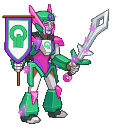
        
        
            **Skin**
            Herald of Protection Sentry
        
    
    
        
            ID: 1975**Overdrive**I can go further, I promise.<code>todo DevNote: Increase the effect of Sentry's specializations by 80% May require new tech to buff the stun duration (but not the chance) of the first spec choice (Nature's Wrath)</code>
        
        
            **Feat**
            Overdrive
            Sentry (todo)
        
    
    
        
            ID: 34**Large Blacksmithing Contract**Contract a master blacksmith to improve a piece of equipment owned by one of your Champions.<code>level_up_loot,24</code>
        
        
            **Buff**
            Large Blacksmithing Contract
            x6
        
    
    
        
            ID: 20**Large Bounty Contract**Claim a bounty worth 8 hours of offline gold earnings and event tokens.<code>seconds_worth_of_gold,28800</code>
        
        
            **Buff**
            Large Bounty Contract
            x6
        
    
    
        
            ID: 163**Gold Sentry Chest**Loot for: Sentry<code>"for_crusaders":[52]</code>
        
        
            **Chest**
            Gold Sentry Chest
            x7 (Shinies x1)
        
    

### Herald of the Absolute Minthara Theme Pack - $27.99  
Date of release: 06 Nov 2024

> Unlock Minthara along with an exclusive Herald of the Absolute Skin & Scrying Eye Familiar!

Contents:

    
        
            ID: 154**Minthara**
        
        
            **Champion Unlock**
            Minthara
        
    
    
        
            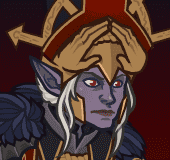ID: 484**Herald of the Absolute Minthara (Minthara)**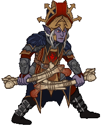
        
        
            **Skin**
            Herald of the Absolute Minthara
        
    
    
        
            ID: 1964**Feat**???: 1964
        
        
            **Feat**
            ???: 1964
        
    
    
        
            ID: 228**Scrying Eye**Try not to do anything suspicious while within its gaze!
        
        
            **Familiar**
            Scrying Eye
        
    
    
        
            ID: 579**Gold Minthara Chest**Loot for: Minthara<code>"for_crusaders":[154]</code>
        
        
            **Chest**
            Gold Minthara Chest
            x16 (Shinies x2)
        
    
    
        
            ID: 1723**Potion of the Gem Hunter**Increases the gem drops from bosses by 50%<code>increase_boss_gems_percent,50</code>
        
        
            **Buff**
            Potion of the Gem Hunter
            x1
        
    

### Herald of Neverwinter Sgt. Knox Theme Pack - $27.99  
Date of release: 13 Nov 2024

> Unlock Sgt. Knox along with an exclusive Herald of Neverwinter Skin & Crown of Neverwinter Familiar!

Contents:

    
        
            ID: 82**Sgt. Knox (Seat 6)**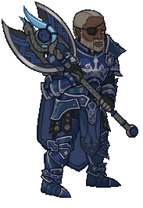
        
        
            **Champion Unlock**
            Sgt. Knox
        
    
    
        
            ID: 485**Herald of Neverwinter Sgt. Knox (Sgt. Knox)**
        
        
            **Skin**
            Herald of Neverwinter Sgt. Knox
        
    
    
        
            ID: 1990**Feat**???: 1990
        
        
            **Feat**
            ???: 1990
        
    
    
        
            ID: 229**Crown of Neverwinter**Forged of mithral & sapphires.
        
        
            **Familiar**
            Crown of Neverwinter
        
    
    
        
            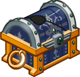ID: 271**Gold Sergeant Knox Chest**Loot for: Sgt. Knox<code>"for_crusaders":[82]</code>
        
        
            **Chest**
            Gold Sergeant Knox Chest
            x16 (Shinies x2)
        
    
    
        
            ID: 1723**Potion of the Gem Hunter**Increases the gem drops from bosses by 50%<code>increase_boss_gems_percent,50</code>
        
        
            **Buff**
            Potion of the Gem Hunter
            x1
        
    

### Herald of The World Tree Penelope Skin & Feat Pack - $11.99  
Date of release: 13 Nov 2024

> Unlock Penelope along with her exclusive Herald of The World Tree Skin & Feat!

Contents:

    
        
            ID: 71**Penelope (Seat 12)**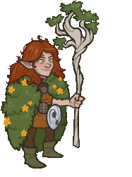
        
        
            **Champion Unlock**
            Penelope
        
    
    
        
            ID: 487**Herald of The World Tree Penelope (Penelope)**
        
        
            **Skin**
            Herald of The World Tree Penelope
        
    
    
        
            ID: 1751**Friends Forever**Aw, I just love you all so much.<code>buff_upgrades,80,14703,14704,14705</code>
        
        
            **Feat**
            Friends Forever
            Penelope (80% All First Specialisations (Prestack))
        
    
    
        
            ID: 34**Large Blacksmithing Contract**Contract a master blacksmith to improve a piece of equipment owned by one of your Champions.<code>level_up_loot,24</code>
        
        
            **Buff**
            Large Blacksmithing Contract
            x6
        
    
    
        
            ID: 20**Large Bounty Contract**Claim a bounty worth 8 hours of offline gold earnings and event tokens.<code>seconds_worth_of_gold,28800</code>
        
        
            **Buff**
            Large Bounty Contract
            x6
        
    
    
        
            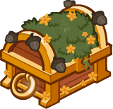ID: 249**Gold Penelope Chest**Loot for: Penelope<code>"for_crusaders":[71]</code>
        
        
            **Chest**
            Gold Penelope Chest
            x7 (Shinies x1)
        
    

### Herald the Golden Crow Familiar Pack - $11.99  
Date of release: 13 Nov 2024

> Collect your own Herald the Golden Crow Familiar!

Contents:

    
        
            ID: 230**Herald the Golden Crow**I've arrived!
        
        
            **Familiar**
            Herald the Golden Crow
        
    
    
        
            ID: 77**Huge Potion of Speed**This potion's yellow fluid is streaked with black and swirls on its own.<code>time_scale,2.75</code>
        
        
            **Buff**
            Huge Potion of Speed
            x4
        
    
    
        
            ID: 4**Huge Potion of Giant's Strength**A transparent potion in which floats the sliver of a giant's fingernail.<code>global_dps_multiplier_mult,900</code>
        
        
            **Buff**
            Huge Potion of Giant's Strength
            x4
        
    
    
        
            ID: 8**Huge Potion of Clairvoyance**Three eyeballs bob in this yellowish potion.<code>gold_multiplier_mult,400</code>
        
        
            **Buff**
            Huge Potion of Clairvoyance
            x4
        
    
    
        
            ID: 36**Potion of Polish**This shiny, silver liquid clings to the edge of the bottle in an unusual way.<code>shiny_loot,1</code>
        
        
            **Buff**
            Potion of Polish
            x1
        
    

### Cinderflick the Cat Familiar Pack - $16.99  
Date of release: 20 Nov 2024

> Collect your own Cinderflick the Cat Familiar!

Contents:

    
        
            ID: 231**Cinderflick the Cat**Fancy cat for a fancy wizard!
        
        
            **Familiar**
            Cinderflick the Cat
        
    
    
        
            ID: 77**Huge Potion of Speed**This potion's yellow fluid is streaked with black and swirls on its own.<code>time_scale,2.75</code>
        
        
            **Buff**
            Huge Potion of Speed
            x6
        
    
    
        
            ID: 4**Huge Potion of Giant's Strength**A transparent potion in which floats the sliver of a giant's fingernail.<code>global_dps_multiplier_mult,900</code>
        
        
            **Buff**
            Huge Potion of Giant's Strength
            x6
        
    
    
        
            ID: 8**Huge Potion of Clairvoyance**Three eyeballs bob in this yellowish potion.<code>gold_multiplier_mult,400</code>
        
        
            **Buff**
            Huge Potion of Clairvoyance
            x6
        
    
    
        
            ID: 40**Huge Potion of Fire Breath**The orange liquid in this vial flickers and smoke fills the top of the container.<code>click_damage_seconds_global_dps,600</code>
        
        
            **Buff**
            Huge Potion of Fire Breath
            x6
        
    
    
        
            ID: 1721**Potion of the Gold Hunter**Increase Gold Find by 100%<code>gold_multiplier_mult,100</code>
        
        
            **Buff**
            Potion of the Gold Hunter
            x1
        
    
    
        
            ID: 8013**Modron Component Pieces**
        
        
            **Modron Component Pieces**
            x2,000
        
    
    
        
            ID: 36**Potion of Polish**This shiny, silver liquid clings to the edge of the bottle in an unusual way.<code>shiny_loot,1</code>
        
        
            **Buff**
            Potion of Polish
            x1
        
    

### Herald of Lore Turiel Skin & Feat Pack - $11.99  
Date of release: 20 Nov 2024

> Unlock Turiel along with his exclusive Herald of Lore Skin & Feat!

Contents:

    
        
            ID: 49**Turiel (Seat 1)**
        
        
            **Champion Unlock**
            Turiel
        
    
    
        
            ID: 488**Herald of Lore Turiel (Turiel)**
        
        
            **Skin**
            Herald of Lore Turiel
        
    
    
        
            ID: 1976**Platinum Devotion**Do you have a moment to talk about the Platinum Dragon?<code>buff_upgrade,80,10657</code>
        
        
            **Feat**
            Platinum Devotion
            Turiel (80% Embodiment of the Law)
        
    
    
        
            ID: 34**Large Blacksmithing Contract**Contract a master blacksmith to improve a piece of equipment owned by one of your Champions.<code>level_up_loot,24</code>
        
        
            **Buff**
            Large Blacksmithing Contract
            x6
        
    
    
        
            ID: 20**Large Bounty Contract**Claim a bounty worth 8 hours of offline gold earnings and event tokens.<code>seconds_worth_of_gold,28800</code>
        
        
            **Buff**
            Large Bounty Contract
            x6
        
    
    
        
            ID: 108**Gold Turiel Chest**Loot for: Turiel<code>"for_crusaders":[49]</code>
        
        
            **Chest**
            Gold Turiel Chest
            x7 (Shinies x1)
        
    

### Herald of Waterdeep Virgil Skin & Feat Pack - $11.99  
Date of release: 20 Nov 2024

> Unlock Virgil along with his exclusive Herald of Waterdeep Skin & Feat!

Contents:

    
        
            ID: 115**Virgil (Seat 10)**
        
        
            **Champion Unlock**
            Virgil
        
    
    
        
            ID: 489**Herald of Waterdeep Virgil (Virgil)**
        
        
            **Skin**
            Herald of Waterdeep Virgil
        
    
    
        
            ID: 1977**Extra Missiles**There's nothing wrong with being a little extra.<code>todo DevNote: add 2 missiles to base attack</code>
        
        
            **Feat**
            Extra Missiles
            Virgil (todo)
        
    
    
        
            ID: 34**Large Blacksmithing Contract**Contract a master blacksmith to improve a piece of equipment owned by one of your Champions.<code>level_up_loot,24</code>
        
        
            **Buff**
            Large Blacksmithing Contract
            x6
        
    
    
        
            ID: 20**Large Bounty Contract**Claim a bounty worth 8 hours of offline gold earnings and event tokens.<code>seconds_worth_of_gold,28800</code>
        
        
            **Buff**
            Large Bounty Contract
            x6
        
    
    
        
            ID: 432**Gold Virgil Chest**Loot for: Virgil<code>"for_crusaders":[115]</code>
        
        
            **Chest**
            Gold Virgil Chest
            x7 (Shinies x1)
        
    

### Goblin Glitch Calliope Skin & Feat Pack - $11.99  
Date of release: 27 Nov 2024

> Snag Calliope's exclusive Goblin Glitch Skin & Feat!

Contents:

    
        
            ID: 483**Goblin Glitch Calliope (Calliope)**
        
        
            **Skin**
            Goblin Glitch Calliope
        
    
    
        
            ID: 1979**Goblin Glitch**I finally look on the outside how I feel on the inside!<code>todo DevNote: Calliope counts as a Goblin. Decreases the base attack cooldown of Champions in the column in front of her by .5 seconds.</code>
        
        
            **Feat**
            Goblin Glitch
            Calliope (todo)
        
    
    
        
            ID: 34**Large Blacksmithing Contract**Contract a master blacksmith to improve a piece of equipment owned by one of your Champions.<code>level_up_loot,24</code>
        
        
            **Buff**
            Large Blacksmithing Contract
            x6
        
    
    
        
            ID: 20**Large Bounty Contract**Claim a bounty worth 8 hours of offline gold earnings and event tokens.<code>seconds_worth_of_gold,28800</code>
        
        
            **Buff**
            Large Bounty Contract
            x6
        
    
    
        
            ID: 465**Gold Calliope Chest**Loot for: Calliope<code>"for_crusaders":[5]</code>
        
        
            **Chest**
            Gold Calliope Chest
            x7 (Shinies x1)
        
    

### Herald of the Champions Dungeon Master Skin & Feat Pack - $11.99  
Date of release: 27 Nov 2024

> Unlock Dungeon Master along with his exclusive Herald of the Champions Skin & Feat!

Contents:

    
        
            ID: 99**Dungeon Master (Seat 6)**
        
        
            **Champion Unlock**
            Dungeon Master
        
    
    
        
            ID: 490**Herald of the Champions Dungeon Master (DM)**
        
        
            **Skin**
            Herald of the Champions Dungeon Master
        
    
    
        
            ID: 1978**Wound Master**It is not yet your time. More adventure awaits!<code>buff_upgrade,80,7845</code>
        
        
            **Feat**
            Wound Master
            DM (80% Words of Encouragement)
        
    
    
        
            ID: 34**Large Blacksmithing Contract**Contract a master blacksmith to improve a piece of equipment owned by one of your Champions.<code>level_up_loot,24</code>
        
        
            **Buff**
            Large Blacksmithing Contract
            x6
        
    
    
        
            ID: 20**Large Bounty Contract**Claim a bounty worth 8 hours of offline gold earnings and event tokens.<code>seconds_worth_of_gold,28800</code>
        
        
            **Buff**
            Large Bounty Contract
            x6
        
    
    
        
            ID: 355**Gold Dungeon Master Chest**Loot for: Dungeon Master<code>"for_crusaders":[99]</code>
        
        
            **Chest**
            Gold Dungeon Master Chest
            x7 (Shinies x1)
        
    

[Back to Top](#top)

*Last Modified: {{ site.time }}*