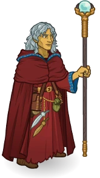
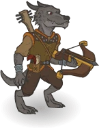
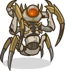
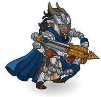
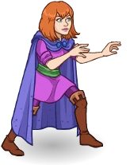
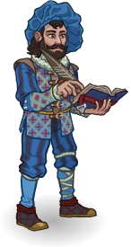
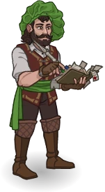
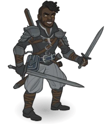
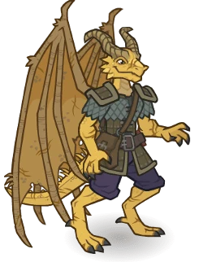
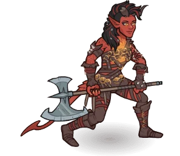

[Back to Main](index.md)

# Premium Packs and DLC

Upcoming real-money shop items.

ID: 682

### Raistlin, Master of Past and Present Theme Pack - 3,830 Platinum  
Date of release: 04 Mar 2026

> Unlock Raistlin along with an exclusive Master of Past and Present Skin & Familiar!

Contents:

    
        
            ID: 173**Raistlin**
        
        
            **Champion Unlock**
            Raistlin
        
    
    
        
            ID: 662**Raistlin, Master of Past and Present (Raistlin)**
        
        
            **Skin**
            Raistlin, Master of Past and Present
        
    
    
        
            ID: 310**Caramon the Rabbit**Dear, good, steadfast, boring Caramon.
        
        
            **Familiar**
            Caramon the Rabbit
        
    
    
        
            ID: 2527**Feat**???: 2527
        
        
            **Feat**
            ???: 2527
        
    
    
        
            ID: 790**Platinum Raistlin Chest**Loot for: Raistlin<code>"for_crusaders":[173]</code>
        
        
            **Chest**
            Platinum Raistlin Chest
            x32 (Shinies x2)
        
    
    
        
            ID: 1723**Potion of the Gem Hunter**Increases the gem drops from bosses by 50%<code>increase_boss_gems_percent,50</code>
        
        
            **Buff**
            Potion of the Gem Hunter
            x1
        
    

ID: 683

### Dragon Orb of Istar Familiar Pack - 840 Platinum  
Date of release: 04 Mar 2026

> Collect your own Dragon Orb of Istar familiar!

Contents:

    
        
            ID: 311**Dragon Orb of Istar**Each Orb of Dragonkind contains the essence of an evil dragon, who resents any attempt to coax magic from it.
        
        
            **Familiar**
            Dragon Orb of Istar
        
    
    
        
            ID: 4**Huge Potion of Giant's Strength**A transparent potion in which floats the sliver of a giant's fingernail.<code>global_dps_multiplier_mult,900</code>
        
        
            **Buff**
            Huge Potion of Giant's Strength
            x2
        
    
    
        
            ID: 8**Huge Potion of Clairvoyance**Three eyeballs bob in this yellowish potion.<code>gold_multiplier_mult,400</code>
        
        
            **Buff**
            Huge Potion of Clairvoyance
            x2
        
    
    
        
            ID: 77**Huge Potion of Speed**This potion's yellow fluid is streaked with black and swirls on its own.<code>time_scale,2.75</code>
        
        
            **Buff**
            Huge Potion of Speed
            x2
        
    

ID: 684

### Order of the Red Robes Gale Skin & Feat Pack - 1,680 Platinum  
Date of release: 04 Mar 2026

> Unlock Gale along with his exclusive Order of the Red Robes Skin & Feat!

Contents:

    
        
            ID: 147**Gale (Seat 1)**
        
        
            **Champion Unlock**
            Gale
        
    
    
        
            ID: 663**Order of the Red Robes Gale (Gale)**
        
        
            **Skin**
            Order of the Red Robes Gale
        
    
    
        
            ID: 2475**Prodigal Leader**Mark my words well. My name will be counted among the greatest wizards of all worlds!  All Champions damage +50%.<code>global_dps_multiplier_mult,50</code>
        
        
            **Feat**
            Prodigal Leader
            Gale
        
    
    
        
            ID: 20**Large Bounty Contract**Claim a bounty worth 8 hours of offline gold earnings and event tokens.<code>seconds_worth_of_gold,28800</code>
        
        
            **Buff**
            Large Bounty Contract
            x6
        
    
    
        
            ID: 34**Large Blacksmithing Contract**Contract a master blacksmith to improve a piece of equipment owned by one of your Champions.<code>level_up_loot,24</code>
        
        
            **Buff**
            Large Blacksmithing Contract
            x6
        
    
    
        
            ID: 565**Platinum Gale Chest**Loot for: Gale<code>"for_crusaders":[147]</code>
        
        
            **Chest**
            Platinum Gale Chest
            x14 (Shinies x1)
        
    

ID: 685

### Bard of the Dragon Queen Deekin Theme Pack - 3,830 Platinum  
Date of release: 11 Mar 2026

> Unlock Deekin along with an exclusive Bard of the Dragon Queen Skin & Familiar!

Contents:

    
        
            ID: 28**Deekin (Seat 1)**
        
        
            **Champion Unlock**
            Deekin
        
    
    
        
            ID: 664**Bard of the Dragon Queen Deekin (Deekin)**
        
        
            **Skin**
            Bard of the Dragon Queen Deekin
        
    
    
        
            ID: 312**Drone of Dooooom**Bards can't share their stories all alone…
        
        
            **Familiar**
            Drone of Dooooom
        
    
    
        
            ID: 2509**Feat**???: 2509
        
        
            **Feat**
            ???: 2509
        
    
    
        
            ID: 54**Platinum Deekin Chest**Loot for: Deekin<code>"for_crusaders":[28]</code>
        
        
            **Chest**
            Platinum Deekin Chest
            x32 (Shinies x2)
        
    
    
        
            ID: 1723**Potion of the Gem Hunter**Increases the gem drops from bosses by 50%<code>increase_boss_gems_percent,50</code>
        
        
            **Buff**
            Potion of the Gem Hunter
            x1
        
    

ID: 686

### Knight of Solamnia Zorbu Skin & Feat Pack - 1,680 Platinum  
Date of release: 11 Mar 2026

> Unlock Zorbu along with his exclusive Knight of Solamnia Skin & Feat!

Contents:

    
        
            ID: 22**Zorbu (Seat 12)**
        
        
            **Champion Unlock**
            Zorbu
        
    
    
        
            ID: 665**Knight of Solamnia Zorbu (Zorbu)**
        
        
            **Skin**
            Knight of Solamnia Zorbu
        
    
    
        
            ID: 2476**Hunter's Oath**I vow to protect this world from those who would despoil it.  Increases the effect of Zorbu's Focused Fury ability by 80%.<code>buff_upgrade,80,12990</code>
        
        
            **Feat**
            Hunter's Oath
            Zorbu
        
    
    
        
            ID: 20**Large Bounty Contract**Claim a bounty worth 8 hours of offline gold earnings and event tokens.<code>seconds_worth_of_gold,28800</code>
        
        
            **Buff**
            Large Bounty Contract
            x6
        
    
    
        
            ID: 34**Large Blacksmithing Contract**Contract a master blacksmith to improve a piece of equipment owned by one of your Champions.<code>level_up_loot,24</code>
        
        
            **Buff**
            Large Blacksmithing Contract
            x6
        
    
    
        
            ID: 22**Platinum Zorbu Chest**Loot for: Zorbu<code>"for_crusaders":[22]</code>
        
        
            **Chest**
            Platinum Zorbu Chest
            x14 (Shinies x1)
        
    

ID: 687

### Heroic Sheila Skin & Feat Pack - 1,680 Platinum  
Date of release: 11 Mar 2026

> Unlock Sheila along with her exclusive Heroic Skin & Feat!

Contents:

    
        
            ID: 160**Sheila (Seat 7)**
        
        
            **Champion Unlock**
            Sheila
        
    
    
        
            ID: 666**Heroic Sheila (Sheila)**
        
        
            **Skin**
            Heroic Sheila
        
    
    
        
            ID: 2477**Old Tricks**You'd think they would have learned by now.  Increases the effect of Sheila's second set of Specializations by 80%.<code>buff_upgrades,80,16544,16545,16546</code>
        
        
            **Feat**
            Old Tricks
            Sheila
        
    
    
        
            ID: 20**Large Bounty Contract**Claim a bounty worth 8 hours of offline gold earnings and event tokens.<code>seconds_worth_of_gold,28800</code>
        
        
            **Buff**
            Large Bounty Contract
            x6
        
    
    
        
            ID: 34**Large Blacksmithing Contract**Contract a master blacksmith to improve a piece of equipment owned by one of your Champions.<code>level_up_loot,24</code>
        
        
            **Buff**
            Large Blacksmithing Contract
            x6
        
    
    
        
            ID: 653**Platinum Sheila Chests**Loot for: Sheila<code>"for_crusaders":[160]</code>
        
        
            **Chest**
            Platinum Sheila Chests
            x14 (Shinies x1)
        
    

ID: 688

### Dragon Chronicler Volo Skin & Feat Pack - 1,680 Platinum  
Date of release: 18 Mar 2026

> Unlock Volo along with his exclusive Dragon Chronicler Skin & Feat!

Contents:

    
        
            ID: 159**Volo (Seat 9)**
        
        
            **Champion Unlock**
            Volo
        
    
    
        
            ID: 667**Dragon Chronicler Volo (Volo)**
        
        
            **Skin**
            Dragon Chronicler Volo
        
    
    
        
            ID: 2478**Volo's Keen Knowledge**Why, I dare to posit that the noble owlbear is, in fact, a creation of the gods themselves!  Increases the effect of Volo's Volo's Guide to Monsters ability by 80%. (Prestack)<code>buff_upgrade,80,16552,0</code>
        
        
            **Feat**
            Volo's Keen Knowledge
            Volo
        
    
    
        
            ID: 20**Large Bounty Contract**Claim a bounty worth 8 hours of offline gold earnings and event tokens.<code>seconds_worth_of_gold,28800</code>
        
        
            **Buff**
            Large Bounty Contract
            x6
        
    
    
        
            ID: 34**Large Blacksmithing Contract**Contract a master blacksmith to improve a piece of equipment owned by one of your Champions.<code>level_up_loot,24</code>
        
        
            **Buff**
            Large Blacksmithing Contract
            x6
        
    
    
        
            ID: 651**Platinum Volo Chest**Loot for: Volo<code>"for_crusaders":[159]</code>
        
        
            **Chest**
            Platinum Volo Chest
            x14 (Shinies x1)
        
    

ID: 689

### Desmondlance Desmond Skin & Feat Pack - 1,680 Platinum  
Date of release: 18 Mar 2026

> Unlock Desmond along with his exclusive Desmondlance Skin & Feat!

Contents:

    
        
            ID: 96**Desmond (Seat 4)**
        
        
            **Champion Unlock**
            Desmond
        
    
    
        
            ID: 668**Desmondlance Desmond (Desmond)**
        
        
            **Skin**
            Desmondlance Desmond
        
    
    
        
            ID: 2479**Multiversal Allies**All are welcome in this pack.  Increases the damage of all Champions by 20% for each unique species in the formation, stacking additively.<code>effect_def,2193</code>
        
        
            **Feat**
            Multiversal Allies
            Desmond
        
    
    
        
            ID: 20**Large Bounty Contract**Claim a bounty worth 8 hours of offline gold earnings and event tokens.<code>seconds_worth_of_gold,28800</code>
        
        
            **Buff**
            Large Bounty Contract
            x6
        
    
    
        
            ID: 34**Large Blacksmithing Contract**Contract a master blacksmith to improve a piece of equipment owned by one of your Champions.<code>level_up_loot,24</code>
        
        
            **Buff**
            Large Blacksmithing Contract
            x6
        
    
    
        
            ID: 349**Platinum Desmond Chest**Loot for: Desmond<code>"for_crusaders":[96]</code>
        
        
            **Chest**
            Platinum Desmond Chest
            x14 (Shinies x1)
        
    

ID: 690

### Mage of the White Robes Orkira Skin & Feat Pack - 1,680 Platinum  
Date of release: 18 Mar 2026

> Unlock Orkira along with her exclusive Mage of the White Robes Skin & Feat!

Contents:

    
        
            ID: 78**Orkira (Seat 1)**
        
        
            **Champion Unlock**
            Orkira
        
    
    
        
            ID: 669**Mage of the White Robes Orkira (Orkira)**
        
        
            **Skin**
            Mage of the White Robes Orkira
        
    
    
        
            ID: 2480**Eager Martyr**I won't let them harm you, no matter what it takes!  Reduces the cooldown of Self Sacrifice by 15 seconds.<code>change_upgrade_data,5575</code>
        
        
            **Feat**
            Eager Martyr
            Orkira
        
    
    
        
            ID: 20**Large Bounty Contract**Claim a bounty worth 8 hours of offline gold earnings and event tokens.<code>seconds_worth_of_gold,28800</code>
        
        
            **Buff**
            Large Bounty Contract
            x6
        
    
    
        
            ID: 34**Large Blacksmithing Contract**Contract a master blacksmith to improve a piece of equipment owned by one of your Champions.<code>level_up_loot,24</code>
        
        
            **Buff**
            Large Blacksmithing Contract
            x6
        
    
    
        
            ID: 263**Platinum Orkira Chest**Loot for: Orkira<code>"for_crusaders":[78]</code>
        
        
            **Chest**
            Platinum Orkira Chest
            x14 (Shinies x1)
        
    

ID: 691

### Dragonlance Karlach Skin & Feat Pack - 1,680 Platinum  
Date of release: 25 Mar 2026

> Unlock Karlach along with her exclusive Dragonlance Skin & Feat!

Contents:

    
        
            ID: 143**Karlach (Seat 4)**
        
        
            **Champion Unlock**
            Karlach
        
    
    
        
            ID: 670**Dragonlance Karlach (Karlach)**
        
        
            **Skin**
            Dragonlance Karlach
        
    
    
        
            ID: 2481**Prodigal Leader**Always bet on Mama K!  All Champions damage +50%.<code>global_dps_multiplier_mult,50</code>
        
        
            **Feat**
            Prodigal Leader
            Karlach
        
    
    
        
            ID: 20**Large Bounty Contract**Claim a bounty worth 8 hours of offline gold earnings and event tokens.<code>seconds_worth_of_gold,28800</code>
        
        
            **Buff**
            Large Bounty Contract
            x6
        
    
    
        
            ID: 34**Large Blacksmithing Contract**Contract a master blacksmith to improve a piece of equipment owned by one of your Champions.<code>level_up_loot,24</code>
        
        
            **Buff**
            Large Blacksmithing Contract
            x6
        
    
    
        
            ID: 557**Platinum  Karlach Chest**Loot for: Karlach<code>"for_crusaders":[143]</code>
        
        
            **Chest**
            Platinum  Karlach Chest
            x14 (Shinies x1)
        
    

ID: 692

### Seeker the Star Angler Familiar Pack - 2,380 Platinum  
Date of release: 25 Mar 2026

> Collect your own Seeker the Star Angler familiar!

Contents:

    
        
            ID: 314**Seeker the Star Angler**Just watch out when her teeth grow in!
        
        
            **Familiar**
            Seeker the Star Angler
        
    
    
        
            ID: 4**Huge Potion of Giant's Strength**A transparent potion in which floats the sliver of a giant's fingernail.<code>global_dps_multiplier_mult,900</code>
        
        
            **Buff**
            Huge Potion of Giant's Strength
            x6
        
    
    
        
            ID: 8**Huge Potion of Clairvoyance**Three eyeballs bob in this yellowish potion.<code>gold_multiplier_mult,400</code>
        
        
            **Buff**
            Huge Potion of Clairvoyance
            x6
        
    
    
        
            ID: 36**Potion of Polish**This shiny, silver liquid clings to the edge of the bottle in an unusual way.<code>shiny_loot,1</code>
        
        
            **Buff**
            Potion of Polish
            x1
        
    
    
        
            ID: 40**Huge Potion of Fire Breath**The orange liquid in this vial flickers and smoke fills the top of the container.<code>click_damage_seconds_global_dps,600</code>
        
        
            **Buff**
            Huge Potion of Fire Breath
            x6
        
    
    
        
            ID: 77**Huge Potion of Speed**This potion's yellow fluid is streaked with black and swirls on its own.<code>time_scale,2.75</code>
        
        
            **Buff**
            Huge Potion of Speed
            x6
        
    
    
        
            ID: 1721**Potion of the Gold Hunter**Increase Gold Find by 100%<code>gold_multiplier_mult,100</code>
        
        
            **Buff**
            Potion of the Gold Hunter
            x1
        
    
    
        
            **Modron Component Pieces**
        
        
            **Modron Component Pieces**
            x2,000
        
    

ID: 693

### Animated Armor of Collaboration Familiar Pack - $5.99  
Date of release: 27 Mar 2026

> Collect your own Animated Armor of Collaboration familiar!

ⓘ *Note: It appears that this pack will only be available for real money instead of Platinum.*

Contents:

    
        
            ID: 315**Animated Armor of Collaboration**Forged from many disciplines and powered by a shared goal, this living armor stands as proof that games and communities are built better together.
        
        
            **Familiar**
            Animated Armor of Collaboration
        
    
    
        
            ID: 4**Huge Potion of Giant's Strength**A transparent potion in which floats the sliver of a giant's fingernail.<code>global_dps_multiplier_mult,900</code>
        
        
            **Buff**
            Huge Potion of Giant's Strength
            x2
        
    
    
        
            ID: 8**Huge Potion of Clairvoyance**Three eyeballs bob in this yellowish potion.<code>gold_multiplier_mult,400</code>
        
        
            **Buff**
            Huge Potion of Clairvoyance
            x2
        
    
    
        
            ID: 77**Huge Potion of Speed**This potion's yellow fluid is streaked with black and swirls on its own.<code>time_scale,2.75</code>
        
        
            **Buff**
            Huge Potion of Speed
            x2
        
    

[Back to Top](#top)

*Last Modified: {{ site.time }}*