[Back to Main](index.md)

# Premium Packs and DLC

Upcoming real-money shop items.

ID: 601

### Fortune Hunter Eric Skin & Feat Pack - 1,680 Platinum  
Date of release: 30 Jul 2025

> Unlock Eric along with his exclusive Fortune Hunter Skin & Feat!

Contents:

    
        
            ID: 157**Eric (Seat 4)**
        
        
            **Champion Unlock**
            Eric
        
    
    
        
            ID: 580**Fortune Hunter Eric (Eric)**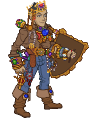
        
        
            **Skin**
            Fortune Hunter Eric
        
    
    
        
            ID: 2035**Powerful Shove**Let's keep a safe distance. Way over there sounds perfect.  Increases the knockback effect of Eric's Keep Away ability by 80%.<code>buff_upgrade,80,16132,1</code>
        
        
            **Feat**
            Powerful Shove
            Eric
        
    
    
        
            ID: 20**Large Bounty Contract**Claim a bounty worth 8 hours of offline gold earnings and event tokens.<code>seconds_worth_of_gold,28800</code>
        
        
            **Buff**
            Large Bounty Contract
            x6
        
    
    
        
            ID: 34**Large Blacksmithing Contract**Contract a master blacksmith to improve a piece of equipment owned by one of your Champions.<code>level_up_loot,24</code>
        
        
            **Buff**
            Large Blacksmithing Contract
            x6
        
    
    
        
            ID: 647**Platinum Eric Chest**Loot for: Eric<code>"for_crusaders":[157]</code>
        
        
            **Chest**
            Platinum Eric Chest
            x14 (Shinies x1)
        
    

ID: 602

### Goldie the Sprite Familiar Pack - 1,680 Platinum  
Date of release: 30 Jul 2025

> Collect your own Goldie the Sprite Familiar!

Contents:

    
        
            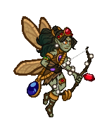ID: 276**Goldie the Sprite**She valiantly defends the gold hoard of the dragon's lair in her forest.
        
        
            **Familiar**
            Goldie the Sprite
        
    
    
        
            ID: 4**Huge Potion of Giant's Strength**A transparent potion in which floats the sliver of a giant's fingernail.<code>global_dps_multiplier_mult,900</code>
        
        
            **Buff**
            Huge Potion of Giant's Strength
            x4
        
    
    
        
            ID: 8**Huge Potion of Clairvoyance**Three eyeballs bob in this yellowish potion.<code>gold_multiplier_mult,400</code>
        
        
            **Buff**
            Huge Potion of Clairvoyance
            x4
        
    
    
        
            ID: 36**Potion of Polish**This shiny, silver liquid clings to the edge of the bottle in an unusual way.<code>shiny_loot,1</code>
        
        
            **Buff**
            Potion of Polish
            x1
        
    
    
        
            ID: 77**Huge Potion of Speed**This potion's yellow fluid is streaked with black and swirls on its own.<code>time_scale,2.75</code>
        
        
            **Buff**
            Huge Potion of Speed
            x4
        
    

ID: 605

### Ascended Baldric Theme Pack - 3,830 Platinum  
Date of release: 06 Aug 2025

> Unlock Baldric along with an exclusive Ascended Skin & Familiar!

Contents:

    
        
            ID: 165**Baldric**
        
        
            **Champion Unlock**
            Baldric
        
    
    
        
            ID: 585**Ascended Baldric (Baldric)**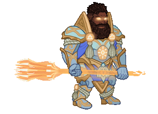
        
        
            **Skin**
            Ascended Baldric
        
    
    
        
            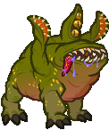ID: 279**Uggie the Otyugh**Loves giving hugs and eating trash.
        
        
            **Familiar**
            Uggie the Otyugh
        
    
    
        
            ID: 2275**Feat**???: 2275
        
        
            **Feat**
            ???: 2275
        
    
    
        
            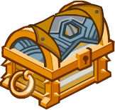ID: 663**Platinum Baldric Chest**Loot for: Baldric<code>"for_crusaders":[165]</code>
        
        
            **Chest**
            Platinum Baldric Chest
            x32 (Shinies x2)
        
    
    
        
            ID: 1723**Potion of the Gem Hunter**Increases the gem drops from bosses by 50%<code>increase_boss_gems_percent,50</code>
        
        
            **Buff**
            Potion of the Gem Hunter
            x1
        
    

ID: 606

### Quandary the Sphinx of Wonder Familiar Pack - 1,680 Platinum  
Date of release: 06 Aug 2025

> Collect your own Quandary the Sphinx of Wonder Familiar!

Contents:

    
        
            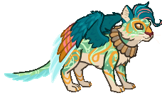ID: 280**Quandary the Sphinx of Wonder**Mystifying even to themselves.
        
        
            **Familiar**
            Quandary the Sphinx of Wonder
        
    
    
        
            ID: 4**Huge Potion of Giant's Strength**A transparent potion in which floats the sliver of a giant's fingernail.<code>global_dps_multiplier_mult,900</code>
        
        
            **Buff**
            Huge Potion of Giant's Strength
            x4
        
    
    
        
            ID: 8**Huge Potion of Clairvoyance**Three eyeballs bob in this yellowish potion.<code>gold_multiplier_mult,400</code>
        
        
            **Buff**
            Huge Potion of Clairvoyance
            x4
        
    
    
        
            ID: 36**Potion of Polish**This shiny, silver liquid clings to the edge of the bottle in an unusual way.<code>shiny_loot,1</code>
        
        
            **Buff**
            Potion of Polish
            x1
        
    
    
        
            ID: 77**Huge Potion of Speed**This potion's yellow fluid is streaked with black and swirls on its own.<code>time_scale,2.75</code>
        
        
            **Buff**
            Huge Potion of Speed
            x4
        
    

ID: 608

### Kith'rak Lae'zel Skin & Feat Pack - 1,680 Platinum  
Date of release: 06 Aug 2025

> Unlock Lae'zel along with her exclusive Kith'rak Skin & Feat!

Contents:

    
        
            ID: 128**Lae'zel (Seat 2)**
        
        
            **Champion Unlock**
            Lae'zel
        
    
    
        
            ID: 503**Kith'rak Lae'zel (Lae'zel)**
        
        
            **Skin**
            Kith'rak Lae'zel
        
    
    
        
            ID: 2222**Queen's Blade**Vlaakith gha'g shkath zai!  Increases the effect of Lae'zel's Ceremorphosis ability by 80%. (Prestack)<code>buff_upgrade,80,12114</code>
        
        
            **Feat**
            Queen's Blade
            Lae'zel
        
    
    
        
            ID: 20**Large Bounty Contract**Claim a bounty worth 8 hours of offline gold earnings and event tokens.<code>seconds_worth_of_gold,28800</code>
        
        
            **Buff**
            Large Bounty Contract
            x6
        
    
    
        
            ID: 34**Large Blacksmithing Contract**Contract a master blacksmith to improve a piece of equipment owned by one of your Champions.<code>level_up_loot,24</code>
        
        
            **Buff**
            Large Blacksmithing Contract
            x6
        
    
    
        
            ID: 458**Platinum Lae'zel Chest**Loot for: Lae'zel<code>"for_crusaders":[128]</code>
        
        
            **Chest**
            Platinum Lae'zel Chest
            x14 (Shinies x1)
        
    

ID: 609

### Blind Justice Ishi Skin & Feat Pack - 1,680 Platinum  
Date of release: 06 Aug 2025

> Unlock Ishi along with her exclusive Blind Justice Skin & Feat!

Contents:

    
        
            ID: 31**Ishi (Seat 4)**
        
        
            **Champion Unlock**
            Ishi
        
    
    
        
            ID: 588**Blind Justice Ishi (Ishi)**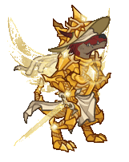
        
        
            **Skin**
            Blind Justice Ishi
        
    
    
        
            ID: 1577**Enemy Enumeration**Five stabs, six stabs, seven stabs, MORE!  Increases the effect of Ishi's Faster, Harder, Stronger ability by 80%.<code>buff_upgrade,80,16530</code>
        
        
            **Feat**
            Enemy Enumeration
            Ishi
        
    
    
        
            ID: 20**Large Bounty Contract**Claim a bounty worth 8 hours of offline gold earnings and event tokens.<code>seconds_worth_of_gold,28800</code>
        
        
            **Buff**
            Large Bounty Contract
            x6
        
    
    
        
            ID: 34**Large Blacksmithing Contract**Contract a master blacksmith to improve a piece of equipment owned by one of your Champions.<code>level_up_loot,24</code>
        
        
            **Buff**
            Large Blacksmithing Contract
            x6
        
    
    
        
            ID: 58**Platinum Ishi Chest**Loot for: Ishi<code>"for_crusaders":[31]</code>
        
        
            **Chest**
            Platinum Ishi Chest
            x14 (Shinies x1)
        
    

ID: 607

### Seven Heavens Lazaapz Theme Pack - 3,830 Platinum  
Date of release: 13 Aug 2025

> Unlock Lazaapz along with an exclusive Seven Heavens Skin & Familiar!

Contents:

    
        
            ID: 66**Lazaapz (Seat 9)**
        
        
            **Champion Unlock**
            Lazaapz
        
    
    
        
            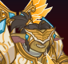ID: 586**Seven Heavens Lazaapz (Lazaapz)**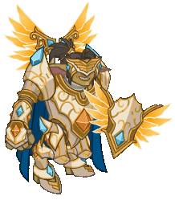
        
        
            **Skin**
            Seven Heavens Lazaapz
        
    
    
        
            ID: 281**Aurelia the Clockwork Hollyphant**Made by Mechanus' finest artificers.
        
        
            **Familiar**
            Aurelia the Clockwork Hollyphant
        
    
    
        
            ID: 2278**Feat**???: 2278
        
        
            **Feat**
            ???: 2278
        
    
    
        
            ID: 191**Platinum Lazaapz Chest**Loot for: Lazaapz<code>"for_crusaders":[66]</code>
        
        
            **Chest**
            Platinum Lazaapz Chest
            x32 (Shinies x2)
        
    
    
        
            ID: 1723**Potion of the Gem Hunter**Increases the gem drops from bosses by 50%<code>increase_boss_gems_percent,50</code>
        
        
            **Buff**
            Potion of the Gem Hunter
            x1
        
    

ID: 610

### Arborean Hunter Shandie Skin & Feat Pack - 1,680 Platinum  
Date of release: 13 Aug 2025

> Unlock Shandie along with her exclusive Arborean Hunter Skin & Feat!

Contents:

    
        
            ID: 47**Shandie (Seat 6)**
        
        
            **Champion Unlock**
            Shandie
        
    
    
        
            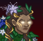ID: 589**Arborean Hunter Shandie (Shandie)**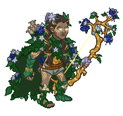
        
        
            **Skin**
            Arborean Hunter Shandie
        
    
    
        
            ID: 2248**True Shot**I never miss.  Increases the effect of Shandie's specializations by 80%.<code>buff_upgrades,80,9730,9731,9732</code>
        
        
            **Feat**
            True Shot
            Shandie
        
    
    
        
            ID: 20**Large Bounty Contract**Claim a bounty worth 8 hours of offline gold earnings and event tokens.<code>seconds_worth_of_gold,28800</code>
        
        
            **Buff**
            Large Bounty Contract
            x6
        
    
    
        
            ID: 34**Large Blacksmithing Contract**Contract a master blacksmith to improve a piece of equipment owned by one of your Champions.<code>level_up_loot,24</code>
        
        
            **Buff**
            Large Blacksmithing Contract
            x6
        
    
    
        
            ID: 104**Platinum Shandie Chest**Loot for: Shandie<code>"for_crusaders":[47]</code>
        
        
            **Chest**
            Platinum Shandie Chest
            x14 (Shinies x1)
        
    

ID: 611

### Radiance the Pegasus Familiar Pack - 2,380 Platinum  
Date of release: 13 Aug 2025

> Collect your own Radiance the Pegasus Familiar!

Contents:

    
        
            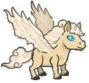ID: 282**Radiance the Pegasus Familiar**From the skies of the Seven Heavens.
        
        
            **Familiar**
            Radiance the Pegasus Familiar
        
    
    
        
            ID: 4**Huge Potion of Giant's Strength**A transparent potion in which floats the sliver of a giant's fingernail.<code>global_dps_multiplier_mult,900</code>
        
        
            **Buff**
            Huge Potion of Giant's Strength
            x6
        
    
    
        
            ID: 8**Huge Potion of Clairvoyance**Three eyeballs bob in this yellowish potion.<code>gold_multiplier_mult,400</code>
        
        
            **Buff**
            Huge Potion of Clairvoyance
            x6
        
    
    
        
            ID: 36**Potion of Polish**This shiny, silver liquid clings to the edge of the bottle in an unusual way.<code>shiny_loot,1</code>
        
        
            **Buff**
            Potion of Polish
            x1
        
    
    
        
            ID: 40**Huge Potion of Fire Breath**The orange liquid in this vial flickers and smoke fills the top of the container.<code>click_damage_seconds_global_dps,600</code>
        
        
            **Buff**
            Huge Potion of Fire Breath
            x6
        
    
    
        
            ID: 77**Huge Potion of Speed**This potion's yellow fluid is streaked with black and swirls on its own.<code>time_scale,2.75</code>
        
        
            **Buff**
            Huge Potion of Speed
            x6
        
    
    
        
            ID: 1721**Potion of the Gold Hunter**Increase Gold Find by 100%<code>gold_multiplier_mult,100</code>
        
        
            **Buff**
            Potion of the Gold Hunter
            x1
        
    
    
        
            **Modron Component Pieces**
        
        
            **Modron Component Pieces**
            x2,000
        
    

ID: 612

### Weave Anchor Volo Skin & Feat Pack - 1,680 Platinum  
Date of release: 27 Aug 2025

> Unlock Volo along with his exclusive Weave Anchor Skin & Feat!

Contents:

    
        
            ID: 159**Volo (Seat 9)**
        
        
            **Champion Unlock**
            Volo
        
    
    
        
            ID: 590**Weave Anchor Volo (Volo)**
        
        
            **Skin**
            Weave Anchor Volo
        
    
    
        
            ID: 2249**Unknown Power**You ask why Elminster is so concerned with my wellbeing? He's a true fan, of course! Why else?  Increases the base effect of Volo's specializations by 80%. (Prestack)<code>buff_upgrade,80,16554,0 buff_upgrade,80,16555,0 buff_upgrade,80,16556,0</code>
        
        
            **Feat**
            Unknown Power
            Volo
        
    
    
        
            ID: 20**Large Bounty Contract**Claim a bounty worth 8 hours of offline gold earnings and event tokens.<code>seconds_worth_of_gold,28800</code>
        
        
            **Buff**
            Large Bounty Contract
            x6
        
    
    
        
            ID: 34**Large Blacksmithing Contract**Contract a master blacksmith to improve a piece of equipment owned by one of your Champions.<code>level_up_loot,24</code>
        
        
            **Buff**
            Large Blacksmithing Contract
            x6
        
    
    
        
            ID: 651**Platinum Volo Chest**Loot for: Volo<code>"for_crusaders":[159]</code>
        
        
            **Chest**
            Platinum Volo Chest
            x14 (Shinies x1)
        
    

ID: 613

### Solar Scion Drizzt Skin & Feat Pack - 1,680 Platinum  
Date of release: 27 Aug 2025

> Collect an exclusive Solar Scion Skin & Feat for Drizzt!

Contents:

    
        
            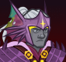ID: 591**Solar Scion Drizzt (Drizzt)**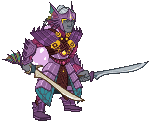
        
        
            **Skin**
            Solar Scion Drizzt
        
    
    
        
            ID: 2250**Eternal Companions**I am truly blessed to know them as dear friends.  Increases the bonus damage of Drizzt's Companions of the Hall ability by 80%.<code>buff_upgrade,80,11514</code>
        
        
            **Feat**
            Eternal Companions
            Drizzt
        
    
    
        
            ID: 20**Large Bounty Contract**Claim a bounty worth 8 hours of offline gold earnings and event tokens.<code>seconds_worth_of_gold,28800</code>
        
        
            **Buff**
            Large Bounty Contract
            x6
        
    
    
        
            ID: 34**Large Blacksmithing Contract**Contract a master blacksmith to improve a piece of equipment owned by one of your Champions.<code>level_up_loot,24</code>
        
        
            **Buff**
            Large Blacksmithing Contract
            x6
        
    
    
        
            ID: 474**Platinum Drizzt Chest**Loot for: Drizzt<code>"for_crusaders":[18]</code>
        
        
            **Chest**
            Platinum Drizzt Chest
            x14 (Shinies x1)
        
    

ID: 586

### Mythic Cazrin Theme Pack - 3,830 Platinum  
Date of release: 03 Sept 2025

> Unlock Cazrin along with an exclusive Mythic Skin & Familiar!

Contents:

    
        
            ID: 166**Cazrin**
        
        
            **Champion Unlock**
            Cazrin
        
    
    
        
            ID: 594**Mythic Cazrin (Cazrin)**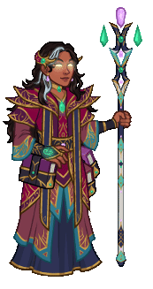
        
        
            **Skin**
            Mythic Cazrin
        
    
    
        
            ID: 284**Keeper the Spellbook**Little secret keepers.
        
        
            **Familiar**
            Keeper the Spellbook
        
    
    
        
            ID: 2290**Feat**???: 2290
        
        
            **Feat**
            ???: 2290
        
    
    
        
            ID: 665**Platinum Cazrin Chest**Loot for: Cazrin<code>"for_crusaders":[166]</code>
        
        
            **Chest**
            Platinum Cazrin Chest
            x32 (Shinies x2)
        
    
    
        
            ID: 1723**Potion of the Gem Hunter**Increases the gem drops from bosses by 50%<code>increase_boss_gems_percent,50</code>
        
        
            **Buff**
            Potion of the Gem Hunter
            x1
        
    

ID: 597

### Heroic Bobby Skin & Feat Pack - 1,680 Platinum  
Date of release: 03 Sept 2025

> Unlock Bobby along with his exclusive Heroic Skin & Feat!

Contents:

    
        
            ID: 152**Bobby (Seat 12)**
        
        
            **Champion Unlock**
            Bobby
        
    
    
        
            ID: 595**Heroic Bobby (Bobby)**
        
        
            **Skin**
            Heroic Bobby
        
    
    
        
            ID: 2227**TBD Bobby Feat (Do not translate)**
        
        
            **Feat**
            TBD Bobby Feat (Do not translate)
            Bobby
        
    
    
        
            ID: 20**Large Bounty Contract**Claim a bounty worth 8 hours of offline gold earnings and event tokens.<code>seconds_worth_of_gold,28800</code>
        
        
            **Buff**
            Large Bounty Contract
            x6
        
    
    
        
            ID: 34**Large Blacksmithing Contract**Contract a master blacksmith to improve a piece of equipment owned by one of your Champions.<code>level_up_loot,24</code>
        
        
            **Buff**
            Large Blacksmithing Contract
            x6
        
    
    
        
            ID: 575**Platinum Bobby Chest**Loot for: Bobby<code>"for_crusaders":[152]</code>
        
        
            **Chest**
            Platinum Bobby Chest
            x14 (Shinies x1)
        
    

ID: 603

### Founder's Pack VIII - 3,360 Platinum  
Date of release: 03 Sept 2025

> Get an INCREDIBLE deal to gear up and start your adventures in the Forgotten Realms quickly!

Contents:

    
        
            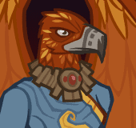ID: 596**???**
        
        
            **???**
            skin
            ID: 596
        
    
    
        
            ID: 274**TBD (Do not translate)**
        
        
            **Familiar**
            TBD (Do not translate)
        
    
    
        
            ID: 2**Platinum Chest**<code>"for_crusaders":[]</code>
        
        
            **Chest**
            Platinum Chest
            x84 (Shinies x5)
        
    
    
        
            ID: 4**Huge Potion of Giant's Strength**A transparent potion in which floats the sliver of a giant's fingernail.<code>global_dps_multiplier_mult,900</code>
        
        
            **Buff**
            Huge Potion of Giant's Strength
            x2
        
    
    
        
            ID: 8**Huge Potion of Clairvoyance**Three eyeballs bob in this yellowish potion.<code>gold_multiplier_mult,400</code>
        
        
            **Buff**
            Huge Potion of Clairvoyance
            x2
        
    
    
        
            ID: 20**Large Bounty Contract**Claim a bounty worth 8 hours of offline gold earnings and event tokens.<code>seconds_worth_of_gold,28800</code>
        
        
            **Buff**
            Large Bounty Contract
            x2
        
    
    
        
            ID: 34**Large Blacksmithing Contract**Contract a master blacksmith to improve a piece of equipment owned by one of your Champions.<code>level_up_loot,24</code>
        
        
            **Buff**
            Large Blacksmithing Contract
            x2
        
    
    
        
            ID: 40**Huge Potion of Fire Breath**The orange liquid in this vial flickers and smoke fills the top of the container.<code>click_damage_seconds_global_dps,600</code>
        
        
            **Buff**
            Huge Potion of Fire Breath
            x2
        
    
    
        
            ID: 1723**Potion of the Gem Hunter**Increases the gem drops from bosses by 50%<code>increase_boss_gems_percent,50</code>
        
        
            **Buff**
            Potion of the Gem Hunter
            x1
        
    
    
        
            ID: 1798**Epic Golden Potion**Gold and purple liquid swirl around each other as if dancing.<code>golden_loot,1</code>
        
        
            **Buff**
            Epic Golden Potion
            x1
        
    
    
        
            **Gems**
        
        
            **Gems**
            x5,000
        
    

ID: 614

### Legendkeeper Alyndra Theme Pack - 3,830 Platinum  
Date of release: 10 Sept 2025

> Unlock Alyndra along with an exclusive Legendkeeper Skin & Familiar!

Contents:

    
        
            ID: 77**Alyndra (Seat 6)**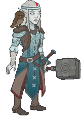
        
        
            **Champion Unlock**
            Alyndra
        
    
    
        
            ID: 597**Legendkeeper Alyndra (Alyndra)**
        
        
            **Skin**
            Legendkeeper Alyndra
        
    
    
        
            ID: 278**Professor Griff**The judgiest judge to ever judge.
        
        
            **Familiar**
            Professor Griff
        
    
    
        
            ID: 1587**Feat**???: 1587
        
        
            **Feat**
            ???: 1587
        
    
    
        
            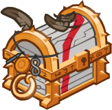ID: 261**Platinum Alyndra Chest**Loot for: Alyndra<code>"for_crusaders":[77]</code>
        
        
            **Chest**
            Platinum Alyndra Chest
            x32 (Shinies x2)
        
    
    
        
            ID: 1723**Potion of the Gem Hunter**Increases the gem drops from bosses by 50%<code>increase_boss_gems_percent,50</code>
        
        
            **Buff**
            Potion of the Gem Hunter
            x1
        
    

ID: 615

### Mythic Torogar Skin & Feat Pack - 1,680 Platinum  
Date of release: 10 Sept 2025

> Unlock Torogar along with his exclusive Mythic Skin & Feat!

Contents:

    
        
            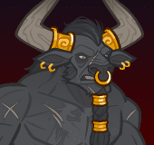ID: 69**Torogar (Seat 10)**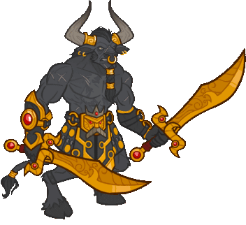
        
        
            **Champion Unlock**
            Torogar
        
    
    
        
            ID: 598**Mythic Torogar (Torogar)**
        
        
            **Skin**
            Mythic Torogar
        
    
    
        
            ID: 2009**TBD Torogar Feat (Do not translate)**
        
        
            **Feat**
            TBD Torogar Feat (Do not translate)
            Torogar
        
    
    
        
            ID: 20**Large Bounty Contract**Claim a bounty worth 8 hours of offline gold earnings and event tokens.<code>seconds_worth_of_gold,28800</code>
        
        
            **Buff**
            Large Bounty Contract
            x6
        
    
    
        
            ID: 34**Large Blacksmithing Contract**Contract a master blacksmith to improve a piece of equipment owned by one of your Champions.<code>level_up_loot,24</code>
        
        
            **Buff**
            Large Blacksmithing Contract
            x6
        
    
    
        
            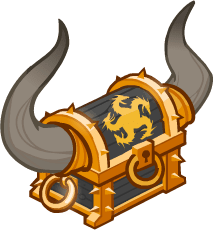ID: 245**Platinum Torogar Chest**Loot for: Torogar<code>"for_crusaders":[69]</code>
        
        
            **Chest**
            Platinum Torogar Chest
            x14 (Shinies x1)
        
    

ID: 616

### Divine Certainty Skin & Feat Pack - 1,680 Platinum  
Date of release: 10 Sept 2025

> Unlock Certainty along with her exclusive Divine Skin & Feat!

Contents:

    
        
            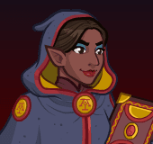ID: 138**Certainty (Seat 5)**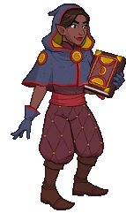
        
        
            **Champion Unlock**
            Certainty
        
    
    
        
            ID: 599**Divine Certainty (Certainty)**
        
        
            **Skin**
            Divine Certainty
        
    
    
        
            ID: 2260**TBD Certainty Feat (Do not translate)**
        
        
            **Feat**
            TBD Certainty Feat (Do not translate)
            Certainty
        
    
    
        
            ID: 20**Large Bounty Contract**Claim a bounty worth 8 hours of offline gold earnings and event tokens.<code>seconds_worth_of_gold,28800</code>
        
        
            **Buff**
            Large Bounty Contract
            x6
        
    
    
        
            ID: 34**Large Blacksmithing Contract**Contract a master blacksmith to improve a piece of equipment owned by one of your Champions.<code>level_up_loot,24</code>
        
        
            **Buff**
            Large Blacksmithing Contract
            x6
        
    
    
        
            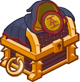ID: 547**Platinum Certainty Chest**Loot for: Certainty<code>"for_crusaders":[138]</code>
        
        
            **Chest**
            Platinum Certainty Chest
            x14 (Shinies x1)
        
    

ID: 617

### Berserker Wulfgar Skin & Feat Pack - 1,680 Platinum  
Date of release: 17 Sept 2025

> Unlock Wulfgar along with his exclusive Berserker Skin & Feat!

Contents:

    
        
            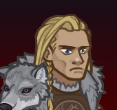ID: 32**Wulfgar (Seat 10)**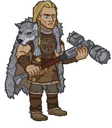
        
        
            **Champion Unlock**
            Wulfgar
        
    
    
        
            ID: 600**Berserker Wulfgar (Wulfgar)**
        
        
            **Skin**
            Berserker Wulfgar
        
    
    
        
            ID: 2261**TBD Wulfgar Feat (Do not translate)**
        
        
            **Feat**
            TBD Wulfgar Feat (Do not translate)
            Wulfgar
        
    
    
        
            ID: 20**Large Bounty Contract**Claim a bounty worth 8 hours of offline gold earnings and event tokens.<code>seconds_worth_of_gold,28800</code>
        
        
            **Buff**
            Large Bounty Contract
            x6
        
    
    
        
            ID: 34**Large Blacksmithing Contract**Contract a master blacksmith to improve a piece of equipment owned by one of your Champions.<code>level_up_loot,24</code>
        
        
            **Buff**
            Large Blacksmithing Contract
            x6
        
    
    
        
            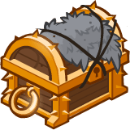ID: 68**Platinum Wulfgar Chest**Loot for: Wulfgar<code>"for_crusaders":[32]</code>
        
        
            **Chest**
            Platinum Wulfgar Chest
            x14 (Shinies x1)
        
    

ID: 618

### Nightmare D'hani Skin & Feat Pack - 1,680 Platinum  
Date of release: 17 Sept 2025

> Unlock D'hani along with her exclusive Nightmare Skin & Feat!

Contents:

    
        
            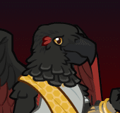ID: 89**D'hani (Seat 1)**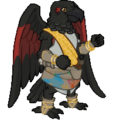
        
        
            **Champion Unlock**
            D'hani
        
    
    
        
            ID: 601**Nightmare D'hani (D'hani)**
        
        
            **Skin**
            Nightmare D'hani
        
    
    
        
            ID: 2262**TBD D'hani Feat (Do not translate)**
        
        
            **Feat**
            TBD D'hani Feat (Do not translate)
            D'hani
        
    
    
        
            ID: 20**Large Bounty Contract**Claim a bounty worth 8 hours of offline gold earnings and event tokens.<code>seconds_worth_of_gold,28800</code>
        
        
            **Buff**
            Large Bounty Contract
            x6
        
    
    
        
            ID: 34**Large Blacksmithing Contract**Contract a master blacksmith to improve a piece of equipment owned by one of your Champions.<code>level_up_loot,24</code>
        
        
            **Buff**
            Large Blacksmithing Contract
            x6
        
    
    
        
            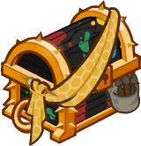ID: 335**Platinum D'hani Chest**Loot for: D'hani<code>"for_crusaders":[89]</code>
        
        
            **Chest**
            Platinum D'hani Chest
            x14 (Shinies x1)
        
    

ID: 619

### Silver Sword of Gith Familiar Pack - 840 Platinum  
Date of release: 24 Sept 2025

> Collect your own Silver Sword of Gith Familiar!

Contents:

    
        
            ID: 283**Animated Silver Sword**A gift. A burden. The sacred blade of shadow's bane.
        
        
            **Familiar**
            Animated Silver Sword
        
    
    
        
            ID: 4**Huge Potion of Giant's Strength**A transparent potion in which floats the sliver of a giant's fingernail.<code>global_dps_multiplier_mult,900</code>
        
        
            **Buff**
            Huge Potion of Giant's Strength
            x2
        
    
    
        
            ID: 8**Huge Potion of Clairvoyance**Three eyeballs bob in this yellowish potion.<code>gold_multiplier_mult,400</code>
        
        
            **Buff**
            Huge Potion of Clairvoyance
            x2
        
    
    
        
            ID: 77**Huge Potion of Speed**This potion's yellow fluid is streaked with black and swirls on its own.<code>time_scale,2.75</code>
        
        
            **Buff**
            Huge Potion of Speed
            x2
        
    

ID: 621

### King of Shadows Origin Theme Pack - $27.99  
Date of release: 01 Oct 2025

> Unlock King of Shadows along with an exclusive Guardian of Illefarn Skin, Familiar & Familiar Skin!

ⓘ *Note: It appears that this pack will only be available for real money instead of Platinum.*

Contents:

    
        
            ID: 168**King of Shadows**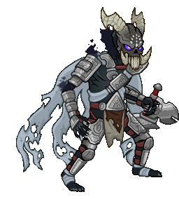
        
        
            **Champion Unlock**
            King of Shadows
        
    
    
        
            ID: 605**Guardian of Illefarn (Windfall)**
        
        
            **Skin**
            Guardian of Illefarn
        
    
    
        
            ID: 285**Ebrath the Illefarn Mastiff**Guardian's Best Friend.
        
        
            **Familiar**
            Ebrath the Illefarn Mastiff
        
    
    
        
            ID: 12**Beholder Sketch Skin**
        
        
            **Familiar Skin**
            Beholder Sketch Skin
        
    
    
        
            ID: 1**Selflessness**Aye, a selfless dwarf I am.  All Champions damage +10%.<code>global_dps_multiplier_mult,10</code>
        
        
            **Feat**
            Selflessness
            Bruenor
        
    
    
        
            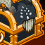ID: 756**Platinum King of Shadows Chest**Loot for: King of Shadows<code>"for_crusaders":[168]</code>
        
        
            **Chest**
            Platinum King of Shadows Chest
            x32 (Shinies x2)
        
    
    
        
            ID: 1723**Potion of the Gem Hunter**Increases the gem drops from bosses by 50%<code>increase_boss_gems_percent,50</code>
        
        
            **Buff**
            Potion of the Gem Hunter
            x1
        
    

ID: 622

### Eminent Astarion Skin & Feat Pack - 1,680 Platinum  
Date of release: 01 Oct 2025

> Unlock Astarion along with his exclusive Eminent Skin & Feat!

Contents:

    
        
            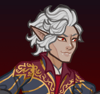ID: 129**Astarion (Seat 10)**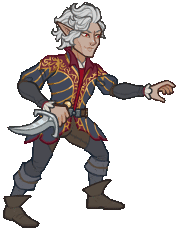
        
        
            **Champion Unlock**
            Astarion
        
    
    
        
            ID: 606**Eminent Astarion (Astarion)**
        
        
            **Skin**
            Eminent Astarion
        
    
    
        
            ID: 2296**TBD Astarion Feat (Do not translate)**
        
        
            **Feat**
            TBD Astarion Feat (Do not translate)
            Astarion
        
    
    
        
            ID: 20**Large Bounty Contract**Claim a bounty worth 8 hours of offline gold earnings and event tokens.<code>seconds_worth_of_gold,28800</code>
        
        
            **Buff**
            Large Bounty Contract
            x6
        
    
    
        
            ID: 34**Large Blacksmithing Contract**Contract a master blacksmith to improve a piece of equipment owned by one of your Champions.<code>level_up_loot,24</code>
        
        
            **Buff**
            Large Blacksmithing Contract
            x6
        
    
    
        
            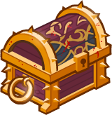ID: 460**Platinum Astarion Chest**Loot for: Astarion<code>"for_crusaders":[129]</code>
        
        
            **Chest**
            Platinum Astarion Chest
            x14 (Shinies x1)
        
    

ID: 624

### Darklord Farideh Theme Pack - 3,830 Platinum  
Date of release: 08 Oct 2025

> Unlock Farideh along with an exclusive Darklord Skin & Familiar!

Contents:

    
        
            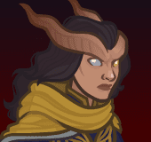ID: 33**Farideh (Seat 7)**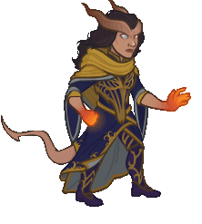
        
        
            **Champion Unlock**
            Farideh
        
    
    
        
            ID: 608**Darklord Farideh (Farideh)**
        
        
            **Skin**
            Darklord Farideh
        
    
    
        
            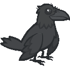ID: 286**Ausir the White Raven**The bright messenger of a dark lady.
        
        
            **Familiar**
            Ausir the White Raven
        
    
    
        
            ID: 1**Selflessness**Aye, a selfless dwarf I am.  All Champions damage +10%.<code>global_dps_multiplier_mult,10</code>
        
        
            **Feat**
            Selflessness
            Bruenor
        
    
    
        
            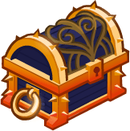ID: 72**Platinum Farideh Chest**Loot for: Farideh<code>"for_crusaders":[33]</code>
        
        
            **Chest**
            Platinum Farideh Chest
            x32 (Shinies x2)
        
    
    
        
            ID: 1723**Potion of the Gem Hunter**Increases the gem drops from bosses by 50%<code>increase_boss_gems_percent,50</code>
        
        
            **Buff**
            Potion of the Gem Hunter
            x1
        
    

ID: 625

### Lord of Undeath Kas Skin & Feat Pack - 1,680 Platinum  
Date of release: 08 Oct 2025

> Unlock Kas along with his exclusive Lord of Undeath Skin & Feat!

Contents:

    
        
            ID: 153**Kas (Seat 6)**
        
        
            **Champion Unlock**
            Kas
        
    
    
        
            ID: 609**Lord of Undeath Kas (Kas)**
        
        
            **Skin**
            Lord of Undeath Kas
        
    
    
        
            ID: 2298**TBD Kas Feat (Do not translate)**
        
        
            **Feat**
            TBD Kas Feat (Do not translate)
            Kas
        
    
    
        
            ID: 20**Large Bounty Contract**Claim a bounty worth 8 hours of offline gold earnings and event tokens.<code>seconds_worth_of_gold,28800</code>
        
        
            **Buff**
            Large Bounty Contract
            x6
        
    
    
        
            ID: 34**Large Blacksmithing Contract**Contract a master blacksmith to improve a piece of equipment owned by one of your Champions.<code>level_up_loot,24</code>
        
        
            **Buff**
            Large Blacksmithing Contract
            x6
        
    
    
        
            ID: 577**Platinum Kas Chest**Loot for: Kas<code>"for_crusaders":[153]</code>
        
        
            **Chest**
            Platinum Kas Chest
            x14 (Shinies x1)
        
    

ID: 626

### Shadowfell Ezmerelda Skin & Feat Pack - 1,680 Platinum  
Date of release: 08 Oct 2025

> Unlock Ezmerelda along with her exclusive Shadowfell Skin & Feat!

Contents:

    
        
            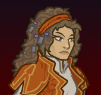ID: 70**Ezmerelda (Seat 1)**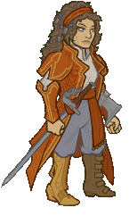
        
        
            **Champion Unlock**
            Ezmerelda
        
    
    
        
            ID: 610**Shadowfell Ezmerelda (Ezmerelda)**
        
        
            **Skin**
            Shadowfell Ezmerelda
        
    
    
        
            ID: 2299**TBD Ezmerelda Feat (Do not translate)**
        
        
            **Feat**
            TBD Ezmerelda Feat (Do not translate)
            Ezmerelda
        
    
    
        
            ID: 20**Large Bounty Contract**Claim a bounty worth 8 hours of offline gold earnings and event tokens.<code>seconds_worth_of_gold,28800</code>
        
        
            **Buff**
            Large Bounty Contract
            x6
        
    
    
        
            ID: 34**Large Blacksmithing Contract**Contract a master blacksmith to improve a piece of equipment owned by one of your Champions.<code>level_up_loot,24</code>
        
        
            **Buff**
            Large Blacksmithing Contract
            x6
        
    
    
        
            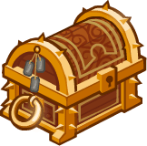ID: 247**Platinum Ezmerelda Chest**Loot for: Ezmerelda<code>"for_crusaders":[70]</code>
        
        
            **Chest**
            Platinum Ezmerelda Chest
            x14 (Shinies x1)
        
    

ID: 628

### Nightwalker Krond Skin & Feat Pack - 1,680 Platinum  
Date of release: 15 Oct 2025

> Unlock Krond along with his exclusive Nightwalker Skin & Feat!

Contents:

    
        
            ID: 15**Krond (Seat 6)**
        
        
            **Champion Unlock**
            Krond
        
    
    
        
            ID: 612**Nightwalker Krond (Krond)**
        
        
            **Skin**
            Nightwalker Krond
        
    
    
        
            ID: 2301**TBD Krond Feat (Do not translate)**
        
        
            **Feat**
            TBD Krond Feat (Do not translate)
            Krond
        
    
    
        
            ID: 20**Large Bounty Contract**Claim a bounty worth 8 hours of offline gold earnings and event tokens.<code>seconds_worth_of_gold,28800</code>
        
        
            **Buff**
            Large Bounty Contract
            x6
        
    
    
        
            ID: 34**Large Blacksmithing Contract**Contract a master blacksmith to improve a piece of equipment owned by one of your Champions.<code>level_up_loot,24</code>
        
        
            **Buff**
            Large Blacksmithing Contract
            x6
        
    
    
        
            ID: 6**Platinum Krond Chest**Loot for: Krond<code>"for_crusaders":[15]</code>
        
        
            **Chest**
            Platinum Krond Chest
            x14 (Shinies x1)
        
    

ID: 629

### Umbra the Shadow Dragon Familiar Pack - 1,680 Platinum  
Date of release: 22 Oct 2025

> Collect your own Umbra the Shadow Dragon familiar!

Contents:

    
        
            ID: 287**Umbra the Shadow Dragon**Beware her dark breath weapon - you will rise in her service after death.
        
        
            **Familiar**
            Umbra the Shadow Dragon
        
    
    
        
            ID: 4**Huge Potion of Giant's Strength**A transparent potion in which floats the sliver of a giant's fingernail.<code>global_dps_multiplier_mult,900</code>
        
        
            **Buff**
            Huge Potion of Giant's Strength
            x4
        
    
    
        
            ID: 8**Huge Potion of Clairvoyance**Three eyeballs bob in this yellowish potion.<code>gold_multiplier_mult,400</code>
        
        
            **Buff**
            Huge Potion of Clairvoyance
            x4
        
    
    
        
            ID: 36**Potion of Polish**This shiny, silver liquid clings to the edge of the bottle in an unusual way.<code>shiny_loot,1</code>
        
        
            **Buff**
            Potion of Polish
            x1
        
    
    
        
            ID: 77**Huge Potion of Speed**This potion's yellow fluid is streaked with black and swirls on its own.<code>time_scale,2.75</code>
        
        
            **Buff**
            Huge Potion of Speed
            x4
        
    

ID: 630

### Shadow-Cursed Halsin Skin & Feat Pack - 1,680 Platinum  
Date of release: 29 Oct 2025

> Unlock Halsin along with his exclusive Shadow-Cursed Skin & Feat!

Contents:

    
        
            ID: 156**Halsin (Seat 3)**
        
        
            **Champion Unlock**
            Halsin
        
    
    
        
            ID: 615**Shadow-Cursed Halsin (Halsin)**
        
        
            **Skin**
            Shadow-Cursed Halsin
        
    
    
        
            ID: 2302**TBD Halsin Feat (Do not translate)**
        
        
            **Feat**
            TBD Halsin Feat (Do not translate)
            Halsin
        
    
    
        
            ID: 20**Large Bounty Contract**Claim a bounty worth 8 hours of offline gold earnings and event tokens.<code>seconds_worth_of_gold,28800</code>
        
        
            **Buff**
            Large Bounty Contract
            x6
        
    
    
        
            ID: 34**Large Blacksmithing Contract**Contract a master blacksmith to improve a piece of equipment owned by one of your Champions.<code>level_up_loot,24</code>
        
        
            **Buff**
            Large Blacksmithing Contract
            x6
        
    
    
        
            ID: 645**Platinum Halsin Chest**Loot for: Halsin<code>"for_crusaders":[156]</code>
        
        
            **Chest**
            Platinum Halsin Chest
            x14 (Shinies x1)
        
    

ID: 631

### Dark Urge Slayer Familiar & Feat Pack - 1,680 Platinum  
Date of release: 29 Oct 2025

> Collect a Feat for The Dark Urge along with an exclusive Dark Urge-themed familiar!

Contents:

    
        
            ID: 288**Form of the Slayer**A form for Bhaal's chosen…
        
        
            **Familiar**
            Form of the Slayer
        
    
    
        
            ID: 2303**TBD The Dark Urge Feat (Do not translate)**
        
        
            **Feat**
            TBD The Dark Urge Feat (Do not translate)
            Dark Urge
        
    
    
        
            ID: 36**Potion of Polish**This shiny, silver liquid clings to the edge of the bottle in an unusual way.<code>shiny_loot,1</code>
        
        
            **Buff**
            Potion of Polish
            x1
        
    
    
        
            ID: 77**Huge Potion of Speed**This potion's yellow fluid is streaked with black and swirls on its own.<code>time_scale,2.75</code>
        
        
            **Buff**
            Huge Potion of Speed
            x2
        
    
    
        
            ID: 1712**Potion of the Hunter**Increase Global Damage by 100%<code>global_dps_multiplier_mult,100</code>
        
        
            **Buff**
            Potion of the Hunter
            x1
        
    

[Back to Top](#top)

*Last Modified: {{ site.time }}*