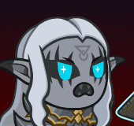
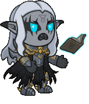
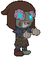
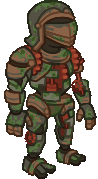
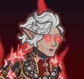
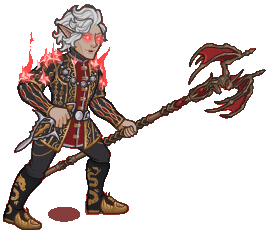
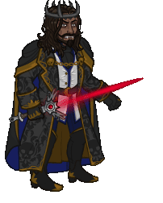
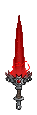

[Back to Main](index.md)

# Premium Packs and DLC

Upcoming real-money shop items.

### Chibi Gale Skin & Feat Pack - $11.99  
Date of release: 25 Sept 2024

> Unlock Gale along with his exclusive Chibi Skin & Feat!

Contents:

    
        
            ID: 147**Gale (Seat 1)**
        
        
            **Champion Unlock**
            Gale
        
    
    
        
            ID: 470**Chibi Gale (Gale)**
        
        
            **Skin**
            Chibi Gale
        
    
    
        
            ID: 1889**Hope of the Weave**Just stare at the stars with me a bit longer.<code>buff_upgrade,80,14572</code>
        
        
            **Feat**
            Hope of the Weave
            Gale (80% Netherese Orb)
        
    
    
        
            ID: 34**Large Blacksmithing Contract**Contract a master blacksmith to improve a piece of equipment owned by one of your Champions.<code>level_up_loot,24</code>
        
        
            **Buff**
            Large Blacksmithing Contract
            x6
        
    
    
        
            ID: 20**Large Bounty Contract**Claim a bounty worth 8 hours of offline gold earnings and event tokens.<code>seconds_worth_of_gold,28800</code>
        
        
            **Buff**
            Large Bounty Contract
            x6
        
    
    
        
            ID: 565**Gold Gale Chest**Loot for: Gale<code>"for_crusaders":[147]</code>
        
        
            **Chest**
            Gold Gale Chest
            x7 (Shinies x1)
        
    

### Plushie BBEG Skin & Feat Pack - $11.99  
Date of release: 25 Sept 2024

> Unlock BBEG along with his exclusive Plushie Skin & Feat!

Contents:

    
        
            ID: 125**BBEG (Seat 3)**
        
        
            **Champion Unlock**
            BBEG
        
    
    
        
            ID: 471**Plushie BBEG (BBEG)**
        
        
            **Skin**
            Plushie BBEG
        
    
    
        
            ID: 1348**Vicious Damage**'Now you face me at my true potential! Victory WILL be mine!'<code>hero_dps_multiplier_mult,400 vicious_damage,10</code>
        
        
            **Feat**
            Vicious Damage
            BBEG (400% Self DPS & Prevent Healing for 10s)
        
    
    
        
            ID: 34**Large Blacksmithing Contract**Contract a master blacksmith to improve a piece of equipment owned by one of your Champions.<code>level_up_loot,24</code>
        
        
            **Buff**
            Large Blacksmithing Contract
            x6
        
    
    
        
            ID: 20**Large Bounty Contract**Claim a bounty worth 8 hours of offline gold earnings and event tokens.<code>seconds_worth_of_gold,28800</code>
        
        
            **Buff**
            Large Bounty Contract
            x6
        
    
    
        
            ID: 452**Gold BBEG Chest**Loot for: BBEG<code>"for_crusaders":[125]</code>
        
        
            **Chest**
            Gold BBEG Chest
            x7 (Shinies x1)
        
    

### Warforged Colossus Familiar Pack - $16.99  
Date of release: 25 Sept 2024

> Collect your very own Warforged Colossus Familiar!

Contents:

    
        
            ID: 221**Warforged Colossus**In the final days of the Last War, House Cannith unleashed its mightiest creations: the warforged colossi.
        
        
            **Familiar**
            Warforged Colossus
        
    
    
        
            ID: 77**Huge Potion of Speed**This potion's yellow fluid is streaked with black and swirls on its own.<code>time_scale,2.75</code>
        
        
            **Buff**
            Huge Potion of Speed
            x6
        
    
    
        
            ID: 4**Huge Potion of Giant's Strength**A transparent potion in which floats the sliver of a giant's fingernail.<code>global_dps_multiplier_mult,900</code>
        
        
            **Buff**
            Huge Potion of Giant's Strength
            x6
        
    
    
        
            ID: 8**Huge Potion of Clairvoyance**Three eyeballs bob in this yellowish potion.<code>gold_multiplier_mult,400</code>
        
        
            **Buff**
            Huge Potion of Clairvoyance
            x6
        
    
    
        
            ID: 40**Huge Potion of Fire Breath**The orange liquid in this vial flickers and smoke fills the top of the container.<code>click_damage_seconds_global_dps,600</code>
        
        
            **Buff**
            Huge Potion of Fire Breath
            x6
        
    
    
        
            ID: 1721**Potion of the Gold Hunter**Increase Gold Find by 100%<code>gold_multiplier_mult,100</code>
        
        
            **Buff**
            Potion of the Gold Hunter
            x1
        
    
    
        
            ID: 8013**Modron Component Pieces**
        
        
            **Modron Component Pieces**
            x2,000
        
    
    
        
            ID: 36**Potion of Polish**This shiny, silver liquid clings to the edge of the bottle in an unusual way.<code>shiny_loot,1</code>
        
        
            **Buff**
            Potion of Polish
            x1
        
    

### Ascended Astarion Skin & Feat Pack - $11.99  
Date of release: 02 Oct 2024

> Unlock Astarion along with his exclusive Ascended Skin & Feat!

Contents:

    
        
            ID: 129**Astarion (Seat 10)**
        
        
            **Champion Unlock**
            Astarion
        
    
    
        
            ID: 473**Ascended Astarion (Astarion)**
        
        
            **Skin**
            Ascended Astarion
        
    
    
        
            ID: 1890**Satiate the Hunger**Darling, anything is better than rats.<code>buff_upgrade_effect_stacks_max_mult,100,12491</code>
        
        
            **Feat**
            Satiate the Hunger
            Astarion (100% Well Fed Stacks)
        
    
    
        
            ID: 34**Large Blacksmithing Contract**Contract a master blacksmith to improve a piece of equipment owned by one of your Champions.<code>level_up_loot,24</code>
        
        
            **Buff**
            Large Blacksmithing Contract
            x6
        
    
    
        
            ID: 20**Large Bounty Contract**Claim a bounty worth 8 hours of offline gold earnings and event tokens.<code>seconds_worth_of_gold,28800</code>
        
        
            **Buff**
            Large Bounty Contract
            x6
        
    
    
        
            ID: 460**Gold Astarion Chest**Loot for: Astarion<code>"for_crusaders":[129]</code>
        
        
            **Chest**
            Gold Astarion Chest
            x7 (Shinies x1)
        
    

### Darklord Kas Theme Pack - $27.99  
Date of release: 02 Oct 2024

> Unlock Kas along with an exclusive Darklord Skin & Bloodsword Familiar!

Contents:

    
        
            ID: 153**Kas (Seat 6)**
        
        
            **Champion Unlock**
            Kas
        
    
    
        
            ID: 474**Darklord Kas (Kas)**
        
        
            **Skin**
            Darklord Kas
        
    
    
        
            ID: 1940**The Sword of Kas**The voice... it's clearer now... it... it wants your death.<code>hero_dps_multiplier_mult,400 effect_def,2105</code>
        
        
            **Feat**
            The Sword of Kas
            Kas (400% Self DPS & Reset Attack CD on Area Change)
        
    
    
        
            ID: 223**Bloodsword**I was his friend. Now, we are mortal enemies...
        
        
            **Familiar**
            Bloodsword
        
    
    
        
            ID: 577**Gold Kas Chest**Loot for: Kas<code>"for_crusaders":[153]</code>
        
        
            **Chest**
            Gold Kas Chest
            x16 (Shinies x2)
        
    
    
        
            ID: 1723**Potion of the Gem Hunter**Increases the gem drops from bosses by 50%<code>increase_boss_gems_percent,50</code>
        
        
            **Buff**
            Potion of the Gem Hunter
            x1
        
    

### Cursed Banshee Thellora Skin & Feat Pack - $11.99  
Date of release: 09 Oct 2024

> Unlock Thellora along with her exclusive Banshee Skin & Feat!

Contents:

    
        
            ID: 139**Thellora (Seat 1)**
        
        
            **Champion Unlock**
            Thellora
        
    
    
        
            ID: 479**Cursed Banshee Thellora (Thellora)**
        
        
            **Skin**
            Cursed Banshee Thellora
        
    
    
        
            ID: 1518**Scholar**A tactician is only as good as their knowledge.<code>increase_ability_score_not_always_on,int,2</code>
        
        
            **Feat**
            Scholar
            Thellora (Stat: +2 Intelligence)
        
    
    
        
            ID: 34**Large Blacksmithing Contract**Contract a master blacksmith to improve a piece of equipment owned by one of your Champions.<code>level_up_loot,24</code>
        
        
            **Buff**
            Large Blacksmithing Contract
            x6
        
    
    
        
            ID: 20**Large Bounty Contract**Claim a bounty worth 8 hours of offline gold earnings and event tokens.<code>seconds_worth_of_gold,28800</code>
        
        
            **Buff**
            Large Bounty Contract
            x6
        
    
    
        
            ID: 549**Gold Thellora Chest**Loot for: Thellora<code>"for_crusaders":[139]</code>
        
        
            **Chest**
            Gold Thellora Chest
            x7 (Shinies x1)
        
    

### Vampire Hunter Voronika Theme Pack - $27.99  
Date of release: 09 Oct 2024

> Unlock Voronika along with an exclusive Vampire Hunter Skin & Ghost Owl Familiar!

Contents:

    
        
            ID: 104**Voronika (Seat 1)**
        
        
            **Champion Unlock**
            Voronika
        
    
    
        
            ID: 472**Vampire Hunter Voronika (Voronika)**
        
        
            **Skin**
            Vampire Hunter Voronika
        
    
    
        
            ID: 1547**Feat**???: 1547
        
        
            **Feat**
            ???: 1547
        
    
    
        
            ID: 222**Glimmer the Ghost Owl**Light as a feather, sharp as a stake.
        
        
            **Familiar**
            Glimmer the Ghost Owl
        
    
    
        
            ID: 365**Gold Voronika Chest**Loot for: Voronika<code>"for_crusaders":[104]</code>
        
        
            **Chest**
            Gold Voronika Chest
            x16 (Shinies x2)
        
    
    
        
            ID: 1723**Potion of the Gem Hunter**Increases the gem drops from bosses by 50%<code>increase_boss_gems_percent,50</code>
        
        
            **Buff**
            Potion of the Gem Hunter
            x1
        
    

### Avatar of Leira Familiar Pack - $11.99  
Date of release: 16 Oct 2024

> Collect your own Mirror Shade Familiar!

Contents:

    
        
            ID: 226**Mirror Shade**When the spirit of a malevolent trickster refuses to enter the afterlife, the spirit sometimes becomes a mirror shade instead.
        
        
            **Familiar**
            Mirror Shade
        
    
    
        
            ID: 1712**Potion of the Hunter**Increase Global Damage by 100%<code>global_dps_multiplier_mult,100</code>
        
        
            **Buff**
            Potion of the Hunter
            x1
        
    
    
        
            ID: 1798**Epic Golden Potion**Gold and purple liquid swirl around each other as if dancing.<code>golden_loot,1</code>
        
        
            **Buff**
            Epic Golden Potion
            x1
        
    
    
        
            ID: 77**Huge Potion of Speed**This potion's yellow fluid is streaked with black and swirls on its own.<code>time_scale,2.75</code>
        
        
            **Buff**
            Huge Potion of Speed
            x2
        
    

### Headless Horseman Kent Skin & Feat Pack - $11.99  
Date of release: 16 Oct 2024

> Unlock Kent along with his exclusive Headless Horseman Skin & Feat!

Contents:

    
        
            ID: 114**Kent (Seat 4)**
        
        
            **Champion Unlock**
            Kent
        
    
    
        
            ID: 475**Headless Horseman Kent (Kent)**
        
        
            **Skin**
            Headless Horseman Kent
        
    
    
        
            ID: 1891**Prodigal Leader**I am, aren't I?!<code>global_dps_multiplier_mult,50</code>
        
        
            **Feat**
            Prodigal Leader
            Kent (50% All Champion Damage)
        
    
    
        
            ID: 34**Large Blacksmithing Contract**Contract a master blacksmith to improve a piece of equipment owned by one of your Champions.<code>level_up_loot,24</code>
        
        
            **Buff**
            Large Blacksmithing Contract
            x6
        
    
    
        
            ID: 20**Large Bounty Contract**Claim a bounty worth 8 hours of offline gold earnings and event tokens.<code>seconds_worth_of_gold,28800</code>
        
        
            **Buff**
            Large Bounty Contract
            x6
        
    
    
        
            ID: 430**Gold Kent Chest**Loot for: Kent<code>"for_crusaders":[114]</code>
        
        
            **Chest**
            Gold Kent Chest
            x7 (Shinies x1)
        
    

### Werebear Donaar Skin & Feat Pack - $11.99  
Date of release: 16 Oct 2024

> Unlock Donaar along with his exclusive Werebear Skin & Feat!

Contents:

    
        
            ID: 34**Donaar (Seat 2)**
        
        
            **Champion Unlock**
            Donaar
        
    
    
        
            ID: 480**Werebear Donaar (Donaar)**
        
        
            **Skin**
            Werebear Donaar
        
    
    
        
            ID: 1892**Fortune's Favor**What do you mean: give up the gold? There was nothing there...<code>gold_multiplier_mult,25</code>
        
        
            **Feat**
            Fortune's Favor
            Donaar (25% Gold)
        
    
    
        
            ID: 34**Large Blacksmithing Contract**Contract a master blacksmith to improve a piece of equipment owned by one of your Champions.<code>level_up_loot,24</code>
        
        
            **Buff**
            Large Blacksmithing Contract
            x6
        
    
    
        
            ID: 20**Large Bounty Contract**Claim a bounty worth 8 hours of offline gold earnings and event tokens.<code>seconds_worth_of_gold,28800</code>
        
        
            **Buff**
            Large Bounty Contract
            x6
        
    
    
        
            ID: 74**Gold Donaar Chest**Loot for: Donaar<code>"for_crusaders":[34]</code>
        
        
            **Chest**
            Gold Donaar Chest
            x7 (Shinies x1)
        
    

### Vampire Hunter Desmond Skin & Feat Pack - $11.99  
Date of release: 23 Oct 2024

> Unlock Desmond along with his exclusive Vampire Hunter Skin & Feat!

Contents:

    
        
            ID: 96**Desmond (Seat 4)**
        
        
            **Champion Unlock**
            Desmond
        
    
    
        
            ID: 481**Vampire Hunter Desmond (Desmond)**
        
        
            **Skin**
            Vampire Hunter Desmond
        
    
    
        
            ID: 1954**Prodigal Leader**When I lead, you should follow.<code>global_dps_multiplier_mult,50</code>
        
        
            **Feat**
            Prodigal Leader
            Desmond (50% All Champion Damage)
        
    
    
        
            ID: 34**Large Blacksmithing Contract**Contract a master blacksmith to improve a piece of equipment owned by one of your Champions.<code>level_up_loot,24</code>
        
        
            **Buff**
            Large Blacksmithing Contract
            x6
        
    
    
        
            ID: 20**Large Bounty Contract**Claim a bounty worth 8 hours of offline gold earnings and event tokens.<code>seconds_worth_of_gold,28800</code>
        
        
            **Buff**
            Large Bounty Contract
            x6
        
    
    
        
            ID: 349**Gold Desmond Chest**Loot for: Desmond<code>"for_crusaders":[96]</code>
        
        
            **Chest**
            Gold Desmond Chest
            x7 (Shinies x1)
        
    

### Vampire Viconia Skin & Feat Pack - $11.99  
Date of release: 23 Oct 2024

> Unlock Viconia along with her exclusive Vampire Skin & Feat!

Contents:

    
        
            ID: 93**Viconia (Seat 5)**
        
        
            **Champion Unlock**
            Viconia
        
    
    
        
            ID: 476**Vampire Viconia (Viconia)**
        
        
            **Skin**
            Vampire Viconia
        
    
    
        
            ID: 1896**Make Undead**My vitality is yet another thing lost in the pursuit of the Lady of Loss' goals.<code>add_hero_tags,0,undead buff_upgrade,80,9782,1</code>
        
        
            **Feat**
            Make Undead
            Viconia (Counts as Undead & 80% Animate Dead)
        
    
    
        
            ID: 34**Large Blacksmithing Contract**Contract a master blacksmith to improve a piece of equipment owned by one of your Champions.<code>level_up_loot,24</code>
        
        
            **Buff**
            Large Blacksmithing Contract
            x6
        
    
    
        
            ID: 20**Large Bounty Contract**Claim a bounty worth 8 hours of offline gold earnings and event tokens.<code>seconds_worth_of_gold,28800</code>
        
        
            **Buff**
            Large Bounty Contract
            x6
        
    
    
        
            ID: 343**Gold Viconia Chest**Loot for: Viconia<code>"for_crusaders":[93]</code>
        
        
            **Chest**
            Gold Viconia Chest
            x7 (Shinies x1)
        
    

### Vincent the Vargouille Familiar Pack - $11.99  
Date of release: 23 Oct 2024

> Collect your own Vincent the Vargouille Familiar!

Contents:

    
        
            ID: 224**Vincent the Vargouille**A Vargouille's shriek can paralyze creatures with fear, which also makes them susceptible to the vargouille's curse!
        
        
            **Familiar**
            Vincent the Vargouille
        
    
    
        
            ID: 77**Huge Potion of Speed**This potion's yellow fluid is streaked with black and swirls on its own.<code>time_scale,2.75</code>
        
        
            **Buff**
            Huge Potion of Speed
            x4
        
    
    
        
            ID: 4**Huge Potion of Giant's Strength**A transparent potion in which floats the sliver of a giant's fingernail.<code>global_dps_multiplier_mult,900</code>
        
        
            **Buff**
            Huge Potion of Giant's Strength
            x4
        
    
    
        
            ID: 8**Huge Potion of Clairvoyance**Three eyeballs bob in this yellowish potion.<code>gold_multiplier_mult,400</code>
        
        
            **Buff**
            Huge Potion of Clairvoyance
            x4
        
    
    
        
            ID: 36**Potion of Polish**This shiny, silver liquid clings to the edge of the bottle in an unusual way.<code>shiny_loot,1</code>
        
        
            **Buff**
            Potion of Polish
            x1
        
    

### Creeping Hut Familiar Pack - $5.99  
Date of release: 30 Oct 2024

> Collect your own Creeping Hut Familiar!

Contents:

    
        
            ID: 225**Creeping Hut**'I will not rest until the last of my son’s enemies are destroyed.' ~ Baba Lysaga
        
        
            **Familiar**
            Creeping Hut
        
    
    
        
            ID: 77**Huge Potion of Speed**This potion's yellow fluid is streaked with black and swirls on its own.<code>time_scale,2.75</code>
        
        
            **Buff**
            Huge Potion of Speed
            x2
        
    
    
        
            ID: 4**Huge Potion of Giant's Strength**A transparent potion in which floats the sliver of a giant's fingernail.<code>global_dps_multiplier_mult,900</code>
        
        
            **Buff**
            Huge Potion of Giant's Strength
            x2
        
    
    
        
            ID: 8**Huge Potion of Clairvoyance**Three eyeballs bob in this yellowish potion.<code>gold_multiplier_mult,400</code>
        
        
            **Buff**
            Huge Potion of Clairvoyance
            x2
        
    

### Devil Wyll Skin & Feat Pack - $11.99  
Date of release: 30 Oct 2024

> Unlock Wyll along with his exclusive Devil Skin & Feat!

Contents:

    
        
            ID: 142**Wyll (Seat 12)**
        
        
            **Champion Unlock**
            Wyll
        
    
    
        
            ID: 477**Devil Wyll (Wyll)**
        
        
            **Skin**
            Devil Wyll
        
    
    
        
            ID: 1897**Mizora's Pawn**'Quite the handsome devil, if I do say so.' ~ Mizora<code>add_hero_tags,0,tiefling buff_upgrade,80,13429</code>
        
        
            **Feat**
            Mizora's Pawn
            Wyll (Counts as Tiefling & 80% Folk Hero (Prestack))
        
    
    
        
            ID: 34**Large Blacksmithing Contract**Contract a master blacksmith to improve a piece of equipment owned by one of your Champions.<code>level_up_loot,24</code>
        
        
            **Buff**
            Large Blacksmithing Contract
            x6
        
    
    
        
            ID: 20**Large Bounty Contract**Claim a bounty worth 8 hours of offline gold earnings and event tokens.<code>seconds_worth_of_gold,28800</code>
        
        
            **Buff**
            Large Bounty Contract
            x6
        
    
    
        
            ID: 555**Gold Wyll Chest**Loot for: Wyll<code>"for_crusaders":[142]</code>
        
        
            **Chest**
            Gold Wyll Chest
            x7 (Shinies x1)
        
    

[Back to Top](#top)

*Last Modified: {{ site.time }}*