[Back to Main](index.md)

# Premium Packs and DLC

Upcoming real-money shop items.

ID: 726

### Rictavio Van Richten Theme Pack - 3,830 Platinum  
Date of release: 01 Jul 2026

> Unlock Van Richten along with an exclusive Rictavio Skin & Piccolo Familiar!

Contents:

    
        
            ID: 177**Van Richten**
        
        
            **Champion Unlock**
            Van Richten
        
    
    
        
            ID: 702**Rictavio Van Richten (Van Richten)**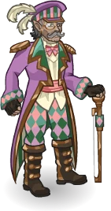
        
        
            **Skin**
            Rictavio Van Richten
        
    
    
        
            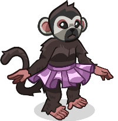ID: 329**Piccolo the Pet Monkey**Pet of Rictavio, friend of Blinsky, master of chaos.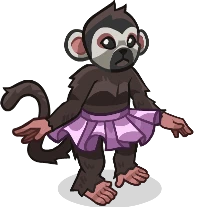
        
        
            **Familiar**
            Piccolo the Pet Monkey
        
    
    
        
            ID: 2692**Feat**???: 2692
        
        
            **Feat**
            ???: 2692
        
    
    
        
            ID: 820**Platinum Van Richten Chest**Loot for: Van Richten<code>"for_crusaders":[177]</code>
        
        
            **Chest**
            Platinum Van Richten Chest
            x32 (Shinies x2)
        
    
    
        
            ID: 1723**Potion of the Gem Hunter**Increases the gem drops from bosses by 50%<code>increase_boss_gems_percent,50</code>
        
        
            **Buff**
            Potion of the Gem Hunter
            x1
        
    

ID: 727

### Eldritch Horror Nahara Skin & Feat Pack - 1,680 Platinum  
Date of release: 01 Jul 2026

> Unlock Nahara along with her exclusive Eldritch Horror Skin & Feat!

Contents:

    
        
            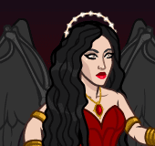ID: 102**Nahara (Seat 3)**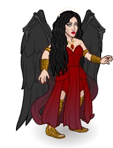
        
        
            **Champion Unlock**
            Nahara
        
    
    
        
            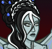ID: 703**Eldritch Horror Nahara (Nahara)**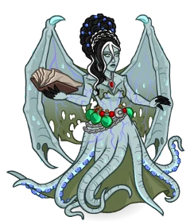
        
        
            **Skin**
            Eldritch Horror Nahara
        
    
    
        
            ID: 2587**Everlasting Bonds**Stand with me now, as I stand with all of you.  Increases the effect of Nahara's Strong Society ability by 20% for each Black Dice Society affiliation member in the formation, stacking additively.<code>effect_def,2795 DevNote: blah blah blah</code>
        
        
            **Feat**
            Everlasting Bonds
            Nahara
        
    
    
        
            ID: 20**Large Bounty Contract**Claim a bounty worth 8 hours of offline gold earnings and event tokens.<code>seconds_worth_of_gold,28800</code>
        
        
            **Buff**
            Large Bounty Contract
            x6
        
    
    
        
            ID: 34**Large Blacksmithing Contract**Contract a master blacksmith to improve a piece of equipment owned by one of your Champions.<code>level_up_loot,24</code>
        
        
            **Buff**
            Large Blacksmithing Contract
            x6
        
    
    
        
            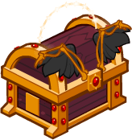ID: 361**Platinum Nahara Chest**Loot for: Nahara<code>"for_crusaders":[102]</code>
        
        
            **Chest**
            Platinum Nahara Chest
            x14 (Shinies x1)
        
    

ID: 728

### Vampire Slayer Tess Skin & Feat Pack - 1,680 Platinum  
Date of release: 01 Jul 2026

> Unlock Tess along with her exclusive Vampire Slayer Skin & Feat!

Contents:

    
        
            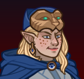ID: 164**Tess (Seat 8)**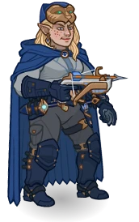
        
        
            **Champion Unlock**
            Tess
        
    
    
        
            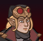ID: 704**Vampire Slayer Tess (Tess)**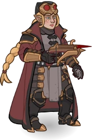
        
        
            **Skin**
            Vampire Slayer Tess
        
    
    
        
            ID: 2583**Tactical Adaptation**I've got a plan for that.  Increases the effect of all of Tess's Specializations by 80%. (Prestack)<code>buff_upgrades,80,17321,17322,17323</code>
        
        
            **Feat**
            Tactical Adaptation
            Tess
        
    
    
        
            ID: 20**Large Bounty Contract**Claim a bounty worth 8 hours of offline gold earnings and event tokens.<code>seconds_worth_of_gold,28800</code>
        
        
            **Buff**
            Large Bounty Contract
            x6
        
    
    
        
            ID: 34**Large Blacksmithing Contract**Contract a master blacksmith to improve a piece of equipment owned by one of your Champions.<code>level_up_loot,24</code>
        
        
            **Buff**
            Large Blacksmithing Contract
            x6
        
    
    
        
            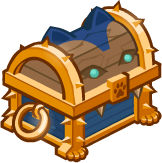ID: 661**Platinum Tess Chest**Loot for: Tess<code>"for_crusaders":[164]</code>
        
        
            **Chest**
            Platinum Tess Chest
            x14 (Shinies x1)
        
    

ID: 729

### Baby Cthulhu Familiar & Modron Pack - 2,380 Platinum  
Date of release: 08 Jul 2026

> Collect your own Baby Cthulhu Familiar, along with 3 Epic Modron Components, a week-long Modron buff potion, and 2000 Component pieces!

Contents:

    
        
            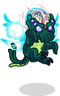ID: 330**Baby Cthulhu**This ageless terror can only exert a fraction of its terrible might in this adorable form.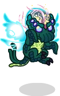
        
        
            **Familiar**
            Baby Cthulhu
        
    
    
        
            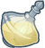ID: 1722**Potion of Psychomorphic Energy**Increases the bonuses provided by Modron Core outputs<code>increase_all_modron_buffs,50</code>
        
        
            **Buff**
            Potion of Psychomorphic Energy
            x1
        
    
    
        
            **Modron Component Pieces**
        
        
            **Modron Component Pieces**
            x2,000
        
    
    
        
            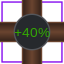ID: 80**Undirected Cross Component**
        
        
            **Modron Pipe**
            Undirected Cross Component
        
    
    
        
            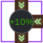ID: 126**Directed T Component (1 out)**
        
        
            **Modron Pipe**
            Directed T Component (1 out)
        
    
    
        
            ID: 168**Directed Cross Component (1 out)**
        
        
            **Modron Pipe**
            Directed Cross Component (1 out)
        
    

ID: 730

### Ravenloft's Champion Strongheart Skin & Feat Pack - 1,680 Platinum  
Date of release: 08 Jul 2026

> Unlock Strongheart along with his exclusive Ravenloft's Champion Skin & Feat!

Contents:

    
        
            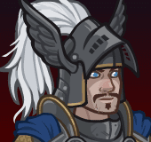ID: 126**Strongheart (Seat 11)**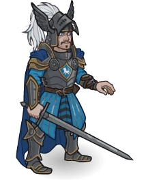
        
        
            **Champion Unlock**
            Strongheart
        
    
    
        
            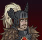ID: 705**Ravenloft's Champion Strongheart (Strongheart)**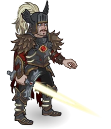
        
        
            **Skin**
            Ravenloft's Champion Strongheart
        
    
    
        
            ID: 982**Guided Strike**Altogether now! May our blades strike true!  Strongheart increases his crit chance by 5% for each adjacent Champion.<code>effect_def,2793 DevNote: blah blah blah</code>
        
        
            **Feat**
            Guided Strike
            Strongheart
        
    
    
        
            ID: 20**Large Bounty Contract**Claim a bounty worth 8 hours of offline gold earnings and event tokens.<code>seconds_worth_of_gold,28800</code>
        
        
            **Buff**
            Large Bounty Contract
            x6
        
    
    
        
            ID: 34**Large Blacksmithing Contract**Contract a master blacksmith to improve a piece of equipment owned by one of your Champions.<code>level_up_loot,24</code>
        
        
            **Buff**
            Large Blacksmithing Contract
            x6
        
    
    
        
            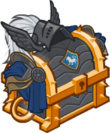ID: 454**Platinum Strongheart Chest**Loot for: Strongheart<code>"for_crusaders":[126]</code>
        
        
            **Chest**
            Platinum Strongheart Chest
            x14 (Shinies x1)
        
    

ID: 731

### Disciple of Cthulhu Deekin Skin & Feat Pack - 1,680 Platinum  
Date of release: 15 Jul 2026

> Unlock Deekin along with his exclusive Disciple of Cthulhu Skin & Feat!

Contents:

    
        
            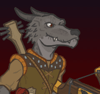ID: 28**Deekin (Seat 1)**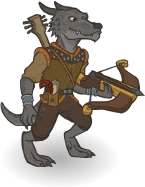
        
        
            **Champion Unlock**
            Deekin
        
    
    
        
            ID: 533**Disciple of Cthulhu Deekin (Deekin)**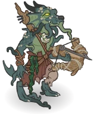
        
        
            **Skin**
            Disciple of Cthulhu Deekin
        
    
    
        
            ID: 2696**Non-Standard Affair**Deekin find comfort in others like Deekin.  Increases the damage of all Champions by 20% for each non-Standard species in the formation, stacking additively. Standard species are Aasimar, Dragonborn, Dwarf, Elf, Gnome, Goliath, Halfling, Human, Orc, Tiefling, Half-Orc, and Half-Elf.<code>effect_def,2608</code>
        
        
            **Feat**
            Non-Standard Affair
            Deekin
        
    
    
        
            ID: 20**Large Bounty Contract**Claim a bounty worth 8 hours of offline gold earnings and event tokens.<code>seconds_worth_of_gold,28800</code>
        
        
            **Buff**
            Large Bounty Contract
            x6
        
    
    
        
            ID: 34**Large Blacksmithing Contract**Contract a master blacksmith to improve a piece of equipment owned by one of your Champions.<code>level_up_loot,24</code>
        
        
            **Buff**
            Large Blacksmithing Contract
            x6
        
    
    
        
            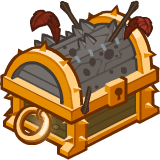ID: 54**Platinum Deekin Chest**Loot for: Deekin<code>"for_crusaders":[28]</code>
        
        
            **Chest**
            Platinum Deekin Chest
            x14 (Shinies x1)
        
    

ID: 732

### Nechricor Vin Ursa Skin & Feat Pack - 1,680 Platinum  
Date of release: 15 Jul 2026

> Unlock Vin Ursa along with her exclusive Nechricor Skin & Feat!

Contents:

    
        
            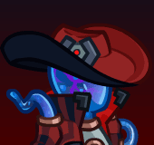ID: 127**Vin Ursa (Seat 7)**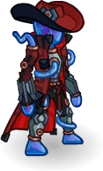
        
        
            **Champion Unlock**
            Vin Ursa
        
    
    
        
            ID: 534**Nechricor Vin Ursa (Vin Ursa)**
        
        
            **Skin**
            Nechricor Vin Ursa
        
    
    
        
            ID: 2697**Guided Strike**Kalix! Get me an opening!  Vin Ursa increases her crit chance by 5% for each adjacent Champion.<code>effect_def,2794 DevNote: blah blah blah</code>
        
        
            **Feat**
            Guided Strike
            Vin Ursa
        
    
    
        
            ID: 20**Large Bounty Contract**Claim a bounty worth 8 hours of offline gold earnings and event tokens.<code>seconds_worth_of_gold,28800</code>
        
        
            **Buff**
            Large Bounty Contract
            x6
        
    
    
        
            ID: 34**Large Blacksmithing Contract**Contract a master blacksmith to improve a piece of equipment owned by one of your Champions.<code>level_up_loot,24</code>
        
        
            **Buff**
            Large Blacksmithing Contract
            x6
        
    
    
        
            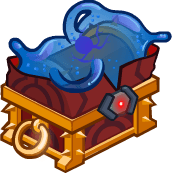ID: 456**Platinum Vin Ursa Chest**Loot for: Vin Ursa<code>"for_crusaders":[127]</code>
        
        
            **Chest**
            Platinum Vin Ursa Chest
            x14 (Shinies x1)
        
    

ID: 733

### Lae'zel's Astral Touched Tadpole Legendary Feat Pack - Free  
Date of release: 22 Jul 2026

> tbd

ⓘ *Note: It appears that this pack will only be available for real money instead of Platinum.*

Contents:

* None

ID: 734

### Mist Horror Familiar Pack - 1,140 Platinum  
Date of release: 22 Jul 2026

> Collect your own Mist Horror familiar!

Contents:

    
        
            ID: 331**Mist Horror**These vaporous terrors take the shape of their viewers' greatest fears.
        
        
            **Familiar**
            Mist Horror
        
    
    
        
            ID: 40**Huge Potion of Fire Breath**The orange liquid in this vial flickers and smoke fills the top of the container.<code>click_damage_seconds_global_dps,600</code>
        
        
            **Buff**
            Huge Potion of Fire Breath
            x4
        
    
    
        
            ID: 77**Huge Potion of Speed**This potion's yellow fluid is streaked with black and swirls on its own.<code>time_scale,2.75</code>
        
        
            **Buff**
            Huge Potion of Speed
            x4
        
    

ID: 735

### Sly One Raistlin Skin & Feat Pack - 1,680 Platinum  
Date of release: 29 Jul 2026

> Unlock Raistlin along with his exclusive Sly One Skin & Feat!

Contents:

    
        
            ID: 173**Raistlin (Seat 2)**
        
        
            **Champion Unlock**
            Raistlin
        
    
    
        
            ID: 536**Sly One Raistlin (Raistlin)**
        
        
            **Skin**
            Sly One Raistlin
        
    
    
        
            ID: 2698**Into Darkness**No, my brother, where I go, you cannot follow. ~Raistlin  Increases the effect of Raistlin's Savant ability by 80%. (Prestack)<code>buff_upgrade,80,18930</code>
        
        
            **Feat**
            Into Darkness
            Raistlin
        
    
    
        
            ID: 20**Large Bounty Contract**Claim a bounty worth 8 hours of offline gold earnings and event tokens.<code>seconds_worth_of_gold,28800</code>
        
        
            **Buff**
            Large Bounty Contract
            x6
        
    
    
        
            ID: 34**Large Blacksmithing Contract**Contract a master blacksmith to improve a piece of equipment owned by one of your Champions.<code>level_up_loot,24</code>
        
        
            **Buff**
            Large Blacksmithing Contract
            x6
        
    
    
        
            ID: 790**Platinum Raistlin Chest**Loot for: Raistlin<code>"for_crusaders":[173]</code>
        
        
            **Chest**
            Platinum Raistlin Chest
            x14 (Shinies x1)
        
    

[Back to Top](#top)

*Last Modified: {{ site.time }}*