[Back to Main](index.md)

# Premium Packs and DLC

Upcoming real-money shop items.

ID: 697

### Strelitzia Lucius Theme Pack - 3,830 Platinum  
Date of release: 08 Apr 2026

> Unlock Lucius along with an exclusive Strelitzia Skin & Familiar!

Contents:

    
        
            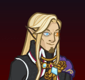ID: 72**Lucius (Seat 7)**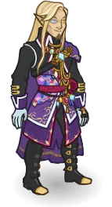
        
        
            **Champion Unlock**
            Lucius
        
    
    
        
            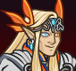ID: 676**Strelitzia Lucius (Lucius)**
        
        
            **Skin**
            Strelitzia Lucius
        
    
    
        
            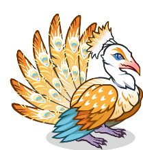ID: 318**Birdie the Peacock**"I wish I were a birdie."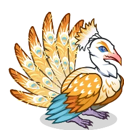
        
        
            **Familiar**
            Birdie the Peacock
        
    
    
        
            ID: 2378**Feat**???: 2378
        
        
            **Feat**
            ???: 2378
        
    
    
        
            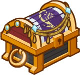ID: 251**Platinum Lucius Chest**Loot for: Lucius<code>"for_crusaders":[72]</code>
        
        
            **Chest**
            Platinum Lucius Chest
            x32 (Shinies x2)
        
    
    
        
            ID: 1723**Potion of the Gem Hunter**Increases the gem drops from bosses by 50%<code>increase_boss_gems_percent,50</code>
        
        
            **Buff**
            Potion of the Gem Hunter
            x1
        
    

ID: 698

### Scarlet Briar Miria Skin & Feat Pack - 1,680 Platinum  
Date of release: 08 Apr 2026

> Unlock Miria along with her exclusive Scarlet Briar Skin & Feat!

Contents:

    
        
            ID: 121**Miria (Seat 12)**
        
        
            **Champion Unlock**
            Miria
        
    
    
        
            ID: 677**Scarlet Briar Miria (Miria)**
        
        
            **Skin**
            Scarlet Briar Miria
        
    
    
        
            ID: 2359**Prodigal Leader**Be a good minion and obey.  All Champions damage +50%.<code>global_dps_multiplier_mult,50</code>
        
        
            **Feat**
            Prodigal Leader
            Miria
        
    
    
        
            ID: 20**Large Bounty Contract**Claim a bounty worth 8 hours of offline gold earnings and event tokens.<code>seconds_worth_of_gold,28800</code>
        
        
            **Buff**
            Large Bounty Contract
            x6
        
    
    
        
            ID: 34**Large Blacksmithing Contract**Contract a master blacksmith to improve a piece of equipment owned by one of your Champions.<code>level_up_loot,24</code>
        
        
            **Buff**
            Large Blacksmithing Contract
            x6
        
    
    
        
            ID: 444**Platinum Miria Chest**Loot for: Miria<code>"for_crusaders":[121]</code>
        
        
            **Chest**
            Platinum Miria Chest
            x14 (Shinies x1)
        
    

ID: 699

### Wildflower Aila Skin & Feat Pack - 1,680 Platinum  
Date of release: 08 Apr 2026

> Unlock Aila along with her exclusive Wildflower Skin & Feat!

Contents:

    
        
            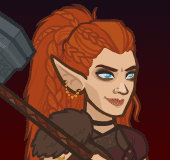ID: 42**Aila (Seat 9)**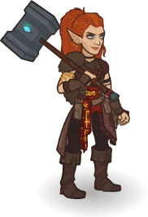
        
        
            **Champion Unlock**
            Aila
        
    
    
        
            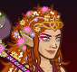ID: 678**Wildflower Aila (Aila)**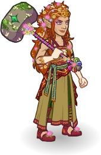
        
        
            **Skin**
            Wildflower Aila
        
    
    
        
            ID: 2363**Sentinel**Even flowers must endure the storm.  Aila takes 20 more Enemies attacking to get overwhelmed.<code>overwhelm_start_increase,20</code>
        
        
            **Feat**
            Sentinel
            Aila
        
    
    
        
            ID: 20**Large Bounty Contract**Claim a bounty worth 8 hours of offline gold earnings and event tokens.<code>seconds_worth_of_gold,28800</code>
        
        
            **Buff**
            Large Bounty Contract
            x6
        
    
    
        
            ID: 34**Large Blacksmithing Contract**Contract a master blacksmith to improve a piece of equipment owned by one of your Champions.<code>level_up_loot,24</code>
        
        
            **Buff**
            Large Blacksmithing Contract
            x6
        
    
    
        
            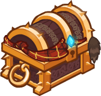ID: 94**Platinum Aila Chest**Loot for: Aila<code>"for_crusaders":[42]</code>
        
        
            **Chest**
            Platinum Aila Chest
            x14 (Shinies x1)
        
    

ID: 700

### Valentine's Dryad Familiar & Feat Pack - 1,680 Platinum  
Date of release: 15 Apr 2026

> Collect a Feat for Valentine along with an exclusive Dryad familiar!

Contents:

    
        
            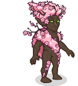ID: 319**Bloom the Dryad**Likes pretty songs and likes to sing along.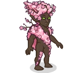
        
        
            **Familiar**
            Bloom the Dryad
        
    
    
        
            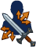ID: 2581**Standard Affair**Yes, yes, gather around.  Increases the damage of all Champions by 20% for each Standard species in the formation, stacking additively. Standard species are Aasimar, Dragonborn, Dwarf, Elf, Gnome, Goliath, Halfling, Human, Orc, Tiefling, Half-Orc, and Half-Elf.<code>effect_def,2527</code>
        
        
            **Feat**
            Standard Affair
            Valentine
        
    
    
        
            ID: 36**Potion of Polish**This shiny, silver liquid clings to the edge of the bottle in an unusual way.<code>shiny_loot,1</code>
        
        
            **Buff**
            Potion of Polish
            x1
        
    
    
        
            ID: 77**Huge Potion of Speed**This potion's yellow fluid is streaked with black and swirls on its own.<code>time_scale,2.75</code>
        
        
            **Buff**
            Huge Potion of Speed
            x2
        
    
    
        
            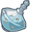ID: 1712**Potion of the Hunter**Increase Global Damage by 100%<code>global_dps_multiplier_mult,100</code>
        
        
            **Buff**
            Potion of the Hunter
            x1
        
    

ID: 701

### Cosmic Horror Grimm Skin & Feat Pack - 1,680 Platinum  
Date of release: 15 Apr 2026

> Unlock Grimm along with his exclusive Cosmic Horror Skin & Feat!

Contents:

    
        
            ID: 161**Grimm (Seat 2)**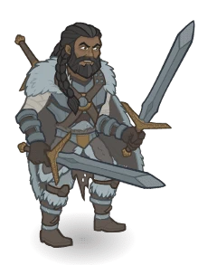
        
        
            **Champion Unlock**
            Grimm
        
    
    
        
            ID: 679**Cosmic Horror Grimm (Grimm)**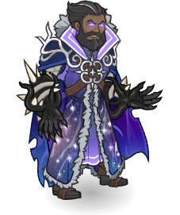
        
        
            **Skin**
            Cosmic Horror Grimm
        
    
    
        
            ID: 2347**Buffed Up**It'll all be over in just one swing. ~Grimm  Increases the effect of Grimm's Get Buff ability by 80%. (Prestack)<code>buff_upgrade,80,16735</code>
        
        
            **Feat**
            Buffed Up
            Grimm
        
    
    
        
            ID: 20**Large Bounty Contract**Claim a bounty worth 8 hours of offline gold earnings and event tokens.<code>seconds_worth_of_gold,28800</code>
        
        
            **Buff**
            Large Bounty Contract
            x6
        
    
    
        
            ID: 34**Large Blacksmithing Contract**Contract a master blacksmith to improve a piece of equipment owned by one of your Champions.<code>level_up_loot,24</code>
        
        
            **Buff**
            Large Blacksmithing Contract
            x6
        
    
    
        
            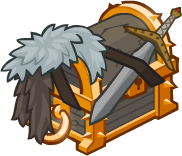ID: 655**Platinum Grimm Chest**Loot for: Grimm<code>"for_crusaders":[161]</code>
        
        
            **Chest**
            Platinum Grimm Chest
            x14 (Shinies x1)
        
    

ID: 702

### Springtime Spurt Skin & Feat Pack - 1,680 Platinum  
Date of release: 15 Apr 2026

> Unlock Spurt along with his exclusive Springtime Skin & Feat!

Contents:

    
        
            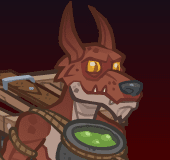ID: 43**Spurt (Seat 3)**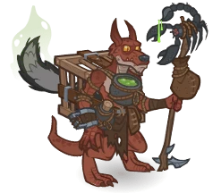
        
        
            **Champion Unlock**
            Spurt
        
    
    
        
            ID: 680**Springtime Spurt (Spurt)**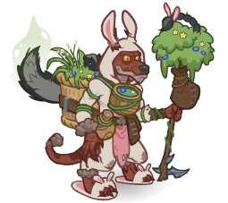
        
        
            **Skin**
            Springtime Spurt
        
    
    
        
            ID: 2559**Corpse Stench**Bath? What's that?  Spurt always counts as Undead, even when not in Spirit form.<code>add_hero_tags,0,undead buff_upgrade_per_any_tagged_crusader,20,10678,undead</code>
        
        
            **Feat**
            Corpse Stench
            Spurt
        
    
    
        
            ID: 20**Large Bounty Contract**Claim a bounty worth 8 hours of offline gold earnings and event tokens.<code>seconds_worth_of_gold,28800</code>
        
        
            **Buff**
            Large Bounty Contract
            x6
        
    
    
        
            ID: 34**Large Blacksmithing Contract**Contract a master blacksmith to improve a piece of equipment owned by one of your Champions.<code>level_up_loot,24</code>
        
        
            **Buff**
            Large Blacksmithing Contract
            x6
        
    
    
        
            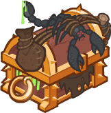ID: 96**Platinum Spurt Chest**Loot for: Spurt<code>"for_crusaders":[43]</code>
        
        
            **Chest**
            Platinum Spurt Chest
            x14 (Shinies x1)
        
    

ID: 692

### Seeker the Star Angler Familiar Pack - 2,380 Platinum  
Date of release: 22 Apr 2026

> Collect your own Seeker the Star Angler familiar!

Contents:

    
        
            ID: 314**Seeker the Star Angler**Just watch out when her teeth grow in!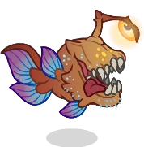
        
        
            **Familiar**
            Seeker the Star Angler
        
    
    
        
            ID: 4**Huge Potion of Giant's Strength**A transparent potion in which floats the sliver of a giant's fingernail.<code>global_dps_multiplier_mult,900</code>
        
        
            **Buff**
            Huge Potion of Giant's Strength
            x6
        
    
    
        
            ID: 8**Huge Potion of Clairvoyance**Three eyeballs bob in this yellowish potion.<code>gold_multiplier_mult,400</code>
        
        
            **Buff**
            Huge Potion of Clairvoyance
            x6
        
    
    
        
            ID: 36**Potion of Polish**This shiny, silver liquid clings to the edge of the bottle in an unusual way.<code>shiny_loot,1</code>
        
        
            **Buff**
            Potion of Polish
            x1
        
    
    
        
            ID: 40**Huge Potion of Fire Breath**The orange liquid in this vial flickers and smoke fills the top of the container.<code>click_damage_seconds_global_dps,600</code>
        
        
            **Buff**
            Huge Potion of Fire Breath
            x6
        
    
    
        
            ID: 77**Huge Potion of Speed**This potion's yellow fluid is streaked with black and swirls on its own.<code>time_scale,2.75</code>
        
        
            **Buff**
            Huge Potion of Speed
            x6
        
    
    
        
            ID: 1721**Potion of the Gold Hunter**Increase Gold Find by 100%<code>gold_multiplier_mult,100</code>
        
        
            **Buff**
            Potion of the Gold Hunter
            x1
        
    
    
        
            **Modron Component Pieces**
        
        
            **Modron Component Pieces**
            x2,000
        
    

ID: 703

### Cosmic Horror Beadle Skin & Feat Pack - 1,680 Platinum  
Date of release: 22 Apr 2026

> Unlock Beadle along with his exclusive Cosmic Horror Skin & Feat!

Contents:

    
        
            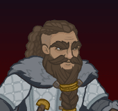ID: 64**Beadle (Seat 8)**
        
        
            **Champion Unlock**
            Beadle
        
    
    
        
            ID: 681**Cosmic Horror Beadle (Beadle)**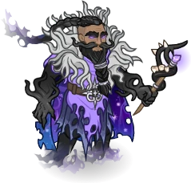
        
        
            **Skin**
            Cosmic Horror Beadle
        
    
    
        
            ID: 2560**Buckle Down**When the going gets tough, I make sure Grimm gets going. ~Beadle  Increases the effect of Beadle's Share The Glory ability by 80%.<code>buff_upgrade,80,16724,1</code>
        
        
            **Feat**
            Buckle Down
            Beadle
        
    
    
        
            ID: 20**Large Bounty Contract**Claim a bounty worth 8 hours of offline gold earnings and event tokens.<code>seconds_worth_of_gold,28800</code>
        
        
            **Buff**
            Large Bounty Contract
            x6
        
    
    
        
            ID: 34**Large Blacksmithing Contract**Contract a master blacksmith to improve a piece of equipment owned by one of your Champions.<code>level_up_loot,24</code>
        
        
            **Buff**
            Large Blacksmithing Contract
            x6
        
    
    
        
            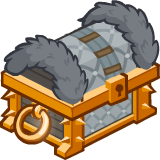ID: 187**Platinum Beadle Chest**Loot for: Beadle<code>"for_crusaders":[64]</code>
        
        
            **Chest**
            Platinum Beadle Chest
            x14 (Shinies x1)
        
    

ID: 704

### Knight of the Crown Bobby Skin & Feat Pack - 1,680 Platinum  
Date of release: 29 Apr 2026

> Unlock Bobby along with his exclusive Knight of the Crown Skin & Feat!

Contents:

    
        
            ID: 152**Bobby (Seat 12)**
        
        
            **Champion Unlock**
            Bobby
        
    
    
        
            ID: 682**Knight of the Crown Bobby (Bobby)**
        
        
            **Skin**
            Knight of the Crown Bobby
        
    
    
        
            ID: 2561**Playground Boss**The best games are the ones where the rules are different every time you play!  Increases the effect of Bobby's Not So Low, Still Growing Up, and Strong Armed specializations by 80%. (Prestack)<code>buff_upgrade,80,15449,0 buff_upgrade,80,15450,0 buff_upgrade,80,15451,0</code>
        
        
            **Feat**
            Playground Boss
            Bobby
        
    
    
        
            ID: 20**Large Bounty Contract**Claim a bounty worth 8 hours of offline gold earnings and event tokens.<code>seconds_worth_of_gold,28800</code>
        
        
            **Buff**
            Large Bounty Contract
            x6
        
    
    
        
            ID: 34**Large Blacksmithing Contract**Contract a master blacksmith to improve a piece of equipment owned by one of your Champions.<code>level_up_loot,24</code>
        
        
            **Buff**
            Large Blacksmithing Contract
            x6
        
    
    
        
            ID: 575**Platinum Bobby Chest**Loot for: Bobby<code>"for_crusaders":[152]</code>
        
        
            **Chest**
            Platinum Bobby Chest
            x14 (Shinies x1)
        
    

ID: 705

### Raistlin Cosplay Farideh Skin & Feat Pack - 1,680 Platinum  
Date of release: 29 Apr 2026

> Unlock Farideh along with her exclusive Raistlin Cosplay Skin & Feat!

Contents:

    
        
            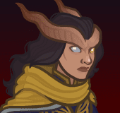ID: 33**Farideh (Seat 7)**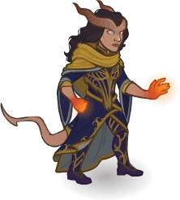
        
        
            **Champion Unlock**
            Farideh
        
    
    
        
            ID: 683**Raistlin Cosplay Farideh (Farideh)**
        
        
            **Skin**
            Raistlin Cosplay Farideh
        
    
    
        
            ID: 2562**Magius Infernus**Cast enough fireballs, and most problems tend to go away.  Increases the effect of Farideh's specializations by 80%.<code>buff_upgrades,80,17839,17840,17841</code>
        
        
            **Feat**
            Magius Infernus
            Farideh
        
    
    
        
            ID: 20**Large Bounty Contract**Claim a bounty worth 8 hours of offline gold earnings and event tokens.<code>seconds_worth_of_gold,28800</code>
        
        
            **Buff**
            Large Bounty Contract
            x6
        
    
    
        
            ID: 34**Large Blacksmithing Contract**Contract a master blacksmith to improve a piece of equipment owned by one of your Champions.<code>level_up_loot,24</code>
        
        
            **Buff**
            Large Blacksmithing Contract
            x6
        
    
    
        
            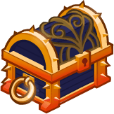ID: 72**Platinum Farideh Chest**Loot for: Farideh<code>"for_crusaders":[33]</code>
        
        
            **Chest**
            Platinum Farideh Chest
            x14 (Shinies x1)
        
    

ID: 706

### Qualinesti Princess Laurana Theme Pack - 3,830 Platinum  
Date of release: 06 May 2026

> Unlock Laurana along with an exclusive Qualinesti Princess Skin & Familiar!

Contents:

    
        
            ID: 175**Laurana**
        
        
            **Champion Unlock**
            Laurana
        
    
    
        
            ID: 686**Qualinesti Princess Laurana (Laurana)**
        
        
            **Skin**
            Qualinesti Princess Laurana
        
    
    
        
            ID: 320**Glimmerwyrm the Faerie Dragon**A loyal friend.
        
        
            **Familiar**
            Glimmerwyrm the Faerie Dragon
        
    
    
        
            ID: 2572**Feat**???: 2572
        
        
            **Feat**
            ???: 2572
        
    
    
        
            ID: 808**Platinum Laurana Chest**Loot for: Laurana<code>"for_crusaders":[175]</code>
        
        
            **Chest**
            Platinum Laurana Chest
            x32 (Shinies x2)
        
    
    
        
            ID: 1723**Potion of the Gem Hunter**Increases the gem drops from bosses by 50%<code>increase_boss_gems_percent,50</code>
        
        
            **Buff**
            Potion of the Gem Hunter
            x1
        
    

ID: 707

### Sovereign Diana Skin & Feat Pack - 1,680 Platinum  
Date of release: 06 May 2026

> Unlock Diana along with her exclusive Sovereign Skin & Feat!

Contents:

    
        
            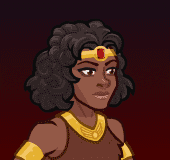ID: 148**Diana (Seat 9)**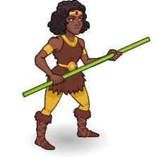
        
        
            **Champion Unlock**
            Diana
        
    
    
        
            ID: 687**Sovereign Diana (Diana)**
        
        
            **Skin**
            Sovereign Diana
        
    
    
        
            ID: 2582**Prodigal Leader**I lead with wisdom and grace.  All Champions damage +50%.<code>global_dps_multiplier_mult,50</code>
        
        
            **Feat**
            Prodigal Leader
            Diana
        
    
    
        
            ID: 20**Large Bounty Contract**Claim a bounty worth 8 hours of offline gold earnings and event tokens.<code>seconds_worth_of_gold,28800</code>
        
        
            **Buff**
            Large Bounty Contract
            x6
        
    
    
        
            ID: 34**Large Blacksmithing Contract**Contract a master blacksmith to improve a piece of equipment owned by one of your Champions.<code>level_up_loot,24</code>
        
        
            **Buff**
            Large Blacksmithing Contract
            x6
        
    
    
        
            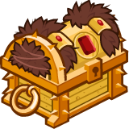ID: 567**Platinum Diana Chest**Loot for: Diana<code>"for_crusaders":[148]</code>
        
        
            **Chest**
            Platinum Diana Chest
            x14 (Shinies x1)
        
    

ID: 708

### Masterwork Nordom Skin & Feat Pack - 1,680 Platinum  
Date of release: 06 May 2026

> Unlock Nordom along with an exclusive Masterwork Skin & Feat!

Contents:

    
        
            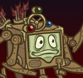ID: 100**Nordom (Seat 9)**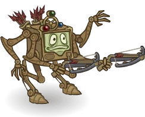
        
        
            **Champion Unlock**
            Nordom
        
    
    
        
            ID: 688**Masterwork Nordom (Nordom)**
        
        
            **Skin**
            Masterwork Nordom
        
    
    
        
            ID: 2380**Optimization**Statement of core belief: bigger numbers are better numbers.  Increases the effect of Nordom's Core Competency Specialization by 1% for each max level Modron Core you own.<code>buff_upgrade_add_flat_amount,1,18168,0</code>
        
        
            **Feat**
            Optimization
            Nordom
        
    
    
        
            ID: 20**Large Bounty Contract**Claim a bounty worth 8 hours of offline gold earnings and event tokens.<code>seconds_worth_of_gold,28800</code>
        
        
            **Buff**
            Large Bounty Contract
            x6
        
    
    
        
            ID: 34**Large Blacksmithing Contract**Contract a master blacksmith to improve a piece of equipment owned by one of your Champions.<code>level_up_loot,24</code>
        
        
            **Buff**
            Large Blacksmithing Contract
            x6
        
    
    
        
            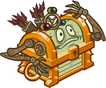ID: 357**Platinum Nordom Chest**Loot for: Nordom<code>"for_crusaders":[100]</code>
        
        
            **Chest**
            Platinum Nordom Chest
            x14 (Shinies x1)
        
    

ID: 709

### Pretentious Prestidigitator Melf Theme Pack - 3,830 Platinum  
Date of release: 13 May 2026

> Unlock Melf along with an exclusive Pretentious Prestidigitator Skin & Familiar!

Contents:

    
        
            ID: 59**Melf (Seat 12)**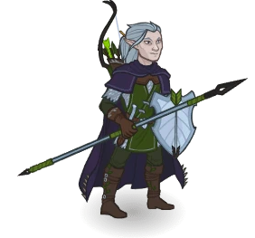
        
        
            **Champion Unlock**
            Melf
        
    
    
        
            ID: 689**Pretentious Prestidigitator Melf (Melf)**
        
        
            **Skin**
            Pretentious Prestidigitator Melf
        
    
    
        
            ID: 321**Clockwork the Faerie Dragon**
        
        
            **Familiar**
            Clockwork the Faerie Dragon
        
    
    
        
            ID: 2598**Feat**???: 2598
        
        
            **Feat**
            ???: 2598
        
    
    
        
            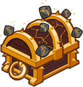ID: 177**Platinum Melf Chest**Loot for: Melf<code>"for_crusaders":[59]</code>
        
        
            **Chest**
            Platinum Melf Chest
            x32 (Shinies x2)
        
    
    
        
            ID: 1723**Potion of the Gem Hunter**Increases the gem drops from bosses by 50%<code>increase_boss_gems_percent,50</code>
        
        
            **Buff**
            Potion of the Gem Hunter
            x1
        
    

ID: 710

### Noble Mechanica Evelyn Skin & Feat Pack - 1,680 Platinum  
Date of release: 13 May 2026

> Unlock Evelyn along with her exclusive Noble Mechanica Skin & Feat!

Contents:

    
        
            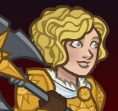ID: 26**Evelyn (Seat 6)**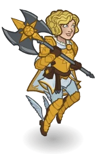
        
        
            **Champion Unlock**
            Evelyn
        
    
    
        
            ID: 690**Noble Mechanica Evelyn (Evelyn)**
        
        
            **Skin**
            Noble Mechanica Evelyn
        
    
    
        
            ID: 2584**Focused Light**Lathander guides my path, my sword, my heart.  Increases the effect of Evelyn's Channel Divinity ability by 80%.<code>buff_upgrade,80,12206</code>
        
        
            **Feat**
            Focused Light
            Evelyn
        
    
    
        
            ID: 20**Large Bounty Contract**Claim a bounty worth 8 hours of offline gold earnings and event tokens.<code>seconds_worth_of_gold,28800</code>
        
        
            **Buff**
            Large Bounty Contract
            x6
        
    
    
        
            ID: 34**Large Blacksmithing Contract**Contract a master blacksmith to improve a piece of equipment owned by one of your Champions.<code>level_up_loot,24</code>
        
        
            **Buff**
            Large Blacksmithing Contract
            x6
        
    
    
        
            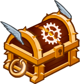ID: 41**Platinum Evelyn Chest**Loot for: Evelyn<code>"for_crusaders":[26]</code>
        
        
            **Chest**
            Platinum Evelyn Chest
            x14 (Shinies x1)
        
    

ID: 711

### Dragon Orb of Wayreth Familiar Pack - 1,140 Platinum  
Date of release: 13 May 2026

> Collect your own Dragon Orb of Wayreth familiar!

Contents:

    
        
            ID: 322**Dragon Orb of Wayreth**An orb is an etched crystal globe about 10 inches in diameter. When used, it grows to about 20 inches in diameter, and mist swirls inside it.
        
        
            **Familiar**
            Dragon Orb of Wayreth
        
    
    
        
            ID: 40**Huge Potion of Fire Breath**The orange liquid in this vial flickers and smoke fills the top of the container.<code>click_damage_seconds_global_dps,600</code>
        
        
            **Buff**
            Huge Potion of Fire Breath
            x4
        
    
    
        
            ID: 77**Huge Potion of Speed**This potion's yellow fluid is streaked with black and swirls on its own.<code>time_scale,2.75</code>
        
        
            **Buff**
            Huge Potion of Speed
            x4
        
    

ID: 716

### Tasslehoff's Dragonlance Party Pack - $27.99  
Date of release: 14 May 2026

> 

ⓘ *Note: This pack might not be available for purchase since it's potentially a platform giveaway.*

Contents:

    
        
            ID: 173**Raistlin (Seat 2)**
        
        
            **Champion Unlock**
            Raistlin
        
    
    
        
            ID: 174**Tasslehoff (Seat 11)**
        
        
            **Champion Unlock**
            Tasslehoff
        
    
    
        
            ID: 175**Laurana**
        
        
            **Champion Unlock**
            Laurana
        
    
    
        
            ID: 790**Platinum Raistlin Chest**Loot for: Raistlin<code>"for_crusaders":[173]</code>
        
        
            **Chest**
            Platinum Raistlin Chest
            x14 (Shinies x1)
        
    
    
        
            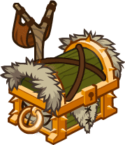ID: 796**Platinum Tasslehoff Chest**Loot for: Tasslehoff<code>"for_crusaders":[174]</code>
        
        
            **Chest**
            Platinum Tasslehoff Chest
            x14 (Shinies x1)
        
    
    
        
            ID: 808**Platinum Laurana Chest**Loot for: Laurana<code>"for_crusaders":[175]</code>
        
        
            **Chest**
            Platinum Laurana Chest
            x14 (Shinies x1)
        
    
    
        
            ID: 1723**Potion of the Gem Hunter**Increases the gem drops from bosses by 50%<code>increase_boss_gems_percent,50</code>
        
        
            **Buff**
            Potion of the Gem Hunter
            x1
        
    

ID: 712

### Clockwork General Mehen Skin & Feat Pack - 1,680 Platinum  
Date of release: 20 May 2026

> Unlock Mehen along with his exclusive Clockwork General Skin & Feat!

Contents:

    
        
            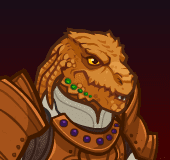ID: 80**Mehen (Seat 3)**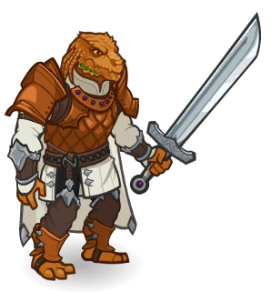
        
        
            **Champion Unlock**
            Mehen
        
    
    
        
            ID: 691**Clockwork General Mehen (Mehen)**
        
        
            **Skin**
            Clockwork General Mehen
        
    
    
        
            ID: 2585**Guaranteed Grump**I'm certain of few things in this life. Disappointment is one of them.  Increases the effect of Mehen's Grumpy ability by 80%. (Prestack)<code>buff_upgrade,80,16146,0</code>
        
        
            **Feat**
            Guaranteed Grump
            Mehen
        
    
    
        
            ID: 20**Large Bounty Contract**Claim a bounty worth 8 hours of offline gold earnings and event tokens.<code>seconds_worth_of_gold,28800</code>
        
        
            **Buff**
            Large Bounty Contract
            x6
        
    
    
        
            ID: 34**Large Blacksmithing Contract**Contract a master blacksmith to improve a piece of equipment owned by one of your Champions.<code>level_up_loot,24</code>
        
        
            **Buff**
            Large Blacksmithing Contract
            x6
        
    
    
        
            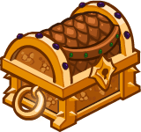ID: 267**Platinum Mehen Chest**Loot for: Mehen<code>"for_crusaders":[80]</code>
        
        
            **Chest**
            Platinum Mehen Chest
            x14 (Shinies x1)
        
    

ID: 713

### Noble Mechanica Nixie Skin & Feat Pack - 1,680 Platinum  
Date of release: 20 May 2026

> Unlock Nixie along with her exclusive Noble Mechanica Skin & Feat!

Contents:

    
        
            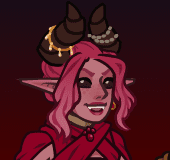ID: 123**Nixie (Seat 1)**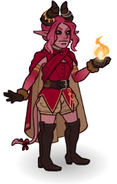
        
        
            **Champion Unlock**
            Nixie
        
    
    
        
            ID: 692**Noble Mechanica Nixie (Nixie)**
        
        
            **Skin**
            Noble Mechanica Nixie
        
    
    
        
            ID: 2586**Embiggen**Look at me! I'm huge! I don't need a fireball anymore! I can just step on them!  Increases the effect of Nixie's Gigantic Growth ability by 80%.<code>buff_upgrade,80,10889</code>
        
        
            **Feat**
            Embiggen
            Nixie
        
    
    
        
            ID: 20**Large Bounty Contract**Claim a bounty worth 8 hours of offline gold earnings and event tokens.<code>seconds_worth_of_gold,28800</code>
        
        
            **Buff**
            Large Bounty Contract
            x6
        
    
    
        
            ID: 34**Large Blacksmithing Contract**Contract a master blacksmith to improve a piece of equipment owned by one of your Champions.<code>level_up_loot,24</code>
        
        
            **Buff**
            Large Blacksmithing Contract
            x6
        
    
    
        
            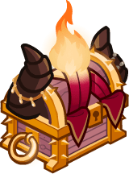ID: 448**Platinum Nixie Chest**Loot for: Nixie<code>"for_crusaders":[123]</code>
        
        
            **Chest**
            Platinum Nixie Chest
            x14 (Shinies x1)
        
    

ID: 714

### Noble Mechanica Vlithryn Skin & Feat Pack - 1,680 Platinum  
Date of release: 20 May 2026

> Unlock Vlithryn along with her exclusive Noble Mechanica Skin & Feat!

Contents:

    
        
            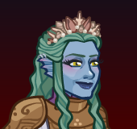ID: 162**Vlithryn (Seat 11)**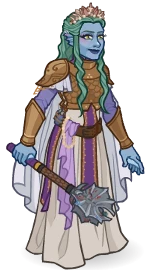
        
        
            **Champion Unlock**
            Vlithryn
        
    
    
        
            ID: 693**Noble Mechanica Vlithryn (Vlithryn)**
        
        
            **Skin**
            Noble Mechanica Vlithryn
        
    
    
        
            ID: 2169**External Screaming**You're literally dying! Of course I can spare the spell slot.  Increases the effect of Vlithryn's Revivify ability by 80%. (Prestack)<code>buff_upgrade,80,16898,0</code>
        
        
            **Feat**
            External Screaming
            Vlithryn
        
    
    
        
            ID: 20**Large Bounty Contract**Claim a bounty worth 8 hours of offline gold earnings and event tokens.<code>seconds_worth_of_gold,28800</code>
        
        
            **Buff**
            Large Bounty Contract
            x6
        
    
    
        
            ID: 34**Large Blacksmithing Contract**Contract a master blacksmith to improve a piece of equipment owned by one of your Champions.<code>level_up_loot,24</code>
        
        
            **Buff**
            Large Blacksmithing Contract
            x6
        
    
    
        
            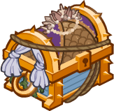ID: 657**Platinum Vlithryn Chest**Loot for: Vlithryn<code>"for_crusaders":[162]</code>
        
        
            **Chest**
            Platinum Vlithryn Chest
            x14 (Shinies x1)
        
    

ID: 715

### Avatar of Ubtao Familiar Pack - 1,680 Platinum  
Date of release: 27 May 2026

> Collect your own Avatar of Ubtao Familiar - the Baby Tyrannosaurus!

Contents:

    
        
            ID: 323**Baby Tyrannosaurus**Look out for those adorable chompers - he bites!
        
        
            **Familiar**
            Baby Tyrannosaurus
        
    
    
        
            ID: 77**Huge Potion of Speed**This potion's yellow fluid is streaked with black and swirls on its own.<code>time_scale,2.75</code>
        
        
            **Buff**
            Huge Potion of Speed
            x2
        
    
    
        
            ID: 1712**Potion of the Hunter**Increase Global Damage by 100%<code>global_dps_multiplier_mult,100</code>
        
        
            **Buff**
            Potion of the Hunter
            x1
        
    
    
        
            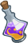ID: 1798**Epic Golden Potion**Gold and purple liquid swirl around each other as if dancing.<code>golden_loot,1</code>
        
        
            **Buff**
            Epic Golden Potion
            x1
        
    

[Back to Top](#top)

*Last Modified: {{ site.time }}*