[Back to Main](index.md)

# Premium Packs and DLC

Upcoming real-money shop items.

ID: 733

### Lae'zel's Legendary Feat Pack - 1,680 Platinum  
Date of release: 22 Jul 2026

> Collect Lae'zel's Legendary Feat & 6 DPS Pigments now!

Contents:

    
        
            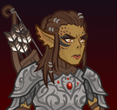ID: 128**Lae'zel (Seat 2)**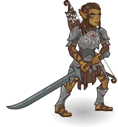
        
        
            **Champion Unlock**
            Lae'zel
        
    
    
        
            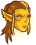ID: 2699**Astral-Touched Tadpole**I can feel them - the might, the vigour, the possibilities...  Lae'zel adds up the total Strength scores of all the Champions adjacent to her and increases the effect of Lethal Coordination by 100% for every 5 Strength she counts, stacking multiplicatively. If she has at least 20 stacks, your formation gains one additional Ceremorphosis stack.<code>effect_def,2791</code>
        
        
            **Feat**
            Astral-Touched Tadpole
            Lae'zel
        
    
    
        
            ID: 1905**Marvelous DPS Pigment**Adds a Champion-tag-based effect to an epic or higher equipment item of your choice!<code>legendary_apply_pigment,2</code>
        
        
            **Buff**
            Marvelous DPS Pigment
            x6
        
    

ID: 734

### Mist Horror Familiar Pack - 1,140 Platinum  
Date of release: 22 Jul 2026

> Collect your own Mist Horror familiar!

Contents:

    
        
            ID: 331**Mist Horror**These vaporous terrors take the shape of their viewers' greatest fears.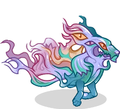
        
        
            **Familiar**
            Mist Horror
        
    
    
        
            ID: 40**Huge Potion of Fire Breath**The orange liquid in this vial flickers and smoke fills the top of the container.<code>click_damage_seconds_global_dps,600</code>
        
        
            **Buff**
            Huge Potion of Fire Breath
            x4
        
    
    
        
            ID: 77**Huge Potion of Speed**This potion's yellow fluid is streaked with black and swirls on its own.<code>time_scale,2.75</code>
        
        
            **Buff**
            Huge Potion of Speed
            x4
        
    

ID: 735

### Sly One Raistlin Skin & Feat Pack - 1,680 Platinum  
Date of release: 29 Jul 2026

> Unlock Raistlin along with his exclusive Sly One Skin & Feat!

Contents:

    
        
            ID: 173**Raistlin (Seat 2)**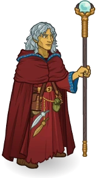
        
        
            **Champion Unlock**
            Raistlin
        
    
    
        
            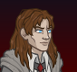ID: 536**Sly One Raistlin (Raistlin)**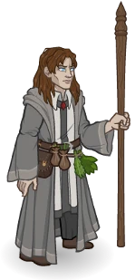
        
        
            **Skin**
            Sly One Raistlin
        
    
    
        
            ID: 2698**Into Darkness**No, my brother, where I go, you cannot follow. ~Raistlin  Increases the effect of Raistlin's Savant ability by 80%. (Prestack)<code>buff_upgrade,80,18930</code>
        
        
            **Feat**
            Into Darkness
            Raistlin
        
    
    
        
            ID: 20**Large Bounty Contract**Claim a bounty worth 8 hours of offline gold earnings and event tokens.<code>seconds_worth_of_gold,28800</code>
        
        
            **Buff**
            Large Bounty Contract
            x6
        
    
    
        
            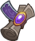ID: 34**Large Blacksmithing Contract**Contract a master blacksmith to improve a piece of equipment owned by one of your Champions.<code>level_up_loot,24</code>
        
        
            **Buff**
            Large Blacksmithing Contract
            x6
        
    
    
        
            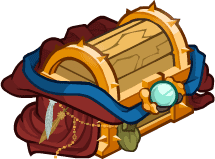ID: 790**Platinum Raistlin Chest**Loot for: Raistlin<code>"for_crusaders":[173]</code>
        
        
            **Chest**
            Platinum Raistlin Chest
            x14 (Shinies x1)
        
    

ID: 763

### From the Vault: Dragonlance Sentry Skin & Feat Pack - 1,000 Platinum  
Date of release: 29 Jul 2026

> Available till the end of the event - Dragonlance Sentry!

Contents:

    
        
            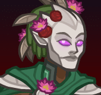ID: 52**Sentry (Seat 4)**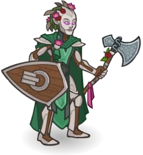
        
        
            **Champion Unlock**
            Sentry
        
    
    
        
            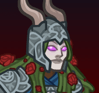ID: 261**Dragonlance Sentry (Sentry)**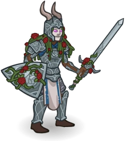
        
        
            **Skin**
            Dragonlance Sentry
        
    
    
        
            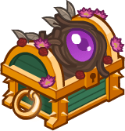ID: 163**Platinum Sentry Chest**Loot for: Sentry<code>"for_crusaders":[52]</code>
        
        
            **Chest**
            Platinum Sentry Chest
            x14 (Shinies x1)
        
    

ID: 764

### From the Vault: Dragonlance Miria Skin & Feat Pack - 1,000 Platinum  
Date of release: 29 Jul 2026

> Available till the end of the event - Dragonlance Miria!

Contents:

    
        
            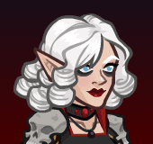ID: 121**Miria (Seat 12)**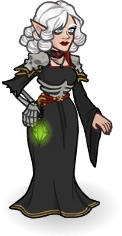
        
        
            **Champion Unlock**
            Miria
        
    
    
        
            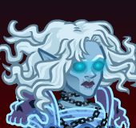ID: 281**Dragonlance Miria (Miria)**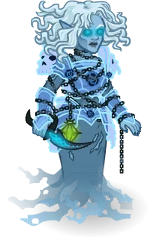
        
        
            **Skin**
            Dragonlance Miria
        
    
    
        
            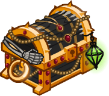ID: 444**Platinum Miria Chest**Loot for: Miria<code>"for_crusaders":[121]</code>
        
        
            **Chest**
            Platinum Miria Chest
            x14 (Shinies x1)
        
    

ID: 742

### Master Craftsman Flint Theme Pack - 3,830 Platinum  
Date of release: 05 Aug 2026

> Unlock Flint along with an exclusive Master Craftsman Skin & Mule Familiar!

Contents:

    
        
            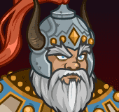ID: 178**Flint**
        
        
            **Champion Unlock**
            Flint
        
    
    
        
            ID: 715**Master Craftsman Flint (Flint)**
        
        
            **Skin**
            Master Craftsman Flint
        
    
    
        
            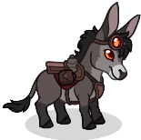ID: 332**Fleetfoot the Mule**Steadfast, strong, and better than any horse.
        
        
            **Familiar**
            Fleetfoot the Mule
        
    
    
        
            ID: 2719**Feat**???: 2719
        
        
            **Feat**
            ???: 2719
        
    
    
        
            ID: 829**Platinum Flint Chest**Loot for: Flint<code>"for_crusaders":[178]</code>
        
        
            **Chest**
            Platinum Flint Chest
            x32 (Shinies x2)
        
    
    
        
            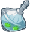ID: 1723**Potion of the Gem Hunter**Increases the gem drops from bosses by 50%<code>increase_boss_gems_percent,50</code>
        
        
            **Buff**
            Potion of the Gem Hunter
            x1
        
    

ID: 743

### Joyful Jester Omin Skin & Feat Pack - 1,680 Platinum  
Date of release: 05 Aug 2026

> Unlock Omin along with his exclusive Joyful Jester Skin & Feat!

Contents:

    
        
            ID: 65**Omin (Seat 3)**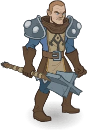
        
        
            **Champion Unlock**
            Omin
        
    
    
        
            ID: 716**Joyful Jester Omin (Omin)**
        
        
            **Skin**
            Joyful Jester Omin
        
    
    
        
            ID: 2739**TBD Omin Feat (Do not translate)**
        
        
            **Feat**
            TBD Omin Feat (Do not translate)
            Omin
        
    
    
        
            ID: 20**Large Bounty Contract**Claim a bounty worth 8 hours of offline gold earnings and event tokens.<code>seconds_worth_of_gold,28800</code>
        
        
            **Buff**
            Large Bounty Contract
            x6
        
    
    
        
            ID: 34**Large Blacksmithing Contract**Contract a master blacksmith to improve a piece of equipment owned by one of your Champions.<code>level_up_loot,24</code>
        
        
            **Buff**
            Large Blacksmithing Contract
            x6
        
    
    
        
            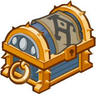ID: 189**Platinum Omin Chest**Loot for: Omin<code>"for_crusaders":[65]</code>
        
        
            **Chest**
            Platinum Omin Chest
            x14 (Shinies x1)
        
    

ID: 744

### Colorweaver Jim Skin & Feat Pack - 1,680 Platinum  
Date of release: 05 Aug 2026

> Unlock Jim along with his exclusive Colorweaver Skin & Feat!

Contents:

    
        
            ID: 48**Jim (Seat 7)**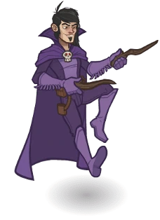
        
        
            **Champion Unlock**
            Jim
        
    
    
        
            ID: 717**Colorweaver Jim (Jim)**
        
        
            **Skin**
            Colorweaver Jim
        
    
    
        
            ID: 2740**TBD Jim Feat (Do not translate)**
        
        
            **Feat**
            TBD Jim Feat (Do not translate)
            Jim
        
    
    
        
            ID: 20**Large Bounty Contract**Claim a bounty worth 8 hours of offline gold earnings and event tokens.<code>seconds_worth_of_gold,28800</code>
        
        
            **Buff**
            Large Bounty Contract
            x6
        
    
    
        
            ID: 34**Large Blacksmithing Contract**Contract a master blacksmith to improve a piece of equipment owned by one of your Champions.<code>level_up_loot,24</code>
        
        
            **Buff**
            Large Blacksmithing Contract
            x6
        
    
    
        
            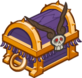ID: 106**Platinum Jim Chest**Loot for: Jim<code>"for_crusaders":[48]</code>
        
        
            **Chest**
            Platinum Jim Chest
            x14 (Shinies x1)
        
    

ID: 745

### Weaponsmith Lae'zel Skin & Feat Pack - 1,680 Platinum  
Date of release: 12 Aug 2026

> Unlock Lae'zel along with her exclusive Weaponsmith Skin & Feat!

Contents:

    
        
            ID: 128**Lae'zel (Seat 2)**
        
        
            **Champion Unlock**
            Lae'zel
        
    
    
        
            ID: 718**Weaponsmith Lae'zel (Lae'zel)**
        
        
            **Skin**
            Weaponsmith Lae'zel
        
    
    
        
            ID: 2741**TBD Lae'zel Feat (Do not translate)**
        
        
            **Feat**
            TBD Lae'zel Feat (Do not translate)
            Lae'zel
        
    
    
        
            ID: 20**Large Bounty Contract**Claim a bounty worth 8 hours of offline gold earnings and event tokens.<code>seconds_worth_of_gold,28800</code>
        
        
            **Buff**
            Large Bounty Contract
            x6
        
    
    
        
            ID: 34**Large Blacksmithing Contract**Contract a master blacksmith to improve a piece of equipment owned by one of your Champions.<code>level_up_loot,24</code>
        
        
            **Buff**
            Large Blacksmithing Contract
            x6
        
    
    
        
            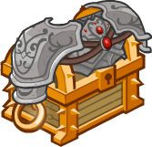ID: 458**Platinum Lae'zel Chest**Loot for: Lae'zel<code>"for_crusaders":[128]</code>
        
        
            **Chest**
            Platinum Lae'zel Chest
            x14 (Shinies x1)
        
    

ID: 746

### Oak the Donkey Toy Familiar Pack - 1,680 Platinum  
Date of release: 12 Aug 2026

> Collect your own Oak the Donkey Toy familiar!

Contents:

    
        
            ID: 333**Oak the Donkey Toy**At least it's not a horse…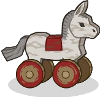
        
        
            **Familiar**
            Oak the Donkey Toy
        
    
    
        
            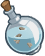ID: 4**Huge Potion of Giant's Strength**A transparent potion in which floats the sliver of a giant's fingernail.<code>global_dps_multiplier_mult,900</code>
        
        
            **Buff**
            Huge Potion of Giant's Strength
            x4
        
    
    
        
            ID: 8**Huge Potion of Clairvoyance**Three eyeballs bob in this yellowish potion.<code>gold_multiplier_mult,400</code>
        
        
            **Buff**
            Huge Potion of Clairvoyance
            x4
        
    
    
        
            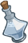ID: 36**Potion of Polish**This shiny, silver liquid clings to the edge of the bottle in an unusual way.<code>shiny_loot,1</code>
        
        
            **Buff**
            Potion of Polish
            x1
        
    
    
        
            ID: 77**Huge Potion of Speed**This potion's yellow fluid is streaked with black and swirls on its own.<code>time_scale,2.75</code>
        
        
            **Buff**
            Huge Potion of Speed
            x4
        
    

ID: 747

### Prismatic Painter Ellywick Skin & Feat Pack - 1,680 Platinum  
Date of release: 19 Aug 2026

> Unlock Ellywick along with her exclusive Prismatic Painter Skin & Feat!

Contents:

    
        
            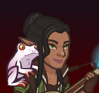ID: 83**Ellywick (Seat 10)**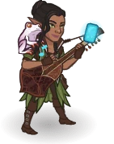
        
        
            **Champion Unlock**
            Ellywick
        
    
    
        
            ID: 719**Prismatic Painter Ellywick (Ellywick)**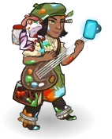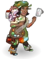
        
        
            **Skin**
            Prismatic Painter Ellywick
        
    
    
        
            ID: 2742**TBD Ellywick Feat (Do not translate)**
        
        
            **Feat**
            TBD Ellywick Feat (Do not translate)
            Ellywick
        
    
    
        
            ID: 20**Large Bounty Contract**Claim a bounty worth 8 hours of offline gold earnings and event tokens.<code>seconds_worth_of_gold,28800</code>
        
        
            **Buff**
            Large Bounty Contract
            x6
        
    
    
        
            ID: 34**Large Blacksmithing Contract**Contract a master blacksmith to improve a piece of equipment owned by one of your Champions.<code>level_up_loot,24</code>
        
        
            **Buff**
            Large Blacksmithing Contract
            x6
        
    
    
        
            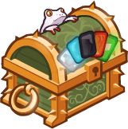ID: 273**Platinum Ellywick Chest**Loot for: Ellywick<code>"for_crusaders":[83]</code>
        
        
            **Chest**
            Platinum Ellywick Chest
            x14 (Shinies x1)
        
    

ID: 748

### Pigment the Flying Monkey Familiar Pack - 840 Platinum  
Date of release: 19 Aug 2026

> Collect your own Pigment the Flying Monkey familiar!

Contents:

    
        
            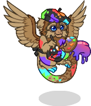ID: 334**Pigment the Flying Monkey**Maybe a bit more blue…
        
        
            **Familiar**
            Pigment the Flying Monkey
        
    
    
        
            ID: 4**Huge Potion of Giant's Strength**A transparent potion in which floats the sliver of a giant's fingernail.<code>global_dps_multiplier_mult,900</code>
        
        
            **Buff**
            Huge Potion of Giant's Strength
            x2
        
    
    
        
            ID: 8**Huge Potion of Clairvoyance**Three eyeballs bob in this yellowish potion.<code>gold_multiplier_mult,400</code>
        
        
            **Buff**
            Huge Potion of Clairvoyance
            x2
        
    
    
        
            ID: 77**Huge Potion of Speed**This potion's yellow fluid is streaked with black and swirls on its own.<code>time_scale,2.75</code>
        
        
            **Buff**
            Huge Potion of Speed
            x2
        
    

ID: 749

### Shadowheart's Legendary Feat Pack - 1,680 Platinum  
Date of release: 26 Aug 2026

> Unlock Shadowheart's full potential with her Legendary Feat & 6 Healing Pigments now!

Contents:

    
        
            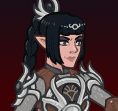ID: 141**Shadowheart (Seat 6)**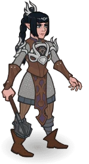
        
        
            **Champion Unlock**
            Shadowheart
        
    
    
        
            ID: 1**Selflessness**Aye, a selfless dwarf I am.  All Champions damage +10%.<code>global_dps_multiplier_mult,10</code>
        
        
            **Feat**
            Selflessness
            Bruenor
        
    
    
        
            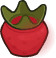ID: 1906**Marvelous Healing Pigment**Adds a Champion-tag-based effect to an epic or higher equipment item of your choice!<code>legendary_apply_pigment,3</code>
        
        
            **Buff**
            Marvelous Healing Pigment
            x6
        
    

ID: 750

### Caramon, Guardian of the Future Theme Pack - 3,830 Platinum  
Date of release: 02 Sept 2026

> Unlock Caramon along with an exclusive Guardian of the Future Skin & Bear Familiar!

Contents:

    
        
            ID: 179**Caramon**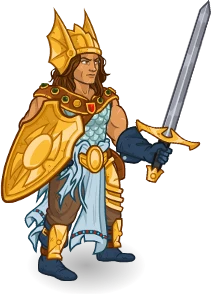
        
        
            **Champion Unlock**
            Caramon
        
    
    
        
            ID: 720**Caramon, Guardian of the Future (Caramon)**
        
        
            **Skin**
            Caramon, Guardian of the Future
        
    
    
        
            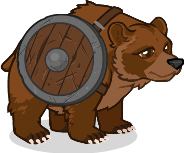ID: 335**Sentry the Bear**Do not worry, Sentry is watching.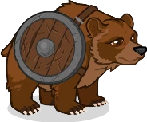
        
        
            **Familiar**
            Sentry the Bear
        
    
    
        
            ID: 1**Selflessness**Aye, a selfless dwarf I am.  All Champions damage +10%.<code>global_dps_multiplier_mult,10</code>
        
        
            **Feat**
            Selflessness
            Bruenor
        
    
    
        
            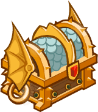ID: 831**Platinum Caramon Chest**Loot for: Caramon<code>"for_crusaders":[179]</code>
        
        
            **Chest**
            Platinum Caramon Chest
            x32 (Shinies x2)
        
    
    
        
            ID: 1723**Potion of the Gem Hunter**Increases the gem drops from bosses by 50%<code>increase_boss_gems_percent,50</code>
        
        
            **Buff**
            Potion of the Gem Hunter
            x1
        
    

ID: 751

### Schoolyard Bruiser Bobby Skin & Feat Pack - 1,680 Platinum  
Date of release: 02 Sept 2026

> Unlock Bobby along with his exclusive Schoolyard Bruiser Skin & Feat!

Contents:

    
        
            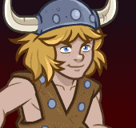ID: 152**Bobby (Seat 12)**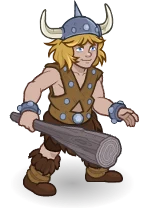
        
        
            **Champion Unlock**
            Bobby
        
    
    
        
            ID: 721**Schoolyard Bruiser Bobby (Bobby)**
        
        
            **Skin**
            Schoolyard Bruiser Bobby
        
    
    
        
            ID: 2635**TBD Bobby Feat (Do not translate)**
        
        
            **Feat**
            TBD Bobby Feat (Do not translate)
            Bobby
        
    
    
        
            ID: 20**Large Bounty Contract**Claim a bounty worth 8 hours of offline gold earnings and event tokens.<code>seconds_worth_of_gold,28800</code>
        
        
            **Buff**
            Large Bounty Contract
            x6
        
    
    
        
            ID: 34**Large Blacksmithing Contract**Contract a master blacksmith to improve a piece of equipment owned by one of your Champions.<code>level_up_loot,24</code>
        
        
            **Buff**
            Large Blacksmithing Contract
            x6
        
    
    
        
            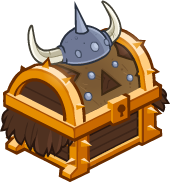ID: 575**Platinum Bobby Chest**Loot for: Bobby<code>"for_crusaders":[152]</code>
        
        
            **Chest**
            Platinum Bobby Chest
            x14 (Shinies x1)
        
    

ID: 752

### Dungeon Botanist Stoki Skin & Feat Pack - 1,680 Platinum  
Date of release: 02 Sept 2026

> Unlock Stoki along with her exclusive Dungeon Botanist Skin & Feat!

Contents:

    
        
            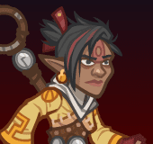ID: 14**Stoki (Seat 4)**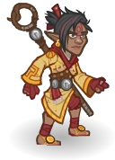
        
        
            **Champion Unlock**
            Stoki
        
    
    
        
            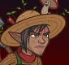ID: 722**Dungeon Botanist Stoki (Stoki)**
        
        
            **Skin**
            Dungeon Botanist Stoki
        
    
    
        
            ID: 2743**TBD Stoki Feat (Do not translate)**
        
        
            **Feat**
            TBD Stoki Feat (Do not translate)
            Stoki
        
    
    
        
            ID: 20**Large Bounty Contract**Claim a bounty worth 8 hours of offline gold earnings and event tokens.<code>seconds_worth_of_gold,28800</code>
        
        
            **Buff**
            Large Bounty Contract
            x6
        
    
    
        
            ID: 34**Large Blacksmithing Contract**Contract a master blacksmith to improve a piece of equipment owned by one of your Champions.<code>level_up_loot,24</code>
        
        
            **Buff**
            Large Blacksmithing Contract
            x6
        
    
    
        
            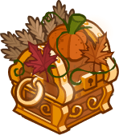ID: 4**Platinum Stoki Chest**Loot for: Stoki<code>"for_crusaders":[14]</code>
        
        
            **Chest**
            Platinum Stoki Chest
            x14 (Shinies x1)
        
    

ID: 753

### Pungent Professor Pwent Skin & Feat Pack - 1,680 Platinum  
Date of release: 09 Sept 2026

> Unlock Pwent along with his exclusive Pungent Professor Skin & Feat!

Contents:

    
        
            ID: 50**Pwent (Seat 5)**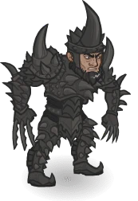
        
        
            **Champion Unlock**
            Pwent
        
    
    
        
            ID: 723**Pungent Professor Pwent (Pwent)**
        
        
            **Skin**
            Pungent Professor Pwent
        
    
    
        
            ID: 2744**TBD Pwent Feat (Do not translate)**
        
        
            **Feat**
            TBD Pwent Feat (Do not translate)
            Pwent
        
    
    
        
            ID: 20**Large Bounty Contract**Claim a bounty worth 8 hours of offline gold earnings and event tokens.<code>seconds_worth_of_gold,28800</code>
        
        
            **Buff**
            Large Bounty Contract
            x6
        
    
    
        
            ID: 34**Large Blacksmithing Contract**Contract a master blacksmith to improve a piece of equipment owned by one of your Champions.<code>level_up_loot,24</code>
        
        
            **Buff**
            Large Blacksmithing Contract
            x6
        
    
    
        
            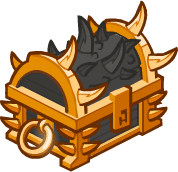ID: 159**Platinum Pwent Chest**Loot for: Pwent<code>"for_crusaders":[50]</code>
        
        
            **Chest**
            Platinum Pwent Chest
            x14 (Shinies x1)
        
    

ID: 754

### Watson the Treant Sapling Familiar Pack - 2,380 Platinum  
Date of release: 09 Sept 2026

> Collect your own Watson the Treant Sapling familiar!

Contents:

    
        
            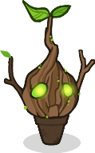ID: 336**Watson the Treant Sapling**One day, he'll be a real Treant!
        
        
            **Familiar**
            Watson the Treant Sapling
        
    
    
        
            ID: 4**Huge Potion of Giant's Strength**A transparent potion in which floats the sliver of a giant's fingernail.<code>global_dps_multiplier_mult,900</code>
        
        
            **Buff**
            Huge Potion of Giant's Strength
            x6
        
    
    
        
            ID: 8**Huge Potion of Clairvoyance**Three eyeballs bob in this yellowish potion.<code>gold_multiplier_mult,400</code>
        
        
            **Buff**
            Huge Potion of Clairvoyance
            x6
        
    
    
        
            ID: 36**Potion of Polish**This shiny, silver liquid clings to the edge of the bottle in an unusual way.<code>shiny_loot,1</code>
        
        
            **Buff**
            Potion of Polish
            x1
        
    
    
        
            ID: 40**Huge Potion of Fire Breath**The orange liquid in this vial flickers and smoke fills the top of the container.<code>click_damage_seconds_global_dps,600</code>
        
        
            **Buff**
            Huge Potion of Fire Breath
            x6
        
    
    
        
            ID: 77**Huge Potion of Speed**This potion's yellow fluid is streaked with black and swirls on its own.<code>time_scale,2.75</code>
        
        
            **Buff**
            Huge Potion of Speed
            x6
        
    
    
        
            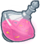ID: 1721**Potion of the Gold Hunter**Increase Gold Find by 100%<code>gold_multiplier_mult,100</code>
        
        
            **Buff**
            Potion of the Gold Hunter
            x1
        
    
    
        
            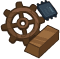**Modron Component Pieces**
        
        
            **Modron Component Pieces**
            x2,000
        
    

ID: 755

### Shadow Studies Cazrin Skin & Feat Pack - 1,680 Platinum  
Date of release: 16 Sept 2026

> Unlock Cazrin along with her exclusive Shadow Studies Skin & Feat!

Contents:

    
        
            ID: 166**Cazrin (Seat 10)**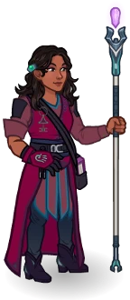
        
        
            **Champion Unlock**
            Cazrin
        
    
    
        
            ID: 724**Shadow Studies Cazrin (Cazrin)**
        
        
            **Skin**
            Shadow Studies Cazrin
        
    
    
        
            ID: 2745**TBD Cazrin Feat (Do not translate)**
        
        
            **Feat**
            TBD Cazrin Feat (Do not translate)
            Cazrin
        
    
    
        
            ID: 20**Large Bounty Contract**Claim a bounty worth 8 hours of offline gold earnings and event tokens.<code>seconds_worth_of_gold,28800</code>
        
        
            **Buff**
            Large Bounty Contract
            x6
        
    
    
        
            ID: 34**Large Blacksmithing Contract**Contract a master blacksmith to improve a piece of equipment owned by one of your Champions.<code>level_up_loot,24</code>
        
        
            **Buff**
            Large Blacksmithing Contract
            x6
        
    
    
        
            ID: 665**Platinum Cazrin Chest**Loot for: Cazrin<code>"for_crusaders":[166]</code>
        
        
            **Chest**
            Platinum Cazrin Chest
            x14 (Shinies x1)
        
    

ID: 756

### Cinder Scholar Salamander Familiar Pack - 1,140 Platinum  
Date of release: 16 Sept 2026

> Collect your own Cinder Scholar Salamander familiar!

Contents:

    
        
            ID: 337**Cinder Scholar Salamander**Only the best fire resistant parchment for this one!
        
        
            **Familiar**
            Cinder Scholar Salamander
        
    
    
        
            ID: 40**Huge Potion of Fire Breath**The orange liquid in this vial flickers and smoke fills the top of the container.<code>click_damage_seconds_global_dps,600</code>
        
        
            **Buff**
            Huge Potion of Fire Breath
            x4
        
    
    
        
            ID: 77**Huge Potion of Speed**This potion's yellow fluid is streaked with black and swirls on its own.<code>time_scale,2.75</code>
        
        
            **Buff**
            Huge Potion of Speed
            x4
        
    

ID: 757

### Eric's Legendary Feat Pack - 1,680 Platinum  
Date of release: 23 Sept 2026

> Unlock Eric's full potential with his Legendary Feat & 6 Tanking Pigments now!

Contents:

    
        
            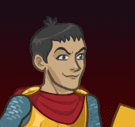ID: 157**Eric (Seat 4)**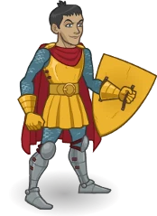
        
        
            **Champion Unlock**
            Eric
        
    
    
        
            ID: 1**Selflessness**Aye, a selfless dwarf I am.  All Champions damage +10%.<code>global_dps_multiplier_mult,10</code>
        
        
            **Feat**
            Selflessness
            Bruenor
        
    
    
        
            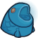ID: 1907**Marvelous Tanking Pigment**Adds a Champion-tag-based effect to an epic or higher equipment item of your choice!<code>legendary_apply_pigment,4</code>
        
        
            **Buff**
            Marvelous Tanking Pigment
            x6
        
    

ID: 758

### Scholar of the Nine Hells Karlach Skin & Feat Pack - 1,680 Platinum  
Date of release: 30 Sept 2026

> Unlock Karlach along with her exclusive Scholar of the Nine Hells Skin & Feat!

Contents:

    
        
            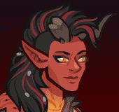ID: 143**Karlach (Seat 4)**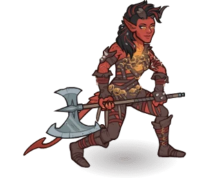
        
        
            **Champion Unlock**
            Karlach
        
    
    
        
            ID: 725**Scholar of the Nine Hells Karlach (Karlach)**
        
        
            **Skin**
            Scholar of the Nine Hells Karlach
        
    
    
        
            ID: 2746**TBD Karlach Feat (Do not translate)**
        
        
            **Feat**
            TBD Karlach Feat (Do not translate)
            Karlach
        
    
    
        
            ID: 20**Large Bounty Contract**Claim a bounty worth 8 hours of offline gold earnings and event tokens.<code>seconds_worth_of_gold,28800</code>
        
        
            **Buff**
            Large Bounty Contract
            x6
        
    
    
        
            ID: 34**Large Blacksmithing Contract**Contract a master blacksmith to improve a piece of equipment owned by one of your Champions.<code>level_up_loot,24</code>
        
        
            **Buff**
            Large Blacksmithing Contract
            x6
        
    
    
        
            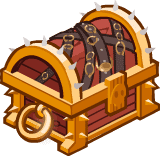ID: 557**Platinum  Karlach Chest**Loot for: Karlach<code>"for_crusaders":[143]</code>
        
        
            **Chest**
            Platinum  Karlach Chest
            x14 (Shinies x1)
        
    

[Back to Top](#top)

*Last Modified: {{ site.time }}*