[Back to Main](index.md)

# Premium Packs and DLC

Upcoming real-money shop items.

ID: 712

### Clockwork General Mehen Skin & Feat Pack - 1,680 Platinum  
Date of release: 20 May 2026

> Unlock Mehen along with his exclusive Clockwork General Skin & Feat!

Contents:

    
        
            ID: 80**Mehen (Seat 3)**
        
        
            **Champion Unlock**
            Mehen
        
    
    
        
            ID: 691**Clockwork General Mehen (Mehen)**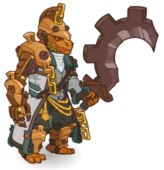
        
        
            **Skin**
            Clockwork General Mehen
        
    
    
        
            ID: 2585**Guaranteed Grump**I'm certain of few things in this life. Disappointment is one of them.  Increases the effect of Mehen's Grumpy ability by 80%. (Prestack)<code>buff_upgrade,80,16146,0</code>
        
        
            **Feat**
            Guaranteed Grump
            Mehen
        
    
    
        
            ID: 20**Large Bounty Contract**Claim a bounty worth 8 hours of offline gold earnings and event tokens.<code>seconds_worth_of_gold,28800</code>
        
        
            **Buff**
            Large Bounty Contract
            x6
        
    
    
        
            ID: 34**Large Blacksmithing Contract**Contract a master blacksmith to improve a piece of equipment owned by one of your Champions.<code>level_up_loot,24</code>
        
        
            **Buff**
            Large Blacksmithing Contract
            x6
        
    
    
        
            ID: 267**Platinum Mehen Chest**Loot for: Mehen<code>"for_crusaders":[80]</code>
        
        
            **Chest**
            Platinum Mehen Chest
            x14 (Shinies x1)
        
    

ID: 713

### Noble Mechanica Nixie Skin & Feat Pack - 1,680 Platinum  
Date of release: 20 May 2026

> Unlock Nixie along with her exclusive Noble Mechanica Skin & Feat!

Contents:

    
        
            ID: 123**Nixie (Seat 1)**
        
        
            **Champion Unlock**
            Nixie
        
    
    
        
            ID: 692**Noble Mechanica Nixie (Nixie)**
        
        
            **Skin**
            Noble Mechanica Nixie
        
    
    
        
            ID: 2586**Embiggen**Look at me! I'm huge! I don't need a fireball anymore! I can just step on them!  Increases the effect of Nixie's Gigantic Growth ability by 80%.<code>buff_upgrade,80,10889</code>
        
        
            **Feat**
            Embiggen
            Nixie
        
    
    
        
            ID: 20**Large Bounty Contract**Claim a bounty worth 8 hours of offline gold earnings and event tokens.<code>seconds_worth_of_gold,28800</code>
        
        
            **Buff**
            Large Bounty Contract
            x6
        
    
    
        
            ID: 34**Large Blacksmithing Contract**Contract a master blacksmith to improve a piece of equipment owned by one of your Champions.<code>level_up_loot,24</code>
        
        
            **Buff**
            Large Blacksmithing Contract
            x6
        
    
    
        
            ID: 448**Platinum Nixie Chest**Loot for: Nixie<code>"for_crusaders":[123]</code>
        
        
            **Chest**
            Platinum Nixie Chest
            x14 (Shinies x1)
        
    

ID: 714

### Noble Mechanica Vlithryn Skin & Feat Pack - 1,680 Platinum  
Date of release: 20 May 2026

> Unlock Vlithryn along with her exclusive Noble Mechanica Skin & Feat!

Contents:

    
        
            ID: 162**Vlithryn (Seat 11)**
        
        
            **Champion Unlock**
            Vlithryn
        
    
    
        
            ID: 693**Noble Mechanica Vlithryn (Vlithryn)**
        
        
            **Skin**
            Noble Mechanica Vlithryn
        
    
    
        
            ID: 2169**External Screaming**You're literally dying! Of course I can spare the spell slot.  Increases the effect of Vlithryn's Revivify ability by 80%. (Prestack)<code>buff_upgrade,80,16898,0</code>
        
        
            **Feat**
            External Screaming
            Vlithryn
        
    
    
        
            ID: 20**Large Bounty Contract**Claim a bounty worth 8 hours of offline gold earnings and event tokens.<code>seconds_worth_of_gold,28800</code>
        
        
            **Buff**
            Large Bounty Contract
            x6
        
    
    
        
            ID: 34**Large Blacksmithing Contract**Contract a master blacksmith to improve a piece of equipment owned by one of your Champions.<code>level_up_loot,24</code>
        
        
            **Buff**
            Large Blacksmithing Contract
            x6
        
    
    
        
            ID: 657**Platinum Vlithryn Chest**Loot for: Vlithryn<code>"for_crusaders":[162]</code>
        
        
            **Chest**
            Platinum Vlithryn Chest
            x14 (Shinies x1)
        
    

ID: 715

### Avatar of Ubtao Familiar Pack - 1,680 Platinum  
Date of release: 27 May 2026

> Collect your own Avatar of Ubtao Familiar - the Baby Tyrannosaurus!

Contents:

    
        
            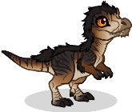ID: 323**Baby Tyrannosaurus**Look out for those adorable chompers - he bites!
        
        
            **Familiar**
            Baby Tyrannosaurus
        
    
    
        
            ID: 77**Huge Potion of Speed**This potion's yellow fluid is streaked with black and swirls on its own.<code>time_scale,2.75</code>
        
        
            **Buff**
            Huge Potion of Speed
            x2
        
    
    
        
            ID: 1712**Potion of the Hunter**Increase Global Damage by 100%<code>global_dps_multiplier_mult,100</code>
        
        
            **Buff**
            Potion of the Hunter
            x1
        
    
    
        
            ID: 1798**Epic Golden Potion**Gold and purple liquid swirl around each other as if dancing.<code>golden_loot,1</code>
        
        
            **Buff**
            Epic Golden Potion
            x1
        
    

ID: 717

### Summer Court Trixie Theme Pack - 3,830 Platinum  
Date of release: 03 Jun 2026

> Unlock Trixie along with an exclusive Summer Court Skin & Familiar!

Contents:

    
        
            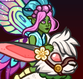ID: 176**Trixie**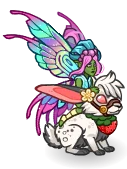
        
        
            **Champion Unlock**
            Trixie
        
    
    
        
            ID: 695**Summer Court Trixie (Trixie)**
        
        
            **Skin**
            Summer Court Trixie
        
    
    
        
            ID: 324**Vex the Tressym**That is not your chair; that is my throne.
        
        
            **Familiar**
            Vex the Tressym
        
    
    
        
            ID: 2616**Feat**???: 2616
        
        
            **Feat**
            ???: 2616
        
    
    
        
            ID: 814**Platinum Trixie Chest**Loot for: Trixie<code>"for_crusaders":[176]</code>
        
        
            **Chest**
            Platinum Trixie Chest
            x32 (Shinies x2)
        
    
    
        
            ID: 1723**Potion of the Gem Hunter**Increases the gem drops from bosses by 50%<code>increase_boss_gems_percent,50</code>
        
        
            **Buff**
            Potion of the Gem Hunter
            x1
        
    

ID: 718

### Viscount Ravengard Skin & Feat Pack - 1,680 Platinum  
Date of release: 03 Jun 2026

> Unlock Duke Ravengard along with his exclusive Viscount Skin & Feat!

Contents:

    
        
            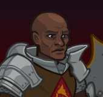ID: 149**Ravengard (Seat 8)**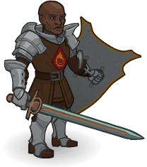
        
        
            **Champion Unlock**
            Ravengard
        
    
    
        
            ID: 696**Viscount Ravengard (Ravengard)**
        
        
            **Skin**
            Viscount Ravengard
        
    
    
        
            ID: 2633**TBD Ravengard Feat (Do not translate)**
        
        
            **Feat**
            TBD Ravengard Feat (Do not translate)
            Ravengard
        
    
    
        
            ID: 20**Large Bounty Contract**Claim a bounty worth 8 hours of offline gold earnings and event tokens.<code>seconds_worth_of_gold,28800</code>
        
        
            **Buff**
            Large Bounty Contract
            x6
        
    
    
        
            ID: 34**Large Blacksmithing Contract**Contract a master blacksmith to improve a piece of equipment owned by one of your Champions.<code>level_up_loot,24</code>
        
        
            **Buff**
            Large Blacksmithing Contract
            x6
        
    
    
        
            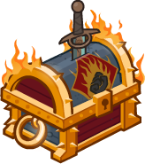ID: 569**Platinum Duke Ravengard Chest**Loot for: Ravengard<code>"for_crusaders":[149]</code>
        
        
            **Chest**
            Platinum Duke Ravengard Chest
            x14 (Shinies x1)
        
    

ID: 719

### Root the Korred Familiar & Modron Pack - 2,380 Platinum  
Date of release: 03 Jun 2026

> Collect your own Root the Korred Familiar, along with 3 Epic Modron Components, a week long Modron buff potion, and 2000 Component pieces!

Contents:

    
        
            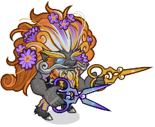ID: 325**Root the Korred**Jeweler of the Queen, Queen of the Jewelers.
        
        
            **Familiar**
            Root the Korred
        
    
    
        
            ID: 1722**Potion of Psychomorphic Energy**Increases the bonuses provided by Modron Core outputs<code>increase_all_modron_buffs,50</code>
        
        
            **Buff**
            Potion of Psychomorphic Energy
            x1
        
    
    
        
            **Modron Component Pieces**
        
        
            **Modron Component Pieces**
            x2,000
        
    
    
        
            ID: 80**Undirected Cross Component**
        
        
            **Modron Pipe**
            Undirected Cross Component
        
    
    
        
            ID: 126**Directed T Component (1 out)**
        
        
            **Modron Pipe**
            Directed T Component (1 out)
        
    
    
        
            ID: 168**Directed Cross Component (1 out)**
        
        
            **Modron Pipe**
            Directed Cross Component (1 out)
        
    

ID: 720

### Iridescent Wynling Familiar Pack - $5.99  
Date of release: 08 Jun 2026

> Collect your own Iridescent Wynling familiar!

ⓘ *Note: It appears that this pack will only be available for real money instead of Platinum.*

Contents:

    
        
            ID: 326**Iridescent Wynling**Playful and mischievous, wynlings defend mountain heights, alpine vales, and sometimes even summer courts against trespassers.
        
        
            **Familiar**
            Iridescent Wynling
        
    
    
        
            ID: 4**Huge Potion of Giant's Strength**A transparent potion in which floats the sliver of a giant's fingernail.<code>global_dps_multiplier_mult,900</code>
        
        
            **Buff**
            Huge Potion of Giant's Strength
            x2
        
    
    
        
            ID: 8**Huge Potion of Clairvoyance**Three eyeballs bob in this yellowish potion.<code>gold_multiplier_mult,400</code>
        
        
            **Buff**
            Huge Potion of Clairvoyance
            x2
        
    
    
        
            ID: 77**Huge Potion of Speed**This potion's yellow fluid is streaked with black and swirls on its own.<code>time_scale,2.75</code>
        
        
            **Buff**
            Huge Potion of Speed
            x2
        
    

ID: 721

### Fey Touched Brother Uriah Theme Pack - 3,830 Platinum  
Date of release: 10 Jun 2026

> Unlock Brother Uriah along with an exclusive Fey Touched Skin & Familiar!

Contents:

    
        
            ID: 112**Y4E15**
        
        
            **Champion Unlock**
            Y4E15
        
    
    
        
            ID: 697**Fey Touched Brother Uriah (Y4E15)**
        
        
            **Skin**
            Fey Touched Brother Uriah
        
    
    
        
            ID: 327**Atchoo the Dahlia**Leaf it to me!
        
        
            **Familiar**
            Atchoo the Dahlia
        
    
    
        
            ID: 1**Selflessness**Aye, a selfless dwarf I am.  All Champions damage +10%.<code>global_dps_multiplier_mult,10</code>
        
        
            **Feat**
            Selflessness
            Bruenor
        
    
    
        
            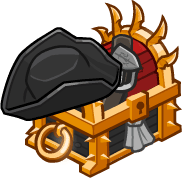ID: 440**Platinum Brother Uriah Chest**Loot for: Uriah<code>"for_crusaders":[119]</code>
        
        
            **Chest**
            Platinum Brother Uriah Chest
            x32 (Shinies x2)
        
    
    
        
            ID: 1723**Potion of the Gem Hunter**Increases the gem drops from bosses by 50%<code>increase_boss_gems_percent,50</code>
        
        
            **Buff**
            Potion of the Gem Hunter
            x1
        
    

ID: 722

### Summer Court Antrius Skin & Feat Pack - 1,680 Platinum  
Date of release: 10 Jun 2026

> Unlock Antrius along with his exclusive Summer Court Skin & Feat!

Contents:

    
        
            ID: 122**Antrius (Seat 4)**
        
        
            **Champion Unlock**
            Antrius
        
    
    
        
            ID: 698**Summer Court Antrius (Antrius)**
        
        
            **Skin**
            Summer Court Antrius
        
    
    
        
            ID: 2634**TBD Antrius Feat (Do not translate)**
        
        
            **Feat**
            TBD Antrius Feat (Do not translate)
            Antrius
        
    
    
        
            ID: 20**Large Bounty Contract**Claim a bounty worth 8 hours of offline gold earnings and event tokens.<code>seconds_worth_of_gold,28800</code>
        
        
            **Buff**
            Large Bounty Contract
            x6
        
    
    
        
            ID: 34**Large Blacksmithing Contract**Contract a master blacksmith to improve a piece of equipment owned by one of your Champions.<code>level_up_loot,24</code>
        
        
            **Buff**
            Large Blacksmithing Contract
            x6
        
    
    
        
            ID: 446**Platinum Antrius Chest**Loot for: Antrius<code>"for_crusaders":[122]</code>
        
        
            **Chest**
            Platinum Antrius Chest
            x14 (Shinies x1)
        
    

ID: 723

### Buzzwin Skin & Feat Pack - 1,680 Platinum  
Date of release: 17 Jun 2026

> Unlock Binwin along with his exclusive Buzzwin Skin & Feat!

Contents:

    
        
            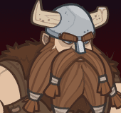ID: 27**Binwin (Seat 3)**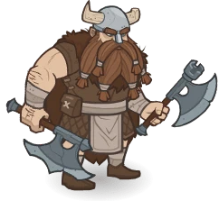
        
        
            **Champion Unlock**
            Binwin
        
    
    
        
            ID: 699**Buzzwin (Binwin)**
        
        
            **Skin**
            Buzzwin
        
    
    
        
            ID: 2635**TBD Binwin Feat (Do not translate)**
        
        
            **Feat**
            TBD Binwin Feat (Do not translate)
            Binwin
        
    
    
        
            ID: 20**Large Bounty Contract**Claim a bounty worth 8 hours of offline gold earnings and event tokens.<code>seconds_worth_of_gold,28800</code>
        
        
            **Buff**
            Large Bounty Contract
            x6
        
    
    
        
            ID: 34**Large Blacksmithing Contract**Contract a master blacksmith to improve a piece of equipment owned by one of your Champions.<code>level_up_loot,24</code>
        
        
            **Buff**
            Large Blacksmithing Contract
            x6
        
    
    
        
            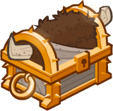ID: 46**Platinum Binwin Chest**Loot for: Binwin<code>"for_crusaders":[27]</code>
        
        
            **Chest**
            Platinum Binwin Chest
            x14 (Shinies x1)
        
    

ID: 724

### Summer Court Dungeon Master Skin & Feat Pack - 1,680 Platinum  
Date of release: 17 Jun 2026

> Unlock Dungeon Master along with his exclusive Summer Court Skin & Feat!

Contents:

    
        
            ID: 99**Dungeon Master (Seat 6)**
        
        
            **Champion Unlock**
            Dungeon Master
        
    
    
        
            ID: 700**Summer Court Dungeon Master (DM)**
        
        
            **Skin**
            Summer Court Dungeon Master
        
    
    
        
            ID: 2636**TBD Dungeon Master Feat (Do not translate)**
        
        
            **Feat**
            TBD Dungeon Master Feat (Do not translate)
            DM
        
    
    
        
            ID: 20**Large Bounty Contract**Claim a bounty worth 8 hours of offline gold earnings and event tokens.<code>seconds_worth_of_gold,28800</code>
        
        
            **Buff**
            Large Bounty Contract
            x6
        
    
    
        
            ID: 34**Large Blacksmithing Contract**Contract a master blacksmith to improve a piece of equipment owned by one of your Champions.<code>level_up_loot,24</code>
        
        
            **Buff**
            Large Blacksmithing Contract
            x6
        
    
    
        
            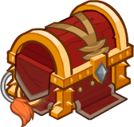ID: 355**Platinum Dungeon Master Chest**Loot for: Dungeon Master<code>"for_crusaders":[99]</code>
        
        
            **Chest**
            Platinum Dungeon Master Chest
            x14 (Shinies x1)
        
    

ID: 725

### Avatar of Chaos Familiar Pack - 1,680 Platinum  
Date of release: 24 Jun 2026

> Collect your own Avatar of Chaos Familiar - the Baby Chardalyn Titan!

Contents:

    
        
            ID: 328**Baby Chardalyn Titan**The test run of the giant mechanized menace proved too cute to recycle.
        
        
            **Familiar**
            Baby Chardalyn Titan
        
    
    
        
            ID: 77**Huge Potion of Speed**This potion's yellow fluid is streaked with black and swirls on its own.<code>time_scale,2.75</code>
        
        
            **Buff**
            Huge Potion of Speed
            x2
        
    
    
        
            ID: 1712**Potion of the Hunter**Increase Global Damage by 100%<code>global_dps_multiplier_mult,100</code>
        
        
            **Buff**
            Potion of the Hunter
            x1
        
    
    
        
            ID: 1798**Epic Golden Potion**Gold and purple liquid swirl around each other as if dancing.<code>golden_loot,1</code>
        
        
            **Buff**
            Epic Golden Potion
            x1
        
    

[Back to Top](#top)

*Last Modified: {{ site.time }}*