[Back to Main](index.md)

# Premium Packs and DLC

Upcoming real-money shop items.

ID: 685

### Bard of the Dragon Queen Deekin Theme Pack - 3,830 Platinum  
Date of release: 11 Mar 2026

> Unlock Deekin along with an exclusive Bard of the Dragon Queen Skin & Familiar!

Contents:

    
        
            ID: 28**Deekin (Seat 1)**
        
        
            **Champion Unlock**
            Deekin
        
    
    
        
            ID: 664**Bard of the Dragon Queen Deekin (Deekin)**
        
        
            **Skin**
            Bard of the Dragon Queen Deekin
        
    
    
        
            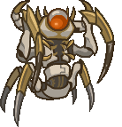ID: 312**Drone of Dooooom**Bards can't share their stories all alone…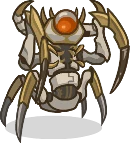
        
        
            **Familiar**
            Drone of Dooooom
        
    
    
        
            ID: 2509**Spotlight Performer**Deekin ready for anything! All eyes on Deekin! DoOoOoOoM!  Increases the effect of Deekin's Middle of the Action ability by 80%. (Prestack)<code>buff_upgrade,80,18859</code>
        
        
            **Feat**
            Spotlight Performer
            Deekin
        
    
    
        
            ID: 54**Platinum Deekin Chest**Loot for: Deekin<code>"for_crusaders":[28]</code>
        
        
            **Chest**
            Platinum Deekin Chest
            x32 (Shinies x2)
        
    
    
        
            ID: 1723**Potion of the Gem Hunter**Increases the gem drops from bosses by 50%<code>increase_boss_gems_percent,50</code>
        
        
            **Buff**
            Potion of the Gem Hunter
            x1
        
    

ID: 686

### Knight of The Rose Zorbu Skin & Feat Pack - 1,680 Platinum  
Date of release: 11 Mar 2026

> Unlock Zorbu along with his exclusive Knight of The Rose Skin & Feat!

Contents:

    
        
            ID: 22**Zorbu (Seat 12)**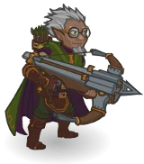
        
        
            **Champion Unlock**
            Zorbu
        
    
    
        
            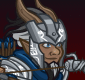ID: 665**Knight of The Rose Zorbu (Zorbu)**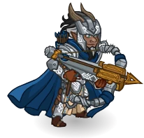
        
        
            **Skin**
            Knight of The Rose Zorbu
        
    
    
        
            ID: 2476**Hunter's Oath**I vow to protect this world from those who would despoil it.  Increases the effect of Zorbu's Focused Fury ability by 80%.<code>buff_upgrade,80,12990</code>
        
        
            **Feat**
            Hunter's Oath
            Zorbu
        
    
    
        
            ID: 20**Large Bounty Contract**Claim a bounty worth 8 hours of offline gold earnings and event tokens.<code>seconds_worth_of_gold,28800</code>
        
        
            **Buff**
            Large Bounty Contract
            x6
        
    
    
        
            ID: 34**Large Blacksmithing Contract**Contract a master blacksmith to improve a piece of equipment owned by one of your Champions.<code>level_up_loot,24</code>
        
        
            **Buff**
            Large Blacksmithing Contract
            x6
        
    
    
        
            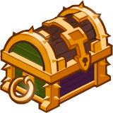ID: 22**Platinum Zorbu Chest**Loot for: Zorbu<code>"for_crusaders":[22]</code>
        
        
            **Chest**
            Platinum Zorbu Chest
            x14 (Shinies x1)
        
    

ID: 687

### Heroic Sheila Skin & Feat Pack - 1,680 Platinum  
Date of release: 11 Mar 2026

> Unlock Sheila along with her exclusive Heroic Skin & Feat!

Contents:

    
        
            ID: 160**Sheila (Seat 7)**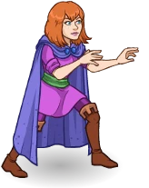
        
        
            **Champion Unlock**
            Sheila
        
    
    
        
            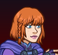ID: 666**Heroic Sheila (Sheila)**
        
        
            **Skin**
            Heroic Sheila
        
    
    
        
            ID: 2477**Old Tricks**You'd think they would have learned by now.  Increases the effect of Sheila's second set of Specializations by 80%.<code>buff_upgrades,80,16544,16545,16546</code>
        
        
            **Feat**
            Old Tricks
            Sheila
        
    
    
        
            ID: 20**Large Bounty Contract**Claim a bounty worth 8 hours of offline gold earnings and event tokens.<code>seconds_worth_of_gold,28800</code>
        
        
            **Buff**
            Large Bounty Contract
            x6
        
    
    
        
            ID: 34**Large Blacksmithing Contract**Contract a master blacksmith to improve a piece of equipment owned by one of your Champions.<code>level_up_loot,24</code>
        
        
            **Buff**
            Large Blacksmithing Contract
            x6
        
    
    
        
            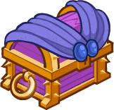ID: 653**Platinum Sheila Chests**Loot for: Sheila<code>"for_crusaders":[160]</code>
        
        
            **Chest**
            Platinum Sheila Chests
            x14 (Shinies x1)
        
    

ID: 688

### Dragon Chronicler Volo Skin & Feat Pack - 1,680 Platinum  
Date of release: 18 Mar 2026

> Unlock Volo along with his exclusive Dragon Chronicler Skin & Feat!

Contents:

    
        
            ID: 159**Volo (Seat 9)**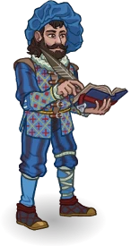
        
        
            **Champion Unlock**
            Volo
        
    
    
        
            ID: 667**Dragon Chronicler Volo (Volo)**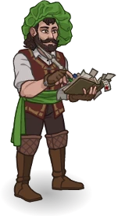
        
        
            **Skin**
            Dragon Chronicler Volo
        
    
    
        
            ID: 2478**Volo's Keen Knowledge**Why, I dare to posit that the noble owlbear is, in fact, a creation of the gods themselves!  Increases the effect of Volo's Volo's Guide to Monsters ability by 80%. (Prestack)<code>buff_upgrade,80,16552,0</code>
        
        
            **Feat**
            Volo's Keen Knowledge
            Volo
        
    
    
        
            ID: 20**Large Bounty Contract**Claim a bounty worth 8 hours of offline gold earnings and event tokens.<code>seconds_worth_of_gold,28800</code>
        
        
            **Buff**
            Large Bounty Contract
            x6
        
    
    
        
            ID: 34**Large Blacksmithing Contract**Contract a master blacksmith to improve a piece of equipment owned by one of your Champions.<code>level_up_loot,24</code>
        
        
            **Buff**
            Large Blacksmithing Contract
            x6
        
    
    
        
            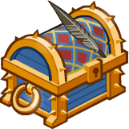ID: 651**Platinum Volo Chest**Loot for: Volo<code>"for_crusaders":[159]</code>
        
        
            **Chest**
            Platinum Volo Chest
            x14 (Shinies x1)
        
    

ID: 689

### Desmondlance Desmond Skin & Feat Pack - 1,680 Platinum  
Date of release: 18 Mar 2026

> Unlock Desmond along with his exclusive Desmondlance Skin & Feat!

Contents:

    
        
            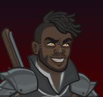ID: 96**Desmond (Seat 4)**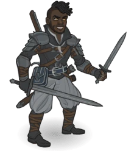
        
        
            **Champion Unlock**
            Desmond
        
    
    
        
            ID: 668**Desmondlance Desmond (Desmond)**
        
        
            **Skin**
            Desmondlance Desmond
        
    
    
        
            ID: 2479**Multiversal Allies**All are welcome in this pack.  Increases the damage of all Champions by 20% for each unique species in the formation, stacking additively.<code>effect_def,2193</code>
        
        
            **Feat**
            Multiversal Allies
            Desmond
        
    
    
        
            ID: 20**Large Bounty Contract**Claim a bounty worth 8 hours of offline gold earnings and event tokens.<code>seconds_worth_of_gold,28800</code>
        
        
            **Buff**
            Large Bounty Contract
            x6
        
    
    
        
            ID: 34**Large Blacksmithing Contract**Contract a master blacksmith to improve a piece of equipment owned by one of your Champions.<code>level_up_loot,24</code>
        
        
            **Buff**
            Large Blacksmithing Contract
            x6
        
    
    
        
            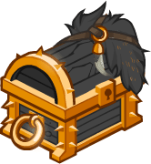ID: 349**Platinum Desmond Chest**Loot for: Desmond<code>"for_crusaders":[96]</code>
        
        
            **Chest**
            Platinum Desmond Chest
            x14 (Shinies x1)
        
    

ID: 690

### Order of the White Robes Orkira Skin & Feat Pack - 1,680 Platinum  
Date of release: 18 Mar 2026

> Unlock Orkira along with her exclusive Order of the White Robes Skin & Feat!

Contents:

    
        
            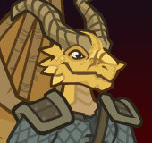ID: 78**Orkira (Seat 1)**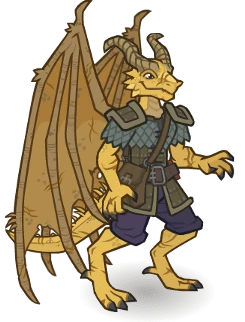
        
        
            **Champion Unlock**
            Orkira
        
    
    
        
            ID: 669**Order of the White Robes Orkira (Orkira)**
        
        
            **Skin**
            Order of the White Robes Orkira
        
    
    
        
            ID: 2480**Eager Martyr**I won't let them harm you, no matter what it takes!  Reduces the cooldown of Self Sacrifice by 15 seconds.<code>change_upgrade_data,5575</code>
        
        
            **Feat**
            Eager Martyr
            Orkira
        
    
    
        
            ID: 20**Large Bounty Contract**Claim a bounty worth 8 hours of offline gold earnings and event tokens.<code>seconds_worth_of_gold,28800</code>
        
        
            **Buff**
            Large Bounty Contract
            x6
        
    
    
        
            ID: 34**Large Blacksmithing Contract**Contract a master blacksmith to improve a piece of equipment owned by one of your Champions.<code>level_up_loot,24</code>
        
        
            **Buff**
            Large Blacksmithing Contract
            x6
        
    
    
        
            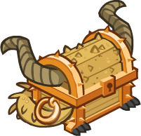ID: 263**Platinum Orkira Chest**Loot for: Orkira<code>"for_crusaders":[78]</code>
        
        
            **Chest**
            Platinum Orkira Chest
            x14 (Shinies x1)
        
    

ID: 691

### Death Knight Karlach Skin & Feat Pack - 1,680 Platinum  
Date of release: 25 Mar 2026

> Unlock Karlach along with her exclusive Death Knight Skin & Feat!

Contents:

    
        
            ID: 143**Karlach (Seat 4)**
        
        
            **Champion Unlock**
            Karlach
        
    
    
        
            ID: 670**Death Knight Karlach (Karlach)**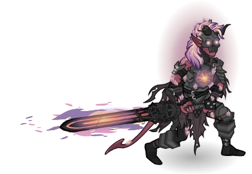
        
        
            **Skin**
            Death Knight Karlach
        
    
    
        
            ID: 2481**Prodigal Leader**Always bet on Mama K!  All Champions damage +50%.<code>global_dps_multiplier_mult,50</code>
        
        
            **Feat**
            Prodigal Leader
            Karlach
        
    
    
        
            ID: 20**Large Bounty Contract**Claim a bounty worth 8 hours of offline gold earnings and event tokens.<code>seconds_worth_of_gold,28800</code>
        
        
            **Buff**
            Large Bounty Contract
            x6
        
    
    
        
            ID: 34**Large Blacksmithing Contract**Contract a master blacksmith to improve a piece of equipment owned by one of your Champions.<code>level_up_loot,24</code>
        
        
            **Buff**
            Large Blacksmithing Contract
            x6
        
    
    
        
            ID: 557**Platinum  Karlach Chest**Loot for: Karlach<code>"for_crusaders":[143]</code>
        
        
            **Chest**
            Platinum  Karlach Chest
            x14 (Shinies x1)
        
    

ID: 692

### Seeker the Star Angler Familiar Pack - 2,380 Platinum  
Date of release: 25 Mar 2026

> Collect your own Seeker the Star Angler familiar!

Contents:

    
        
            ID: 314**Seeker the Star Angler**Just watch out when her teeth grow in!
        
        
            **Familiar**
            Seeker the Star Angler
        
    
    
        
            ID: 4**Huge Potion of Giant's Strength**A transparent potion in which floats the sliver of a giant's fingernail.<code>global_dps_multiplier_mult,900</code>
        
        
            **Buff**
            Huge Potion of Giant's Strength
            x6
        
    
    
        
            ID: 8**Huge Potion of Clairvoyance**Three eyeballs bob in this yellowish potion.<code>gold_multiplier_mult,400</code>
        
        
            **Buff**
            Huge Potion of Clairvoyance
            x6
        
    
    
        
            ID: 36**Potion of Polish**This shiny, silver liquid clings to the edge of the bottle in an unusual way.<code>shiny_loot,1</code>
        
        
            **Buff**
            Potion of Polish
            x1
        
    
    
        
            ID: 40**Huge Potion of Fire Breath**The orange liquid in this vial flickers and smoke fills the top of the container.<code>click_damage_seconds_global_dps,600</code>
        
        
            **Buff**
            Huge Potion of Fire Breath
            x6
        
    
    
        
            ID: 77**Huge Potion of Speed**This potion's yellow fluid is streaked with black and swirls on its own.<code>time_scale,2.75</code>
        
        
            **Buff**
            Huge Potion of Speed
            x6
        
    
    
        
            ID: 1721**Potion of the Gold Hunter**Increase Gold Find by 100%<code>gold_multiplier_mult,100</code>
        
        
            **Buff**
            Potion of the Gold Hunter
            x1
        
    
    
        
            **Modron Component Pieces**
        
        
            **Modron Component Pieces**
            x2,000
        
    

ID: 693

### Animated Armor of Collaboration Familiar Pack - $5.99  
Date of release: 27 Mar 2026

> Collect your own Animated Armor of Collaboration familiar!

ⓘ *Note: It appears that this pack will only be available for real money instead of Platinum.*

Contents:

    
        
            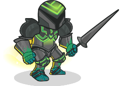ID: 315**Animated Armor of Collaboration**Forged from many disciplines and powered by a shared goal, this living armor stands as proof that games and communities are built better together.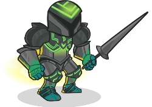
        
        
            **Familiar**
            Animated Armor of Collaboration
        
    
    
        
            ID: 4**Huge Potion of Giant's Strength**A transparent potion in which floats the sliver of a giant's fingernail.<code>global_dps_multiplier_mult,900</code>
        
        
            **Buff**
            Huge Potion of Giant's Strength
            x2
        
    
    
        
            ID: 8**Huge Potion of Clairvoyance**Three eyeballs bob in this yellowish potion.<code>gold_multiplier_mult,400</code>
        
        
            **Buff**
            Huge Potion of Clairvoyance
            x2
        
    
    
        
            ID: 77**Huge Potion of Speed**This potion's yellow fluid is streaked with black and swirls on its own.<code>time_scale,2.75</code>
        
        
            **Buff**
            Huge Potion of Speed
            x2
        
    

ID: 694

### Wanderlust Tasslehoff Theme Pack - 3,830 Platinum  
Date of release: 01 Apr 2026

> Unlock Tasslehoff along with an exclusive Wanderlust Skin & Familiar!

Contents:

    
        
            ID: 174**Tasslehoff**
        
        
            **Champion Unlock**
            Tasslehoff
        
    
    
        
            ID: 674**Wanderlust Tasslehoff (Tasslehoff)**
        
        
            **Skin**
            Wanderlust Tasslehoff
        
    
    
        
            ID: 316**Oops the Mouse**Oops!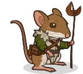
        
        
            **Familiar**
            Oops the Mouse
        
    
    
        
            ID: 2546**Feat**???: 2546
        
        
            **Feat**
            ???: 2546
        
    
    
        
            ID: 796**Platinum Tasslehoff Chest**Loot for: Tasslehoff<code>"for_crusaders":[174]</code>
        
        
            **Chest**
            Platinum Tasslehoff Chest
            x32 (Shinies x2)
        
    
    
        
            ID: 1723**Potion of the Gem Hunter**Increases the gem drops from bosses by 50%<code>increase_boss_gems_percent,50</code>
        
        
            **Buff**
            Potion of the Gem Hunter
            x1
        
    

ID: 695

### Green Knight Briv Skin & Feat Pack - 1,680 Platinum  
Date of release: 01 Apr 2026

> Unlock Briv along with his exclusive Green Knight Skin & Feat!

Contents:

    
        
            ID: 58**Briv (Seat 5)**
        
        
            **Champion Unlock**
            Briv
        
    
    
        
            ID: 675**Green Knight Briv (Briv)**
        
        
            **Skin**
            Green Knight Briv
        
    
    
        
            ID: 2354**Baatorian Bones**Mine durability rivaleth even Baatorian green steel!  Every third stack of Steelbones earned by Briv adds an additional stack.<code>NEW_TECH</code>
        
        
            **Feat**
            Baatorian Bones
            Briv
        
    
    
        
            ID: 20**Large Bounty Contract**Claim a bounty worth 8 hours of offline gold earnings and event tokens.<code>seconds_worth_of_gold,28800</code>
        
        
            **Buff**
            Large Bounty Contract
            x6
        
    
    
        
            ID: 34**Large Blacksmithing Contract**Contract a master blacksmith to improve a piece of equipment owned by one of your Champions.<code>level_up_loot,24</code>
        
        
            **Buff**
            Large Blacksmithing Contract
            x6
        
    
    
        
            ID: 175**Platinum Briv Chest**Loot for: Briv<code>"for_crusaders":[58]</code>
        
        
            **Chest**
            Platinum Briv Chest
            x14 (Shinies x1)
        
    

ID: 696

### Dragon Orb of Palanthas Familiar Pack - 1,140 Platinum  
Date of release: 01 Apr 2026

> Collect your own Dragon Orb of Palanthas familiar!

Contents:

    
        
            ID: 317**Dragon Orb of Palanthas**Those who try to wield an orb’s magic but lack sufficient force of personality might find themselves under the orb’s control.
        
        
            **Familiar**
            Dragon Orb of Palanthas
        
    
    
        
            ID: 40**Huge Potion of Fire Breath**The orange liquid in this vial flickers and smoke fills the top of the container.<code>click_damage_seconds_global_dps,600</code>
        
        
            **Buff**
            Huge Potion of Fire Breath
            x4
        
    
    
        
            ID: 77**Huge Potion of Speed**This potion's yellow fluid is streaked with black and swirls on its own.<code>time_scale,2.75</code>
        
        
            **Buff**
            Huge Potion of Speed
            x4
        
    

ID: 697

### Strelitzia Lucius Theme Pack - 3,830 Platinum  
Date of release: 08 Apr 2026

> Unlock Lucius along with an exclusive Strelitzia Skin & Familiar!

Contents:

    
        
            ID: 72**Lucius (Seat 7)**
        
        
            **Champion Unlock**
            Lucius
        
    
    
        
            ID: 676**Strelitzia Lucius (Lucius)**
        
        
            **Skin**
            Strelitzia Lucius
        
    
    
        
            ID: 318**Birdie the Peacock**"I wish I were a birdie."
        
        
            **Familiar**
            Birdie the Peacock
        
    
    
        
            ID: 2378**Feat**???: 2378
        
        
            **Feat**
            ???: 2378
        
    
    
        
            ID: 251**Platinum Lucius Chest**Loot for: Lucius<code>"for_crusaders":[72]</code>
        
        
            **Chest**
            Platinum Lucius Chest
            x32 (Shinies x2)
        
    
    
        
            ID: 1723**Potion of the Gem Hunter**Increases the gem drops from bosses by 50%<code>increase_boss_gems_percent,50</code>
        
        
            **Buff**
            Potion of the Gem Hunter
            x1
        
    

ID: 698

### Scarlet Briar Miria Skin & Feat Pack - 1,680 Platinum  
Date of release: 08 Apr 2026

> Unlock Miria along with her exclusive Scarlet Briar Skin & Feat!

Contents:

    
        
            ID: 121**Miria (Seat 12)**
        
        
            **Champion Unlock**
            Miria
        
    
    
        
            ID: 677**Scarlet Briar Miria (Miria)**
        
        
            **Skin**
            Scarlet Briar Miria
        
    
    
        
            ID: 2359**Prodigal Leader**Be a good minion and obey.  All Champions damage +50%.<code>global_dps_multiplier_mult,50</code>
        
        
            **Feat**
            Prodigal Leader
            Miria
        
    
    
        
            ID: 20**Large Bounty Contract**Claim a bounty worth 8 hours of offline gold earnings and event tokens.<code>seconds_worth_of_gold,28800</code>
        
        
            **Buff**
            Large Bounty Contract
            x6
        
    
    
        
            ID: 34**Large Blacksmithing Contract**Contract a master blacksmith to improve a piece of equipment owned by one of your Champions.<code>level_up_loot,24</code>
        
        
            **Buff**
            Large Blacksmithing Contract
            x6
        
    
    
        
            ID: 444**Platinum Miria Chest**Loot for: Miria<code>"for_crusaders":[121]</code>
        
        
            **Chest**
            Platinum Miria Chest
            x14 (Shinies x1)
        
    

ID: 699

### Wildflower Aila Skin & Feat Pack - 1,680 Platinum  
Date of release: 08 Apr 2026

> Unlock Aila along with her exclusive Wildflower Skin & Feat!

Contents:

    
        
            ID: 42**Aila (Seat 9)**
        
        
            **Champion Unlock**
            Aila
        
    
    
        
            ID: 678**Wildflower Aila (Aila)**
        
        
            **Skin**
            Wildflower Aila
        
    
    
        
            ID: 2363**Sentinel**Even flowers must endure the storm.  Aila takes 20 more Enemies attacking to get overwhelmed.<code>overwhelm_start_increase,20</code>
        
        
            **Feat**
            Sentinel
            Aila
        
    
    
        
            ID: 20**Large Bounty Contract**Claim a bounty worth 8 hours of offline gold earnings and event tokens.<code>seconds_worth_of_gold,28800</code>
        
        
            **Buff**
            Large Bounty Contract
            x6
        
    
    
        
            ID: 34**Large Blacksmithing Contract**Contract a master blacksmith to improve a piece of equipment owned by one of your Champions.<code>level_up_loot,24</code>
        
        
            **Buff**
            Large Blacksmithing Contract
            x6
        
    
    
        
            ID: 94**Platinum Aila Chest**Loot for: Aila<code>"for_crusaders":[42]</code>
        
        
            **Chest**
            Platinum Aila Chest
            x14 (Shinies x1)
        
    

ID: 700

### Bloom the Dryad Familiar Pack - 1,680 Platinum  
Date of release: 15 Apr 2026

> Collect your own Bloom the Dryad familiar!

Contents:

    
        
            ID: 319**Bloom the Dryad**Likes pretty songs and likes to sing along.
        
        
            **Familiar**
            Bloom the Dryad
        
    
    
        
            ID: 4**Huge Potion of Giant's Strength**A transparent potion in which floats the sliver of a giant's fingernail.<code>global_dps_multiplier_mult,900</code>
        
        
            **Buff**
            Huge Potion of Giant's Strength
            x4
        
    
    
        
            ID: 8**Huge Potion of Clairvoyance**Three eyeballs bob in this yellowish potion.<code>gold_multiplier_mult,400</code>
        
        
            **Buff**
            Huge Potion of Clairvoyance
            x4
        
    
    
        
            ID: 36**Potion of Polish**This shiny, silver liquid clings to the edge of the bottle in an unusual way.<code>shiny_loot,1</code>
        
        
            **Buff**
            Potion of Polish
            x1
        
    
    
        
            ID: 77**Huge Potion of Speed**This potion's yellow fluid is streaked with black and swirls on its own.<code>time_scale,2.75</code>
        
        
            **Buff**
            Huge Potion of Speed
            x4
        
    

ID: 701

### Cosmic Horror Grimm Skin & Feat Pack - 1,680 Platinum  
Date of release: 15 Apr 2026

> Unlock Grimm along with his exclusive Cosmic Horror Skin & Feat!

Contents:

    
        
            ID: 161**Grimm (Seat 2)**
        
        
            **Champion Unlock**
            Grimm
        
    
    
        
            ID: 679**Cosmic Horror Grimm (Grimm)**
        
        
            **Skin**
            Cosmic Horror Grimm
        
    
    
        
            ID: 2347**Buffed Up**It'll all be over in just one swing. ~Grimm  Increases the effect of Grimm's Get Buff ability by 80%. (Prestack)<code>buff_upgrade,80,16735</code>
        
        
            **Feat**
            Buffed Up
            Grimm
        
    
    
        
            ID: 20**Large Bounty Contract**Claim a bounty worth 8 hours of offline gold earnings and event tokens.<code>seconds_worth_of_gold,28800</code>
        
        
            **Buff**
            Large Bounty Contract
            x6
        
    
    
        
            ID: 34**Large Blacksmithing Contract**Contract a master blacksmith to improve a piece of equipment owned by one of your Champions.<code>level_up_loot,24</code>
        
        
            **Buff**
            Large Blacksmithing Contract
            x6
        
    
    
        
            ID: 655**Platinum Grimm Chest**Loot for: Grimm<code>"for_crusaders":[161]</code>
        
        
            **Chest**
            Platinum Grimm Chest
            x14 (Shinies x1)
        
    

ID: 702

### Springtime Spurt Skin & Feat Pack - 1,680 Platinum  
Date of release: 15 Apr 2026

> Unlock Spurt along with his exclusive Springtime Skin & Feat!

Contents:

    
        
            ID: 43**Spurt (Seat 3)**
        
        
            **Champion Unlock**
            Spurt
        
    
    
        
            ID: 680**Springtime Spurt (Spurt)**
        
        
            **Skin**
            Springtime Spurt
        
    
    
        
            ID: 2559**Corpse Stench**Bath? What's that?  Spurt always counts as Undead, even when not in Spirit form.<code>add_hero_tags,0,undead buff_upgrade_per_any_tagged_crusader,20,10678,undead</code>
        
        
            **Feat**
            Corpse Stench
            Spurt
        
    
    
        
            ID: 20**Large Bounty Contract**Claim a bounty worth 8 hours of offline gold earnings and event tokens.<code>seconds_worth_of_gold,28800</code>
        
        
            **Buff**
            Large Bounty Contract
            x6
        
    
    
        
            ID: 34**Large Blacksmithing Contract**Contract a master blacksmith to improve a piece of equipment owned by one of your Champions.<code>level_up_loot,24</code>
        
        
            **Buff**
            Large Blacksmithing Contract
            x6
        
    
    
        
            ID: 96**Platinum Spurt Chest**Loot for: Spurt<code>"for_crusaders":[43]</code>
        
        
            **Chest**
            Platinum Spurt Chest
            x14 (Shinies x1)
        
    

ID: 703

### Cosmic Horror Beadle Skin & Feat Pack - 1,680 Platinum  
Date of release: 22 Apr 2026

> Unlock Beadle along with his exclusive Cosmic Horror Skin & Feat!

Contents:

    
        
            ID: 64**Beadle (Seat 8)**
        
        
            **Champion Unlock**
            Beadle
        
    
    
        
            ID: 681**Cosmic Horror Beadle (Beadle)**
        
        
            **Skin**
            Cosmic Horror Beadle
        
    
    
        
            ID: 2560**Buckle Down**When the going gets tough, I make sure Grimm gets going. ~Beadle  Increases the effect of Beadle's Share The Glory ability by 80%.<code>buff_upgrade,80,16724,1</code>
        
        
            **Feat**
            Buckle Down
            Beadle
        
    
    
        
            ID: 20**Large Bounty Contract**Claim a bounty worth 8 hours of offline gold earnings and event tokens.<code>seconds_worth_of_gold,28800</code>
        
        
            **Buff**
            Large Bounty Contract
            x6
        
    
    
        
            ID: 34**Large Blacksmithing Contract**Contract a master blacksmith to improve a piece of equipment owned by one of your Champions.<code>level_up_loot,24</code>
        
        
            **Buff**
            Large Blacksmithing Contract
            x6
        
    
    
        
            ID: 187**Platinum Beadle Chest**Loot for: Beadle<code>"for_crusaders":[64]</code>
        
        
            **Chest**
            Platinum Beadle Chest
            x14 (Shinies x1)
        
    

ID: 704

### Knight of the Crown Bobby Skin & Feat Pack - 1,680 Platinum  
Date of release: 29 Apr 2026

> Unlock Bobby along with his exclusive Knight of the Crown Skin & Feat!

Contents:

    
        
            ID: 152**Bobby (Seat 12)**
        
        
            **Champion Unlock**
            Bobby
        
    
    
        
            ID: 682**Knight of the Crown Bobby (Bobby)**
        
        
            **Skin**
            Knight of the Crown Bobby
        
    
    
        
            ID: 2561**Playground Boss**The best games are the ones where the rules are different every time you play!  Increases the effect of Bobby's Not So Low, Still Growing Up, and Strong Armed specializations by 80%. (Prestack)<code>buff_upgrade,80,15449,0 buff_upgrade,80,15450,0 buff_upgrade,80,15451,0</code>
        
        
            **Feat**
            Playground Boss
            Bobby
        
    
    
        
            ID: 20**Large Bounty Contract**Claim a bounty worth 8 hours of offline gold earnings and event tokens.<code>seconds_worth_of_gold,28800</code>
        
        
            **Buff**
            Large Bounty Contract
            x6
        
    
    
        
            ID: 34**Large Blacksmithing Contract**Contract a master blacksmith to improve a piece of equipment owned by one of your Champions.<code>level_up_loot,24</code>
        
        
            **Buff**
            Large Blacksmithing Contract
            x6
        
    
    
        
            ID: 575**Platinum Bobby Chest**Loot for: Bobby<code>"for_crusaders":[152]</code>
        
        
            **Chest**
            Platinum Bobby Chest
            x14 (Shinies x1)
        
    

ID: 705

### Raistlin Cosplay Farideh Skin & Feat Pack - 1,680 Platinum  
Date of release: 29 Apr 2026

> Unlock Farideh along with her exclusive Raistlin Cosplay Skin & Feat!

Contents:

    
        
            ID: 33**Farideh (Seat 7)**
        
        
            **Champion Unlock**
            Farideh
        
    
    
        
            ID: 683**Raistlin Cosplay Farideh (Farideh)**
        
        
            **Skin**
            Raistlin Cosplay Farideh
        
    
    
        
            ID: 2562**Magius Infernus**Cast enough fireballs, and most problems tend to go away.  Increases the effect of Farideh's specializations by 80%.<code>buff_upgrades,80,17839,17840,17841</code>
        
        
            **Feat**
            Magius Infernus
            Farideh
        
    
    
        
            ID: 20**Large Bounty Contract**Claim a bounty worth 8 hours of offline gold earnings and event tokens.<code>seconds_worth_of_gold,28800</code>
        
        
            **Buff**
            Large Bounty Contract
            x6
        
    
    
        
            ID: 34**Large Blacksmithing Contract**Contract a master blacksmith to improve a piece of equipment owned by one of your Champions.<code>level_up_loot,24</code>
        
        
            **Buff**
            Large Blacksmithing Contract
            x6
        
    
    
        
            ID: 72**Platinum Farideh Chest**Loot for: Farideh<code>"for_crusaders":[33]</code>
        
        
            **Chest**
            Platinum Farideh Chest
            x14 (Shinies x1)
        
    

[Back to Top](#top)

*Last Modified: {{ site.time }}*