[Back to Main](index.md)

# Premium Packs and DLC

Upcoming real-money shop items.

ID: 757

### Eric's Legendary Feat Pack - 1,680 Platinum  
Date of release: 23 Sept 2026

> Unlock Eric's full potential with his Legendary Feat & 6 Tanking Pigments now!

Contents:

    
        
            ID: 157**Eric (Seat 4)**
        
        
            **Champion Unlock**
            Eric
        
    
    
        
            ID: 1**Selflessness**Aye, a selfless dwarf I am.  All Champions damage +10%.<code>global_dps_multiplier_mult,10</code>
        
        
            **Feat**
            Selflessness
            Bruenor
        
    
    
        
            ID: 1907**Marvelous Tanking Pigment**Adds a Champion-tag-based effect to an epic or higher equipment item of your choice!<code>legendary_apply_pigment,4</code>
        
        
            **Buff**
            Marvelous Tanking Pigment
            x6
        
    

ID: 758

### Scholar of the Nine Hells Karlach Skin & Feat Pack - 1,680 Platinum  
Date of release: 30 Sept 2026

> Unlock Karlach along with her exclusive Scholar of the Nine Hells Skin & Feat!

Contents:

    
        
            ID: 143**Karlach (Seat 4)**
        
        
            **Champion Unlock**
            Karlach
        
    
    
        
            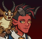ID: 725**Scholar of the Nine Hells Karlach (Karlach)**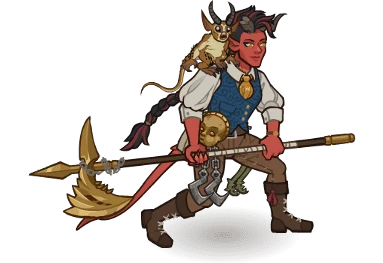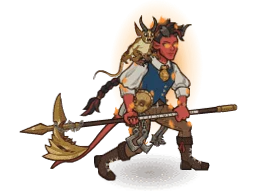
        
        
            **Skin**
            Scholar of the Nine Hells Karlach
        
    
    
        
            ID: 2746**Painting Virtuoso**Let's paint the town red with the blood of our enemies! ...Too much?  Increases the damage of all Champions by 80% for each pigment applied to Karlach, stacking additively.<code>global_dps_multiplier_mult,80</code>
        
        
            **Feat**
            Painting Virtuoso
            Karlach
        
    
    
        
            ID: 20**Large Bounty Contract**Claim a bounty worth 8 hours of offline gold earnings and event tokens.<code>seconds_worth_of_gold,28800</code>
        
        
            **Buff**
            Large Bounty Contract
            x6
        
    
    
        
            ID: 34**Large Blacksmithing Contract**Contract a master blacksmith to improve a piece of equipment owned by one of your Champions.<code>level_up_loot,24</code>
        
        
            **Buff**
            Large Blacksmithing Contract
            x6
        
    
    
        
            ID: 557**Platinum  Karlach Chest**Loot for: Karlach<code>"for_crusaders":[143]</code>
        
        
            **Chest**
            Platinum  Karlach Chest
            x14 (Shinies x1)
        
    

ID: 765

### Freeblade Kitiara Theme Pack - 3,830 Platinum  
Date of release: 07 Oct 2026

> Unlock Kitiara along with an exclusive Freeblade Skin & Hawk Familiar!

Contents:

    
        
            ID: 180**Kitiara (Seat 4)**
        
        
            **Champion Unlock**
            Kitiara
        
    
    
        
            ID: 734**Freeblade Kitiara (Kitiara)**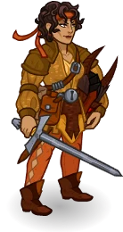
        
        
            **Skin**
            Freeblade Kitiara
        
    
    
        
            ID: 338**Scout the Cooper's Hawk**This agile hunter awaits her master's signal. Only then can she strike.
        
        
            **Familiar**
            Scout the Cooper's Hawk
        
    
    
        
            ID: 2801**Feat**???: 2801
        
        
            **Feat**
            ???: 2801
        
    
    
        
            ID: 842**Platinum Kitiara Chest**Loot for: Kitiara<code>"for_crusaders":[180]</code>
        
        
            **Chest**
            Platinum Kitiara Chest
            x32 (Shinies x2)
        
    
    
        
            ID: 1723**Potion of the Gem Hunter**Increases the gem drops from bosses by 50%<code>increase_boss_gems_percent,50</code>
        
        
            **Buff**
            Potion of the Gem Hunter
            x1
        
    

ID: 766

### Slash the Chwinga Familiar Pack - 840 Platinum  
Date of release: 07 Oct 2026

> Collect your own Slash the Chwinga familiar!

Contents:

    
        
            ID: 339**Slash the Chwinga**Fear comes in fun size.
        
        
            **Familiar**
            Slash the Chwinga
        
    
    
        
            ID: 4**Huge Potion of Giant's Strength**A transparent potion in which floats the sliver of a giant's fingernail.<code>global_dps_multiplier_mult,900</code>
        
        
            **Buff**
            Huge Potion of Giant's Strength
            x2
        
    
    
        
            ID: 8**Huge Potion of Clairvoyance**Three eyeballs bob in this yellowish potion.<code>gold_multiplier_mult,400</code>
        
        
            **Buff**
            Huge Potion of Clairvoyance
            x2
        
    
    
        
            ID: 77**Huge Potion of Speed**This potion's yellow fluid is streaked with black and swirls on its own.<code>time_scale,2.75</code>
        
        
            **Buff**
            Huge Potion of Speed
            x2
        
    

ID: 767

### Vampire Spawn Astarion Skin & Feat Pack - 1,680 Platinum  
Date of release: 07 Oct 2026

> Unlock Astarion along with his exclusive Vampire Spawn Skin & Feat!

Contents:

    
        
            ID: 129**Astarion (Seat 10)**
        
        
            **Champion Unlock**
            Astarion
        
    
    
        
            ID: 731**Vampire Spawn Astarion (Astarion)**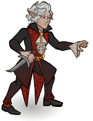
        
        
            **Skin**
            Vampire Spawn Astarion
        
    
    
        
            ID: 2771**Immortal Chains**I may never be free of this. I may as well learn to live with it. Forever.  Increases the effect of Astarion's Outflank (Top) and Outflank (Bottom) by 80%.<code>buff_upgrades,80,12493,12494</code>
        
        
            **Feat**
            Immortal Chains
            Astarion
        
    
    
        
            ID: 20**Large Bounty Contract**Claim a bounty worth 8 hours of offline gold earnings and event tokens.<code>seconds_worth_of_gold,28800</code>
        
        
            **Buff**
            Large Bounty Contract
            x6
        
    
    
        
            ID: 34**Large Blacksmithing Contract**Contract a master blacksmith to improve a piece of equipment owned by one of your Champions.<code>level_up_loot,24</code>
        
        
            **Buff**
            Large Blacksmithing Contract
            x6
        
    
    
        
            ID: 460**Platinum Astarion Chest**Loot for: Astarion<code>"for_crusaders":[129]</code>
        
        
            **Chest**
            Platinum Astarion Chest
            x14 (Shinies x1)
        
    

ID: 768

### Gourd the Bat Familiar Pack - 1,680 Platinum  
Date of release: 14 Oct 2026

> Collect your own Gourd the Bat familiar!

Contents:

    
        
            ID: 340**Gourd the Bat**The only thing scarier than the pumpkin is what's inside!
        
        
            **Familiar**
            Gourd the Bat
        
    
    
        
            ID: 4**Huge Potion of Giant's Strength**A transparent potion in which floats the sliver of a giant's fingernail.<code>global_dps_multiplier_mult,900</code>
        
        
            **Buff**
            Huge Potion of Giant's Strength
            x4
        
    
    
        
            ID: 8**Huge Potion of Clairvoyance**Three eyeballs bob in this yellowish potion.<code>gold_multiplier_mult,400</code>
        
        
            **Buff**
            Huge Potion of Clairvoyance
            x4
        
    
    
        
            ID: 36**Potion of Polish**This shiny, silver liquid clings to the edge of the bottle in an unusual way.<code>shiny_loot,1</code>
        
        
            **Buff**
            Potion of Polish
            x1
        
    
    
        
            ID: 77**Huge Potion of Speed**This potion's yellow fluid is streaked with black and swirls on its own.<code>time_scale,2.75</code>
        
        
            **Buff**
            Huge Potion of Speed
            x4
        
    

ID: 769

### Headless Cavalier Thellora Skin & Feat Pack - 1,680 Platinum  
Date of release: 14 Oct 2026

> Unlock Thellora along with her exclusive Headless Cavalier Skin & Feat!

Contents:

    
        
            ID: 139**Thellora (Seat 1)**
        
        
            **Champion Unlock**
            Thellora
        
    
    
        
            ID: 732**Headless Cavalier Thellora (Thellora)**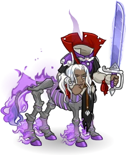
        
        
            **Skin**
            Headless Cavalier Thellora
        
    
    
        
            ID: 2772**Callessa's Champion**We WILL win this day! We shall NOT fail her!  Increases the effect of Thellora's Paladin's Resolve ability by 80%.<code>buff_upgrade,80,12980</code>
        
        
            **Feat**
            Callessa's Champion
            Thellora
        
    
    
        
            ID: 20**Large Bounty Contract**Claim a bounty worth 8 hours of offline gold earnings and event tokens.<code>seconds_worth_of_gold,28800</code>
        
        
            **Buff**
            Large Bounty Contract
            x6
        
    
    
        
            ID: 34**Large Blacksmithing Contract**Contract a master blacksmith to improve a piece of equipment owned by one of your Champions.<code>level_up_loot,24</code>
        
        
            **Buff**
            Large Blacksmithing Contract
            x6
        
    
    
        
            ID: 549**Platinum Thellora Chest**Loot for: Thellora<code>"for_crusaders":[139]</code>
        
        
            **Chest**
            Platinum Thellora Chest
            x14 (Shinies x1)
        
    

ID: 775

### Mummy Krond Skin & Feat Pack - 1,680 Platinum  
Date of release: 14 Oct 2026

> Unlock Krond along with his exclusive Mummy Skin & Feat!

Contents:

    
        
            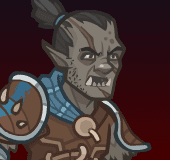ID: 15**Krond (Seat 6)**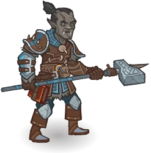
        
        
            **Champion Unlock**
            Krond
        
    
    
        
            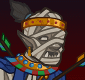ID: 737**Mummy Krond (Krond)**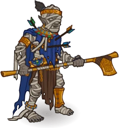
        
        
            **Skin**
            Mummy Krond
        
    
    
        
            ID: 2219**Cantrip: Ascendant Fire Bolt**An ancient red dragon was among my finest masters. I slew her and took her flame for my own.  Krond's base attacks shoot out 5 fire bolts, each dealing 300% of its base damage to up to five other random enemies.<code>krond_fire_bolt,300,5 change_base_attack,865</code>
        
        
            **Feat**
            Cantrip: Ascendant Fire Bolt
            Krond
        
    
    
        
            ID: 20**Large Bounty Contract**Claim a bounty worth 8 hours of offline gold earnings and event tokens.<code>seconds_worth_of_gold,28800</code>
        
        
            **Buff**
            Large Bounty Contract
            x6
        
    
    
        
            ID: 34**Large Blacksmithing Contract**Contract a master blacksmith to improve a piece of equipment owned by one of your Champions.<code>level_up_loot,24</code>
        
        
            **Buff**
            Large Blacksmithing Contract
            x6
        
    
    
        
            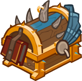ID: 6**Platinum Krond Chest**Loot for: Krond<code>"for_crusaders":[15]</code>
        
        
            **Chest**
            Platinum Krond Chest
            x14 (Shinies x1)
        
    

ID: 770

### Aurum the Hoard Scarab Familiar Pack - 1,140 Platinum  
Date of release: 21 Oct 2026

> Collect your own Aurum the Hoard Scarab familiar!

Contents:

    
        
            ID: 341**Aurum the Hoard Scarab**Thieves beware! These beetle-like creatures blend in perfectly among piles of gold coins.
        
        
            **Familiar**
            Aurum the Hoard Scarab
        
    
    
        
            ID: 40**Huge Potion of Fire Breath**The orange liquid in this vial flickers and smoke fills the top of the container.<code>click_damage_seconds_global_dps,600</code>
        
        
            **Buff**
            Huge Potion of Fire Breath
            x4
        
    
    
        
            ID: 77**Huge Potion of Speed**This potion's yellow fluid is streaked with black and swirls on its own.<code>time_scale,2.75</code>
        
        
            **Buff**
            Huge Potion of Speed
            x4
        
    

ID: 771

### Forsaken Bride Ezmerelda Skin & Feat Pack - 1,680 Platinum  
Date of release: 21 Oct 2026

> Unlock Ezmerelda along with her exclusive Forsaken Bride Skin & Feat!

Contents:

    
        
            ID: 70**Ezmerelda (Seat 1)**
        
        
            **Champion Unlock**
            Ezmerelda
        
    
    
        
            ID: 733**Forsaken Bride Ezmerelda (Ezmerelda)**
        
        
            **Skin**
            Forsaken Bride Ezmerelda
        
    
    
        
            ID: 2773**Vow of Vengeance**You could say I'm married to my career. I love what I do.  Increases the effect of Ezmerelda's Preparation ability by 80%.<code>buff_upgrade,80,15038</code>
        
        
            **Feat**
            Vow of Vengeance
            Ezmerelda
        
    
    
        
            ID: 20**Large Bounty Contract**Claim a bounty worth 8 hours of offline gold earnings and event tokens.<code>seconds_worth_of_gold,28800</code>
        
        
            **Buff**
            Large Bounty Contract
            x6
        
    
    
        
            ID: 34**Large Blacksmithing Contract**Contract a master blacksmith to improve a piece of equipment owned by one of your Champions.<code>level_up_loot,24</code>
        
        
            **Buff**
            Large Blacksmithing Contract
            x6
        
    
    
        
            ID: 247**Platinum Ezmerelda Chest**Loot for: Ezmerelda<code>"for_crusaders":[70]</code>
        
        
            **Chest**
            Platinum Ezmerelda Chest
            x14 (Shinies x1)
        
    

ID: 772

### Karlach's Legendary Feat Pack - 1,680 Platinum  
Date of release: 28 Oct 2026

> Unlock Karlach's full potential with her Legendary Feat & 6 DPS Pigments now!

Contents:

    
        
            ID: 143**Karlach (Seat 4)**
        
        
            **Champion Unlock**
            Karlach
        
    
    
        
            ID: 1**Selflessness**Aye, a selfless dwarf I am.  All Champions damage +10%.<code>global_dps_multiplier_mult,10</code>
        
        
            **Feat**
            Selflessness
            Bruenor
        
    
    
        
            ID: 1905**Marvelous DPS Pigment**Adds a Champion-tag-based effect to an epic or higher equipment item of your choice!<code>legendary_apply_pigment,2</code>
        
        
            **Buff**
            Marvelous DPS Pigment
            x6
        
    

ID: 787

### Dr. Floof, the Conjured Almiraj Familiar Pack - $5.99  
Date of release: 02 Nov 2026

> Collect your own Dr. Floof, the Conjured Almiraj  familiar!

ⓘ *Note: It appears that this pack will only be available for real money instead of Platinum.*

Contents:

    
        
            ID: 346**Dr. Floof, the Conjured Almiraj**Dr. Floof is a dedicated healer, despite his tendency to prescribe laughter.
        
        
            **Familiar**
            Dr. Floof, the Conjured Almiraj
        
    
    
        
            ID: 4**Huge Potion of Giant's Strength**A transparent potion in which floats the sliver of a giant's fingernail.<code>global_dps_multiplier_mult,900</code>
        
        
            **Buff**
            Huge Potion of Giant's Strength
            x2
        
    
    
        
            ID: 8**Huge Potion of Clairvoyance**Three eyeballs bob in this yellowish potion.<code>gold_multiplier_mult,400</code>
        
        
            **Buff**
            Huge Potion of Clairvoyance
            x2
        
    
    
        
            ID: 77**Huge Potion of Speed**This potion's yellow fluid is streaked with black and swirls on its own.<code>time_scale,2.75</code>
        
        
            **Buff**
            Huge Potion of Speed
            x2
        
    

ID: 776

### Morte on the Rocks Theme Pack - 3,830 Platinum  
Date of release: 04 Nov 2026

> Unlock Morte along with an exclusive Skin & Dohwar Familiar!

Contents:

    
        
            ID: 181**Morte**
        
        
            **Champion Unlock**
            Morte
        
    
    
        
            ID: 734**Freeblade Kitiara (Kitiara)**
        
        
            **Skin**
            Freeblade Kitiara
        
    
    
        
            ID: 343**Slick the Dohwar**Who needs to fly when you can glide!
        
        
            **Familiar**
            Slick the Dohwar
        
    
    
        
            ID: 2811**Feat**???: 2811
        
        
            **Feat**
            ???: 2811
        
    
    
        
            ID: 842**Platinum Kitiara Chest**Loot for: Kitiara<code>"for_crusaders":[180]</code>
        
        
            **Chest**
            Platinum Kitiara Chest
            x32 (Shinies x2)
        
    
    
        
            ID: 1723**Potion of the Gem Hunter**Increases the gem drops from bosses by 50%<code>increase_boss_gems_percent,50</code>
        
        
            **Buff**
            Potion of the Gem Hunter
            x1
        
    

ID: 777

### Widdle Stardust Skin & Feat Pack - 1,680 Platinum  
Date of release: 04 Nov 2026

> Unlock Widdle along with her exclusive Widdle Stardust Skin & Feat!

Contents:

    
        
            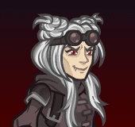ID: 91**Widdle (Seat 2)**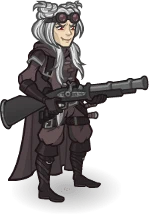
        
        
            **Champion Unlock**
            Widdle
        
    
    
        
            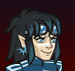ID: 738**Widdle Stardust (Widdle)**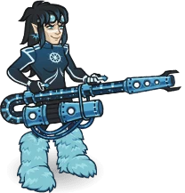
        
        
            **Skin**
            Widdle Stardust
        
    
    
        
            ID: 2779**Too Many Friends**Back up, people! I need some breathing room!<code>todo DevNote: New effect-Increase the effect of Tasty Friends by 100% if there are 3 or fewer Champions adjacent to Widdle.</code>
        
        
            **Feat**
            Too Many Friends
            Widdle
        
    
    
        
            ID: 20**Large Bounty Contract**Claim a bounty worth 8 hours of offline gold earnings and event tokens.<code>seconds_worth_of_gold,28800</code>
        
        
            **Buff**
            Large Bounty Contract
            x6
        
    
    
        
            ID: 34**Large Blacksmithing Contract**Contract a master blacksmith to improve a piece of equipment owned by one of your Champions.<code>level_up_loot,24</code>
        
        
            **Buff**
            Large Blacksmithing Contract
            x6
        
    
    
        
            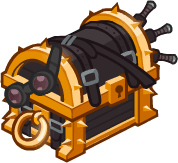ID: 339**Platinum Widdle Chest**Loot for: Widdle<code>"for_crusaders":[91]</code>
        
        
            **Chest**
            Platinum Widdle Chest
            x14 (Shinies x1)
        
    

ID: 778

### Midnight Turiel Skin & Feat Pack - 1,680 Platinum  
Date of release: 04 Nov 2026

> Unlock Turiel along with his exclusive Midnight Skin & Feat!

Contents:

    
        
            ID: 49**Turiel (Seat 1)**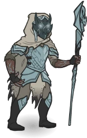
        
        
            **Champion Unlock**
            Turiel
        
    
    
        
            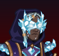ID: 739**Midnight Turiel (Turiel)**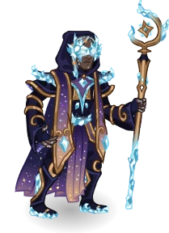
        
        
            **Skin**
            Midnight Turiel
        
    
    
        
            ID: 2780**Dire Resolve**To destroy your enemy, sometimes you must become like them.  Increases the effect of Turiel's Unflinching Hatred ability by 80%.<code>buff_upgrade,80,10660</code>
        
        
            **Feat**
            Dire Resolve
            Turiel
        
    
    
        
            ID: 20**Large Bounty Contract**Claim a bounty worth 8 hours of offline gold earnings and event tokens.<code>seconds_worth_of_gold,28800</code>
        
        
            **Buff**
            Large Bounty Contract
            x6
        
    
    
        
            ID: 34**Large Blacksmithing Contract**Contract a master blacksmith to improve a piece of equipment owned by one of your Champions.<code>level_up_loot,24</code>
        
        
            **Buff**
            Large Blacksmithing Contract
            x6
        
    
    
        
            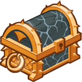ID: 108**Platinum Turiel Chest**Loot for: Turiel<code>"for_crusaders":[49]</code>
        
        
            **Chest**
            Platinum Turiel Chest
            x14 (Shinies x1)
        
    

ID: 779

### Ice Queen Minthara Skin & Feat Pack - 1,680 Platinum  
Date of release: 11 Nov 2026

> Unlock Minthara along with her exclusive Ice Queen Skin & Feat!

Contents:

    
        
            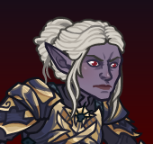ID: 154**Minthara (Seat 3)**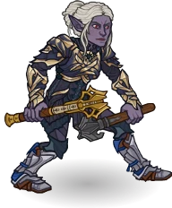
        
        
            **Champion Unlock**
            Minthara
        
    
    
        
            ID: 740**Ice Queen Minthara (Minthara)**
        
        
            **Skin**
            Ice Queen Minthara
        
    
    
        
            ID: 1970**Vengeful Assurance**They will fall. It is simply a matter of patience.  The Piercing component of Minthara's Oath of Vengeance ability removes an extra piece of armor or health.<code>buff_upgrade,100,15945,2</code>
        
        
            **Feat**
            Vengeful Assurance
            Minthara
        
    
    
        
            ID: 20**Large Bounty Contract**Claim a bounty worth 8 hours of offline gold earnings and event tokens.<code>seconds_worth_of_gold,28800</code>
        
        
            **Buff**
            Large Bounty Contract
            x6
        
    
    
        
            ID: 34**Large Blacksmithing Contract**Contract a master blacksmith to improve a piece of equipment owned by one of your Champions.<code>level_up_loot,24</code>
        
        
            **Buff**
            Large Blacksmithing Contract
            x6
        
    
    
        
            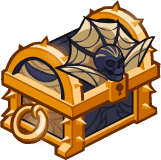ID: 579**Platinum Minthara Chest**Loot for: Minthara<code>"for_crusaders":[154]</code>
        
        
            **Chest**
            Platinum Minthara Chest
            x14 (Shinies x1)
        
    

ID: 780

### Starlit Sentry Skin & Feat Pack - 1,680 Platinum  
Date of release: 11 Nov 2026

> Unlock Sentry along with her exclusive Starlit Skin & Feat!

Contents:

    
        
            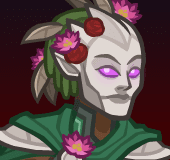ID: 52**Sentry (Seat 4)**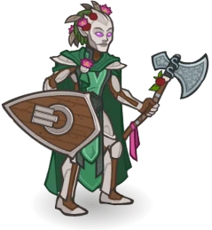
        
        
            **Champion Unlock**
            Sentry
        
    
    
        
            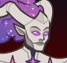ID: 741**Starlit Sentry (Sentry)**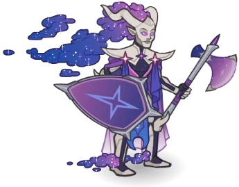
        
        
            **Skin**
            Starlit Sentry
        
    
    
        
            ID: 2782**Multiversal Allies**Our bonds make us stronger.  Increases the damage of all Champions by 20% for each unique species in the formation, stacking additively.<code>effect_def,2193</code>
        
        
            **Feat**
            Multiversal Allies
            Sentry
        
    
    
        
            ID: 20**Large Bounty Contract**Claim a bounty worth 8 hours of offline gold earnings and event tokens.<code>seconds_worth_of_gold,28800</code>
        
        
            **Buff**
            Large Bounty Contract
            x6
        
    
    
        
            ID: 34**Large Blacksmithing Contract**Contract a master blacksmith to improve a piece of equipment owned by one of your Champions.<code>level_up_loot,24</code>
        
        
            **Buff**
            Large Blacksmithing Contract
            x6
        
    
    
        
            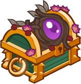ID: 163**Platinum Sentry Chest**Loot for: Sentry<code>"for_crusaders":[52]</code>
        
        
            **Chest**
            Platinum Sentry Chest
            x14 (Shinies x1)
        
    

ID: 781

### Avatar of Auril Familiar Pack - 1,680 Platinum  
Date of release: 11 Nov 2026

> Collect your own Avatar of Auril Familiar - Lady Icekiss!

Contents:

    
        
            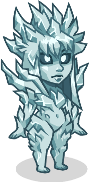ID: 344**Lady Icekiss**The god of cold indifference who embodies winter's cruelty.
        
        
            **Familiar**
            Lady Icekiss
        
    
    
        
            ID: 77**Huge Potion of Speed**This potion's yellow fluid is streaked with black and swirls on its own.<code>time_scale,2.75</code>
        
        
            **Buff**
            Huge Potion of Speed
            x2
        
    
    
        
            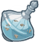ID: 1712**Potion of the Hunter**Increase Global Damage by 100%<code>global_dps_multiplier_mult,100</code>
        
        
            **Buff**
            Potion of the Hunter
            x1
        
    
    
        
            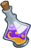ID: 1798**Epic Golden Potion**Gold and purple liquid swirl around each other as if dancing.<code>golden_loot,1</code>
        
        
            **Buff**
            Epic Golden Potion
            x1
        
    

ID: 782

### Frostbite Skylla Skin & Feat Pack - 1,680 Platinum  
Date of release: 18 Nov 2026

> Unlock Skylla along with her exclusive Frostbite Skin & Feat!

Contents:

    
        
            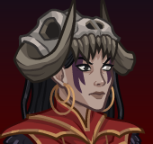ID: 169**Skylla (Seat 4)**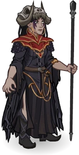
        
        
            **Champion Unlock**
            Skylla
        
    
    
        
            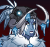ID: 742**Frostbite Skylla (Skylla)**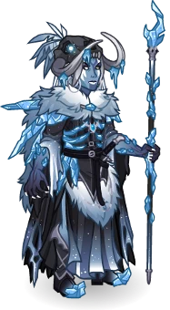
        
        
            **Skin**
            Frostbite Skylla
        
    
    
        
            ID: 2783**Double Double**Faerie Fire burn and granny's cauldron bubble...  Increases the effect of Skylla's first set of Specializations by 80%.<code>buff_upgrades,80,17848,17849,17850</code>
        
        
            **Feat**
            Double Double
            Skylla
        
    
    
        
            ID: 20**Large Bounty Contract**Claim a bounty worth 8 hours of offline gold earnings and event tokens.<code>seconds_worth_of_gold,28800</code>
        
        
            **Buff**
            Large Bounty Contract
            x6
        
    
    
        
            ID: 34**Large Blacksmithing Contract**Contract a master blacksmith to improve a piece of equipment owned by one of your Champions.<code>level_up_loot,24</code>
        
        
            **Buff**
            Large Blacksmithing Contract
            x6
        
    
    
        
            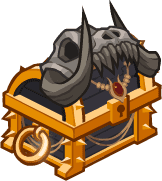ID: 762**Platinum Skylla Chest**Loot for: Skylla<code>"for_crusaders":[169]</code>
        
        
            **Chest**
            Platinum Skylla Chest
            x14 (Shinies x1)
        
    

ID: 783

### Frost the Chwinga Familiar Pack - 840 Platinum  
Date of release: 18 Nov 2026

> Collect your own Frost the Chwinga familiar!

Contents:

    
        
            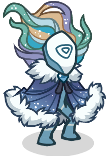ID: 345**Frost the Chwinga**Chwingas prefer to move about unseen, which is even easier in the snow of Icewind Dale.
        
        
            **Familiar**
            Frost the Chwinga
        
    
    
        
            ID: 4**Huge Potion of Giant's Strength**A transparent potion in which floats the sliver of a giant's fingernail.<code>global_dps_multiplier_mult,900</code>
        
        
            **Buff**
            Huge Potion of Giant's Strength
            x2
        
    
    
        
            ID: 8**Huge Potion of Clairvoyance**Three eyeballs bob in this yellowish potion.<code>gold_multiplier_mult,400</code>
        
        
            **Buff**
            Huge Potion of Clairvoyance
            x2
        
    
    
        
            ID: 77**Huge Potion of Speed**This potion's yellow fluid is streaked with black and swirls on its own.<code>time_scale,2.75</code>
        
        
            **Buff**
            Huge Potion of Speed
            x2
        
    

ID: 784

### Gale's Legendary Feat Pack - 1,680 Platinum  
Date of release: 25 Nov 2026

> Unlock Gale's full potential with his Legendary Feat & 6 DPS Pigments now!

Contents:

    
        
            ID: 147**Gale (Seat 1)**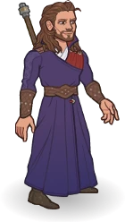
        
        
            **Champion Unlock**
            Gale
        
    
    
        
            ID: 1**Selflessness**Aye, a selfless dwarf I am.  All Champions damage +10%.<code>global_dps_multiplier_mult,10</code>
        
        
            **Feat**
            Selflessness
            Bruenor
        
    
    
        
            ID: 1905**Marvelous DPS Pigment**Adds a Champion-tag-based effect to an epic or higher equipment item of your choice!<code>legendary_apply_pigment,2</code>
        
        
            **Buff**
            Marvelous DPS Pigment
            x6
        
    

ID: 788

### Dragon Army Tanis Theme Pack - 3,830 Platinum  
Date of release: 02 Dec 2026

> Unlock Tanis along with an exclusive Skin & Fox Familiar!

Contents:

    
        
            ID: 182**Tanis**
        
        
            **Champion Unlock**
            Tanis
        
    
    
        
            ID: 1**Birthday Suit (Jarlaxle)**
        
        
            **Skin**
            Birthday Suit
        
    
    
        
            ID: 347**Tanis the Red-Pelted Fox**Tanis had to remind himself that even though squirrels taste as good as rabbits, he probably shouldn't eat squirrel Tasslehoff…
        
        
            **Familiar**
            Tanis the Red-Pelted Fox
        
    
    
        
            ID: 1**Selflessness**Aye, a selfless dwarf I am.  All Champions damage +10%.<code>global_dps_multiplier_mult,10</code>
        
        
            **Feat**
            Selflessness
            Bruenor
        
    
    
        
            ID: 842**Platinum Kitiara Chest**Loot for: Kitiara<code>"for_crusaders":[180]</code>
        
        
            **Chest**
            Platinum Kitiara Chest
            x32 (Shinies x2)
        
    
    
        
            ID: 1723**Potion of the Gem Hunter**Increases the gem drops from bosses by 50%<code>increase_boss_gems_percent,50</code>
        
        
            **Buff**
            Potion of the Gem Hunter
            x1
        
    

ID: 789

### Gladiator Krull Skin & Feat Pack - 1,680 Platinum  
Date of release: 02 Dec 2026

> Unlock Krull along with his exclusive Gladiator Skin & Feat!

Contents:

    
        
            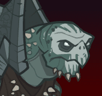ID: 53**Krull (Seat 6)**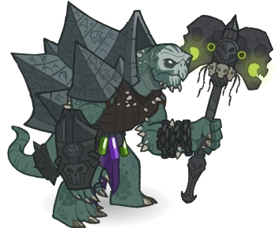
        
        
            **Champion Unlock**
            Krull
        
    
    
        
            ID: 756**Gladiator Krull (Krull)**
        
        
            **Skin**
            Gladiator Krull
        
    
    
        
            ID: 2781**TBD Krull Feat (Do not translate)**
        
        
            **Feat**
            TBD Krull Feat (Do not translate)
            Krull
        
    
    
        
            ID: 20**Large Bounty Contract**Claim a bounty worth 8 hours of offline gold earnings and event tokens.<code>seconds_worth_of_gold,28800</code>
        
        
            **Buff**
            Large Bounty Contract
            x6
        
    
    
        
            ID: 34**Large Blacksmithing Contract**Contract a master blacksmith to improve a piece of equipment owned by one of your Champions.<code>level_up_loot,24</code>
        
        
            **Buff**
            Large Blacksmithing Contract
            x6
        
    
    
        
            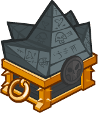ID: 165**Platinum Krull Chest**Loot for: Krull<code>"for_crusaders":[53]</code>
        
        
            **Chest**
            Platinum Krull Chest
            x14 (Shinies x1)
        
    

ID: 790

### Regis Goblin Shaman Kllug Skin & Feat Pack - 1,680 Platinum  
Date of release: 02 Dec 2026

> Unlock Regis along with his exclusive Goblin Shaman Kllug Skin & Feat!

Contents:

    
        
            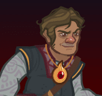ID: 20**Regis (Seat 2)**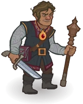
        
        
            **Champion Unlock**
            Regis
        
    
    
        
            ID: 757**Regis Goblin Shaman Kllug (Regis)**
        
        
            **Skin**
            Regis Goblin Shaman Kllug
        
    
    
        
            ID: 2853**TBD Regis Feat (Do not translate)**
        
        
            **Feat**
            TBD Regis Feat (Do not translate)
            Regis
        
    
    
        
            ID: 20**Large Bounty Contract**Claim a bounty worth 8 hours of offline gold earnings and event tokens.<code>seconds_worth_of_gold,28800</code>
        
        
            **Buff**
            Large Bounty Contract
            x6
        
    
    
        
            ID: 34**Large Blacksmithing Contract**Contract a master blacksmith to improve a piece of equipment owned by one of your Champions.<code>level_up_loot,24</code>
        
        
            **Buff**
            Large Blacksmithing Contract
            x6
        
    
    
        
            ID: 17**Platinum Regis Chest**Loot for: Regis<code>"for_crusaders":[20]</code>
        
        
            **Chest**
            Platinum Regis Chest
            x14 (Shinies x1)
        
    

ID: 791

### Avatar of Lolth Familiar Pack - 1,680 Platinum  
Date of release: 09 Dec 2026

> Collect your own Avatar of Lolth Familiar!

Contents:

    
        
            ID: 348**Avatar of Lolth**One of the most accursed of the Spider Queen’s gifts is transformation into a drider.
        
        
            **Familiar**
            Avatar of Lolth
        
    
    
        
            ID: 77**Huge Potion of Speed**This potion's yellow fluid is streaked with black and swirls on its own.<code>time_scale,2.75</code>
        
        
            **Buff**
            Huge Potion of Speed
            x2
        
    
    
        
            ID: 1712**Potion of the Hunter**Increase Global Damage by 100%<code>global_dps_multiplier_mult,100</code>
        
        
            **Buff**
            Potion of the Hunter
            x1
        
    
    
        
            ID: 1798**Epic Golden Potion**Gold and purple liquid swirl around each other as if dancing.<code>golden_loot,1</code>
        
        
            **Buff**
            Epic Golden Potion
            x1
        
    

ID: 792

### Infernal Shadowheart Skin & Feat Pack - 1,680 Platinum  
Date of release: 09 Dec 2026

> Unlock Shadowheart along with her exclusive Infernal Skin & Feat!

Contents:

    
        
            ID: 141**Shadowheart (Seat 6)**
        
        
            **Champion Unlock**
            Shadowheart
        
    
    
        
            ID: 758**Infernal Shadowheart (Shadowheart)**
        
        
            **Skin**
            Infernal Shadowheart
        
    
    
        
            ID: 2778**TBD Shadowheart Feat (Do not translate)**
        
        
            **Feat**
            TBD Shadowheart Feat (Do not translate)
            Shadowheart
        
    
    
        
            ID: 20**Large Bounty Contract**Claim a bounty worth 8 hours of offline gold earnings and event tokens.<code>seconds_worth_of_gold,28800</code>
        
        
            **Buff**
            Large Bounty Contract
            x6
        
    
    
        
            ID: 34**Large Blacksmithing Contract**Contract a master blacksmith to improve a piece of equipment owned by one of your Champions.<code>level_up_loot,24</code>
        
        
            **Buff**
            Large Blacksmithing Contract
            x6
        
    
    
        
            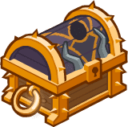ID: 553**Platinum  Shadowheart Chest**Loot for: Shadowheart<code>"for_crusaders":[141]</code>
        
        
            **Chest**
            Platinum  Shadowheart Chest
            x14 (Shinies x1)
        
    

ID: 793

### Feywild Fairytale Yorven Skin & Feat Pack - 1,680 Platinum  
Date of release: 16 Dec 2026

> Unlock Yorven along with his exclusive Feywild Fairytale Skin & Feat!

Contents:

    
        
            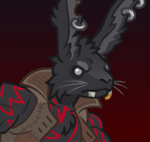ID: 92**Yorven (Seat 10)**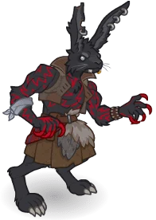
        
        
            **Champion Unlock**
            Yorven
        
    
    
        
            ID: 759**Feywild Fairytale Yorven (Yorven)**
        
        
            **Skin**
            Feywild Fairytale Yorven
        
    
    
        
            ID: 2872**TBD Yorven Feat (Do not translate)**
        
        
            **Feat**
            TBD Yorven Feat (Do not translate)
            Yorven
        
    
    
        
            ID: 20**Large Bounty Contract**Claim a bounty worth 8 hours of offline gold earnings and event tokens.<code>seconds_worth_of_gold,28800</code>
        
        
            **Buff**
            Large Bounty Contract
            x6
        
    
    
        
            ID: 34**Large Blacksmithing Contract**Contract a master blacksmith to improve a piece of equipment owned by one of your Champions.<code>level_up_loot,24</code>
        
        
            **Buff**
            Large Blacksmithing Contract
            x6
        
    
    
        
            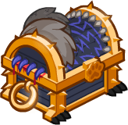ID: 341**Platinum Yorven Chest**Loot for: Yorven<code>"for_crusaders":[92]</code>
        
        
            **Chest**
            Platinum Yorven Chest
            x14 (Shinies x1)
        
    

ID: 794

### Sage the Elemental Owl Familiar Pack - 1,140 Platinum  
Date of release: 16 Dec 2026

> Collect your own Sage the Elemental Owl familiar!

Contents:

    
        
            ID: 349**Sage the Elemental Owl**Beware his icicle wingspan!
        
        
            **Familiar**
            Sage the Elemental Owl
        
    
    
        
            ID: 40**Huge Potion of Fire Breath**The orange liquid in this vial flickers and smoke fills the top of the container.<code>click_damage_seconds_global_dps,600</code>
        
        
            **Buff**
            Huge Potion of Fire Breath
            x4
        
    
    
        
            ID: 77**Huge Potion of Speed**This potion's yellow fluid is streaked with black and swirls on its own.<code>time_scale,2.75</code>
        
        
            **Buff**
            Huge Potion of Speed
            x4
        
    

ID: 795

### The Dark Urge's Legendary Feat Pack - 1,680 Platinum  
Date of release: 23 Dec 2026

> Unlock The Dark Urge's full potential with his Legendary Feat & 6 DPS Pigments now!

Contents:

    
        
            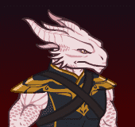ID: 146**Dark Urge (Seat 11)**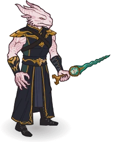
        
        
            **Champion Unlock**
            Dark Urge
        
    
    
        
            ID: 1**Selflessness**Aye, a selfless dwarf I am.  All Champions damage +10%.<code>global_dps_multiplier_mult,10</code>
        
        
            **Feat**
            Selflessness
            Bruenor
        
    
    
        
            ID: 1905**Marvelous DPS Pigment**Adds a Champion-tag-based effect to an epic or higher equipment item of your choice!<code>legendary_apply_pigment,2</code>
        
        
            **Buff**
            Marvelous DPS Pigment
            x6
        
    

ID: 796

### Champions of Renown: Year 9 All Star Pack - 8,000 Platinum  
Date of release: 30 Dec 2026

> Unlock and quickly gear up 5 of our favorite Champions from Year 9! Includes an exclusive skin for Laurana!

Contents:

    
        
            ID: 166**Cazrin (Seat 10)**
        
        
            **Champion Unlock**
            Cazrin
        
    
    
        
            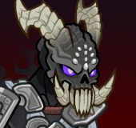ID: 168**King of Shadows (Seat 9)**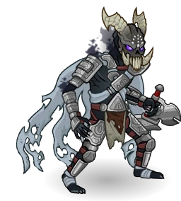
        
        
            **Champion Unlock**
            King of Shadows
        
    
    
        
            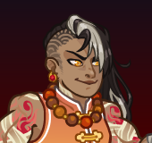ID: 172**Kyre (Seat 5)**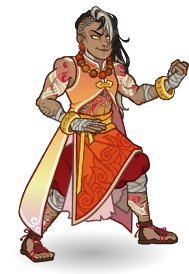
        
        
            **Champion Unlock**
            Kyre
        
    
    
        
            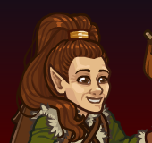ID: 174**Tasslehoff (Seat 11)**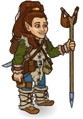
        
        
            **Champion Unlock**
            Tasslehoff
        
    
    
        
            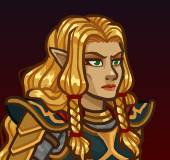ID: 175**Laurana (Seat 7)**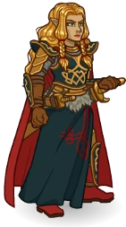
        
        
            **Champion Unlock**
            Laurana
        
    
    
        
            ID: 760**???**
        
        
            **???**
            skin
            ID: 760
        
    
    
        
            ID: 665**Platinum Cazrin Chest**Loot for: Cazrin<code>"for_crusaders":[166]</code>
        
        
            **Chest**
            Platinum Cazrin Chest
            x32 (Shinies x2)
        
    
    
        
            ID: 756**Platinum King of Shadows Chest**Loot for: King of Shadows<code>"for_crusaders":[168]</code>
        
        
            **Chest**
            Platinum King of Shadows Chest
            x32 (Shinies x2)
        
    
    
        
            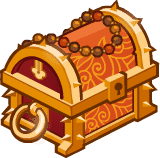ID: 782**Platinum Kyre Chest**Loot for: Kyre<code>"for_crusaders":[172]</code>
        
        
            **Chest**
            Platinum Kyre Chest
            x32 (Shinies x2)
        
    
    
        
            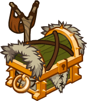ID: 796**Platinum Tasslehoff Chest**Loot for: Tasslehoff<code>"for_crusaders":[174]</code>
        
        
            **Chest**
            Platinum Tasslehoff Chest
            x32 (Shinies x2)
        
    
    
        
            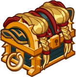ID: 808**Platinum Laurana Chest**Loot for: Laurana<code>"for_crusaders":[175]</code>
        
        
            **Chest**
            Platinum Laurana Chest
            x32 (Shinies x2)
        
    

[Back to Top](#top)

*Last Modified: {{ site.time }}*