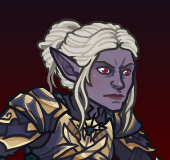

[Back to Main](index.md)

# Premium Packs and DLC

Upcoming real-money shop items.

ID: 544

### Privateer Volo Theme Pack - 3,830 Platinum  
Date of release: 05 Mar 2025

> Unlock Volo along with an exclusive Privateer Skin & Familiar!

Contents:

    
        
            ID: 159**Volo**
        
        
            **Champion Unlock**
            Volo
        
    
    
        
            ID: 526**Privateer Volo (Volo)**
        
        
            **Skin**
            Privateer Volo
        
    
    
        
            ID: 250**Volo's Trusty Quill**If there is anything in the world worth knowing, I assure you, I do. ~ Volo
        
        
            **Familiar**
            Volo's Trusty Quill
        
    
    
        
            ID: 2098**Feat**???: 2098
        
        
            **Feat**
            ???: 2098
        
    
    
        
            ID: 651**Platinum Volo Chest**Loot for: Volo<code>"for_crusaders":[159]</code>
        
        
            **Chest**
            Platinum Volo Chest
            x32 (Shinies x2)
        
    
    
        
            ID: 1723**Potion of the Gem Hunter**Increases the gem drops from bosses by 50%<code>increase_boss_gems_percent,50</code>
        
        
            **Buff**
            Potion of the Gem Hunter
            x1
        
    

ID: 545

### Bane's Chosen Gale Skin & Feat Pack - 1,680 Platinum  
Date of release: 05 Mar 2025

> Unlock Gale along with his exclusive Bane's Chosen Skin & Feat!

Contents:

    
        
            ID: 147**Gale (Seat 1)**
        
        
            **Champion Unlock**
            Gale
        
    
    
        
            ID: 527**Bane's Chosen Gale (Gale)**
        
        
            **Skin**
            Bane's Chosen Gale
        
    
    
        
            ID: 2090**Dark Academia**If Mystra will not hear my pleas, I shall seek succor elsewhere.<code>buff_upgrade,80,14573</code>
        
        
            **Feat**
            Dark Academia
            Gale (80% An Experienced Sage)
        
    
    
        
            ID: 20**Large Bounty Contract**Claim a bounty worth 8 hours of offline gold earnings and event tokens.<code>seconds_worth_of_gold,28800</code>
        
        
            **Buff**
            Large Bounty Contract
            x6
        
    
    
        
            ID: 34**Large Blacksmithing Contract**Contract a master blacksmith to improve a piece of equipment owned by one of your Champions.<code>level_up_loot,24</code>
        
        
            **Buff**
            Large Blacksmithing Contract
            x6
        
    
    
        
            ID: 565**Platinum Gale Chest**Loot for: Gale<code>"for_crusaders":[147]</code>
        
        
            **Chest**
            Platinum Gale Chest
            x14 (Shinies x1)
        
    

ID: 546

### Swashbuckler Sheila Theme Pack - 3,830 Platinum  
Date of release: 12 Mar 2025

> Unlock Sheila along with an exclusive Swashbuckler Skin & Familiar!

Contents:

    
        
            ID: 160**Sheila**
        
        
            **Champion Unlock**
            Sheila
        
    
    
        
            ID: 528**Swashbuckler Sheila (Sheila)**
        
        
            **Skin**
            Swashbuckler Sheila
        
    
    
        
            ID: 251**Feathers the Animated Parrot**Uni No! SQUAWK Uni No!
        
        
            **Familiar**
            Feathers the Animated Parrot
        
    
    
        
            ID: 2113**Feat**???: 2113
        
        
            **Feat**
            ???: 2113
        
    
    
        
            ID: 653**Platinum Sheila Chests**Loot for: Sheila<code>"for_crusaders":[160]</code>
        
        
            **Chest**
            Platinum Sheila Chests
            x32 (Shinies x2)
        
    
    
        
            ID: 1723**Potion of the Gem Hunter**Increases the gem drops from bosses by 50%<code>increase_boss_gems_percent,50</code>
        
        
            **Buff**
            Potion of the Gem Hunter
            x1
        
    

ID: 547

### Swashbuckler Orkira Skin & Feat Pack - 1,680 Platinum  
Date of release: 12 Mar 2025

> Unlock Orkira along with her exclusive Swashbuckler Skin & Feat!

Contents:

    
        
            ID: 78**Orkira (Seat 1)**
        
        
            **Champion Unlock**
            Orkira
        
    
    
        
            ID: 529**Swashbuckler Orkira (Orkira)**
        
        
            **Skin**
            Swashbuckler Orkira
        
    
    
        
            ID: 2091**Immolation**Friends are like marshmallows, flammable and sweet.<code>immolation,1,5</code>
        
        
            **Feat**
            Immolation
            Orkira (1s BUD per sec for 5s)
        
    
    
        
            ID: 20**Large Bounty Contract**Claim a bounty worth 8 hours of offline gold earnings and event tokens.<code>seconds_worth_of_gold,28800</code>
        
        
            **Buff**
            Large Bounty Contract
            x6
        
    
    
        
            ID: 34**Large Blacksmithing Contract**Contract a master blacksmith to improve a piece of equipment owned by one of your Champions.<code>level_up_loot,24</code>
        
        
            **Buff**
            Large Blacksmithing Contract
            x6
        
    
    
        
            ID: 263**Platinum Orkira Chest**Loot for: Orkira<code>"for_crusaders":[78]</code>
        
        
            **Chest**
            Platinum Orkira Chest
            x14 (Shinies x1)
        
    

ID: 548

### Pirate Queen Sisaspia Skin & Feat Pack - 1,680 Platinum  
Date of release: 19 Mar 2025

> Unlock Sisaspia along with her exclusive Pirate Queen Skin & Feat!

Contents:

    
        
            ID: 57**Sisaspia (Seat 1)**
        
        
            **Champion Unlock**
            Sisaspia
        
    
    
        
            ID: 530**Pirate Queen Sisaspia (Sisaspia)**
        
        
            **Skin**
            Pirate Queen Sisaspia
        
    
    
        
            ID: 2092**Evolved Contagion**Thisss isn't even itsss final form.<code>buff_upgrade,80,13251</code>
        
        
            **Feat**
            Evolved Contagion
            Sisaspia (80% Symbiotic Infection)
        
    
    
        
            ID: 20**Large Bounty Contract**Claim a bounty worth 8 hours of offline gold earnings and event tokens.<code>seconds_worth_of_gold,28800</code>
        
        
            **Buff**
            Large Bounty Contract
            x6
        
    
    
        
            ID: 34**Large Blacksmithing Contract**Contract a master blacksmith to improve a piece of equipment owned by one of your Champions.<code>level_up_loot,24</code>
        
        
            **Buff**
            Large Blacksmithing Contract
            x6
        
    
    
        
            ID: 173**Platinum Sisaspia Chest**Loot for: Sisaspia<code>"for_crusaders":[57]</code>
        
        
            **Chest**
            Platinum Sisaspia Chest
            x14 (Shinies x1)
        
    

ID: 549

### Pirate Lord Nrakk Skin & Feat Pack - 1,680 Platinum  
Date of release: 19 Mar 2025

> Unlock Nrakk along with his exclusive Pirate Lord Skin & Feat!

Contents:

    
        
            ID: 24**Nrakk (Seat 8)**
        
        
            **Champion Unlock**
            Nrakk
        
    
    
        
            ID: 531**Pirate Lord Nrakk (Nrakk)**
        
        
            **Skin**
            Pirate Lord Nrakk
        
    
    
        
            ID: 2093**Enlightened**Mind, heart, body, and soul in perfect balance, as all things should be.<code>buff_upgrades,80,13005,13006</code>
        
        
            **Feat**
            Enlightened
            Nrakk (80% All Specialisations)
        
    
    
        
            ID: 20**Large Bounty Contract**Claim a bounty worth 8 hours of offline gold earnings and event tokens.<code>seconds_worth_of_gold,28800</code>
        
        
            **Buff**
            Large Bounty Contract
            x6
        
    
    
        
            ID: 34**Large Blacksmithing Contract**Contract a master blacksmith to improve a piece of equipment owned by one of your Champions.<code>level_up_loot,24</code>
        
        
            **Buff**
            Large Blacksmithing Contract
            x6
        
    
    
        
            ID: 30**Platinum Nrakk Chest**Loot for: Nrakk<code>"for_crusaders":[24]</code>
        
        
            **Chest**
            Platinum Nrakk Chest
            x14 (Shinies x1)
        
    

ID: 550

### Kittenlord Blooshi Skin & Feat Pack - 1,680 Platinum  
Date of release: 26 Mar 2025

> Collect an exclusive Kittenlord Skin & Feat for Blooshi!

Contents:

    
        
            ID: 538**Kittenlord Blooshi (Blooshi)**
        
        
            **Skin**
            Kittenlord Blooshi
        
    
    
        
            ID: 2107**Nine Lives**It's actually way more, I think. I just stopped counting.<code>buff_upgrade,80,7520</code>
        
        
            **Feat**
            Nine Lives
            Blooshi (80% A Life Well Lived)
        
    
    
        
            ID: 20**Large Bounty Contract**Claim a bounty worth 8 hours of offline gold earnings and event tokens.<code>seconds_worth_of_gold,28800</code>
        
        
            **Buff**
            Large Bounty Contract
            x6
        
    
    
        
            ID: 34**Large Blacksmithing Contract**Contract a master blacksmith to improve a piece of equipment owned by one of your Champions.<code>level_up_loot,24</code>
        
        
            **Buff**
            Large Blacksmithing Contract
            x6
        
    
    
        
            ID: 481**Platinum Blooshi Chest**Loot for: Blooshi<code>"for_crusaders":[106]</code>
        
        
            **Chest**
            Platinum Blooshi Chest
            x14 (Shinies x1)
        
    

ID: 551

### Jade the Snake Familiar Pack - 840 Platinum  
Date of release: 26 Mar 2025

> Collect your own Jade the Snake Familiar!

Contents:

    
        
            ID: 252**Jade the Snake**I snuck back to Sigil in one of Windfall's sackssss.
        
        
            **Familiar**
            Jade the Snake
        
    
    
        
            ID: 4**Huge Potion of Giant's Strength**A transparent potion in which floats the sliver of a giant's fingernail.<code>global_dps_multiplier_mult,900</code>
        
        
            **Buff**
            Huge Potion of Giant's Strength
            x2
        
    
    
        
            ID: 8**Huge Potion of Clairvoyance**Three eyeballs bob in this yellowish potion.<code>gold_multiplier_mult,400</code>
        
        
            **Buff**
            Huge Potion of Clairvoyance
            x2
        
    
    
        
            ID: 77**Huge Potion of Speed**This potion's yellow fluid is streaked with black and swirls on its own.<code>time_scale,2.75</code>
        
        
            **Buff**
            Huge Potion of Speed
            x2
        
    

ID: 552

### Lich Makos Skin & Feat Pack - 1,680 Platinum  
Date of release: 26 Mar 2025

> Collect an exclusive Lich Skin & Feat for Makos!

Contents:

    
        
            ID: 539**Lich Makos (Makos)**
        
        
            **Skin**
            Lich Makos
        
    
    
        
            ID: 2108**Immolation**I call upon the Flames of Phlegethos!<code>immolation,1,5</code>
        
        
            **Feat**
            Immolation
            Makos (1s BUD per sec for 5s)
        
    
    
        
            ID: 20**Large Bounty Contract**Claim a bounty worth 8 hours of offline gold earnings and event tokens.<code>seconds_worth_of_gold,28800</code>
        
        
            **Buff**
            Large Bounty Contract
            x6
        
    
    
        
            ID: 34**Large Blacksmithing Contract**Contract a master blacksmith to improve a piece of equipment owned by one of your Champions.<code>level_up_loot,24</code>
        
        
            **Buff**
            Large Blacksmithing Contract
            x6
        
    
    
        
            ID: 469**Platinum Makos Chest**Loot for: Makos<code>"for_crusaders":[9]</code>
        
        
            **Chest**
            Platinum Makos Chest
            x14 (Shinies x1)
        
    

ID: 553

### Frost Giant Beadle Theme Pack - 3,830 Platinum  
Date of release: 02 Apr 2025

> Unlock Beadle along with an exclusive Frost Giant Skin & Familiar!

Contents:

    
        
            ID: 64**Grimm (Seat 8)**
        
        
            **Champion Unlock**
            Grimm
        
    
    
        
            ID: 540**Frost Giant Beadle (B&G)**
        
        
            **Skin**
            Frost Giant Beadle
        
    
    
        
            ID: 253**Loot the Weasel**Has larceny ever looked this cute?
        
        
            **Familiar**
            Loot the Weasel
        
    
    
        
            ID: 2128**Feat**???: 2128
        
        
            **Feat**
            ???: 2128
        
    
    
        
            ID: 187**Platinum Beadle & Grimm Chest**Loot for: Grimm<code>"for_crusaders":[64]</code>
        
        
            **Chest**
            Platinum Beadle & Grimm Chest
            x32 (Shinies x2)
        
    
    
        
            ID: 1723**Potion of the Gem Hunter**Increases the gem drops from bosses by 50%<code>increase_boss_gems_percent,50</code>
        
        
            **Buff**
            Potion of the Gem Hunter
            x1
        
    

ID: 554

### Frost Giant Grimm Theme Pack - 3,830 Platinum  
Date of release: 02 Apr 2025

> Unlock Grimm along with an exclusive Frost Giant Skin & Familiar!

Contents:

    
        
            ID: 161**Grimm (Seat 2)**
        
        
            **Champion Unlock**
            Grimm
        
    
    
        
            ID: 541**Frost Giant Grimm (Grimm)**
        
        
            **Skin**
            Frost Giant Grimm
        
    
    
        
            ID: 254**Tackle the White Wolf**A fierce protector with a healthy appetite.
        
        
            **Familiar**
            Tackle the White Wolf
        
    
    
        
            ID: 2154**Gloves Off**Let's settle this, one on one. No potions, blades only, neutral ground. ~Grimm<code>buff_ultimate,100 disallow_roaming_familiar_ult_trigger</code>
        
        
            **Feat**
            Gloves Off
            Grimm (100% Ultimate Damage & Blocks Roaming Ultimate Bar Familiars)
        
    
    
        
            ID: 655**Platinum Grimm Chest**Loot for: Grimm<code>"for_crusaders":[161]</code>
        
        
            **Chest**
            Platinum Grimm Chest
            x32 (Shinies x2)
        
    
    
        
            ID: 1723**Potion of the Gem Hunter**Increases the gem drops from bosses by 50%<code>increase_boss_gems_percent,50</code>
        
        
            **Buff**
            Potion of the Gem Hunter
            x1
        
    

ID: 555

### Helldusk The Dark Urge Skin & Feat Pack - 1,680 Platinum  
Date of release: 09 Apr 2025

> Unlock The Dark Urge along with his exclusive Helldusk Skin & Feat!

Contents:

    
        
            ID: 146**Dark Urge (Seat 11)**
        
        
            **Champion Unlock**
            Dark Urge
        
    
    
        
            ID: 542**Helldusk The Dark Urge (Dark Urge)**
        
        
            **Skin**
            Helldusk The Dark Urge
        
    
    
        
            ID: 2129**Blazing Blood**The hells themselves will quake at your passing, milord!<code>buff_upgrade,80,14380</code>
        
        
            **Feat**
            Blazing Blood
            Dark Urge (80% Ceremorphosis (Prestack))
        
    
    
        
            ID: 20**Large Bounty Contract**Claim a bounty worth 8 hours of offline gold earnings and event tokens.<code>seconds_worth_of_gold,28800</code>
        
        
            **Buff**
            Large Bounty Contract
            x6
        
    
    
        
            ID: 34**Large Blacksmithing Contract**Contract a master blacksmith to improve a piece of equipment owned by one of your Champions.<code>level_up_loot,24</code>
        
        
            **Buff**
            Large Blacksmithing Contract
            x6
        
    
    
        
            ID: 563**Platinum The Dark Urge Chest**Loot for: Dark Urge<code>"for_crusaders":[146]</code>
        
        
            **Chest**
            Platinum The Dark Urge Chest
            x14 (Shinies x1)
        
    

ID: 556

### Beacon the Giant Fire Beetle Familiar Pack - 1,680 Platinum  
Date of release: 09 Apr 2025

> Collect your own Beacon the Giant Fire Beetle Familiar!

Contents:

    
        
            ID: 255**Beacon the Giant Fire Beetle**
        
        
            **Familiar**
            Beacon the Giant Fire Beetle
        
    
    
        
            ID: 4**Huge Potion of Giant's Strength**A transparent potion in which floats the sliver of a giant's fingernail.<code>global_dps_multiplier_mult,900</code>
        
        
            **Buff**
            Huge Potion of Giant's Strength
            x4
        
    
    
        
            ID: 8**Huge Potion of Clairvoyance**Three eyeballs bob in this yellowish potion.<code>gold_multiplier_mult,400</code>
        
        
            **Buff**
            Huge Potion of Clairvoyance
            x4
        
    
    
        
            ID: 36**Potion of Polish**This shiny, silver liquid clings to the edge of the bottle in an unusual way.<code>shiny_loot,1</code>
        
        
            **Buff**
            Potion of Polish
            x1
        
    
    
        
            ID: 77**Huge Potion of Speed**This potion's yellow fluid is streaked with black and swirls on its own.<code>time_scale,2.75</code>
        
        
            **Buff**
            Huge Potion of Speed
            x4
        
    

ID: 557

### Storm Giant Catti-brie Skin & Feat Pack - 1,680 Platinum  
Date of release: 09 Apr 2025

> Unlock Catti-brie along with her exclusive Storm Giant Skin & Feat!

Contents:

    
        
            ID: 25**Catti-brie (Seat 7)**
        
        
            **Champion Unlock**
            Catti-brie
        
    
    
        
            ID: 543**Storm Giant Catti-brie (Catti-brie)**
        
        
            **Skin**
            Storm Giant Catti-brie
        
    
    
        
            ID: 1355**Archer's Perception**I'll know them when I see them. Attack on my signal.<code>buff_upgrade,80,11308</code>
        
        
            **Feat**
            Archer's Perception
            Catti-brie (80% Mark for Death)
        
    
    
        
            ID: 20**Large Bounty Contract**Claim a bounty worth 8 hours of offline gold earnings and event tokens.<code>seconds_worth_of_gold,28800</code>
        
        
            **Buff**
            Large Bounty Contract
            x6
        
    
    
        
            ID: 34**Large Blacksmithing Contract**Contract a master blacksmith to improve a piece of equipment owned by one of your Champions.<code>level_up_loot,24</code>
        
        
            **Buff**
            Large Blacksmithing Contract
            x6
        
    
    
        
            ID: 36**Platinum Catti-brie Chest**Loot for: Catti-brie<code>"for_crusaders":[25]</code>
        
        
            **Chest**
            Platinum Catti-brie Chest
            x14 (Shinies x1)
        
    

ID: 558

### Thunder Lord Briv Skin & Feat Pack - 1,680 Platinum  
Date of release: 16 Apr 2025

> Unlock Briv along with his exclusive Thunder Lord Skin & Feat!

Contents:

    
        
            ID: 58**Briv (Seat 5)**
        
        
            **Champion Unlock**
            Briv
        
    
    
        
            ID: 544**Thunder Lord Briv (Briv)**
        
        
            **Skin**
            Thunder Lord Briv
        
    
    
        
            ID: 2131**Thunder Step**Mine mighty footfalls shalt resoundeth throughout all the land!<code>todo DevNote: NEW EFFECT! TECH REQUIRED! When Steelbones stacks convert to Sprint stacks upon reset, you gain 20% more Sprint stacks, rounded down</code>
        
        
            **Feat**
            Thunder Step
            Briv (todo)
        
    
    
        
            ID: 20**Large Bounty Contract**Claim a bounty worth 8 hours of offline gold earnings and event tokens.<code>seconds_worth_of_gold,28800</code>
        
        
            **Buff**
            Large Bounty Contract
            x6
        
    
    
        
            ID: 34**Large Blacksmithing Contract**Contract a master blacksmith to improve a piece of equipment owned by one of your Champions.<code>level_up_loot,24</code>
        
        
            **Buff**
            Large Blacksmithing Contract
            x6
        
    
    
        
            ID: 175**Platinum Briv Chest**Loot for: Briv<code>"for_crusaders":[58]</code>
        
        
            **Chest**
            Platinum Briv Chest
            x14 (Shinies x1)
        
    

ID: 559

### Eternal Flame Strix Skin & Feat Pack - 1,680 Platinum  
Date of release: 16 Apr 2025

> Unlock Strix along with her exclusive Eternal Flame Skin & Feat!

Contents:

    
        
            ID: 23**Strix (Seat 11)**
        
        
            **Champion Unlock**
            Strix
        
    
    
        
            ID: 545**Eternal Flame Strix (Strix)**
        
        
            **Skin**
            Eternal Flame Strix
        
    
    
        
            ID: 2132**Giant Stench**Do you smell burning trash? Yeah? Okay, good.<code>buff_upgrade,80,12285</code>
        
        
            **Feat**
            Giant Stench
            Strix (80% Aura of Unclean)
        
    
    
        
            ID: 20**Large Bounty Contract**Claim a bounty worth 8 hours of offline gold earnings and event tokens.<code>seconds_worth_of_gold,28800</code>
        
        
            **Buff**
            Large Bounty Contract
            x6
        
    
    
        
            ID: 34**Large Blacksmithing Contract**Contract a master blacksmith to improve a piece of equipment owned by one of your Champions.<code>level_up_loot,24</code>
        
        
            **Buff**
            Large Blacksmithing Contract
            x6
        
    
    
        
            ID: 27**Platinum Strix Chest**Loot for: Strix<code>"for_crusaders":[23]</code>
        
        
            **Chest**
            Platinum Strix Chest
            x14 (Shinies x1)
        
    

ID: 560

### Champion of Avernus Reya Skin & Feat Pack - 1,680 Platinum  
Date of release: 23 Apr 2025

> Collect an exclusive Champion of Avernus Skin & Feat for Reya!

Contents:

    
        
            ID: 546**Champion of Avernus Reya (Reya)**
        
        
            **Skin**
            Champion of Avernus Reya
        
    
    
        
            ID: 2133**Zariel's Chosen**I am her mercy. I am her wrath. I am all that she was, is, and will be.<code>buff_upgrade,80,5457,0</code>
        
        
            **Feat**
            Zariel's Chosen
            Reya (80% Echoes of Zariel)
        
    
    
        
            ID: 20**Large Bounty Contract**Claim a bounty worth 8 hours of offline gold earnings and event tokens.<code>seconds_worth_of_gold,28800</code>
        
        
            **Buff**
            Large Bounty Contract
            x6
        
    
    
        
            ID: 34**Large Blacksmithing Contract**Contract a master blacksmith to improve a piece of equipment owned by one of your Champions.<code>level_up_loot,24</code>
        
        
            **Buff**
            Large Blacksmithing Contract
            x6
        
    
    
        
            ID: 478**Platinum Reya Chest**Loot for: Reya<code>"for_crusaders":[86]</code>
        
        
            **Chest**
            Platinum Reya Chest
            x14 (Shinies x1)
        
    

ID: 561

### Wazzik the Madcap Familiar Pack - 2,380 Platinum  
Date of release: 23 Apr 2025

> Collect your own Wazzik the Madcap Familiar!

Contents:

    
        
            ID: 256**Wazzik the Madcap**
        
        
            **Familiar**
            Wazzik the Madcap
        
    
    
        
            ID: 4**Huge Potion of Giant's Strength**A transparent potion in which floats the sliver of a giant's fingernail.<code>global_dps_multiplier_mult,900</code>
        
        
            **Buff**
            Huge Potion of Giant's Strength
            x6
        
    
    
        
            ID: 8**Huge Potion of Clairvoyance**Three eyeballs bob in this yellowish potion.<code>gold_multiplier_mult,400</code>
        
        
            **Buff**
            Huge Potion of Clairvoyance
            x6
        
    
    
        
            ID: 36**Potion of Polish**This shiny, silver liquid clings to the edge of the bottle in an unusual way.<code>shiny_loot,1</code>
        
        
            **Buff**
            Potion of Polish
            x1
        
    
    
        
            ID: 40**Huge Potion of Fire Breath**The orange liquid in this vial flickers and smoke fills the top of the container.<code>click_damage_seconds_global_dps,600</code>
        
        
            **Buff**
            Huge Potion of Fire Breath
            x6
        
    
    
        
            ID: 77**Huge Potion of Speed**This potion's yellow fluid is streaked with black and swirls on its own.<code>time_scale,2.75</code>
        
        
            **Buff**
            Huge Potion of Speed
            x6
        
    
    
        
            ID: 1721**Potion of the Gold Hunter**Increase Gold Find by 100%<code>gold_multiplier_mult,100</code>
        
        
            **Buff**
            Potion of the Gold Hunter
            x1
        
    
    
        
            **Modron Component Pieces**
        
        
            **Modron Component Pieces**
            x2,000
        
    

ID: 562

### Mind Flayer Minthara Skin & Feat Pack - 1,680 Platinum  
Date of release: 30 Apr 2025

> Unlock Minthara along with her exclusive Mind Flayer Skin & Feat!

Contents:

    
        
            ID: 154**Minthara (Seat 3)**
        
        
            **Champion Unlock**
            Minthara
        
    
    
        
            ID: 547**Mind Flayer Minthara (Minthara)**
        
        
            **Skin**
            Mind Flayer Minthara
        
    
    
        
            ID: 1967**Unrelenting Strife**If somebody causes me sorrow, I remove their ability to do so again.<code>minthara_increase_max_stacks,2</code>
        
        
            **Feat**
            Unrelenting Strife
            Minthara (+2 Soul Branding stacks)
        
    
    
        
            ID: 20**Large Bounty Contract**Claim a bounty worth 8 hours of offline gold earnings and event tokens.<code>seconds_worth_of_gold,28800</code>
        
        
            **Buff**
            Large Bounty Contract
            x6
        
    
    
        
            ID: 34**Large Blacksmithing Contract**Contract a master blacksmith to improve a piece of equipment owned by one of your Champions.<code>level_up_loot,24</code>
        
        
            **Buff**
            Large Blacksmithing Contract
            x6
        
    
    
        
            ID: 579**Platinum Minthara Chest**Loot for: Minthara<code>"for_crusaders":[154]</code>
        
        
            **Chest**
            Platinum Minthara Chest
            x14 (Shinies x1)
        
    

ID: 563

### Pepper the Baby Black Dragon Familiar Pack - 1,680 Platinum  
Date of release: 30 Apr 2025

> Collect your own Pepper the Baby Black Dragon Familiar!

Contents:

    
        
            ID: 257**Pepper the Baby Black Dragon**
        
        
            **Familiar**
            Pepper the Baby Black Dragon
        
    
    
        
            ID: 4**Huge Potion of Giant's Strength**A transparent potion in which floats the sliver of a giant's fingernail.<code>global_dps_multiplier_mult,900</code>
        
        
            **Buff**
            Huge Potion of Giant's Strength
            x4
        
    
    
        
            ID: 8**Huge Potion of Clairvoyance**Three eyeballs bob in this yellowish potion.<code>gold_multiplier_mult,400</code>
        
        
            **Buff**
            Huge Potion of Clairvoyance
            x4
        
    
    
        
            ID: 36**Potion of Polish**This shiny, silver liquid clings to the edge of the bottle in an unusual way.<code>shiny_loot,1</code>
        
        
            **Buff**
            Potion of Polish
            x1
        
    
    
        
            ID: 77**Huge Potion of Speed**This potion's yellow fluid is streaked with black and swirls on its own.<code>time_scale,2.75</code>
        
        
            **Buff**
            Huge Potion of Speed
            x4
        
    

ID: 564

### Mind Flayer Halsin Skin & Feat Pack - 1,680 Platinum  
Date of release: 30 Apr 2025

> Unlock Halsin along with his exclusive Mind Flayer Skin & Feat!

Contents:

    
        
            ID: 156**Halsin (Seat 3)**
        
        
            **Champion Unlock**
            Halsin
        
    
    
        
            ID: 548**Mind Flayer Halsin (Halsin)**
        
        
            **Skin**
            Mind Flayer Halsin
        
    
    
        
            ID: 2135**Verdant Vow**I give my all to serve the Oak Father. No sacrifice is too great.<code>buff_upgrade,80,15962,0</code>
        
        
            **Feat**
            Verdant Vow
            Halsin (80% Archdruid of Emerald Grove (Prestack))
        
    
    
        
            ID: 20**Large Bounty Contract**Claim a bounty worth 8 hours of offline gold earnings and event tokens.<code>seconds_worth_of_gold,28800</code>
        
        
            **Buff**
            Large Bounty Contract
            x6
        
    
    
        
            ID: 34**Large Blacksmithing Contract**Contract a master blacksmith to improve a piece of equipment owned by one of your Champions.<code>level_up_loot,24</code>
        
        
            **Buff**
            Large Blacksmithing Contract
            x6
        
    
    
        
            ID: 645**Platinum Halsin Chest**Loot for: Halsin<code>"for_crusaders":[156]</code>
        
        
            **Chest**
            Platinum Halsin Chest
            x14 (Shinies x1)
        
    

ID: 565

### Tempest Noble Vlithryn Theme Pack - 3,830 Platinum  
Date of release: 07 May 2025

> Unlock Vlithryn along with an exclusive Tempest Noble Skin & Familiar!

Contents:

    
        
            ID: 162**Vlithryn**
        
        
            **Champion Unlock**
            Vlithryn
        
    
    
        
            ID: 549**Tempest Noble Vlithryn (Vlithryn)**
        
        
            **Skin**
            Tempest Noble Vlithryn
        
    
    
        
            ID: 258**Mango the Hippocamp**
        
        
            **Familiar**
            Mango the Hippocamp
        
    
    
        
            ID: 1**Selflessness**Aye, a selfless dwarf I am.<code>global_dps_multiplier_mult,10</code>
        
        
            **Feat**
            Selflessness
            Bruenor (10% All Champion Damage)
        
    
    
        
            ID: 657****Loot for: Vlithryn<code>"for_crusaders":[162]</code>
        
        
            **Chest**
            
            x32 (Shinies x2)
        
    
    
        
            ID: 1723**Potion of the Gem Hunter**Increases the gem drops from bosses by 50%<code>increase_boss_gems_percent,50</code>
        
        
            **Buff**
            Potion of the Gem Hunter
            x1
        
    

ID: 566

### Tairnadal Jaheira Skin & Feat Pack - 1,680 Platinum  
Date of release: 07 May 2025

> Unlock Jaheira along with her exclusive Tairnadal Skin & Feat!

Contents:

    
        
            ID: 61**Jaheira (Seat 9)**
        
        
            **Champion Unlock**
            Jaheira
        
    
    
        
            ID: 550**Tairnadal Jaheira (Jaheira)**
        
        
            **Skin**
            Tairnadal Jaheira
        
    
    
        
            ID: 2136**Sylvan Calling**I'm getting in touch with my roots.<code>buff_upgrades,80,9714,9715,9716,9717</code>
        
        
            **Feat**
            Sylvan Calling
            Jaheira (80% All First Specialisations)
        
    
    
        
            ID: 20**Large Bounty Contract**Claim a bounty worth 8 hours of offline gold earnings and event tokens.<code>seconds_worth_of_gold,28800</code>
        
        
            **Buff**
            Large Bounty Contract
            x6
        
    
    
        
            ID: 34**Large Blacksmithing Contract**Contract a master blacksmith to improve a piece of equipment owned by one of your Champions.<code>level_up_loot,24</code>
        
        
            **Buff**
            Large Blacksmithing Contract
            x6
        
    
    
        
            ID: 181**Platinum Jaheira Chest**Loot for: Jaheira<code>"for_crusaders":[61]</code>
        
        
            **Chest**
            Platinum Jaheira Chest
            x14 (Shinies x1)
        
    

ID: 567

### Brigadier Evandra Skin & Feat Pack - 1,680 Platinum  
Date of release: 07 May 2025

> Unlock Evandra along with her exclusive Brigadier Skin & Feat!

Contents:

    
        
            ID: 124**Evandra (Seat 5)**
        
        
            **Champion Unlock**
            Evandra
        
    
    
        
            ID: 551**Brigadier Evandra (Evandra)**
        
        
            **Skin**
            Brigadier Evandra
        
    
    
        
            ID: 2137**Regimented Fury**Classy, sassy, and about to kick your --<code>buff_upgrades,80,11299,11300,11301</code>
        
        
            **Feat**
            Regimented Fury
            Evandra (80% All Specialisations)
        
    
    
        
            ID: 20**Large Bounty Contract**Claim a bounty worth 8 hours of offline gold earnings and event tokens.<code>seconds_worth_of_gold,28800</code>
        
        
            **Buff**
            Large Bounty Contract
            x6
        
    
    
        
            ID: 34**Large Blacksmithing Contract**Contract a master blacksmith to improve a piece of equipment owned by one of your Champions.<code>level_up_loot,24</code>
        
        
            **Buff**
            Large Blacksmithing Contract
            x6
        
    
    
        
            ID: 450**Platinum Evandra Chest**Loot for: Evandra<code>"for_crusaders":[124]</code>
        
        
            **Chest**
            Platinum Evandra Chest
            x14 (Shinies x1)
        
    

ID: 568

### Nomad Yorven Theme Pack - 3,830 Platinum  
Date of release: 14 May 2025

> Unlock Yorven along with an exclusive Nomad Skin & Familiar!

Contents:

    
        
            ID: 92**Yorven (Seat 10)**
        
        
            **Champion Unlock**
            Yorven
        
    
    
        
            ID: 552**Nomad Yorven (Yorven)**
        
        
            **Skin**
            Nomad Yorven
        
    
    
        
            ID: 259**Chase the Spaniel**
        
        
            **Familiar**
            Chase the Spaniel
        
    
    
        
            ID: 1**Selflessness**Aye, a selfless dwarf I am.<code>global_dps_multiplier_mult,10</code>
        
        
            **Feat**
            Selflessness
            Bruenor (10% All Champion Damage)
        
    
    
        
            ID: 341**Platinum Yorven Chest**Loot for: Yorven<code>"for_crusaders":[92]</code>
        
        
            **Chest**
            Platinum Yorven Chest
            x32 (Shinies x2)
        
    
    
        
            ID: 1723**Potion of the Gem Hunter**Increases the gem drops from bosses by 50%<code>increase_boss_gems_percent,50</code>
        
        
            **Buff**
            Potion of the Gem Hunter
            x1
        
    

ID: 569

### Spark the Living Lightning Bolt Familiar Pack - 2,380 Platinum  
Date of release: 14 May 2025

> Collect your own Spark the Living Lightning Bolt Familiar!

Contents:

    
        
            ID: 260**Spark the Living Lightning Bolt**
        
        
            **Familiar**
            Spark the Living Lightning Bolt
        
    
    
        
            ID: 4**Huge Potion of Giant's Strength**A transparent potion in which floats the sliver of a giant's fingernail.<code>global_dps_multiplier_mult,900</code>
        
        
            **Buff**
            Huge Potion of Giant's Strength
            x6
        
    
    
        
            ID: 8**Huge Potion of Clairvoyance**Three eyeballs bob in this yellowish potion.<code>gold_multiplier_mult,400</code>
        
        
            **Buff**
            Huge Potion of Clairvoyance
            x6
        
    
    
        
            ID: 36**Potion of Polish**This shiny, silver liquid clings to the edge of the bottle in an unusual way.<code>shiny_loot,1</code>
        
        
            **Buff**
            Potion of Polish
            x1
        
    
    
        
            ID: 40**Huge Potion of Fire Breath**The orange liquid in this vial flickers and smoke fills the top of the container.<code>click_damage_seconds_global_dps,600</code>
        
        
            **Buff**
            Huge Potion of Fire Breath
            x6
        
    
    
        
            ID: 77**Huge Potion of Speed**This potion's yellow fluid is streaked with black and swirls on its own.<code>time_scale,2.75</code>
        
        
            **Buff**
            Huge Potion of Speed
            x6
        
    
    
        
            ID: 1721**Potion of the Gold Hunter**Increase Gold Find by 100%<code>gold_multiplier_mult,100</code>
        
        
            **Buff**
            Potion of the Gold Hunter
            x1
        
    
    
        
            **Modron Component Pieces**
        
        
            **Modron Component Pieces**
            x2,000
        
    

ID: 570

### Valaes Tairn Melf Skin & Feat Pack - 1,680 Platinum  
Date of release: 14 May 2025

> Unlock Melf along with his exclusive Valaes Tairn Skin & Feat!

Contents:

    
        
            ID: 59**Melf (Seat 12)**
        
        
            **Champion Unlock**
            Melf
        
    
    
        
            ID: 553**Valaes Tairn Melf (Melf)**
        
        
            **Skin**
            Valaes Tairn Melf
        
    
    
        
            ID: 2138**Prodigal Leader**Rally to me, friends. We will survive this, and glory shall be ours.<code>global_dps_multiplier_mult,50</code>
        
        
            **Feat**
            Prodigal Leader
            Melf (50% All Champion Damage)
        
    
    
        
            ID: 20**Large Bounty Contract**Claim a bounty worth 8 hours of offline gold earnings and event tokens.<code>seconds_worth_of_gold,28800</code>
        
        
            **Buff**
            Large Bounty Contract
            x6
        
    
    
        
            ID: 34**Large Blacksmithing Contract**Contract a master blacksmith to improve a piece of equipment owned by one of your Champions.<code>level_up_loot,24</code>
        
        
            **Buff**
            Large Blacksmithing Contract
            x6
        
    
    
        
            ID: 177**Platinum Melf Chest**Loot for: Melf<code>"for_crusaders":[59]</code>
        
        
            **Chest**
            Platinum Melf Chest
            x14 (Shinies x1)
        
    

ID: 571

### Lamplighter Nixie Skin & Feat Pack - 1,680 Platinum  
Date of release: 21 May 2025

> Unlock Nixie along with her exclusive Lamplighter Skin & Feat!

Contents:

    
        
            ID: 123**Nixie (Seat 1)**
        
        
            **Champion Unlock**
            Nixie
        
    
    
        
            ID: 554**Lamplighter Nixie (Nixie)**
        
        
            **Skin**
            Lamplighter Nixie
        
    
    
        
            ID: 2139**Burning Beauty**Can't spell charm without harm!<code>buff_upgrades,80,10890,10891,10892</code>
        
        
            **Feat**
            Burning Beauty
            Nixie (80% All Specialisations)
        
    
    
        
            ID: 20**Large Bounty Contract**Claim a bounty worth 8 hours of offline gold earnings and event tokens.<code>seconds_worth_of_gold,28800</code>
        
        
            **Buff**
            Large Bounty Contract
            x6
        
    
    
        
            ID: 34**Large Blacksmithing Contract**Contract a master blacksmith to improve a piece of equipment owned by one of your Champions.<code>level_up_loot,24</code>
        
        
            **Buff**
            Large Blacksmithing Contract
            x6
        
    
    
        
            ID: 448**Platinum Nixie Chest**Loot for: Nixie<code>"for_crusaders":[123]</code>
        
        
            **Chest**
            Platinum Nixie Chest
            x14 (Shinies x1)
        
    

ID: 572

### Clawfoot the Dinosaur Familiar Pack - 1,680 Platinum  
Date of release: 21 May 2025

> Collect your own Clawfoot the Dinosaur Familiar!

Contents:

    
        
            ID: 261**Clawfoot the Dinosaur**
        
        
            **Familiar**
            Clawfoot the Dinosaur
        
    
    
        
            ID: 4**Huge Potion of Giant's Strength**A transparent potion in which floats the sliver of a giant's fingernail.<code>global_dps_multiplier_mult,900</code>
        
        
            **Buff**
            Huge Potion of Giant's Strength
            x4
        
    
    
        
            ID: 8**Huge Potion of Clairvoyance**Three eyeballs bob in this yellowish potion.<code>gold_multiplier_mult,400</code>
        
        
            **Buff**
            Huge Potion of Clairvoyance
            x4
        
    
    
        
            ID: 36**Potion of Polish**This shiny, silver liquid clings to the edge of the bottle in an unusual way.<code>shiny_loot,1</code>
        
        
            **Buff**
            Potion of Polish
            x1
        
    
    
        
            ID: 77**Huge Potion of Speed**This potion's yellow fluid is streaked with black and swirls on its own.<code>time_scale,2.75</code>
        
        
            **Buff**
            Huge Potion of Speed
            x4
        
    

ID: 573

### Warforged Evelyn Skin & Feat Pack - 1,680 Platinum  
Date of release: 21 May 2025

> Unlock Evelyn along with her exclusive Warforged Skin & Feat!

Contents:

    
        
            ID: 26**Evelyn (Seat 6)**
        
        
            **Champion Unlock**
            Evelyn
        
    
    
        
            ID: 555**Warforged Evelyn (Evelyn)**
        
        
            **Skin**
            Warforged Evelyn
        
    
    
        
            ID: 1472**Under Pressure**Uh oh -- more enemies! Everyone get behind me!<code>buff_upgrade,80,12207</code>
        
        
            **Feat**
            Under Pressure
            Evelyn (80% Steadfast Might)
        
    
    
        
            ID: 20**Large Bounty Contract**Claim a bounty worth 8 hours of offline gold earnings and event tokens.<code>seconds_worth_of_gold,28800</code>
        
        
            **Buff**
            Large Bounty Contract
            x6
        
    
    
        
            ID: 34**Large Blacksmithing Contract**Contract a master blacksmith to improve a piece of equipment owned by one of your Champions.<code>level_up_loot,24</code>
        
        
            **Buff**
            Large Blacksmithing Contract
            x6
        
    
    
        
            ID: 41**Platinum Evelyn Chest**Loot for: Evelyn<code>"for_crusaders":[26]</code>
        
        
            **Chest**
            Platinum Evelyn Chest
            x14 (Shinies x1)
        
    

ID: 574

### Prodigal Son Wyll Skin & Feat Pack - 1,680 Platinum  
Date of release: 28 May 2025

> Unlock Wyll along with his exclusive Prodigal Son Skin & Feat!

Contents:

    
        
            ID: 142**Wyll (Seat 12)**
        
        
            **Champion Unlock**
            Wyll
        
    
    
        
            ID: 556**Prodigal Son Wyll (Wyll)**
        
        
            **Skin**
            Prodigal Son Wyll
        
    
    
        
            ID: 2141**Duke's Pride**He is our shield, as I am his blade. Together, we protect the people of Baldur's Gate.<code>buff_upgrade,80,13429</code>
        
        
            **Feat**
            Duke's Pride
            Wyll (80% Folk Hero (Prestack))
        
    
    
        
            ID: 20**Large Bounty Contract**Claim a bounty worth 8 hours of offline gold earnings and event tokens.<code>seconds_worth_of_gold,28800</code>
        
        
            **Buff**
            Large Bounty Contract
            x6
        
    
    
        
            ID: 34**Large Blacksmithing Contract**Contract a master blacksmith to improve a piece of equipment owned by one of your Champions.<code>level_up_loot,24</code>
        
        
            **Buff**
            Large Blacksmithing Contract
            x6
        
    
    
        
            ID: 555**Platinum Wyll Chest**Loot for: Wyll<code>"for_crusaders":[142]</code>
        
        
            **Chest**
            Platinum Wyll Chest
            x14 (Shinies x1)
        
    

ID: 575

### Virtue the Valenar Foal Familiar Pack - 840 Platinum  
Date of release: 28 May 2025

> Collect your own Virtue the Valenar Foal Familiar!

Contents:

    
        
            ID: 262**Virtue the Valenar Foal**
        
        
            **Familiar**
            Virtue the Valenar Foal
        
    
    
        
            ID: 4**Huge Potion of Giant's Strength**A transparent potion in which floats the sliver of a giant's fingernail.<code>global_dps_multiplier_mult,900</code>
        
        
            **Buff**
            Huge Potion of Giant's Strength
            x2
        
    
    
        
            ID: 8**Huge Potion of Clairvoyance**Three eyeballs bob in this yellowish potion.<code>gold_multiplier_mult,400</code>
        
        
            **Buff**
            Huge Potion of Clairvoyance
            x2
        
    
    
        
            ID: 77**Huge Potion of Speed**This potion's yellow fluid is streaked with black and swirls on its own.<code>time_scale,2.75</code>
        
        
            **Buff**
            Huge Potion of Speed
            x2
        
    

ID: 576

### Dracolich Duke Ravengard Skin & Feat Pack - 1,680 Platinum  
Date of release: 04 Jun 2025

> Unlock Duke Ravengard along with his exclusive Dracolich Skin & Feat!

Contents:

    
        
            ID: 149**Ravengard (Seat 8)**
        
        
            **Champion Unlock**
            Ravengard
        
    
    
        
            ID: 559**Dracolich Duke Ravengard (Ravengard)**
        
        
            **Skin**
            Dracolich Duke Ravengard
        
    
    
        
            ID: 2009**TBD Duke Ravengard Feat (Do not translate)**
        
        
            **Feat**
            TBD Duke Ravengard Feat (Do not translate)
            Ravengard ()
        
    
    
        
            ID: 20**Large Bounty Contract**Claim a bounty worth 8 hours of offline gold earnings and event tokens.<code>seconds_worth_of_gold,28800</code>
        
        
            **Buff**
            Large Bounty Contract
            x6
        
    
    
        
            ID: 34**Large Blacksmithing Contract**Contract a master blacksmith to improve a piece of equipment owned by one of your Champions.<code>level_up_loot,24</code>
        
        
            **Buff**
            Large Blacksmithing Contract
            x6
        
    
    
        
            ID: 569**Platinum Duke Ravengard Chest**Loot for: Ravengard<code>"for_crusaders":[149]</code>
        
        
            **Chest**
            Platinum Duke Ravengard Chest
            x14 (Shinies x1)
        
    

ID: 577

### Dragonslayer Hank Theme Pack - 3,830 Platinum  
Date of release: 04 Jun 2025

> Unlock Hank along with an exclusive Dragonslayer Skin & Familiar!

Contents:

    
        
            ID: 163**Hank**
        
        
            **Champion Unlock**
            Hank
        
    
    
        
            ID: 560**Dragonslayer Hank (Hank)**
        
        
            **Skin**
            Dragonslayer Hank
        
    
    
        
            ID: 263**Verdant the Baby Green Dragon**By the time you see him, it's too late!
        
        
            **Familiar**
            Verdant the Baby Green Dragon
        
    
    
        
            ID: 1**Selflessness**Aye, a selfless dwarf I am.<code>global_dps_multiplier_mult,10</code>
        
        
            **Feat**
            Selflessness
            Bruenor (10% All Champion Damage)
        
    
    
        
            ID: 659****Loot for: Hank<code>"for_crusaders":[163]</code>
        
        
            **Chest**
            
            x32 (Shinies x2)
        
    
    
        
            ID: 1723**Potion of the Gem Hunter**Increases the gem drops from bosses by 50%<code>increase_boss_gems_percent,50</code>
        
        
            **Buff**
            Potion of the Gem Hunter
            x1
        
    

ID: 578

### Midas the Baby Gold Dragon Familiar Pack - 2,380 Platinum  
Date of release: 04 Jun 2025

> Collect your own Midas the Baby Gold Dragon Familiar!

Contents:

    
        
            ID: 264**Midas the Baby Gold Dragon**I'm here to eat goblins and collect treasure, and I'm all out of goblins!
        
        
            **Familiar**
            Midas the Baby Gold Dragon
        
    
    
        
            ID: 4**Huge Potion of Giant's Strength**A transparent potion in which floats the sliver of a giant's fingernail.<code>global_dps_multiplier_mult,900</code>
        
        
            **Buff**
            Huge Potion of Giant's Strength
            x6
        
    
    
        
            ID: 8**Huge Potion of Clairvoyance**Three eyeballs bob in this yellowish potion.<code>gold_multiplier_mult,400</code>
        
        
            **Buff**
            Huge Potion of Clairvoyance
            x6
        
    
    
        
            ID: 36**Potion of Polish**This shiny, silver liquid clings to the edge of the bottle in an unusual way.<code>shiny_loot,1</code>
        
        
            **Buff**
            Potion of Polish
            x1
        
    
    
        
            ID: 40**Huge Potion of Fire Breath**The orange liquid in this vial flickers and smoke fills the top of the container.<code>click_damage_seconds_global_dps,600</code>
        
        
            **Buff**
            Huge Potion of Fire Breath
            x6
        
    
    
        
            ID: 77**Huge Potion of Speed**This potion's yellow fluid is streaked with black and swirls on its own.<code>time_scale,2.75</code>
        
        
            **Buff**
            Huge Potion of Speed
            x6
        
    
    
        
            ID: 1721**Potion of the Gold Hunter**Increase Gold Find by 100%<code>gold_multiplier_mult,100</code>
        
        
            **Buff**
            Potion of the Gold Hunter
            x1
        
    
    
        
            **Modron Component Pieces**
        
        
            **Modron Component Pieces**
            x2,000
        
    

ID: 579

### Dragon Rider Krond Theme Pack - 3,830 Platinum  
Date of release: 11 Jun 2025

> Unlock Krond along with an exclusive Dragon Rider Skin & Familiar!

Contents:

    
        
            ID: 15**Krond (Seat 6)**
        
        
            **Champion Unlock**
            Krond
        
    
    
        
            ID: 561**Dragon Rider Krond (Krond)**
        
        
            **Skin**
            Dragon Rider Krond
        
    
    
        
            ID: 265**Noctis the Baby Deep Dragon**She barters in secrets.
        
        
            **Familiar**
            Noctis the Baby Deep Dragon
        
    
    
        
            ID: 1**Selflessness**Aye, a selfless dwarf I am.<code>global_dps_multiplier_mult,10</code>
        
        
            **Feat**
            Selflessness
            Bruenor (10% All Champion Damage)
        
    
    
        
            ID: 6**Platinum Krond Chest**Loot for: Krond<code>"for_crusaders":[15]</code>
        
        
            **Chest**
            Platinum Krond Chest
            x32 (Shinies x2)
        
    
    
        
            ID: 1723**Potion of the Gem Hunter**Increases the gem drops from bosses by 50%<code>increase_boss_gems_percent,50</code>
        
        
            **Buff**
            Potion of the Gem Hunter
            x1
        
    

ID: 580

### Reaper BBEG Skin & Feat Pack - 1,680 Platinum  
Date of release: 11 Jun 2025

> Unlock BBEG along with his exclusive Reaper Skin & Feat!

Contents:

    
        
            ID: 125**BBEG (Seat 3)**
        
        
            **Champion Unlock**
            BBEG
        
    
    
        
            ID: 562**Reaper BBEG (BBEG)**
        
        
            **Skin**
            Reaper BBEG
        
    
    
        
            ID: 2140**TBD BBEG Feat (Do not translate)**
        
        
            **Feat**
            TBD BBEG Feat (Do not translate)
            BBEG ()
        
    
    
        
            ID: 20**Large Bounty Contract**Claim a bounty worth 8 hours of offline gold earnings and event tokens.<code>seconds_worth_of_gold,28800</code>
        
        
            **Buff**
            Large Bounty Contract
            x6
        
    
    
        
            ID: 34**Large Blacksmithing Contract**Contract a master blacksmith to improve a piece of equipment owned by one of your Champions.<code>level_up_loot,24</code>
        
        
            **Buff**
            Large Blacksmithing Contract
            x6
        
    
    
        
            ID: 452**Platinum BBEG Chest**Loot for: BBEG<code>"for_crusaders":[125]</code>
        
        
            **Chest**
            Platinum BBEG Chest
            x14 (Shinies x1)
        
    

ID: 581

### Vendetta the Baby White Dragon Familiar Pack - 1,680 Platinum  
Date of release: 11 Jun 2025

> Collect your own Vendetta the Baby White Dragon Familiar!

Contents:

    
        
            ID: 266**Vendetta the Baby White Dragon**Don't even THINK about stepping near her tail!
        
        
            **Familiar**
            Vendetta the Baby White Dragon
        
    
    
        
            ID: 4**Huge Potion of Giant's Strength**A transparent potion in which floats the sliver of a giant's fingernail.<code>global_dps_multiplier_mult,900</code>
        
        
            **Buff**
            Huge Potion of Giant's Strength
            x4
        
    
    
        
            ID: 8**Huge Potion of Clairvoyance**Three eyeballs bob in this yellowish potion.<code>gold_multiplier_mult,400</code>
        
        
            **Buff**
            Huge Potion of Clairvoyance
            x4
        
    
    
        
            ID: 36**Potion of Polish**This shiny, silver liquid clings to the edge of the bottle in an unusual way.<code>shiny_loot,1</code>
        
        
            **Buff**
            Potion of Polish
            x1
        
    
    
        
            ID: 77**Huge Potion of Speed**This potion's yellow fluid is streaked with black and swirls on its own.<code>time_scale,2.75</code>
        
        
            **Buff**
            Huge Potion of Speed
            x4
        
    

ID: 582

### Dragon King Dungeon Master Skin & Feat Pack - 1,680 Platinum  
Date of release: 18 Jun 2025

> Unlock Dungeon Master along with his exclusive Dragon King Skin & Feat!

Contents:

    
        
            ID: 99**Dungeon Master (Seat 6)**
        
        
            **Champion Unlock**
            Dungeon Master
        
    
    
        
            ID: 563**Dragon King Dungeon Master (DM)**
        
        
            **Skin**
            Dragon King Dungeon Master
        
    
    
        
            ID: 2134**TBD Dungeon Master Feat (Do not translate)**
        
        
            **Feat**
            TBD Dungeon Master Feat (Do not translate)
            DM ()
        
    
    
        
            ID: 20**Large Bounty Contract**Claim a bounty worth 8 hours of offline gold earnings and event tokens.<code>seconds_worth_of_gold,28800</code>
        
        
            **Buff**
            Large Bounty Contract
            x6
        
    
    
        
            ID: 34**Large Blacksmithing Contract**Contract a master blacksmith to improve a piece of equipment owned by one of your Champions.<code>level_up_loot,24</code>
        
        
            **Buff**
            Large Blacksmithing Contract
            x6
        
    
    
        
            ID: 355**Platinum Dungeon Master Chest**Loot for: Dungeon Master<code>"for_crusaders":[99]</code>
        
        
            **Chest**
            Platinum Dungeon Master Chest
            x14 (Shinies x1)
        
    

ID: 583

### Skypirate Antrius Skin & Feat Pack - 1,680 Platinum  
Date of release: 18 Jun 2025

> Unlock Antrius along with his exclusive Skypirate Skin & Feat!

Contents:

    
        
            ID: 122**Antrius (Seat 4)**
        
        
            **Champion Unlock**
            Antrius
        
    
    
        
            ID: 564**Skypirate Antrius (Antrius)**
        
        
            **Skin**
            Skypirate Antrius
        
    
    
        
            ID: 2130**TBD Antrius Feat (Do not translate)**
        
        
            **Feat**
            TBD Antrius Feat (Do not translate)
            Antrius ()
        
    
    
        
            ID: 20**Large Bounty Contract**Claim a bounty worth 8 hours of offline gold earnings and event tokens.<code>seconds_worth_of_gold,28800</code>
        
        
            **Buff**
            Large Bounty Contract
            x6
        
    
    
        
            ID: 34**Large Blacksmithing Contract**Contract a master blacksmith to improve a piece of equipment owned by one of your Champions.<code>level_up_loot,24</code>
        
        
            **Buff**
            Large Blacksmithing Contract
            x6
        
    
    
        
            ID: 446**Platinum Antrius Chest**Loot for: Antrius<code>"for_crusaders":[122]</code>
        
        
            **Chest**
            Platinum Antrius Chest
            x14 (Shinies x1)
        
    

ID: 584

### Cosmic Dragon Nova Skin & Feat Pack - 1,680 Platinum  
Date of release: 18 Jun 2025

> Unlock Nova along with her exclusive Cosmic Dragon Skin & Feat!

Contents:

    
        
            ID: 62**Nova (Seat 11)**
        
        
            **Champion Unlock**
            Nova
        
    
    
        
            ID: 565**Cosmic Dragon Nova (Nova)**
        
        
            **Skin**
            Cosmic Dragon Nova
        
    
    
        
            ID: 2049**TBD Nova Feat (Do not translate)**
        
        
            **Feat**
            TBD Nova Feat (Do not translate)
            Nova ()
        
    
    
        
            ID: 20**Large Bounty Contract**Claim a bounty worth 8 hours of offline gold earnings and event tokens.<code>seconds_worth_of_gold,28800</code>
        
        
            **Buff**
            Large Bounty Contract
            x6
        
    
    
        
            ID: 34**Large Blacksmithing Contract**Contract a master blacksmith to improve a piece of equipment owned by one of your Champions.<code>level_up_loot,24</code>
        
        
            **Buff**
            Large Blacksmithing Contract
            x6
        
    
    
        
            ID: 183**Platinum Nova Chest**Loot for: Nova<code>"for_crusaders":[62]</code>
        
        
            **Chest**
            Platinum Nova Chest
            x14 (Shinies x1)
        
    

ID: 585

### Cataclysmic Kas Skin & Feat Pack - 1,680 Platinum  
Date of release: 25 Jun 2025

> Unlock Kas along with his exclusive Cataclysmic Skin & Feat!

Contents:

    
        
            ID: 153**Kas (Seat 6)**
        
        
            **Champion Unlock**
            Kas
        
    
    
        
            ID: 566**Cataclysmic Kas (Kas)**
        
        
            **Skin**
            Cataclysmic Kas
        
    
    
        
            ID: 1982**TBD Kas Feat (Do not translate)**
        
        
            **Feat**
            TBD Kas Feat (Do not translate)
            Kas ()
        
    
    
        
            ID: 20**Large Bounty Contract**Claim a bounty worth 8 hours of offline gold earnings and event tokens.<code>seconds_worth_of_gold,28800</code>
        
        
            **Buff**
            Large Bounty Contract
            x6
        
    
    
        
            ID: 34**Large Blacksmithing Contract**Contract a master blacksmith to improve a piece of equipment owned by one of your Champions.<code>level_up_loot,24</code>
        
        
            **Buff**
            Large Blacksmithing Contract
            x6
        
    
    
        
            ID: 577**Platinum Kas Chest**Loot for: Kas<code>"for_crusaders":[153]</code>
        
        
            **Chest**
            Platinum Kas Chest
            x14 (Shinies x1)
        
    

ID: 586

### Dragonskull Bobby Skin & Feat Pack - 1,680 Platinum  
Date of release: 25 Jun 2025

> Unlock Bobby along with his exclusive Dragonskull Skin & Feat!

Contents:

    
        
            ID: 152**Bobby (Seat 12)**
        
        
            **Champion Unlock**
            Bobby
        
    
    
        
            ID: 567**Dragonskull Bobby (Bobby)**
        
        
            **Skin**
            Dragonskull Bobby
        
    
    
        
            ID: 2010**TBD Bobby Feat (Do not translate)**
        
        
            **Feat**
            TBD Bobby Feat (Do not translate)
            Bobby ()
        
    
    
        
            ID: 20**Large Bounty Contract**Claim a bounty worth 8 hours of offline gold earnings and event tokens.<code>seconds_worth_of_gold,28800</code>
        
        
            **Buff**
            Large Bounty Contract
            x6
        
    
    
        
            ID: 34**Large Blacksmithing Contract**Contract a master blacksmith to improve a piece of equipment owned by one of your Champions.<code>level_up_loot,24</code>
        
        
            **Buff**
            Large Blacksmithing Contract
            x6
        
    
    
        
            ID: 575**Platinum Bobby Chest**Loot for: Bobby<code>"for_crusaders":[152]</code>
        
        
            **Chest**
            Platinum Bobby Chest
            x14 (Shinies x1)
        
    

ID: 587

### Shimmer the Baby Silver Dragon Familiar Pack - 1,680 Platinum  
Date of release: 25 Jun 2025

> Collect your own Shimmer the Baby Silver Dragon Familiar!

Contents:

    
        
            ID: 267**Shimmer the Baby Silver Dragon**He might be small, but he can eat. Watch out for your turkey leg!
        
        
            **Familiar**
            Shimmer the Baby Silver Dragon
        
    
    
        
            ID: 4**Huge Potion of Giant's Strength**A transparent potion in which floats the sliver of a giant's fingernail.<code>global_dps_multiplier_mult,900</code>
        
        
            **Buff**
            Huge Potion of Giant's Strength
            x4
        
    
    
        
            ID: 8**Huge Potion of Clairvoyance**Three eyeballs bob in this yellowish potion.<code>gold_multiplier_mult,400</code>
        
        
            **Buff**
            Huge Potion of Clairvoyance
            x4
        
    
    
        
            ID: 36**Potion of Polish**This shiny, silver liquid clings to the edge of the bottle in an unusual way.<code>shiny_loot,1</code>
        
        
            **Buff**
            Potion of Polish
            x1
        
    
    
        
            ID: 77**Huge Potion of Speed**This potion's yellow fluid is streaked with black and swirls on its own.<code>time_scale,2.75</code>
        
        
            **Buff**
            Huge Potion of Speed
            x4
        
    

[Back to Top](#top)

*Last Modified: {{ site.time }}*