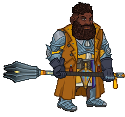

[Back to Main](index.md)

# Premium Packs and DLC

Upcoming real-money shop items.

ID: 576

### Dracolich Duke Ravengard Skin & Feat Pack - 1,680 Platinum  
Date of release: 04 Jun 2025

> Unlock Duke Ravengard along with his exclusive Dracolich Skin & Feat!

Contents:

    
        
            ID: 149**Ravengard (Seat 8)**
        
        
            **Champion Unlock**
            Ravengard
        
    
    
        
            ID: 559**Dracolich Duke Ravengard (Ravengard)**
        
        
            **Skin**
            Dracolich Duke Ravengard
        
    
    
        
            ID: 1823**Morale Boost**This is what our soldiers needed - hope.<code>buff_upgrade_effect_stacks_max_add,20,15030</code>
        
        
            **Feat**
            Morale Boost
            Ravengard (+20 Max Stacks to Critical Teamwork)
        
    
    
        
            ID: 20**Large Bounty Contract**Claim a bounty worth 8 hours of offline gold earnings and event tokens.<code>seconds_worth_of_gold,28800</code>
        
        
            **Buff**
            Large Bounty Contract
            x6
        
    
    
        
            ID: 34**Large Blacksmithing Contract**Contract a master blacksmith to improve a piece of equipment owned by one of your Champions.<code>level_up_loot,24</code>
        
        
            **Buff**
            Large Blacksmithing Contract
            x6
        
    
    
        
            ID: 569**Platinum Duke Ravengard Chest**Loot for: Ravengard<code>"for_crusaders":[149]</code>
        
        
            **Chest**
            Platinum Duke Ravengard Chest
            x14 (Shinies x1)
        
    

ID: 577

### Dragonslayer Hank Theme Pack - 3,830 Platinum  
Date of release: 04 Jun 2025

> Unlock Hank along with an exclusive Dragonslayer Skin & Familiar!

Contents:

    
        
            ID: 163**Hank**
        
        
            **Champion Unlock**
            Hank
        
    
    
        
            ID: 560**Dragonslayer Hank (Hank)**
        
        
            **Skin**
            Dragonslayer Hank
        
    
    
        
            ID: 263**Verdant the Baby Green Dragon**By the time you see him, it's too late!
        
        
            **Familiar**
            Verdant the Baby Green Dragon
        
    
    
        
            ID: 2202**Feat**???: 2202
        
        
            **Feat**
            ???: 2202
        
    
    
        
            ID: 659**Platinum Hank Chest**Loot for: Hank<code>"for_crusaders":[163]</code>
        
        
            **Chest**
            Platinum Hank Chest
            x32 (Shinies x2)
        
    
    
        
            ID: 1723**Potion of the Gem Hunter**Increases the gem drops from bosses by 50%<code>increase_boss_gems_percent,50</code>
        
        
            **Buff**
            Potion of the Gem Hunter
            x1
        
    

ID: 587

### Shimmer the Baby Silver Dragon Familiar Pack - 1,680 Platinum  
Date of release: 04 Jun 2025

> Collect your own Shimmer the Baby Silver Dragon Familiar!

Contents:

    
        
            ID: 267**Shimmer the Baby Silver Dragon**He might be small, but he can eat. Watch out for your turkey leg!
        
        
            **Familiar**
            Shimmer the Baby Silver Dragon
        
    
    
        
            ID: 4**Huge Potion of Giant's Strength**A transparent potion in which floats the sliver of a giant's fingernail.<code>global_dps_multiplier_mult,900</code>
        
        
            **Buff**
            Huge Potion of Giant's Strength
            x4
        
    
    
        
            ID: 8**Huge Potion of Clairvoyance**Three eyeballs bob in this yellowish potion.<code>gold_multiplier_mult,400</code>
        
        
            **Buff**
            Huge Potion of Clairvoyance
            x4
        
    
    
        
            ID: 36**Potion of Polish**This shiny, silver liquid clings to the edge of the bottle in an unusual way.<code>shiny_loot,1</code>
        
        
            **Buff**
            Potion of Polish
            x1
        
    
    
        
            ID: 77**Huge Potion of Speed**This potion's yellow fluid is streaked with black and swirls on its own.<code>time_scale,2.75</code>
        
        
            **Buff**
            Huge Potion of Speed
            x4
        
    

ID: 604

### Dungeon Master's Champions of Renown Pack - $69.99  
Date of release: 04 Jun 2025

> Xbox Exclusive (Do Not Translate)

ⓘ *Note: This pack might not be available for purchase since it's potentially a platform giveaway.*

Contents:

    
        
            ID: 99**Dungeon Master (Seat 6)**
        
        
            **Champion Unlock**
            Dungeon Master
        
    
    
        
            ID: 148**Diana (Seat 9)**
        
        
            **Champion Unlock**
            Diana
        
    
    
        
            ID: 157**Eric (Seat 4)**
        
        
            **Champion Unlock**
            Eric
        
    
    
        
            ID: 160**Sheila (Seat 7)**
        
        
            **Champion Unlock**
            Sheila
        
    
    
        
            ID: 163**Hank**
        
        
            **Champion Unlock**
            Hank
        
    
    
        
            ID: 277**Amber the Faerie Dragon**You're the one who woke the giant ants up, not me!
        
        
            **Familiar**
            Amber the Faerie Dragon
        
    
    
        
            ID: 355**Platinum Dungeon Master Chest**Loot for: Dungeon Master<code>"for_crusaders":[99]</code>
        
        
            **Chest**
            Platinum Dungeon Master Chest
            x32 (Shinies x2)
        
    
    
        
            ID: 567**Platinum Diana Chest**Loot for: Diana<code>"for_crusaders":[148]</code>
        
        
            **Chest**
            Platinum Diana Chest
            x32 (Shinies x2)
        
    
    
        
            ID: 647**Platinum Eric Chest**Loot for: Eric<code>"for_crusaders":[157]</code>
        
        
            **Chest**
            Platinum Eric Chest
            x32 (Shinies x2)
        
    
    
        
            ID: 653**Platinum Sheila Chests**Loot for: Sheila<code>"for_crusaders":[160]</code>
        
        
            **Chest**
            Platinum Sheila Chests
            x32 (Shinies x2)
        
    
    
        
            ID: 659**Platinum Hank Chest**Loot for: Hank<code>"for_crusaders":[163]</code>
        
        
            **Chest**
            Platinum Hank Chest
            x32 (Shinies x2)
        
    
    
        
            ID: 1721**Potion of the Gold Hunter**Increase Gold Find by 100%<code>gold_multiplier_mult,100</code>
        
        
            **Buff**
            Potion of the Gold Hunter
            x1
        
    
    
        
            ID: 1723**Potion of the Gem Hunter**Increases the gem drops from bosses by 50%<code>increase_boss_gems_percent,50</code>
        
        
            **Buff**
            Potion of the Gem Hunter
            x1
        
    

ID: 579

### Dragon Rider Krond Theme Pack - 3,830 Platinum  
Date of release: 11 Jun 2025

> Unlock Krond along with an exclusive Dragon Rider Skin & Familiar!

Contents:

    
        
            ID: 15**Krond (Seat 6)**
        
        
            **Champion Unlock**
            Krond
        
    
    
        
            ID: 561**Dragon Rider Krond (Krond)**
        
        
            **Skin**
            Dragon Rider Krond
        
    
    
        
            ID: 265**Noctis the Baby Deep Dragon**She barters in secrets.
        
        
            **Familiar**
            Noctis the Baby Deep Dragon
        
    
    
        
            ID: 2217**Feat**???: 2217
        
        
            **Feat**
            ???: 2217
        
    
    
        
            ID: 6**Platinum Krond Chest**Loot for: Krond<code>"for_crusaders":[15]</code>
        
        
            **Chest**
            Platinum Krond Chest
            x32 (Shinies x2)
        
    
    
        
            ID: 1723**Potion of the Gem Hunter**Increases the gem drops from bosses by 50%<code>increase_boss_gems_percent,50</code>
        
        
            **Buff**
            Potion of the Gem Hunter
            x1
        
    

ID: 580

### Reaper BBEG Skin & Feat Pack - 1,680 Platinum  
Date of release: 11 Jun 2025

> Unlock BBEG along with his exclusive Reaper Skin & Feat!

Contents:

    
        
            ID: 125**BBEG (Seat 3)**
        
        
            **Champion Unlock**
            BBEG
        
    
    
        
            ID: 562**Reaper BBEG (BBEG)**
        
        
            **Skin**
            Reaper BBEG
        
    
    
        
            ID: 2140**Undead Army**Death is not the end. Life begins after death. Live your afterlife to the fullest.<code>buff_upgrade,80,11542</code>
        
        
            **Feat**
            Undead Army
            BBEG (80% Sources of Corpses (Prestack))
        
    
    
        
            ID: 20**Large Bounty Contract**Claim a bounty worth 8 hours of offline gold earnings and event tokens.<code>seconds_worth_of_gold,28800</code>
        
        
            **Buff**
            Large Bounty Contract
            x6
        
    
    
        
            ID: 34**Large Blacksmithing Contract**Contract a master blacksmith to improve a piece of equipment owned by one of your Champions.<code>level_up_loot,24</code>
        
        
            **Buff**
            Large Blacksmithing Contract
            x6
        
    
    
        
            ID: 452**Platinum BBEG Chest**Loot for: BBEG<code>"for_crusaders":[125]</code>
        
        
            **Chest**
            Platinum BBEG Chest
            x14 (Shinies x1)
        
    

ID: 581

### Vendetta the Baby White Dragon Familiar Pack - 1,680 Platinum  
Date of release: 11 Jun 2025

> Collect your own Vendetta the Baby White Dragon Familiar!

Contents:

    
        
            ID: 266**Vendetta the Baby White Dragon**Don't even THINK about stepping near her tail!
        
        
            **Familiar**
            Vendetta the Baby White Dragon
        
    
    
        
            ID: 4**Huge Potion of Giant's Strength**A transparent potion in which floats the sliver of a giant's fingernail.<code>global_dps_multiplier_mult,900</code>
        
        
            **Buff**
            Huge Potion of Giant's Strength
            x4
        
    
    
        
            ID: 8**Huge Potion of Clairvoyance**Three eyeballs bob in this yellowish potion.<code>gold_multiplier_mult,400</code>
        
        
            **Buff**
            Huge Potion of Clairvoyance
            x4
        
    
    
        
            ID: 36**Potion of Polish**This shiny, silver liquid clings to the edge of the bottle in an unusual way.<code>shiny_loot,1</code>
        
        
            **Buff**
            Potion of Polish
            x1
        
    
    
        
            ID: 77**Huge Potion of Speed**This potion's yellow fluid is streaked with black and swirls on its own.<code>time_scale,2.75</code>
        
        
            **Buff**
            Huge Potion of Speed
            x4
        
    

ID: 582

### Dragon King Dungeon Master Skin & Feat Pack - 1,680 Platinum  
Date of release: 18 Jun 2025

> Unlock Dungeon Master along with his exclusive Dragon King Skin & Feat!

Contents:

    
        
            ID: 99**Dungeon Master (Seat 6)**
        
        
            **Champion Unlock**
            Dungeon Master
        
    
    
        
            ID: 563**Dragon King Dungeon Master (DM)**
        
        
            **Skin**
            Dragon King Dungeon Master
        
    
    
        
            ID: 2134**Young at Heart**You are only as old as you feel, adventurers!<code>change_upgrade_data,7844,0</code>
        
        
            **Feat**
            Young at Heart
            DM (+5 Years Limit to Patience Young Ones)
        
    
    
        
            ID: 20**Large Bounty Contract**Claim a bounty worth 8 hours of offline gold earnings and event tokens.<code>seconds_worth_of_gold,28800</code>
        
        
            **Buff**
            Large Bounty Contract
            x6
        
    
    
        
            ID: 34**Large Blacksmithing Contract**Contract a master blacksmith to improve a piece of equipment owned by one of your Champions.<code>level_up_loot,24</code>
        
        
            **Buff**
            Large Blacksmithing Contract
            x6
        
    
    
        
            ID: 355**Platinum Dungeon Master Chest**Loot for: Dungeon Master<code>"for_crusaders":[99]</code>
        
        
            **Chest**
            Platinum Dungeon Master Chest
            x14 (Shinies x1)
        
    

ID: 583

### Skypirate Antrius Skin & Feat Pack - 1,680 Platinum  
Date of release: 18 Jun 2025

> Unlock Antrius along with his exclusive Skypirate Skin & Feat!

Contents:

    
        
            ID: 122**Antrius (Seat 4)**
        
        
            **Champion Unlock**
            Antrius
        
    
    
        
            ID: 564**Skypirate Antrius (Antrius)**
        
        
            **Skin**
            Skypirate Antrius
        
    
    
        
            ID: 2130**Sky Shanty**Come on, sing! It will LIFT your spirits! Get it? Gods, I'm good.<code>buff_upgrade,80,10794,0</code>
        
        
            **Feat**
            Sky Shanty
            Antrius (80% Inspiring Song)
        
    
    
        
            ID: 20**Large Bounty Contract**Claim a bounty worth 8 hours of offline gold earnings and event tokens.<code>seconds_worth_of_gold,28800</code>
        
        
            **Buff**
            Large Bounty Contract
            x6
        
    
    
        
            ID: 34**Large Blacksmithing Contract**Contract a master blacksmith to improve a piece of equipment owned by one of your Champions.<code>level_up_loot,24</code>
        
        
            **Buff**
            Large Blacksmithing Contract
            x6
        
    
    
        
            ID: 446**Platinum Antrius Chest**Loot for: Antrius<code>"for_crusaders":[122]</code>
        
        
            **Chest**
            Platinum Antrius Chest
            x14 (Shinies x1)
        
    

ID: 584

### Cosmic Dragon Nova Skin & Feat Pack - 1,680 Platinum  
Date of release: 18 Jun 2025

> Unlock Nova along with her exclusive Cosmic Dragon Skin & Feat!

Contents:

    
        
            ID: 62**Nova (Seat 11)**
        
        
            **Champion Unlock**
            Nova
        
    
    
        
            ID: 565**Cosmic Dragon Nova (Nova)**
        
        
            **Skin**
            Cosmic Dragon Nova
        
    
    
        
            ID: 2049**Applied Mathematics**Now that it's confirmed, let's put my theory to the test.<code>buff_upgrade,80,8747</code>
        
        
            **Feat**
            Applied Mathematics
            Nova (80% Curiosity)
        
    
    
        
            ID: 20**Large Bounty Contract**Claim a bounty worth 8 hours of offline gold earnings and event tokens.<code>seconds_worth_of_gold,28800</code>
        
        
            **Buff**
            Large Bounty Contract
            x6
        
    
    
        
            ID: 34**Large Blacksmithing Contract**Contract a master blacksmith to improve a piece of equipment owned by one of your Champions.<code>level_up_loot,24</code>
        
        
            **Buff**
            Large Blacksmithing Contract
            x6
        
    
    
        
            ID: 183**Platinum Nova Chest**Loot for: Nova<code>"for_crusaders":[62]</code>
        
        
            **Chest**
            Platinum Nova Chest
            x14 (Shinies x1)
        
    

ID: 590

### Rainbow Guardian Familiar Pack - $5.99  
Date of release: 23 Jun 2025

> Collect your own Rainbow Guardian Familiar!

ⓘ *Note: It appears that this pack will only be available for real money instead of Platinum.*

Contents:

    
        
            ID: 270**Rainbow Guardian**Directive: Protection.
        
        
            **Familiar**
            Rainbow Guardian
        
    
    
        
            ID: 4**Huge Potion of Giant's Strength**A transparent potion in which floats the sliver of a giant's fingernail.<code>global_dps_multiplier_mult,900</code>
        
        
            **Buff**
            Huge Potion of Giant's Strength
            x2
        
    
    
        
            ID: 8**Huge Potion of Clairvoyance**Three eyeballs bob in this yellowish potion.<code>gold_multiplier_mult,400</code>
        
        
            **Buff**
            Huge Potion of Clairvoyance
            x2
        
    
    
        
            ID: 77**Huge Potion of Speed**This potion's yellow fluid is streaked with black and swirls on its own.<code>time_scale,2.75</code>
        
        
            **Buff**
            Huge Potion of Speed
            x2
        
    

ID: 585

### Cataclysmic Kas Skin & Feat Pack - 1,680 Platinum  
Date of release: 25 Jun 2025

> Unlock Kas along with his exclusive Cataclysmic Skin & Feat!

Contents:

    
        
            ID: 153**Kas (Seat 6)**
        
        
            **Champion Unlock**
            Kas
        
    
    
        
            ID: 566**Cataclysmic Kas (Kas)**
        
        
            **Skin**
            Cataclysmic Kas
        
    
    
        
            ID: 1982**Cataclysmic Power**I would burn this world to ash for the sake of my revenge.<code>buff_upgrade,80,15623,0 buff_upgrade,80,15624,0 buff_upgrade,80,15625,0</code>
        
        
            **Feat**
            Cataclysmic Power
            Kas (80% All Specialisations)
        
    
    
        
            ID: 20**Large Bounty Contract**Claim a bounty worth 8 hours of offline gold earnings and event tokens.<code>seconds_worth_of_gold,28800</code>
        
        
            **Buff**
            Large Bounty Contract
            x6
        
    
    
        
            ID: 34**Large Blacksmithing Contract**Contract a master blacksmith to improve a piece of equipment owned by one of your Champions.<code>level_up_loot,24</code>
        
        
            **Buff**
            Large Blacksmithing Contract
            x6
        
    
    
        
            ID: 577**Platinum Kas Chest**Loot for: Kas<code>"for_crusaders":[153]</code>
        
        
            **Chest**
            Platinum Kas Chest
            x14 (Shinies x1)
        
    

ID: 602

### Goldie the Sprite Familiar Pack - 1,680 Platinum  
Date of release: 30 Jun 2025

> Collect your own Goldie the Sprite Familiar!

Contents:

    
        
            ID: 276**Goldie the Sprite**She valiantly defends the gold hoard of the dragon's lair in her forest.
        
        
            **Familiar**
            Goldie the Sprite
        
    
    
        
            ID: 4**Huge Potion of Giant's Strength**A transparent potion in which floats the sliver of a giant's fingernail.<code>global_dps_multiplier_mult,900</code>
        
        
            **Buff**
            Huge Potion of Giant's Strength
            x4
        
    
    
        
            ID: 8**Huge Potion of Clairvoyance**Three eyeballs bob in this yellowish potion.<code>gold_multiplier_mult,400</code>
        
        
            **Buff**
            Huge Potion of Clairvoyance
            x4
        
    
    
        
            ID: 36**Potion of Polish**This shiny, silver liquid clings to the edge of the bottle in an unusual way.<code>shiny_loot,1</code>
        
        
            **Buff**
            Potion of Polish
            x1
        
    
    
        
            ID: 77**Huge Potion of Speed**This potion's yellow fluid is streaked with black and swirls on its own.<code>time_scale,2.75</code>
        
        
            **Buff**
            Huge Potion of Speed
            x4
        
    

ID: 591

### Fortune Hunter Tess Theme Pack - 3,830 Platinum  
Date of release: 02 Jul 2025

> Unlock Tess along with an exclusive Fortune Hunter Skin & Familiar!

Contents:

    
        
            ID: 164**Tess**
        
        
            **Champion Unlock**
            Tess
        
    
    
        
            ID: 572**Fortune Hunter Tess (Tess)**
        
        
            **Skin**
            Fortune Hunter Tess
        
    
    
        
            ID: 271**Wormy the Baby Purple Worm**I'll bite your ankles until you die!
        
        
            **Familiar**
            Wormy the Baby Purple Worm
        
    
    
        
            ID: 2246**Feat**???: 2246
        
        
            **Feat**
            ???: 2246
        
    
    
        
            ID: 661**Platinum Tess Chest**Loot for: Tess<code>"for_crusaders":[164]</code>
        
        
            **Chest**
            Platinum Tess Chest
            x32 (Shinies x2)
        
    
    
        
            ID: 1723**Potion of the Gem Hunter**Increases the gem drops from bosses by 50%<code>increase_boss_gems_percent,50</code>
        
        
            **Buff**
            Potion of the Gem Hunter
            x1
        
    

ID: 592

### Archeologist Strongheart Skin & Feat Pack - 1,680 Platinum  
Date of release: 02 Jul 2025

> Unlock Strongheart along with his exclusive Archeologist Skin & Feat!

Contents:

    
        
            ID: 126**Strongheart (Seat 11)**
        
        
            **Champion Unlock**
            Strongheart
        
    
    
        
            ID: 573**Archeologist Strongheart (Strongheart)**
        
        
            **Skin**
            Archeologist Strongheart
        
    
    
        
            ID: 2220**Master's Precision**Steel, strike true!<code>buff_base_crit_chance_add,20</code>
        
        
            **Feat**
            Master's Precision
            Strongheart (+20% Crit Chance)
        
    
    
        
            ID: 20**Large Bounty Contract**Claim a bounty worth 8 hours of offline gold earnings and event tokens.<code>seconds_worth_of_gold,28800</code>
        
        
            **Buff**
            Large Bounty Contract
            x6
        
    
    
        
            ID: 34**Large Blacksmithing Contract**Contract a master blacksmith to improve a piece of equipment owned by one of your Champions.<code>level_up_loot,24</code>
        
        
            **Buff**
            Large Blacksmithing Contract
            x6
        
    
    
        
            ID: 454**Platinum Strongheart Chest**Loot for: Strongheart<code>"for_crusaders":[126]</code>
        
        
            **Chest**
            Platinum Strongheart Chest
            x14 (Shinies x1)
        
    

ID: 593

### Fortune Hunter Nahara Skin & Feat Pack - 1,680 Platinum  
Date of release: 02 Jul 2025

> Unlock Nahara along with her exclusive Fortune Hunter Skin & Feat!

Contents:

    
        
            ID: 102**Nahara (Seat 3)**
        
        
            **Champion Unlock**
            Nahara
        
    
    
        
            ID: 574**Fortune Hunter Nahara (Nahara)**
        
        
            **Skin**
            Fortune Hunter Nahara
        
    
    
        
            ID: 2221**Immolation**You will burn for this, and it will be by my hand.<code>immolation,1,5</code>
        
        
            **Feat**
            Immolation
            Nahara (1s BUD per sec for 5s)
        
    
    
        
            ID: 20**Large Bounty Contract**Claim a bounty worth 8 hours of offline gold earnings and event tokens.<code>seconds_worth_of_gold,28800</code>
        
        
            **Buff**
            Large Bounty Contract
            x6
        
    
    
        
            ID: 34**Large Blacksmithing Contract**Contract a master blacksmith to improve a piece of equipment owned by one of your Champions.<code>level_up_loot,24</code>
        
        
            **Buff**
            Large Blacksmithing Contract
            x6
        
    
    
        
            ID: 361**Platinum Nahara Chest**Loot for: Nahara<code>"for_crusaders":[102]</code>
        
        
            **Chest**
            Platinum Nahara Chest
            x14 (Shinies x1)
        
    

ID: 589

### Beadle & Grimm Dragon Delves Pack - Free  
Date of release: 08 Jul 2025

> 

ⓘ *Note: This pack might not be available for purchase since it's potentially a platform giveaway.*

Contents:

    
        
            ID: 64**Beadle (Seat 8)**
        
        
            **Champion Unlock**
            Beadle
        
    
    
        
            ID: 161**Grimm (Seat 2)**
        
        
            **Champion Unlock**
            Grimm
        
    
    
        
            ID: 569**Dragon Hoard Beadle (Beadle)**
        
        
            **Skin**
            Dragon Hoard Beadle
        
    
    
        
            ID: 570**Dragon Slayer Grimm (Grimm)**
        
        
            **Skin**
            Dragon Slayer Grimm
        
    
    
        
            ID: 269**Verdigrin the Baby Copper Dragon**Ready for a life full of wonder and possibility.
        
        
            **Familiar**
            Verdigrin the Baby Copper Dragon
        
    
    
        
            ID: 187**Platinum Beadle Chest**Loot for: Beadle<code>"for_crusaders":[64]</code>
        
        
            **Chest**
            Platinum Beadle Chest
            x14 (Shinies x1)
        
    
    
        
            ID: 655**Platinum Grimm Chest**Loot for: Grimm<code>"for_crusaders":[161]</code>
        
        
            **Chest**
            Platinum Grimm Chest
            x14 (Shinies x1)
        
    
    
        
            ID: 1723**Potion of the Gem Hunter**Increases the gem drops from bosses by 50%<code>increase_boss_gems_percent,50</code>
        
        
            **Buff**
            Potion of the Gem Hunter
            x1
        
    

ID: 594

### Chompers the Aurumvorax Familiar Pack - 840 Platinum  
Date of release: 09 Jul 2025

> Collect your own Chompers the Aurumvorax Familiar!

Contents:

    
        
            ID: 272**Chompers the Aurumvorax**Don't open the chest, or you'll learn why we named him Chompers…
        
        
            **Familiar**
            Chompers the Aurumvorax
        
    
    
        
            ID: 4**Huge Potion of Giant's Strength**A transparent potion in which floats the sliver of a giant's fingernail.<code>global_dps_multiplier_mult,900</code>
        
        
            **Buff**
            Huge Potion of Giant's Strength
            x2
        
    
    
        
            ID: 8**Huge Potion of Clairvoyance**Three eyeballs bob in this yellowish potion.<code>gold_multiplier_mult,400</code>
        
        
            **Buff**
            Huge Potion of Clairvoyance
            x2
        
    
    
        
            ID: 77**Huge Potion of Speed**This potion's yellow fluid is streaked with black and swirls on its own.<code>time_scale,2.75</code>
        
        
            **Buff**
            Huge Potion of Speed
            x2
        
    

ID: 595

### Dungeoneer Deekin Skin & Feat Pack - 1,680 Platinum  
Date of release: 09 Jul 2025

> Unlock Deekin along with his exclusive Dungeoneer Skin & Feat!

Contents:

    
        
            ID: 28**Deekin (Seat 1)**
        
        
            **Champion Unlock**
            Deekin
        
    
    
        
            ID: 575**Dungeoneer Deekin (Deekin)**
        
        
            **Skin**
            Dungeoneer Deekin
        
    
    
        
            ID: 159**Prophesied Leader**Deekin lead you all to DOOM.<code>global_dps_multiplier_mult,50</code>
        
        
            **Feat**
            Prophesied Leader
            Deekin (50% All Champion Damage)
        
    
    
        
            ID: 20**Large Bounty Contract**Claim a bounty worth 8 hours of offline gold earnings and event tokens.<code>seconds_worth_of_gold,28800</code>
        
        
            **Buff**
            Large Bounty Contract
            x6
        
    
    
        
            ID: 34**Large Blacksmithing Contract**Contract a master blacksmith to improve a piece of equipment owned by one of your Champions.<code>level_up_loot,24</code>
        
        
            **Buff**
            Large Blacksmithing Contract
            x6
        
    
    
        
            ID: 54**Platinum Deekin Chest**Loot for: Deekin<code>"for_crusaders":[28]</code>
        
        
            **Chest**
            Platinum Deekin Chest
            x14 (Shinies x1)
        
    

ID: 596

### Reincarnated K'thriss Theme Pack - 3,830 Platinum  
Date of release: 09 Jul 2025

> Unlock K'thriss along with an exclusive Reincarnated Skin & Familiar!

Contents:

    
        
            ID: 38**K'thriss (Seat 1)**
        
        
            **Champion Unlock**
            K'thriss
        
    
    
        
            ID: 576**Reincarnated K'thriss (K'thriss)**
        
        
            **Skin**
            Reincarnated K'thriss
        
    
    
        
            ID: 273**Ligotti the Tentacle Familiar**What possible harm could one perpetually ravenous tentacle do?
        
        
            **Familiar**
            Ligotti the Tentacle Familiar
        
    
    
        
            ID: 2259**Feat**???: 2259
        
        
            **Feat**
            ???: 2259
        
    
    
        
            ID: 86**Platinum K'thriss Chest**Loot for: K'thriss<code>"for_crusaders":[38]</code>
        
        
            **Chest**
            Platinum K'thriss Chest
            x32 (Shinies x2)
        
    
    
        
            ID: 1723**Potion of the Gem Hunter**Increases the gem drops from bosses by 50%<code>increase_boss_gems_percent,50</code>
        
        
            **Buff**
            Potion of the Gem Hunter
            x1
        
    

ID: 578

### Midas the Baby Gold Dragon Familiar Pack - 2,380 Platinum  
Date of release: 16 Jul 2025

> Collect your own Midas the Baby Gold Dragon Familiar!

Contents:

    
        
            ID: 264**Midas the Baby Gold Dragon**I'm here to eat goblins and collect treasure, and I'm all out of goblins!
        
        
            **Familiar**
            Midas the Baby Gold Dragon
        
    
    
        
            ID: 4**Huge Potion of Giant's Strength**A transparent potion in which floats the sliver of a giant's fingernail.<code>global_dps_multiplier_mult,900</code>
        
        
            **Buff**
            Huge Potion of Giant's Strength
            x6
        
    
    
        
            ID: 8**Huge Potion of Clairvoyance**Three eyeballs bob in this yellowish potion.<code>gold_multiplier_mult,400</code>
        
        
            **Buff**
            Huge Potion of Clairvoyance
            x6
        
    
    
        
            ID: 36**Potion of Polish**This shiny, silver liquid clings to the edge of the bottle in an unusual way.<code>shiny_loot,1</code>
        
        
            **Buff**
            Potion of Polish
            x1
        
    
    
        
            ID: 40**Huge Potion of Fire Breath**The orange liquid in this vial flickers and smoke fills the top of the container.<code>click_damage_seconds_global_dps,600</code>
        
        
            **Buff**
            Huge Potion of Fire Breath
            x6
        
    
    
        
            ID: 77**Huge Potion of Speed**This potion's yellow fluid is streaked with black and swirls on its own.<code>time_scale,2.75</code>
        
        
            **Buff**
            Huge Potion of Speed
            x6
        
    
    
        
            ID: 1721**Potion of the Gold Hunter**Increase Gold Find by 100%<code>gold_multiplier_mult,100</code>
        
        
            **Buff**
            Potion of the Gold Hunter
            x1
        
    
    
        
            **Modron Component Pieces**
        
        
            **Modron Component Pieces**
            x2,000
        
    

ID: 598

### Dungeon Raider Aeon Skin & Feat Pack - 1,680 Platinum  
Date of release: 16 Jul 2025

> Unlock Aeon along with her exclusive Dungeon Raider Skin & Feat!

Contents:

    
        
            ID: 150**Aeon (Seat 10)**
        
        
            **Champion Unlock**
            Aeon
        
    
    
        
            ID: 578**Dungeon Raider Aeon (Aeon)**
        
        
            **Skin**
            Dungeon Raider Aeon
        
    
    
        
            ID: 2223**Clandestine Operation**They must never know what we do in the shadows.<code>buff_upgrade,80,15196,1</code>
        
        
            **Feat**
            Clandestine Operation
            Aeon (80% Inner Circle)
        
    
    
        
            ID: 20**Large Bounty Contract**Claim a bounty worth 8 hours of offline gold earnings and event tokens.<code>seconds_worth_of_gold,28800</code>
        
        
            **Buff**
            Large Bounty Contract
            x6
        
    
    
        
            ID: 34**Large Blacksmithing Contract**Contract a master blacksmith to improve a piece of equipment owned by one of your Champions.<code>level_up_loot,24</code>
        
        
            **Buff**
            Large Blacksmithing Contract
            x6
        
    
    
        
            ID: 571**Platinum Aeon Chest**Loot for: Aeon<code>"for_crusaders":[150]</code>
        
        
            **Chest**
            Platinum Aeon Chest
            x14 (Shinies x1)
        
    

ID: 599

### Chosen of Vecna Warduke Skin & Feat Pack - 1,680 Platinum  
Date of release: 23 Jul 2025

> Unlock Warduke along with his exclusive Chosen of Vecna Skin & Feat!

Contents:

    
        
            ID: 116**Warduke (Seat 8)**
        
        
            **Champion Unlock**
            Warduke
        
    
    
        
            ID: 579**Chosen of Vecna Warduke (Warduke)**
        
        
            **Skin**
            Chosen of Vecna Warduke
        
    
    
        
            ID: 2225**Right Hand of Evil**I go where I'm told, and whatever I find there I destroy.<code>buff_upgrade,80,9618</code>
        
        
            **Feat**
            Right Hand of Evil
            Warduke (80% Drawn to Power)
        
    
    
        
            ID: 20**Large Bounty Contract**Claim a bounty worth 8 hours of offline gold earnings and event tokens.<code>seconds_worth_of_gold,28800</code>
        
        
            **Buff**
            Large Bounty Contract
            x6
        
    
    
        
            ID: 34**Large Blacksmithing Contract**Contract a master blacksmith to improve a piece of equipment owned by one of your Champions.<code>level_up_loot,24</code>
        
        
            **Buff**
            Large Blacksmithing Contract
            x6
        
    
    
        
            ID: 434**Platinum Warduke Chest**Loot for: Warduke<code>"for_crusaders":[116]</code>
        
        
            **Chest**
            Platinum Warduke Chest
            x14 (Shinies x1)
        
    

ID: 600

### Knick Knack the Pseudodragon Familiar Pack - 2,380 Platinum  
Date of release: 23 Jul 2025

> Collect your own Knick Knack the Pseudodragon Familiar!

Contents:

    
        
            ID: 275**Knick Knack the Pseudodragon**Watch out, he collects EVERYTHING.
        
        
            **Familiar**
            Knick Knack the Pseudodragon
        
    
    
        
            ID: 4**Huge Potion of Giant's Strength**A transparent potion in which floats the sliver of a giant's fingernail.<code>global_dps_multiplier_mult,900</code>
        
        
            **Buff**
            Huge Potion of Giant's Strength
            x6
        
    
    
        
            ID: 8**Huge Potion of Clairvoyance**Three eyeballs bob in this yellowish potion.<code>gold_multiplier_mult,400</code>
        
        
            **Buff**
            Huge Potion of Clairvoyance
            x6
        
    
    
        
            ID: 36**Potion of Polish**This shiny, silver liquid clings to the edge of the bottle in an unusual way.<code>shiny_loot,1</code>
        
        
            **Buff**
            Potion of Polish
            x1
        
    
    
        
            ID: 40**Huge Potion of Fire Breath**The orange liquid in this vial flickers and smoke fills the top of the container.<code>click_damage_seconds_global_dps,600</code>
        
        
            **Buff**
            Huge Potion of Fire Breath
            x6
        
    
    
        
            ID: 77**Huge Potion of Speed**This potion's yellow fluid is streaked with black and swirls on its own.<code>time_scale,2.75</code>
        
        
            **Buff**
            Huge Potion of Speed
            x6
        
    
    
        
            ID: 1721**Potion of the Gold Hunter**Increase Gold Find by 100%<code>gold_multiplier_mult,100</code>
        
        
            **Buff**
            Potion of the Gold Hunter
            x1
        
    
    
        
            **Modron Component Pieces**
        
        
            **Modron Component Pieces**
            x2,000
        
    

ID: 601

### Fortune Hunter Eric Skin & Feat Pack - 1,680 Platinum  
Date of release: 30 Jul 2025

> Unlock Eric along with his exclusive Fortune Hunter Skin & Feat!

Contents:

    
        
            ID: 157**Eric (Seat 4)**
        
        
            **Champion Unlock**
            Eric
        
    
    
        
            ID: 580**Fortune Hunter Eric (Eric)**
        
        
            **Skin**
            Fortune Hunter Eric
        
    
    
        
            ID: 2035**Powerful Shove**Let's keep a safe distance. Way over there sounds perfect.<code>buff_upgrade,80,16132,1</code>
        
        
            **Feat**
            Powerful Shove
            Eric (80% Keep Away)
        
    
    
        
            ID: 20**Large Bounty Contract**Claim a bounty worth 8 hours of offline gold earnings and event tokens.<code>seconds_worth_of_gold,28800</code>
        
        
            **Buff**
            Large Bounty Contract
            x6
        
    
    
        
            ID: 34**Large Blacksmithing Contract**Contract a master blacksmith to improve a piece of equipment owned by one of your Champions.<code>level_up_loot,24</code>
        
        
            **Buff**
            Large Blacksmithing Contract
            x6
        
    
    
        
            ID: 647**Platinum Eric Chest**Loot for: Eric<code>"for_crusaders":[157]</code>
        
        
            **Chest**
            Platinum Eric Chest
            x14 (Shinies x1)
        
    

ID: 605

### Ascended Baldric Theme Pack - 3,830 Platinum  
Date of release: 06 Aug 2025

> Unlock Baldric along with an exclusive Ascended Skin & Familiar!

Contents:

    
        
            ID: 165**Baldric**
        
        
            **Champion Unlock**
            Baldric
        
    
    
        
            ID: 585**Ascended Baldric (Baldric)**
        
        
            **Skin**
            Ascended Baldric
        
    
    
        
            ID: 279**Uggie the Otyugh**Loves giving hugs and eating trash.
        
        
            **Familiar**
            Uggie the Otyugh
        
    
    
        
            ID: 1**Selflessness**Aye, a selfless dwarf I am.<code>global_dps_multiplier_mult,10</code>
        
        
            **Feat**
            Selflessness
            Bruenor (10% All Champion Damage)
        
    
    
        
            ID: 663****Loot for: Baldric<code>"for_crusaders":[165]</code>
        
        
            **Chest**
            
            x32 (Shinies x2)
        
    
    
        
            ID: 1723**Potion of the Gem Hunter**Increases the gem drops from bosses by 50%<code>increase_boss_gems_percent,50</code>
        
        
            **Buff**
            Potion of the Gem Hunter
            x1
        
    

ID: 606

### Quandary the Sphinx of Wonder Familiar Pack - 1,680 Platinum  
Date of release: 06 Aug 2025

> Collect your own Quandary the Sphinx of Wonder Familiar!

Contents:

    
        
            ID: 280**Quandary the Sphinx of Wonder**Mystifying even to themselves.
        
        
            **Familiar**
            Quandary the Sphinx of Wonder
        
    
    
        
            ID: 4**Huge Potion of Giant's Strength**A transparent potion in which floats the sliver of a giant's fingernail.<code>global_dps_multiplier_mult,900</code>
        
        
            **Buff**
            Huge Potion of Giant's Strength
            x4
        
    
    
        
            ID: 8**Huge Potion of Clairvoyance**Three eyeballs bob in this yellowish potion.<code>gold_multiplier_mult,400</code>
        
        
            **Buff**
            Huge Potion of Clairvoyance
            x4
        
    
    
        
            ID: 36**Potion of Polish**This shiny, silver liquid clings to the edge of the bottle in an unusual way.<code>shiny_loot,1</code>
        
        
            **Buff**
            Potion of Polish
            x1
        
    
    
        
            ID: 77**Huge Potion of Speed**This potion's yellow fluid is streaked with black and swirls on its own.<code>time_scale,2.75</code>
        
        
            **Buff**
            Huge Potion of Speed
            x4
        
    

ID: 608

### Kith'rak Lae'zel Skin & Feat Pack - 1,680 Platinum  
Date of release: 06 Aug 2025

> Unlock Lae'zel along with her exclusive Kith'rak Skin & Feat!

Contents:

    
        
            ID: 128**Lae'zel (Seat 2)**
        
        
            **Champion Unlock**
            Lae'zel
        
    
    
        
            ID: 503**Kith'rak Lae'zel (Lae'zel)**
        
        
            **Skin**
            Kith'rak Lae'zel
        
    
    
        
            ID: 2222**TBD Lae'zel Feat (Do not translate)**
        
        
            **Feat**
            TBD Lae'zel Feat (Do not translate)
            Lae'zel ()
        
    
    
        
            ID: 20**Large Bounty Contract**Claim a bounty worth 8 hours of offline gold earnings and event tokens.<code>seconds_worth_of_gold,28800</code>
        
        
            **Buff**
            Large Bounty Contract
            x6
        
    
    
        
            ID: 34**Large Blacksmithing Contract**Contract a master blacksmith to improve a piece of equipment owned by one of your Champions.<code>level_up_loot,24</code>
        
        
            **Buff**
            Large Blacksmithing Contract
            x6
        
    
    
        
            ID: 458**Platinum Lae'zel Chest**Loot for: Lae'zel<code>"for_crusaders":[128]</code>
        
        
            **Chest**
            Platinum Lae'zel Chest
            x14 (Shinies x1)
        
    

ID: 607

### Seven Heavens Lazaapz Theme Pack - 3,830 Platinum  
Date of release: 13 Aug 2025

> Unlock Lazaapz along with an exclusive Seven Heavens Skin & Familiar!

Contents:

    
        
            ID: 66**Lazaapz (Seat 9)**
        
        
            **Champion Unlock**
            Lazaapz
        
    
    
        
            ID: 586**Seven Heavens Lazaapz (Lazaapz)**
        
        
            **Skin**
            Seven Heavens Lazaapz
        
    
    
        
            ID: 281**Aurelia the Clockwork Hollyphant**Made by Mechanus' finest artificers.
        
        
            **Familiar**
            Aurelia the Clockwork Hollyphant
        
    
    
        
            ID: 1**Selflessness**Aye, a selfless dwarf I am.<code>global_dps_multiplier_mult,10</code>
        
        
            **Feat**
            Selflessness
            Bruenor (10% All Champion Damage)
        
    
    
        
            ID: 191**Platinum Lazaapz Chest**Loot for: Lazaapz<code>"for_crusaders":[66]</code>
        
        
            **Chest**
            Platinum Lazaapz Chest
            x32 (Shinies x2)
        
    
    
        
            ID: 1723**Potion of the Gem Hunter**Increases the gem drops from bosses by 50%<code>increase_boss_gems_percent,50</code>
        
        
            **Buff**
            Potion of the Gem Hunter
            x1
        
    

ID: 610

### Arborean Hunter Shandie Skin & Feat Pack - 1,680 Platinum  
Date of release: 13 Aug 2025

> Unlock Shandie along with her exclusive Arborean Hunter Skin & Feat!

Contents:

    
        
            ID: 47**Shandie (Seat 6)**
        
        
            **Champion Unlock**
            Shandie
        
    
    
        
            ID: 589**Arborean Hunter Shandie (Shandie)**
        
        
            **Skin**
            Arborean Hunter Shandie
        
    
    
        
            ID: 2248**TBD Shandie Feat (Do not translate)**
        
        
            **Feat**
            TBD Shandie Feat (Do not translate)
            Shandie ()
        
    
    
        
            ID: 20**Large Bounty Contract**Claim a bounty worth 8 hours of offline gold earnings and event tokens.<code>seconds_worth_of_gold,28800</code>
        
        
            **Buff**
            Large Bounty Contract
            x6
        
    
    
        
            ID: 34**Large Blacksmithing Contract**Contract a master blacksmith to improve a piece of equipment owned by one of your Champions.<code>level_up_loot,24</code>
        
        
            **Buff**
            Large Blacksmithing Contract
            x6
        
    
    
        
            ID: 104**Platinum Shandie Chest**Loot for: Shandie<code>"for_crusaders":[47]</code>
        
        
            **Chest**
            Platinum Shandie Chest
            x14 (Shinies x1)
        
    

ID: 609

### Blind Justice Ishi Skin & Feat Pack - 1,680 Platinum  
Date of release: 20 Aug 2025

> Unlock Ishi along with her exclusive Blind Justice Skin & Feat!

Contents:

    
        
            ID: 31**Ishi (Seat 4)**
        
        
            **Champion Unlock**
            Ishi
        
    
    
        
            ID: 588**Blind Justice Ishi (Ishi)**
        
        
            **Skin**
            Blind Justice Ishi
        
    
    
        
            ID: 2228**TBD Ishi Feat (Do not translate)**
        
        
            **Feat**
            TBD Ishi Feat (Do not translate)
            Ishi ()
        
    
    
        
            ID: 20**Large Bounty Contract**Claim a bounty worth 8 hours of offline gold earnings and event tokens.<code>seconds_worth_of_gold,28800</code>
        
        
            **Buff**
            Large Bounty Contract
            x6
        
    
    
        
            ID: 34**Large Blacksmithing Contract**Contract a master blacksmith to improve a piece of equipment owned by one of your Champions.<code>level_up_loot,24</code>
        
        
            **Buff**
            Large Blacksmithing Contract
            x6
        
    
    
        
            ID: 58**Platinum Ishi Chest**Loot for: Ishi<code>"for_crusaders":[31]</code>
        
        
            **Chest**
            Platinum Ishi Chest
            x14 (Shinies x1)
        
    

ID: 611

### Radiance the Pegasus Familiar Pack - 2,380 Platinum  
Date of release: 20 Aug 2025

> Collect your own Radiance the Pegasus Familiar!

Contents:

    
        
            ID: 282**Radiance the Pegasus Familiar**From the skies of the Seven Heavens.
        
        
            **Familiar**
            Radiance the Pegasus Familiar
        
    
    
        
            ID: 4**Huge Potion of Giant's Strength**A transparent potion in which floats the sliver of a giant's fingernail.<code>global_dps_multiplier_mult,900</code>
        
        
            **Buff**
            Huge Potion of Giant's Strength
            x6
        
    
    
        
            ID: 8**Huge Potion of Clairvoyance**Three eyeballs bob in this yellowish potion.<code>gold_multiplier_mult,400</code>
        
        
            **Buff**
            Huge Potion of Clairvoyance
            x6
        
    
    
        
            ID: 36**Potion of Polish**This shiny, silver liquid clings to the edge of the bottle in an unusual way.<code>shiny_loot,1</code>
        
        
            **Buff**
            Potion of Polish
            x1
        
    
    
        
            ID: 40**Huge Potion of Fire Breath**The orange liquid in this vial flickers and smoke fills the top of the container.<code>click_damage_seconds_global_dps,600</code>
        
        
            **Buff**
            Huge Potion of Fire Breath
            x6
        
    
    
        
            ID: 77**Huge Potion of Speed**This potion's yellow fluid is streaked with black and swirls on its own.<code>time_scale,2.75</code>
        
        
            **Buff**
            Huge Potion of Speed
            x6
        
    
    
        
            ID: 1721**Potion of the Gold Hunter**Increase Gold Find by 100%<code>gold_multiplier_mult,100</code>
        
        
            **Buff**
            Potion of the Gold Hunter
            x1
        
    
    
        
            **Modron Component Pieces**
        
        
            **Modron Component Pieces**
            x2,000
        
    

ID: 612

### Weave Anchor Volo Skin & Feat Pack - 1,680 Platinum  
Date of release: 27 Aug 2025

> Unlock Volo along with his exclusive Weave Anchor Skin & Feat!

Contents:

    
        
            ID: 159**Volo (Seat 9)**
        
        
            **Champion Unlock**
            Volo
        
    
    
        
            ID: 590**Weave Anchor Volo (Volo)**
        
        
            **Skin**
            Weave Anchor Volo
        
    
    
        
            ID: 2249**TBD Volo Feat (Do not translate)**
        
        
            **Feat**
            TBD Volo Feat (Do not translate)
            Volo ()
        
    
    
        
            ID: 20**Large Bounty Contract**Claim a bounty worth 8 hours of offline gold earnings and event tokens.<code>seconds_worth_of_gold,28800</code>
        
        
            **Buff**
            Large Bounty Contract
            x6
        
    
    
        
            ID: 34**Large Blacksmithing Contract**Contract a master blacksmith to improve a piece of equipment owned by one of your Champions.<code>level_up_loot,24</code>
        
        
            **Buff**
            Large Blacksmithing Contract
            x6
        
    
    
        
            ID: 651**Platinum Volo Chest**Loot for: Volo<code>"for_crusaders":[159]</code>
        
        
            **Chest**
            Platinum Volo Chest
            x14 (Shinies x1)
        
    

ID: 613

### Solar Scion Drizzt Skin & Feat Pack - 1,680 Platinum  
Date of release: 27 Aug 2025

> Collect an exclusive Solar Scion Skin & Feat for Drizzt!

Contents:

    
        
            ID: 591**Solar Scion Drizzt (Drizzt)**
        
        
            **Skin**
            Solar Scion Drizzt
        
    
    
        
            ID: 2250**TBD Drizzt Feat (Do not translate)**
        
        
            **Feat**
            TBD Drizzt Feat (Do not translate)
            Drizzt ()
        
    
    
        
            ID: 20**Large Bounty Contract**Claim a bounty worth 8 hours of offline gold earnings and event tokens.<code>seconds_worth_of_gold,28800</code>
        
        
            **Buff**
            Large Bounty Contract
            x6
        
    
    
        
            ID: 34**Large Blacksmithing Contract**Contract a master blacksmith to improve a piece of equipment owned by one of your Champions.<code>level_up_loot,24</code>
        
        
            **Buff**
            Large Blacksmithing Contract
            x6
        
    
    
        
            ID: 474**Platinum Drizzt Chest**Loot for: Drizzt<code>"for_crusaders":[18]</code>
        
        
            **Chest**
            Platinum Drizzt Chest
            x14 (Shinies x1)
        
    

[Back to Top](#top)

*Last Modified: {{ site.time }}*